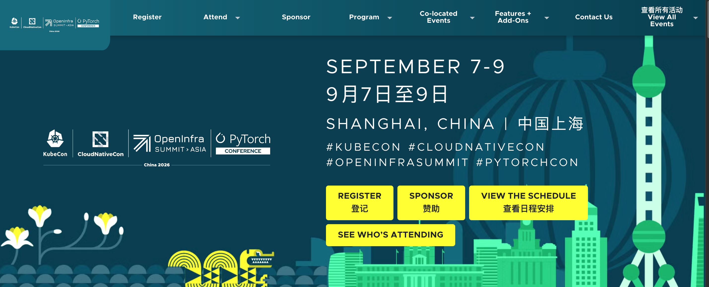

# KubeCon China 2026 参会指南：议程、门票与上海出行全攻略

KubeCon + CloudNativeCon + OpenInfra Summit + PyTorch Conference China 2026 将于 9 月 7–9 日在上海举办。

- 场馆：上海国际会议中心
- 地址：浦东滨江大道 2727 号（靠近陆家嘴地铁站）

这是 CNCF、OpenInfra、PyTorch 三大全球开源社区 **首次在中国同台** ，议程横跨 OpenStack、存储与虚拟化，到 Kubernetes 平台工程，再到 PyTorch、vLLM、推理和 Agentic AI。

这种跨度是大会最大的看点，也是最大的规划难题 —— 你可以两天全程泡在 AI 基础设施里，也可以追着项目维护者赶场，又或者只盯生产可靠性这条线，跟同事看到的完全是两个大会。

怎么破局？一句话：
**先想清楚你要解决什么问题，再用议题 Track、项目展台和走廊交流把上下游串起来。**

## 大会概览：三大社区为什么合办

这不是简单的品牌联合。生产级 AI 天然跨社区：

- **PyTorch 及相关框架** —— 模型开发与执行
- **Kubernetes** —— 服务调度、感知加速器的工作负载编排
- **OpenInfra 项目** —— 底层的计算、虚拟化、网络、存储和隔离
- **可观测性、安全、数据流动和开发者平台** —— 把上面几层粘合起来

对于已经跨过"AI Demo 能跑就行"阶段的团队，这届大会的价值尤其突出。模型在一台工作站上跑得好好的，一旦多团队抢 GPU、要数据访问、要版本化部署、要自动伸缩、要工作负载隔离、要可预测的推理延迟 —— 事情就复杂了。联合议程的好处在于：
**你能围绕一个生产问题贯穿技术栈，而不是每次出问题都甩锅给模型。**

| 社区 | 覆盖领域 |
|---|---|
| KubeCon + CloudNativeCon | Kubernetes、平台工程、运维、可观测性、网络、安全、CNCF 项目生态 |
| OpenInfra Summit | OpenStack、Kata Containers、基础设施供给、虚拟化、存储 |
| PyTorch Conference China | 训练、推理、模型系统、加速器、性能工程、开源 AI 全生命周期 |

你不需要在三个领域都是专家。关键问题是：
**哪个相邻层面正在拖你的后腿？** 平台工程师可以听 PyTorch 场次搞清楚工作负载到底在干什么，ML 工程师可以听调度和存储场次搞明白为什么部署环境和 Notebook 里表现不一样。

## 日期、场馆与日程

大会于 **2026 年 9 月 7 日（周一）至 9 日（周三）** 在上海国际会议中心举行。9 月 7 日为同场活动日，主会议程在 8 日和 9 日两天。

| 日期 | 议程 | 备注 |
|---|---|---|
| 9 月 7 日（周一） | 同场活动 | 可能需要单独注册或购买附加票 |
| 9 月 8 日（周二） | 主题演讲、分会场、教程、解决方案展示区 | 主技术会议首个完整日 |
| 9 月 9 日（周三） | 主题演讲、分会场、解决方案展示区、项目活动 | 留时间做后续交流和逛展台 |

**场馆：** 上海国际会议中心，浦东滨江大道 2727 号。官方议程使用北京时间（UTC+8），座位先到先得。

!!! tip

    出行前务必查阅最新的[活动概览](https://www.lfopensource.cn/kubecon-cloudnativecon-openinfra-summit-pytorch-conference-china/) —— 会议室、场次时间和现场流程随时可能调整。

## 门票怎么选

主会议设企业、个人、学术三类注册，按雇佣和付款状态区分，
**与技术资历无关** 。

| 类型 | 适合人群 | 晚鸟价（截至 9 月 1 日） |
|---|---|---|
| 企业 | 雇主付费，含营利性公司和政府组织员工 | $299 / ¥2,120 |
| 个人 | 未被公司雇佣、非营利/研究机构人员或自费参会 | $99 / ¥700 |
| 学术 | 全日制学生及可提供机构文件的教职员工 | $50 / ¥355 |

!!! warning

    以上价格为截至 9 月 1 日的晚鸟价，可能随时变动。购买前请在[官方注册页](https://www.lfopensource.cn/kubecon-cloudnativecon-openinfra-summit-pytorch-conference-china/register/)核实最新价格和可用性。

主会议票包含：主题演讲、分会场、教程、社交活动、解决方案展示区和项目展区入场、茶歇、会议 T 恤、按需录像。
**不自动包含 9 月 7 日的同场活动** —— 主票和附加票要分开决策。

## 按问题选 Track，按成果排日程

### 选 Track：从你的问题出发

官方议程有十多个 Track，每个都蹭一点只会得到碎片化的日程。建议选
**一条主 Track  + 一条相邻 Track  + 少量探索场次** 。

| 你要解决的问题 | 主 Track | 相邻 Track |
|---|---|---|
| GPU 利用率、分布式训练、内核或推理速度 | AI 基础设施 + 加速器与性能工程 | 硬件使能/运维与可观测性 |
| RAG、智能体、模型服务或数据管道 | AI + ML + Agentic AI + 数据系统 | 应用开发/安全 |
| 多租户 K8s 平台和开发者自助服务 | 平台工程 + 云原生架构 | 安全/运维与可靠性 |
| 私有云、OpenStack、存储和虚拟化 | 云基础设施 + 虚拟化与存储 | 网络与边缘/平台工程 |
| 供应链安全、隔离、身份或机密计算 | 安全 + 隐私与可信计算 | 云基础设施/应用开发 |
| 加入或贡献开源项目 | 社区 + 开源 + 入门指南 | 维护者 Track /项目闪电演讲 |

!!! tip

    Track 标签只是导航辅助，不是硬边界。对 AI 平台团队最相关的演讲，可能藏在存储、安全或硬件 Track 里。
    选场次前先浏览 [Linux 基金会官方 Track 描述](https://www.lfopensource.cn/kubecon-cloudnativecon-openinfra-summit-pytorch-conference-china/program/explore-the-tracks-2/)。

### 排日程：五个原则

动笔之前，先写下你希望大会回答的 **三个问题** 。比如：别人怎么公平共享加速器？突发流量下模型服务怎么扛？租户隔离从哪里切？维护者怎么测升级？有了这些问题，同一时段两场都想听的演讲就好取舍了。

1. **每场选一个锚定演讲** —— 优先跟你当前项目或决策直接相关的。
2. **留一个备选** —— 座位先到先得，满座不该让一个时段报废。
3. **塞一场跨层的** —— 跳出日常角色，理解上游或下游的约束。
4. **预留走廊时间** —— 跟维护者或从业者聊十分钟，可能比一场通用演讲更能解决你的具体问题。
5. **别为录像优化** —— 演讲后面都会发；现场时间要花在提问、建立项目联系和那些没法回放的讨论上。

用 [Linux 基金会官方日程表](https://www.lfopensource.cn/kubecon-cloudnativecon-openinfra-summit-pytorch-conference-china/program/schedule/)筛场次、排个人议程。关键场次离线保存，
**记下房间号而不只是标题** 。场馆网络拥挤或账号同步抽风时，截图能救命。

## 9 月 7 日同场活动要不要去

9 月 7 日不是主会议的"热身"，而是各有独立焦点和注册要求的独立活动。
**只有主题和受众跟你的角色匹配时才值得加** ；否则用这天赶路、做准备或开专注会议。

### AGNTCon + MCPCon China（9 月 6–7 日）

聚焦智能体技术栈：MCP 及其他协议、基础设施、编排、生产系统、安全和可观测性。适合正在做智能体系统的开发者、研究人员、维护者、平台团队和企业。需通过活动自身流程预注册。

### OSPOlogy + OSPO Summit China（9 月 7 日）

聚焦开源项目办公室（OSPO）、企业治理、LLM 和数据治理、AI 辅助软件供应链及企业开放创新。适合 OSPO 负责人、法务与合规、社区战略师，以及负责组织如何使用和贡献开源的工程管理者。

!!! warning

    别假设主会议票能直接入场。通过[官方活动站](https://www.lfopensource.cn/kubecon-cloudnativecon-openinfra-summit-pytorch-conference-china/)确认附加票状态、价格和注册路径。两个主题都想听？选跟你下季度要做的那次决策绑得更紧的那个。

## 项目展台与维护者交流

项目展区是 **亲临现场最值得的理由之一** 。项目展台让你直接面对维护者：问实现细节、了解贡献路径、判断某个项目到底适不适合你的真实约束。但前提是你得带着上下文去，而不是去要一份产品宣传册。

**到展台前准备好：**

- 一分钟说清：工作负载、集群规模、版本号、故障模式
- 把可复现的项目问题和厂商特定配置问题分开
- 问清楚维护者偏好在哪个渠道处理 Issue、设计讨论、文档修复和用户支持
- 记下相关仓库、SIG、工作组、Slack 频道或例会
- **不要** 指望维护者在公共展台帮你调试敏感生产数据

**时间节点：**

- 项目闪电演讲 —— 9 月 8 日
- 维护者 Track —— 周二和周三
- 解决方案展示区项目展台 —— 周二和周三

查阅[官方项目参与选项](https://www.lfopensource.cn/kubecon-cloudnativecon-openinfra-summit-pytorch-conference-china/features-add-ons/project-engagement/)，记下你想见的维护者什么时候在场。

DaoCloud 在 S2 主展位和多个开源项目展台都安排了工程师驻场，欢迎现场交流。

| 日期 | 展位 | 区域 | 时间 |
|---|---|---|---|
| 9 月 7 日（周一） | S2 | 主展区（布展） | 18:00–20:00 |
| 9 月 8 日（周二） | S2 | 主展区 | 10:30–13:00 / 13:00–17:30 |
| 9 月 8 日（周二） | T3 | LWS 开源展位 | 10:30–13:00 / 13:00–19:00 |
| 9 月 9 日（周三） | S2 | 主展区 | 10:30–13:00 / 13:00–15:30 |
| 9 月 9 日（周三） | S2 | 主展区（撤展） | 15:30–17:00 |
| 9 月 9 日（周三） | T7 | llm-d 开源展位 | 10:30–15:30 |
| 9 月 9 日（周三） | T8 | Spiderpool 开源展位 | 10:30–15:30 |
| 9 月 9 日（周三） | T10 | HwameiStor 开源展位 | 10:30–15:30 |
| 9 月 9 日（周三） | T13 | Kubean 开源展位 | 10:30–15:30 |

!!! tip

    DaoCloud 开源项目矩阵：[HwameiStor](https://github.com/hwameistor/hwameistor)（云原生存储）、[Spiderpool](https://github.com/spidernet-io/spiderpool)（K8s IPAM）、[Kubean](https://github.com/kubean-io/kubean)（集群生命周期管理）、[LWS](https://github.com/kubernetes-sigs/lws)（LeaderWorkerSet）、llm-d（LLM 推理调度）、[HAMi](https://project-hami.io/zh/)

    更多信息：[DaoCloud 官网](https://www.daocloud.io) ｜ [d.run 算力平台](https://d.run/)

## DaoCloud 道客：7 场技术分享与展区信息

当 AI 工作负载真正进入生产，很多问题才刚刚开始：怎么把昂贵的 GPU 调度得更高效？怎么快速找到推理变慢的真正原因？Kubernetes 又需要怎样演进，才能承载越来越复杂的 AI 工作负载？

DaoCloud 道客在本次大会带来 **7 场技术分享** ，沿三个方向展开。

=== "调度：决定 AI 推理效率上限"

    过去调度 GPU 可能只需要回答"哪台机器还有卡"，现在远远不够——GPU、NIC、NUMA、PCIe、NVLink、Fabric、网络拓扑，甚至 Prefill 和 Decode 之间的角色关系，都在影响推理任务能不能高效运行。

    **Talk 1：让 Kubernetes 真正"看懂"复杂 AI 资源**

    演讲者： **徐俊杰（Paco）** —— DaoCloud 开源团队负责人、Kubernetes 指导委员会成员

    从 Kubernetes **DRA（Dynamic Resource Allocation）** 完整架构出发，串联 v1.36–v1.37 中 DRA 相关 KEP 的最新进展。看 K8s 如何从"分配 GPU"走向
    **理解和调度复杂异构资源关系** 。结合 NVIDIA Dynamo / GB200 优化实践，展示千卡规模集群中 IMEX 分配延迟如何从分钟级压缩到秒级。

    ---

    **Talk 2：一个 Deployment，为什么越来越装不下一个 LLM 推理服务？**

    演讲者： **颜开** —— DaoCloud 首席架构师

    分布式 LLM 推理中，一个完整推理副本由跨节点、跨 GPU 的多个 Pod 共同组成，部分 Pod 调度失败不仅无法启动服务，还可能提前占住大量 GPU。到了 **P/D 解耦** 场景更复杂：Prefill 与 Decode 需独立扩缩容，还要协同调度。

    围绕 **LeaderWorkerSet（LWS）** 的最新演进，拆解 **Gang Scheduling 与 Disaggregated Set** ，看 K8s 如何让多个 Pod"要上一起上"，统一管理两组不同工作负载。

=== "诊断：推理真正棘手的是不知道为什么慢"

    GPU 利用率不低，但 TTFT 变高了——问题在 Prefill 排队？Decode？KV Cache？网络？还是 GPU 本身？这三场分享关注如何把推理系统从
    **看见异常** 推进到 **找到根因** 。

    **Talk 3：别等 GPU 跑起来之后才发现环境有问题**

    演讲者： **潘远航（Peter）** —— DaoCloud 产品副总

    基于 **LWS 的 Preflight 启动前体检机制** ，用 init-container 在推理任务正式运行前预检查计算环境、GPU 通信、RDMA 网络和运行时依赖。千卡级集群里，先把故障拦在资源占用之前，是一笔越来越现实的成本账。

    ---

    **Talk 4：TTFT 告诉你"慢了"，但不会告诉你"为什么"**

    演讲者： **刘齐均、李晖** —— DaoCloud AI 工程师

    面向 P/D 解耦推理的统一性能诊断方法，用少量高价值指标建立 
    **"指标 → 根因 → 调优动作"** 关联链路。把性能监控转化为可以直接指导 **Batch Size、KV Policy、RDMA 与拓扑优化** 的诊断体系。

    ---

    **Talk 5：从一个 Request，一路追到 GPU Kernel**

    演讲者： **陈泯全、谭建** —— DaoCloud 研发工程师

    LLM 推理端到端可观测实践：把入站流量、Inference Gateway、vLLM/SGLang、模型 Runtime 一路连接到 GPU 指标。结合三个真实问题——P99 为什么突然尖峰？GPU 看起来很忙为什么没有效工作？KV Cache 为什么突然 OOM？把数小时的问题定位缩短到分钟级。

=== "演进：AI 在推动 Kubernetes 自身变化"

    Pod 重启一定要走完整个生命周期吗？K8s 只能调度计算资源吗？算力、存储与网络还该分开管理吗？这些"老问题"到了 AI 时代变成了影响规模和效率的新问题。

    **Talk 6：5,000 个节点，重启一次为什么要等 2 分钟？**

    演讲者： **范宝发** —— DaoCloud 研发工程师

    把"首次启动"和"重新启动"放回同一个 Workload Lifecycle 中系统拆解。核心成果： **JobSet Replacement Restart 在 5,000 节点规模下，重启时间从 2 分 10 秒缩短至 10 秒**。少掉的两分钟，正是 K8s 面向大规模 AI Workload 恢复能力需要解决的问题。

    ---

    **Talk 7：如果 Kubernetes 不只调度计算，而是调度"算、存、网"呢？**

    演讲者： **蓝维洲** —— DaoCloud 高级技术主管

    **Cybertwin-based Cloud Native Network（CCNN）** 架构探索：以 Kubernetes 作为 **Network OS** ，统一虚拟化、调度和管理计算、存储与网络资源。结合零信任 Personal Agent、数据与通信 Agent、分布式协同推理等场景展开实践。当调度中心从"机器"转向"应用"，网络是否也该像 GPU 一样成为可被 K8s 动态编排的资源？

## 社交：带着问题去，而不是带着头衔去

技术大会的社交效率，取决于你的自我介绍有多具体。"我们在把批处理推理搬到 K8s 上，正在比较几种调度方案"——对方立刻知道你是谁、在干什么、可能聊什么。一串职位头衔和技术名词做不到这一点。

**社交三步走：**

1. **会前** —— 锁定几位跟你工作有交集的演讲者、维护者或团队，先读摘要或仓库
2. **会中** —— 问一个聚焦的问题，尊重对方时间
3. **会后** —— 趁热写下简短笔记说明这个联系人为什么重要，发送承诺的后续跟进

官方 FAQ 推荐加入 CNCF Slack 工作区及其走廊频道。现场活动还有欢迎招待会、女性聚会、同辈导师活动和 PyTorch 社区之夜。部分活动有人数限制或需要 RSVP，出发前查一下[会议体验页](https://www.lfopensource.cn/kubecon-cloudnativecon-openinfra-summit-pytorch-conference-china/features-add-ons/experiences/)。

## 随身携带清单

两个密集技术日，满场馆平行对话。轻装上阵，带一套靠谱的笔记系统，比背一个"移动办公室"强。

| 物品 | 说明 |
|---|---|
| 注册确认和身份证件 | 旅行和入场文件的本地 + 离线副本 |
| 笔记本电脑（按需） | 手机或平板可能就够；笔记本增加重量和充电负担 |
| 充电宝和数据线 | 日程、消息、翻译、地图全靠电量 |
| 可重复使用水瓶 | 长时段会议，补水提升专注力 |
| 名片或二维码联系卡 | 让分享职业档案变得简单 |
| 薄外套和舒适鞋 | 室内温差和步行距离都可能很大 |
| 简短技术问题清单 | 带上项目版本和非敏感架构上下文 |

!!! danger

    不要因为"可能聊到工作"就带上生产凭据、不受限的 kubeconfig、私有数据集或机密架构图。按组织安全政策使用脱敏示例和受限出差设备。

## 上海出行攻略

**场馆位置：** 上海国际会议中心，浦东滨江大道 2727 号。

**机场距离（官方估算）：**

| 出发地 | 公路距离 | 备注 |
|---|---|---|
| 浦东国际机场（PVG） | 约 55–60 km | 行程时间取决于路况 |
| 虹桥国际机场（SHA） | 约 18–20 km | 同上 |

别在航班或高铁落地后立刻排关键场次， **留足抵达余量** 。

官方会议酒店预订已关闭。订替代住宿时比三样东西：位置、取消条款、实际的早间通勤路线。一间便宜但需要赌路况跨城的房间，可能因为错过场次和消耗精力反而更贵。用中英文核对地址，离线保存，参考[官方场馆与出行指南](https://www.lfopensource.cn/kubecon-cloudnativecon-openinfra-summit-pytorch-conference-china/attend/venue-travel/)。

**国际访客出发前确认：**

- 护照有效期和入境要求
- 支付方式（移动支付在国内几乎全覆盖，国际卡不一定通用）
- 移动网络连接（eSIM 或本地 SIM 卡）
- 工作所需工具的访问

!!! tip

    如需签证支持信，走活动的官方申请流程，别用通用邀请模板。

## 会后实践：把笔记变成实验

"以后再说" —— 这句话杀掉的会议灵感比什么都多。

**一周内** ，挑一个想法，把它压成一个可测试的问题：比较两种 Ingress 配置、复现一个可观测性模式、部署一个小型模型服务、评估沙盒边界、或者在故障注入下测存储行为。记清楚软件版本、假设、命令、指标和回滚步骤。

笔记本 VM 或现有一台服务器，对很多首次实验来说就够了。如果你想要一个可复用的多节点环境，紧凑型集群构建示例展示了如何用小型 x86 节点搭建分布式系统学习环境。

对于专用测试节点，ZimaBoard 2 可以跑轻量级 K8s 服务、本地镜像仓库、可观测性工具或共享实验存储，而不需要主力笔记本一直开着。它 **不是** 大型 PyTorch 训练所需 GPU 基础设施的替代品 —— 把它用在与资源匹配的控制面和服务层上，加速器密集型工作放到合适的硬件上。

## 参会规划清单

=== "注册前"

    - [ ] 确认注册类型：企业/个人/学术
    - [ ] 判断 9 月 7 日同场活动是否服务于实际目标
    - [ ] 核查签证、出行和雇主审批
    - [ ] 了解取消、替换和文档政策

=== "出行前"

    - [ ] 排好个人议程，每个重要时段备一个 Plan B
    - [ ] 标记相关的项目展台、维护者和演讲者
    - [ ] 离线保存场馆地址、注册确认和议程
    - [ ] 清理出差设备上的多余凭据和敏感文件
    - [ ] 准备三个问题和一段简洁的自我介绍

=== "活动后"

    - [ ] 两个工作日内发出承诺的链接和后续消息
    - [ ] 按决策/实验/人物/资源分组整理笔记
    - [ ] 看现场错过的场次录像
    - [ ] 把一个想法变成有文档记录的可复现测试
    - [ ] 跟团队分享发现，而不是转发一堆 PPT

## 常见问题

??? "大会的官方名称是什么？"

    KubeCon + CloudNativeCon + OpenInfra Summit + PyTorch Conference China 2026。整合了 CNCF、OpenInfra 和 PyTorch 三大社区内容。

??? "什么时间举办？"

    2026 年 9 月 7–9 日。9 月 7 日为同场活动日，主题演讲、分会场、教程和解决方案展示区在 8–9 日。

??? "在哪里举办？"

    上海国际会议中心，浦东滨江大道 2727 号。

??? "有线上参与方式吗？"

    没有实时虚拟组件。主题演讲和分会场录像将在活动后两周内发布到 CNCF YouTube 频道。

??? "演讲用中文还是英文？"

    既有本地也有国际讲者。官方 FAQ 表示主题演讲和分会场将提供翻译字幕。具体语言选项查看各场次详情和现场指南。

??? "主会议票包含同场活动吗？"

    不包含。主注册包含会议内容和解决方案展示区，但不自动包含同场活动。需单独确认 9 月 7 日活动的注册或附加票。

??? "谁符合个人票资格？"

    当前不在公司工作的人、非营利或研究机构人员、或自费参会者。申请需审核，可能要求补充信息。

??? "初学者能参加吗？"

    可以。"社区 + 开源 + 入门指南" Track 部分专为新人、学生、转行者和初学者设计。建议先定少量主题，别试图一口吃下所有项目。

??? "AI 工程师在 PyTorch 和 K8s 场次之间怎么选？"

    从工作流瓶颈出发。模型执行和性能问题选 PyTorch/推理/加速器场次；部署和运维阶段的问题选 K8s/平台/存储/安全/可观测性场次。

??? "场次会录吗？"

    会。官方日程表示两周内上线 CNCF YouTube 频道。所以现场优先参加讨论，冲突场次后面看录像。

??? "热门场次提前多久到场？"

    座位先到先得，需求难预测。上一场活动留足时间赶到下一间会议室，并备一个邻近的 Plan B。

??? "在项目展台该问什么？"

    带一个聚焦的、非敏感的问题，附上项目版本、工作负载上下文和已测试内容。问清楚项目在哪个渠道处理用户支持、issue、设计讨论和贡献，让对话能在正确渠道延续。

??? "提供无障碍和饮食支持吗？"

    提供包容性和无障碍指南、翻译字幕及多种饮食选项。特殊需求尽早通过官方流程提交，部分安排无法现场临时处理。

??? "PyTorch Conference China 只面向模型研究人员吗？"

    不是。联合议程还覆盖推理、生产系统、加速器、平台工程、数据基础设施、可观测性和部署。ML 工程师、系统工程师、平台团队和基础设施架构师都能在其中追踪 AI 生命周期的不同环节。
