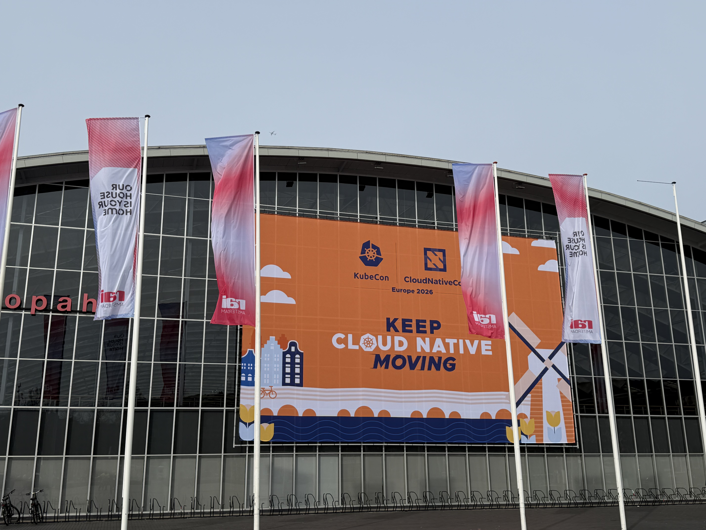

# KubeCon Europe 2026 见闻录：当 Kubernetes 成为 AI 时代的操作系统

时间：2026 年 3 月 23–26 日

地点：荷兰阿姆斯特丹 RAI 国际会展中心



如果要用一句话概括今年的 KubeCon Europe，那就是：
**Kubernetes 正在从“云原生基础设施”，演进为“AI 时代的生产底座”。**

## 现场：不只是人多，而是“范式在变”

KubeCon Europe 2026 官方给出的参会规模是 **12,000+ 人** 。但真正到现场，数字只是一个抽象概念
——更直观的感受是：
**每一个热门议题门口都在排队，每一个房间都在满负荷运转。**


尤其是在 co-located events day（3 月 23 日），从
Agentics Day、Cloud Native AI + Kubeflow Day、CiliumCon、Platform Engineering Day 到 WasmCon，几乎所有会场都呈现出一个共同特点：

- **AI 相关议题 = 爆满 + 排队 + 站票**

这背后不是简单的热点转移，而是一个更深层的变化：

* Kubernetes 不再只是容器编排
* 而是开始承载 **推理（Inference）/Agent/AI Workflow/AI Ops**
* 并逐步成为 **AI 基础设施的统一抽象层**

## DRA：AI 时代资源调度的关键拼图

如果说 AI 让 Kubernetes “变重”，那 **DRA（Dynamic Resource Allocation）** 就是在解决“怎么承载”的核心问题。

### 演进路径（非常关键）

* 2019：Intel & NVIDIA 开始讨论
* 2022：Kubernetes v1.26 引入 Alpha
* 2024：

    * v1.30 重构结构化参数
    * 成立 Device Management WG
    * v1.32 进入 Beta

* 2025：**正式 GA（成熟）**

DRA 的本质，是让 Kubernetes **原生支持异构加速资源（GPU/TPU/FPGA 等）的声明、分配与共享** 。

### 为什么 DRA 很重要？

在 AI 场景下，资源不再是简单的 CPU/内存，而是：

* GPU 显存碎片化
* 多租户共享加速卡
* 不同拓扑（NVLink/RDMA）
* 推理阶段的动态资源需求

DRA 提供了一种标准化方式来描述这些复杂性，从而避免：

> “每家公司一套调度逻辑，每个平台一套资源模型”

这也是 Kubernetes 能否真正成为 **AI 基础设施统一控制面** 的关键。

## AI Conformance：Kubernetes 开始“定义 AI 标准”

另一个非常重要但容易被低估的信号，是 **Kubernetes AI Conformance Program** 。

这是由 Cloud Native Computing Foundation 推出的 AI 能力认证体系，其定位类似于 Kubernetes Conformance，但面向 AI 场景。

### 核心设计

* 基于 Kubernetes Conformance
* 覆盖：

    * DRA/加速器
    * 推理网络
    * 调度与编排
    * 可观测性/安全

* 引入 **KAR（Kubernetes AI Requirements）**

  * 类似 KEP
  * 分为 MUST/SHOULD

### 一个关键事实

DaoCloud 已在 2025 年 10 月完成认证，其 DCE 5.0 成为：
**国内首个通过 Kubernetes v1.33 AI Conformance 的企业级平台**

这件事的意义不只是“通过认证”，而是：
**AI 基础设施开始进入“标准化竞争阶段”**

未来比拼的，不再只是功能，而是：

* 是否符合标准
* 是否具备可移植性
* 是否具备跨环境一致性

## 推理：下一阶段的核心战场

在本次大会中，一个非常明确的趋势是：
**训练已经不是焦点，推理（Inference）才是主战场**

Kubernetes 社区正在推进的方向（1.36 规划）包括：

* KAR-0010：高性能 Pod-to-Pod 通信
* KAR-0011：高级推理入口（Inference Ingress）
* KAR-0041：解耦推理（Disaggregated Inference）

并且开始推动 **自动化 Conformance 测试** ：

```bash
go test -v ./test [-run <TestName>] \
  [-kubeconfig=<path>] [-accelerator-type=<type>]
```

这说明：
**Inference 正在从“工程实践”，走向“标准能力”**

## 一个被反复提及的问题：Inference Scaling

几乎所有 AI 相关议题，都绕不开一个核心问题：
**如何在 Kubernetes 上做大规模推理？**

难点非常集中：

### 请求负载的不确定性

* Token 数不固定
* 推理时间差异极大
* 强资源依赖（GPU affinity）

### 多租户 + SLO

* 延迟敏感
* 流量波动大
* 资源争抢严重

### 异构硬件管理

* GPU/TPU/不同架构
* 不同互联方式（NVLink/RDMA）

### KV Cache（关键瓶颈）

* 分布式缓存管理
* 命中率直接决定成本

### 推理流程拆分

* Prefill 与 Decode
* 多节点协同

这也是为什么你会看到各类推理调度框架开始频繁出现：

* **llm-d**
* **LWS Operator**

## 模型生态：从“开源模型”到“Agent 时代”

短短几年，AI 模型生态经历了三次跃迁：

1. 基础模型爆发（2022）：LLaMA、Falcon、Mistral 等
1. 多模态 + 大模型（2023–2024）：Qwen、Gemma、Phi、DeepSeek
1. 推理与 Agent（2025–2026）：DeepSeek R1/V3、Kimi K2、GPT-OSS、GLM-4.x

### 当前趋势（2026）

**Agentic Systems（代理系统）已成为主流**

特点：

* 多轮交互
* 超长上下文
* 工具调用
* 高 token 消耗

这直接带来一个结论：
**Kubernetes 必须支持“持续推理 + 高吞吐 + 低延迟”**

## 七、DaoCloud 的两场分享：一个向外，一个向内

在 AI 大趋势下，DaoCloud 的两场分享非常具有代表性。

### 边缘方向：KubeEdge

**主题：工业与边缘场景**

演讲者：Hongbing Zhang


核心内容：

* 边缘节点管理架构
* 多行业落地（IIoT/城市/零售）
* 社区治理与认证体系

关键信号：
**Kubernetes 正在从云走向边缘**

### 网络与调度：AI 集群的底层能力

演讲者：Weizhou Lan

核心议题：

* 拓扑感知调度（Topology-aware scheduling）
* RDMA + GPU 网络优化
* 大规模仿真（KWOK）

关键问题：

* 多层网络拓扑（scale-up + spine-leaf）
* GPU 最优通信路径
* 大规模验证成本

本质上，这场分享解决的是：
**AI 集群“能不能高效跑”的问题**

## Kubernetes：过去几年到底变了什么？

如果把时间线拉长，会看到 Kubernetes 正在发生结构性变化：

* **1.30**：ProvisioningRequest + Kueue
* **1.31**：Autoscaler 提前感知扩缩容
* **1.32**：引入 DRA（实验）
* **1.34–1.35**：CapacityBuffer
* **1.35**：DRA 生产可用

总结成一句话：
**Kubernetes 正在补齐“资源调度 + AI 工作负载”的关键能力**

## 四个最值得关注的方向

结合现场观察，可以总结出四条主线：

1. Agent/MCP/Agentic Infrastructure

    AI 从模型 → 系统

1. AI 开发 & AIOps

    AI 重构软件工程流程

1. AI-Native Networking

    网络开始“理解 AI”

1. 平台工程/边缘/安全

    Kubernetes 走向企业级深水区

## 结语：新的竞争已经开始

KubeCon Europe 2026 给出的信号非常明确：
**未来的竞争，不再是单点技术，而是系统能力的竞争**

包括：

* 云原生底座（Kubernetes）
* AI 能力（Inference/Agent）
* 边缘延展（Edge）
* 企业治理（Multi-tenancy/Security）

而在这条主线上，我们已经能看到一些领先者：

DaoCloud 的路径非常典型：

* 向外：边缘、社区、生态
* 向内：调度、网络、资源治理

这不是两条线，而是一个闭环。

KubeCon Europe 2026 才刚刚开始，但趋势已经足够清晰：
**Kubernetes，正在成为 AI 时代的“操作系统”。**
