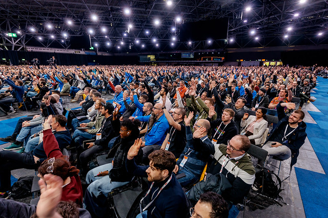
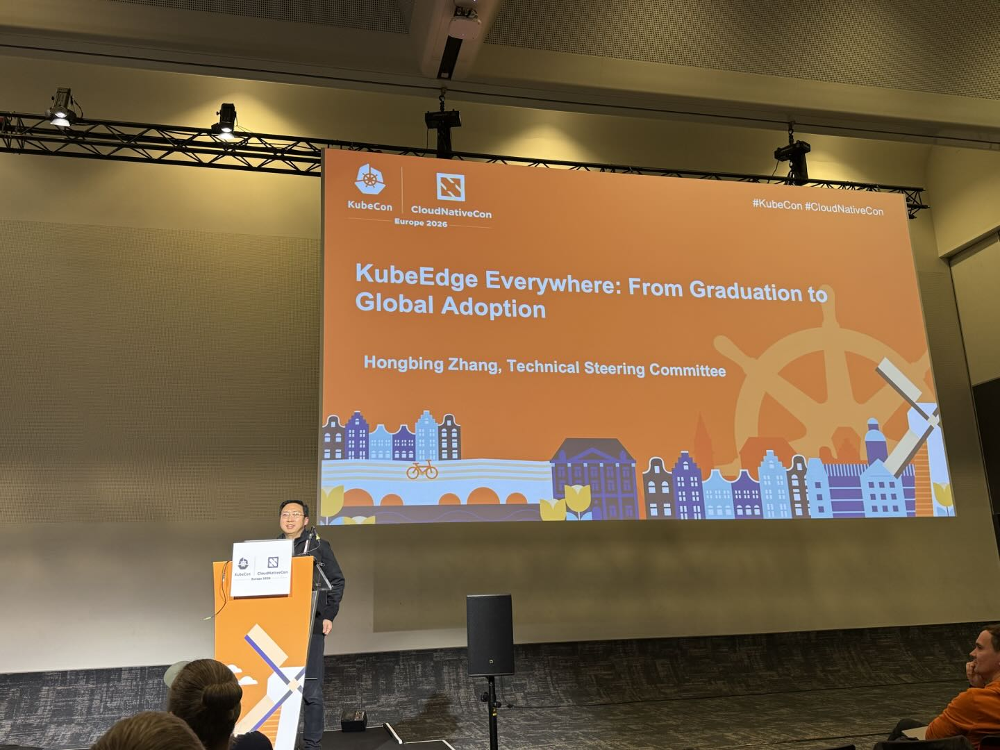
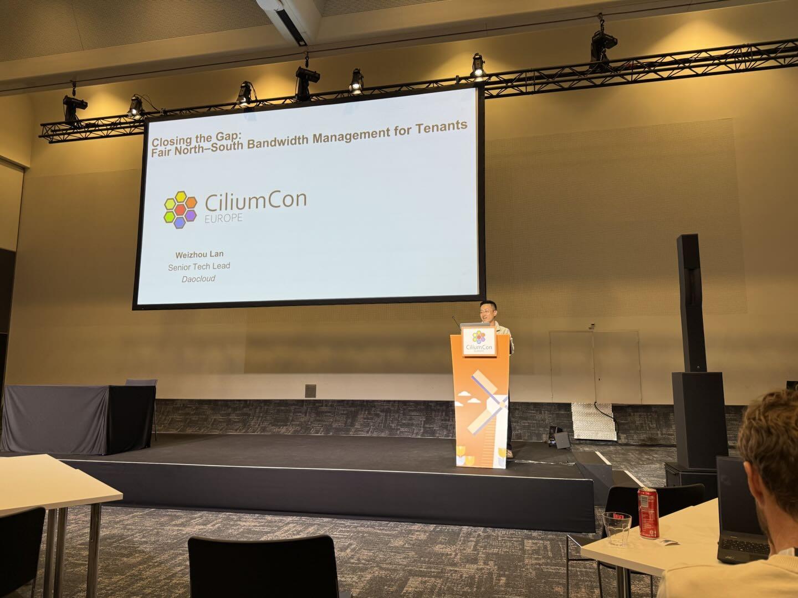
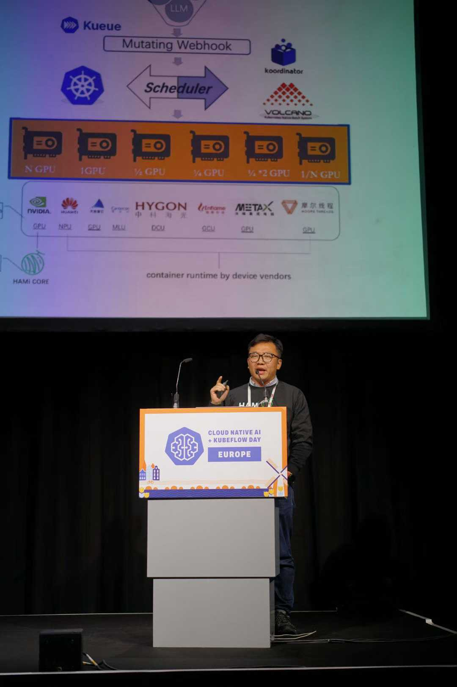
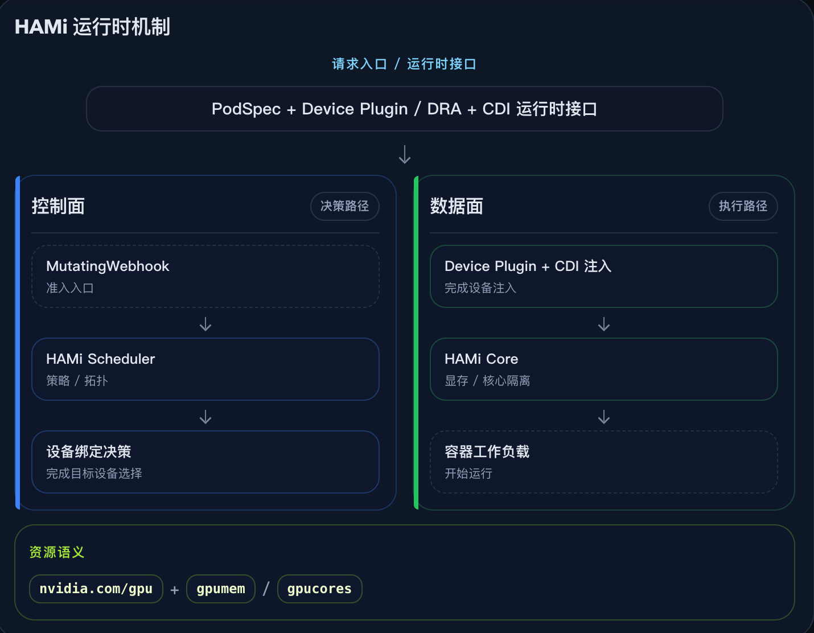
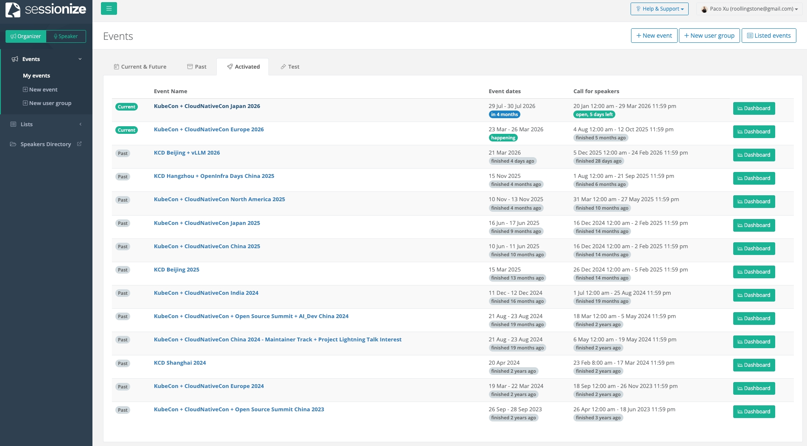
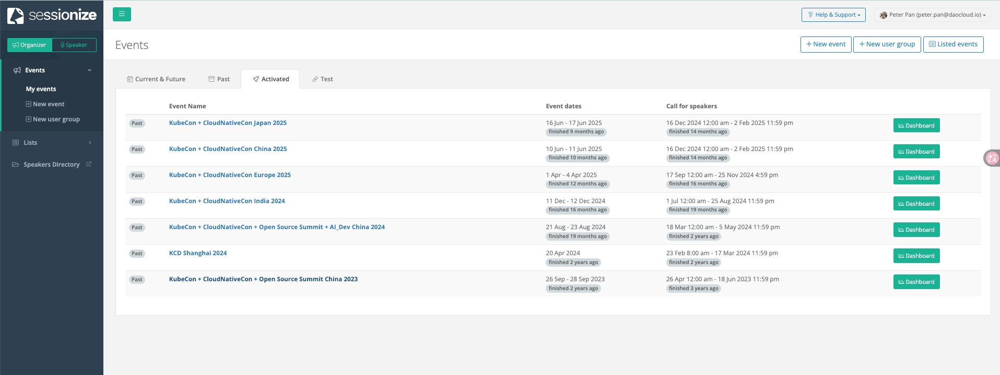
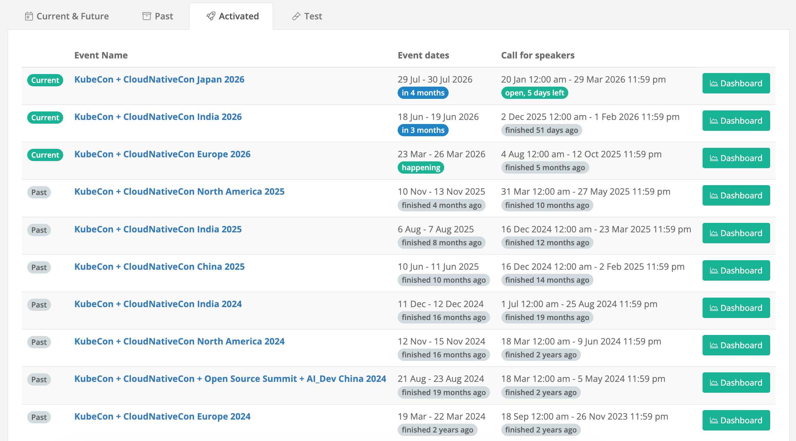

# DaoCloud 在 KubeCon 2026：勾勒 AI 基础设施的关键路径

- 时间：2026 年 3 月 23–26 日  
- 地点：荷兰阿姆斯特丹 RAI 国际会展中心  

从体感来看，今年 KubeCon Europe 2026 现场规模大约在 **1.3 万人左右** ，并且很可能再次刷新历史记录。
根据公开资料，Linux Foundation 年报显示，2025 年伦敦站 KubeCon + CloudNativeCon Europe 已经超过 12,500 名参会者，而今年的欧洲站正在持续刷新 KubeCon 参会人数的上限。

但比“人数”更重要的，是 **人群结构的变化** 。过去，KubeCon 的主力人群集中在：

- Kubernetes
- 平台工程
- 服务网格
- 可观测性
- Runtime/容器技术

而今年，一个非常明显的变化是：
**AI 基础设施相关人群正在大规模涌入** 。包括：

- AI Infra
- 模型部署和服务
- GPU 调度与资源管理
- 模型推理平台
- Agent Runtime

这让 KubeCon 的整体气质发生了显著变化：它依然是云原生大会，但正在快速演变为 **Cloud Native + AI 的“系统级集成现场”**

这也解释了为什么今年 Keynote 的热度如此之高，并不是“AI 被刻意强化”，而是整个社区已经真实进入这个阶段。

今年 keynote 的核心，不是“AI 来了”，而是“AI 开始系统化了”。

## Speaker

DaoCloud 共有 3 名 Speaker 远赴欧洲 KubeCon 宣讲云原生和 AI 底层技术。

### Kay Yan

Kay 是 DaoCloud 联合创始人之一，牵头负责 DaoCloud 产品研发中心。

他演讲的主题是：可感知的 KV Cache 优化 —— 在 Kubernetes 上构建 AI 感知的 LLM 路由（Tutorial: KV-Cache Wins You Can Feel: Building AI-Aware LLM Routing on Kubernetes）

每个 LLM 请求都会携带一种不可见的状态：KV-cache。命中它，你的响应成本可降低 10 倍、速度提升 50 倍；
未命中，则意味着你在重复计算刚刚做过的工作。然而，Kubernetes 的默认负载均衡对缓存是“无感知”的，
它会将相关请求分散到不同的 Pod 上，破坏了局部性。结果是什么？你的 AI 工作负载比应有的更慢，而且成本大幅增加。

在本次动手实践的教程中，我们将解决这个问题。

参与者将部署一个分布式的 vLLM 集群，对其性能进行基准测试，并可视化缓存无感知路由如何浪费 GPU 计算资源。
随后，我们将用 Kubernetes Gateway API（Inference Extension）替换默认的 Service，并部署 llm-d
——一个原生于 Kubernetes 的分布式 LLM 推理框架，内置具备 AI 感知能力的调度器。通过重新运行相同的基准测试，
你将看到随着前缀复用成为一等公民，延迟和吞吐量如何发生转变。最终，你将获得一个可运行的实验环境、可视化仪表盘，
以及一套将缓存感知路由构建到任意生产级 AI 技术栈中的思维模型。

Kay Yan 作为 llm-d 维护者之一，受邀参加了 Maintainer Summit。

### Hongbing Zhang

Hongbing 是 DaoCloud 生态体系建设和 IPO 工作的负责人

他演讲的主题是：利用 KubeEdge 解决工业挑战：项目毕业后的发展报告（Solving Industrial Challenges With KubeEdge: A Post-Graduation Report）

随着 KubeEdge 在 CNCF 完成毕业，KubeEdge 已稳固其作为将 Kubernetes 扩展至边缘场景的领先平台地位。
在本次演讲中，项目维护者将回顾 KubeEdge 的演进历程，并深入解析其核心架构，展示其如何实现对边缘工作负载的高效管理。

参会者将从多个行业的真实落地案例中获得洞见，包括智慧城市、工业物联网（IIoT）、边缘 AI、机器人以及零售等领域。
除了成功实践分享之外，本次演讲还将涵盖关键技术更新，包括新引入的 KubeEdge 一致性合规测试
（Certified KubeEdge Conformance Test）、最新技术进展，以及社区治理方面的最新动态。

### Weizhou Lan

Weizhou 是 DaoCloud 网络专家和团队负责人，这几年在国内外的 KubeCon 上都能看到他演讲的活跃风姿。

他演讲的主题是：让拓扑感知调度真正落地：从大规模发现到大规模仿真
（Making Topology-Aware Scheduling Practical for AI Workloads: From Discovery to Simulation at Scale）

在大规模 AI 推理集群中，多租户工作负载既需要高效的 GPU 利用率，也依赖动态的 RDMA 网络。
然而，异构 GPU 互连技术不可避免地会形成多层级网络拓扑，例如 scale-up 网络以及 RDMA spine–leaf 架构。

这些多样化的拓扑带来了若干挑战：首先，是跨多个层级（包括 scale-up、RDMA spine 和 RDMA leaf）的动态拓扑发现与健康检测；
其次，是具备拓扑感知能力的调度，需要支持基于优先级的资源放置，并确保 GPU 能够利用最优通信路径；
第三，是大规模验证问题，需要通过低成本方式模拟多层级的大规模拓扑，而不是依赖昂贵的硬件环境。

在本次分享中，将介绍一种实用的拓扑发现方法，帮助 Kueue 实现拓扑感知调度，并展示如何利用
KWOK 模拟具备多层级拓扑的成千上万个虚拟节点，从而在零硬件成本的前提下完成大规模验证。

随着 AI 的快速发展，Kueue 这一类项目的重要性明显上来了。以前很多人会把它看成批处理排队工具，但放到今天的 AI 场景里，
它的意义就完全不一样了。因为一旦进入 GPU 紧张、推理负载波动、多租户竞争的环境，Kubernetes 需要的就不只是调度，
而是排队、公平性、quota、组织级治理能力。从这个角度看，Kueue 不是边缘配角，反而越来越像 AI 时代 Kubernetes 的关键基础设施之一。

Weizhou Lan 还在现场受邀参加了 NVIDIA 组织的 GTC 闭门会议。

## DaoCloud 参与的核心项目与趋势判断

DaoCloud 在以下几个项目都有多名维护者深度参与，贡献核心代码，引领开源社区的建设。

### Kubernetes：正在演变为 AI 操作系统

Kubernetes 正在从“云原生应用底座”，演进为“AI 系统与 Agent 系统的通用操作系统”。

它一头连接的是 GPU、调度、资源治理、集群运行时、可复现交付；
另一头连接的是 inference、agent、平台运维自动化、真实设备接入，以及 AI 进入生产环境后的组织化运营。

所以 Kay Yan 从 keynote 走出来，最大的感受不是“又看了一堆 AI 演讲”，而是更明确了一件事：

未来几年，云原生最重要的增量，不一定来自传统应用，而很可能来自 AI。
而 AI 要真正落地，最终依赖的也不只是模型本身，而是背后那套越来越复杂、越来越关键的系统工程。
在这件事上，Kubernetes 不是旁观者，而正在成为主舞台。

Kubernetes 近几个版本的关键能力演进：

- v1.30.0 实现了 ProvisionRequest API v1beta1，集成了 Kueue。
- v1.31.0
    - ProvisionRequest API 进阶至 v1
    - 集群 Autoscaler 能够提前感知扩缩容
- v1.32.0 引入 DRA（实验
- v1.34.0 实现了 CapacityBuffer API v1alpha1
- v1.35.0
    - 实现了 CapacityBuffer API v1beta1
    - 扩缩容时支持设置 CSI 卷限制
    - DRA 达到生产可用状态

### llm-d 从“前沿探索”走向“主舞台问题”

据现场 Kay Yan 的真实感受，“今天 keynote 最强烈的一个感受，不是 AI 很热这么简单，而是 llm-d 代表的那套问题意识，已经真正进入了大会主舞台。虽然台上未必每一分钟都在反复念 llm-d 这三个字，但从共享 GPU 调度、AI optimized and reproducible、AICR，到从 inference 走向 agents，大家讨论的其实都是同一件事：大模型进了生产环境之后，云原生到底怎么把它组织起来、调度起来、治理起来、稳定起来。”

llm-d 不再只是一个圈内人讨论的前沿方向，而是开始被放到更大的云原生叙事里理解。

因为 llm-d 背后真正关心的，从来都不只是某个组件，而是整套生产系统问题：

- 模型请求如何路由
- 共享 GPU 怎么调度
- inference workload 如何弹性扩缩
- 多租户下如何治理资源
- 系统怎么做到 reproducible
- AI workload 怎么接入更上层的 agent runtime

而今天 KubeCon 主舞台上的内容，几乎都能映射到这些问题上。

所以 Kay Yan 会觉得，今年 keynote 真正重要的，不是哪个厂商又讲了一个新的 AI 概念，而是整个社区已经开始围绕“LLM production system”形成共识。 Kubernetes 在这里面的角色，也不再只是“底层编排器”，而是在逐渐变成 AI 系统的 control plane。

这也是 llm-d 为什么会在今天显得格外重要。它代表的不是一个单点功能，而是一种更完整的云原生 AI 方法论。

### HAMi 轻松调度异构 GPU

[HAMi](https://project-hami.io/zh/) 是 DaoCloud 作为重要发起方开源到 CNCF 社区的项目，
是云原生 GPU 虚拟化中间件，为 AI 工作负载提供异构加速器的共享、隔离与调度能力。

作为近两年 CNCF 新进的 Sandbox 项目之一，有幸在本次 KubeCon 的 Keynote 上展露头角。

从请求到隔离执行，HAMi 将 GPU 切分与异构调度组织成可落地的 Kubernetes 运行时链路。

### AI Conformance

另一个非常重要但容易被低估的信号，是 **Kubernetes AI Conformance Program** 。
这是由 CNCF 推出的 AI 能力认证体系，其定位类似于 Kubernetes Conformance，但面向 AI 场景。

* 基于 Kubernetes Conformance
* 覆盖：
    * DRA/加速器
    * 推理网络
    * 调度与编排
    * 可观测性/安全
* 引入 KAR（Kubernetes AI Requirements）
    * 类似 KEP
    * 分为 MUST/SHOULD

DaoCloud 已在 2025 年 10 月完成认证，其 DCE 5.0 成为：
**国内首个通过 Kubernetes v1.33 AI Conformance 的企业级平台**

这件事的意义不只是“通过认证”，而是：
**AI 基础设施开始进入“标准化竞争阶段”**

未来比拼的，不再只是功能，而是：

* 是否符合标准
* 是否具备可移植性
* 是否具备跨环境一致性

## DaoCloud 幕后工作

DaoCloud 有多位开发者积极参与 KubeCon Program Committee，受邀评审 KubeCon 的各项议题。此处仅摘选几位，并未穷举罗列：

- Paco Xu 作为国内唯一入选 Kubernetes Steering Committee 的成员，除了评审 KubeCon 议题外，还多次作为 Co-Chair 和 Track Chair 总领最终审核工作

    

- Peter Pan 作为 DaoCloud 研发总监，多次以资深 AI 技术专家受邀参与 KubeCon 各项议题的评审

    

- Michael Yao 作为 CNCF 社区的深度贡献者，也多次受邀参与 KubeCon Emerging + Advanced 等 Track 的议题评审

    

## 小结

如果用一句话总结今年的 KubeCon Europe：
**这不再是一场“云原生大会”，而是一场“云原生 + AI 系统工程大会”**

变化的本质不是技术热点，而是 AI 系统边界正在被重新定义。

## 相关链接

- [KubeCon CloudNativeCon Europe 2026 议程](https://events.linuxfoundation.org/kubecon-cloudnativecon-europe/program/schedule/)
- [llm-d：这是 Kubernetes 原生的高性能、分布式 LLM 推理框架](https://llm-d.ai/)
- [HAMi：运行在 Kubernetes 上的异构 GPU 共享](https://project-hami.io/zh/)
- [Kueue：基于 Kubernetes 的作业队列系统，适用于批处理、HPC、AI/ML 和类似应用](https://kueue.sigs.k8s.io/)
- [KWOK：是个一个 Kubernetes 测试神器，几秒内构建成千上万个虚拟节点](https://kwok.sigs.k8s.io/)
- [ClawWork：已收获 OpenClaw 维护者 Frank Y 的关注](https://github.com/clawwork-ai/ClawWork)
