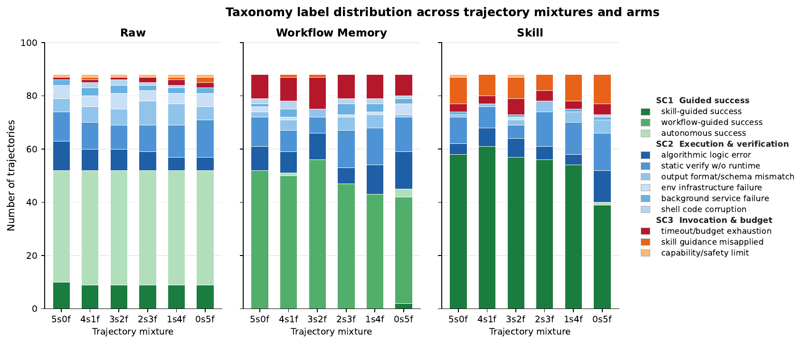
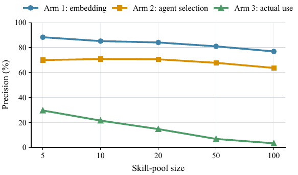

# Agent 技能揭秘：为什么有效，什么时候会失效？

聊到智能体，"技能"是个绕不开的词。

简单说就是把各种操作经验打包成可复用的"技能包"，让 Agent 在执行任务时可以随时调用，听起来很美好。
但很少有人追问一个更根本的问题：
**技能到底为什么有用？它只是"把经验存起来再取出来"这么简单吗？**

普林斯顿、斯坦福、UC San Diego 几所大学的研究者最近发了一篇论文
[《Demystifying Agent Skills》](https://arxiv.org/html/2608.14036v1)，专门讲述这件事。

他们做了 8,135 次对照实验，分析了 240 条完整轨迹，最后总结出三大类、十二种技能作用模式。结论挺反直觉的。


上图是他们的核心实验设计：把同一份历史经验，分别以"原始轨迹"和"蒸馏后的技能"两种形式喂给 Agent，
然后在相同任务上比谁做得好。所有实验都在固定的 Docker 环境里跑，保证公平。

## 核心发现：技能靠的是"锚定"，不是"知识"

研究最意外的发现是：技能之所以有用，**主要不是因为补充了新知识，而是因为提供了"程序锚定"**。

数据说话：65.7% 的技能效用来自程序锚定，而真正的"知识注入"只占 4.5%。剩下的是执行层纠错、上下文压缩之类的辅助作用。

什么意思？打个比方：Agent 做任务就像新手走迷宫。它不笨，推理能力在线，但每一步都可能走偏、绕路、撞墙。

技能的作用，不是给它一张写满知识点的地图，而是在迷宫的关键岔路口立上指示牌：先往左，再直走，第三个路口右转，走不通就退回来试另一条。

说白了，技能不是让 Agent 变聪明，而是让它变稳。

## 为什么"稳"比"聪明"更重要

很多人觉得 Agent 不行是因为模型不够聪明。但真到了工具使用的场景里，失败大多不是智商问题，是执行层面的反复试错。

比如环境配错了，试了三遍才找对依赖版本；命令参数记错了，来回调；输出格式跟验证器对不上，改来改去；工具调用顺序反了，前面白忙活；甚至忘了做验证，到最后才发现结果不对。

这些事单独拎出来都不大，但堆在一起就是大量 Token 浪费、超时失败、甚至方向走偏。

研究对比了"直接注入原始轨迹（工作流记忆）"和"提炼成技能"两种方式，结论是技能比工作流记忆平均提升 6.06 个百分点。
原因很直观：原始轨迹里虽然有正确答案，但也夹杂了大量探索噪声、失败分支和冗余过程——这些噪声反而会干扰 Agent，甚至把它带偏。

技能做的事情，就是把"有用的步骤"从"嘈杂的过程"中蒸馏出来，变成可以稳定复用的执行脚手架。



这张图很直观。三组对比：左边是裸奔的 Agent（Raw），中间是直接塞原始轨迹（Workflow Memory），右边是给蒸馏后的技能（Skill）。

一眼就能看出来，右边 Skill 组的深绿色（技能引导成功）比另外两组高一大截，蓝色系的执行失败明显少很多。这就是程序锚定的视觉证据。

## 真实的技能长什么样

说起来可能还是有点抽象，举几个我们内部正在用的技能例子，你就能感受到"程序锚定"到底是什么意思。

### 排查 Pod 问题，再也不用瞎试了

做云原生的人都知道，Pod 挂了是日常。但排查这件事，人和人的差距特别大。

新手上来可能直接 `kubectl logs`，看了半天日志没头绪，又去 describe，再不行上节点查 kubelet，
折腾半小时发现就是个镜像拉取失败——这种事我们都干过。老工程师就不一样了，上来先 `describe` 看 Events，十有八九一眼就能定位。

技能干的事，就是把老工程师那套"肌肉记忆"固化下来：先看 Events，再看探针，然后查日志，最后下沉到节点。
每一步看什么、什么情况算异常、哪些信号最容易被忽略——全都写清楚。

结果就是 Agent 不用再像新手一样东试试西碰碰，按流程走，最快路径找到根因。

### 镜像优化，不用每次从零开始

另一个我们用得很多的技能是 Dockerfile 优化。

这件事说难不难，说简单也不简单。你说 Agent 不知道多阶段构建吗？它当然知道。但真上手写的时候，还是会犯各种错：
缓存清理放在单独的 RUN 里等于白清、`COPY . .` 放前面导致每次改代码都重装依赖、盲目用 alpine 结果遇到 musl 兼容性问题……

这些坑，踩过一次就知道了。但 Agent 每次都是"第一次"踩。

技能的作用，就是把这些踩过的坑提前标注出来。就像老司机带新手走山路，哪个弯容易出事、哪段路容易落石，提前提醒一声。不用每次都自己摔一遍才长记性。

### Token 成本分析，从月底看账单变成实时可控

还有一个跟 Token 工厂关系很近的技能——Token 成本分析。

很多团队用大模型，一开始就是"先跑起来再说"，到月底一看账单吓一跳：怎么花了这么多？然后开始拍脑袋砍用量。

但其实成本优化是有章法的：先按应用和团队拆用量，找到 Top N 消耗场景，再看哪些任务能用小模型替代，
最后建立预算告警。这套流程走下来，通常能砍掉 30%-50% 的无效消耗，还不影响业务。

技能就是把这套分析路径固化下来，让 Agent 不用从零开始摸索"怎么降成本"，直接按步骤走，
该看的数据、该对比的指标、该出的建议，一步都不会漏。

## 技能文件长什么样

说了这么多，技能文件到底长什么样？举个最简单的例子——网页截图。

Agent 要截图的时候，如果没有技能，它可能会自己摸索用什么工具、参数怎么写、要不要滚页面，折腾好一会儿。有了技能就不一样了，直接照着走：

```markdown title="SKILL.md"
# 网页截图技能

## 什么时候用

需要给网页截图的时候。

## 怎么做

1. 用 `navigate()` 打开目标网页，等页面加载完
2. 用 `setViewport()` 设好窗口大小（默认 1280x800）
3. 用 `screenshot(fullPage=true)` 截整页，存成 PNG

## 注意别踩坑

- 别不等加载完就截，出来是空白的
- 别忘了 `fullPage=true`，不然只截第一屏
- 有弹窗的话先关掉，不然挡内容

## 怎么算做好

截图文件存在、内容完整、布局正常。
```

就这么简单。一个技能，四件事：什么时候用、怎么做、别踩什么坑、怎么算做好。

Agent 不知道什么是截图吗？它当然知道。它缺的是"第一步干什么、第二步干什么、哪些参数容易写错、哪些坑之前有人掉进去过"
——这些把知识组织成行动的结构。

这也就是论文说的，65.7% 的技能效用来自程序锚定。知识本来就在那里，缺的是把知识串起来的执行路径。

## 技能的天花板：检索才是真正的瓶颈

但技能也不是万能的。

论文里有个数据挺让人意外的：技能池从 5 个涨到 100 个，实际有效使用的精度从 29.6% 直接跌到 3.3%。



看这张图，三条曲线落差很大：最上面的蓝色是离线检索的准确率，看起来还不错；中间橙色是 Agent 自己选技能的正确率，也还行；
最下面绿色那条，掉得最陡的，是**实际真的用对了**的比例。

从 30% 掉到 3%，摔得挺狠。

| 技能池规模 | 实际使用精度 |
|---|---|
| 5 个技能 | 29.6% |
| 20 个技能 | ~15% |
| 50 个技能 | ~7% |
| 100 个技能 | 3.3% |

这意味着什么？技能越多，Agent 越难在正确的时间选出正确的技能。检索，才是技能体系真正的瓶颈。

更有意思的是，研究还发现"精确检索"和"任务成功"之间并不是简单的正相关：

- 选对了技能，任务不一定成功——技能可能被肤浅地调用，或者不足以解决执行层面的深层瓶颈
- 选错了技能，任务也不一定失败——相关的、非精确匹配的技能仍然能提供有用的程序支持

所以技能体系的设计，不能只盯着"检索准确率"这个离线指标，更要关注下游执行的实际效果。

## 从 Token 工厂到 Agent 技能：AI 效率的两层闭环

说到效率这件事，其实有两层，恰好对应了我们 DaoCloud 在做的两件事。

**一层在算力供给侧——Token 工厂。**

传统算力是租 GPU，闲不闲都得掏钱。Token 工厂不一样，按实际消耗的 Token 计费，用多少算多少。
DaoCloud d.run AI 操作系统干的就是这件事——把智算中心从堆硬件升级成高产能的 Token 工厂，
靠调度、优化和精细化运营，让每一度电、每一张卡都产出更多有效 Token。

**一层在推理消费侧——Agent 技能。**

同样一件事，有技能的 Agent 少走弯路、少踩坑、自然也少消耗 Token。程序锚定说白了，就是用经验减少瞎折腾，让每一个 Token 都花在刀刃上。

一升一降，才是 AI 效能的完整答案：

| 效率维度 | 代表能力 | 核心目标 |
|---|---|---|
| 供给侧效率 | Token 工厂 | 单位算力产出更多 Token |
| 消费侧效率 | Agent 技能 | 单位 Token 完成更多任务 |

两者结合，才能真正构建从算力到应用的完整效率闭环。

## 技能的未来：从经验沉淀到自我进化

论文还有一个观点我挺认同的：技能体系的成熟，不是攒得越多越好，而是要能可靠地生成、检索和应用。

大致要经过这么几个阶段：

| 阶段 | 特征 | 关键能力 |
|---|---|---|
| 人工编写 | 技能由专家手动编写和维护 | 标准化格式、版本管理 |
| 经验蒸馏 | 从成功轨迹中自动提炼技能 | 轨迹分析、模式识别、质量评估 |
| 自适应调用 | Agent 根据场景灵活选择和组合技能 | 精准检索、上下文适配、失败回退 |
| 自我进化 | Agent 自动发现、生成和优化技能 | 自主学习、技能迭代、效果闭环 |

现在行业整体还在第二步附近——从人工写技能，往自动蒸馏经验走。检索这道坎还没跨过去，后面的路还长。

## 结语：技能的本质是"少走弯路"

最后回到开头的问题：技能到底为什么有用？

不是因为 Agent 学到了新知识，而是因为有人把"吃过的亏、踩过的坑、走通的路"，提前整理成了可以直接走的路径。

技能的本质，就是少走弯路。

一边是 Token 工厂让算力供给更高效，一边是 Agent 技能让推理消费更精准——一升一降，AI 的效能故事才刚刚开始。

## 参考

- [Demystifying Agent Skills: Why They Work-Until They Don't](https://arxiv.org/abs/2608.14036)：arXiv 论文原文
- [Token 工厂：AI 时代，如何衡量一个团队的真实生产力？](./token-factory.md)：AI 时代的研发生产力度量体系
- [DaoCloud d.run AI 操作系统](https://www.daocloud.io/)：打通算力-模型-应用的企业级服务平台
