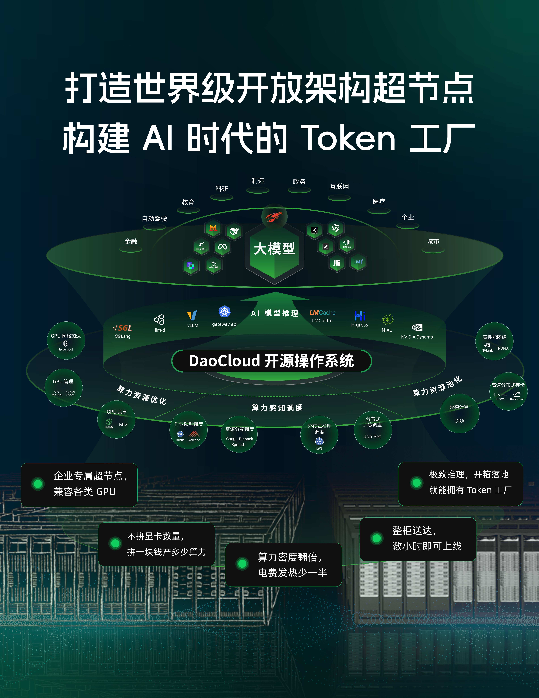
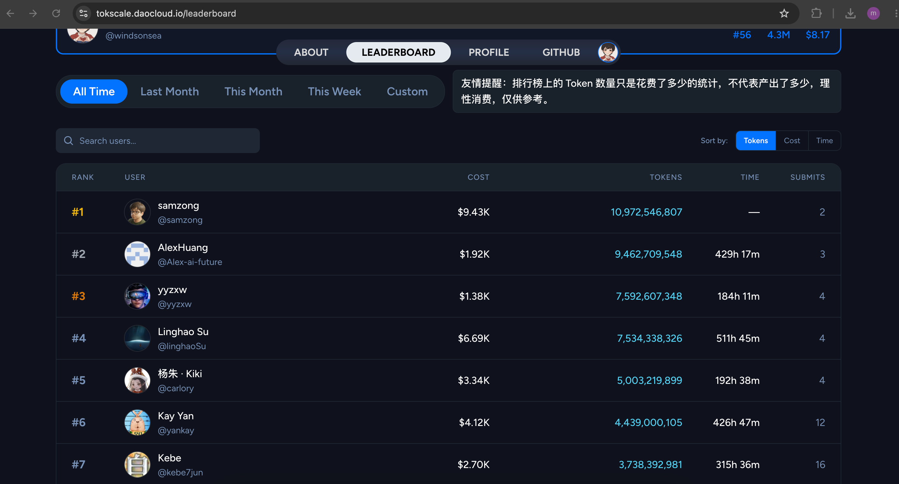
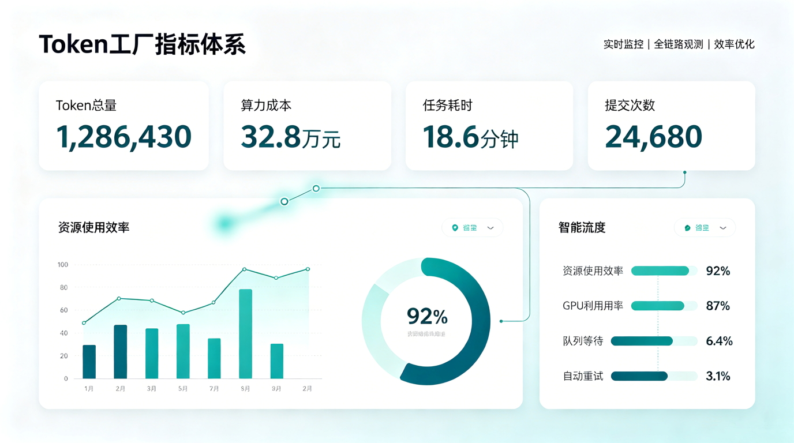
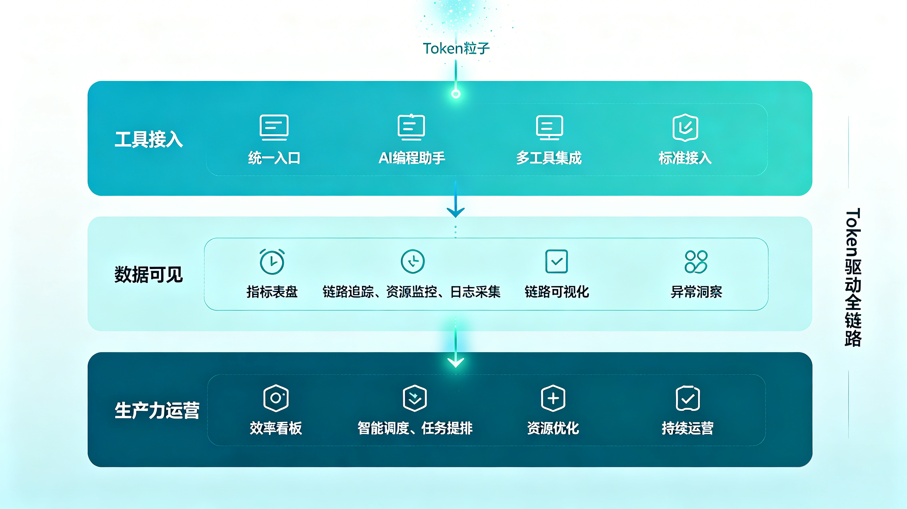

# Token 工厂：AI 时代，如何衡量一个团队的真实生产力？

过去，我们衡量研发效率，常常看代码行数、提交次数、需求吞吐、交付周期和缺陷率。

但进入 AI 编程时代后，一个新的生产要素正在浮现：**Token**。

开发者不再只是自己写代码，而是在和 AI 协作完成设计、编码、测试、重构、文档和问题排查。每一次提示词、每一次上下文输入、每一次模型生成，背后都在消耗 Token。

如果说 GPU 是 AI 时代的“算力机器”，那么 Token 就是这台机器产出的“生产计量单位”。

## 为什么企业需要关注 Token？

在 AI 编程刚开始普及时，企业更关心的是：“员工有没有用 AI 工具？”

但当 AI 工具真正进入日常研发流程后，问题会变成：

| 阶段 | 企业关注点 |
|---|---|
| 工具试用期 | 有多少人开始使用 AI 编程工具？ |
| 规模推广期 | 哪些团队用得更多？哪些场景最有效？ |
| 成本治理期 | Token 消耗是否可控？是否产生了有效产出？ |
| 效率优化期 | 如何让 Token 转化为更高质量的代码、文档和交付？ |

Token 本身不是目的。
真正重要的是：企业是否能看见 Token 如何被使用，以及它是否正在转化为研发生产力。

## 从“使用 AI”到“运营 AI 生产力”

很多企业采购了 AI 编程工具，却很难回答几个基础问题：

- 哪些团队正在高频使用 AI？
- 哪些员工已经形成稳定的人机协作习惯？
- Token 主要消耗在编码、调试、解释代码，还是文档生成？
- 高 Token 消耗是否带来了更快的交付？
- 哪些场景值得沉淀成最佳实践？
- 哪些消耗只是无效上下文、重复询问或低质量提示？

这说明，AI 编程工具接入只是第一步。
真正的挑战，是把 AI 使用从“个人行为”升级为“组织能力”。

这就需要一个新的视角：**Token 工厂**。

## 什么是 Token 工厂？

Token 工厂并不是简单统计谁用得最多，而是把 Token 看作 AI 研发流程中的关键生产要素，围绕它建立度量、治理和优化体系。

| 能力模块 | 解决的问题 | 组织价值 |
|---|---|---|
| Token 计量 | 不知道 AI 工具真实使用量 | 让 AI 使用从不可见变成可度量 |
| 成本归因 | 不清楚 Token 成本由谁、在哪些场景产生 | 支撑团队、项目和业务线级别的成本分析 |
| 使用排行 | 缺少团队内部 AI 使用氛围和标杆 | 激励员工探索 AI 协作方式，形成正向竞争 |
| 效率分析 | 只知道消耗，不知道产出 | 结合交付数据分析 Token 与研发效率之间的关系 |
| 最佳实践沉淀 | 高效用法停留在个人经验中 | 将优秀提示词、工作流和工具链沉淀为组织资产 |
| 风险治理 | AI 使用过程可能存在隐私、代码安全和合规风险 | 建立企业级 AI 使用边界和审计机制 |

这背后不是为了“卷 Token”，而是为了回答一个更重要的问题：
**一个组织到底能不能把 AI 消耗，转化成真实的工程产能？**

## DaoCloud 的实践：让 Token 使用变得可见

在 DaoCloud 内部，我们已经接入 Tokscale，对员工在 AI 编程过程中的 Token 使用情况进行统计和观察。

Tokscale 这类工具提供了面向 AI 开发者的 Token 使用追踪和排行榜能力。其公开 Leaderboard 页面展示了用户数量、Token 总量、成本、使用时长和提交次数等指标，并支持按 Token、成本、时间等维度排序。

这类工具的价值，不只是生成一个排行榜，而是帮助团队建立对 AI 使用情况的共同认知：

| 指标 | 代表什么 |
|---|---|
| Token 总量 | AI 工具在研发过程中的使用深度 |
| 使用成本 | AI 协作带来的资源投入 |
| 使用时长 | 员工与 AI 工具协作的持续程度 |
| 提交次数 | 使用数据上报和参与活跃度 |
| 排行榜 | 团队内部 AI 使用标杆和学习对象 |

通过这些数据，企业可以更好地观察 AI 编程在组织内部的真实渗透情况：谁在高频使用，哪些团队更积极，哪些场景更适合 AI 介入，哪些实践值得进一步推广。

## Token 利用率，比 Token 数量更重要

当然，Token 越多并不必然代表效率越高。

就像 GPU 利用率不等于业务价值，Token 消耗也不等于生产力。一个团队真正应该关注的，不只是“用了多少 Token”，而是“Token 是否被有效利用”。

未来，企业可以进一步把 Token 数据和研发过程数据结合起来：

| Token 数据 | 研发数据 | 可以回答的问题 |
|---|---|---|
| Token 消耗 | 需求交付周期 | AI 是否缩短了交付时间？ |
| Token 消耗 | Pull Request 数量 | AI 是否提升了代码产出频率？ |
| Token 消耗 | 缺陷率 | AI 是否影响代码质量？ |
| Token 消耗 | 文档数量 | AI 是否改善知识沉淀？ |
| Token 消耗 | Review 周期 | AI 是否提升协作效率？ |
| Token 消耗 | 运维事件处理时间 | AI 是否提升问题定位和恢复速度？ |

这才是 Token 工厂真正有价值的地方：
它不是一个“谁用得最多”的榜单，而是一套衡量 AI 生产力的仪表盘。

## 从 AI 工具采购，到 AI 生产力运营

企业接入 AI 编程工具之后，很容易进入一个误区：以为买了工具，就完成了 AI 转型。

但真正的 AI 工程化，需要经历三个阶段：

| 阶段 | 特征 |
|---|---|
| 工具接入 | 员工开始使用 Copilot、Cursor、Claude Code、Codex 等 AI 工具 |
| 数据可见 | 企业能够看到 Token、成本、使用频率和团队活跃度 |
| 生产力运营 | 企业能够把 AI 使用数据与研发效能、质量和业务结果关联起来 |

DaoCloud 关注 Token，不是为了追求消耗规模，而是为了探索 AI 时代研发组织的新型运营方式。

当 AI 逐渐成为每个工程师的“第二工作台”，企业就需要新的度量体系来理解这件事：
AI 到底在哪些地方创造了价值？哪些实践值得推广？哪些成本需要优化？哪些风险需要治理？

## 结语：Token 是 AI 时代的新型生产信号

在传统软件工程中，代码提交、构建次数、部署频率和故障恢复时间，是理解研发效率的重要信号。

在 AI 编程时代，Token 也会成为新的生产信号。

它记录的不只是模型调用，更是人与 AI 协作的过程：提问、思考、生成、修改、验证、交付。

未来，一个高效的研发组织，可能不只是拥有更多 AI 工具，而是能够更好地运营 AI 工具；不只是消耗更多 Token，而是能够让每一个 Token 更接近真实产出。

从 GPU 利用率到 Token 利用率，AI Infra 的问题正在从“有没有资源”走向“能不能运营资源”。

而这，正是 AI 进入企业级规模化落地之后，必须回答的新问题。

## 参考

- [Tokscale Leaderboard](https://tokscale.ai/leaderboard)：AI Token 用量跟踪和排行榜
- [Tokscale GitHub](https://github.com/junhoyeo/tokscale)：Tokscale CLI 项目
