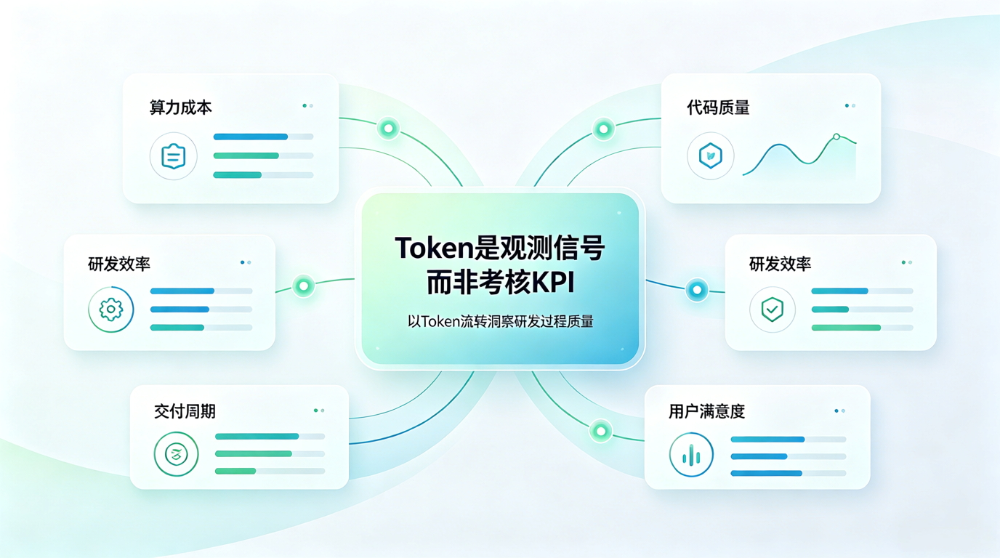
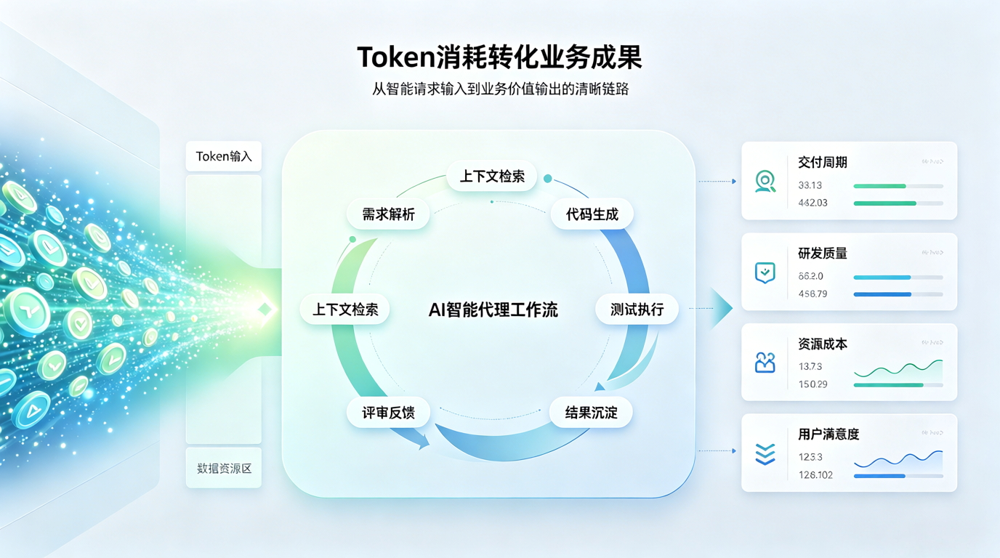
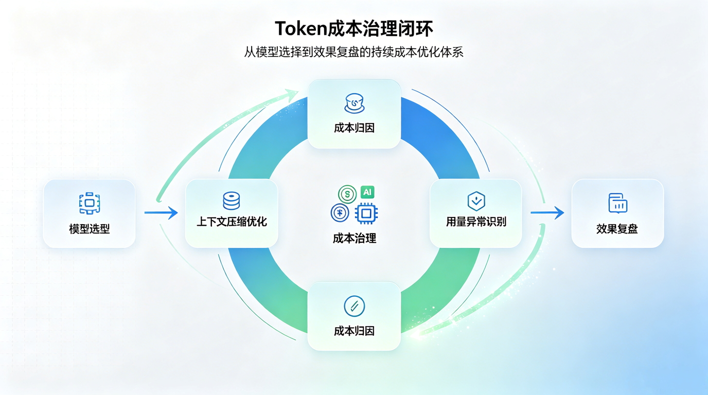

# 别让 Token 变成新 KPI：企业如何衡量 AI 的真实产出？

AI 工具正在进入企业日常工作流。

研发写代码、产品整理需求、市场生成文案、售前准备方案、运维排查问题，越来越多工作开始通过大模型辅助完成。随之而来的，是一个新的管理问题：
**企业如何判断 AI 到底有没有带来真实产出？**

最容易被看见的指标，是 Token。

每一次提示词输入、上下文读取、模型推理和内容生成，背后都会消耗 Token。Token 有成本、有记录、可统计，因此很自然地成为企业观察 AI 使用情况的入口。

但问题也在这里：
**Token 可以作为信号，却不应该变成 KPI。**

如果企业简单把 Token 消耗量和个人效率挂钩，就容易走向误区：谁用得多，谁看起来更“AI 原生”；谁排在榜单前面，谁似乎更高效。

这听起来直观，却并不可靠。更严重的是，它可能制造新的内卷和错误激励。

## Token 指标为什么容易被误用？

Token 指标本身并没有错。

它能帮助企业回答一些基础问题：AI 工具有没有被使用？哪些业务场景使用频率更高？哪些模型成本更高？哪些任务消耗更多上下文？哪些调用可能存在异常？

但 Token 的局限也很明显：它只描述了 **消耗**，并不直接描述 **产出**。

一个人消耗了大量 Token，可能是在高效完成复杂任务，也可能是在重复提问、低效试错。
一个团队 Token 用量不高，也不一定说明 AI 使用不足，可能是任务拆分更清晰、提示词质量更高、上下文管理更好。

行业里已经出现了类似讨论。围绕 [tokenmaxxing](https://en.wikipedia.org/wiki/Token_maxxing) 的批评，
正是因为一些企业把 Token 消耗误当成生产力信号，导致员工为了提高可见度而增加 AI 调用，而不是为了更好地完成任务。

Cognition CEO Scott Wu 在接受采访时也提到，Token 排行榜“方向上有一定道理”，但如果企业把它用来按个人消耗量排名，
就容易走偏；真正应该衡量的是交付物、任务完成效率和工程结果。
参考[环球商业洞察对 Token 用量排行榜的报道](https://www.businessinsider.com/cognition-ceo-scott-wu-tokenmaxxing-leaderboards-opinion-ai-vibe-coding-2026-6)。

这提醒我们：企业要做的不是制造新的 Token KPI，而是建立更成熟的 AI 产出评估体系。

| 错误理解 | 可能后果 | 更合理的理解 |
|---|---|---|
| Token 越多，说明越高效 | 鼓励刷 Token、长提示词、无效调用 | Token 越多，只说明消耗越多 |
| Token 排行榜可以衡量个人表现 | 形成个人监控感，引发抵触和内卷 | 更适合看团队、项目、场景、模型趋势 |
| AI 使用量越高越好 | 成本失控，低价值任务挤占预算 | 应关注高价值场景的投入产出比 |
| 个人用量可以直接用于绩效 | 指标被游戏化，损害信任 | 应关注交付结果、质量提升和流程效率 |

## 从“用了多少”转向“产生了什么”

企业真正关心的，不应该是某个人用了多少 Token，而应该是 AI 是否改善了工作过程和业务结果。

换句话说，衡量 AI 价值的关键，不是 Token 数量，而是 **Token 转化率**。

这套视角的核心，是把 Token 从“个人排名指标”转成“企业运营信号”。

它不问“谁用得最多”，而是问：

- 哪些场景最值得使用 AI？
- 哪些任务真正因为 AI 变快了？
- 哪些工作消耗高但产出低？
- 哪些模型成本高但效果不明显？
- 哪些流程因为 AI 介入而缩短了周期？
- 哪些质量风险需要额外治理？

这才是企业级 AI 运营真正有价值的部分。

## 个人监控不是答案，企业可观测才是方向

AI 工具进入企业之后，管理者当然需要可见性。没有可观测性，就无法评估投入产出，也无法控制成本和风险。

但可观测性不等于个人监控。

如果员工感受到 AI 使用数据会被直接用于个人排名、绩效比较或行为追踪，就很容易带来不信任。
最终的结果可能不是更高效率，而是指标游戏化、工具抵触，甚至对 AI 流程的规避。

类似争议并非空穴来风。Meta 近期就因为内部 AI 训练项目追踪员工电脑活动而引发争议，并在员工反对和数据访问问题曝光后暂停相关项目。
参考 [The Guardian 报道：Meta 因隐私问题而暂停了对员工 Token 用量的跟踪](https://www.theguardian.com/technology/2026/jun/24/meta-pauses-employee-tracker-for-ai-training-amid-privacy-concerns)。

更健康的方式，是把观测粒度从“个人排行”转向“企业治理”。

| 观察维度 | 不建议的做法 | 推荐的做法 |
|---|---|---|
| 人员 | 按个人 Token 消耗排名 | 观察团队层面的采用趋势和培训需求 |
| 成本 | 单纯比较谁花得多 | 按项目、模型、任务类型归因 |
| 效率 | 用 Token 量代表效率 | 关联交付周期、任务完成率和质量数据 |
| 质量 | 只看生成内容数量 | 看返工率、采纳率、缺陷率和满意度 |
| 治理 | 默认所有数据都可采集 | 明确数据边界、权限、审计和用途 |

这背后有一个基本原则：
**Token 数据应该服务于企业学习，而不是个人压力。**

## Token 成本需要治理，而不是放任增长

随着 AI 工具越来越深入工作流，Token 成本也会从“尝鲜成本”变成“持续性运营成本”。

一开始，企业可能只关心员工有没有用 AI。
但当 AI 使用规模扩大后，问题会变成：哪些模型最贵？哪些场景最耗 Token？哪些任务可以用更便宜的模型？哪些上下文可以被压缩？哪些调用其实没有必要？

有分析指出，AI 编程和 AI 办公的 Token 成本可能成为企业新的成本治理对象，不能只依赖员工自发节制。
参考：[TechRadar 关于 AI 编程 Token 成本治理的报道](https://www.techradar.com/pro/token-discipline-will-not-emerge-through-developer-choice-alone-experts-predict-that-ai-coding-costs-will-overtake-developer-salaries-by-2028)。

研究也显示，在智能体编码任务中，更高的 Token 消耗并不必然带来更高准确率；同一任务的 Token 消耗可能存在巨大波动。参考论文：
[AI 智能体正在掏空你的钱包](https://arxiv.org/abs/2604.22750)。

这说明，企业需要建立有效的 Token 成本治理能力，而不是简单鼓励“多用 AI”。

| 治理方向 | 具体做法 |
|---|---|
| 模型分层 | 不同任务使用不同成本和能力的模型 |
| 上下文治理 | 减少无关上下文，控制重复输入 |
| 场景分类 | 区分高价值任务和低价值调用 |
| 成本归因 | 按团队、项目、业务线、任务类型统计成本 |
| 异常识别 | 发现异常高消耗、重复调用和失败任务 |
| 效果复盘 | 将成本和产出结果一起评估 |

Token 成本治理的目标，不是压制 AI 使用，而是让 AI 使用更有质量。

## 结语：Token 是信号，不是终点

AI 时代，Token 会成为企业理解 AI 使用情况的重要信号。

它能帮助企业看见成本、模型调用、工具活跃度和任务消耗。但它不能独自回答“AI 有没有创造价值”。

真正的 AI 产出，应该体现在更完整的结果中：更快的交付、更高的质量、更低的重复劳动、更好的知识沉淀、更稳定的系统运行，以及更可控的成本结构。

所以，企业不应该把 Token 变成新的 KPI。

更好的方向，是把 Token 纳入 AI 可观测与治理体系，把它和业务产出、质量指标、成本结构、流程效率一起分析。

当 AI 从个人尝鲜走向企业级应用，企业需要的不只是“更多使用 AI”，而是“更好地运营 AI”。

从这个意义上说，Token 不是终点。
它只是企业走向 AI 生产力运营的一块仪表盘。

## 参考资料

- [Tokenmaxxing 概念说明](https://en.wikipedia.org/wiki/Token_maxxing)
- [Business Insider：Cognition CEO 谈 Token 排行榜与 tokenmaxxing](https://www.businessinsider.com/cognition-ceo-scott-wu-tokenmaxxing-leaderboards-opinion-ai-vibe-coding-2026-6)
- [The Guardian：Meta 暂停员工电脑活动追踪项目](https://www.theguardian.com/technology/2026/jun/24/meta-pauses-employee-tracker-for-ai-training-amid-privacy-concerns)
- [TechRadar：AI 编程 Token 成本治理讨论](https://www.techradar.com/pro/token-discipline-will-not-emerge-through-developer-choice-alone-experts-predict-that-ai-coding-costs-will-overtake-developer-salaries-by-2028)
- [arXiv 论文：AI 智能体正在掏空你的钱包](https://arxiv.org/abs/2604.22750)
- [Goodhart’s Law：一项指标一旦变成了目标，它将不再是个好指标](https://en.wikipedia.org/wiki/Goodhart%27s_law)
