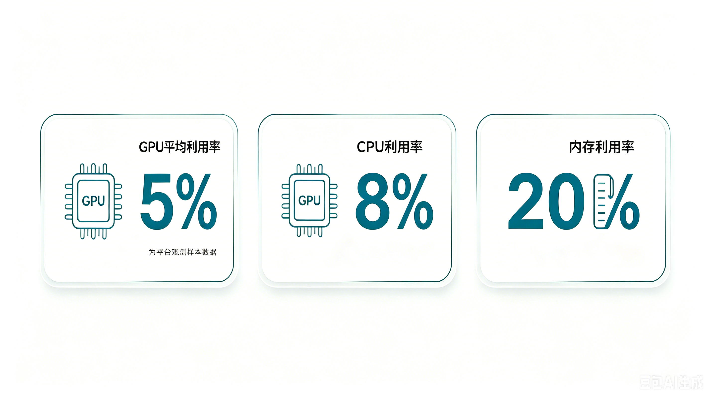
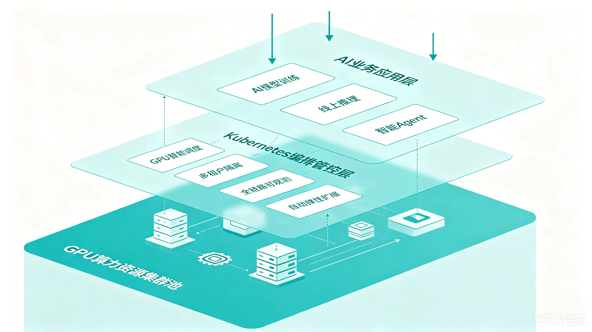
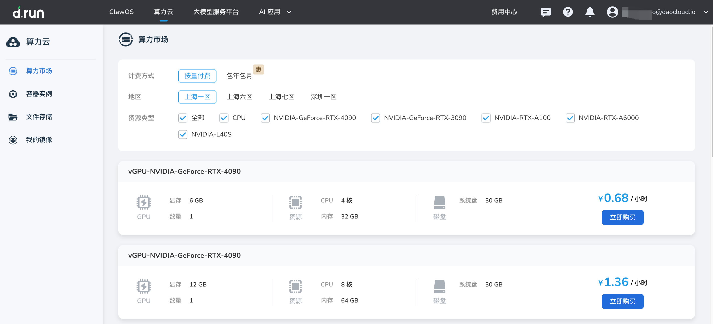

# AI Infra 的下一场硬仗：不是买更多 GPU，而是把 95% 的闲置算力用起来

AI 算力很贵，GPU 很缺。但一个更扎心的问题是：很多企业已经买到、租到、预留的 GPU，实际并没有被充分使用。

过去两年，AI Infra 的关键词几乎都围绕“算力短缺”展开：GPU 难买、交付周期长、云上实例紧张、推理成本居高不下。

但根据 CAST AI 2026 年 Kubernetes Optimization Report 相关报道，另一个事实同样值得关注：在其观测样本中，企业 GPU 平均利用率只有约 **5%**。也就是说，大量已经被采购、预留或分配出去的 GPU，并没有真正转化为有效算力。

这让 AI Infra 面临一个很现实的转向：
下一阶段的竞争，不只是“谁拥有更多 GPU”，而是“谁能把 GPU 用得更充分”。

## GPU 短缺的另一面，是 GPU 浪费

很多企业在建设 AI 平台时，会天然倾向于多买一点、多留一点、多隔离一点。

这并不难理解。AI 业务有明显的不确定性：模型训练可能突然启动，推理流量可能在短时间内上涨，研发团队也不希望关键实验因为资源不足而中断。

于是，资源预留逐渐变成一种“安全感”：

- 每个团队单独申请 GPU
- 每类模型单独建设环境
- 每个业务线拆出独立集群
- 按峰值而不是按真实负载配置资源
- 宁可闲置，也不愿冒排队或抢占风险

在 CPU 时代，这种冗余还能被成本掩盖。但到了 GPU 时代，闲置资源的代价被急剧放大。

GPU 不只是更贵，它还是 AI 工作负载的关键瓶颈资源。一个节点空着，损失的不只是钱，还有模型迭代速度、推理服务容量和平台整体吞吐。

> 上图数据来自 CAST AI 报告相关公开报道，代表其观测样本

## Kubernetes 成了 AI Infra 底座，但默认机制还不够

今天，越来越多 AI 工作负载正在跑到 Kubernetes 上。

无论是模型训练、微调、批处理任务，还是在线推理服务，Kubernetes 都提供了统一的调度、部署、弹性、可观测和多租户基础。它让 AI 应用可以像云原生应用一样被管理。

但问题在于，Kubernetes 最初并不是为昂贵、稀缺、强异构的 GPU 集群设计的。

传统 Kubernetes 资源模型更擅长处理 CPU 和内存这类相对通用、可切分、可弹性的资源。GPU 则复杂得多：

- 不同型号 GPU 性能差异巨大
- 显存大小直接决定模型能否运行
- 训练、微调、推理的资源曲线完全不同
- 多租户共享 GPU 时需要隔离和配额
- 推理服务需要关注延迟、吞吐和冷启动
- GPU 空闲、碎片化和超配很难只靠人工治理

这意味着，把 AI 工作负载“跑在 Kubernetes 上”只是第一步。真正的难点，是让 Kubernetes 具备面向 AI 算力的资源治理能力。

## 从“资源分配”走向“资源运营”

AI Infra 的核心问题，正在从部署问题变成运营问题。

过去，平台团队关注的是：
模型服务能不能部署起来？GPU 节点能不能被识别？任务能不能调度成功？

现在，问题变成了：
GPU 是否被充分利用？资源是否被合理共享？推理延迟是否稳定？不同团队之间是否有清晰配额？成本是否可解释？闲置资源能否被自动回收？

AI 平台不能只提供一批 GPU 节点，而要提供一套可运营的算力体系。它至少应具备以下几类核心能力：

| 能力模块 | 解决的问题 | 平台价值 |
|---|---|---|
| 资源池化 | GPU 按团队、项目分散建设，容易形成资源孤岛 | 将分散 GPU 纳入统一资源池，提高复用率，减少重复采购和长期闲置 |
| 多租户隔离 | 多团队共享算力时，权限、配额和安全边界不清晰 | 在共享资源的同时，保障不同团队之间的访问控制、资源配额和运行隔离 |
| 细粒度调度 | 不同 GPU 型号、显存、拓扑和任务类型难以人工匹配 | 根据模型和任务特征进行更精准的资源放置，减少 GPU 碎片和性能浪费 |
| 弹性伸缩 | 推理服务长期按峰值配置，低峰时资源闲置 | 根据真实流量动态扩缩容，在保障服务稳定性的同时降低成本 |
| 成本可视化 | 团队难以看清 GPU 使用率、闲置率和单位请求成本 | 让资源消耗可观测、可归因，为成本优化和资源分摊提供依据 |
| 自动化治理 | 资源回收、迁移、压缩和调整依赖人工巡检 | 通过策略自动发现并处理低效资源，让平台持续保持更高利用率 |

这背后其实是平台工程思路的升级：把 GPU 从“昂贵设备”变成“可度量、可调度、可治理的生产资源”。

## 推理时代，GPU 利用率会更重要

如果说训练阶段更像周期性的大任务，那么推理阶段则更像持续运行的在线服务。

企业真正大规模落地 AI 应用后，推理会成为更长期、更稳定、更贴近业务成本的部分。尤其是智能客服、代码助手、知识库问答、Agent 工作流等场景，都会带来持续的模型调用。

推理场景对基础设施提出了新的要求：

- 流量有峰谷，需要弹性
- 请求有延迟要求，需要稳定性
- 模型种类多，需要异构调度
- 成本按调用放大，需要精细核算
- 多个业务共享模型，需要平台化治理

这也是为什么 GPU 利用率不能只看“有没有任务在跑”，还要看 GPU 是否真正服务于业务目标：单位 token 成本、P95 延迟、吞吐、显存利用率、队列等待时间、模型副本数，这些指标都应该进入 AI Infra 的日常运营视角。

## AI Infra 的成熟度，最终会体现在效率上

AI 基础设施建设早期，很多企业会优先解决“有没有”的问题：有没有 GPU、有没有模型平台、有没有推理服务、有没有向量数据库。

但随着投入扩大，真正拉开差距的会是“用得好不好”。

同样的 GPU 数量，有的平台只能支撑少数团队排队使用；有的平台可以通过统一调度、多租户共享、弹性伸缩和成本治理，让更多模型、更高频实验和更稳定推理同时运行。

这就是 AI Infra 从资源建设走向平台工程的关键变化。

未来，企业衡量 AI 基础设施能力，可能不会只看 GPU 数量，而会看这些问题：

- GPU 平均利用率是多少？
- 闲置资源能否被及时发现和复用？
- 不同业务团队是否能安全共享算力？
- 推理服务是否能在成本和延迟之间动态平衡？
- AI 应用的单位成本是否可观测、可优化、可归因？
- 平台是否能支撑从训练到推理再到 Agent 的完整生命周期？

AI 算力仍然稀缺，但更稀缺的是把算力用好的工程能力。

对于企业来说，AI Infra 的下一场硬仗，不一定是买到更多 GPU，而是把已经拥有的 GPU，真正变成可调度、可共享、可观测、可运营的生产力。

可以，压缩成“短段落 + 表格 + 收束句”会更利落，适合放在推文最后：

## DaoCloud：把 AI Infra 建在可信的云原生底座上

AI Infra 的底层能力，离不开稳定、开放、可持续演进的云原生基础设施。
DaoCloud 长期深度参与 Kubernetes 上游社区建设，并将社区能力沉淀到企业级 AI Infra 实践中。

| 维度 | DaoCloud 实践 | 对 AI Infra 的价值 |
|---|---|---|
| 社区治理 | [Paco Xu 连任 Kubernetes Steering Committee 成员](../2025/paco-ksc.md)，也是国内唯一的 Kubernetes 指导委员会成员 | 深度参与 Kubernetes 项目治理，把握云原生底座演进方向 |
| 安全响应 | [2024 年 DaoCloud 加入 Kubernetes 安全响应委员会](../2024/241219-sec-privacy.md) | 参与 Kubernetes 安全漏洞响应与披露流程，强化企业级 AI 平台安全底座 |
| 上游贡献 | 在 Kubernetes 各个 SIG 中拥有十多位 Maintainer，代码贡献量全球前 10 | 持续参与调度、存储、网络、安全、文档、本地化等核心方向建设 |
| 产业落地 | 助力多家上市公司、高校和科研机构建设 GPU 算力中心 | 支撑 AI 训练、推理、科研计算和行业大模型应用落地并实现市值成倍增长 |
| 平台能力 | 通过云原生底座实现算力池化、任务调度、多租户管理、资源计量、弹性伸缩和安全治理 | 将 GPU 算力中心从“硬件堆叠”升级为“可运营的 AI 基础设施” |

当 GPU 算力逐渐成为企业 AI 能力的底层资产，企业需要的不只是一个能运行模型的平台，而是一个能够承载模型生命周期、算力治理和业务规模化落地的云原生基础设施底座。

DaoCloud 希望做的，正是帮助企业把 AI 算力从“昂贵资源”变成“可调度、可共享、可观测、可治理的生产力”。

## 参考资料

- 前沿科技雷达 TechRadar: [“5% utilization is a math fail”: Millions of GPUs worth billions are mostly sitting idle, report finds](https://www.techradar.com/pro/5-utilization-is-a-math-fail-millions-of-gpus-worth-billions-are-mostly-sitting-idle-report-finds)
- 环球商业洞察 Business Insider: [Companies are hoarding AI compute because of FOMO, and they’re sitting on most of it](https://www.businessinsider.com/companies-hoarding-unused-ai-compute-cast-ai-report-kubernetes-2026-4)
- arXiv 论文: [Instant GPU Efficiency Visibility at Fleet Scale](https://arxiv.org/abs/2605.20799)
