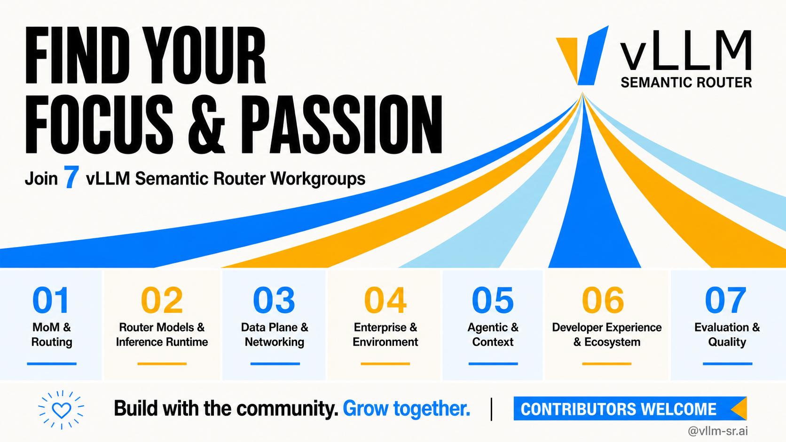
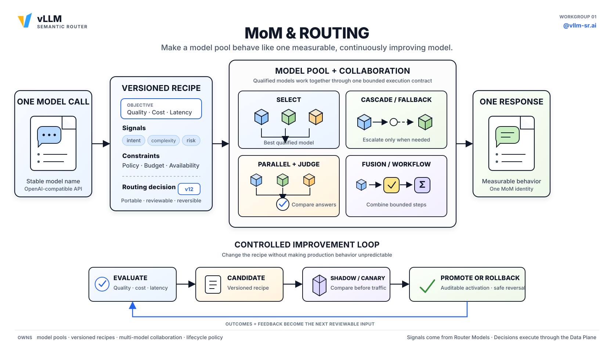
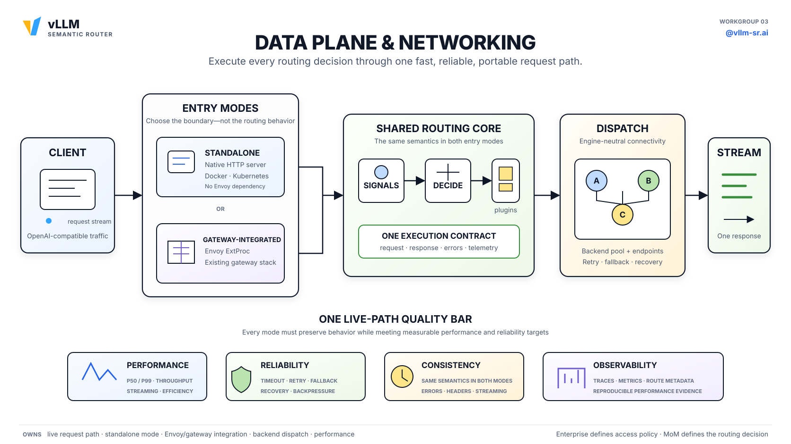
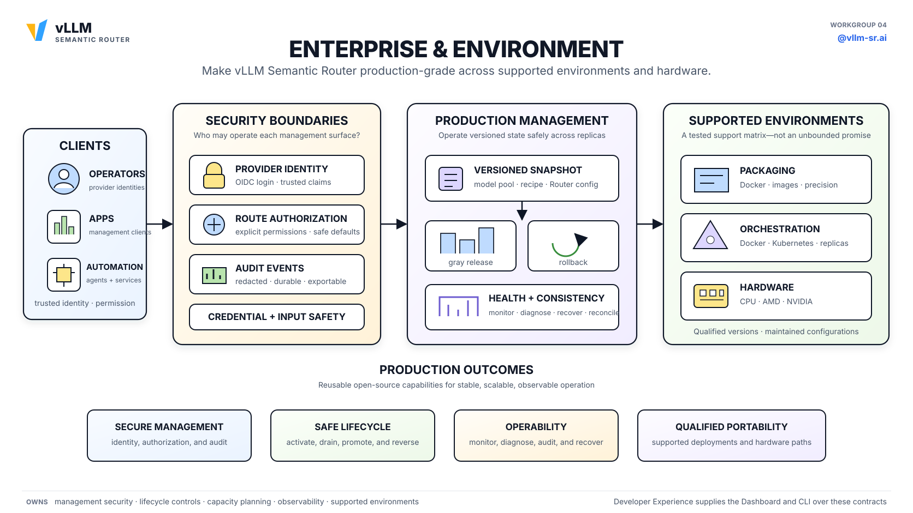
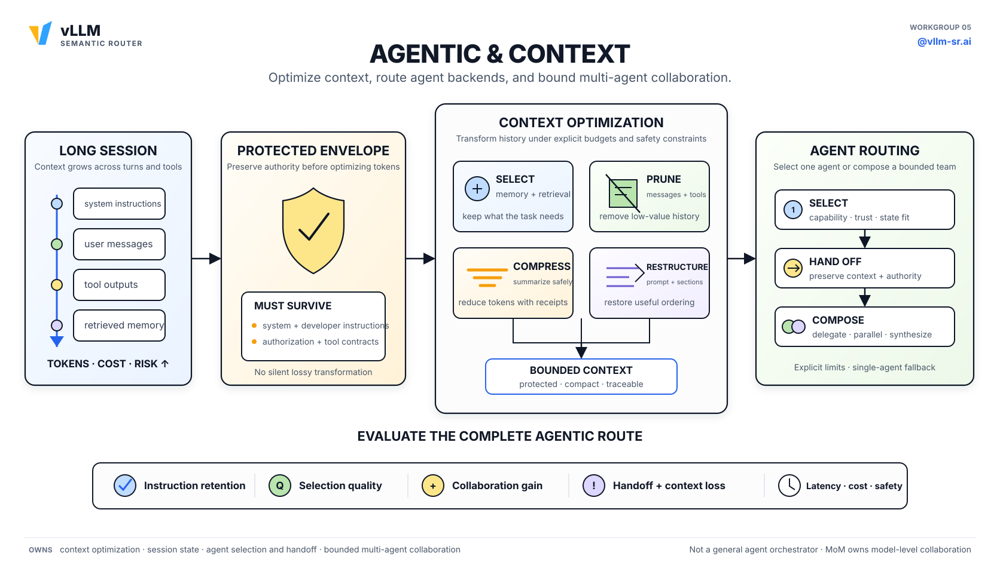

# vLLM Semantic Router 七大工作组，DaoCloud 持续深度共建

> 原文链接：[Find Your Focus and Join a Workgroup](https://vllm-sr.ai/blog/join-vllm-sr-workgroups)

开源的增长源于人们能看到自己的工作归属以及可以与谁一起构建。
vLLM Semantic Router（下称 vLLM-SR）现在有七个工作组，每个工作组负责一个持久的技术方向。

vLLM-SR 位于 AI 应用与模型或智能体后端之间，它理解请求、选择处理方式、执行路由并度量结果。
七个工作组将该系统划分为清晰的贡献领域，为社区开发者提供了明确的参与路径。

作为 vLLM-SR 社区的活跃贡献者，**DaoCloud 团队** 深度参与了多个工作组的建设，涵盖数据平面、路由模型、
企业环境等核心方向。本文将带你了解七大工作组的使命与边界，以及 DaoCloud 在其中的贡献。

## 一个系统，七个清晰的归属

一个被路由的请求跨越多个职责：

1. **Developer Experience & Ecosystem** 提供 CLI、Dashboard、API、配方和学习路径。
2. **Enterprise & Environment** 保护管理面，拥有生命周期、容量和部署策略。
3. **Router Models & Inference Runtime** 产生用于路由的信号。
4. **MoM & Routing** 选择模型和多模型策略。
5. **Agentic & Context** 管理有界上下文、记忆和会话连续性。
6. **Data Plane & Networking** 执行所选路径。
7. **Evaluation & Quality** 度量结果并捕获回归。

它们构成一个系统，按职责分离而非隔离的代码所有权。每个 Epic 都有一个归属工作组，对其他组的依赖记录在关联章程中的共享接口里。

## [MoM & Routing](https://github.com/vllm-project/semantic-router/issues/2965)

> **使命：** 让一组模型表现得像一个可度量且持续改进的 MoM。

### 解决的问题

用户应该能够调用一个稳定的模型名称，而无需为每个请求选择后端。一个 MoM
需要一个合格的模型池和一个版本化配方，该配方能在不使行为不可预测的前提下持续改进。

### 工作组的职责

- 模型池、模型角色、可移植配方及其版本化生命周期。
- 通过回退、级联、评判、合成和有界工作流进行模型选择与协作。
- 针对明确的质量、成本、延迟、安全、领域或模态目标，实现配方和池成员从离线到在线的改进。
- 模态感知池、已批准的推理复用，以及跨模型安全复用兼容计算。

### 非工作组的职责

该工作组不训练产生路由信号的轻量级模型，不构建实时网络路径，不决定对话历史如何压缩，也不运营托管服务。

### 归属 Epic

> Epic 是本项目 GitHub Issue 的一种标签类型，用于将相关 Issue 归到某个工作组下。

[查看所有当前属于 MoM & Routing 的 Epic](https://github.com/vllm-project/semantic-router/issues?q=is%3Aissue+is%3Aopen+label%3Aepic+label%3Awg%2Fmom-routing)

## [Router Models & Inference Runtime](https://github.com/vllm-project/semantic-router/issues/2966)

> **使命：** 构建更好的路由模型和一个可扩展的运行时，在整个生态中执行它们。

### 解决的问题

路由依赖于意图、复杂度、安全、偏好和预期质量等信号。产生这些信号的模型必须随时间改进，而新模型不应在 Router 中散布引擎特定的代码。

### 工作组的职责

- 改进、校准并发布项目内置的路由模型。
- 开发超越纯 BERT 设计的路由原生模型族。
- 构建可复现的自改进、蒸馏和微调流水线。
- 在支持的引擎和硬件之间提供一个版本化的执行契约，具备清晰的激活、诊断和回滚。

### 非工作组的职责

该工作组产生路由智能；它不选择终端用户的 MoM 模型池，不拥有通用网关转发，不保护管理面，也不重建它所集成的张量引擎和 GPU 调度器。

### 归属 Epic

[查看所有当前属于 Router Models & Inference Runtime 的 Epic](https://github.com/vllm-project/semantic-router/issues?q=is%3Aissue+is%3Aopen+label%3Aepic+label%3Awg%2Frouter-models-inference-runtime)

## [Data Plane & Networking](https://github.com/vllm-project/semantic-router/issues/2967)

> **使命：** 通过快速、可靠且可移植的请求路径执行每一个实时路由决策。

### 解决的问题

如果请求路径缓慢、脆弱或每个部署中都不同，那么路由决策几乎没有价值。独立服务和网关集成需要相同的行为和失败语义。

### 工作组的职责

- 独立的 OpenAI 兼容服务和 Envoy 或网关集成。
- 请求、响应、流式传输、分发、重试、回退、错误和遥测行为。
- 引擎无关的后端连接和推理感知的端点选择。
- 安全的语义缓存、性能优化和故障恢复。

### 非工作组的职责

该工作组执行请求路径网络和部署提供的访问策略，但不定义管理身份和授权、不决定哪些硬件受官方支持、不训练路由模型，也不选择最优 MoM 配方。

### 归属 Epic

[查看所有当前属于 Data Plane & Networking 的 Epic](https://github.com/vllm-project/semantic-router/issues?q=is%3Aissue+is%3Aopen+label%3Aepic+label%3Awg%2Fdata-plane-networking)

## [Enterprise & Environment](https://github.com/vllm-project/semantic-router/issues/2968)

> **使命：** 使 vLLM Semantic Router 在支持的环境和硬件上达到生产级。

### 解决的问题

生产运维人员需要对实际问题的明确回答：哪些管理面受到保护，由哪个提供者支持的身份保护？发生了什么变更？
系统是否健康？模型、配方或路由器升级能否安全地推出和回滚？哪些部署路径受维护，它们拥有哪些组件？这些答案在不同部署环境中必须保持一致。

### 工作组的职责

- 管理认证、提供者支持的身份集成、路由绑定授权、输入和凭据边界，以及持久审计。
- 可靠性、可扩展性、监控、诊断，以及现有的 Insights 和运维面。
- 模型、配方、配置和 vLLM-SR 的激活、推出和回滚。
- 工作负载模拟和容量规划，将观测到的流量、路由行为、服务拓扑和校准的硬件配置文件连接到可审查的部署提案。
- 稳定的部署和生命周期 API、维护的参考栈，以及在部署环境和硬件之间经过测试的支持矩阵。

### 非工作组的职责

该工作组不构建组织、团队或项目管理；不构建虚拟 API 密钥、租户配额、令牌速率限制、预算、计费或用量结算。
它也不在现有 Insights 和运维面之外规划路由分析。

它不承诺公开托管服务的 SLA，不暴露私有基础设施或凭据，不定义模型质量，不拥有评估标准，也不实现网络协议。
它提供可复用的开源生产能力，而非发布私有产品计划。

### 归属 Epic

[查看所有当前属于 Enterprise & Environment 的 Epic](https://github.com/vllm-project/semantic-router/issues?q=is%3Aissue+is%3Aopen+label%3Aepic+label%3Awg%2Fenterprise-environment)

## [Agentic & Context](https://github.com/vllm-project/semantic-router/issues/2987)

> **使命：** 为长时间运行的工作负载优化有界上下文、记忆、会话连续性，以及安全的模型或工作流切换。

### 解决的问题

长时间运行的工作会积累消息、记忆、工具输出、成本和风险。重要指令可能丢失，而模型或工作流的变更可能破坏工具循环或提供者状态。
Router 需要有界的连续性契约，而不会变成一个通用智能体框架。

### 工作组的职责

- 上下文压缩、剪枝、记忆选择、提示重构和对关键指令的保护。
- 具备显式持久化和生命周期凭证的提示可见 Router 记忆。
- 会话预算、状态边界、保留、工具循环连续性、恢复和优雅降级。
- 随会话演进安全地切换模型或工作流。
- 外部智能体运行时可消费的类型化任务、上下文可移植性、能力和协作凭证。

### 非工作组的职责

该工作组不在 Router 内选择、调用、托管或组合智能体端点。它不构建智能体端点目录、无限制的智能体编排器、工具平台或工作流引擎；
不拥有通用 MoM 选择；不在模型间传输 KV 缓存；也不允许静默的有损变换和无界在线训练。

### 归属 Epic

[查看所有当前属于 Agentic & Context 的 Epic](https://github.com/vllm-project/semantic-router/issues?q=is%3Aissue+is%3Aopen+label%3Aepic+label%3Awg%2Fagentic-context)

## [Developer Experience & Ecosystem](https://github.com/vllm-project/semantic-router/issues/2970)

> **使命：** 使 vLLM Semantic Router 易于采纳、配置、扩展、诊断和贡献。

### 解决的问题

当新用户无法达到第一个请求或理解发生了什么时，技术深度的影响有限。
项目还需要清晰的扩展路径，以便贡献者、模型构建者、基础设施项目和教育者能够在不逆向工程仓库的基础上进行构建。

### 工作组的职责

- 通过 CLI、配置、配方、错误和故障排除提供一条受支持的首次运行路径。
- 基于规范的 Router 和部署契约构建 Dashboard 配置和诊断。
- 一个面向智能体的技能，用于部署、配方生成、评估、调优和经审查的运维。
- 文档、本地化、集成指南、路由模型开发指南、技术内容和贡献者入口。
- 为模型、运行时、网关和部署系统提供清晰的扩展和贡献路径。

### 非工作组的职责

该工作组不控制仓库权限或推广，不运营营销活动或 AMD 内部项目，也不重新定义由其他工作组拥有的算法、生产策略和质量标准。

### 归属 Epic

[查看所有当前属于 Developer Experience & Ecosystem 的 Epic](https://github.com/vllm-project/semantic-router/issues?q=is%3Aissue+is%3Aopen+label%3Aepic+label%3Awg%2Fdeveloper-experience-ecosystem)

## [Evaluation & Quality](https://github.com/vllm-project/semantic-router/issues/2969)

> **使命：** 使每个支持的能力可度量，使每次变更可验证。

### 解决的问题

当路由模型、MoM 配方、智能体选择策略、运行时优化或部署各自使用不同的数据集和报告方法时，关于它们的声明难以信任。
项目需要共享的评估契约和回归门。每个技术工作组对其构建的内容负责；该工作组使结果具有可比性。

### 工作组的职责

- 通用基准、数据溯源、指标、比较、可复现性和发布契约。
- 对每个 MoM 与独立模型进行一等评估，具备通用核心和针对特定目标的扩展。
- 面向路由、智能体、上下文、服务、平台和开发者工作流的共享评估。
- CI、E2E、兼容性、安全、性能和运维回归门。

### 非工作组的职责

该工作组不选择其他方向的质量目标，不接受 issue，不做最终发布决定，不替代 Maintainer 审查，也不拥有模型研究本身。它定义共享的度量和门。

### 归属 Epic

[查看所有当前属于 Evaluation & Quality 的 Epic](https://github.com/vllm-project/semantic-router/issues?q=is%3Aissue+is%3Aopen+label%3Aepic+label%3Awg%2Fevaluation-quality)

## 工作组运作方式

> 工作组是一个技术归属，而非权限等级。

每个工作组拥有一个持久的技术方向及其有界 Epic。它连接贡献者、维护章程，并帮助准备工作以供接受。
开源团队保留最终的接受、合并、角色和发布权限。

| 工作组 | 开源团队 |
| --- | --- |
| 方向、边界、Epic 和贡献者聚焦 | 项目治理和仓库权限 |
| 分流和接受建议 | 最终接受、合并和发布权限 |
| Lead 和 Member 角色 | Maintainer、Committer 和 Contributor 角色 |

**Lead。** 每个活跃工作组至少有一个 Lead，可以有多个。Lead 是 Committer 或 Maintainer，
或者是有合并提交以及 Committer 或 Maintainer 担保的 Contributor。Lead 维护章程和 Epic 映射，并协调分流。

**Member。** Member 至少有一个合并的仓库提交，并在该方向上持续构建。
任何人可以在满足名册要求之前参与协作，一个人可以加入多个工作组。

## DaoCloud 与 vLLM-SR 共建

vLLM-SR 的 CODEOWNERS 文件中，来自 DaoCloud 的 **wilsonwu**（Wilson Wu）作为多个核心路径的 Code Owner，
覆盖 `src/`、`deploy/`、`dashboard/`、`tools/`、`website/` 等几乎所有核心目录。

此外，DaoCloud 团队成员还在以下方向持续贡献：

- **Data Plane & Networking**：请求路径执行、语义缓存、Envoy 网关集成等核心功能的开发与修复。
- **Router Models & Inference Runtime**：Candle 绑定、ONNX 绑定、ML 绑定等推理引擎的构建与优化。
- **Enterprise & Environment**：Helm 部署、Docker 镜像构建、生产环境稳定性修复。
- **Developer Experience & Ecosystem**：中文文档翻译与同步、Dashboard 界面优化、CLI 工具改进。
- **Evaluation & Quality**：E2E 测试覆盖、分类器相似度计算修复、回归测试增强。
