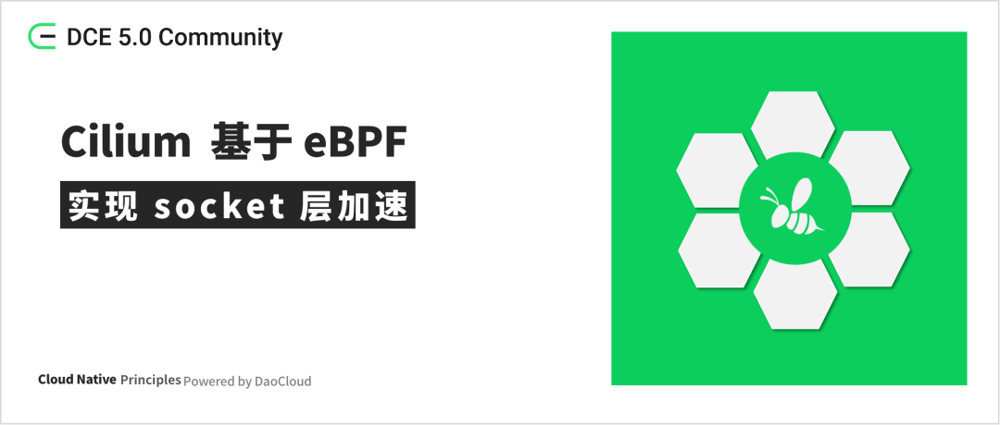
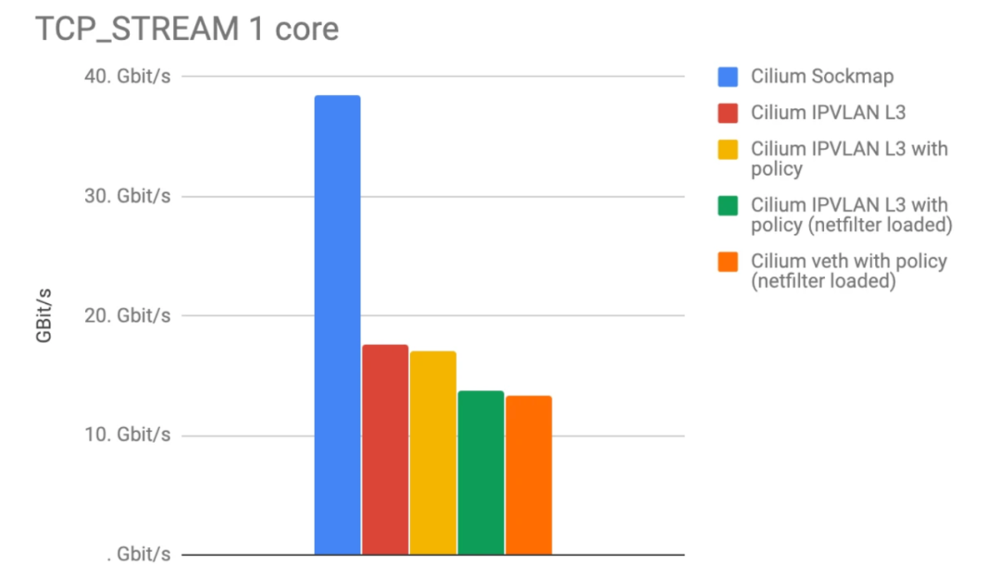
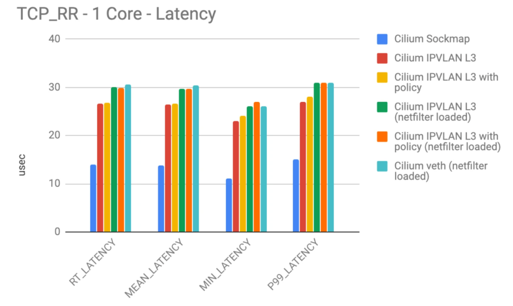
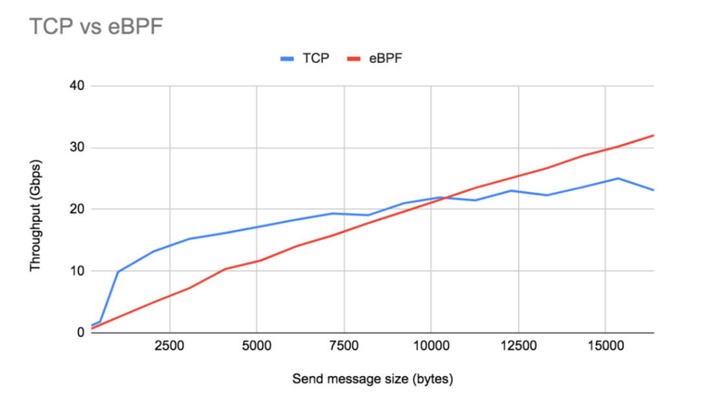
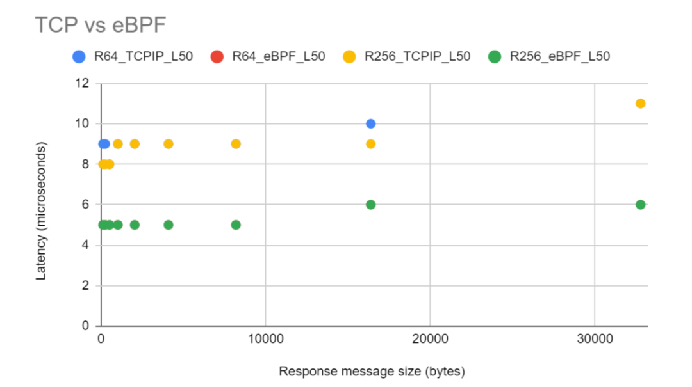

# Cilium 基于 eBPF 实现 socket 加速

原创作者：[tanberBro](https://github.com/tanberBro)



随着云原生的不断发展，越来越多的应用部署在云上。其中有些应用对实时性要求非常严苛，这使得我们必须提升这些应用性能，达到更快的服务速度。

## 场景

为了达到更快的服务速度，一个场景是：当两个互相调用的应用部署在同一个节点上的时候，每次请求和返回都需要经过 socket 层、TCP/IP 协议栈、数据链路层、物理层。
如果请求和返回绕过 TCP/IP 协议栈，直接在 socket 层将数据包重定向到对端 socket，那将大大减少发送数据包耗时，从而加快服务速度。
基于这个思路，eBPF 技术通过映射存储 socket 信息，利用帮助函数实现了将数据包重定向到对端 socket 层的能力。Cilium 正是基于 eBPF 这个能力，实现了 socket 层加速效果。

## 架构

Cilium 整体架构如下：


Cilium 在 daemon 组件实现 socket 层加速，daemon 组件会在集群中每个节点都启动一个 Pod，所以 socket 加速效果会应用在每个节点上。

## 能力概述

Cilium 在处理源端和目标端在同一个节点的时候，可以在 socket 层将流量直接重定向到目标端 socket，这样直接绕过了整个 TCP/IP 协议栈，进而达到加速的效果，如下图所示。


## 实现原理

### 原理概述

Cilium 使用以下 eBPF 程序和映射实现上述能力：

- eBPF 映射包含：
    - Cilium_sock_ops（类型：BPF_MAP_TYPE_SOCKHASH）：存储 socket 信息。
- eBPF 程序包含：
    - obpf_sockmap （类型：BPF_PROG_TYPE_SOCK_OPS）：拦截系统中 socket 建立连接操作，并将 socket 信息存储到 cilium_sock_ops。
    - obpf_redir_proxy（类型：BPF_PROG_TYPE_SK_MSG）：拦截系统中 sendmsg 系统调用，提取 key，将数据直接重定向到对端 socket。

bpf_sockmap 需要 attach 到 cgroup 上，在 Cilium 中会被 attach 到 __/run/cilium/cgroupv2__，所以 bpf_sockmap 可以作用到系统中所有属于该 cgroup 的进程。

### 代码实现

以下代码基于 cilium/cilium v1.13 分支。Cilium 使用 C 语言编写 eBPF 代码，并通过 go 语言 compile、load 和 attach eBPF 代码。

#### eBPF 映射

cilium_sock_ops：该映射使用 sock_key 作为 key，sock_key 存储源 IP、目标 IP、协议、源端口、目标端口，即 socket 五元组。

**bpf/sockops/bpf_sockops.h**

```go
struct sock_key {
    union {
        struct {
            __u32       sip4;
            __u32       pad1;
            __u32       pad2;
            __u32       pad3;
        };
        union v6addr    sip6;
    };
    union {
        struct {
            __u32       dip4;
            __u32       pad4;
            __u32       pad5;
            __u32       pad6;
        };
        union v6addr    dip6;
    };
    __u8 family;
    __u8 pad7;
    __u16 pad8;
    __u32 sport;
    __u32 dport;
} __packed;

struct {
    __uint(type, BPF_MAP_TYPE_SOCKHASH);
    __type(key, struct sock_key);
    __type(value, int);
    __uint(pinning, LIBBPF_PIN_BY_NAME);
    __uint(max_entries, SOCKOPS_MAP_SIZE);
} SOCK_OPS_MAP __section_maps_btf;
```

#### eBPF 程序

bpf_sockmap：__BPF_PROG_TYPE_SOCK_OPS__ 类型的程序和其他类型程序不同，它会在多个地方执行，参数 skops->op 可获取当前程序执行的地方。
这里会在主动建立连接、被动建立连接完成，并且协议族是 AF_INET6（TCP/IPv6）、AF_INET（TCP/IPv4）时，进入 bpf_sock_ops_ipv4 处理
socket。bpf_sock_ops_ipv6 会判断目标 IPV4 不为空，也会进入 bpf_sock_ops_ipv4 做进一步处理。

**bpf/sockops/bpf_sockops.c**

```go
__section("sockops")
int cil_sockops(struct bpf_sock_ops *skops)
{
    __u32 family, op;

    family = skops->family;
    op = skops->op;

    switch (op) {
    case BPF_SOCK_OPS_PASSIVE_ESTABLISHED_CB:
    case BPF_SOCK_OPS_ACTIVE_ESTABLISHED_CB:
#ifdef ENABLE_IPV6
        if (family == AF_INET6)
            bpf_sock_ops_ipv6(skops);
#endif
#ifdef ENABLE_IPV4
        if (family == AF_INET)
            bpf_sock_ops_ipv4(skops);
#endif
        break;
    default:
        break;
    }

    return 0;
}
```

bpf_sock_ops_ipv4：这里首先调用 sk_extract4_key 提取出 key，也就是 cilium_sock_ops 的 key；调用 sk_lb4_key 提取出 lb4_key，
调用 lb4_lookup_service，根据 lb4_key 查询映射：cilium_lb4_services_v2 获取 L4 负载信息，如果找到说明目标是 L4 负载地址，
直接 return，结束调用，向下使用 L4/L3 协议栈处理；调用 lookup_ip4_remote_endpoint 根据目标 IP 查询映射：cilium_ipcache，
该映射存储了所有网络信息和身份信息的对应关系，找到目标 IP 的身份 ID；调用 policy_sk_egress 进行策略裁决；
调用 redirect_to_proxy 判断是否要重定向到 proxy（verdict > 0），如果是的话，将 key 的源 IP、源端口换成 proxy 的地址，
调用 bpf 帮助函数 bpf_sock_hash_update 将 key 存储到 cilium_sock_ops 中；如果不是的话，调用 __lookup_ip4_endpoint，
根据目标 IP 查询映射：cilium_lxc，该映射存储了所有本地的 Pod 信息、主机信息，
如果找到，说明是本机内部访问，调用 bpf 帮助函数 bpf_sock_hash_update 将 key 存储到 cilium_sock_ops 中。

**bpf/sockops/bpf_sockops.c**

```go
static inline void bpf_sock_ops_ipv4(struct bpf_sock_ops *skops)
{
    struct lb4_key lb4_key = {};
    __u32 dip4, dport, dst_id = 0;
    struct endpoint_info *exists;
    struct lb4_service *svc;
    struct sock_key key = {};
    int verdict;

    sk_extract4_key(skops, &key);

    /* If endpoint a service use L4/L3 stack for now. These can be
     * pulled in as needed.
     */
    sk_lb4_key(&lb4_key, &key);
    svc = lb4_lookup_service(&lb4_key, true, true);
    if (svc)
        return;

    /* Policy lookup required to learn proxy port */
    if (1) {
        struct remote_endpoint_info *info;

        info = lookup_ip4_remote_endpoint(key.dip4);
        if (info != NULL && info->sec_label)
            dst_id = info->sec_label;
        else
            dst_id = WORLD_ID;
    }

    verdict = policy_sk_egress(dst_id, key.sip4, (__u16)key.dport);
    if (redirect_to_proxy(verdict)) {
        __be32 host_ip = IPV4_GATEWAY;

        key.dip4 = key.sip4;
        key.dport = key.sport;
        key.sip4 = host_ip;
        key.sport = verdict;

        sock_hash_update(skops, &SOCK_OPS_MAP, &key, BPF_NOEXIST);
        return;
    }

    /* Lookup IPv4 address, this will return a match if:
     * - The destination IP address belongs to the local endpoint manage
     *   by Cilium.
     * - The destination IP address is an IP address associated with the
     *   host itself.
     * Then because these are local IPs that have passed LB/Policy/NAT
     * blocks redirect directly to socket.
     */
    exists = __lookup_ip4_endpoint(key.dip4);
    if (!exists)
        return;

    dip4 = key.dip4;
    dport = key.dport;
    key.dip4 = key.sip4;
    key.dport = key.sport;
    key.sip4 = dip4;
    key.sport = dport;

    sock_hash_update(skops, &SOCK_OPS_MAP, &key, BPF_NOEXIST);
}
```

bpf_redir_proxy：BPF_PROG_TYPE_SK_MSG 类型程序会在 socket 上调用 sendmsg 时执行，这里就是执行 bpf_redir_proxy。
该程序首先调用 sk_extract4_key 提取出 key，也就是 cilium_sock_ops 的 key；调用 lookup_ip4_remote_endpoint
根据目标 IP 查询映射：cilium_ipcache，该映射存储了所有网络信息和身份信息的对应关系，找到目标 IP 的身份 ID；
调用 policy_sk_egress 进行策略裁决；如果裁决通过，则调用 bpf 帮助函数 bpf_msg_redirect_hash，
该函数通过传入的 key 查询映射 cilium_sock_ops，获取对端 socket 信息，进而将消息重定向到对端 socket 的 ingress 方向，完成 socket 层的重定向。

**bpf/sockops/bpf_redir.c**

```go
__section("sk_msg")
int cil_redir_proxy(struct sk_msg_md *msg)
{
    struct remote_endpoint_info *info;
    __u64 flags = BPF_F_INGRESS;
    struct sock_key key = {};
    __u32 dst_id = 0;
    int verdict;

    sk_msg_extract4_key(msg, &key);

    /* Currently, pulling dstIP out of endpoint
     * tables. This can be simplified by caching this information with the
     * socket to avoid extra overhead. This would require the agent though
     * to flush the sock ops map on policy changes.
     */
    info = lookup_ip4_remote_endpoint(key.dip4);
    if (info != NULL && info->sec_label)
        dst_id = info->sec_label;
    else
        dst_id = WORLD_ID;

    verdict = policy_sk_egress(dst_id, key.sip4, (__u16)key.dport);
    if (verdict >= 0)
        msg_redirect_hash(msg, &SOCK_OPS_MAP, &key, flags);
    return SK_PASS;
}
```

#### compile、load 和 attach eBPF 程序

Cilium 使用 go 语言，调用外部命令 clang llc bpftool 进行 compile、load 和 attach。

当 Cilium 配置 sockops-enable: "true"，且内核支持 BPF Sock ops，
daemon 启动时进行 init 操作的时候进行 compile、load 和 attach，代码如下：

**daemon/cmd/daemon.go**

```go
......
        if option.Config.SockopsEnable {
            eppolicymap.CreateEPPolicyMap()
            if err := sockops.SockmapEnable(); err != nil {
                return fmt.Errorf("failed to enable Sockmap: %w", err)
            } else if err := sockops.SkmsgEnable(); err != nil {
                return fmt.Errorf("failed to enable Sockmsg: %w", err)
            } else {
                sockmap.SockmapCreate()
            }
        }
......
```

sockops.SockmapEnable：首先调用 clang... | llc ...将 bpf_sockops.c 编译成 bpf_sockops.o；
然后将 bpf_sockops.o 加载到内核，加载之后 bpf_sockops.o 会 pin 到/sys/fs/bpf/bpf_sockops（默认），
再调用 bpftool cgroup attach...将/sys/fs/bpf/bpf_sockops attach 到/run/cilium/cgroupv2（默认）cgroup 上，
最后将 cilium_sock_ops pin 到/sys/fs/bpf/tc/globals/cilium_sock_ops。

**pkg/sockops/sockops.go**

```go
func SockmapEnable() error {
    err := bpfCompileProg(cSockops, oSockops)
    if err != nil {
        return err
    }
    progID, mapID, err := bpfLoadAttachProg(oSockops, eSockops, sockMap)
    if err != nil {
        return err
    }
    log.Infof("Sockmap Enabled: bpf_sockops prog_id %d and map_id %d loaded", progID, mapID)
    return nil
}
```

sockops.SkmsgEnable：首先调用 clang... | llc ...将 bpf_redir.c 编译成 bpf_redir.o；
然后将 bpf_redir.o 加载到内核，加载之后 bpf_redir.o 会 pin 到/sys/fs/bpf/bpf_redir（默认），
根据 bpf_redir 调用 bpftool prog show pinned...获取 bpf_redir 程序 ID，调用 bpftool map show
获取 bpf_sockops 所使用的的映射 ID，最后调用 bpftool prog attach...根据程序 ID、映射 ID 将 bpf_redir attach 到 cilium_sock_ops。

**pkg/sockops/sockops.go**

```go
func SkmsgEnable() error {
    err := bpfCompileProg(cIPC, oIPC)
    if err != nil {
        return err
    }

    err = bpfLoadMapProg(oIPC, eIPC)
    if err != nil {
        return err
    }
    log.Info("Sockmsg Enabled, bpf_redir loaded")
    return nil
}
```

#### 小结

综上所述，使用 cilium_sock_ops 映射做 socket 信息存储载体，通过 bpf_sockmap 程序拦截并存储 socket 信息，
通过 bpf_redir_proxy 调用 bpf_msg_redirect_hash 实现 socket 重定向。通过 Cilium daemon 组件，
将 eBPF 程序和映射 load 到内核中，并 attach 到/run/cilium/cgroupv2 上，实现同一节点 socket 通讯加速，
由于加速的范围是基于 cgroup 监听的所有主机上的 socket，所以只要是同一节点上的 socket 之间通信都是可以完成加速的。

## 加速效果




如上图展示了，使用 eBPF socket 加速（蓝色）之后，请求数/s 和吞吐量都成倍增加。



如上图展示了，eBPF socket 加速（蓝色）和 TCP/IP 栈延迟对比，eBPF socket 加速之后的性能优于常规 TCP/IP 栈。

接下来看看当发送和接收多种长度的消息时加速效果对比，深入分析加速原理：



如上图展示了，使用 eBPF socket 加速之后，吞吐量和发送消息大小呈线性关系。这是因为当应用程序发送较大的消息时，
几乎没有额外的开销，但是当发送消息比较小时，使用 TCP/IP 协议栈，反而吞吐量会大于 eBPF socket 加速之后的吞吐量，
这是由于 TCP/IP 栈默认开启了 Nagle 算法。Nagle 的算法是用来解决小数据包在慢速网络中泛滥导致拥塞的问题，
在该算法中只要有一个 TCP 段在小于 TCP MSS 大小的情况下未被确认，就会进行批处理传输数据操作。
这种批处理导致一次传输更多的数据并分摊开销，所以能超过 eBPF socket 加速之后吞吐量。但是随着发送消息越来越大，
超过 MSS，TCP/IP 栈就会失去其批处理优势，在这些大数据包发送大小下，eBPF socket 加速凭借其低开销远远超过启用 Nagle 算法的 TCP/IP 栈的吞吐量。


如上图展示了，在禁用 Nagle 算法的情况下，与 eBPF socket 加速相比，常规 TCP 的吞吐量增益完全消失了。
TCP/IP 栈和 eBPF socket 加速的性能都按预期线性增加，由于 eBPF 的每次发送调用的成本开销是固定的，
所以 eBPF 具有比常规 TCP/IP 更大的斜率。对于较大的发送消息大小和较小的 TCP MSS，这种性能差距更为明显。



如上图展示了，eBPF socket 加速和 TCP/IP 栈延迟对比，eBPF socket 加速优于常规 TCP/IP 栈。
性能优于常规 TCP/IP 栈近 50%。与 TCP/IP 栈相比，eBPF 通过将数据包从源套接字的传输队列重定向到目标套接字的接收队列，
从而消除了任何协议级别的开销（慢启动、拥塞避免、流量控制等）。此外，请求消息大小的大小对延迟没有影响。

## 参考资料

- [Welcome to Cilium’s documentation!](https://docs.cilium.io/en/stable/)
- [How to use eBPF for accelerating Cloud Native applications](https://cyral.com/blog/how-to-eBPF-accelerating-cloud-native/)
- [Lessons from using eBPF (and bypassing TCP/IP) for accelerating Cloud Native applications](https://cyral.com/blog/lessons-using-eBPF-accelerating-cloud-native/)
- [Accelerating Envoy and Istio with Cilium and the Linux Kernel](https://www.slideshare.net/ThomasGraf5/accelerating-envoy-and-istio-with-cilium-and-the-linux-kernel)
- [Congestion Control in IP/TCP Internetworks](https://tools.ietf.org/html/rfc896)
- [Cilium 1.4: Multi-Cluster Service Routing, DNS Authorization, IPVLAN support, Transparent Encryption, Flannel Integration, Benchmarking other CNIs](https://cilium.io/blog/2019/02/12/cilium-14/)
