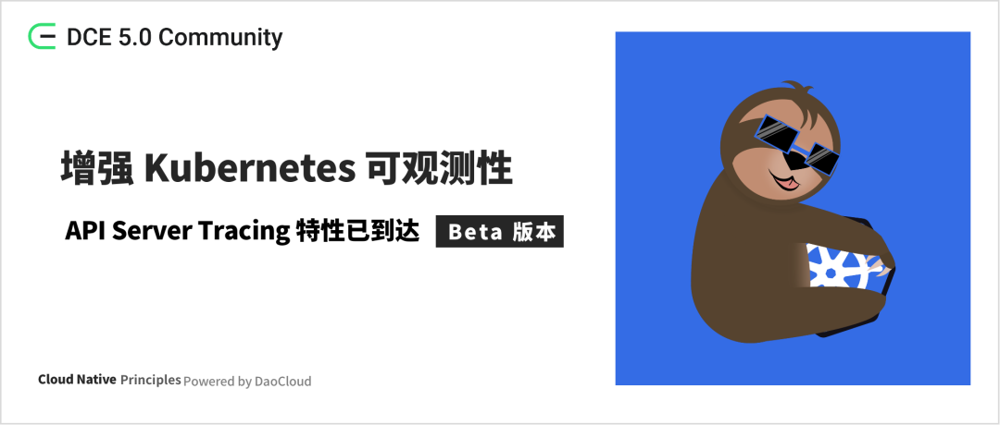
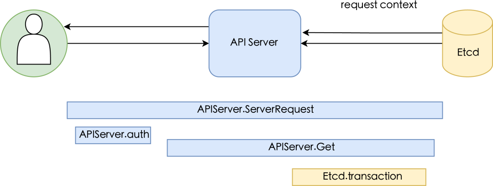

# 增强 K8s 可观测性：API Server Tracing 特性进阶至 Beta

> 作者：[mengjiao-liu](https://github.com/mengjiao-liu)



**在分布式系统中，很难弄清楚问题在哪里。**
想象一个场景，这也是 Kubernetes 集群管理员最常遇到的问题，Pod 无法正常启动，这时候作为管理员，
我们会先去思考这可能是哪个组件出了问题，然后去对应的组件查找日志， 结果发现问题可能是另一个组件导致的，
这时候又去查找另外的日志，这还是最好的情况，我们能通过日志发现线索。有时候线索不是那么明显，
我们可能就需要苦思冥想，到底是哪里出了问题， 有时候需要依靠猜测，花费了很多时间进行定位问题，
这个时候就需要管理员对集群的各个组件都有比较全面的了解，这使得学习和排障的成本高昂。
这种情况下，**如果我们有分布式追踪，就可以清晰的看到是哪个组件出现了异常，快速定位到有问题的地方。**

分布式系统通常存在不确定性问题，或过于复杂而无法在本地重现。跟踪通过分解请求流经分布式系统时发生的情况，
使调试和理解分布式系统变得不那么令人生畏。
**分布式跟踪是一种工具，旨在在这些情况下提供帮助，而 Kubernetes API 服务器也许是能够调试的、最重要的 Kubernetes 组件。**

在 Kubernetes 中，API Server 是管理和调度所有集群资源的核心组件，它接收和处理来自各种客户端的请求，
并将它们转化为底层资源操作。因此，API Server 的稳定性和可观测性对 Kubernetes 的整体健康状态至关重要。

为了提高 Kubernetes API Server 的可观测性，帮助管理员更好地管理和维护 Kubernetes 集群。为此，
**Kubernetes 引入了 APIServer Tracing， 该特性在 Kubernetes API Server 中添加更多的跟踪信息，并将其收集到后端收集器中。**
通过这些跟踪信息，管理员可以更容易地追踪请求的来源和流转，了解请求的处理时间和结果，
从而更容易地发现和解决问题。这些信息还可以用于性能优化和容量规划等方面。

接下来，让我们开始对此特性一探究竟吧。

## Kubernetes API Server 追踪

设计详情：KEP APIServer Tracing #647

### 追踪概览图



### 开启

- APIServerTracing 特性门控（v1.27+ 不再需要特性门控）
- tracing-config-file 配置文件

### 现状

负责的小组：由 sig instrumentation 负责

迭代版本：1.22 alpha，1.27 到达 beta 版本

追踪的组件：API -> etcd tracing

## 演示

步骤：

1. 启动 Jaeger
2. 启动 APIServer tracing（包含启动 etcd）
3. 查看 Jaeger UI 观测追踪

### 启动 Jaeger 容器

Jaeger 是比较流行的分布式追踪 UI 工具，也是云原生计算基金会（CNCF）主持的第 7 个顶级项目（2019 年 10 月毕业）。
这里选择 Jaeger 作为数据收集和存储的后端，以及可视化数据的 UI。jaegertracing/all-in-one
是专为快速本地测试而设计的可执行文件，可启动 Jaeger UI、收集器、查询和代理，并带有内存存储组件。

```shell
docker run -d --name jaeger \
  -e COLLECTOR_ZIPKIN_HOST_PORT=:9411 \
  -e COLLECTOR_OTLP_ENABLED=true \
  -p 6831:6831/udp \
  -p 6832:6832/udp \
  -p 5778:5778 \
  -p 16686:16686 \
  -p 4317:4317 \
  -p 4318:4318 \
  -p 14250:14250 \
  -p 14268:14268 \
  -p 14269:14269 \
  -p 9411:9411 \
  jaegertracing/all-in-one:1.43
```

详情： https://www.jaegertracing.io/docs/1.43/getting-started/

### 启动 Kubernetes API Server tracing

启动 Kubernetes APIServer tracing 在本文提供了两种方式进行测试。
如果你是 Kubernetes 开发者，你可以直接在 Kubernetes 交互测试中直接测试；
如果你是 Kubernetes 集群管理员，你可以直接在集群中配置相关参数。

**启动 Kubernetes 本地交互测试**

测试文件：test/integration/apiserver/tracing/tracing_test.go

**修改 API Server tracing 测试代码&配置**

本地的交互测试代码需要修改下配置，以便将其收集的数据发送到 Jaeger。

```go
#test/integration/apiserver/tracing/tracing_test.go:125

if err := os.WriteFile(tracingConfigFile.Name(), []byte(fmt.Sprintf(`
apiVersion: apiserver.config.k8s.io/v1beta1
kind: TracingConfiguration
samplingRatePerMillion: 1000000
endpoint: %s`, "0.0.0.0:4317")), os.FileMode(0755)); err != nil {
  t.Fatal(err)
 }
```

##### 启动 etcd

需要配置的参数：

```go
--experimental-enable-distributed-tracing=true
--experimental-distributed-tracing-address=0.0.0.0:4317
--experimental-distributed-tracing-service-name=etcd
```

修改代码：

```go
#test/integration/framework/etcd.go:82
customFlags := []string{
  "--experimental-enable-distributed-tracing",
  "--experimental-distributed-tracing-address=0.0.0.0:4317",
  "--experimental-distributed-tracing-service-name=etcd",
 }

currentURL, stop, err := RunCustomEtcd("integration_test_etcd_data", customFlags, output)
```

**运行测试**

```go
cd ./test/integration/apiserver/tracing
go test -run TestAPIServerTracing
```

### 在 Kubernetes 集群中配置 API Server tracing

这里以 kubeadm 安装的 Kubernetes 集群为例。

在 kube-apiserver.yaml 配置清单中配置特性门控 APIServerTracing=true（1.27 及以上版本不再需要配置此特性门控）。

配置 tracing-config-file 文件,此处我们将此文件保存在 /etc/kubernetes/apitracing-config.yaml。

```yaml
apiVersion: apiserver.config.k8s.io/v1beta1
kind: TracingConfiguration
endpoint: 10.6.9.3:4317
samplingRatePerMillion: 100000  #采样频率，根据自身需要设置
vim /etc/kubernetes/manifests/kube-apiserver.yaml
spec:
  containers:
  - command:
    - kube-apiserver
    - --feature-gates=APIServerTracing=true
    - --tracing-config-file=/etc/kubernetes/apitracing-config.yaml
```

保存退出即可，kubelet 会自动重启 APIServer。

在 etcd.yaml 配置清单中配置以下参数：

```shell
vim /etc/kubernetes/manifests/etcd.yaml
spec:
  containers:
    - command:
        - etcd
        - --experimental-distributed-tracing-address=<JaegerIP:4317>
        - --experimental-distributed-tracing-service-name=etcd
        - --experimental-enable-distributed-tracing=true
```

保存退出即可，kubelet 会自动重启 etcd。

### 查看 Jaeger

这时候我们可以访问 Jaeger 了。地址：http://<JaegerIP>:16686/ 在 Jaeger 界面我们可以清晰的看到请求的追踪路径。


青色行来自 API 服务器，包括对 /api/v1/nodes 的服务请求，并向 ETCD 发出 grpc Range RPC。黄色线来自 ETCD 处理 Range RPC。

## 结语

SIG instrumentation 正在积极推动 Kubernetes 组件可追踪，现在 APIServer Tracing
和 kubelet Tracing 在 Kubernetes v1.27 都已到达 Beta 版本，敬请期待！
