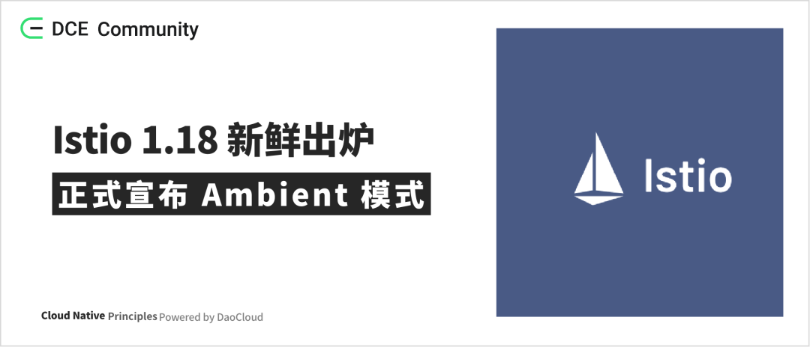

# Istio 1.18 新鲜出炉：正式宣布 Ambient 模式

> 作者：[hanxiaop](https://github.com/hanxiaop)



太平洋时间 2023 年 6 月 5 日，Istio 正式发布了 **1.18** 版本。

1.18 版本是 Istio 在 2023 年发布的第二个版本，也是首个支持 Ambient 模式的版本。

本次版本更新引入了许多新功能和变化，包括但不限于 Ambient 模式的 Istio、增强的 Kubernetes Gateway API、
针对未自动注册的虚拟机的健康检查支持、新增对 Metrics 的过期支持、增强的 istioctl analyze 等。

在此次版本更新中，DaoCloud 作为 Istio 社区主要提供商，主要在安装部分的功能和优化、istioctl 的增强以及对
Ambient 模式的适配和文档完善等方面做出了贡献。同时，DaoCloud 韩小鹏作为 1.18 版本的 Release Manager，一直在参与发版工作。

!!! info

    Istio 1.18 版本支持的 Kubernetes 版本为 1.24，1.25，1.26，1.27。

接下来，我们将详细讨论一些重要的功能和变化。

## Ambient Mesh（环境网格）

在介绍 Ambient 模式之前，我们需要了解当前 Istio 使用的 Sidecar 模式以及它所面临的挑战。

Sidecar 模式是 Istio 目前采用的数据平面模式，该模式中，每个应用程序 Pod 都配备一个 Sidecar 代理（通常为 Envoy）。
这个代理负责处理进出 Pod 的所有网络流量，从而提供 Istio 的核心功能，诸如零信任安全、遥测和流量管理等。

然而，Sidecar 模式也存在一些挑战，包括但不限于以下几点：

- 侵入性强：在 Sidecar 模式中，每个应用程序 Pod 都需要注入一个 Envoy 代理。
  这就导致一些应用程序必须在设计和编码阶段考虑到与 Sidecar 代理的交互。此外，
  当网格升级时，Sidecar 的升级过程可能会影响应用程序，不能很好地实现网格能力和业务容器的解耦，从而增加了应用开发和运维的复杂性。

- 资源消耗高：Sidecar 模式下，由于每个 Pod 都配有一个 Envoy 代理，这意味着每个 Pod 都需要为其
  Sidecar 分配额外的 CPU 和内存资源。这不仅可能导致资源的浪费，也相应地增加了基础设施的成本。

- 安全配置繁琐：虽然 Sidecar 代理提供了安全的核心功能，但目前相对来讲配置繁琐。
  例如 mTLS，在 Sidecar 模式中，每个 Pod 或者不同层级的工作负载都需要单独配置安全功能，
  运维人员可能需要额外的时间和技术来处理这些繁琐的配置。

正是由于以上这些挑战，Istio 推出了新的数据平面模式 —— Ambient Mesh（环境网格）。
该模式旨在简化操作、扩大应用程序兼容性并降低基础设施成本，同时继续提供 Istio 的核心功能。
有关更多信息，可参考 [Istio 环境网格介绍](https://istio.io/latest/blog/2022/introducing-ambient-mesh/)。

关于 Ambient 模式有以下好处：

- 非侵入性：与需要在应用程序的 Pod 中注入边车代理的传统 Istio 架构相比，环境网格不需要侵入应用程序。
  只需要打上对应的标签，应用即可自动加入网格，从而减少了网格对应用程序的影响。
- 更高的资源利用率：在边车模式下，每个 pod 都需要为最坏情况分配 CPU 和内存，这一直是一个问题。
  环境网格通过共享代理 Ztunnel 有效地减少了资源的浪费。如果需要 Istio 的某些七层功能，
  也可以通过精确地为某一个 Service Account 或 Namespace 部署一个 Waypoint 来解决，从而更好地控制资源消耗。
- 性能：在早期，Istio 采用了基于 Envoy 的共享代理模式，然而在开发过程中，发现 Envoy 存在配置繁琐等问题，
  因此 Istio 开发了自己的基于 Rust 版本的共享代理（ztunnel）。在未来，预计环境网格将与传统的边车模式具有相当的性能表现。
- 安全性：环境网格通过在每个节点上运行一个共享代理 Ztunnel 来确保安全性。这个代理被部署在每个节点上，
  负责处理所有进出节点的流量，可以提供与传统 Istio 网格中边车代理相同的安全性。
  一旦为命名空间启用 Ambient 模式，就会创建一个安全覆盖层。
  这个覆盖层为应用程序提供 mTLS、遥测、身份验证和 L4 授权等功能，而无需终止或解析 HTTP 流量。

然而，如果 L4 无法满足应用程序的需求，这时 Waypoint 就可以作为 L7 的代理出现。
与 Ztunnel 不同，Waypoint 仍然使用 Envoy 进行流量代理和转发。
启用 Ambient 模式的命名空间可以通过部署一个或多个 Waypoint 来处理该命名空间中的 L7 流量，
不同于以往的边车模式，Waypoint 实质上也是像应用程序一样部署单个 Envoy 作为 Pod，
它可以像其他 Kubernetes 资源一样进行自动扩展。

用户可以通过命令行工具 __istioctl x waypoint__ 进行 Waypoint 的配置管理。
例如，通过运行 __istioctl x waypoint generate__ 命令，用户可以生成一个由 Istio 管理的
Kubernetes Gateway API 资源。当此资源在 Kubernetes 中部署时，将自动创建如
Service、Deployment、Service Account 等相关资源，同时，对 Gateway 的任何修改都会直接更新到这些资源上。

总的来说，环境网格的出现为用户提供了更多的灵活性，同时降低了使用网格的复杂性。

需要注意的是，环境网格目前仍处于 Alpha 阶段，还没有达到生产环境的稳定性，我们期待在未来的 Istio 版本中看到更多更新和改进。

## Kubernetes Gateway API 的增强和改动

Istio 1.18 版本引入了对 Kubernetes Gateway API 的多项重要改进和修改：

1. 支持 v1beta1 版本： 在升级到新版本的 Istio 时，注意需要的 Gateway API 版本必须大于 0.6.0+。
   可以使用 __istioctl x precheck__ 命令检查是否存在升级问题。

2. Gateway API 自动化部署的管理升级： 任何由 Istio 管理的 K8S Gateway 资源在被创建或更新后，
   会自动配置 Service 和 Deployment 资源。如果 Gateway 资源发生变化，相关的配置也会同步更新。
   此外，现在 Gateway 资源的部署不再依赖于注入逻辑，而是有独立的创建流程。

3. 去除对 __proxy.istio.io/config__ 注解的支持： 同时， __ProxyConfig__ 资源仅在 Istio 管理的 Gateway 上生效。

4. 修复了 Istiod 对配置更改的处理问题： 如果 Service 和 Deployment 配置发生更改，Istiod 现在会重新处理。

5. 默认不再支持 Alpha 版本的 Gateway API： 可以通过设置 __PILOT_ENABLE_ALPHA_GATEWAY_API=true__ 来重新启用。

值得注意的是，与之前的 Istio 安装不同，安装 Ambient 模式时并不默认包含 IngressGateway。
在未来的开发中，Istio 更倾向于使用 Gateway API 来管理网关。

## 并发性设置的改变

以前， __concurrency__ 设置在边车和网关的不同安装机制之间存在不一致。在 Istio 1.18 中，这种设置被调整，以保持在不同部署类型之间的一致性。

## Istioctl 的增强

1. 对于环境网格模式，新增了 __isioctl x waypoint__ 命令，用于管理 Waypoint 的配置。

2. __istioctl analyze __ 新增了对网关证书配置异常和 Telemetry 资源异常的分析。

## 移除的功能

1. 移除对 Ingress __networking.k8s.io/v1beta1__ 版本的支持，v1 版本从 Kubernetes 1.19 开始支持。

2. 移除了实验性的 Istio CNI 的 __taint controller__ 功能。

3. 移除对 EndpointSlice 的 __discovery.k8s.io/v1beta1__ 版本的支持，v1 版本从 Kubernetes 1.21 开始支持。

## 升级注意事项

### 代理并发性变化

以前，配置代理运行的工作线程数的 __concurrency__ 设置，在 sidecars 和不同的网关安装机制之间配置不一致。
这常常导致网关基于主机机器的物理核心数量运行并发，尽管有 CPU 限制，这导致性能下降和资源使用增加。

在这个版本中，并发配置已经被调整，意在部署类型之间保持一致。新的逻辑将使用 __ProxyConfig.Concurrency__ 设置
（可以在整个网格或每个 pod 上配置），如果未设置会根据分配给容器的 CPU 限制设置并发。例如，2500m 的限制将把并发设置为 3。

在此版本之前，边车遵循这个逻辑，但有时错误地确定了 CPU 限制。网关将永远不会根据并发设置自动适应。

要保留网关始终利用所有核心的旧行为，可以在每个网关上设置 __proxy.istio.io/config: concurrency: 0__ 。
然而如果这是期望的情况的话，建议取消设置 CPU 限制。

### 网关 API 自动部署变化

只有当你使用[网关 API 自动部署 ](https://istio.io/latest/docs/tasks/traffic-management/ingress/gateway-api/#automated-deployment)时，
这个变化才会影响你。请注意，这只适用于 Kubernetes Gateway API，而不是 Istio __Gateway__ 。
你可以使用以下命令检查你是否正在使用此特性：

```bash
kubectl get gateways.gateway.networking.k8s.io -ojson | jq -r '.items[] | select(.spec.gatewayClassName == "istio") | select((.spec.addresses | length) == 0) | "Found managed gateway: " + .metadata.namespace + "/" + .metadata.name' 
Found managed gateway: default/gateway
```

如果你看到 "Found managed gateway"，那么你可能会受到这个变化的影响。

在 Istio 1.18 之前，托管网关通过创建一个最小的 Deployment 配置来工作，该配置在运行时通过 Pod 注入完全填充。
为了升级网关，用户会重启 Pods 来触发重新注入。

在 Istio 1.18 中，这已经改变，现在通过创建一个完全由 Helm 渲染的部署，并不再依赖注入。 因此，**当它们的版本改变时，网关将通过滚动重启进行更新** 。

此外，使用此特性的用户必须在采用 Istio 1.18 之前将其控制平面升级到 Istio 1.16.5+ 或 1.17.3+。
如果不这样做，可能会导致对同一资源的冲突写入。

具体所有的改动可参考 Istio 1.18 版本的[发版信息](https://istio.io/latest/news/releases/1.18.x/announcing-1.18/)。
