# AIGC 利器 Ray 云原生探索之路 - Ray Core 篇 (上)

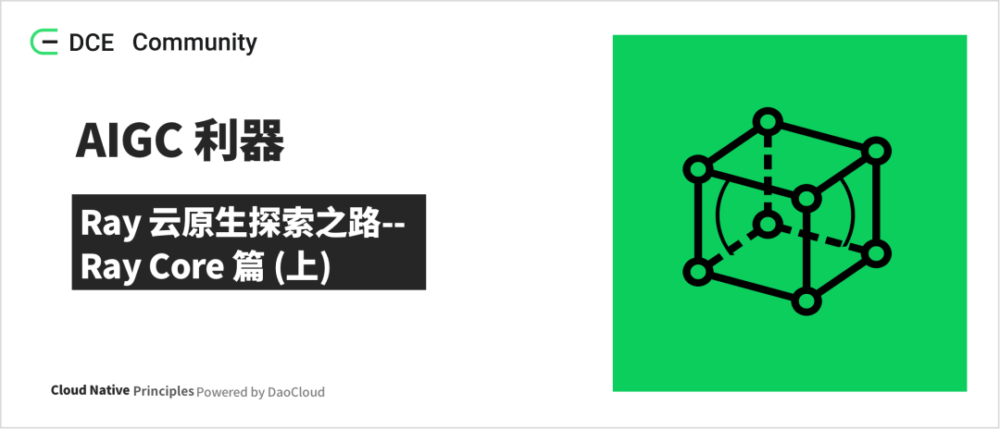

本文介绍 Ray 分布式计算的底座：Ray Core 是怎样的一种分布式的计算框架。

## 基本概念

Ray Core 是 Ray 的底层的分布式的计算框架，使用基于 actor 模型来实现的一套计算框架，
它可以将 Python 的一个 Class 或者一个 Function 转成分布式的 actor 和 task，
在所有的机器上分布式的运行，并且 tasks/actor 之间可以通过分布式的对象存储能力来共享和传递 object 来完成分布式的一些协作。
Ray Core 的这些能力为其它的更高层的模块提供了一个分布式计算的基础框架。


```go
import ray
import os
import requests

ray.init()

@ray.remote
class Counter:
    def __init__(self):
        # used to verify runtimeEnv
        self.name = os.getenv("counter_name")
        self.counter = 0
    def inc(self):
        self.counter += 1
    def get_counter(self):
        return "{} got {}".format(self.name, self.counter)

counter = Counter.remote()

for _ in range(5):
    ray.get(counter.inc.remote())
    print(ray.get(counter.get_counter.remote()))

print(requests.__version__)
```

说明：

- __class Counter__ 在标注了 __@ray.remote__ 注解之后，同时使用 remote() 调用，如 counter = Counter.remote()，
  这里的 counter 就是一个 actor 的 handle，而 Counter 就是一个 actor。而 class 中定义的 function 在使用 remote()
  调用的时候，就表现成了一个 task。actor 是有状态，对于 Synchronous, Single-Threaded 类型的 actor，
  对于同一个调用者中按照顺序调用类成员方法的时候，需要保证顺序，才能保证结果的正确性，但是不同的调用者之间是可以并发处理的。
  对于 Asynchronous 或 Threaded 类型的 actor，即使是同一个调用者在调用成员方法的时候，也是可以不用保证调用顺序，进行异步的执行。
- 在一般的 function（不是 class 的成员方法）的定义上也标注了@ray.remote 注解之后，在调用的时候使用 remote()，
  就表现成一个 task。task 可以分布在不同机器上，并行的进行运行，而且是异步的方式，同时是无状态的。

## 整体架构

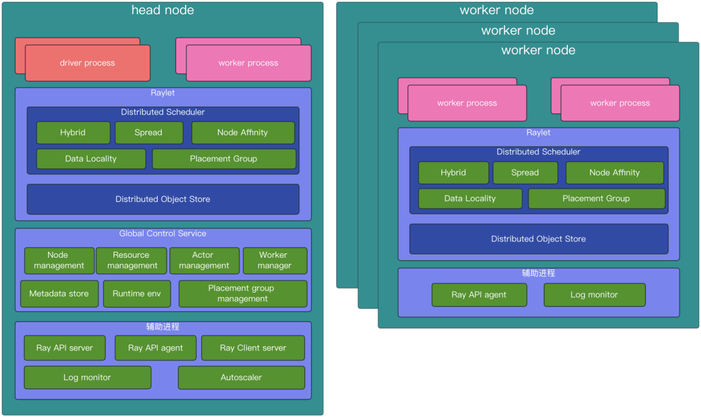

**driver process** ：driver 是程序的根，或者理解成 main 程序，这里指的是运行了 ray.init()方法的 code。
driver process 是一种特殊的 worker process ，用于执行 driver 的 process，它会执行顶层的应用（如 ____main____ in Python）。
它能提交 task，但是它不是自己去执行 task。同时 driver processes 能运行在任何节点上，只是默认是运行在 head 节点。
driver process 也会处理来自 log monitor 发送过来的 worker 节点上日志。同时，jobs 和 drivers 的关系是 1:1 的关系。

**worker process** ：worker process 负责 task 的提交和执行。一个 worker process 就是一个 python 的进程。
worker process 可以是无状态的，这种 worker process 可以被用来重复地执行一般的 task，这里一般的 task 指的就是使用了
ray.remote 标注的 function。worker process 也可以用于执行有状态的 actor，这里有状态的 actor 指的是使用了 ray.remote
的 class，在一个 actor 被实例化的时候，就会创建一个对应的 worker process，专门用于这个 actor 的运行，以及 actor
内的成员方式所对应的 task。每一个 worker process 和一个特定的 job 是相关的，默认初始化的 worker 的数量和所在机器的 cpu 核数一样。

**Distributed Scheduler** ：Distributed Scheduler 是 Raylet 组件的一部分，负责资源管理，task 放置的位置，
保证 task 运行所需要的参数对象可以从分布式对象存储的对象中获取。每个 Raylet 组件会跟踪本地节点的资源，
当一个资源请求被同意之后，Raylet 就会减少本地可用资源，一旦资源被使用完之后返还回来了，Raylet 又会增加本地的可用资源，
所以 Raylet 有一个强一致性的本地的可用资源的视图。同时，Raylet 也接收来自控制平面 GCS 服务的一些关于其它节点的资源使用的信息，
这个信息对于分布式调度是很有用的。比如，在集群范围内，可以均衡一点的调度 task。GCS 会周期性的去所有的 Raylet 拉取每一个 Raylet
的本地节点的可用资源，然后将这些信息通过广播的方式告知所有节点的 Raylet。一般的 task 提交是使用的分布式的方式提交 task，
也就是对于这些 task 的调度已经是去中心化了，举例来说，一个 task 的调用者在调度 task 的时候，首先会选择一个合适的 Raylet
发送 RequestWorkerLease PRC 请求，默认是发给本地节点的 Raylet 中的调度器，去申请运行 task 需要的资源。
但是也会根据数据本地化的原则，节点粘性的一些特性选择其它节点的 Raylet。当 Raylet 中的调度器经过分析之后，
觉得当前的节点就是合适的节点，那这个 task 就可以在本地的节点运行，如果本地 Raylet 觉得本地节点是不合适的，
那会告知任务的提交者去一个合适节点去申请资源，此时，任务的提交者就会去被推荐的节点的 Raylet 的调度器去申请运行 task 的资源。
以此类推，以类似的机制处理调度的请求，直到找到一个合适的节点，这个过程就是一个去中心化的分布式的调度方式。

**Distributed Object Store** ：负责存储和转移大对象。这里是分布式的方式支持对象存储。在本地存储的大对象，
在其它的节点上也是可以引用，在 task 执行的时候，如果 task 被调度的节点上，没有对应需要的对象，
就会到这个对象的节点去获取这个对象到本地，然后执行 task。这样不同节点的 task 之间是可以共享和引用这些对象的。

**Global Control Service** ：GCS 是一个 server，它是 ray 的控制平面，在新版的 ray 中，GCS 加强了容错能力，
这样 GCS 就可以运行在任意的节点，以及多个节点，而不是仅仅运行在 head 节点。GCS 服务主要包含以下能力：

1. 节点管理：管理节点的增加和删除，同时广播这些信息给所有节点的 Raylets，这样所有的 Raylet 就能感知到节点的变化。

2. 资源管理：广播每一个 Raylet 可用的资源给整个集群，这样可以保证每一个 Raylet 都可以及时的更新自己的全局的可用资源的视图，
   在分布式调度 task 的时候是很重要的。Ray 会先自动探测节点的资源数据作为可以调度的逻辑资源的设置。

3. Actor 管理：管理 actor 的创建和删除请求，同时也监控 actor 的存活情况，以及在 actor 失败的时候重新创建 actor。
   所有的 actor 在被调度之前是需要先注册到 GCS 中。

4. Placement group 管理：配合完成 Placement group 的创建和删除。管理 Placement group 的生命周期，同时使用
   two phase commit protocol 创建 Placement group。Placement group 是属于 job 或者 actor 的，当 job 或者
   actor 是处于 dead 状态，那 Placement group 就会被删除，这时所有使用了 Placement group 预留资源的 actors 和
   tasks 都会被 kill，同时释放资源。

5. 元数据存储：提供了一个键值对的存储能力，这些数据可以让任何 worker 访问到。这里只存储一些小的元数据。
   主要包括集群的 dashboard address，Remote function 的定义（当一个 worker 被指定运行一个 task，
   它会去 GCS 下载该 task 对应的 function 的定义），Runtime environment 的数据
   （默认情况下，Runtime environment 的工作目录是保存在 GCS），还有一些其它的组件也将元数据保存在 GCS，
   比如 Ray Serve 组件将部署的信息就保存在 GCS 中。

6. Worker 管理器：处理 Raylet 上报上来的失败的 worker。

7. 运行时环境：管理运行时环境的包，同时也会统计这些包的使用量，以及回收。运行时环境的包是可以共享的，在资源不足的时候会回收一部分。

**API server** ：不仅仅包含了 dashboard server，这里的 dashboard server 也可以理解成 dashboard 的 backend，同时还是提交 job 的 api 入口，也提供了一些集群状态的 api。

**API agent** ：收集本地节点的指标数据，用于去聚合集群层面的健康数据。也负责给 task 和 actor 去安装运行时环境用于执行 task 和 actor。

**Autoscaler** ：基于集群的资源的使用情况，以及 job 对资源的需求，去增加和移除集群的节点。

**Log monitor** ：当 task 和 actor 打印 logs 到它的 stdout or stderr，这些输出会被自动的重定向到对应的 worker 的日志文件。
在每一个节点上都会运行一个 log monitor，它会定期的从本地的 ray 日志文件中读取这些日志文件，然后通过 GCS pubsub 的机制，
发布这些日志消息到 head 的 driver 中去。

## Job 介绍

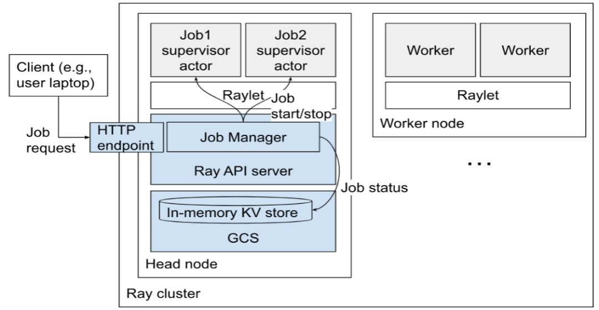

每个 job 由其对应专用的 job supervisor actor 来管理，job supervisor actor 是运行在 head 节点上，
后续会支持将 job supervisor actor 也可以运行在非 head 节点来减小 head 节点的压力。
job supervisor actor 运行在用户指定的运行环境下面，job 的 entrypoint command 作为其子进程进行运行，
同时会继承 job supervisor actor 运行的环境。这个 actor 在 ray 的 dashboard 中可以查看到，它是一个内部类型的 actor。

job manager 会管理这些 job supervisor actor 以及它的日志，同时 job 自己的 entrypoint script 的输出也会被写到
head 节点，这些日志文件可以通过 Http 的方式访问，也可以在 ray dashborad 上查看。

job 会报告自己的状态（如，PENDING、RUNNING、SUCCEEDED）和一些消息，这些被存储在 GCS 中，同时可以通过 API 的方式获取到。

如果想要停止一个 job，需要给对应的 job supervisor actor 发送停止事件，这个过程本身是异步的，
job supervisor actor 会负责中断 job 的子进程以及更新 job 的状态。

一个 job 会包含相关的 actors、tasks、objects 和 runtime env。jobs 和 drivers 的关系是 1:1 的关系。


## Actor 介绍

1. actor 的生命周期：

    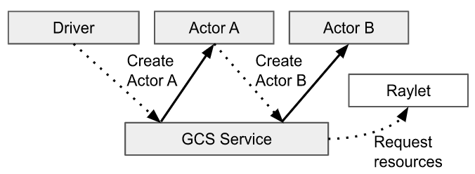

    - actor 的生命周期和它的元数据都是被 GCS 服务所管理的，每一个 actor 的 client 会缓存这个元数据在本地，
      这些元数据的信息中有和发送 Tasks 相关的信息，比如 actor 的地址，client 可以通过这个地址直接通过 gRPC
      发送 task 给 actor，这里发送的 task 主要指 actor 的成员方法所对应的 task。不像一般 task 的提交，
      一般 task 的任务提交完全是由调用者控制什么时候调度以及运行，通过分布式调度完成调度工作。而 actor 的整个生命周期都是由
      GCS 集中式的管理，包括 actor 的调度请求也是由 GCS 发起的，而不是 actor 的调用者。actor 被实例化之后会创建一个
      worker process，这个 worker 是当前这个 actor 专享的（不像给一般 task 使用的 worker，这种 worker
      是可以被 task 重复使用的），所有这个 actor 的成员方法的调用（也就是 task），会被调度这个指定的 worker，
      这些方法可以访问和修改这个 worker 的状态。

        

    - 当创建一个 actor 的时候，负责创建 actor 的 worker 会构建一个 task，这个 task 叫做 actor creation task，
      actor creation task 会运行 actor 的构造函数。负责创建这个 actor 的 worker 会等待 actor creation task
      运行所依赖的一些外部条件就绪了之后，会异步的注册这个 actor 到 GCS，对于 detached actors，注册的处理过程是同步的方式，
      对于 non-detached actors 的注册处理过程是异步的方式，然后 GCS 会负责调度 actor creation task 去创建 actor，
      就好像 GCS 是这个 actor 的调用者一样。
    - 同时，就像方法调用一样，创建的 actor 会返回一个 actor handle 给调用者。这个调用者就可以用这个 actor handle
      去调用 actor 的方法，也可以理解成发送 Tasks，因为 actor 的成员方法也是一个 remote 的分布式的 task。
      当一个 task 的参数是用的 actor handle，这个 task 不会立即调度，而是要等到 “actor creation task” 这个任务完成。
    - actor 的 tasks 执行和一般的 task 是类似的，这些 actor tasks 通过 gRPC 被直接提交给 actor process，但是这些
      task 不会直接运行，除非它的依赖都已经是 ready 的。但是 actor 的 task 和一般的 task 有两个主要的不同的地方：
        1. 默认情况下，actor task 执行是不需要资源申请的，因为 actor 在创建的时候已经申请了资源。
            actor task 就是 actor 的成员方法被调用的创建出来的方法。
        2. 对于每一个 actor 的调用者来说，同一个调用者调用的 actor 的方法时，也就是 task 是按照调用顺序执行的，
            这样就可以保证 actor 有状态的特性，这种模式的 actor 是 Synchronous, Single-Threaded Actor。
        3. 还有一种是 Asynchronous 或 Threaded Actor，这种 actor 的方法是可以异步，并且无顺序要求的。
    - 默认情况下，actors 在失败的时候是不会重启的，但是为了支持故障恢复，可以设置相关参数让其支持失败之后重启的能力，
      这里可以设置 max_restarts 和 max_task_retries 选项在 ray.remote() 和 .options() 里面。

    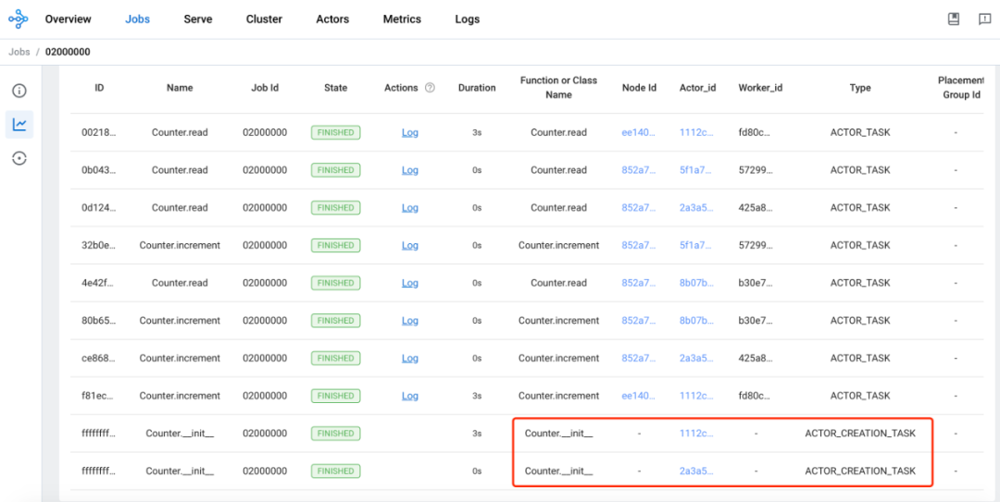

2. actor task 的执行：

    

    - actor task 指的是 actor 的成员方法被调用的时候所创建的 task。一个 actor 可能有无数个调用者，
    一个 actor handle 就代表一个调用者，同时 actor handle 中包含了 actor 的 RPC 地址，
    这样调用者就可以连接到 actor 进行提交 actor task 给 actor 对应的 worker process。

        

    - 一个 actor 可以并发处理很多的调用，上图仅仅显示了一次调用。

    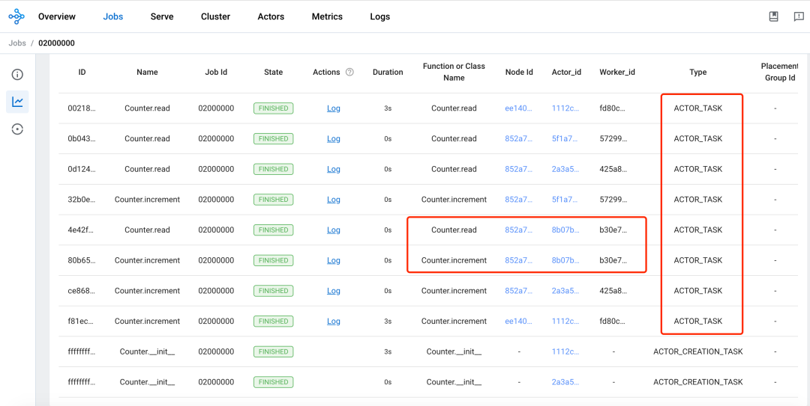

3. actor dead：

    

    - actor 可能是 detached 类型的也可能是 non-detached 类型，detached 是同步的场景，non-detached 是异步的场景，
      在使用中推荐使用 non-detached 的类型，同时也是默认的方式，当一个 actor 的所有的 actor handle 超出范围了（通过引用计数的方式来跟踪），
      这个时候，actor 的创建者会通知 GCS，然后 GCS 发送一个 KillActor RPC 给对应的 actor，之后 actor 将会退出它的进程，
      actor 可以被自动的垃圾回收。或者当 GCS 检测到 actor 的创建者退出了，也会中断对应的 actor，actor 可以被自动的垃圾回收。
      或者是 actor 对应的 job 退出了， 也会中断对应的 actor，actor 也可以被自动地垃圾回收。不管是哪种情况，提交给 actor 的，
      但是还没有执行的 tasks 就会报 RayActorError 错误。而对于 detached 类型的 actor，在不再需要的时候，是需要应用自己手动的方式去删除的。

    - actor 在运行期间，也有可能遇到不可预期的错误导致退出，那提交给 actor 的 task 也是会报 RayActorError 错误。

    - Ray 中支持设置 actor 失败之后的重启次数，如果设置了 max_restarts，那在 actor 的 owner 还存活的时候，
      GCS 会尝试通过 actor creation task 的方式，去重启 actor。在这个过程中，所有想要调用 actor 的客户端就会将要调用的
      tasks 缓存起来，在 actor 重启成功了之后再提交过去，如果 actor 重启固定次数之后，还是没有启动好，
      那缓存起来的，还没有运行的 actor task 就会全部被标记成失败。

    - 同时在 actor 重启成功之后，也有一个参数 max_restarts 来控制 actor task 的重启次数。

    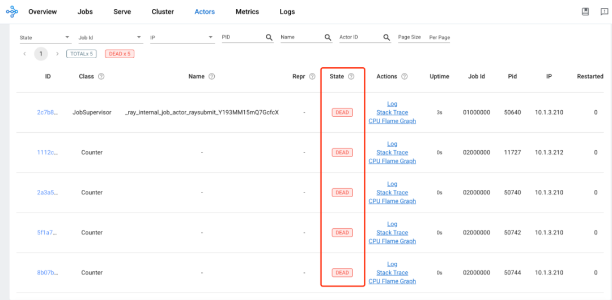

## Task 介绍

1. task 的生命周期：

    

    - 这里的 task 指的是一般的 task（NORMAL_TASK）。task 的持有者会负责保证一个被提交的 task 的执行，这里的 task
      的持有者可以理解成调用 function 的某一个 process，这个 process 也是 function 返回值的持有者。task 的持有者会去负责和
      raylet 通信去申请执行 task 需要的资源，这里为什么是和 raylet 通信，因为 raylet 中包含了分布式调度器。上图中 Driver
      是 task A 的持有者，Worker1 是 task B 的持有者，所以 Driver 会负责申请 task A 执行需要的资源，而 Worker1 会负责 task B 执行需要的资源。
    - 在申请资源之前，首先需要解决的 task 的依赖，才会去分布式调度器去申请资源。这里的 task 的依赖主要指的是 task（function）
      的参数依赖，因为参数可以是其它的 task 的返回值。分布式调度器会尝试去申请资源，同时去从分布式对象存储中去获取 task 的依赖（ObjectRef）
      到本地节点，一旦资源和依赖都就绪了，分布式调度器会同意资源的申请，然后返回一个可以执行这个 task 的 worker 的地址给到 task 的持有者。
    - 然后 task 的持有者就会通过 gRPC 的方式，去提交这个 task 到分布式调度器返回的 worker 中去运行。在 task 执行成功之后，
      负责执行 task 的 worker 需要保存 task 的返回值。如果 task 的返回值很小，worker 就直接将返回值返回给 task 的持有者，
      如果 task 的返回值比较大，那就存到分布式对象存储中，返回给 task 的持有者一个存放的位置。

    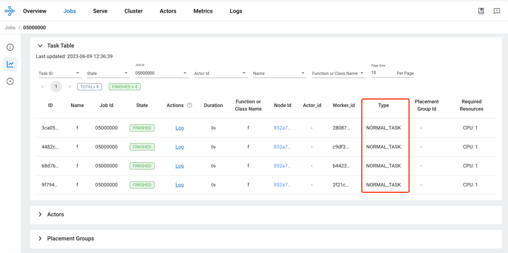

2. 分布式 task 调度：

    下图中，task A 已经在 worker1 中运行，task B 和 task C 已经被提交到了 worker1，所以在 worker1 的本地的关系表中已经包含了 X 和 Y 对象，
    X 代表 task B，Y 代表了 task C。首先来看看怎么样来调度 task B。

    

    - worker1 去询问本地的 raylet 中的调度器去给 task B 去申请资源。
    - 本地调度器告诉 worker1 去尝试 node2 去请求调度。
    - worker1 更新了本地的关系表去表示 task B 现在是阻塞在 node2 了。
    - worker1 去询问 node2 的调度器，去为 task B 申请资源。
    - node2 的调度器同意了 worker1 的资源请求，同时返回了 worker2 的地址给了 worker1。只要 task B 还在占用
      worker2 去运行，node2 的调度器会保证没有其它的 tasks 会被再指定到 worker2 上去。
    - 之后，worker1 就发送了 task B 到 worker2 去执行了。

3. Task 的执行：

    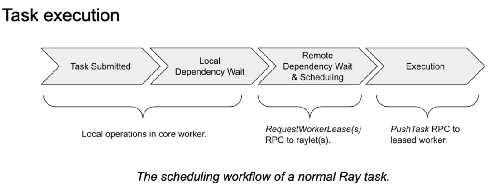

    - 依赖解决：task 的调用者在去分布式调度器去为 task 申请资源之前，会等待所有 task 运行所需要的依赖都就绪了。
      很多时候，任务的调用者也是其它任务的持有者，比如 foo.remote(bar.remote())，在这个例子中，task 的调用者是执行
      foo.remote 这个方法的进程，同时在 foo.remote()中又依赖了 bar.remote 这个 task 的返回值，而 bar.remote
      这个 task 也是属于 foo.remote 调用者的，所以这个时候不会直接调度 foo 这个 task，而是会等 bar 这个 task 已经完成了，
      才会去调用 foo 这个 task。在这个情况下，bar 这个 task 的返回值会被保存在本地的进程中，直接给到 foo 这个 task
      作为参数进行运行 foo 这个 task。如果 foo 这个 task 依赖的参数是不在本地的，比如是存在分布式对象存储中的大对象，
      那在调度 foo 这个 task 之前会将 foo 依赖的大对象拉到本地来，然后再完成调度和运行 foo 这个 task。
    - 资源满足：一个 task 的调用者通过发送资源请求给一个更合适的 raylet，也就是更合适的分布式调度器，那怎么选择哪个
      raylet 是更合适的，从以下三个方面考虑：
        1. 通过数据本地化优先， 如果一个 task 依赖了很多对象参数，那就会现在那些节点上能包含了绝大多数参数对象的节点，
            因为不需要再去读取很多的参数对象了，因为大部分都在某一个节点了，
            那就调度这个节点上，至于还有少部分没有的对象参数，只好从分布式对象存储中去读取到本地了。
        2. 通过节点粘性，如果目标 raylet 是通过 NodeAffinitySchedulingStrategy 策略指定的，那就直接到对应的节点的 raylet 去。
        3. 也是默认的一种方式，就是认为本地的 raylet 就是开始认为最合适的调度器，虽然最终可能不一定被调度在本地。
    - 在选择好了合适的 raylet 之后，raylet 首先会将资源的请求放到队列中，如果这个 raylet 同意了资源请求，
      就返回给调用者当前 raylet 它的本地的 worker 的地址。

## Object 介绍


Object 是一个应用的 value，这些 value 是由 task 返回的或通过 ray.put 创建的。
一个 Object 的 value 是不可变的值，一旦创建就不能修改，它可以被存储，也可以被引用，只要是在 Ray cluster 集群范围内。

task（function）是可以有返回值的，这个返回值是一个 Object，当在某一个 worker 中，去调用这个 function
的时候就会去提交创建这个 task 的请求，那这个 task 的返回值就属于这个 worker 的，这个 worker 就是 owner。
所以在这个情况下，Object 的 owner 是通过提交 creating task 来创建初始 ObjectRef 的 worker。
同时这个 worker 会保存这个 Object 的引用计数。

ray.put(obj) 这种方式也是可以创建一个 Object，当在一个 worker 中，调用 ray.put 的时候，
所以在这种情况下，Object 的 owner 是通过调用 ray.put 来创建初始 ObjectRef 的 worker。
同时这个 worker 会保存这个 Object 的引用计数。

当前，worker 可以使用 ObjectRef 来引用对象。Object 的生命周期是由它的 owner 管理的。
Ray 会保证，如果 Object 的 owner 是存活的，那么 Object 最终可能被解析为它的 value
（或者在 worker 失败的情况下抛出错误空）。如果 owner 挂了，尝试获取该 Object 的值将抛出异常，即使该 Object 仍然存在物理副本。

Object 是可以被保存在 owner’s in-process memory store，也可以保存在分布式对象存储中。
in-process memory store 是被分配在 owner 的堆内存的，同时不会限制内存的大小，因为在 Ray 中，
只有小的 Object 才会保存在 worker 的 in-process memory store，如果小的 Object 太多了，
也会导致 worker 因 OOM 而被 kill。那些保存在分布式对象存储中的大的 Object 首先会被保存在共享的内存对象存储中。
共享的内存对象存储会强制一个用户指定容量的限制（默认是机器内存的 30%），同时在达到容量限制的时候会保存到本地磁盘。
这样做是为了减少每个 Object 的内存占用和解析时间。

有两种方式可以获取到 ObjectRef 对应的 Object 的 value。1. 一种是通过在一个 ObjectRef(s) 上，
调用 ray.get 的方式；2. 另一种是传递一个 ObjectRef 作为 task 的参数，当 worker 去执行这个 task 的时候，
就会解析这个 ObjectRef，然后使用解析出来的 value 去替换 task 的参数。

对于一个小的 Object，可以直接从它的 owner 的 in-process store 中去解析出来。
如果是被保存在分布式对象中的大的 Object，就必须通过分布式协议去解析这个大的 Object 了。

当一个 task A 的返回值是一个大的 Object，它会被保存在运行这个 task A 的节点 A 的
local shared memory store 中，当另一台节点 B 的 task B 要用 taskA 的返回值作为 task B 的参数，
那首先会从调用 task B 的调用者，也就是 taskB 的 owner 中查找 object directory，
从中得知 task A 的返回值这个大的 Object 的保存为位置，这里可以简单理解为节点 A，
接下来，task B 所在的 raylet 是会去节点 A 的 raylet 中的分布式对象存储中去读取 task A 的返回值对象，
这时会使用到分布式协议，将需要的对象复制到本地。这里提一下 object directory
，在 object directory 就保存了 object 的位置信息，在之前的版本是保存在 GCS 中，
现在的版本是保存在 owners 中的（这里的 owner 就是 task 的调用者）。
当在节点 A 的 task C 要使用 task B 的返回值，这个时候就会直接从节点 A 的 local shared memory store 中直接去获取了。


## Placement Group 管理

描述：Placement Groups 主要是用来申请预留一些资源用于去运行 actors 或 tasks。actors 或者 tasks
可以在运行的时候指定 PlacementGroupSchedulingStrategy。Placement Groups 在预留资源的时候的表现形式是使用
Bundles 来表示，Bundles 是一组资源的集合，如 bundle 0 为 {"CPU": 1}, bundle 1 为 {"CPU": 1, "GPU": 4}。
一个 Placement Group 中可以包含多个 bundles，需要注意的是 bundle 是在 Placement Groups 的最小单元，
而且一个 bundle 可以被预留的前提是，资源的申请不能超过单台机器的资源剩余。举例来说，集群的机器中，
具有最充裕资源的机器剩下了 cpu :5 ，gpu :5，如果定义了一个 Placement Group，Placement Group
中定义了一个 bundle，这个 bundle 定义了 {"CPU": 5, "GPU": 9}，那这个 bundle 是不能被调度的，
也可以理解成这个 Placement Group 是无法被满足以及调度的。Placement Group 的资源预留也是可以跨机器预留的。
比如集群有 3 台机器，让每一台机器预留 {"CPU": 1, "GPU": 1}，然后 tasks 分布在这三个机器运行。
通过 Placement Groups 的能力，可以让 actors 或者 tasks 以 gang scheduling（组调度，要么一起运行，要么都不要运行）的方式运行。

```go
# 创建一个actor，并使用placement group。
actor = Actor.options(
    scheduling_strategy=PlacementGroupSchedulingStrategy(
        placement_group=pg,
    )
).remote()
```

Placement Group 创建：

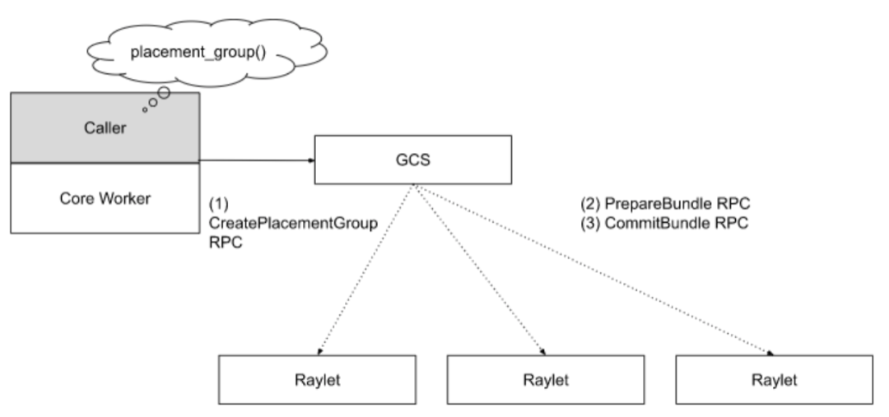

当应用请求去创建一个 placement group 的时候，应用所在的 worker 会基于 RPC 去发送一个同步的请求给到 GCS，
GCS 会先将请求保存起来，然后排队。因为 placement group 的资源申请可能会跨节点，所以 Ray 使用了两阶段提交保证原子性，
如果在这个过程中，有任何的 raylet 挂了，那这次创建过程就会回滚，然后这次创建的请求是重新进入队列排队。
不像 tasks、actors、objects、placement groups 是不需要引用计数的。因为 placement groups 的持有者是
job 或者 detached actor，当 own 这个 placement group 的 job 或者 detached actor 是 dead 状态了，
那这个 placement group 也就会被自动的删除了，所以不需要引用计数的方式，因为会自动的垃圾回收。
同时也支持用户直接调用 api 的方式去删除一个 placement group。placement group 也可以像 actor 一样有 detected，
placement group 也可以有 detached placement groups，需要手动创建和手动删除的，举例来说一个 task 使用了 detached
类型的 placement group，那这个 placement group 不会随着 task 的销毁而自动被删除，detached placement groups
的生命周期是超越了它的 owner 的。当一个 placement group 被销毁了，所有使用这个 placement group 的 actors，
tasks 都会被 kill，同时 placement group 预留的资源会释放出来。

在云原生的方案中，也有类似能力的组件可以平替 placement group，如 Kueue 等来完成组调度的能力。

## 节点管理

当 raylet 启动的时候，它会注册到 GCS 中去，GCS 将注册上来的 raylet 的相关信息保存在存储中，
一旦 raylet 被成功注册到 GCS，这个注册的事情信息就会被广播给所有的 raylets。

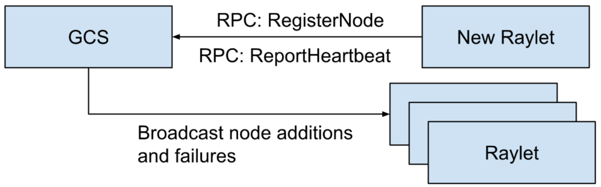

当节点完成注册之后，GCS 会通过周期性的监控检测去监控这个节点的 raylet 的健康不健康。
同时 GCS 也会拉取这个 raylet 的资源视图，然后将这个信息也广播其它的 raylets。
如果这个 raylet 失败了，GCS 也会将这个失败的消息广播给其它的 raylets。一旦 raylet 收到了这些消息，
它们就开始清理相关的状态。同时 raylet 也会统计它所在节点的本地进程中哪些是挂掉的，去告知 GCS，
然后 GCS 再将这个信息再广播给其它的 raylets。这个有助于去清理系统中相关不一致的状态，去更好的帮助完成 tasks 的提交。


## 资源管理


GCS 负责保证所有的 raylets 有最新的集群资源使用的视图。这样分布式调度器就可以更有效的完成调度，
如果这个视图是不够新的，那就可能会给分布式调度器造成调度不准确的问题，导致 actors/tasks 不能很好的被调度到合适的位置。
默认，GCS 会每隔 100ms 从所有的注册到自己的 raylets 去拉取最新的资源使用情况的视图，也会间隔 100ms 去广播给其它的 raylets。
同时 GCS 也会为 Autoscaler 组件提供当前集群的负载的数据，以帮助 Autoscaler 去判断什么时候给集群增加机器和从集群中移除机器。

## 总结

从上述的分析中，可以看到 Ray Core 中的整体架构、关键能力、基本的工作方式等。上述为 Ray Core 的部分分析，
还有一部分的分析会放到下一篇，同时在下一篇中会有实践的内容，可以更直观一点地认识 Ray Core。

参考链接：

- [Ray 文档站](https://docs.ray.io/en/latest/)
- [Ray v2 架构](https://docs.google.com/document/d/1tBw9A4j62ruI5omIJbMxly-la5w4q_TjyJgJL_jN2fI/preview#)
