# AIGC 利器 Ray 云原生探索之路--Ray Core 篇 (下)

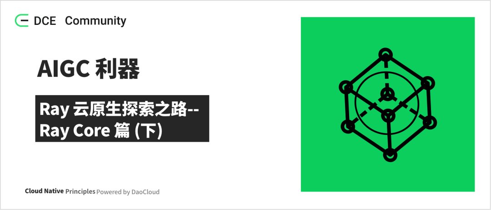

在上一篇《[AIGC 利器 Ray 云原生探索之路--Ray Core 篇 (上)](./230612-ray.md)》中，已经基本介绍了 Ray Core 的一些架构、关键概念等，在这里继续补充剩余的一些部分，并结合一些实践的操作，来帮助理解。

## 调度能力

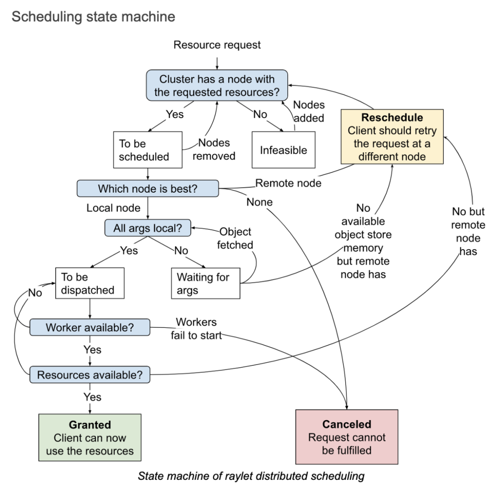

当资源请求 (i.e RequestWorkerLease PRC) 被 raylet 接受之后, 整个过程就如上图的状态机一样，主要包含三个状态:

- Granted: 在这个状态下，client 是可以使用申请的资源和 raylet 返回来的对应的 worker 去运行 actor 和 task 的。

- Reschedule: 如果有比本地节点更合适的节点的时候，就需要重新调度到别的节点，这个过程就是重新调度的过程。
  在这个过程中，本地节点是可以从集群视角去看到集群全部节点的资源使用情况。

- Canceled: 当申请的资源无法被满足的时候，就会取消本地的调度。比如一个 client 请求了一个特定的机器，但是这个机器挂了。
  再比如，给 task 请求分配的运行环境不能正常的创建出来，就会导致 raylet 不能启动 worker 去运行 task，这个时候调度的请求也会被取消。

调度策略主要包含：

- Hybrid Policy：如果不指定特定的调度策略，这个就是一种默认的调度策略。该策略首先是尝试将 task 放在自己本地来运行，
  但是当本地节点的资源使用量超过了配置的阈值（默认为 50%），就将 task 分配到其它的机器上，这个分配机器的过程是按照机器的 ID 进行排序
  （保证每次都按照相同顺序来），这里有第一远程节点、第二远程节点等等，依此类推，直到所有节点上的关键资源利用率都超过阈值。
  它将选择资源利用率最低的节点。该策略是在 bin-packing 和 load-balancing 之间进行平衡。
  bin-packing 的场景就是先紧着第一台机器，等第一台机器实在不行了，再到第二台，这种会造成大部分有 task 的机器的负载都很高，
  会导致一些不确定的问题，机器的负载高了，什么问题都可能发生。load-balancing 就是下面介绍的 spread 的方式，简单理解就是，
  有 task 大家一起均摊来运行，这种会有资源碎片化的问题。

- Spread Policy：该策略使用轮询的方式，在具有可用资源的节点之间分配 task，这样可以保证所有的 task 在整个集群中比较均衡地分布，
  不至于某一些机器的负载很高，其它的机器又很空闲。但这种调度的问题是，可能会导致资源碎片化。

- Node Affinity Policy：使用此策略，用户可以明确指定 task 或 actor 应运行的目标节点。如果目标节点处于活动状态，
  则任务或参与者只会在那里运行。如果目标节点已挂了，则取决于亲和力是否是软限制，task 或 actor 可能会被安排到其他节点或无法被安排。

- Data Locality Policy：简单理解就是，task 可能依赖很多参数对象，task 依赖的参数对象分布在哪个节点多，就调度到哪个节点去，
  这样就不需要将依赖的参数对象搬来搬去了。就是所谓的，数据本地化策略。

- Placement Group Policy：task 和 actor 将在 placement group 所在的位置运行。

## 运行时环境

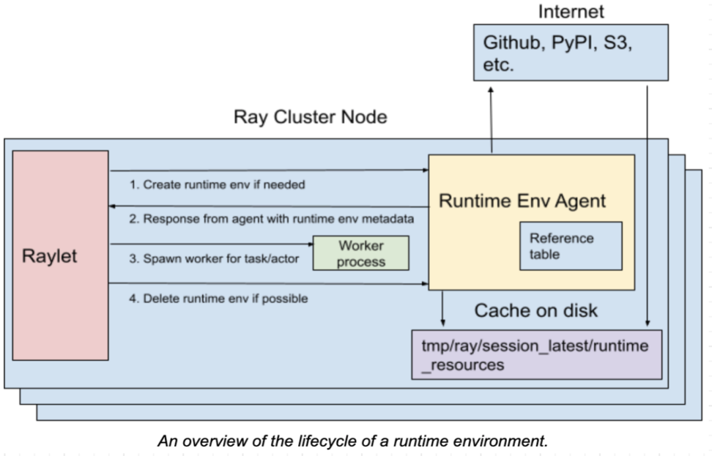

运行时环境 (Runtime Env)，定义了 python 脚本运行所需要的依赖，包括文件包，还有环境变量等，它是在运行时动态的被安装的，
可以提供给一个 Ray 的 job，或者 actors，或者 tasks 去运行。

运行时环境的安装和删除是通过运行在每一个 node 上的 RuntimeEnvAgent gRPC server 服务来完成的。
在调度 tasks 和 actors 的时候，RuntimeEnvAgent 组件也是一个关键的组件。

当一个 actor 或者 task 需要运行时环境的时候，raylet 会发送一个 gRPC 请求到 RuntimeEnvAgent 去创建运行时环境，如果不存在就创建。
当创建一个环境的时候会涉及到以下的一些工作：通过 pip install 去下载和安装包；为 worker process 设置环境变量；
在启动一个 worker process 之前，先调用 conda activate；从远程的云存储中下载文件等。

运行时环境中的一些资源，如下载的文件、被安装的 conda 环境，这些会被缓存在每一个 node 上，
这样在不同的 jobs、actors、tasks 之间可以共享这些资源。只有当缓存的大小超过一定的大小，
那些当前没有被任何 jobs、actors、tasks 使用的资源就可以从缓存中删除。

可以在程序中指定，也可以在提交 job 的时候，设置 Runtime Env。同时也支持为 actor 或者 task 指定特定的 runtime env。

```go
# Option 1: Starting a single-node local Ray cluster or connecting to existing local cluster
ray.init(runtime_env=runtime_env)
 
# Option 2: Using Ray Jobs API (Python SDK)
from ray.job_submission import JobSubmissionClient
 
client = JobSubmissionClient("http://<head-node-ip>:8265")
job_id = client.submit_job(
    entrypoint="python my_ray_script.py",
    runtime_env=runtime_env,
)
 
# Option 3: Using Ray Jobs API (CLI). (Note: can use --runtime-env to pass a YAML file instead of an inline JSON string.)
$ ray job submit --address="http://<head-node-ip>:8265" --runtime-env-json='{"working_dir": "/data/my_files", "pip": ["emoji"]}' -- python my_ray_script.py
```


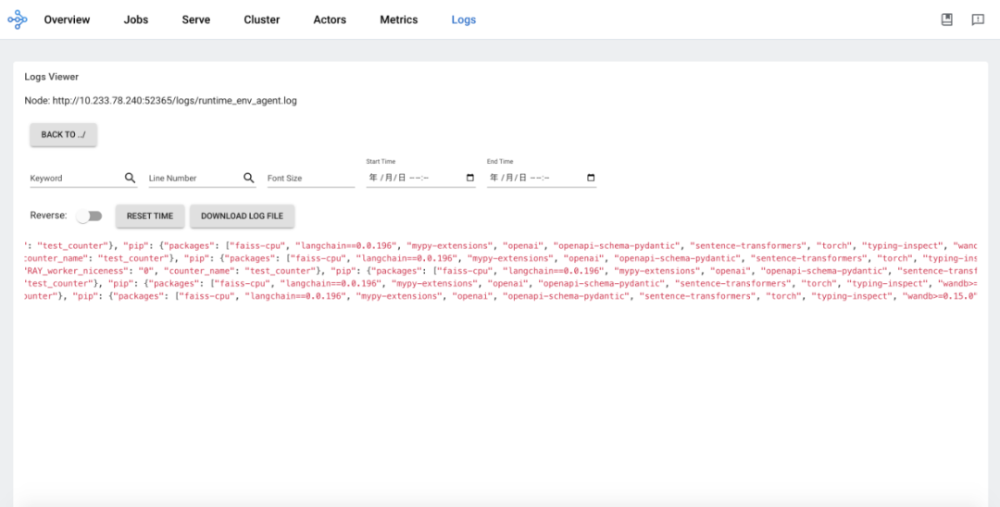

## 日志能力

当一个 actor 或者 task 打印日志到 stdout or stderr，这些 stdout or stderr 会被自动的重定向到对应的 worker 的日志文件中，
因为 actor 和 task 的运行都是在一个 worker process 中的。log monitor 组件会运行在每一个 node 上，同时它会周期性地读取
Ray 的这些本地日志文件，然后通过 GCS 的 pubsub 机制，发布这些日志消息给到 driver 程序。driver 程序会负责聚合和打印所有来自 actors 和 tasks 的日志。

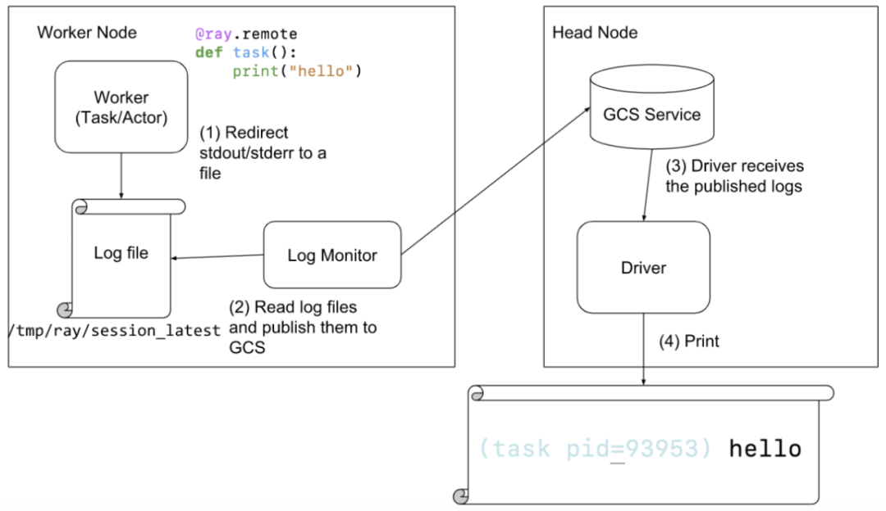


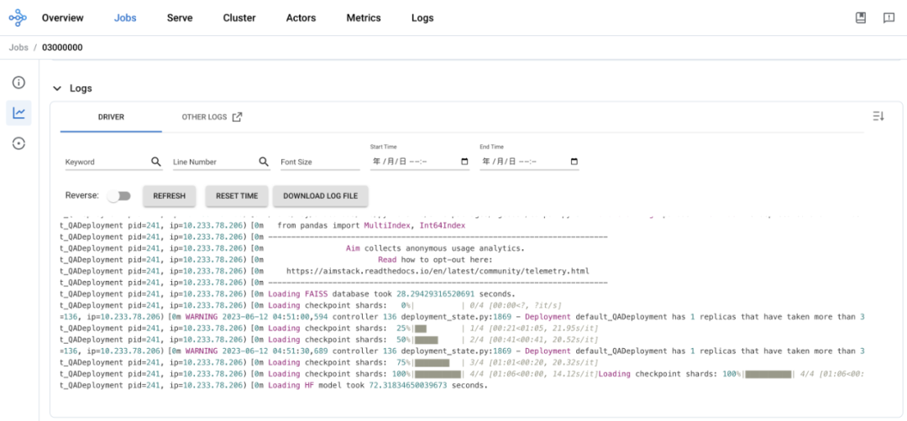

## Metrics 能力

Ray 原生地集成了 OpenCensus，同时默认支持将 metrics 数据导出到 Prometheus。所有的 Ray 的组件，
包括 GCS、raylet、workers 将自己的 metrics 数据 push 到它们本地的 Ray agent 进程中，
然后每个节点的 Ray agent 通过 OpenCensus 去暴露 metrics 数据，作为 Prometheus 的一个 exporter，
这样数据就可以被 Prometheus pull 到 Prometheus 里。

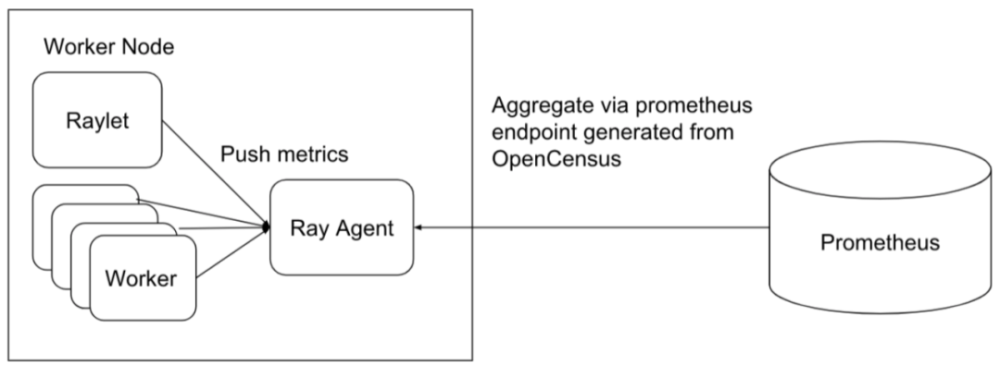

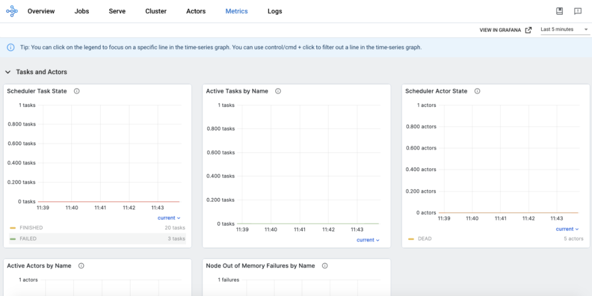

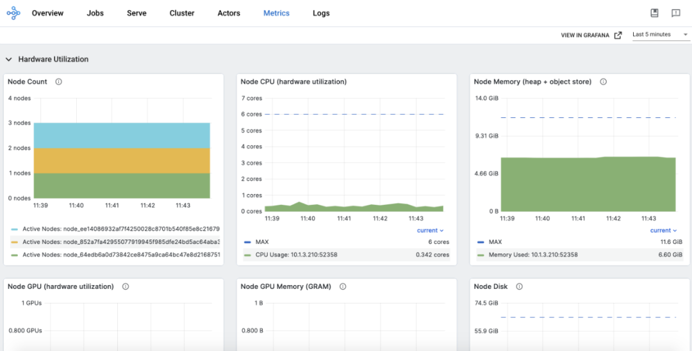

## GPU 能力

默认情况下，Ray 将通过自动检测主机硬件的方式得知 GPU 的设备数量，同时设置给自己，当然也可以通过设置来覆盖自动检测出来的结果。
如果一个 actor 或者 task 的执行需要 GPU 资源的时候，可以通过给 actor 或者 task 指定需要的资源请求，如@ray.remote(num_gpus=1)。
这个时候，Ray 会调度 actor 或者 task 到满足资源需求的机器，也就是有空闲 GPU 的机器去运行 actor 或者 task，
同时在 actor 或者 task 在运行之前，通过设置 CUDA_VISIBLE_DEVICES 环境变量，将 GPU 指定给 actor 或者 task。下面举例说明了这个过程：

```go
ray.init(num_gpus=2)
 
@ray.remote(num_gpus=1)
class GPUActor:
    def ping(self):
        print("ray.get_gpu_ids(): {}".format(ray.get_gpu_ids()))
        print("CUDA_VISIBLE_DEVICES: {}".format(os.environ["CUDA_VISIBLE_DEVICES"]))
 
 
@ray.remote(num_gpus=1)
def use_gpu():
    print("ray.get_gpu_ids(): {}".format(ray.get_gpu_ids()))
    print("CUDA_VISIBLE_DEVICES: {}".format(os.environ["CUDA_VISIBLE_DEVICES"]))
 
 
gpu_actor = GPUActor.remote()
ray.get(gpu_actor.ping.remote())
 
// 因为actor（gpu_actor）使用了第一个GPU，所以task（use_gpu）将会使用第二个GPU。
ray.get(use_gpu.remote())

# (GPUActor pid=52420) ray.get_gpu_ids(): [0]
# (GPUActor pid=52420) CUDA_VISIBLE_DEVICES: 0
# (use_gpu pid=51830) ray.get_gpu_ids(): [1]
# (use_gpu pid=51830) CUDA_VISIBLE_DEVICES: 1
```

在云原生的场景下，需要使容器可以识别 GPU 的设备，同时将设备信息传递给到 Ray 内部。Ray 的官方的 docker 镜像版本中，
提供了 GPU 版本的镜像了。在使用的时候，需要在 RayJob 的定义中指定类似 “ nvidia.com/gpu: 1 ” 这样的资源申请方式，
同时在 actor 或者 task 上指定需要的 GPU 请求，如：

```go
@ray.remote(num_gpus=1)
class GPUActor:
    def say_hello(self):
        print("I live in a pod with GPU access.")
```


## Autoscaler 能力


Ray Autoscaler 负责从集群中添加和删除节点。它查看分布式调度器公开的逻辑资源需求、集群中当前的节点、集群的节点配置文件，
计算所需的集群配置，并执行将集群移动到所需状态的操作。Autoscaler 会从 GCS 中去拉取当前集群的负载情况，然后调用云厂商的实现去添加和移除节点。

自动扩缩容的主要工作包含以下几点：

1. 当应用提交 actors、tasks、placement groups 去请求资源，如 CPU、GPU 等。

2. 调度器会查看资源的要求和可用的资源，然后决定 tasks 应该放置的位置，或者资源不满足的时候就会阻塞，这个信息会被作为一个快照放到 GCS 中。

3. Autoscaler 作为一个独立的进程运行，它周期性地从 GCS 中抓取步骤 2 中提到的快照，
   然后从中查看集群的可用资源、请求的资源、有什么 tasks 是阻塞的，以及 worker 节点被设置的配置，
   然后运行 bin-packing 算法（在调度部分提到过）去计算一下，在能保证运行中的 tasks/actors/placement group
   和阻塞的这些 tasks/actors/placement group 的资源都能满足的情况下，一共需要多少节点。

4. 然后 Autoscaler 使用 node provider interface 去添加和移除节点，各种 cloud provider
   可以去实现自己的 node provider interface，如 AWS、 GCP、Azure、Kubernetes 以及 on-premise 的数据中心。

5. 当新的节点启动了，也注册到 Ray 的集群中了，这些节点就可以接收应用的工作负载了。

## 实践

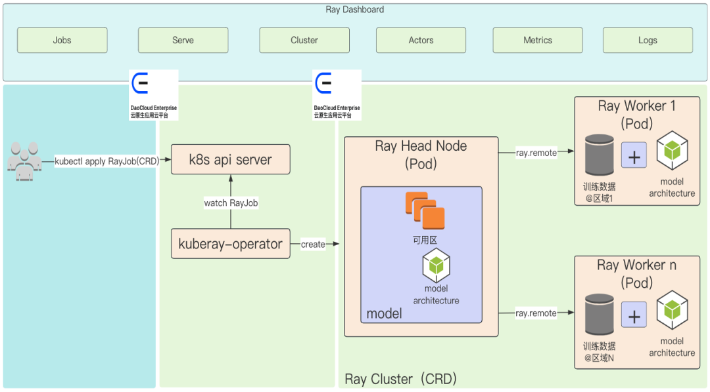

安装 KubeRay：

```sh
helm repo add kuberay https://ray-project.github.io/kuberay-helm/
 
# Install both CRDs and KubeRay operator v0.5.0.
helm install kuberay-operator kuberay/kuberay-operator --version 0.5.0
 
# Check the KubeRay operator Pod in __default__ namespace
kubectl get pods
# NAME                                READY   STATUS    RESTARTS   AGE
# kuberay-operator-7fc785cbbd-9jcpv   1/1     Running   0          14d
```

创建 RayJob：

```yaml
apiVersion: ray.io/v1alpha1
kind: RayJob
metadata:
  name: rayjob-sample
spec:
  entrypoint: python /home/ray/samples/sample_code.py
  # runtimeEnv decoded to '{
  #    "pip": [
  #        "requests==2.26.0",
  #        "pendulum==2.1.2"
  #    ],
  #    "env_vars": {
  #        "counter_name": "test_counter"
  #    }
  #}'
  runtimeEnv: ewogICAgInBpcCI6IFsKICAgICAgICAicmVxdWVzdHM9PTIuMjYuMCIsCiAgICAgICAgInBlbmR1bHVtPT0yLjEuMiIKICAgIF0sCiAgICAiZW52X3ZhcnMiOiB7ImNvdW50ZXJfbmFtZSI6ICJ0ZXN0X2NvdW50ZXIifQp9Cg==
  rayClusterSpec:
    rayVersion: '2.4.0' # should match the Ray version in the image of the containers
    # Ray head pod template
    headGroupSpec:
      # the following params are used to complete the ray start: ray start --head --block --redis-port=6379 ...
      rayStartParams:
        dashboard-host: '0.0.0.0'
        num-cpus: '1' # can be auto-completed from the limits
      #pod template
      template:
        spec:
          containers:
            - name: ray-head
              image: rayproject/ray:2.4.0
              ports:
                - containerPort: 6379
                  name: gcs-server
                - containerPort: 8265 # Ray dashboard
                  name: dashboard
                - containerPort: 10001
                  name: client
                - containerPort: 8000
                  name: serve
              resources:
                limits:
                  cpu: "1"
                requests:
                  cpu: "200m"
              volumeMounts:
                - mountPath: /home/ray/samples
                  name: code-sample
          volumes:
            # You set volumes at the Pod level, then mount them into containers inside that Pod
            - name: code-sample
              configMap:
                # Provide the name of the ConfigMap you want to mount.
                name: ray-job-code-sample
                # An array of keys from the ConfigMap to create as files
                items:
                  - key: sample_code.py
                    path: sample_code.py
    workerGroupSpecs:
      # the pod replicas in this group typed worker
      - replicas: 1
        minReplicas: 1
        maxReplicas: 5
        # logical group name, for this called small-group, also can be functional
        groupName: small-group
        rayStartParams: {}
        #pod template
        template:
          spec:
            containers:
              - name: ray-worker # must consist of lower case alphanumeric characters or '-', and must start and end with an alphanumeric character (e.g. 'my-name',  or '123-abc'
                image: rayproject/ray:2.4.0
                lifecycle:
                  preStop:
                    exec:
                      command: [ "/bin/sh","-c","ray stop" ]
                resources:
                  limits:
                    cpu: "1"
                  requests:
                    cpu: "200m"
######################Ray code sample#################################
# this sample is from https://docs.ray.io/en/latest/cluster/job-submission.html#quick-start-example
# it is mounted into the container and executed to show the Ray job at work
---
apiVersion: v1
kind: ConfigMap
metadata:
  name: ray-job-code-sample
data:
  sample_code.py: |
    import ray
    import os
    import requests
 
    ray.init()
 
    @ray.remote
    class Counter:
        def __init__(self):
            # Used to verify runtimeEnv
            self.name = os.getenv("counter_name")
            self.counter = 0
 
        def inc(self):
            self.counter += 1
 
        def get_counter(self):
            return "{} got {}".format(self.name, self.counter)
 
    counter = Counter.remote()
 
    for _ in range(5):
        ray.get(counter.inc.remote())
        print(ray.get(counter.get_counter.remote()))
 
    print(requests.__version__)
```

查看 RayJob：

```sh
$ kubectl get rayjob
NAME            AGE
rayjob-sample   14d
 
$ kubectl get raycluster
NAME                             DESIRED WORKERS   AVAILABLE WORKERS   STATUS   AGE
rayjob-sample-raycluster-25mkr   1                 1                   ready    14d
```

访问 Ray Dashboard：

- 全局视图：

    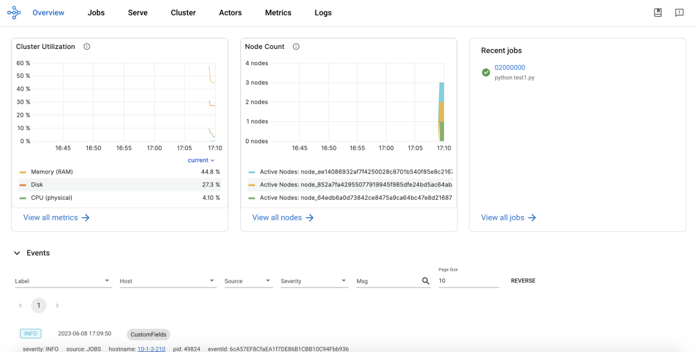

- Job 视图：

    

- 集群视图：

    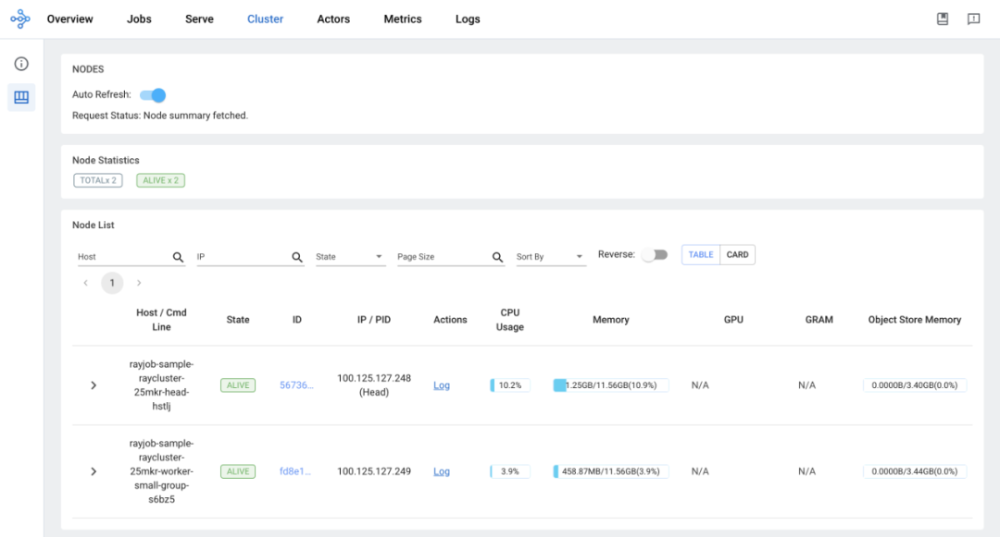

- Actor 视图：

    

- Metrics 视图：

    

- Log 视图：

    

## 总结

以上从 Ray Core 本身介绍了相关的知识，同时也基于社区 Kuberay 结合 Kubernetes 的方案，通过实践展示了一下 Ray Core 的相关能力。

参考链接：

- [Ray Documentation](https://docs.ray.io/en/latest/)
- [Ray v2 Architecture](https://docs.google.com/document/d/1tBw9A4j62ruI5omIJbMxly-la5w4q_TjyJgJL_jN2fI/preview#)
