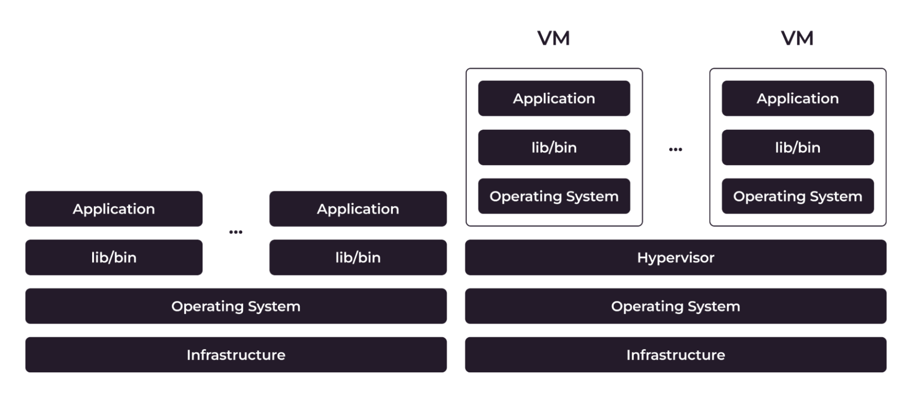
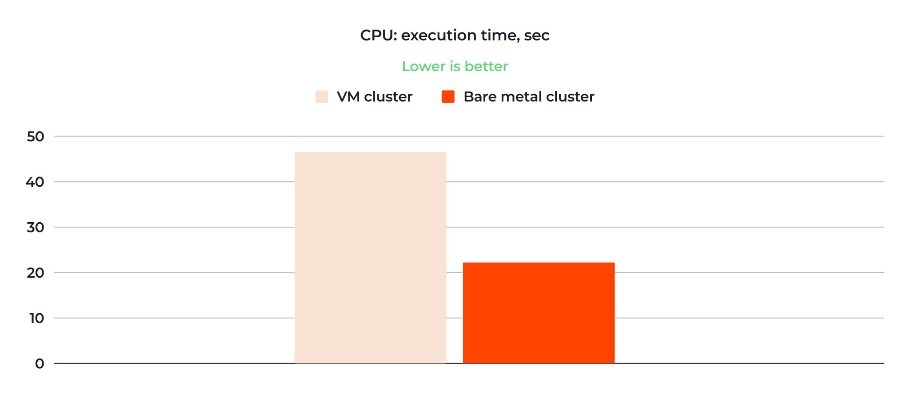
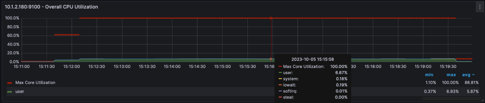
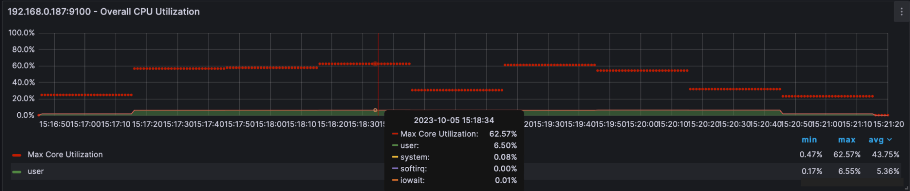
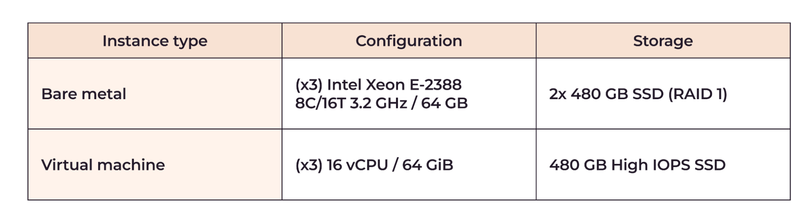
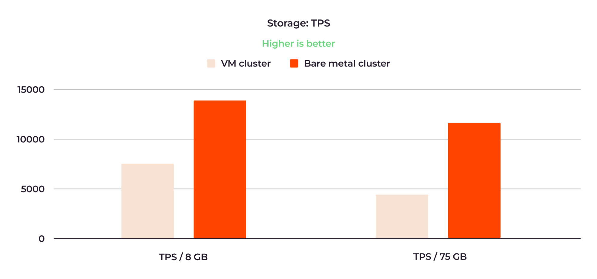
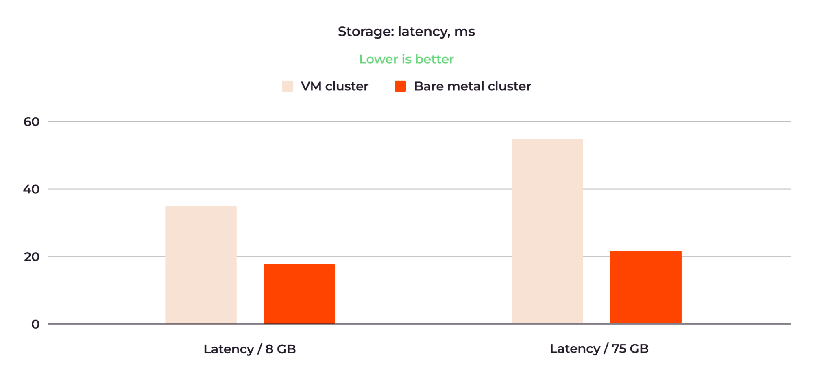
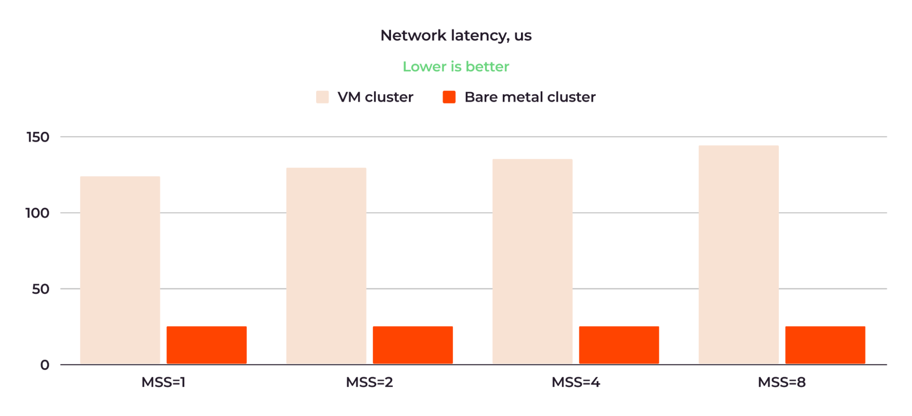

# Kubernetes：裸机 vs 虚机性能对比

本文对 Kubernetes 集群在虚机和裸机上在 CPU、内存、存储和网络性能方面的表现进行了详细的比较和分析。

> 英文原稿为 [Does Kubernetes Really Perform Better on Bare Metal vs. VMs?](https://thenewstack.io/does-kubernetes-really-perform-better-on-bare-metal-vs-vms/)
>
> 作者 Oleg Zinovyev 是 Gcore 的技术内容编辑，他在云原生技术（包括 Kubernetes）相关的各种公司有 5 年以上的撰稿经验。

许多人认为部署在裸机上的 Kubernetes 集群性能比部署在虚机上的要好，但直到现在还没有任何证据支撑这一假设。
在 Gcore，我们只向客户提供有充分证据支撑的信息，所以我们决定自己测试一下 K8S 部署在裸机和虚机上的性能是否真的有差异，
如果有的话差异有多大。我将分享我们内部测试的结果。

## 虚机和裸机 K8s 之间的差异

我有意不讨论裸机节点与虚拟节点的其他方面的竞争，比如成本效益或基础设施控制水平。这已经超出了本文的范围，本文仅专注于性能比较。

当您在虚机上部署 Kubernetes 集群时，与裸机相比，您会得到额外的基础架构层：一个虚机管理程序（hypervisor）和一个虚机操作系统。

**图 1：裸机和虚机架构的区别**

这些层会消耗物理 CPU 和 RAM 来运行，从而占用了一些计算能力。虚拟化也会影响网络和存储性能：虚拟网络和存储比物理网络和存储慢。

相比之下，当您在物理服务器上部署 Kubernetes 集群时，您不会有任何额外的基础架构层和虚拟化。
服务器的物理资源完全专用于您的工作负载，并且容器化应用程序直接访问这些资源。

## 我们如何比较虚机和裸机 Kubernetes 性能

为了全面了解虚机和裸机集群性能的比较，我们测量了以下指标:

- **CPU**：速度和利用率
- **RAM**：延迟
- **存储**：每秒事务数(TPS)和延迟
- **网络**：带宽和延迟

为了实验的纯净性，所有测试应用程序都是容器化的，并部署在正在比较的工作节点上。

## 我们的测试条件

为了测试，我们使用了在 Gcore [托管 Kubernetes](https://gcore.com/cloud/managed-kubernetes) 上运行的 K8s 集群。
但是，结果也适用于原生 Kubernetes，因为托管 Kubernetes 不会增加工作节点性能的额外开销。

为了使工作负载保持相同的条件，我们选择了类似配置的虚机和裸机工作节点。以下是这样的对比配置的一个示例:

- **裸机工作节点**：1x Intel Xeon E-2388 8C/16T 3.2 GHz / 64 GB / Ubuntu 22.04
- **虚机工作节点**：16 vCPU / 64 GiB 内存 / Ubuntu 22.04

## 测试结果摘要

在测试中，我们比较了两个 Kubernetes 集群，一个部署在虚机(VM)上，另一个部署在裸机上。它们的配置相似。作为测试工作负载，我们运行了:

- CPU 基准测试用于 CPU 测试
- Sysbench 用于 RAM 测试
- Pgbench 用于存储测试
- Netperf 用于网络测试

下表总结了最重要的测试结果:

显然，在所有情况下，裸机集群的效率都更高。

我们将在本文后面详细检查结果，并确定更好的裸机性能对您的工作负载意味着什么。
但是首先，让我们简单回顾一下在虚机上部署的 Kubernetes 集群与裸机上的基本区别。

## 详细的测试结果

现在让我们详细看一下裸机和虚机集群在每个评估标准方面的性能。

### CPU 速度和利用率

对于 CPU 速度比较，我们使用了 Alex Dedyura 的 CPU 基准测试。这是一个计算 π 到 10，000 位小数的脚本。
计算时间以秒为单位，在 10 次测试中取平均值，作为测试结果。计算 π 是一个 CPU 密集型任务，因此基准测试可以清楚地表明所测试 CPU 的性能。

以下是 CPU 速度比较结果:

**图 3：裸机集群的 CPU 速度比虚机集群的 CPU 快两倍多**

虚机集群的 10 次重试平均时间为 47.07 秒;对于裸机集群，它是 21.46 秒。因此，裸机集群速度快了两倍多。

以下是虚机集群的 CPU 利用率测试结果:

**图 4：虚机集群的 CPU 平均利用率为 86.81%**

**图 5：虚机集群 CPU 每个核心的利用率信息**

在上面的图 4 中，红点是最大 CPU 核心负载，绿色代表所有核心的总 CPU 负载。在执行脚本期间，
核心大部分时间以 100% 的利用率运行；平均值为 86.81%。在 15:16 左右还有一个小的抢占时间峰值，
这是当一个虚机由于等待物理 CPU 共享其计算资源而不执行的常见情况。

**最大 CPU 核心负载**：此指标通常指在 VM 内或跨 VM 主机上观察到的单个 CPU 内核的最高利用率百分比。
它指示某个特定 CPU 内核被利用的程度。

**所有内核的总 CPU 负载**：此指标表示主机上所有可用 CPU 内核的总体 CPU 利用率。
它考虑到所有 CPU 内核的组合使用情况，并提供有关主机上运行的所有 VM 使用的 CPU 容量的整体视图。

以下是裸机集群的 CPU 利用率测试结果:

**图 6：裸机集群的 CPU 平均利用率为 43.75%**

平均 CPU 负载约为 43.75%，最大值为 62.57%，没有抢占时间。因此，就 CPU 性能而言，测试表明裸机集群的效率约为虚机集群的两倍。

### RAM 延迟

对于 RAM 测试，我们使用了 sysbench 并通过 RAM 传输了 6400 GB 的数据。以下是执行的写操作和读操作的关键结果:

**图 7：裸机集群的 RAM 速度比虚机集群快约三倍**

虚机集群的写入平均时间为 174.53 毫秒，而裸机集群进行相同操作的时间为 62.02 毫秒。
读操作分别在 173.75 和 47.33 毫秒内完成。

这意味着裸机集群的 RAM 速度比虚机集群的 RAM 快约三倍。

### 存储 TPS 和延迟

为了测试存储性能，我们运行了一个 PostgreSQL 集群，并使用 pgbench 基准测试。
我们测量了 TPS（每秒事务数）和延迟。我们还改变了工作负载，在相同的集群配置上测试了 8GB 和 75GB 数据库。

以下是实例的配置:

**图 8：存储测试的裸机和虚机集群配置**

#### 存储 TPS 结果

以下是 TPS 比较的平均结果:

**图 9：裸机集群的存储 TPS 值约为虚机集群的两倍**

运行 8GB 数据库时，虚机集群显示 7，359 TPS，而裸机集群为 14，087 TPS。
75GB 数据库的性能结果分别为 4，636 和 12，029 TPS。

#### 存储延迟结果

以下是延迟测试的平均结果:

**图 10：裸机在存储延迟方面优于虚机**

运行 8GB 数据库时，虚机集群的延迟为 34.78 毫秒，而裸机集群的延迟为 18.17 毫秒。
对于 75GB 数据库，延迟分别为 55.21 毫秒和 21.28 毫秒。

运行 8GB 数据库时，裸机集群的存储性能约为虚机集群的两倍。对于 75GB 数据库，裸机集群相对于虚机集群的优势更加明显。

## 网络带宽和延迟

为了测试网络性能，我们使用了 netperf 基准测试，最大报文段大小(MSS)范围从 1 到 65536。
MSS 中的“段”元素是通过网络传输的一种 IP 数据包束。因此，MSS 越大，传输的流量就越大。

我们在两个物理节点上部署了三个工作节点：Worker 1 和 Worker 2 位于第一个节点上，
Worker 3 位于第二个节点上。然后我们测试了所有三个工作节点之间的网络性能。结果趋势在所有情况下都是相似的——裸机优于虚机。

最有趣的测试是工作节点之间物理距离最大的测试，即当流量在第一个和第二个物理节点之间流动时，
Worker 1/Worker 2（在第一个节点上）和 Worker 3（在第二个节点上）之间的距离。
我们可以认为这是所有测试中最具挑战性的条件。图 10 和图 11 显示了此测试的结果。
图 10 显示了 MSS 值为 1、2、4 和 8 时的网络带宽比较:

**图 11：裸机集群的网络带宽是虚机集群的 5 倍**

虚机集群的带宽范围从 MSS=1 时的 862KB/sec 到 MSS=8 时的 6.52MB/sec，
而裸机集群的带宽范围从 MSS 值为 4.17MB/sec 到 31MB/sec。平均而言，裸机集群的带宽是虚机集群的 5 倍。

图 12 显示了使用相同 MSS 值的网络延迟比较:

**图 12：裸机集群的网络延迟最高可降低虚机集群的 6 倍**

正如我们所见，在 MSS=8 时测量，虚机集群的延迟约为 145 微秒，而裸机的延迟为 24.5 微秒，高出约 6 倍。
此外，对于裸机集群，随着 MSS 的增加，延迟的增长速度更慢。

对于所有测试，请注意，我们报告的是集群网络内部的网络性能比较。我们测量了一个网络内部节点之间的带宽和延迟，
位于一个位置。如果我们使用不同位置的节点，这将增加互联网延迟，而互联网延迟是不稳定的，并且可能因提供商而异。
我们在合成条件下保持纯净;它们可能无法在实际环境中复制。但是，可以预期普遍趋势得以重现。

## 裸机性能优势的意义

与虚机相比，更好的裸机性能提供了两个简单但关键的优势:

- 部署在裸机工作节点上的应用程序运行和响应速度比部署在虚机上的快。
- 因此，当您选择裸机时，客户使用您的产品体验会更好。

我们的测试结果证明了一个常识，即对需要高性能和低延迟的计算密集型工作负载（例如数据库、AI/ML 模型和其他类型的实时应用程序）来说，
裸机确实更好。虚机适合对计算和延迟不敏感的工作负载，例如 Web 服务器、网站和开发环境。如果高性能和低延迟对您的用户至关重要，
并直接影响您的业务，您应该考虑在 Kubernetes 集群中使用裸机。

## 结论

我们的测试证实了裸机工作节点优于虚机工作节点的假设。我们还产生了关于裸机工作节点确实优于多少的具体数据，即:

- CPU 速度和利用率提高两倍
- RAM 延迟降低三倍
- 存储性能提高两倍以上
- 网络延迟降低五倍以上

如果您想在裸机工作节点上试用 Kubernetes，请查看 Gcore 的托管 Kubernetes。
我们提供了几种类型的工作节点配置，包括用于加速 AI/ML 工作负载的 NVIDIA GPU。
