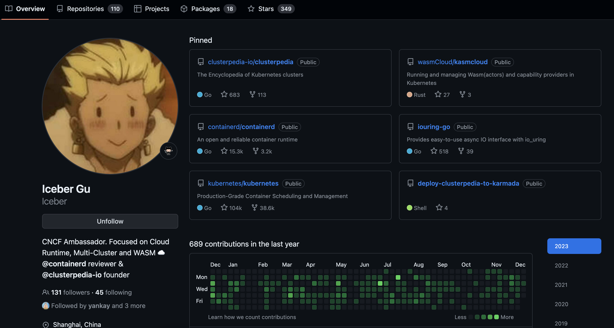
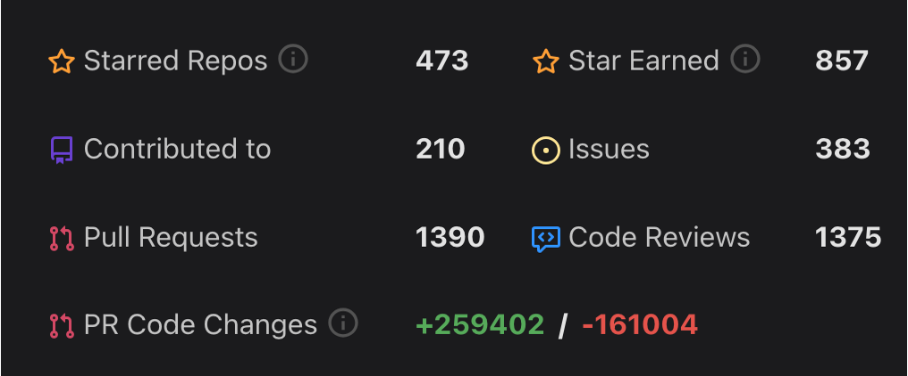
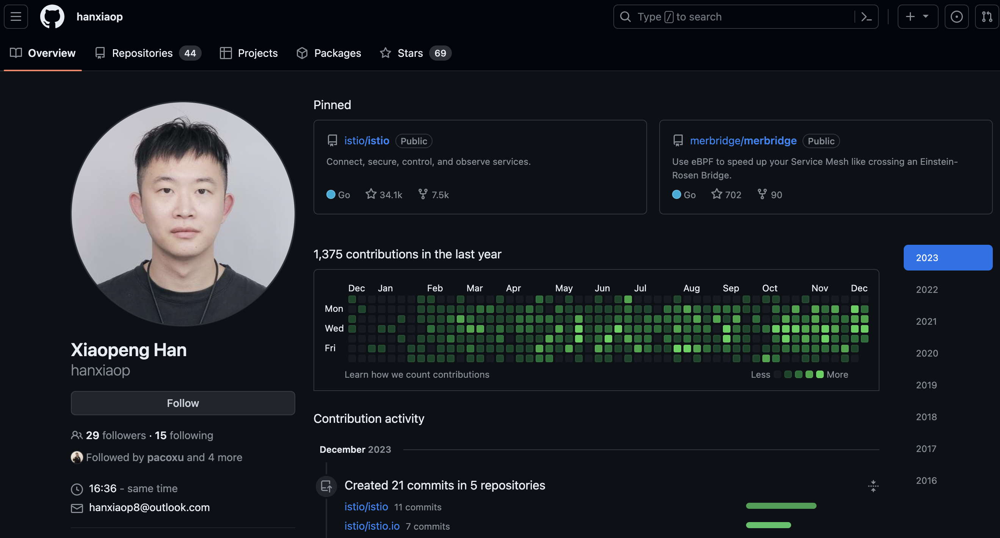
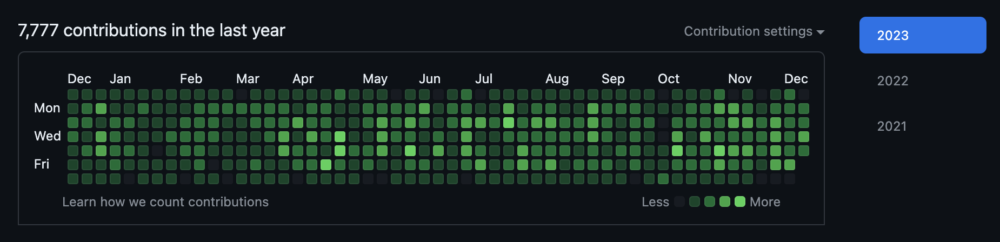
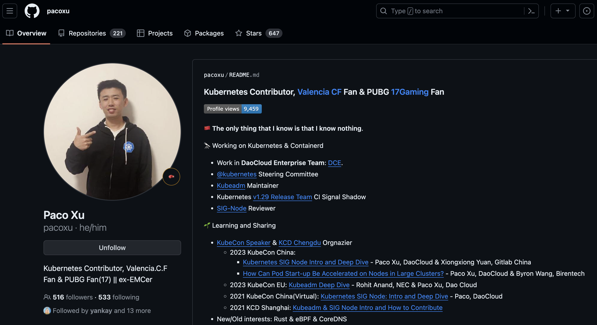
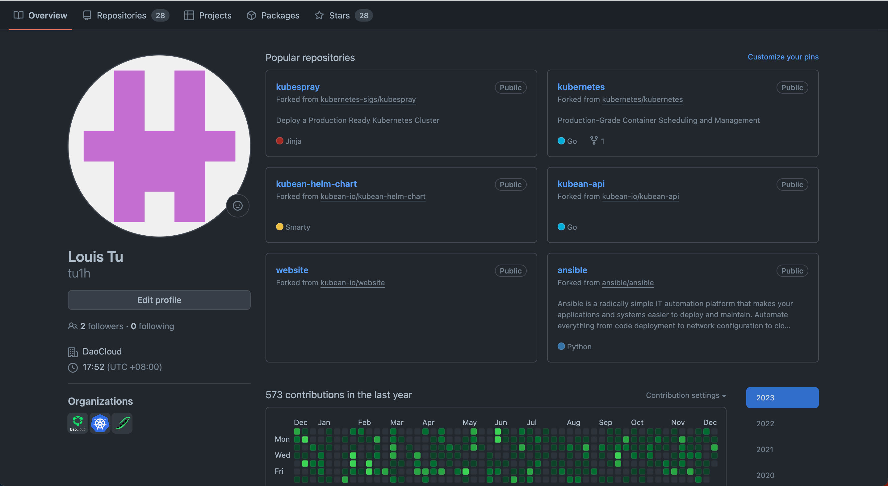
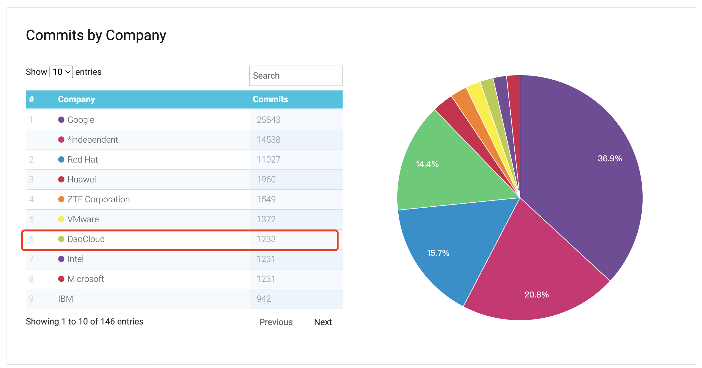

---
hide:
  - navigation
---

# 2023 DaoCloud 开源人物 - 开放原子开源基金会

> 作者：[Michael Yao](https://github.com/windsonsea)

开放原子开源基金会 OPENATOM 在 2023 年底组织了一次全国范围的开源贡献评估活动，经过由项目技术专家、基金会 TOC
成员组成的专家委员会为期半个多月的评选，最终确定了众多个人、团体和项目的开源奖项。

本次评选采用的是 2022 年 11 月 6 日 00:00 至 2023 年 11 月 6 日 24:00 期限内的贡献、运营数据。

## DaoCloud 获奖名单

DaoCloud 有 4 位船员荣获 “2023 开源活力贡献者 - 技术、生态贡献” 奖项：

- [蔡威](#_1)
- [张世明](#_2)
- [韩小鹏](#_3)
- [要海峰](#_4)

### 蔡威

[蔡威](https://github.com/Iceber)在 GitHub 化名 Iceber，是一个在代码海洋中游弋多年的精灵。
深耕容器运行时、多集群和 WASM 技术。

他是 2023 年新晋 CNCF Ambassador，作为主要负责人，积极组织了 [KCD Beijing 2023](https://www.cncf.io/reports/kcd-beijing-2023/)、
[KCD Shenzhen 2023](https://community.cncf.io/events/details/cncf-kcd-shenzhen-presents-kcd-shenzhen-2023/)
等多场云原生社区活动。

笔者第一次对他印象深刻是在 2021 年 DaoCloud 组织的黑客马拉松活动，当时蔡威一鸣惊人，
以 [Clusterpedia](https://github.com/clusterpedia-io) 夺冠 🏆。
后来此项目在 GitHub 上开源，顺利入选了 CNCF Landscape 和 CNCF Sandbox，
后被中国移动等大型企业采用，还有多家企业投入人力提交代码反哺社区，促进 Clusterpedia 功能进一步完善。
目前 Clusterpedia 已达成生产就绪状态，可以跨集群检索各类 K8s 资源，是 DCE 5.0 默认内置的一个模块。

他还在 2023 年开源了 [KasmCloud](https://github.com/wasmCloud/kasmcloud)，
这个全新的项目用于管理和运行 K8s 中的 Actor、Provider 和 Link，大家不妨尝鲜试用。

蔡威在闲暇之余笔耕不辍，在[自己的个人博客](https://icebergu.com/)上分享了多年的开发体验，让年轻的生命于指尖飞舞。
他还是 [containerd](https://containerd.io/) 和 [KubeEdge](https://kubeedge.io/) 项目中非常活跃的 Code Reviewer。

### 张世明

[世明](https://github.com/wzshiming)是 Kubernetes SIG-Node 的 reviewer 以及子项目 KWOK 的共同创始人和主要维护者，
主要关注 K8s 生态的可扩展性、性能、可靠性和测试。在 2022 年因在 K8s 社区贡献卓越，得到了
[K8s 官方的接见和采访](https://kubernetes.io/blog/2022/08/15/meet-our-contributors-china-ep-03/#shiming-zhang-https-github-com-wzshiming)。

他还是笔者在 GitHub 的启蒙老师，记得第一个跟他学习的项目叫 [Kubernetes Long-Term Support (KLTS)](https://klts.io/)。
就像字面含义，这个项目是给 K8s 提供长期后续支持。如今 K8s 1.29 刚刚发布，社区通常只维护三个版本，即 1.27、1.28、1.29。
那如果你使用的是 K8s v1.26 或更早的版本，社区无力也不会维护这些早期版本，但世明所在的团队正在做这个工作，而且默默付出做了很多年。
KLTS 保证了早期版本也能跟上 CVE 漏洞的维护步伐，不会让用户受困于时刻踏入陷阱的折磨。

继 KLTS 之后，世明又开源了一个测试类的项目 [KWOK](https://kwok.sigs.k8s.io/)，
这个项目一出生就加入了 kubernetes-sigs，是 DaoCloud 最出彩的开源项目之一。
借助 KWOK，任何人都可以用一台笔记本在几分钟内搭建一个数千节点组成的集群，是初学者、学院派、测试人员的福音，
你可以上面运行几乎所有的 kubectl 命令，分钟级搭建上千节点，毫秒级响应各种指令。
目前 Star 数 2.1K，已被苹果、IBM、阿里云、腾讯云等国际大厂运用于测试场景。

世明除了耕耘自己的两个项目外，还分身 K8s sig-node reviewer 评审代码，参与 K8s 社区建设工作。
多次作为 Speaker 参与 CNCF 组织的 KubeCon 和 KCD 的会议并分享议题。

另外世明还凭借 KWOK 在本次开放原子大会上荣获 “2023 优秀开源项目” 奖项。

### 韩小鹏

[小鹏](https://github.com/hanxiaop)目前在 DaoCloud 担任云原生开发工程师。
沉默寡言只是表象，诙谐幽默是为了更好地思考逻辑代码。

在开源社区方面，他是 Istio（CNCF 毕业项目）的 Maintainer（Top 15 贡献者），并且作为 Release Manager，
积极参与了 Istio 1.18、1.19 的发布，并主导了 1.20 版本的发布工作。在社区中，韩小鹏主要负责 istioctl
功能的大部分开发和 Istio 部署生命周期的维护工作。他还积极参与 Istio 控制平面的问题修复和功能开发。
此外，他经常在社区 Github 及 Slack 工作频道中回应用户关于 Istio 使用的问题，并修复一些当前版本存在的漏洞。

除此之外，小鹏还在 Merbridge（CNCF 沙盒项目）中参与贡献和 Code Review，积极参与功能开发的讨论。
他目前的 Title 汇总如下：

- Istio User Experience Maintainer
- Istio Release Manager
- Istio Environments Maintainer
- [Merbridge](https://merbridge.io/) Maintainer

小鹏作为服务网格技术的代表人物，曾参加 KubeCon、IstioCon、IstioDay 等开源大会，
多次作为 Speaker 向公众传播 Istio 服务网格技术，让网格技术的火花星星点点散落四方。

### 要海峰

他在 GitHub 化名 [windsonsea](https://github.com/windsonsea)，是一名专业的多语言文档、图片、视频开发和维护者。
两年来，他在 CNCF 社区内涉猎广泛，活跃于多个项目，承担着多个项目多语言文档的维护者角色：

- [docs.daocloud.io](https://docs.daocloud.io/) 负责人
- [kubernetes.io](https://kubernetes.io/) sig-docs-zh-owner, sig-docs-en-reviewer
- [Istio.io](https://istio.io/) maintainer
- [Merbridge](https://merbridge.io/) maintainer
- [Clusterpedia](https://clusterpedia.io/) maintainer
- [HwameiStor](https://hwameistor.io/) maintainer
- [Spiderpool](https://spidernet-io.github.io/spiderpool/v0.8/) maintainer
- [Kubean](https://kubean-io.github.io/kubean/en/) maintainer
- [karmada.io](https://karmada.io/) reviewer

海峰曾在 KubeCon China 2023 演讲了 [K8s Documentation and Localization](https://www.youtube.com/watch?v=2fRUliWmdPM)。
他还作为 KubeCon EU 2024 Program Committee 成员之一参与了 Cloud Native Novice 78 个议题的评审工作，为 CNCF 社区建设做出了突出贡献。

他认为文档如代码，能为各级贡献者提供易懂、易用的跨步阶梯，轻松找到每一阶的贡献切入点。
用键盘敲击的每一行文字恰如涓涓细流，滋润着这一片绿色的云原生技术田园。

## 演讲嘉宾

开放原子开发者大会于 2023 年 12 月 16 - 17 日在无锡盛大召开，届时 DaoCloud 有 3 位嘉宾上台演讲，传播开源技术。

### Paco

[Paco](https://github.com/pacoxu) 是 DaoCloud 开源团队 Lead，国内 K8s 领军人物，GitHub 粉丝数 516

- 有史以来第一位进入 Kubernetes Steering Committee 的中国贡献者
- kubeadm Maintainer
- K8s sig-node reviewer
- K8s v1.30 Release Signal Team Lead

Paco 作为 Speaker 时常活跃于国内外 KubeCon 大会，致力于传播开源技术。
他在本次大会演讲的主题为： **Kubernetes LTS 进展和年度升级支持 14:30-15:05 吴宴会厅 3**

### 张潇

[张潇](https://github.com/wawa0210) 是 DaoCloud 大容器、多云负责人，是人人称赞的潇哥。
深耕多云编排 Karmada 社区，目前是该项目的 Maintainer。

DaoCloud 当前主推的 [DCE 5.0 云原生操作系统](https://docs.daocloud.io/)就是以大容器团队完成的容器管理为核心，
在其上像搭积木一样构建了应用工作台、多云编排、镜像仓库、虚拟机、微服务、服务网格、中间件、云边协同等模块，
为各类应用场景提供一致、稳定的体验，支持异构云、边缘云、信创云、智算云等基础设施。

潇哥在本次大会上演讲的主题为： **多集群生命周期管理利器 Kubean 17:15 - 17:40 吴宴会厅 2**

### 涂立海

[立海](https://github.com/tu1h)是 DaoCloud 资深的后端开发工程师。
目前是多集群生命周期管理利器 [Kubean](https://github.com/kubean-io) 的 Maintainer。

他演讲的主题是 Kubean，这是一个 CNCF Landscape 项目，支持声明式 API 部署 K8s 集群，兼容 AMD 和 ARM 架构，
支持常见的 Linux 发行版，还支持国产鲲鹏构建的麒麟操作系统。

立海和潇哥在本次大会上演讲的主题为： **多集群生命周期管理利器 Kubean 17:15 - 17:40 吴宴会厅 2**

## DaoCloud 成绩

DaoCloud 深耕 CNCF 开源社区，现有 26 位 Maintainer 分布在不同的开源项目，涵盖了从代码开发、测试、多语言文档、发布、委员会等各个领域。
众志成城多贡献，助力 DaoCloud 这艘大船在云原生海洋中巡视一方。

**截止到 2023 年 12 月 14 日**

DaoCloud 在 Kubernetes 往年历史累计贡献[排名第 6](https://www.stackalytics.io/cncf?project_type=cncf-group&release=all&metric=commits&module=github.com/kubernetes/kubernetes&date=all)。

## 参考

- [开源原子开源基金会官网](https://www.openatom.org/)
- [2023 开放原子开发者大会](https://openatomcon.openatom.cn/)
- [2023 贡献者、开源项目评选正式启动！](https://mp.weixin.qq.com/s?__biz=Mzg4NDQ1NjkyNQ==&mid=2247508467&idx=1&sn=e9737a1f0e2679b912bee3d7d2525e8b)
