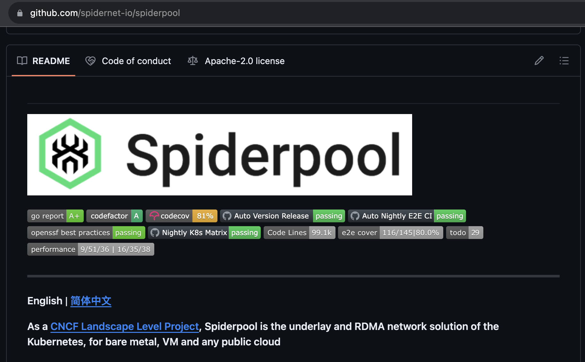
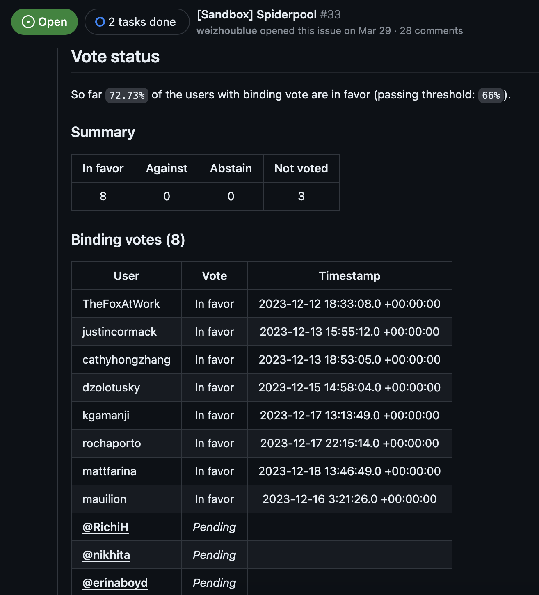
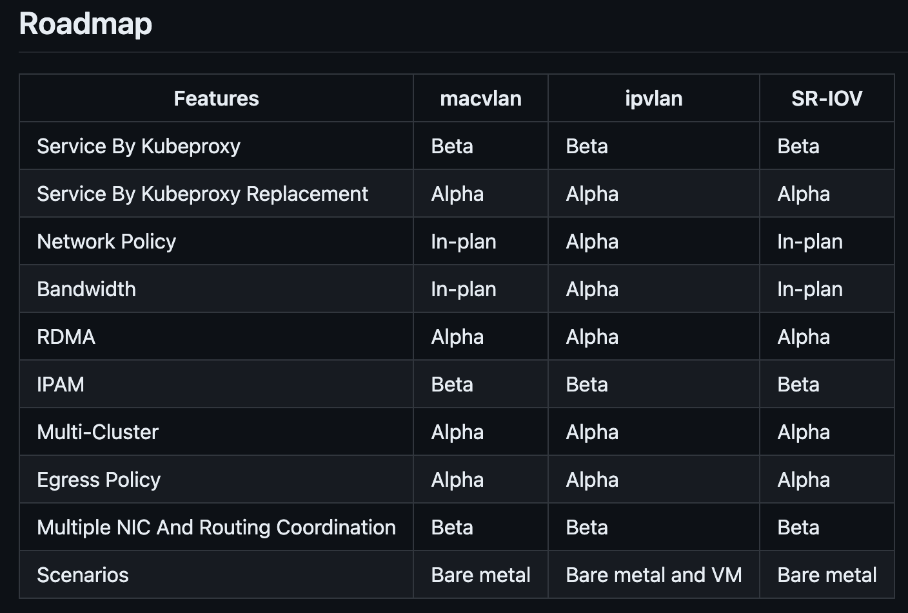

# 喜讯：高速网络方案 Spiderpool 入选 CNCF Sandbox

2023 年 12 月 19 日经 DaoCloud 开源，后捐赠给 CNCF 社区的
[Spiderpool](https://github.com/spidernet-io/spiderpool)
网络方案经 CNCF TOC 委员会投票，入选了 CNCF Sandbox。

## 简介

Spiderpool 是专为 Kubernetes 环境定制的 Underlay 下层网络和 RDMA 高速网络方案，
原生支持能够直接访问宿主机二层网络的 Macvlan、IPvlan、SR-IOV 等 Underlay CNI。
这个网络方案可应用在 **裸金属、虚拟机和公有云环境** 中，能够为网络 I/O 密集性、低延时应用带来优秀的网络性能，
包括 **存储、中间件、AI 等应用** 。

Spiderpool 提供了健壮的 Underlay 网络解决方案，并且在 InfiniBand、RoCE 场景下提供了 RDMA 通信能力，使 Pod 能够独享或共享 RDMA 设备，
能为 AI 应用、延时敏感型应用、网络 I/O 密集型应用带来极大的性能提升，其网络性能超过了传统的 Overlay 网络方案。
凭借这种网络协议栈 Offload 到网卡的技术，有效降低网络传输延时、提高吞吐量。

## 什么是 RDMA

RDMA（Remote Direct Memory Access，远程直接内存访问）是 AI 大模型时代的底层网络通信技术，
能够让网卡绕过远程主机操作系统内核访问内存中的数据。由于不经过操作系统，降低了 CPU/GPU 的负担和内核协议栈的处理，
不仅节省了大量硬件计算资源，同样也提高了系统吞吐量、降低了系统的网络通信延迟，尤其适合用在大规模并行计算机集群中。

RDMA 网卡目前有两种技术路径：InfiniBand 和 RoCE。InfiniBand（无限带宽，缩写为 IB）是一个用于高性能计算的网络通信标准，
它具有极高的吞吐量和极低的延迟，用于计算机之间的数据互连。RoCE 全称为 RDMA over Converged Ethernet，是一个网络协议，
允许在一个以太网网络上使用 RDMA。

Spiderpool 借助 Macvlan、IPvlan 和 SR-IOV 等 CNI，提供了同时基于 InfiniBand、RoCE 这两条路径的 RDMA 解决方案，
能够在 Kubernetes 运行环境中将 RDMA 网卡透传给 Pod 使用，实现 IPAM、宿主机连通、ClusterIP 访问等功能。

## Sandbox 旅程

Spiderpool 于 2023 年 6 月加入 [CNCF Landscape 中的 Cloud Native Network](https://landscape.cncf.io/?selected=spiderpool)。
7 月经过了 CNCF TAG (Technical Advisory Group) 网络小组成员的在线答辩，
11 月 Spiderpool 两位 Maintainer 在北美 KubeCon 上[介绍了 Spiderpool](https://www.youtube.com/watch?v=KqfzkOGObCQ)
的功能特性、安装和使用流程。

12 月中旬通过 TAG 工作组审查之后，CNCF TOC (Technical Oversight Committe) 11 位成员发起了正式投票，
在为期一周的投票期内，共收获 8 张赞成票，3 张弃权票（笔者猜测弃权的部分原因是受到了圣诞和元旦长假的影响）。
最终超过了 66% 的阈值，经 TOC 委员会批准进入了 [Onboarding 入职流程](https://github.com/cncf/toc/issues/1225)。

## 项目状况

Spiderpool 源码采用 Go 语言编写，自 2022 年 3 月开源以来：

- 共有 29 名贡献者参与开发
- 在 21 个月内发布了 49 个版本，平均每个月发布 2 个版本
- 截止到 2023 年 12 月 20 日，提交了 2200 个 PR，760 个 Issue

随着项目进入 Sandbox，开发团队将持续推进
[Roadmap](https://github.com/spidernet-io/spiderpool/blob/main/docs/develop/roadmap.md)
中各项特性的开发和优化：

目前 Spiderpool 已作为一种 Addon 加入到
[Kubernetes 网络策略清单](https://kubernetes.io/docs/concepts/cluster-administration/addons/#networking-and-network-policy)中。

## 加入我们

我们欢迎任何开发者、最终用户以及对云原生高速网络方案感兴趣的同学参与其中。

- [Slack #Spiderpool 频道](https://cloud-native.slack.com/messages/spiderpool)
- [Maintainer 邮件清单](https://github.com/spidernet-io/spiderpool/blob/main/MAINTAINERS.md)
- [每月 1 日的社区例会](https://us05web.zoom.us/j/84012992082?pwd=gWWIvpvCZOh8uCVeacoHjGpJULfIJW.1)
- 微信交流群

    
