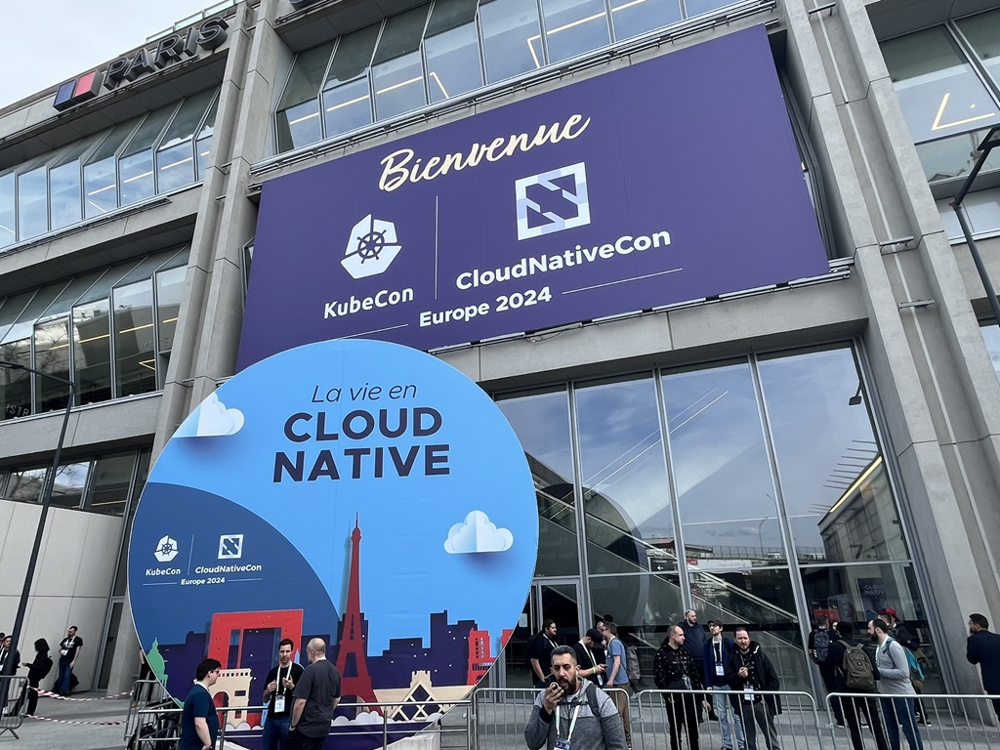

# 巴黎 KubeCon：平台工程、API 平台和智能代理引领创新

> [siliconangle.com](https://siliconangle.com/2024/03/23/platform-engineering-api-platforms-intelligent-agents-dominate-innovation-kubecon-paris/) 专栏作者 JASON BLOOMBERG

3.19 - 3.22 在巴黎举行的 [KubeCon + CloudNativeCon Europe](https://events.linuxfoundation.org/kubecon-cloudnativecon-europe/)
大会最引人关注的热点是基于 Kubernetes 为生成式人工智能构建基础设施。干货更多聚焦在平台层面。

我参加 KubeCon 这类大会的目的是发掘那些在各自技术领域独具创新、不断突破技术边界的厂商。
这是我就这一标志性开源大会为 SiliconANGLE 撰写的第七篇新闻稿，我的目标特别锁定在寻找那些我先前未曾接触过的参展商。

以下就是这份独家名单上的六家创新公司，再加上一家最近有收购行动的我的前客户。

## 下一代智能可观测系统

可观测性完全关乎于数据，如今在任何有数据的地方，你都会发现大型语言模型（Large Language Model, LLM）的身影，
它们是生成式人工智能背后的技术支撑。

大多数可观测厂商积极在其解决方案中整合 LLM，提供自然语言的聊天界面，这样虽有用处但并不特别具有革命性。

值得一提的是，[Robusta Dev Ltd.](https://home.robusta.dev/) 利用 LLM 实现基于可观测性的智能代理。
这是一种自治的软件，不仅能发现运营问题的根因，还能采取措施予以修复。

Robusta 的代理以迭代方式执行任务，能动态适应变化的数据环境。因此，Robusta 尤其适合解决动态云原生部署中的问题。

## 内部开发者平台：两个极端

在 KubeCon 大会上，平台工程是一个热议话题，其受关注程度仅次于人工智能。各厂商通过内部开发者平台来支撑企业的平台工程。
然而，不同厂商所提供的 IDP（内部开发者平台）产品形态大相径庭。

核心问题在于：提供的 IDP 应具备多大程度的预设倾向性？是应该让客户自行决定最佳的构建和使用 IDP 方式，
还是应该由 IDP 厂商将最佳实践内置于平台之中呢？

一个极端案例：[MIA srl](https://mia-platform.eu/) 也称为 Mia-Platform，
这家公司提供了一个用于构建 IDP 的平台，使得平台工程师在构建自己的 IDP 时，能够从众多开源或商业工具中进行选择。

Mia 专注于提供一致的用户界面，以简化整个软件生命周期内的开发者体验。
Mia 的灵活性使得平台工程团队在将基础设施改造为云原生的现代化过程中，能够整合原有的工具。

另一个极端案例是 [Kapeta Inc](https://kapeta.com/)。Kapeta 出售一个预设较多的 IDP，
这些预先构建的内容能够加快部署。鉴于其他 IDP 的部署可能需要数年时间，所以 Kapeta 这种高度预设的方法具有明显优势。
不同于预设较少的产品，Kapeta 的这款产品缩短了实现价值所需的时间。

一旦平台工程师部署了 Kapeta 平台，他们就可以通过 Kapeta 的插件架构整合相关工具。
因此，Kapeta 能够在保持 IDP 预设价值的同时，兼具必要的灵活性，迎合每个客户的需求。

## Day 0-1-2 企业级 Kubernetes 平台

Day 0 是指云原生基础设施部署的规划阶段。鉴于 Kubernetes 生态系统本身的复杂性，仅仅制定一个实施方案便是一项艰巨的任务。

Day 1 指的是 Kubernetes 及其所有相关插件的初始部署阶段，
而 Day 2 经常指的是在混合多云环境中通过多个 Kubernetes 集群搭建完整生产环境的阶段。

除了已在市场中拥有稳固地位的老牌厂商，鲜有其他厂商具备支持 Day-0-1-2 所有阶段的实力。
而 [DaoCloud Network Technology Co. Ltd.](https://www.daocloud.io/en/) \
多年深耕云原生事业，已具备这样的专业资质和能力。

DaoCloud 提供了一套分层的企业级 Kubernetes 平台解决方案。
这套方案在其云原生社区版基础之上增添了应用商店以及应用交付等能力形成 Day 0 级平台。
其能力涵盖了 CI/CD 流水线和 GitOps 支持等。

在 Day 0 级方案的基础上，DaoCloud 提供的高级版增加了微服务治理和可观测性。
而完整的企业白金版则叠加了多云编排和实时数据服务能力。

最终这款覆盖全系列场景的端到端云原生平台能够满足最复杂的企业场景需求。

## 支持 GraphQL 特性的下一代 API 平台

早期的应用程序编程接口（API）网关和管理平台主要是逐个处理 API 的安全性和可用性问题，
这就要求应用开发者自行了解何时以及应访问哪些 API。

而目前的 API 网关和管理平台利用 GraphQL 能力将多个 API 组合起来，关联到某个数据图谱，
使得前端开发者能够指定他们所需的数据，而不是具体调用哪个 API。

[Tyk Technologies Ltd.](https://tyk.io/) 提供了一个通用的数据图谱，
能够将多个 API 统一整合到单个 GraphQL API 端点中。
Tyk 同时提供了 API 网关和开发者门户服务，依托全开源技术底座，实现高性能 API 能力。

[Apollo Graph Inc.](https://www.apollographql.com/) 也利用 GraphQL 技术来实现类似 JOIN 的 API 组合。
他们提供了一种查询规划器，其工作原理类似于传统的关系型数据库 SQL 解析器，使开发者能够构建以业务为中心的 API，
从而对底层应用程序端点进行抽象化处理，赋予开发者更高的灵活性和效率。

通过这一抽象层，Apollo 赋予前端开发者维护底层数据业务上下文的能力，无需处理后端 API 的协议或参数。

## 面向环境的 Kubernetes 应用生命周期管理方法

我曾在 [Octopus Deploy Pty. Ltd.](https://octopus.com/) 初创时期与其短暂合作过，
该公司在这几年间取得了长足的发展，因此它理应在本文中占有一席之地。

Octopus Deploy 近期收购了[CodeFresh, Inc.](https://codefresh.io/)，
后者是一家领先的 CI/CD 平台厂商，是广受欢迎的 Argo 开源 CD 工具的主要维护者和引领者。

Octopus Deploy 将 CI/CD 部署到开发、预发布和生产等各个独立环境的上下文中。
每个这样的环境都可能包含不同云服务商提供的组件，也许会涉及异构的基础设施组件或多个 Kubernetes 集群。

Octopus 抽离了所有这类细节，使开发者和 DevOps 工程师能够在不同环境之间轻松迁移工作负载，
无需顾虑复杂的底层细节。同时，使用 Octopus 回滚到前一个环境的操作也非常简便。

Octopus 还支持边缘计算等其他场景环境。在边缘计算场景中，
企业可以根据地理位置（例如“将此代码推送到加州”）或业务背景（例如“将此代码推送到所有炼油厂”）定义特定的环境。

## Kubernetes 跨越鸿沟

高科技营销魔法之父 Geoffrey Moore 曾描述了某一特定技术的早期采用者与早期大众用户之间的鸿沟。
早期采用者愿意尝试尚不成熟的技术，获取先发优势。而早期大众用户仅仅希望能完成他们的工作。

在 KubeCon 上的 12000 名参会者大多更关注解决自身的业务问题，而非急于成为早期采用者，
这清楚地表明 Kubernetes 及其生态系统中那些更为成熟的云原生项目已达到了早期大众阶段。

对于本文中提到的这类创新厂商来说，跨越这一鸿沟无疑提高了门槛。
他们的产品必须能够明确解决企业公认的企业挑战，否则买家不会轻易买账。现在正是脚踏实地解决问题的时候。

_Jason Bloomberg is managing director of Intellyx. (Disclosure: Octopus Deploy is a former Intellyx customer. None of the other organizations mentioned in this article is an Intellyx customer. The CNCF covered the author’s travel expenses at KubeCon, a standard industry practice.)_

> Photo: Mark Albertson/SiliconANGLE
