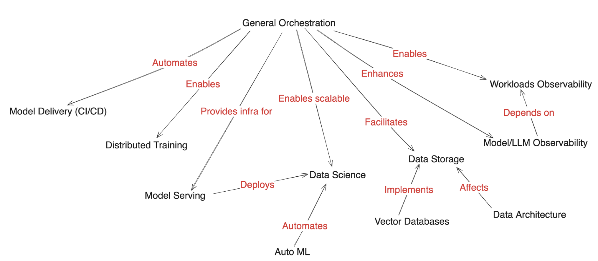
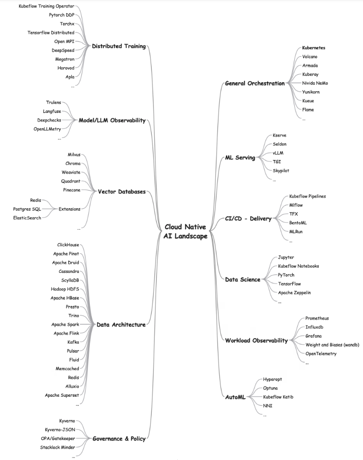

# 云原生人工智能白皮书

本报告由云原生计算基金会（CNCF）人工智能工作小组编撰。

> [英文原版](https://www.cncf.io/reports/cloud-native-artificial-intelligence-whitepaper/)发布于 2024 年 3 月 19 日

## 摘要

云原生（CN）与人工智能（AI）技术是当代最为关键的技术发展方向。云原生技术为应用程序的运行提供了一个可扩展、高可靠的平台。
随着人工智能和机器学习技术的持续进步，AI 正逐渐成为云平台上的主要工作负载。尽管云原生技术在一定程度上能够支撑 AI/ML 工作负载的运行，
但在实践中仍面临诸多挑战和不足，这也为技术创新和优化提供了广阔的空间。

本报告首先概述了当前 AI/ML 技术的发展现状，接着介绍了云原生技术所提供的支持，分析了目前面临的挑战和不足，并探讨了正在不断发展中的解决方案。
报告旨在帮助工程师和业务人员深入理解不断演进的云原生人工智能（Cloud Native Artificial Intelligence，CNAI）生态系统，并把握其中蕴含的机遇。

## 云原生人工智能（CNAI）概览

在我们深入分析云原生与人工智能技术融合的领域——即云原生人工智能（CNAI）之前，让我们对这两项技术的发展历程进行简要回顾。

### 云计算的兴起

自 2013 年起，随着容器技术的兴起，从 LXC 到 Docker，再到 Kubernetes（K8s），云原生（CN）这一概念逐渐广为人知并得到广泛应用。
如今，云原生已成为采用微服务设计模式构建均衡系统的代名词，该模式促进了模块化设计和开发，提高了可重用性，同时也增强了系统的可部署性、可扩展性和可靠性。

!!! tip

    **云原生计算基金会（CNCF）将云原生定义为：**

    云原生技术赋予各类组织在现代多变的环境中（包括公有云、私有云以及混合云等）构建和运营可扩展的应用程序的能力。容器技术、服务网格、微服务架构、不可变基础设施以及声明式 API 等，均是这一方法论的典型代表。

    这些技术通过降低系统间的耦合度，增强了系统的韧性、管理性和可观测性。结合强大的自动化能力，它们使得工程师能够更加频繁且可预见地实施重大变更，同时减少重复性工作。

    云原生计算基金会致力于培育和支持一系列开源的、供应商中立的项目，以此推动这一方法论的广泛应用。我们致力于将最先进的技术模式普及化，确保这些创新成果能够为社会各界所共享。

!!! note

    云原生人工智能是云原生不断发展的拓展。

    云原生人工智能（CNAI）指的是采用云原生的原则构建和部署 AI 应用和负载的各种方法和模式。
    为可重复和可扩展的 AI 工作流赋能，使得 AI 企业能够专注于自己的领域。

Kubernetes 已逐步演变为实际上的云操作系统，服务于私有云、公有云以及混合云环境。它实现了一个分布式的编排器，有效管理各类网络、存储和计算资源。
此外，K8s 还提供了一个接口，支持 DevOps 的最佳实践，例如 GitOps。
各大云服务提供商（CSP）均提供形式各异的 Kubernetes 服务，简化了基础设施的访问，并提供一系列支持服务，以便运行包括 AI/ML 在内的各类工作负载。

### 人工智能的发展

人工智能，作为一个术语，最早在 1956 年提出，指的是机器模拟人类智能的能力。
数十年来，人工智能已应用于语音识别、机器翻译、图像处理、游戏对战，甚至在“危险边缘”（Jeopardy）等竞赛中大放异彩。
然而，得益于人工神经网络和深度学习的创新，尤其在自然语言理解领域，人工智能在公众心目中的地位得到了显著提升。
人工智能主要分为两大类：判别式和生成式。

**判别式人工智能** 致力于学习决策边界或分类，并形成“模型”，用于预测新数据。例如，将电子邮件分类为垃圾邮件或非垃圾邮件，区分猫和狗的图像等。
判别式人工智能通常应用于已知期望输出的任务（如通过监督学习这一形式的机器学习）。
在序列预测方面，人工智能表现出色，例如，通过分析大量现有文本（包括我们的个人写作风格），高概率地预测我们接下来可能输入的内容。

**生成式人工智能** 则学习数据中的潜在结构或表示，并利用这些结构或表示合成新数据，如根据文字提示创作故事、音乐和视觉艺术。
生成式人工智能适用于期望输出未知或“正确”输出不明确的任务。通过生成式人工智能，人工智能已超越了人类对创造性、原创性和卓越性的传统认知。
下面，让我们近距离观察人工智能的一些令人瞩目的突破。

**卷积神经网络（CNN）** 最早在 1980 年代被开发，但直到 21 世纪初才得到广泛应用。近年来，CNN 因其能够从大量图像数据集中学习，并在物体检测、图像分类和分割等多种图像处理任务中表现出色，而变得越来越受欢迎。

**Transformer 模型** 由多伦多大学和谷歌的研究人员于 2017 年开发。变压器采用一种名为缩放点积注意力的机制，赋予了它们类似记忆的功能。
基于变压器的模型在自然语言处理任务中极为高效，如回答问题、文本摘要和翻译等，因此它们在大多数大型语言模型（LLM）中扮演着关键角色。最著名的 LLM 之一是 GPT，它驱动了广受欢迎的 ChatGPT 服务。

LLM 在大规模数据集上进行训练，接受一系列可能很长的提示序列，以生成不仅包含额外数据，还能产生与上下文相关的响应。
为了提升 LLM 的吸引力，已经开发了一些创新的微调技术，如基于人类反馈的强化学习（RLHF）和直接偏好优化（DPO）。

研究和创新使得最终用户的交互比以往任何时候都更快捷、更具创造性和精确性。与数据科学和软件创新同样重要的是基础设施的演进，这为支持模型推断和模型训练提供了坚实的基础。
借助 AI 加速器技术，AI 从业者能够更快速地迭代，从而在数天或数周内交付高质量的模型，而非数月。此外，一些传统的数据科学和统计学技术也正在被重新评估，以充分利用云原生系统的强大能力。

### 云原生与人工智能的结合

如前文所述，人工智能是一个宽泛的概念，旨在构建能够执行类似人类的任务的系统。机器学习是一种通过数据学习并做出明智预测和决策的方法。
它可视为一种自动化的形式，通过算法学习和自我优化，而无需进行明确的编程。数据科学则是一个跨学科领域，融合了统计学、数学和计算机科学的技术，涵盖了从数据分析和解释到应用机器学习算法的一系列活动。

总体而言，我们可以将人工智能、机器学习和数据科学的应用分为两大类别：

- 预测性人工智能
- 生成性人工智能

预测性人工智能旨在预测和分析现有模式或结果，如分类、聚类、回归、目标检测等。而生成性人工智能则致力于创造新的原创内容，例如大型语言模型（LLM）、RAG 等。因此，支持预测性和生成性人工智能的算法和技术可能存在显著差异。

> 图 1 云原生人工智能

以下是一些在计算、网络和存储方面对预测性和生成性人工智能有明显需求的示例领域：

| 挑战/需求 | 生成式人工智能 | 预测性人工智能 |
| ------------- | --------------- | ------------ |
| 计算能力 | 极高。 需要专门的硬件。 | 中高。 通用硬件通常足够。 |
| 数据量和多样性 | 需要大规模、多样化的训练数据集。 | 需要特定历史数据用于预测。 |
| 模型训练和微调 | 需要使用专门的计算资源进行复杂、迭代的训练。 | 中等程度的训练量。 |
| 可扩展性和韧性 | 需要高度可伸缩和韧性的基础架构来应对可变和密集的计算需求。 | 需要一定程度的可扩展性，但对韧性的要求较低。 适用于批量处理或事件驱动的任务。 |
| 存储和吞吐量 | 需要高性能存储，具备卓越的吞吐量。应处理多样化的数据类型。 需要高吞吐量和低延迟的数据访问。 | 需要高效存储，具备中等吞吐量。重点放在数据分析而非数据生成；数据多为结构化。 |
| 网络 | 需要高带宽和低延迟的数据传输以及模型同步（例如，在分布式训练期间）。 | 需要一致且可靠的数据访问连接。 |

在后续章节中，我们将探讨如何满足这两种形式人工智能的需求，以及它们带来的挑战，并提出应对这些挑战的潜在策略。

### 什么是云原生人工智能？

云原生人工智能使得构建实际系统以部署、运行和扩展人工智能工作负载成为可能。
它解决了人工智能应用科学家、开发人员和部署者在云基础设施上开发、部署、运行、扩展和监控人工智能工作负载时所面临的挑战。
通过利用云基础设施的计算（如 CPU 和 GPU）、网络和存储能力，并提供隔离和受控共享机制，云原生人工智能加速了人工智能应用的性能，并降低了成本。

图 2 展示了这些支持机制在不同工具和技术之间的对应关系。

> 图 2 应用工具和技术

### 在云原生基础设施上运行人工智能

云原生对于人工智能的价值在云服务提供商和/或人工智能公司发布的媒体文章中得到了体现。
云服务提供商和该领域的新兴初创公司推出的人工智能相关产品，是云原生原则如何塑造人工智能演进所需系统的关键指标。

  
OPENAI

  
将 Kubernetes 扩展至 7500 个节点

  
HUGGING FACE

  
Hugging Face 与微软合作，在 Azure 上推出模型目录

!!! tip

    Kubernetes 调度程序的持续发展，特别是为了更好地整合和支持共享图形处理单元（GPU），这在加速人工智能工作负载方面变得日益重要。
    除了支持共享 GPU 的应用程序和处理多租户外，还在努力支持利用 Kubernetes 之外的远程资源池。

高质量的数据对于训练和测试人工智能模型以获得卓越的推断结果至关重要。云原生基础设施可以通过多种方式访问数据，如数据湖和数据仓库。
许多云服务提供商提供的块、对象和文件存储系统非常适合提供低成本、可扩展的存储解决方案。例如，模型的大小可能达到数十 GB。
在训练阶段，每次提取模型的检查点可能会对网络和存储带宽造成重大负担。将模型视为容器化的工件为其托管在 OCI 注册表中提供了可能，并实现了缓存。
这进一步允许将软件供应链的最佳实践应用于模型，例如工件签名、验证、证明和数据来源。此外，
将模型/工件容器化也有助于将 WebAssembly（WASM）二进制文件整合在一起。WASM 是一种高效、平台无关的云原生推断方法。

!!! tip

    **为何选择云原生人工智能？**

    云计算以其韧性和始终在线的基础设施，使得各类企业、初创公司和开发者能够迅速进行原型设计、推出新服务、扩展解决方案等。通过资源共享，这些目标也能够以成本效益高的方式实现。
    普通用户不再需要关心硬件采购、空间、电力、网络连接、冷却设施、软件许可和安装等管理性事务。在人工智能领域，也存在着类似的需求——快速进行原型设计、获取存储资源、网络和计算资源，
    以支持小规模乃至大规模的训练和推理任务。

    **利用人工智能优化云原生系统**

    无论是作为增强系统可观测性的工具，还是运用 LLM 的自然语言处理（NLP）技术来分析日志，人工智能驱动的解决方案正在逐渐交付给运维人员和最终用户，以提升工作效率并简化日常工作。
    一个典型的开源云原生计算基金会（CNCF）项目是 K8sGPT，它利用 LLM 的模式识别和语言处理能力，例如 Bedrock、Cohere 等，来协助 K8s 运维人员完成日常工作。
    然而，云原生与 AI 的结合为生态系统带来了新的可能性。例如，我们可以预见到，技术水平较低的用户也将能够管理和操作复杂的系统。

## 云原生人工智能面临的挑战

值得注意的是，云原生人工智能（CNAI）所面临的挑战因用户角色的不同而有所差异。尽管云原生提供的灵活、可扩展平台非常适合承载 AI 工作负载，但 AI 的规模化和延迟要求带来了挑战，同时也揭示了云原生技术中的不足，并为技术创新提供了机遇。我们在端到端的机器学习（ML）管道的背景下审视这些问题，这些问题在文献中通常被称为 MLOps。传统的时间与空间、并行性与同步性的权衡问题再次浮现，暴露出易用性方面的不足。概括来说，机器学习生命周期包括以下几个阶段：

> 图 3 机器学习生命周期

**典型的 ML 管道包括：**

- 数据准备（收集、清理/预处理、特征工程）
- 模型训练（模型选择、架构、超参数调整）
- 持续集成/持续部署（CI/CD）、模型注册（存储）
- 模型服务
- 可观测性（使用负载、模型漂移、安全性）

特别是对于大型语言模型（LLM）而言，涉及到训练、相似性搜索和模型大小的数据量推动了对内存和性能的考量。虽然云原生技术已经解决了 CPU 的访问控制和调度问题，但共享 GPU 的充分分配仍在不断发展之中。ML 训练阶段完全是基于搜索的过程，需要追踪中间模型的性能，以确定保留哪些模型，并进一步调整模型参数以提高准确性。考虑到处理的数据的敏感性和模型的内在价值，安全性变得尤为重要。可观测性对于检测模型漂移、使用负载等至关重要。下面，我们将深入探讨每个管道阶段的挑战，并鼓励读者思考与其领域相关的其它挑战，加入到讨论中来。

### 数据准备

作为 AI/ML 管道的起始阶段，数据准备可能会带来各种挑战。这些挑战大致可以分为三大类：管理大数据量、确保开发和部署过程中数据的同步性，以及遵循数据治理政策。

#### 数据量

构建更优秀的 AI/ML 模型所需的数据量正以每月翻倍的速度增长，这一增速超过了摩尔定律。无论是数据管理/处理、数据处理还是数据分析，建立 AI/ML 模型所需的数据量都在迅速增长。因此，分布式云原生计算以及有效的数据移动和存储对于缩小这些计算需求与硬件能力之间的差距至关重要。

#### 数据同步

数据可能需要从多个不同格式的异构位置获取；开发和生产环境往往是不同的，所有这些都增加了处理分布式计算带来的复杂性，例如分区和同步问题。让我们更仔细地看看后者。

在像 Spark 这样的数据处理系统中，行业标准的接口 SQL 在提供用户熟悉且统一的体验方面发挥着至关重要的作用，无论它们是在本地原型设计还是在分布式环境中运行大型工作负载。
然而，ML 工作负载并没有行业标准的接口。因此，数据科学家可能会使用小型数据集在本地开发其 ML Python 脚本，然后由分布式系统工程师重写这些脚本以进行分布式执行。
如果分布式 ML 工作负载的功能不符合预期，数据科学家可能需要使用它们的本地 Python 脚本来调试问题。这个过程是低效的，通常也是无效的。
尽管有了更好的可观测性工具和容器技术提供的可复现性，但情况依然如此。

存在潜在的可行解决方案，用以解决本地开发和生产环境之间的不一致性问题。首先，可以使用行业标准接口来支持端到端的 ML 生命周期。
例如，用户可以利用 PyTorch 或 TensorFlow 等本地 ML 框架的 API 来创建训练代码，并通过在 Python 运行时本地运行来验证它。
然后，用户可以轻松地重用相同的代码，并通过 Kubeflow 的 Python SDK 在 Kind/Minikube 本地以分布式方式运行此代码，
或者将其部署到远程的大型 Kubernetes 集群中，使用相同的 Python SDK 轻松地扩展其训练代码。
另一种选择是使用通用的分布式计算引擎，例如 Ray，其计算抽象还使用户能够在本地和生产环境中无缝地运行相同的 Ray 脚本。

数据量是贯穿始终的问题，它在训练阶段也体现出来。

#### 数据治理

在构建信任并确保人工智能（AI）的负责任发展方面，数据治理发挥着至关重要的作用。在数据治理的实践中，有三个核心支柱需要特别关注。

1. **隐私和安全** ：在诸如 GDPR 和 CCPA 等数据隐私法规构成的复杂环境中，必须采取坚定的策略来导航。
   为了保护 AI 模型中使用的敏感数据，必须实施包括加密、访问控制和定期进行的安全漏洞评估在内的严格安全措施。
2. **所有权和数据传承** ：在整个 AI 生命周期中，从数据的收集到使用，必须清晰界定数据的所有者和有权访问者。
   利用数据传承跟踪工具来追踪数据在系统中的流动路径，确保整个过程的透明度和问责性，这对于防止未授权访问和敏感信息的滥用至关重要。
3. **减轻偏见** ：AI 模型的性能受限于其所训练数据的质量。因此，积极地监控和解决数据和算法中的潜在偏见显得尤为重要。
   这涉及到采用多样化的数据集、运用公平性度量标准，并持续对模型进行评估，以确保其能够带来公正和道德的结果，同时对其局限性有所认识。模型卡的发展正逐步帮助捕捉这些重要信息。

数据隐私和安全是一个横跨各个阶段的关键问题，需要持续不断地给予关注和考量。

### 模型训练

随着模型训练所需数据量的指数级增长，分布式处理和加速器的需求变得日益迫切，以实现更高程度的并行性。
此外，模型训练是一个包含多个步骤的迭代过程，这使得扩展变成一个涉及多个组件协调的复杂任务。本节将更深入地探讨这些方面。

#### 处理需求的增长

大型语言模型（LLM）正在不断突破极限，以满足日益增长的 AI/ML 训练和推断计算需求，加速器因此变得日益重要。
这些加速器种类繁多，包括来自不同供应商、具备不同功能的 GPU，谷歌的张量处理单元（TPU）、英特尔的 Gaudi，甚至是现场可编程门阵列（FPGA）。
这些多样化的计算资源需要虚拟化支持、驱动程序、配置和共享能力，以及云原生调度程序的增强。此外，这些加速器的有限供应和成本促使人们探索多云资源绑定，甚至是天空计算。

在 AI 中使用云原生技术可能在 GPU 虚拟化和动态分配方面较为复杂。
虚拟 GPU（vGPU）、多实例 GPU（MIG）、多进程服务（MPS）以及动态资源分配（DRA）等技术可以使多个用户共享单个 GPU，并在一个 Pod 中的容器之间提供隔离和共享。
这些技术可以提高 GPU 利用率，降低成本，并允许多个工作负载同时受益。然而，实施这些技术需要精心的编排和管理，特别是在动态分配和释放资源时。
AI 和云原生工程团队之间的紧密合作对于确保平滑高效的集成至关重要。

#### 成本效率

云原生环境固有的韧性和可扩展性使得组织能够根据需求的波动动态配置和扩展资源。这一点同样适用于 AI 任务。
然而，在加速器（如 GPU）这类昂贵且供应有限的资源面前，正确地调整资源规模并根据变化的工作负载需求进行反应性调度在云原生环境中变得尤为关键。
这推动了对更精细化地利用 GPU 的需求。

通过使用自动缩放服务框架，可以减少模型服务期间的碳足迹，这种框架根据需求动态调整资源。LF AI&Data Foundation 的 KServe 项目就提供了这样的功能。
通过采用更小、更专业的模型、专家混合、压缩和蒸馏等技术，可以显著提高可持续性。将 ML 服务分布到由可再生或更清洁能源驱动的地理区域，可以显著减少碳足迹。

负责任地开发 ML 模型还可以包括关于碳足迹的元数据，以帮助跟踪和报告模型排放对环境的影响。
目前已有一些工具，如 mlco2 和 codecarbon，尽管存在一些限制，但可以帮助预测新神经网络的碳足迹，而无需进行实际训练。

#### 可扩展性

AI/ML 工作流程的复杂性在于其在分布式环境中运行的多样组件。在模型训练方面，这种复杂性因处理的数据量和支持多轮训练直至模型收敛所需而进一步加剧。
协调各种微服务的扩展，每个微服务封装特定的 AI 功能，需要复杂的编排，以确保无缝的通信和同步。
此外，AI 模型和框架的多样性使得标准化变得复杂，从而使得在各种应用程序中创建通用扩展解决方案面临挑战。

#### 编排/调度

正如前面提到的，通过利用容器化、微服务和可扩展云基础设施的固有特性，云原生工具和项目简化了 AI 工作负载的编排和调度。
复杂的 AI 工作流程可以分解为模块化组件，从而更容易地管理和独立扩展特定功能。

然而，正如前面提到的，GPU 是一种宝贵且需求量大的资源，更有效地管理它们的共享和调度对于 AI 开发团队的成功至关重要。
用于解决高级调度需求的经过充分测试的工具，例如装箱、放置、资源争用和抢占，将是云原生 AI 发展的重要基础。
通过像 Yunikorn、Volcano 和 Kueue 这样的努力，Kubernetes 的调度支持正在不断完善，后两者解决了批处理调度问题，
这对于高效的 AI/ML 训练尤为关键。训练作业受益于 gang（或组）调度，因为属于作业的容器副本需要一种全有或全无的放置策略才能正常工作，
并且这些作业不容易进行规模化扩展或缩减。gang 调度支持是一个充满机遇的领域。

#### 定制依赖

AI 应用程序通常依赖特定版本的框架和库，而这些依赖关系在标准容器镜像中可能难以获得或与之兼容。

由于众多 AI 工作负载能够从 GPU 加速中受益，因此在 GPU 上运行工作负载所需的必要 GPU 驱动程序和库可能具有挑战性，尤其是在处理不同供应商和 GPU 架构时。
例如，在 NVIDIA 设备上进行分布式训练时，可以使用 NVIDIA Collective Communications Library (NCCL)，以利用优化的多 GPU 和多节点通信原语。
不同版本的库可能导致性能差异。可再现的构建是所有软件的良好构建习惯，要求使用版本化的依赖关系，以避免运行时的不兼容性和性能问题。

### 模型服务

模型服务在两个主要方面与数据处理和训练有所不同，即负载的变化性和通常的延迟要求。此外，还需要考虑服务的韧性以及共享基础设施以降低成本。
此外，AI 模型具有不同的特性，在传统 ML、深度学习（DL）、生成性 AI（GAI）、LLM 以及最近的多模态方法（例如，文本到视频）之间存在显著差异。
不同的工作负载需要来自 ML 基础设施的不同支持。例如，在 LLM 出现之前，模型服务通常只需要单个 GPU。
如果工作负载对延迟不敏感，一些用户可能会选择基于 CPU 的推断。然而，在提供 LLM 时，性能瓶颈从计算密集型转变为内存密集型，这是由于 Transformer 解码器的自回归特性造成的。

本节将探讨云原生如何支持这些方面以及仍然存在的挑战。

#### 微服务架构与开发者体验

云原生基于微服务架构。然而，这可能对人工智能构成挑战，因为它将 ML 管道中的每个阶段都视为一个单独的微服务。众多组件可能会使维护和同步它们的输出和交接变得困难。
即使用户只想在他们的笔记本电脑上尝试这些解决方案，他们可能仍然需要创建数十个 Pod。这种复杂性使得基础设施缺乏适应多样化 ML 工作负载的灵活性。

其次，基于微服务的 ML 基础设施导致了用户体验的碎片化。例如，在他们的日常工作流程中，AI 从业者可能需要构建容器镜像、编写自定义资源 YAML 文件、使用工作流编排器等，
而不仅仅是专注于他们的 ML Python 脚本。这种复杂性也表现为更陡峭的学习曲线，需要用户学习许多超出他们专业知识和/或兴趣范围的系统。

第三，当整合 ML 模型生命周期中不同系统的每个阶段时，成本会显著增加。Samsara 工程博客提到，其 ML 生产管道托管在几个微服务中，
具有单独的数据处理、模型推断和业务逻辑步骤。分裂基础设施涉及复杂的管理来同步资源，减慢了开发速度和模型发布速度。
然后，使用 Ray，Samsara 构建了一个统一的 ML 平台，增强了他们的生产 ML 管道性能，为公司的总 ML 推断成本每年几乎减少了 50％，主要源于资源共享以及在各个阶段消除了串行化和反序列化。

这些问题凸显了需要基于通用分布式计算引擎如 Ray 的统一 ML 基础设施。Ray 可以补充现有的云原生生态系统，专注于计算，让云原生生态系统专注于部署和交付。
Ray/KubeRay 社区与多个云原生社区（如 Kubeflow、Kueue、Google GKE 和 OpenShift）广泛合作。

#### 模型部署

用户理想情况下希望在单个集群中部署多个可能不相关的推理模型，同时寻求共享推理框架以减少成本并获得模型隔离。
此外，为了可靠性，他们希望在不同的故障区域中复制。
Kubernetes 提供了亲和性和反亲和性机制，以在不同的拓扑域（例如，区域、节点）中安排工作负载，但可以通过改进可用性来帮助用户利用这些功能。

#### 资源分配

模型服务主要处理的是模型参数。参数的数量和表示大小决定了所需的内存量。
除非处理的是兆参数的 LLM，否则这些通常只需要 GPU 的一部分。这突显了需要能够将昂贵的加速器（如 GPU）细分化的需求。
DRA 项目（仍处于 alpha 阶段）旨在使 GPU 调度更加灵活。

另一个考虑因素是响应延迟，这在很大程度上取决于用例。例如，在自动驾驶背景下检测道路上的物体所需的响应延迟比可容忍的延迟要求高几个数量级。
在高负载条件下，可能需要启动更多的服务实例以用于低延迟的应用程序。如果可以满足所需的延迟，这些实例可以落在 CPU、GPU 或其它计算资源上。
在 Kubernetes 中，对于在可用资源上进行级联机会性调度的支持仍在不断发展。

此外，基于事件的托管对于不浪费资源并降低成本是理想的。Kubernetes 事件驱动自动缩放（KEDA）项目在这里非常适合，前提是模型加载延迟是可容忍的，
以便仍然在端到端服务延迟上提供保证。另一个解决方案是使用 AI 进行云原生，特别是为了预测使用并主动漂浮或关闭服务实例以处理预期负载。

### 用户体验

云原生的核心是容器技术，它提供了优异的可移植性和可重现性。Kubernetes 的 API 及诸如 Kubeflow 之类的运算符简化了 AI 工作负载的部署，
使其能够以易于扩展的方式实现“一次编写，几乎到处运行”。尽管用户在从传统的裸机或虚拟化环境的传统批处理系统转向容器和 Kubernetes 时可能会遇到一些挑战，
但他们很快就会意识到云技术的优势。然而，学习曲线可能会相当陡峭。

以 AI 训练工作负载为例，配置运行时环境可能会耗费不少时间，特别是当涉及到高度可定制的库时。用户可以选择使用众多环境变量的默认设置，
但这可能导致性能下降。一旦针对特定的 Kubernetes 平台和特定的训练工作负载进行了优化，就无法保证它在另一个平台或不同的训练任务上，
或包含不同库的容器包中表现一致。这影响了工作负载的可移植性和易用性。

前文仅考虑了 AI 管道中的一个阶段，而 AI 管道通常是多阶段的，涵盖了数据准备、训练、调优、服务和微调等多个环节。
如何为 AI 从业者提供无缝的用户体验，并为他们提供消除 AI 开发中摩擦的流畅产品体验？为 AI 从业者提供易于使用的、用 Python 编写的 SDK，
抽象出 Kubernetes 的复杂细节，有助于提高云原生 AI 工具的采用率。用户可以使用 PyTorch 和 TensorFlow 构建 ML 模型，
然后通过使用简洁的 Python SDK 快速轻松地将它们部署到 Kubernetes 基础设施中，而无需担心打包、构建 Docker 镜像、创建
Kubernetes 自定义资源（如 PyTorchJob、TFJob）以及使用复杂的云原生工具来扩展这些模型。强调产品开发将需要创造一个开源的产品体验，用于 MLOps 生命周期，使其更加用户友好。

集成工具如 JupyterLab，其中包含一个类似 IDE 的体验空间，提供了可用于当前 AI/ML 工具的有用 API（例如 Kubeflow Katib API），
可以让 ML 从业者在 AI 开发中更快地迭代，减少在多个用户界面之间切换的上下文切换。
JupyterLab 的可扩展性使 ML 从业者能够在熟悉的工具中构建、部署和监控 AI/ML 工作负载，而无需学习新的工具和界面。
甚至可以使用 JupyterLab 来调度在单个 AI/ML 笔记本中开发的代码的工作流，使用 GUI 工作流构建工具（如 Elyra）与 Kubeflow Pipelines 配合使用。

大数据，无论是在企业内部还是外部，都是 AI 的基石。必须考虑如何弥合大数据和 ML 生态系统之间的差距。
例如，现代生成性 AI 模型需要大量数据进行训练。但是，从如 Iceberg 这样的格式加载大量数据到训练框架如 PyTorch 的工具中需要增强，
像 TorchArrow 和 PyIceberg 这样的工具展示了早期的潜力。用于大规模数据准备的工具，如 Spark，与 ML 生态系统中的工具连接不佳。
需要额外的开销来准备数据、构建特征、将特征存储到磁盘上，然后将这些特征读回内存以用于训练工作负载。RayData 或基于
Arrow Flight RPC 构建的数据缓存微服务等解决方案可能会显著提高训练工作负载的输入/输出开销。

ML 工具很复杂，用户通常需要帮助将它们部署在 Kubernetes 上。识别和部署适用于 GPU 的适当驱动程序，并使它们与用户的 AI/ML 工作负载兼容，并非易事。对现有 ML 工作负载的升级路径应该简化和改进，类似于其它 Kubernetes 控制平面组件。用户应该清楚地指导如何使他们的 AI 工作负载对 Kubernetes 升级和集群停机具有韧性。

影响易用性的另一个方面是多租户，使用配额和命名空间。非管理员用户需要帮助来确定可用的系统资源。通常，管理员提供工具（例如 Grafana 仪表板）进行可观测性；当这些工具缺乏时，非专家/非管理员用户就会陷入困境。

最后，调试是具有挑战性的，尤其是在分布式环境中，当处理的管道包括多个复杂服务时更是如此。硬件和软件故障可能对云用户来说更明显或更容易识别，但 AI 从业者可能需要帮助来看到故障的全貌。例如，NCCL 终止错误可能是模糊的，可能有多种可能的原因，每种原因都需要调查。用户可能需要将错误消息传达给管理员以寻求进一步的帮助。

### 跨领域关注点

在前面的部分中，我们解决了 AI 管道中一个阶段特有的挑战。但是，还有其它一些挑战是所有阶段和所有软件应用共同面临的，涉及参考实现、可观测性、安全性等方面。例如，合理配置资源对于处理数据、训练或服务都是有效的。它具有资源利用率、成本和可持续性方面的影响。让我们更深入地探讨一下这些问题。

#### 参考实现

云计算和人工智能都不是简单的研究领域，在从众多工具和项目中做出选择并使它们协同工作也并非易事。通过提供能够满足大多数简单用例的参考实现，可以提高采用率。对于 Kubernetes 来说，Kind 在帮助开发者在他们的笔记本上开始工作方面发挥了奇效。Jupyter Notebook 也为初学的 AI/ML 开发者做了同样的事情。我们需要类似的东西来运行在云端的 AI/ML 管道。

#### 合理配置资源制备

AI/ML 工作负载需要大量资源，尤其是 LLM，它们具有数十亿或数万亿的参数。正如前面讨论的，像 GPU 这样的加速器价格昂贵，供应短缺，因此使用适当大小的分配来节省资源和控制成本至关重要。我们需要能够不仅对 GPU 进行时间切片，还要对它们进行切片或分区，并根据不同的工作负载要求进行审慎分配。除了上述后端工作之外，还需要前端支持来请求 GPU 子单元并在启动工作负载时对其进行配置。

为了满足这个需求，Kubernetes 在 v1.26 版本中引入了一个新的 API，称为动态资源分配（DRA），目前处于 alpha 版本。该 API 提供了更多的灵活性，以管理专用硬件资源，特别包括：

- 网络附加资源
- 资源请求的任意参数
- 资源特定的任意设置和清理操作
- 自定义匹配资源请求和可用资源，包括处理可选请求。
- 与现有方法相比，DRA API 具有几个优势：
    - 可以通过开发和部署 DRA 驱动程序来添加自定义硬件，而无需修改核心 Kubernetes 代码库
    - 供应商可以定义资源参数
    - 资源可以在容器和 Pod 之间共享

#### 成本控制

AI/ML 有可能迅速成为预算的无底洞。自动化资源分配和扩展流程对于优化 AI 云成本至关重要。微服务可以根据需求单独进行扩展，这非常适合使用 Kubernetes 的自动缩放功能，进一步有助于合理确定活动实例的数量，从而控制基础设施成本。此外，可以利用 Spot 实例，并采用能够在风险平衡与满足服务级别协议（SLA）之间找到平衡的策略。

#### 可观测性

可观测性对于整个 AI/ML 管道都至关重要。云原生提供了诸如 OpenTelemetry 和 Prometheus 之类的工具，可以监控负载、访问次数、响应延迟等。在生产环境中监控模型的性能和健康状况是至关重要的。跟踪模型漂移是确保 AI 系统准确性和可靠性的重要手段。例如，在 COVID-19 疫情期间，面部识别系统随着越来越多的人戴口罩可能会出现性能下降。同样，房价预测模型可能会因自然灾害或利率变化等外部因素而偏离现实。因此，持续监控 AI 模型对于检测任何性能问题并进行必要调整至关重要。

基础设施监控对于长时间运行的工作负载尤为重要。在 AI 训练工作负载运行过程中，GPU 和网络可能会出现异常情况。例如，GPU 内存中的错误或无法访问的节点可能导致作业崩溃。

然而，可能会出现一些无法立即识别的问题：例如，训练性能可能会开始下降，而没有报告任何明显的硬件故障。在这些情况下，只有深度诊断才能识别问题。当前的指标不会显示深度诊断的结果。因此，在运行 AI 训练作业之前、期间和之后提供检测、避免和处理基础设施问题的工具变得至关重要。

#### 灾难恢复和业务连续性

所有生产服务都必须具备备份能力，AI 服务也不例外。失败或响应缓慢的服务可能会导致声誉损失和收入减少。制定全面的灾难恢复计划至关重要，其中可能包括数据备份、在多个可用性区域运行实例以及运行多个实例。相关政策可以帮助解决这些问题。

#### 安全性和合规审计

所有向外界提供服务的服务，特别是模型服务实例，都需要防火墙保护、访问控制等。与任何其它服务一样，您的 AI/ML 工作负载必须遵循安全最佳实践。这些包括渗透测试、漏洞扫描以及工作负载领域的合规性检查，如医疗保健、金融等。

工具如 Grype 和 Trivy 可以扫描容器化的工作负载以查找漏洞。Kyverno 和策略执行服务可以确保容器化的工作负载以最低权限运行，并具备所需的最小功能。

使用机密计算或受信任执行环境（TEE）可以提供额外的安全层。这些硬件支持的环境提供加密内存、数据完整性保护和可测试性。在使用过程中，TEE 保护数据和工作负载免受其它基础设施用户的影响。AMD、Intel、NVIDIA 和 IBM 都提供 TEE 产品，并且它们正在公共云中变得可用。保护医疗保健和金融信息以及 ML 模型等敏感数据是主要用例。

#### 可持续性

AI/ML 模型训练一直是资源密集型的，特别是对于像 GPT-3 这样的大型语言模型。训练排放量可与多次横跨大陆的飞行相媲美，而推理排放量则因高查询量而累积。行业朝向超大型模型以获得市场主导地位的趋势导致了低效率，进而导致能源和资源消耗增加。在报告模型的环境影响方面，提高透明度和标准化性是面临的挑战。

最近，有一些努力提高透明度，比如 LLama，同时一些关于运行 LLM 的服务器冷却水使用情况的见解也开始出现，比如 ChatGPT。考虑到 ChatGPT 拥有数百万用户，其碳足迹是相当可观的。

可持续性的推动为创新提供了机会。DeepMind 的 BCOOLER 以及 DistilBERT 和 FlexGen 等更小、更高效的模型显示出减少 AI/ML 能源消耗的潜力。采用高效的 ML 架构、优化的处理器以及将云计算基础设施放置在节能地点等最佳实践可以减少 ML 训练的碳足迹。谷歌成功控制了其机器学习系统的能耗。

#### 青少年教育

如今，技术教育主要侧重于传统编程语言，没有涉及 AI 或计算机辅助。学校通常不使用支持重构、模板化或 API 辅助的现代 IDE，学生将在一个包含的网站上编码，以便进行简便设置。他们也不教授使用 AI 编码辅助技术，比如 Github 的 Copilot，尽管这将成为未来发展的标准开发模式。大多数学生甚至不知道这项技术的存在。

学校积极劝阻学生使用像 ChatGPT 和 Copilot 这样的 AI 技术，担心作弊问题。这阻止了学生学习如何使用 AI 技术来增强他们的工作并有效地取得成功。因为学校将 AI 技术描绘成负面的一面，认真的学生被吓跑了，而寻找逃避作业的学生更有可能使用 AI。

上述挑战使我们洞悉了在实施云原生人工智能（CNAI）系统时需要关注的问题领域。幸运的是，云原生工具正在积极应对许多挑战。接下来，我们将考虑这些挑战带来的机遇。

## 云原生人工智能的发展之路

本节将提供实施云原生人工智能（CNAI）时采取的前瞻性策略。我们将从提出建议开始，然后列举现有但正在发展中的解决方案（即 CNAI 软件），最后探讨进一步发展的潜在机会。

### 建议

#### 灵活性

有时候，AI 领域的各种选择可能会让人感到不知所措。幸运的是，许多流行的工具和技术在新的云原生环境中仍然适用。从用于接口到云端资源和服务的 REST 接口，云原生技术目前运行良好，并将继续在未来新产品推出时保持良好的运行状态。

#### 可持续性

提升 AI 工作负载对环境影响的责任感对于生态可持续性尤为关键，特别是在云原生领域中。这可以通过支持项目、方法论和分类法来实现，这些项目、方法论和分类法有助于明确、分类并推动 AI 工作负载对生态可持续性的影响。

此外，整合云原生技术以优化 AI 工作负载的调度、自动缩放和调优是必要的。同时，倡导采用环境影响评估的标准化方法也至关重要。重视明确目的和高效使用 AI 的重要性将有助于最大程度地减少不必要的计算负载。

#### 自定义平台依赖性

建议确保云原生环境具备所需的 GPU 驱动程序，并支持 GPU 加速用于 AI 工作负载。这一点至关重要，因为 AI 应用程序通常依赖特定版本的框架和库，这些可能不容易获取或与标准容器镜像兼容。这将有助于应对不同供应商和 GPU 架构所带来的挑战。

#### 参考实现

考虑到 AI 开发涉及的工具数量和复杂性，一个基于云原生、用户友好的各类工具组合的参考实现可能是有价值的。这样的参考实现可以为全球任何团队快速在云端开始进行 AI/ML 工作提供类似产品的体验。结合最好的开源工具进行数据准备、特征存储、训练、调优、模型注册和服务，可以帮助团队快速启动机器学习项目，并有效利用云的强大功能扩展他们的工作。考虑将一系列复杂的技术组合成一个功能强大、可扩展的分发版本，以服务于这一目的/能力（例如，JupyterLab、Kubeflow、PyTorch、Spark/Ray/Trino、Iceberg、Feast、MLFlow、Yunikorn、EKS/GKE、S3/GCS 等）。这样的参考实现可能对推动由云基础技术支持的开放和负责任的 AI/ML 开发非常有价值。

#### 行业术语接受度

随着 AI 的普及，它在某些方面变得越来越复杂，在其它方面变得更简单。例如，术语不断演变，为企业提供了更轻松的关于 AI 的对话（例如，“repurpose”等术语用于重复使用现有内容）。这也适用于更技术性的术语，如 RAG、Reason 和 Refinement。

### 为 AI/ML 演变的解决方案

以下是一些特定工具或技术的示例，这些工具或技术已成为启用 AI 的选项，包括 CNAI。

#### 编排：Kubeflow

Kubeflow 是一个支持 MLOps 的 CNAI 工具的例子。利用 Kubernetes、无状态架构和分布式系统等技术，Kubeflow 帮助 AI/ML 社区更有效地采用云原生工具。Kubeflow 的成功采用突显了云原生技术在 AI/ML/DL 中的成功整合。Kubeflow 在将机器学习概念应用于 Kubernetes 提供的韧性基础设施方面取得了显著进展，许多其它项目也效仿。Kubeflow 遵循 Kubernetes 的最佳实践，并将其应用于 AI/ML 领域，例如声明式 API、可组合性和可移植性。Kubeflow 为 ML 生命周期的每个阶段实现了单独的微服务。例如，Kubeflow Training Operator 用于分布式训练，Katib 用于超参数调整，Kubeflow KServe 用于模型服务。这使得用户可以将单个 Kubeflow 组件集成到他们的 ML 基础设施中，或者使用 Kubeflow 作为端到端的 ML 平台。

#### 上下文：向量数据库

LLM 通常使用大量数据进行训练，这些数据通常是公开可用的。我们通过提示与它们互动。但为了使响应更有价值，用户无需输入更长或多个提示，可能需要检索更多特定于领域的响应，这有助于“丰富”提示。这就是向量数据库发挥作用的地方。它们是巨大的、索引化的向量存储，是数据的数值形式的数学表示。嵌入是每个额外数据的特定向量表示，通常是专有的、特定于领域的或更新的，旨在捕捉它们所代表的数据之间的关系和相似性（上下文）。用户提供的 LLM 提示使用与向量数据库相同的嵌入进行转换，然后使用所得到的向量在数据库中查找相似的向量。然后将它们合并以在馈送到 LLM 之前提供额外的上下文。多模态生成性 AI 系统将处理可能是文本、图像、音频或其它的提示，嵌入能够处理多样化的输入。

向量数据库可以是定制构建的，也可以是传统的数据库，但具有处理向量更具体的扩展。不同实例可能在选择的索引方案、用于计算相似性的距离度量以及是否以及使用何种数据压缩技术等方面有所不同。一些提供此类服务的包括 Redis、Milvus、Faiss 和 Weaviate 等。

#### 可观测性：OpenLLMetry

OpenLLMetry 是一个基于 OpenTelemetry 构建的项目，为 LLM 的可观测性提供了全面、供应商中立的仪器化。因为生成性 AI 在传统意义上不可调试（即你不能“逐步执行代码”），开发人员必须转向观测工具和实践，以提高他们对生成性 AI 的使用。这些数据也经常是评估和调优工作流的来源。

### 机遇

#### CNCF 项目生态

包括 CNCF、LF AI & Data 在内的多个 Linux 基金会（LF）组织，以及 AI Alliance 等合作伙伴，为 AI 项目提供了一个中心，AI 和云工程师都可以利用。现有工具，如 Cloud Native Landscape，为 CN 生态系统提供了宏观视角。以下图表列出了按功能领域分组的已建立和不断发展的项目。

> 图 4 机器学习工具与任务思维导图

#### 面向青少年和学生的 CNAI

孩子们每天都在使用像 ChatGPT 这样的 AI 辅助技术，但他们并不知道这些技术的工作原理。现代 AI 的基础，如判别式和生成式 AI 算法，对于孩子们甚至是技术熟练的父母来说，是难以理解的黑匣子，因此很难激发他们的兴趣。学生的教育应该包括神经网络和机器学习算法的基础知识，以解释 AI 技术的工作原理以及如何在未来的职业生涯中更好地利用它们，而不仅仅是将像 ChatGPT 这样的 LLM 视为理所当然。

Cloud Native 社区和成功的项目，如 KubeCon 的 CNCF Kids Day，提供了关于云原生和 AI 技术的教育机会。早期向孩子们介绍 AI 技术也将有助于解决困扰计算机科学的多样性、公平性和包容性问题。AI 是一项平等化技术，因为每个人都可以每天体验 AI/ML，并通过适当的培训和教育帮助改进这项技术。

AI/ML 革命类似于点网时代，网络技术变得无处不在，甚至普通工人也会接受这项技术来改善他们的业务。随着 AI/ML 技术在社会中的普及，我们必须确保学生跟上 AI 和云原生技术的进步。

#### 参与

随着 AI 的发展，教育和参与的机会也在增加。AI 专家（例如，机器学习博士到数据科学家）和 AI 通才（例如，运营商和最终用户）都有机会。在线课程（MOOCs）和认证等教育计划已经出现，专注于各个方面的 AI 工具和技术。专业协会（例如 ACM 和 IEEE）和聚会提供了面对面学习和讨论挑战的机会。行业组织（如 CNCF，以及 Linux Foundation AI、AI Alliance 等）提供了在规模上协调项目和协议的能力。

#### 信任和安全/安全性设计

在构建 AI 和云原生技术时，存在意外后果和负面影响的重大风险。这可能是由于意外的设计问题导致对弱势群体产生不利影响，例如，推荐算法无意中促进基于仇恨、暴力和极端主义材料的推广。也可能是由于个人或团体恶意使用系统和/或工具故意造成伤害，例如使用生成性 AI 工具创建虚假信息宣传活动，或者个人故意微调 LLM 以制造有害内容。

AI 和云原生技术也是 Trust and Safety 工具的核心：“数字服务管理内容和对用户和其它人的风险进行扫描的领域和实践，减轻在线或其它形式的技术促进的滥用，倡导用户权利，保护品牌安全。”已建立了系统，以提供 Trust and Safety 周期的每个部分，包括识别和评估潜在的暴力行为，分级和优先处理案例，制定和记录执行决策，选择和应用干预措施，以及收集威胁情报。除了是互联网安全和健康的核心，这些系统如果设计不慎可能会产生重大负面影响。

负责任的技术是指减少技术带来的危害，使技术管道多样化，并确保技术符合公共利益。它探索并积极考虑技术的价值观、意外后果和负面影响，以管理和减轻风险和危害。在构建 AI 和云原生技术时，我们必须考虑这些潜在的伦理和人权影响，优化言论自由、隐私权、生命、自由和人身安全等基本的普世人权。

世界经济论坛表示：“安全性设计将用户安全和权利置于在线产品和服务的设计和开发的核心位置。”这种积极主动的预防性方法专注于将安全性融入组织的文化和领导力中。它强调责任和旨在促进更积极、文明和有益的在线体验，造福于所有人。

有越来越多的专家致力于提供这些最佳实践，例如全球打击恐怖主义互联网论坛（GIFCT）、科技联盟（The Tech Coalition）和互联网协会（Internet Society）。All Tech is Human 策划了这个领域的专家名单，并可以提供至关重要的资源链接。AI 联盟倡议（IBM、Meta 和 50 多家机构）专注于推动 AI 领域的开放创新和科学，提出对封闭 AI 系统的替代方案，并推动负责任 AI（伦理、信任、安全）领域的发展。OpenAI，即 ChatGPT 背后的组织，最初是一个非营利组织，致力于确保 AI 的安全和公平。

#### 新工程学科的出现

在过去的二十年里，我们看到科技行业迅速创造和改变工程职位角色，具体取决于它们的职责。我们见证了 DevOps 工程师、SRE 工程师和基础设施工程师等角色的崛起。我们预见在未来几个月或几年内，MLDevOps 或 AI 工程师将成为数据科学、基础设施和开发之间的纽带。重要的是要知道这个行业领域正在发展，角色名称可能会波动；只有时间能告诉我们。不同的术语也可能成为现实。未来，这个角色将更多地专注于 AI 工具、基础设施，并部署 AI 链和代理。

## 云原生人工智能

本文主要关注云原生如何支持 AI 开发和使用。但 AI 也可以以多种方式增强云原生——从预测负载和更好地调度资源，特别是在涉及多个优化标准的情况下，例如节能、提高资源利用率、降低延迟、尊重优先级、增强安全性、理解日志和跟踪等。

#### 用于集群控制的自然语言界面

在 2023 年芝加哥举办的 Cloud Native AI + HPC Day 上，演示了具有自然语言界面的 Kubernetes 控制器来处理与集群相关的任务。它在后端使用了一个 LLM，可以理解用户的请求并将其转换为 Kubernetes API 调用。它进一步支持启动混沌测试，以确定服务的韧性，扫描 CVE 等。这是对 Kubernetes 集群更直观的编排和管理的先驱，随着时间的推移，降低了管理员和可靠性工程师的学习曲线。

#### 安全

机器学习可以分析大规模数据集，快速识别模式，并预测系统中的潜在威胁或弱点。将 AI 纳入红队作战加速了发现安全漏洞，使组织能够加强对新兴网络威胁的防御。用于检测异常网络行为的 ML 模型也可以轻松地用于保护工作负载或在边缘部署中的一组集群。

#### 更智能的编排/调度

AI 可以分析历史上一天/一周/一个月的集群使用情况，识别工作负载模式和资源可用性，以了解何时以及如何部署工作负载，是否将其水平或垂直扩展，何时将工作负载合并到少数节点上，以使其它节点进入静态状态以节省电力或甚至从集群中移除它们以降低成本。

ML 驱动的模型可以优化任务排序，自动化决策过程，并增强工作负载管理的整体效率。自然语言界面促进了整个编排和调度过程。这些改进将使组织更容易在动态云环境中管理和调度复杂的工作流。正在建立处理器功率模型，以帮助规划和优化以降低能源消耗。

#### AI 集成工作正在进行中并正在探索中

- 用于日志分析的定制 LLM，进行精细调整。
- MLOps 管道，用于捕获和维护数据溯源。
- 将人工智能语义约定应用于 CNCF 项目，如 OpenTelemetry。
- 使用人工智能驱动的开发环境（IDE）来开发和部署人工智能应用程序。
- 我们期望在不久的将来报告这一领域的进展。

## 结论

将人工智能（AI）与云原生（CN）技术相结合，为组织带来了开发前所未有能力的绝佳机遇。依托于云原生基础设施的可扩展性、韧性和易用性，AI 模型能够更加高效和大规模地进行训练与部署。本白皮书深入探讨了这两个技术领域的交汇点，讨论了当前现状、面临的挑战、潜在机遇以及组织利用这种强大组合的解决方案。

尽管仍然存在一些挑战，例如管理复杂的 AI 工作负载资源需求、确保 AI 模型的可复现性和可解释性，以及简化非技术背景从业者的用户体验等，但云原生生态系统正在不断发展以应对这些问题。Kubeflow、Ray 和 KubeRay 等项目为在云环境中运行 AI 工作负载提供了更加统一和用户友好的体验。此外，对 GPU 调度、向量数据库和可持续性等方面的持续研究提供了克服限制的有希望的解决方案。

随着 AI 和云原生技术的不断成熟，那些拥抱这种协同效应的组织将获得强大的竞争优势。可能性是无限的，从自动化复杂任务和分析庞大数据集，到创造创意内容和提供个性化用户体验。通过投资于合适的人才、工具和基础设施，组织可以利用 AI 和云原生技术的力量来推动创新，优化运营，并提供卓越的客户体验。

## 词汇表

| 名称 | 描述 |
|-----------|-----|
| AI 从业者 | 操作相关数据、创建和优化机器学习模型的机器学习工程师、数据科学家、数据工程师等角色 |
| 开发人员 | 编写和测试软件，包括用户界面、微服务和后端软件的软件工程师、前端工程师、后端工程师、全栈工程师、软件架构师和软件测试人员等角色 |
| 部署人员 | 将软件和云基础架构部署到开发、暂存和生产等多个环境中的 DevOps 工程师、可靠性工程师、基础架构工程师、基础架构架构师、应用程序管理员和集群管理员等角色 |
| DRA | Pod 的通用资源请求和供应的 API 抽象，允许第三方供应商根据需求提供硬件/软件资源，而无需重写 Kubernetes 核心 API |
| LLM | 基于大量文本数据进行训练的人工智能模型，用于理解和生成类似人类的文本的大型语言模型 |
| LLMOps | 大型语言模型运维，专门针对大型语言模型（LLMs）的运维方面进行了定制。实质上，LLMOps 是将 MLOps 原则和工具适应 LLM 驱动应用程序的独特要求，包括从开发到部署和维护的整个生命周期 |
| MIG | 多实例 GPU 技术是一种创新，允许将单个物理 GPU（图形处理单元）分区为多个更小的实例，每个实例都作为独立的 GPU 具有自己的资源和功能。这项技术增强了数据中心和云计算环境中 GPU 的利用率和灵活性 |
| MLOps | 机器学习运维（Machine Learning Operations）的缩写，指的是在生产环境中优化和自动化机器学习模型的部署、监控和管理的实践、方法和工具。MLOps 旨在弥合机器学习开发和运维之间的差距，确保 ML 模型能够高效、可靠地、大规模地部署。它结合了软件工程原则、DevOps 实践和专门的工具，自动化了端到端的 ML 生命周期，包括数据准备、模型训练、模型部署、监控和维护。MLOps 帮助组织加速其 ML 项目，提高模型性能，并在整个 ML 流水线中保持一致性和可靠性 |
| MPS | GPU 计算中的多进程服务（Multi-Process Service）。MPS 技术允许多个 GPU 加速的应用程序或进程共享单个物理 GPU，同时保持隔离和高效的资源利用 |
| RAG | 检索增强生成（Retrieval-Augmented Generation）。它是一种模型架构，将基于检索的和生成的模型结合起来生成文本。RAG 的生成过程通过检索机制增强，帮助模型从广泛的数据库或知识库中获取相关信息。这种检索组件使模型能够将外部知识融入到生成过程中，提高生成文本的质量和相关性 |
| vGPU | 虚拟图形处理单元（Virtual Graphics Processing Unit），此技术使多个虚拟机（VM）可以共享单个物理 GPU（图形处理单元）。这项技术在云计算、数据中心和虚拟桌面基础架构（VDI）等虚拟化环境中高效利用 GPU 资源 |
