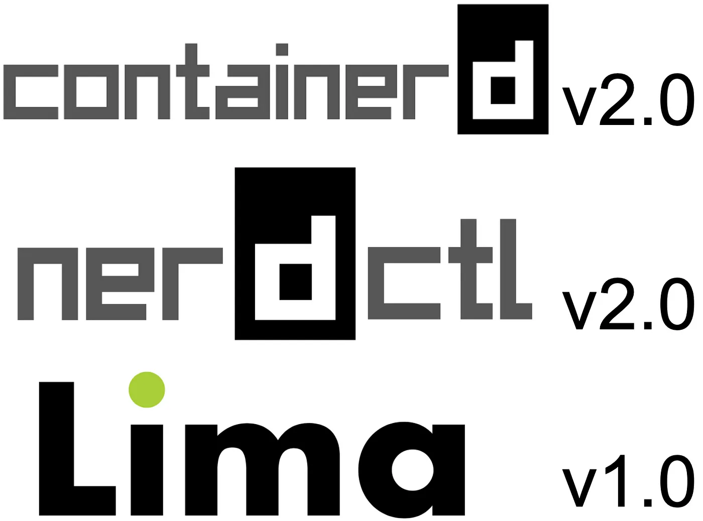
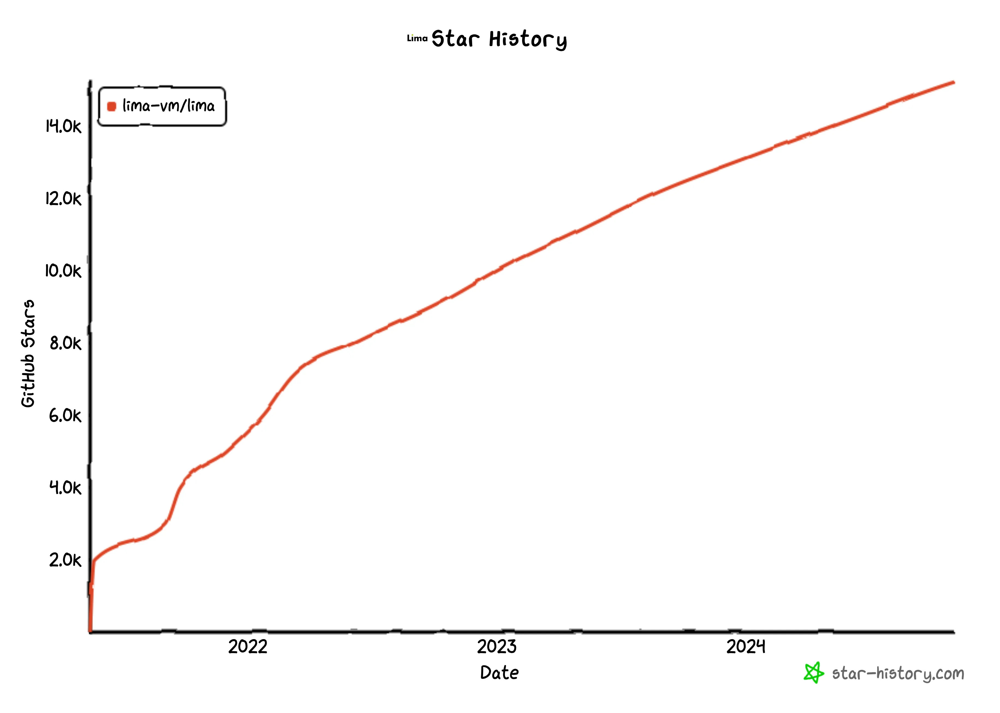

# 北美 KubeCon 前夕：containerd 相关项目集中发布全新大版本

> 改编自 [medium.com 一篇新闻稿：containerd v2.0, nerdctl v2.0, and Lima v1.0](https://medium.com/nttlabs/containerd-v2-0-nerdctl-v2-0-lima-v1-0-93026b5839f8)

[KubeCon 北美 2024](https://events.linuxfoundation.org/kubecon-cloudnativecon-north-america/)
将于 11 月 12 至 15 日盛大召开，预计参会人数将达到三四万人，仅门票收入就超过千万美元。

就在会前一周，[containerd](https://github.com/containerd/containerd) v2.0、
[nerdctl](https://github.com/containerd/nerdctl) (**contaiNERD CTL**) v2.0
和 [Lima](https://lima-vm.io/) v1.0 集中发布 🎉。



## containerd v2.0

[containerd](https://github.com/containerd/containerd) 是业界标准的容器运行时，
被 Docker 和多个基于 Kubernetes 的产品使用，如 Azure Kubernetes Service (AKS)、
Amazon Elastic Kubernetes Service (EKS) 和 Google Kubernetes Engine (GKE)。

containerd 最初由 Docker, Inc. 于
[2015 年](http://web.archive.org/web/20151217223538/https://containerd.tools/)开发，
当时 containerd 作为 Docker 的守护进程，旨在提供一个极简的方式来管理容器的生命周期。

[2017 年](https://www.cncf.io/announcements/2017/03/29/containerd-joins-cloud-native-computing-foundation/)
containerd 被捐献给了[云原生计算基金会 (CNCF)](https://cncf.io/)，
同一年发布的 [v1.0](https://github.com/containerd/containerd/releases/tag/v1.0.0)
开始支持非 Docker 的使用场景。后来对 Kubernetes 的支持在
[v1.1](https://github.com/containerd/containerd/releases/tag/v1.1.0)（2018 年）中实现。

最新 containerd v2.0 主要移除了过去九年中被弃用的一些旧特性。
这是一次重大变更，所以主版本号从 v1 升到了 v2。

本次新版本发布，DaoCloud 有两位 Maintainer 参与其中：
[Kay Yan](https://github.com/yankay) 和 [Iceber Gu](https://github.com/Iceber)。

### 移除特性

- [旧的 containerd-shim](https://github.com/containerd/containerd/pull/8262) 和
  [containerd-shim-runc-v1](https://github.com/containerd/containerd/pull/8262)
  被移除，取而代之的是 `containerd-shim-runc-v2`。
  旧的 shim 不支持 cgroup v2，对 Kubernetes Pod 的支持效率低下。
  从 containerd v1.4（2020 年）开始，这些旧的 shim 就已被弃用。
- [对 AUFS 的支持](https://github.com/containerd/containerd/pull/8263)被移除，
  取而代之的是已合并到 Linux 内核上游代码仓库的 OverlayFS。
  从 containerd v1.5（2021 年）开始，对 AUFS 的支持已被弃用。
- [对 Kubernetes CRI v1alpha2 API 的支持](https://github.com/containerd/containerd/pull/8276)被移除，
  取而代之的是 CRI v1。Kubernetes 已在 [v1.26](https://github.com/kubernetes/kubernetes/blob/v1.26.0/CHANGELOG/CHANGELOG-1.26.md?plain=1#L482)（2022 年）中停止对 CRI v1alpha2 的支持。
- [对“Docker Schema 1”镜像的支持现已被禁用](https://github.com/containerd/containerd/pull/9765)，
  此特性将在 containerd v2.1 中被移除。自 2017 年以来，Schema 1 已被大幅弃用，
  转而支持 2016 年在 Docker v1.10 中引入的 Schema 2，但一些镜像仓库直到 2020 年左右才支持 Schema 2。
  Docker 已在 [v20.10](https://github.com/moby/moby/pull/41295)（2020 年）中禁用推送 Schema 1 镜像，
  因此过去几年构建的几乎所有镜像都应已采用 Schema 2 格式或其后续版本
  [OCI Image Spec](https://github.com/opencontainers/image-spec) v1 的格式。

使用 containerd v1.6.27+ 或 v1.7.12+ 的用户可以通过运行以下命令来检查自己是否在使用这些已移除的特性：

```shell
ctr deprecations list
```

### 新增特性

- [Kubernetes 用户命名空间](https://kubernetes.io/docs/concepts/workloads/pods/user-namespaces/)，
  将 Pod 中的用户 ID 映射到主机上的不同用户 ID。特别是，此特性允许将 Pod 中的根用户映射到主机上的非特权用户。
- [Kubernetes 递归只读挂载](https://kubernetes.io/docs/concepts/storage/volumes/#read-only-mounts)，
  以防止意外地具有可写的子挂载。另请参阅
  [Kubernetes 1.30：只读卷挂载终于可以真正实现只读了](https://kubernetes.io/blog/2024/04/23/recursive-read-only-mounts/)。
- [镜像验证插件](https://github.com/containerd/containerd/blob/v2.0.0/docs/image-verification.md)，
  以强制执行加密签名、恶意软件扫描等。

### 其他显著变化

- [沙箱 CRI](https://github.com/containerd/containerd/issues/4131) 现在默认被启用，提高处理 Pod 的效率
- [NRI](https://github.com/containerd/nri)（节点资源接口）现在默认被启用，
  能够将特定供应商的逻辑插入运行时
- [CDI](https://github.com/cncf-tags/container-device-interface)（容器设备接口）现在默认被启用，增强了对
  [Kubernetes 设备插件](https://github.com/kubernetes/enhancements/tree/master/keps/sig-node/4009-add-cdi-devices-to-device-plugin-api)的支持。
- `/etc/containerd/config.toml` 现在期望使用 `version=3` 标头。
  之前的配置版本仍然受支持。
- Go 包 `github.com/containerd/containerd` 现在被重命名为 `github.com/containerd/containerd/v2/client`。

另请参阅：

- [containerd 2.0 官方文档](https://github.com/containerd/containerd/blob/v2.0.0/docs/containerd-2.0.md)
- [containerd 2.0.0 发布说明](https://github.com/containerd/containerd/releases/tag/v2.0.0)

## nerdctl v2.0

[nerdctl](https://github.com/containerd/nerdctl) (**contaiNERD CTL**)
是 containerd 所使用的类似 Docker 那样的命令行工具。

nerdctl 在 [2021 年](https://github.com/containerd/project/issues/69)成为
containerd 的一个子项目，并于 2022 年发布了 v1.0。

nerdctl v2.0 默认为无根模式启用 `detach-netns`：

- `nerdctl pull`、`nerdctl push` 和 `nerdctl build` 更快、更稳定
- 正确支持了 `nerdctl pull 127.0.0.1:.../...`
- 正确支持了 `nerdctl run --net=host` 。

`detach-netns` 模式可能听起来类似于利用 `SECCOMP_IOCTL_NOTIF_ADDFD`
加速无根容器中套接字系统调用的 `bypass4netns`。也就是说，`bypass4netns` 加速了容器，
`detach-netns` 与之不同的是通过将镜像留在主机网络命名空间中来加速负责拉取和推送镜像的运行时层。
容器在“分离”的网络命名空间中执行，这样容器可以获得用于容器间通信的 IP 地址。

nerdctl v2.0 的其他主要变化包括添加了 `nerdctl run --systemd` 用于在容器中运行 systemd。
此外，由于 GitHub 用户 `@apostasie` 的大量重构和测试，本次发布的稳定性得到了显著提高。

另请参阅 [nerdctl v2.0 发布说明](https://github.com/containerd/nerdctl/releases/tag/v2.0.0)。

## Lima v1.0

[Lima](https://lima-vm.io/) 是一个命令行工具，
通过运行一个具有自动文件系统共享和端口转发的 Linux 虚拟机，
可以在桌面操作系统（如 macOS）上运行
[containerd](https://github.com/containerd/containerd) 和
[nerdctl](https://github.com/containerd/nerdctl)。
Lima 的功能与 WSL2、Docker Machine 和 Vagrant 相当。

Lima 于 2022 年加入 CNCF，于 2024 年 9 月加入了 CNCF Sandbox。
Lima 已被多个知名第三方项目改编，如 [Colima](https://github.com/abiosoft/colima)、
[Rancher Desktop](https://rancherdesktop.io/) 和
[AWS 的 Finch](https://aws.amazon.com/blogs/opensource/introducing-finch-an-open-source-client-for-container-development/)。
[Lima 还被包括 NTT Communications 在内的多个组织使用](https://github.com/lima-vm/lima/discussions/2390#discussioncomment-9732082)。

以下 Lima 项目在 GitHub 上得到的 Star 数变化趋势图。



另请参阅 [Lima v1.0 发布说明](https://github.com/lima-vm/lima/releases/tag/v1.0.0)。
