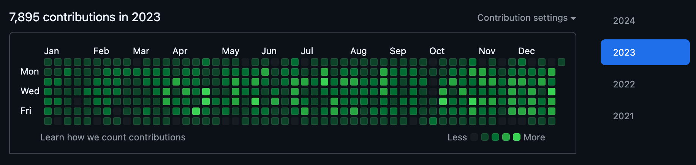
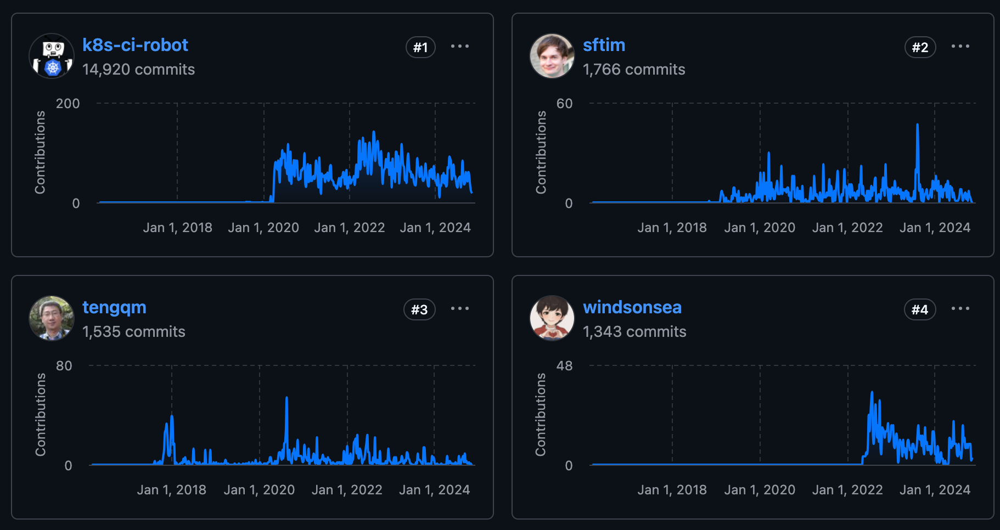
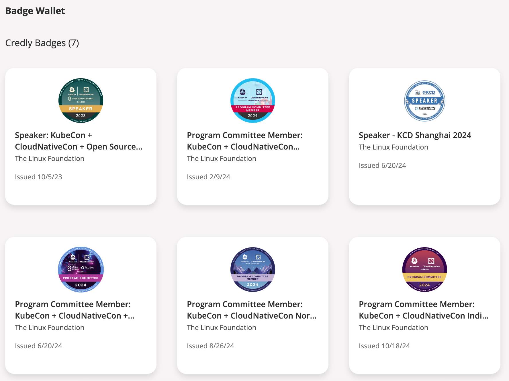

# 从社区小白到 CNCF 大使

本文不讲技术，只是浅述一段在 CNCF 开源社区成长的故事，这篇故事的主人公叫 Michael Yao。

## 2021 年：小白入行

2021 年 2 月，Michael 加入了一家在上海杨浦的云原生创业公司：DaoCloud。他最初的工作是在内网
Confluence Wiki 上给一个容器化 PaaS 平台编写和汇总中英文档资料，让代码更亲民，让文档更友好。
他日常参加晨会，总会听到各种容器技术和开源贡献的分享。好奇之余，他自己也思量能否参与其中，如何参与进去？

### 总有迷茫

他抽空注册了 GitHub 账号，看到首页写了 8000 万开发者参与其中，感觉有些震撼。但对新手而言，
这也就是一个网站，一个花里胡哨的蓝色界面，怎么去探索这个网页背后的神秘和浩瀚？他其实比较茫然，无从下手。

周末闲暇时光，他加了一些类似 HelloGitHub 的公众号去阅读文章，去 B 站和抖音上有意识地刷一些如何做贡献的视频，
但并没有去提交任何贡献。这就像最近[日本 Kubernetes 上游培训团队的组织者 Keita 在一次访谈](https://kubernetes.io/zh-cn/blog/2024/10/28/k8s-upstream-training-japan-spotlight/)中提到的，
“为社区做贡献，最难的是迈出第一步”。人们从知道开源，接触开源，到贡献开源，平均需要 6 个月到两年时间。

### 浅尝

2021 年底 DaoCloud 研发部门的开源战队开源了一个叫 [KLTS](https://klts.io/) 的项目。
部门领导要求 Michael 协助云原生开发者 [wzshiming](https://github.com/wzshiming)
编写和完善这个项目托管在 GitHub 上的用户文档。KLTS 全称为 Kubernetes Long Term Support，
主要使命是为 Kubernetes 早期版本提供长期免费的维护支持。这个项目相对冷门，
但对许多在生产环境中仍在运行 Kubernetes 早期版本的企业而言，宛如一缕春风，带来了久违的福音。

在 wzshiming 的帮助下，Michael 本地安装了 [Git](https://git-scm.com/)，学会使用了
[VSCode](https://code.visualstudio.com/)，能够通过终端命令行磕磕碰碰地推送并将修改提交到 KLTS 仓库。
开始时，他经常会因为网络问题或敲错命令而提交失败，还时不时与线上文档出现冲突需要各种 Rebase，他没办法就会一次次地抱着笔记本电脑去请教。

### 变化

好在 Michael 是一个工科生，学会 Git 命令后，黑色的终端窗口让他沉迷。只需一行行简单的命令流动，
就能提交修改的内容并将其近乎实时显示在网站上，让所有人看到自己的努力，让世界感受到这里有所变动。
Google 搜索引擎有一个规则：**有效内容更新频繁的网站会显示在前列，因为它是活着的** 。

这跟以前单机的 Office 系列、企业内网的 Wiki 页面截然不同，是一个从封闭到开放，从个人到群体，从小范围合作到全球协作的转变。
而这也是开源社区繁荣的原因之一，大家提交的每个 PR 都是为了向前走一步，每个改动都能让所有人看到，你的每次成功合并都有人为你喝彩。
如果发现 PR 修改有问题，任何人都可以留下 Comment，直到所有 Comment 被 Resolved 之后，PR 才会被合并进去。

## 2022 年：开始上路

这一年 DaoCloud 研发部门招兵买马开始研发第五代容器化平台，也就是后来的云原生操作系统 DCE 5.0。
Michael 负责文档资料，也开始调研用什么来建设文档站，他先后调研了 [GitBook](https://www.gitbook.com/),
[Docusaurus](https://docusaurus.io/), [Hugo](https://www.gohugo.org/), [MkDocs](https://www.mkdocs.org/)。
最初以 GitBook 在内网搭建了各个 Scrum 团队的文档站，但没有 IT 支持，只能实现一些简单的样式。
另外 GitBook 商业化之后，社区版的更新基本处于停滞状态。各个 Scrum 团队的文档处于离散和割据状态，层次不齐，风格迥异。

### 走进 GitHub

2022 年初，[samzong](https://github.com/samzong) 加入 DaoCloud，他非常擅长在 GitHub 发现、探索和使用各种工具。
他像一个机器猫一样总能从 Git 上掏出好东西，又像一个领航人总能找到一条合适的路往前冲，同事们戏称他为船长。在船长的帮助下，
Michael 成功以 MkDocs 汇总了 10 多个 Scrum 团队的文档，从内网将数据迁移到了 GitHub，将所有 Markdown 源文件对全球开源，
形成了对外的 [docs.daocloud.io](https://docs.daocloud.io/)。日常提交、评审、合并 PR 成为 Michael 的日常工作。

2022 年中的一天，Michael 克隆了 k/website 的源数据，发现有些文档写得有问题，读上去生硬不通顺。
他尝试做了一些文字修改，提交了一个[很小的 PR](https://github.com/kubernetes/website/pull/33568)。
这是他事实上对外提交的第一个社区 PR，很快收到了 Reviewer 的反馈。

### 学会包容

他从这个 PR 学到的第一件事是包容。原句是不太通顺，但你不能不礼貌，不能以批评的语气去 Judge 别人的成果。
因为社区是来自全球贡献者的协作，难免会有各种不同的想法，你自己习惯的说法，在别人那里可能并不习惯。
就比如中文，除了国内，还有港澳台、新加坡，华人遍布世界各地，贡献者有时差，日常面对的也是不同的文化和氛围，
每个人都要学会包容和理解，学会友好讨论，学会耐心和共情，这些是社区所推崇的品质，也是
[CNCF CoC 社区行为准则](https://kubernetes.io/zh-cn/community/code-of-conduct/#cncf-community-code-of-conduct-v13)中每一条文字的体现。

Michael 曾遇到过这样一个案例，有关 Namespace 中文译法的争论。IT 行业最常见的叫法是“命名空间”，
但还可以有其他叫法，比如名字空间、名称空间、命名域。后面这几种叫法并不是错误的，只是不常见。
很多新来的贡献者会指出 k8s.io 上这个词为什么不统一，为什么各种叫法都有呢？
而在 k/website 混迹几年以上的老鸟当然知道这个问题，但为什么他们不提了呢？
社区曾经就这个问题投过一次票，后来 [Jimmy Song](https://jimmysong.io/)、Tengqm 等资深大佬倾向于名字空间，
而新人们赞成命名空间。在讨论的过程中，老生们都在克制讲解为什么，而新人们都在坚持挑战，甚至有人在嘲讽和谩骂，
以至于后来引来了 CoC 委员会的工作人员执行了锁帖操作。这件事没有赢家，而讨论也不了了之了。

### 一点建议

Michael 建议新手们，刚开始做贡献可以处理一些
[good first issue](https://github.com/kubernetes/website/issues?q=is%3Aopen+is%3Aissue+label%3A"good+first+issue")，
大批量的修改等你熟悉社区之后再去进行。社区的参与者都有自己的工作，大多数只是抽空参与，PR 越大越难被合并，
有些复杂的 PR 可能会拖几年。尽量让 PR 的修改具体到某一方面，让 Reviewer 一眼就能理解，
这样很容易就能收到 `/lgtm` 和 `/approve` 标记，将 PR 合并进去，留下你成功走过的一个个足迹。

## 2023 年：奔跑吧，兄弟

这一年，Michael 参与了多个开源项目的建设工作，从对外网站的静态编译技术分为三类：

- 通过 Hugo 编译的网站：

    - [k8s.io](http://k8s.io)：全球 AI 负载容器化编排的事实标准技术，CNCF 毕业项目，国内代码贡献 DaoCloud 排名第一，Michael 是维护者之一
    - [istio.io](http://istio.io)：全球最流行的现代化服务网格技术，CNCF 毕业项目，国内代码贡献 DaoCloud 排名前三，Michael 是维护者之一
    - [opentelemetry.io](https://opentelemetry.io/)：全球最流行的可观测项目，CNCF 毕业项目，DaoCloud 有三名维护者参与其中，Michael 是维护者之一
    - [klts.io](http://klts.io)：经 DaoCloud 开源的早期项目，向公众提供免费长期的 Kubernetes 旧版本支持，修复各种 CVE，Michael 是维护者之一
    - [clusterpedia.io](http://clusterpedia.io)：经 DaoCloud 开源并捐献给 CNCF 后成功加入 Sandbox，Michael 是维护者之一
    - [merbridge.io](http://merbridge.io)：经 DaoCloud 开源并捐献给 CNCF 后成功加入 Sandbox，Michael 是维护者之一
    - [KWOK](https://kwok.sigs.k8s.io/)：经 DaoCloud 开源并捐献给 Kubernetes 社区成为一个 SIG 项目，
    被 Apple、IBM、OpenAI 等广泛使用的测试模拟工具，Michael 是一名 Reviewer

- 通过 MkDocs 编译的网站：

    - [docs.daocloud.io](http://docs.daocloud.io)：经 DaoCloud 开源的第五代云原生操作系统的全球文档站，Michael 是 Owner
    - [docs.d.run](https://docs.d.run/)：经 DaoCloud 开源的算力操作系统的全球文档站，Michael 是 Owner
    - [kubean.io](https://kubean-io.github.io/kubean/en/)：经 DaoCloud 开源并捐献给 CNCF 后成功加入 Sandbox，Michael 是维护者之一
    - [spiderpool.io](https://spidernet-io.github.io/spiderpool/)：经 DaoCloud 开源并捐献给 CNCF 后成功加入 Sandbox，Michael 是维护者之一

- 通过 Docusaurus 编译的网站：

    - [hwameistor.io](http://hwameistor.io)：经 DaoCloud 开源并捐献给 CNCF 后成功加入 Sandbox，Michael 是维护者之一
    - [karmada.io](http://karmada.io)：经华为开源，DaoCloud 代码贡献量排名第一，Michael 是维护者之一

## 2024 年：有所知

社区的繁荣离不开人们的贡献，活跃的贡献者是各个项目的生命之源。

Michael 在 2024 年多次参与了 Program Committee 评审 KubeCon 演讲议题：

- KubeCon Paris 2024
- KubeCon Salt Lake City 2024
- KubeCon New Delhi 2024
- KubeCon Hong Kong 2024

2024 年北美 KubeCon 于 11 月 12-15 日举行，主会场有 Keynotes 演讲，也许你能看到 Michael Yao 的名字出现在 Award 名单上。

## 结语

迄今为止，有太多伟大软件来自开源社区：Linux、Android、Git、Kubernetes、Istio、OpenTelemetry、Grafana、MySQL 等等。
这些是互联网、云计算、移动应用、AI 训练及推理的底层技术，是推动人类文明跃迁必不可少的催化剂。
你所认识的大多数开发者、程序员，可能在社区都有着另外一层身份。
江山代有才人出，开源项目想要发展壮大，就需要持续的新鲜血液，需要更多的贡献者加入。

新手去开源社区做贡献，最难的可能就是迈出第一步。安装好各种工具，搭建好环境，找到可以完善的点。
接下来就会顺理成章，多多与人交流，找到一个好的 Mentor，慢慢地就会形成一种习惯。

### 习惯

习惯去看 PR，习惯发现和提出 Issue，习惯去了解社区的方方面面。

- 从看懂 Slack 各种消息，到开始点赞和留言
- 从默默无闻，多听多看，到开始尝试发出只言片语
- 从悄悄参加线上会议，努力听懂老外们的各式口语，到参加线下活动互加好友
- 从只有微信，到有了 Slack、Twitter、Linkedin、WhatsApp
- 从第一次参加 KubeCon，到参与会议前后的各项工作
- 从国内到国外，从本土到国际化

### 包容

开源社区的包容性很强，任何人都可以找到自己的位置，都可以去交流学习。如果成功合并 PR 留下记录，你会为自己的每一次成长而骄傲。

- 产品：加入 release 团队，根据 KEP 开发计划，推进各 SIG 团队的开发进展
- 开发：修 bug，提 KEP 提交代码
- 测试：提交和完善 e2e 测试脚本
- 前端：UI/UX 技术
- 设计：制作 logo，各种 png、svg、mermaid
- 文档：英文撰写，多语言翻译
- 管理：编写行为准则，监督社区行为，组织线上会议

### 耐心

在社区做贡献，大部分都是偶尔为之。你提了 PR 或 Issue 之后，通常需要一段时间后，才会有所响应。
所以你需要耐心等待，大部分人只关心自己感兴趣的内容。如果真的太长时间无人响应，你可以翻阅 PR 或 Issue 记录，
@ 对应的人员，同时也要反省自己是不是提的有问题？是不是还能修改完善一下？

### 氛围

对很多人来说，社区是职场的延伸。很多人来这里是为了学习和交流，目的大多是为了提高技术水准，拓宽视野和人脉，
也许还想证明一些什么，总归有所求。一个良好的氛围可以促进你贡献更多，甚至会沉迷进去。

那还等什么？去找到一个鼓励开源贡献的氛围，那可以是大学、研究机构，也可以是 DaoCloud 这样的创业公司，更可以是像
Google、Microsoft、Amazon、华为、阿里、腾讯、抖音等这样的巨无霸。你在 GitHub 会找到并认识他们，
跟他们一起讨论解决问题。社区突破了高墙、公司和国家的界限，让创意在网络空间内碰撞，激发出一个个灵感。

### 回报

努力总会有所回报。假如有一天去搜索自己的名字，发现很多篇文章跟自己有关，每一篇的阅读量都在几万，心中热血会促使你更有动力继续前行。

## 参考链接

- [CNCF Ambassador 列表](https://www.cncf.io/people/ambassadors/)
- [2024 11 月 12-15 日：北美 KubeCon 议程](https://kccncna2024.sched.com/)
