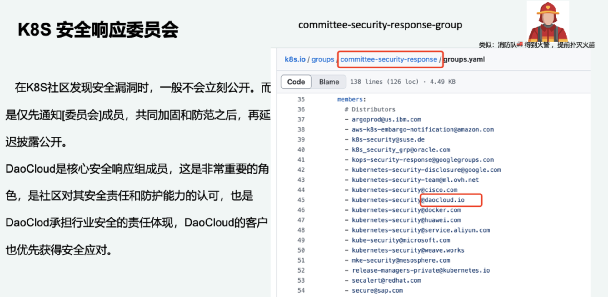
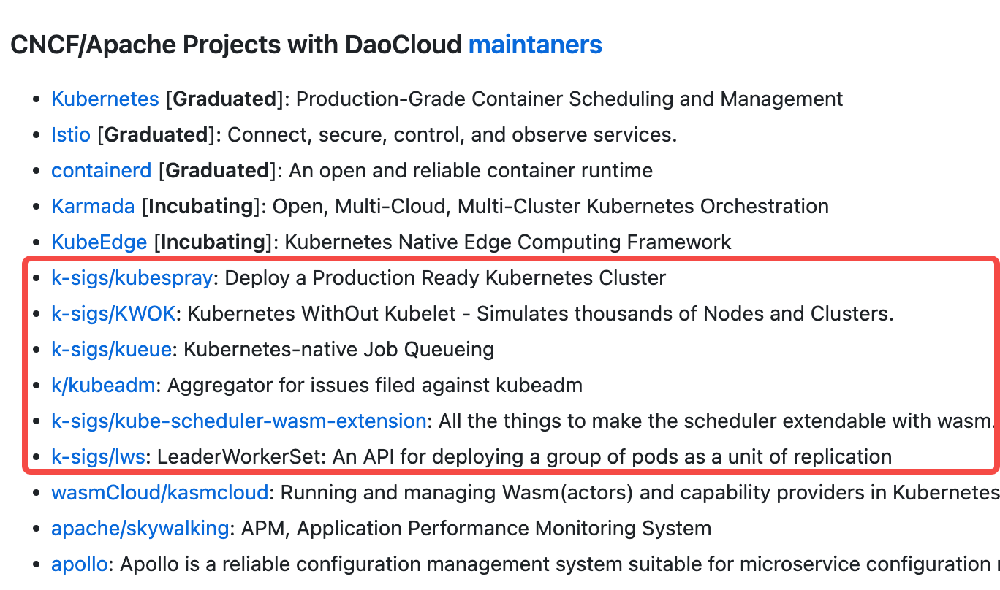
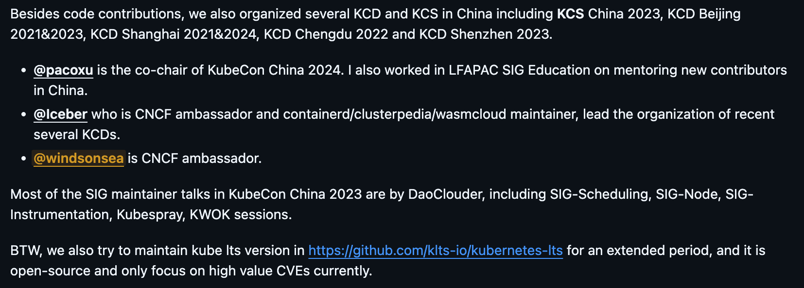

# 重磅！DaoCloud 成功加入 K8s 安全响应委员会

2024 年 12 月 19 日，在 Paco 和开源团队的不懈努力下，Daocloud 作为社区认可的 Kubernetes 发行商成功加入
[Kubernetes 安全响应委员会](https://github.com/kubernetes/k8s.io/blob/main/groups/committee-security-response/groups.yaml)（committee-security-response）。

安全响应委员会是 Kubernetes 生态系统的重要组成部分，主要用于提供有关安全漏洞的预先公告信息。
尽管 Daocloud 从各方面条件上早已符合标准，但由于“各种流程原因”
[拖延了一年多](https://github.com/kubernetes/committee-security-response/issues/180)。
功夫不负有心人，最终 DaoCloud 成功加入。除最初的一些美国发行商之外，DaoCloud 是继华为、阿里之外第三家加入该委员会的中国公司。
自此 Daocloud 能够率先收到 Kubernetes 社区内部的私密安全漏洞报告，并积极参与修复，这对维护 IT 基础设施安全具有非常重要的意义。



如果 K8s 社区发现一个 CVE 安全漏洞，通常不会立即公开，而是会先通知委员会成员，共同加固并防范之后，才会延迟披露公开。
如今 DaoCloud 是 K8s 社区核心的安全响应委员会成员，是社区对 DaoCloud 安全责任和防护能力的认可，
也是 DaoCloud 主动承担行业安全责任的体现。在此之后，DaoCloud 的优质客户也会优先获得各项安全应对措施，
紧跟社区步伐，不断完善容器化 AI 基础设施的更新换代。

## 安全响应委员会

目前该委员会的完整清单如下：

```yaml
members:
  - argoprod@us.ibm.com
  - aws-k8s-embargo-notification@amazon.com
  - k8s-security@suse.de
  - k8s_security_grp@oracle.com
  - kops-security-response@googlegroups.com
  - kubernetes-security-disclosure@google.com
  - kubernetes-security-team@ml.ovh.net
  - kubernetes-security@cisco.com
  - kubernetes-security@daocloud.io # 中国
  - kubernetes-security@docker.com
  - kubernetes-security@huawei.com # 中国
  - kubernetes-security@service.aliyun.com # 中国
  - kube-security@microsoft.com
  - kubernetes-security@weave.works
  - mke-security@mesosphere.com
  - release-managers-private@kubernetes.io
  - secalert@redhat.com
  - secure@sap.com
  - security@digitalocean.com
  - security@giantswarm.io
  - security@gravitational.com
  - security@kinvolk.io
  - security@loodse.com
  - security@platform9.com
  - security@rancher.com
  - security@ubuntu.com
  - security@vmware.com
  - tkg-cve-disclosure@groups.vmware.com
  - vulnerabilityreports@cloudfoundry.org
```

要符合委员会的申请资质，您所在公司作为发行商应满足以下要求：

1. 拥有一个积极监控 Kubernetes 安全特性的邮件清单
1. 积极维护 Kubernetes 代码仓库且是
   [经 CNCF 认证的 Kuberenetes Certified Service Provider (KCSP)][https://www.cncf.io/training/certification/software-conformance/]
1. 拥有不限于当前企业所在的用户基础
1. 拥有一个公开可验证的、截至目前为止曾经修复安全漏洞的多项提交记录
1. 不是上述清单中某个发行商的下属企业或子公司
1. 是社区的参与者和积极贡献者
1. 遵从委员会制定的[禁运政策（Embargo Policy）](https://github.com/kubernetes/committee-security-response/blob/main/private-distributors-list.md#embargo-policy)
1. 主动评审/测试修复补丁，指出潜在的问题，及时通知委员会相关事宜
1. 在上述清单中有一家或多家发行商为您所在的企业做担保

## 贡献和付出

Daocloud 能成功加入 Kubernetes 安全响应委员会，离不开大家在 Kubernetes 社区做出的各种贡献。
除了主库 kubernetes/kubernetes 和官网 kubernetes/website 之外，DaoCloud 还积极参与维护了多个子项目：

- [k-sigs/kueue](https://github.com/kubernetes-sigs/kueue)：Kubernetes 原生的任务队列组件
- [k-sigs/lws](https://github.com/kubernetes-sigs/lws)：LeaderWorkerSet 是一种 API，可以将一组 Pod 作为副本单元进行部署
- [k-sigs/kubespray](https://github.com/kubernetes-sigs/kubespray)：如果想要在生产环境中部署 Kubernetes 集群，请使用这个安装器
- [k-sigs/KWOK](https://github.com/kubernetes-sigs/kwok)：
  零成本模拟成千上万的节点和集群，已被 OpenAI、Nvidia、Apple 等广泛运用于测试领域，这是 DaoCloud 在 2022 年开源并捐献给社区的项目
- [k-sigs/kube-scheduler-wasm-extension](https://github.com/kubernetes-sigs/kube-scheduler-wasm-extension)：
  使调度器可以通过 WASM 进行扩展
- [k/kubeadm](https://github.com/kubernetes/kubeadm/)：有关 kubeadm 问题的聚合仓库

DaoCloud 在社区贡献代码并作为维护者负责管理的仓库：



在维护代码和网站之外，DaoCloud 还积极参与 KubeCon、KCD 和 LFAPAC 等各种线下开源演讲活动，
致力于云原生技术传播和 AI 基础设施优化。

- Paco 是 Kubernetes Steering Committee 委员会的成员，KubeCon China 2024 联合主席
- Iceber 是 CNCF 大使、Linux 基金会官方开源布道者、KCD 活动的组织者
- windsonsea 是 CNCF 大使，近两年多届 KubeCon Program Committee 演讲议题审稿人


