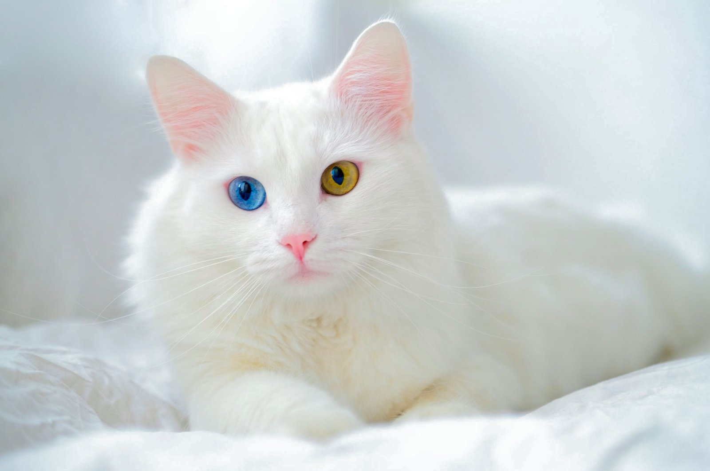

# 喵典

> 作者 [Michael Yao](https://github.com/windsonsea) 版权所有 @2024

这是一个有关猫咪创意平台产品的推广页面。

口号 SLOGAN： **爱喵，就要懂喵**

## 产品

- 喵语大模型：采集猫叫声音数据，识别转化为文本，发给主人，让猫主懂猫
- 喵脸和体态大模型：像识别人脸一样识别猫咪的头脸和体态，找回失去的记忆，寻找适合人类美感的猫脸和体态，实现定向推送
- 喵语翻译器：将识别出的文本输出到各类机器上，让主人能明白猫咪
- 喵语对话机器人：把人类的声音转换为猫叫声，与猫咪对话，让人猫互相理解，彼此交流
- 喵喵周边服装、玩具、新品、二手等等

## 喵文化

- 猫咪饲养健康标准、社区行为规范
- 猫咪选美
- 喵明星
- 名喵堂
- 猫咪社区，选出喵帮主，喵主席，喵星人齐聚一堂，多多举办各类活动
- 通过猫咪交友，建设实体猫咪街道文化
- 编写猫咪文学、剧本、电视、电影、游戏
- 实体店：喵喵剧情杀、猫咪周边

## 设施

- 宠喵医院
- 猫咪保健
- 猫咪交友店、猫咪剧本杀店、猫咪主题乐园
- 猫咪服装店
- 猫咪玩具店
- 猫粮、猫零食、保健品店
- 猫咪饲养、领养、寄养、流转驿站
- 猫咪飞升（火化、土葬、纪念类）

## 岗位

**开发**

- 大模型开发工程师
- App 开发和维护工程师
- 硬件设备工程师
- 产品经理

**营销和推广**

- 猫咪主播 5 - 10 名
- 专业摄影师
- 视频剪辑师
- 资深市场营销：流量推广，MCN 拓展

**实体店**

- 宠物医生：正规兽医院校毕业，有相关资质
- 宠物保健师，宠物保姆
- 店铺和品牌加盟：绕过各级经销商，对接猫粮、零食和玩具等厂家

**其他**

- 采购
- 财务
- 行政人事

[查看 PPT](https://www.aippt.cn/share/1wVxvkpry830Bq0oOYAfAg){ .md-button .md-button--primary }

