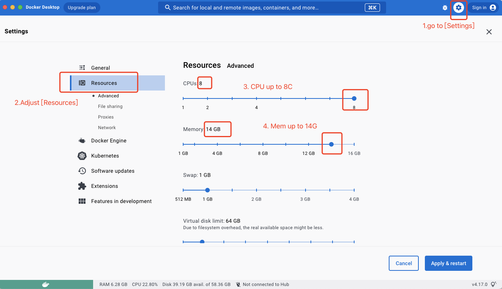
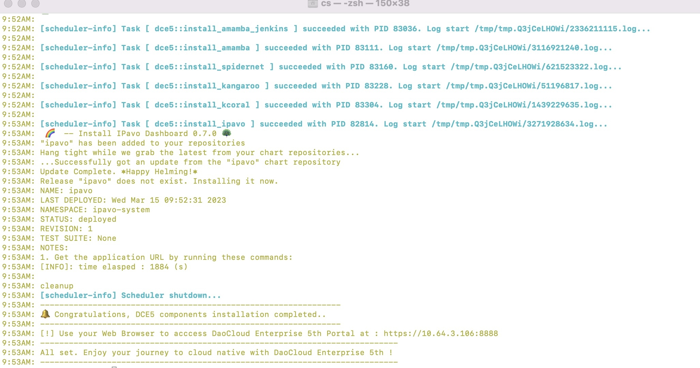

# 通过 Docker 和 kind 在 macOS 电脑上安装社区版

本页说明如何使用 macOS 笔记本电脑创建单节点的 kind 集群，然后在线安装 DCE 5.0 社区版。

!!! tip

    这是针对初学者的简化安装体验步骤，实际生产很少会使用 macOS，
    原文作者是 [panpan0000](https://github.com/panpan0000)。

## 硬件环境

确认 MacBook 的性能和资源是否满足需求。最低配置为：

- CPU：**8 核**
- 内存：**16G**
- 磁盘剩余空间：大于 20G

## 安装和调整 Docker

根据 MacBook 的芯片（Intel 或 M1），安装 [Docker Desktop](https://docs.docker.com/desktop/install/mac-install/)。

调整容器资源上限：

1. 启动 Docker。
1. 点击右上角的 ⚙️，以打开 `Settings` 页面。
1. 点击左侧的 `Resources`，将启动容器的资源上限调节到 8C14G，点击 `Apply & Restart` 按钮。



## 安装 kind

按照实际电脑情况，以下任选其一，安装 kind。
如果遇到其他问题，请参阅 [kind 官方安装说明](https://kind.sigs.k8s.io/docs/user/quick-start/#installation)。

=== "Mac 是 Intel 芯片"

    ```shell
    [ $(uname -m) = x86_64 ]&& curl -Lo ./kind https://kind.sigs.k8s.io/dl/v0.17.0/kind-darwin-amd64
    ```

=== "Mac 是 M1/ARM 芯片"

    ```shell
    [ $(uname -m) = arm64 ] && curl -Lo ./kind https://kind.sigs.k8s.io/dl/v0.17.0/kind-darwin-arm64
    chmod +x ./kind
    sudo mv kind /usr/local/bin/kind
    ```

=== "Mac 已安装 Homebrew"

    有了 Homebrew 后，就很简单了：

    ```shell
    brew install kind
    ```

最后执行以下命令，确认 kind 安装成功：

```shell
kind version
```

## 创建 kind 配置文件

暴露集群内的 32088 端口到 kind 对外的 8888 端口（可自行修改）：

```shell
cat > kind_cluster.yaml << EOF
apiVersion: kind.x-k8s.io/v1alpha4
kind: Cluster
nodes:
- role: control-plane
  extraPortMappings:
  - containerPort: 32088
    hostPort: 8888
EOF
```

## kind 创建 K8s 集群

以 K8s 1.25.3 版本为例，执行以下命令创建一个 K8s 集群：

```shell
kind create cluster --image docker.m.daocloud.io/kindest/node:v1.25.3 --name=fire-kind-cluster --config=kind_cluster.yaml
```

确认 kind 集群创建是否成功：

```shell
docker exec -it fire-kind-cluster-control-plane  kubectl get no
```

期望输出：

```console
NAME                              STATUS   ROLES           AGE   VERSION
fire-kind-cluster-control-plane   Ready    control-plane   18h   v1.25.3
```

## 安装 DCE 5.0 社区版

1. 安装依赖项

    ```shell
    cat <<EOF | docker exec -i fire-kind-cluster-control-plane  bash
    curl -LO https://proxy-qiniu-download-public.daocloud.io/DaoCloud_Enterprise/dce5/install_prerequisite.sh
    bash install_prerequisite.sh online community
    apt-get update && apt-get install -y wget
    EOF
    ```

1. 下载 dce5-installer 二进制文件

    ```shell
    docker exec -it fire-kind-cluster-control-plane /bin/bash
    ```

    假定 `VERSION=v0.5.0`

    ```shell
    export VERSION=v0.5.0; 
    curl -Lo ./dce5-installer  https://proxy-qiniu-download-public.daocloud.io/DaoCloud_Enterprise/dce5/dce5-installer-$VERSION
    chmod +x ./dce5-installer
    exit
    ```

1. 安装 DCE5 社区版

    1. 先获取本机 IP

        ```shell
        myIP=$(ip r get 1.1.1.1| awk '{print $NF}')
        ```

        如果报错 `zsh: command not found: ip`，有 2 个方案：

        - 执行 `myIP=$(ifconfig en0| grep "inet[ ]" | awk '{print $2}')`
        - 或通过 `brew install iproute2mac` 这类命令安装 iproute2mac 后重试。

    1. 开始安装，大概用时 30 分钟，取决于镜像拉取的网速

        ```shell
        docker exec -it fire-kind-cluster-control-plane bash -c "./dce5-installer install-app -z -k $myIP:8888"
        ```

1. 在安装过程中可以另起一个终端窗口，执行如下命令，观察 Pod 启动情况。

    ```shell
    docker exec -it fire-kind-cluster-control-plane kubectl get po -A -w
    ```

    当看到以下提示，则表示 DCE 5.0 社区版安装成功了。

    

1. 输入默认用户和密码 (admin/changeme) 登录后，系统将提示[申请许可密钥](../dce/license0.md)。

## 体验使用

申请到许可证后，将进入 DCE 5.0 主界面，显示当前安装的组件、集群/节点/资源、告警等信息。

您可以尝试：

- 创建一个[用户](../ghippo/user-guide/access-control/user.md)，
  加入一个[用户组](../ghippo/user-guide/access-control/group.md)，
  赋予[角色权限](../ghippo/user-guide/access-control/role.md)
- [定制软件界面](../ghippo/user-guide/platform-setting/appearance.md)
- [接入一个集群](../kpanda/user-guide/clusters/integrate-cluster.md)
- [管理你的节点](../kpanda/user-guide/nodes/node-check.md)
- [创建一个负载](../kpanda/user-guide/workloads/create-deployment.md)
- 更多请查阅文档站页面

## 卸载

1. 卸载 [DCE 5.0 社区版](../install/uninstall.md)。
1. 删除 kind 集群。

    ```
    kind delete cluster  --name=fire-kind-cluster
    ```

1. 卸载 kind 本身。

    ```
    rm -f $(which kind)
    ```

1. 在应用列表中卸载 Docker。

至此您的 MacBook 恢复到了最初状态。
