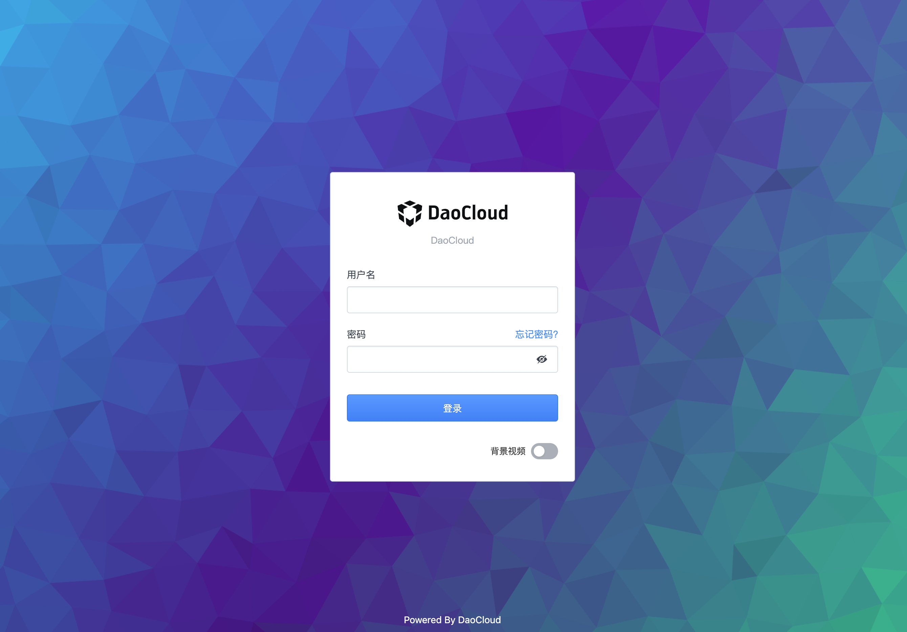

# 保姆式安装 DCE 5.0 社区版

作者：[Peter Pan](https://github.com/panpan0000)
作者：[SAMZONG](https://github.com/SAMZONG)


本文完成了从 0 到 1 的 DCE 5.0 社区版安装，包含了 K8s 集群、依赖项、网络、存储等细节及更多注意事项。

> 现阶段版本迭代较快，本文的安装方式可能与最新版有所差异，请以产品文档的[安装说明](../install/intro.md)为准。

## 集群规划

使用 3 台 UCloud 的 VM，配置均为 8 核 16G。

| 角色   | 主机名         | 操作系统   | IP            | 配置           |
| ------ | -------------- | ---------- | ------------- | -------------- |
| control-plane | k8s-master01 | CentOS 8.3 | 10.23.*  | 8 核 16G 系统盘200GB |
| worker-node   | k8s-work01   | CentOS 8.3 | 10.23.* | 8 核 16G 系统盘200GB |
| worker-node  | k8s-work02    | CentOS 8.3 | 10.23.* | 8 核 16G 系统盘200GB |

本示例采用的组件为：

- Kubernetes:1.25.8
- CRI:containerd （因为新版本K8s已经不再直接支持docker）
- CNI:Calico
- StorageClass:local-path
- DCE5.0社区版: v0.5.0


## 准备节点（所有操作都需要操作）

### 节点配置

安装前先分别对 3 个节点做了一些必要的设置

1. 配置主机名

    ```bash
    修改主机名（可选）。避免主机名重名即可
    hostnamectl set-hostname k8s-master01
    hostnamectl set-hostname k8s-work01 
    hostnamectl set-hostname k8s-work02
    修改之建议后exit退出SSH 会话，重新登录以显示新的主机名。
    ```


1. 禁用 Swap

    ```bash
    swapoff -a
    sed -i '/ swap / s/^/#/' /etc/fstab
    ```

1. 关闭防火墙（可选）

    ```bash
    systemctl stop firewalld
    systemctl disable firewalld
    ```

1. 设置内核参数和允许 iptables 进行桥接流量

    加载 `br_netfilter` 模块：

    ```bash linenums="1"
    cat <<EOF | tee /etc/modules-load.d/kubernetes.conf
    br_netfilter
    EOF

    # 加载模块
    sudo modprobe overlay
    sudo modprobe br_netfilter
    ```

    修改内核参数 如`ip_forward` 和`bridge-nf-call-iptables`：

    ```bash linenums="3"
    cat <<EOF | sudo tee /etc/sysctl.d/k8s.conf
    net.bridge.bridge-nf-call-iptables  = 1
    net.bridge.bridge-nf-call-ip6tables = 1
    net.ipv4.ip_forward                 = 1
    EOF

    # 刷新配置
    sysctl --system
    ```
    
### 安装容器运行时（containerd）


1. 如果是Centos 8.x，要先卸载系统预装的podman，否则会版本冲突（[注意]🔥）
    ```
    yum erase podman buildah -y
    ```
  
1. 安装依赖

    ```bash
    sudo yum install -y yum-utils device-mapper-persistent-data lvm2
    ```
  
1. 安装containerd，可以用二进制也可以用yum包（yum是docker社区维护的，如下使用yum包）
    ```bash
    sudo yum-config-manager --add-repo http://mirrors.aliyun.com/docker-ce/linux/centos/docker-ce.repo
    sudo yum makecache
    yum install containerd.io -y
    ctr -v           
    #显示安装的版本，例如ctr containerd.io 1.6.20
    ```
  
1. 修改containerd的配置文件
    ```
    #删除自带的config.toml， 避免后续kubeadm出现错误CRI v1 runtime API is not implemented for endpoint
    mv /etc/containerd/config.toml /etc/containerd/config.toml.old
    # 重新初始化配置
    sudo containerd config default | sudo tee /etc/containerd/config.toml
    # 更新配置文件内容: 使用systemd作为Cgroup驱动，并且替代pause镜像地址
    sed -i 's/SystemdCgroup\ =\ false/SystemdCgroup\ =\ true/' /etc/containerd/config.toml
    sed -i 's/k8s.gcr.io\/pause/k8s-gcr.m.daocloud.io\/pause/g' /etc/containerd/config.toml #老的pause地址
    sed -i 's/registry.k8s.io\/pause/k8s-gcr.m.daocloud.io\/pause/g' /etc/containerd/config.toml
    sudo systemctl daemon-reload
    sudo systemctl restart containerd
    sudo systemctl enable containerd
    ```


1. 安装CNI

    ```bash
    curl -JLO https://github.com/containernetworking/plugins/releases/download/v1.2.0/cni-plugins-linux-amd64-v1.2.0.tgz
    mkdir -p /opt/cni/bin &&  tar Cxzvf /opt/cni/bin cni-plugins-linux-amd64-v1.2.0.tgz
    ```
  
1. 安装nerdctl(可选)
   ```bash
   curl -LO https://github.com/containerd/nerdctl/releases/download/v1.2.1/nerdctl-1.2.1-linux-amd64.tar.gz
   tar xzvf nerdctl-1.2.1-linux-amd64.tar.gz
   mv nerdctl /usr/local/bin
   nerdctl -n k8s.io ps #查看容器
   ```


## 安装 k8s 集群

### 安装k8s二进制组件（三个节点都需要操作）

1. 安装 Kubernetes 软件源 (这里采用国内阿里云的源加速)

    ```bash
    cat <<EOF | sudo tee /etc/yum.repos.d/kubernetes.repo
    [kubernetes]
    name=Kubernetes
    baseurl=https://mirrors.aliyun.com/kubernetes/yum/repos/kubernetes-el7-x86_64/
    enabled=1
    gpgcheck=1
    repo_gpgcheck=1
    gpgkey=https://mirrors.aliyun.com/kubernetes/yum/doc/yum-key.gpg https://mirrors.aliyun.com/kubernetes/yum/doc/rpm-package-key.gpg
    EOF
    ```
1. 将 SELinux 设置为 permissive 模式（相当于将其禁用）
    ```
    sudo setenforce 0
    sudo sed -i 's/^SELINUX=enforcing$/SELINUX=permissive/' /etc/selinux/config
    ```
  
1. 安装 Kubernetes 组件, 版本以1.25.8为例（DCE 0.5.0对1.26暂时不支持）
    ```
    export K8sVersion=1.25.8
    sudo yum install -y kubelet-$K8sVersion
    sudo yum install -y kubeadm-$K8sVersion
    sudo yum install -y kubectl-$K8sVersion
    sudo systemctl enable --now kubelet
    ```

### kubeadm安装第一个master节点

1. 预先下载镜像以加速安装,使用daocloud的加速仓库

    ```
    kubeadm config images pull --image-repository k8s-gcr.m.daocloud.io
    ```
    
1. 调用kubeadm，初始化第一个节点 （使用daocloud加速仓库）

   【注意】：如下pod CIDR不能与宿主机物理网络的网段重合(该CIDR未来还需要跟calico的配置一致)
    ```
    sudo kubeadm init --kubernetes-version=v1.25.8 --image-repository=k8s-gcr.m.daocloud.io --pod-network-cidr=192.168.0.0/16
    ```
    经过十几分钟，你能看到打印成功的信息如下（请记住最后打印出的`kubeadm join`命令，后续会用到 🔥）
    ```
    Your Kubernetes control-plane has initialized successfully!
    To start using your cluster, you need to run the following as a regular user:
    
    mkdir -p $HOME/.kube
    sudo cp -i /etc/kubernetes/admin.conf $HOME/.kube/config
    sudo chown $(id -u):$(id -g) $HOME/.kube/config

    Alternatively, if you are the root user, you can run:
    export KUBECONFIG=/etc/kubernetes/admin.conf
    You should now deploy a pod network to the cluster.
    Run "kubectl apply -f [podnetwork].yaml" with one of the options listed at:
    https://kubernetes.io/docs/concepts/cluster-administration/addons/

    Then you can join any number of worker nodes by running the following on each as root:

    kubeadm join 10.23.207.16:6443 --token p4vw62.shjjzm1ce3fza6q7 \
    --discovery-token-ca-cert-hash sha256:cb1946b96502cbd2826c52959d0400b6e214e06cc8462cdd13c1cb1dc6aa8155
    ```


1. 配置kubeconfig文件

    ```bash
    mkdir -p $HOME/.kube
    sudo cp -i /etc/kubernetes/admin.conf $HOME/.kube/config
    sudo chown $(id -u):$(id -g) $HOME/.kube/config
    kubectl get no
    #你能看到第一个节点,但是仍然NotReady
    ```
    
1. 安装CNI，以calico为例子

    先安装 calico-operator
    ```bash
    kubectl create -f https://raw.githubusercontent.com/projectcalico/calico/v3.25.1/manifests/tigera-operator.yaml
    ```
    
    再下发 经过配置过的 CR
    ```
    #下载配置文件模板
    curl -LO https://raw.githubusercontent.com/projectcalico/calico/v3.25.1/manifests/custom-resources.yaml
    grep cidr custom-resources.yaml
    #确认calico配置文件里的CIDR和kubeadm init时的CIDR是一致的！！！否则请修改!!!
    vim custom-resources.yaml
    kubectl apply -f custom-resources.yaml
    ```
    
    等待部署成功
    ```
    kubectl get po -n calico-system -w #等待pod都Running
    kubectl get no #可以看到第一个节点变为 ready 状态了
    #
    
    
### 添加(join)其他 worker工作节点
 

    最后在其他worker节点执行join命令。命令在上述master节点进行`kubeadm init`时最后会在屏幕打出。形如下方（注意三个参数都是跟环境相关的。请勿直接拷贝）
    ```
    kubeadm join $第一台master的IP:6443 --token p...7 --discovery-token-ca-cert-hash s....x
    ```
 
    成功join之后，信息形如：
    ```
    This node has joined the cluster:
    * Certificate signing request was sent to apiserver and a response was received.
    * The Kubelet was informed of the new secure connection details.

    Run 'kubectl get nodes' on the control-plane to see this node join the cluster.
    ```

   在master 节点确认节点都被加入，并且等待其都变为 Ready 状态
   ```
   kubectl get no -w
   ```
   
   
### 安装默认存储 CSI（使用本地存储）

    ```
    #参考： https://github.com/rancher/local-path-provisioner
    wget https://raw.githubusercontent.com/rancher/local-path-provisioner/v0.0.24/deploy/local-path-storage.yaml
    sed -i "s/image: rancher/image: docker.m.daocloud.io\/rancher/g" local-path-storage.yaml # replace docker.io to mirror
    sed -i "s/image: busybox/image: docker.m.daocloud.io\/busybox/g" local-path-storage.yaml
    kubectl apply -f local-path-storage.yaml
    kubectl get po -n local-path-storage -w #等待 pod 都 running
    #把local-path设置为默认SC
    kubectl patch storageclass local-path -p '{"metadata": {"annotations":{"storageclass.kubernetes.io/is-default-class":"true"}}}'
    kubectl get sc #可以看到形如: local-path (default)
    ```
    
    
 
## 安装 DCE 5.0 社区版

现在一切准备就绪，开始安装 DCE 5.0 社区版。

### 安装基础依赖

```bash linenums="1"
curl -LO https://proxy-qiniu-download-public.daocloud.io/DaoCloud_Enterprise/dce5/install_prerequisite.sh
bash install_prerequisite.sh online community 
```

### 下载 dce5-installer
```bash
export VERSION=v0.5.0
curl -Lo ./dce5-installer https://proxy-qiniu-download-public.daocloud.io/DaoCloud_Enterprise/dce5/dce5-installer-$VERSION
chmod +x ./dce5-installer 
```


### 确认节点的外部可达 IP 地址

1.如果你的浏览器跟 master 节点的 IP 是可以直通的，无需额外操作。

1. 如果 master 节点的 IP 是内网（比如本示例的公有云机器）：

    - 请在公有云中为其创建外网可达的 IP
    - 请在公有云配置中，在该主机的的防火墙规则中，允许32088 端口的进出。 
    - 如上的32088 端口是`kubectl -n istio-system get svc istio-ingressgateway`的NodePort端口
    


### 执行安装

1. 如果你的浏览器跟 master 节点的 IP 是可以直通的，直接执行
```
./dce5-installer install-app -z -k
```

1. 如果 master 节点的 IP 是内网（比如本示例的公有云机器），请确认上述外部 IP 和防火墙配置完毕，然后执行如下

```
./dce5-installer install-app -z -k $外部IP:32088
```
注意：上述的 32088 是`kubectl -n istio-system get svc istio-ingressgateway`的NodePort端口


1. 登录 DCE

    

1. DCE 登录成功，用户名admin 密码changeme

    


- [下载 DCE 5.0](../download/dce5.md){ .md-button .md-button--primary }
- [安装 DCE 5.0](../install/intro.md){ .md-button .md-button--primary }
- [申请社区免费体验](../dce/license0.md){ .md-button .md-button--primary }
