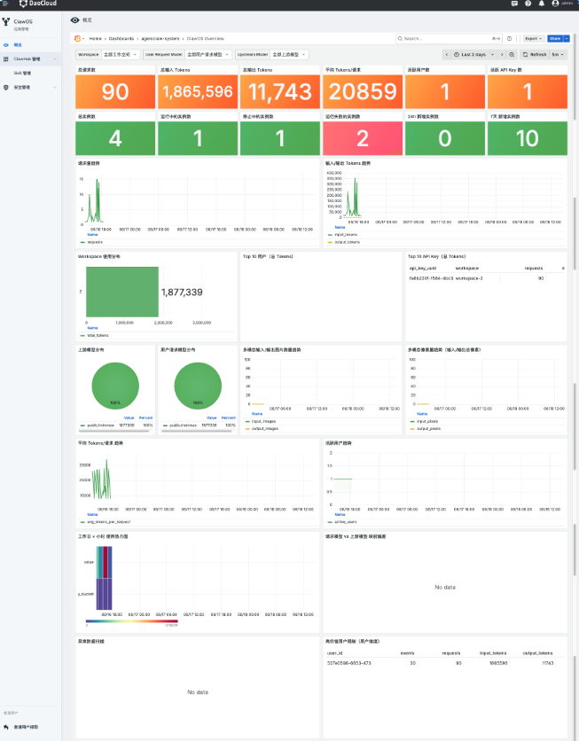

# 概览（管理员视角）

平台管理员概览用于从 **全局维度** 监控 ClawOS 平台的整体调用情况、资源消耗、实例运行状态和用户/API Key 使用分布，帮助管理员快速判断平台是否处于健康、稳定、可控的运行状态。

与工作空间视角下的[概览](../workspace/overview.md)不同，本页面面向 **平台管理员** ，展示跨工作空间的汇总数据，用于平台级运营与治理。

## 模块作用

「概览」是 ClawOS 管理员视角下的运营看板，不是单个实例或单个工作空间的配置页。

主要用于：

- 查看平台整体调用量与 Token 消耗
- 监控实例运行规模与健康状态
- 分析资源消耗在工作空间、用户、模型之间的分布
- 定位高消耗用户、API Key 和重点调用来源
- 识别流量高峰、异常突增和成本风险
- 辅助配额管理、成本核算、容量规划和问题排查

## 筛选与时间范围

管理员可以按以下维度筛选，并查看指定时间范围内的平台运行数据：

- **工作空间**
- **用户请求模型**：用户或实例在请求时选择的模型
- **上游模型**：平台实际转发调用的底层模型

页面中部分卡片支持按时间范围筛选，例如近 7 天、近 30 天或当月。切换时间范围后，相关指标和趋势图会同步更新。

## 核心指标

页面顶部集中展示以下关键指标：

| 类别 | 指标 |
| --- | --- |
| **调用与 Token** | 平台总请求数、输入 Token、输出 Token、平均每次请求 Token 数 |
| **用户与凭证** | 活跃用户数、活跃 API Key 数 |
| **实例状态** | 实例总数、运行中实例数、停止中实例数、运行失败实例数 |

通过这些指标，管理员可以快速判断平台当前负载、资源消耗规模和实例整体健康情况。

## 趋势图说明

趋势图用于观察核心指标随时间的变化，便于识别流量高峰、异常突增或资源消耗波动。

常见趋势包括：

- **平台请求量趋势**
- **Token 消耗趋势**
- **平均 Token / 请求趋势**
- **活跃用户趋势**

如果某段时间请求量或 Token 消耗突然升高，可能需要进一步查看分布分析和排名明细，排查是否存在异常调用或成本风险。

## 分布分析

分布分析区域展示不同维度的资源使用占比，帮助管理员了解资源消耗结构。

### 工作空间分布

展示各工作空间的总 Token 消耗占比，用于分析哪些工作空间占用了主要平台资源。

### 上游模型分布

展示平台实际调用的底层模型使用占比，用于了解当前平台主要的模型消耗结构。

### 用户请求模型分布

展示用户或实例在请求时选择的模型使用占比，用于了解业务侧的主要模型偏好。

## 排名与明细

排名与明细区域提供 Top 排行和高价值用户明细，帮助管理员定位主要调用来源。

| 区域 | 说明 |
| --- | --- |
| **Top 用户** | 按请求数或 Token 消耗排序，定位最活跃或高消耗用户 |
| **Top API Key** | 定位高消耗或高频使用的 API Key |
| **高价值用户明细** | 展示重点用户的请求数、输入 Token、输出 Token 等明细 |

结合这些数据，管理员可以进一步追踪资源使用主体，为配额管理、成本核算、异常排查和用户运营提供依据。

## 高级分析

除常规调用与 Token 指标外，平台管理员还可以查看以下高级分析信息：

- **多模态统计**：输入 / 输出图片数量、像素量趋势
- **使用热力图**：工作日小时使用热力图，观察调用高峰时段
- **模型映射偏差**：请求模型与上游模型映射偏差，发现模型路由异常
- **异常数据扫描**：识别非预期调用行为或潜在数据问题

## 核心价值

平台管理员概览重点帮助回答以下问题：

- 平台整体用量是多少？
- 资源消耗主要集中在哪些工作空间、用户或模型？
- 哪些用户或 API Key 是主要调用来源？
- 实例运行是否健康？
- 是否存在异常请求、成本突增或模型使用偏差？

如需查看单个工作空间内的运行情况，请参见[工作空间概览](../workspace/overview.md)。
