# 飞书集成

本文档介绍如何将 OpenClaw 与飞书进行集成，实现通过飞书与 OpenClaw 对话。

## 创建飞书应用

### 创建企业自建应用

1. 登录[飞书开放平台](https://open.feishu.cn/app)。

2. 点击 **创建企业自建应用** 按钮。

    

### 配置应用信息

配置应用名称、描述及图标，点击 **创建** 按钮完成创建。

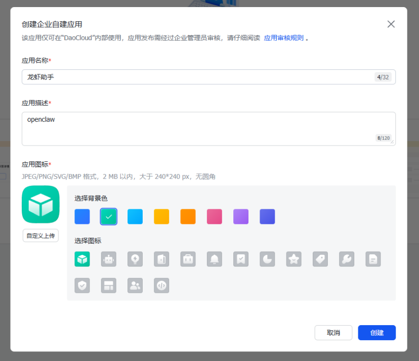

### 添加机器人能力

1. 在左侧目录树选择 **应用能力** -> **添加应用能力** 。
2. 选择 **按能力添加** 页签。
3. 点击 **机器人** 能力卡片的 **添加** 按钮。

    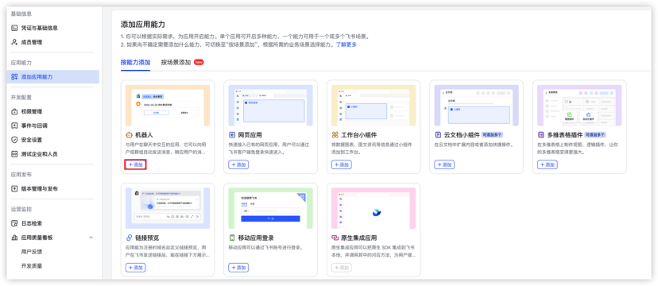

## 配置权限

### 导入权限配置

1. 在左侧目录树选择 **开发配置** -> **权限管理** 。

2. 点击 **批量导入/导出权限** 按钮。

    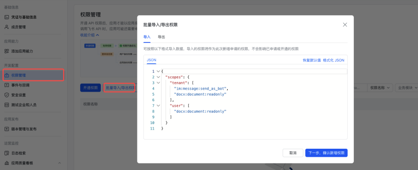

3. 在 **导入** 页签中，粘贴[权限配置代码](#permission-config)。

4. 点击 **下一步，确认新增权限** 按钮。

5. 在弹窗中确认权限无误后，点击 **申请开通** 按钮。

    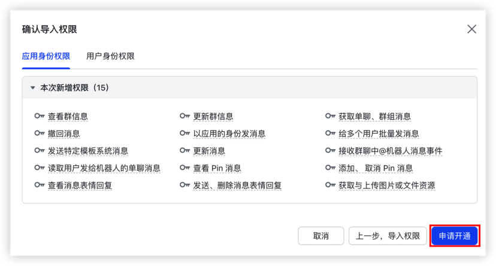

### 权限配置代码

<details id="permission-config">
<summary>点击查看权限配置代码</summary>

```json
{
  "scopes": {
    "tenant": [
      "contact:contact.base:readonly",
      "docx:document:readonly",
      "im:chat:read",
      "im:chat:update",
      "im:message.group_at_msg:readonly",
      "im:message.p2p_msg:readonly",
      "im:message.pins:read",
      "im:message.pins:write_only",
      "im:message.reactions:read",
      "im:message.reactions:write_only",
      "im:message:readonly",
      "im:message:recall",
      "im:message:send_as_bot",
      "im:message:send_multi_users",
      "im:message:send_sys_msg",
      "im:message:update",
      "im:resource",
      "application:application:self_manage",
      "cardkit:card:write",
      "cardkit:card:read"
    ],
    "user": [
      "contact:user.employee_id:readonly",
      "offline_access",
      "base:app:copy",
      "base:field:create",
      "base:field:delete",
      "base:field:read",
      "base:field:update",
      "base:record:create",
      "base:record:delete",
      "base:record:retrieve",
      "base:record:update",
      "base:table:create",
      "base:table:delete",
      "base:table:read",
      "base:table:update",
      "base:view:read",
      "base:view:write_only",
      "base:app:create",
      "base:app:update",
      "base:app:read",
      "sheets:spreadsheet.meta:read",
      "sheets:spreadsheet:read",
      "sheets:spreadsheet:create",
      "sheets:spreadsheet:write_only",
      "docs:document:export",
      "docs:document.media:upload",
      "board:whiteboard:node:create",
      "board:whiteboard:node:read",
      "calendar:calendar:read",
      "calendar:calendar.event:create",
      "calendar:calendar.event:delete",
      "calendar:calendar.event:read",
      "calendar:calendar.event:reply",
      "calendar:calendar.event:update",
      "calendar:calendar.free_busy:read",
      "contact:contact.base:readonly",
      "contact:user.base:readonly",
      "contact:user:search",
      "docs:document.comment:create",
      "docs:document.comment:read",
      "docs:document.comment:update",
      "docs:document.media:download",
      "docs:document:copy",
      "docx:document:create",
      "docx:document:readonly",
      "docx:document:write_only",
      "drive:drive.metadata:readonly",
      "drive:file:download",
      "drive:file:upload",
      "im:chat.members:read",
      "im:chat:read",
      "im:message",
      "im:message.group_msg:get_as_user",
      "im:message.p2p_msg:get_as_user",
      "im:message:readonly",
      "search:docs:read",
      "search:message",
      "space:document:delete",
      "space:document:move",
      "space:document:retrieve",
      "task:comment:read",
      "task:comment:write",
      "task:task:read",
      "task:task:write",
      "task:task:writeonly",
      "task:tasklist:read",
      "task:tasklist:write",
      "wiki:node:copy",
      "wiki:node:create",
      "wiki:node:move",
      "wiki:node:read",
      "wiki:node:retrieve",
      "wiki:space:read",
      "wiki:space:retrieve",
      "wiki:space:write_only"
    ]
  }
}
```

</details>

> 相关权限的具体含义可查看 [飞书 API 权限列表](https://open.larkoffice.com/document/server-docs/application-scope/scope-list)。

## 发布应用

### 创建版本并发布

1. 点击顶部的 **创建版本** 按钮。

    

2. 按需配置应用版本号、默认能力及更新说明等信息。

    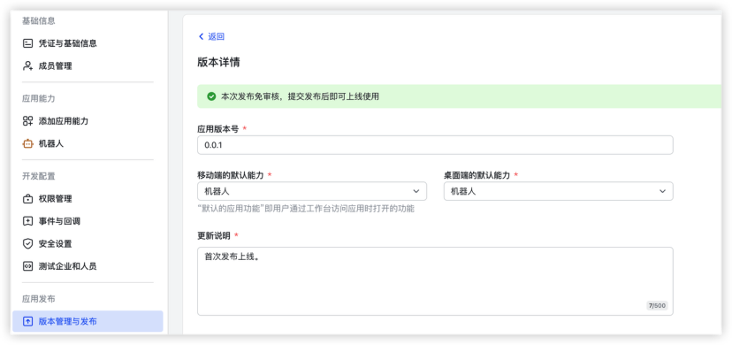

3. 点击页面底部的 **保存** 按钮创建版本。

    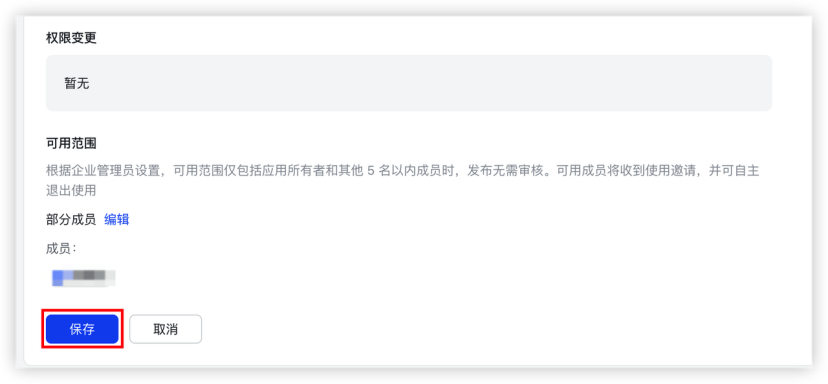

4. 点击页面右上角的 **确认发布** 按钮完成应用发布。

    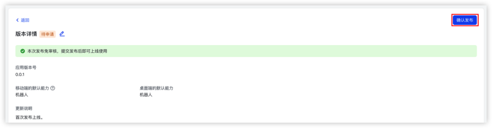

### 获取配置信息

1. 在左侧目录树选择 **基础信息** -> **凭证与基础信息** 。

2. 在 **应用凭证** 模块中，获取并记录 **App ID** 与 **App Secret** 信息。

     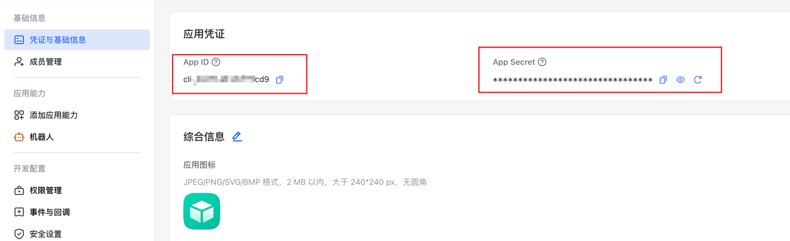

## 配置事件订阅与回调长连接

!!! caution

    对于未配置长连接的机器人应用，需要在获取 **App ID** 与 **App Secret** 后，启动 OpenClaw 实例，
    才能保存事件与回调长连接配置。请参考 [OpenClaw 快速入门](./quickstart.md)文档启动 OpenClaw 实例。

### 配置事件订阅

1. 点击左侧事件与回调，配置 **事件订阅** 方式为 **长连接** 。

    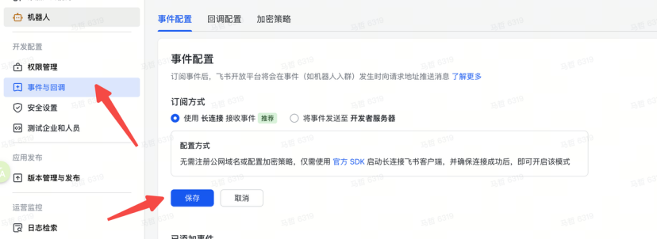

2. 添加接收消息事件(可自定义其他事件)：

    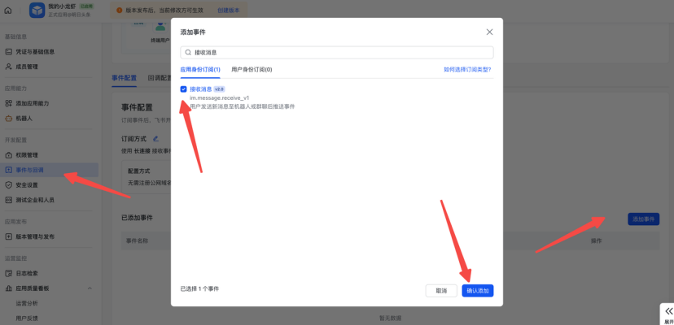

### 配置回调

1. 点击 **回调配置**。

2. 配置方式选择 **长连接**。

    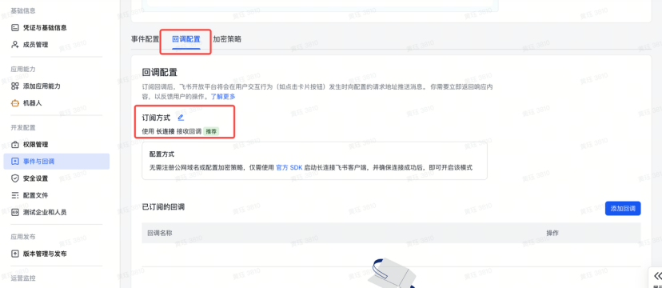

3. 添加回调。

    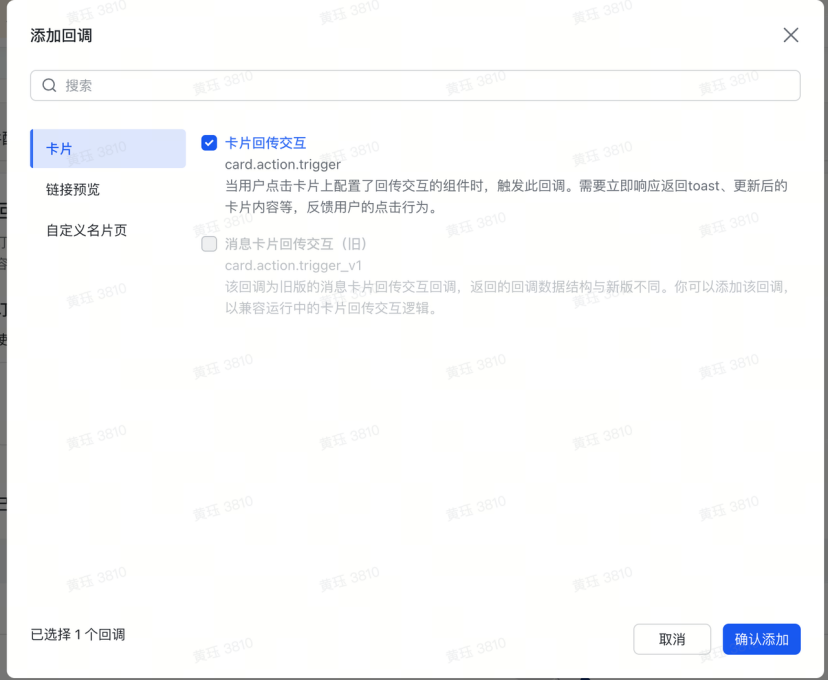

### 发布版本

发布版本并等待审核通过。

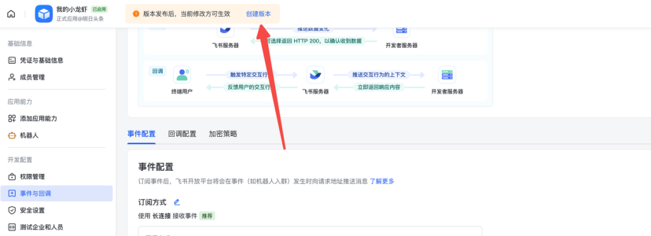

## 开始对话

在飞书中找到您的机器人，开始愉快地对话吧！

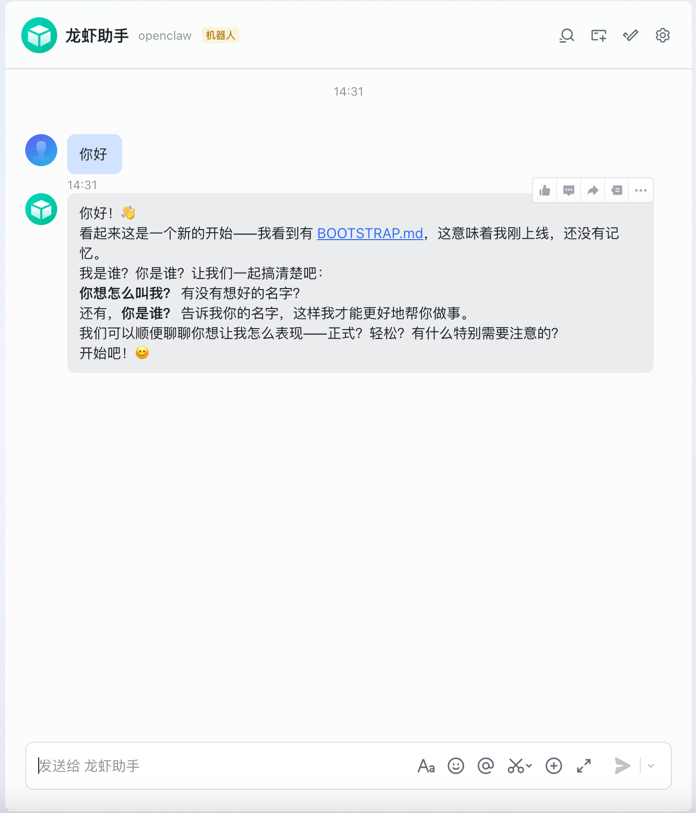
