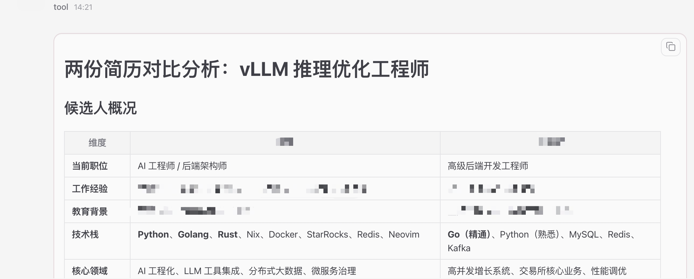
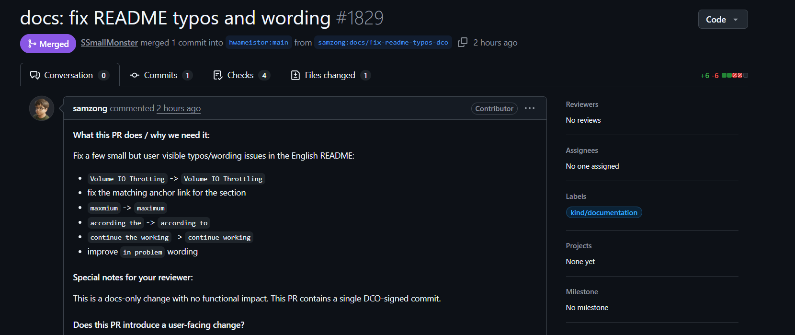

# ClawOS：OpenClaw 企业级管控与运行平台

## 什么是 OpenClaw

**OpenClaw**（小龙虾）是新一代开源 AI 智能体运行时，代表了 AI 能力的跨越式升级——不再只是被动回答问题，而是能主动规划任务、调用工具、自主执行，像一名真正的数字员工一样完成端到端的复杂工作。

| 能力维度 | 传统 AI 助手 | OpenClaw 智能体 |
|---|---|---|
| 交互方式 | 被动问答，单轮响应 | 主动规划，多轮自主执行 |
| 能力边界 | 仅输出文字 | 调用工具、操作系统、执行代码 |
| 适用场景 | 信息查询、简单生成 | 端到端自动化工作流 |

**OpenClaw** 具备 5 层原生能力：

- **用户接入层：** 支持 Chat 对话、CLI 命令行、IDE 插件、飞书 / 微信 / 钉钉等 IM 工具及 Web API
- **Agent 核心引擎：** 任务规划、上下文管理、工作流引擎、子智能体调度、多 Agent 架构
- **工具执行层：** 文件系统、终端命令、浏览器控制、API 调用、自定义 Skill、第三方工具集成
- **记忆与知识层：** 短期会话记忆、长期向量存储、知识库检索、跨会话上下文持久化
- **大模型接入层：** 兼容 Claude、GPT、本地开源模型、企业私有模型及 OpenAI API 协议

## 在 DCE 上使用 OpenClaw

DCE 已上线 **ClawOS v0.1** ，提供面向企业级的 OpenClaw 托管运行平台。无需自行配置环境或手动接入模型，5 分钟内即可让你的 AI 数字员工上岗。

详细操作步骤请参见[快速入门](../quickstart.md)文档。

### 集成飞书

**ClawOS v0.1** 已原生支持飞书无缝集成，创建实例时开启 **集成飞书** 开关，填入飞书应用的 **App ID** 和 **App Secret** 即可。
配置完成后，小龙虾将直接在飞书中收发消息、处理文件、回复群聊，无需切换任何界面。

详细配置步骤请参见[飞书集成](../feishu.md)文档。

## 典型应用场景

### HR 批量简历筛选

面对数十份格式各异的 PDF 简历，让小龙虾自动读取、提取关键技术栈、按岗位要求评分排序，输出结构化评估报告。原来需要半天的筛选工作，几分钟完成。

!!! note

    简历属于敏感个人信息（PII）。DCE 私有化部署确保数据不出内网，禁止将简历传送至外部公有云 API。

### 代码研发助手

接入 GitHub 后，配置多 Agent 架构（主 Agent + Research + Reviewer + Codex），让小龙虾直接扒开源代码找
Bug、提 PR、执行 CI 规范，打造完全契合个人习惯的自动化开发编排器。

### 批量文档审查

将"读取文档 → 提取关键数据 → 规则校验 → 生成审批意见"的完整工作流，通过 `createSkill` 封装为自定义
Skill，下次一键批量处理几十份季报并输出汇总 CSV，彻底解放重复性工作。
    
## 产品优势

| 优势 | 说明 |
| --- | --- |
| 一键开通，开箱即用 | 管理员无需手动配置环境、模型接入或权限设置。系统自动创建沙箱、自动注入 Token，业务用户点击即用，全程不依赖 IT 介入。 |
| 安全沙箱隔离 | 每只小龙虾独立运行在容器安全沙箱中，基于 DaoCloud 自研的 **zestU** 内核级隔离技术。即使实例被劫持或发生故障，影响被严格限制在沙箱内，无法渗透内网或篡改宿主机文件。 |
| 数据持久化，记忆永不丢失 | `~/.openclaw` 目录全量持久化存储在 DCE 存储系统中。无论重启 OpenClaw、暂停还是释放实例，对话历史、配置与记忆均不会丢失。 |
| 模型调用安全可控 | 所有模型调用统一经过 DCE AI 网关与安全策略，不直接裸连公网。你的数据和对话全程使用 DCE 平台内的大模型服务，敏感信息受到保障。 |
| 后台完全可操作 | DCE 提供 [SSH 登录和 noVNC 网页访问](../quickstart.md#_4) 两种方式访问小龙虾后台，支持完整的 CLI 操作，满足进阶用户的调试与定制需求。 |

## 功能特性

| 功能 | 当前状态 |
|---|---|
| [一键创建 OpenClaw 实例](../quickstart.md#openclaw) | 已上线 |
| [飞书无缝集成](../feishu.md) | 已上线 |
| 安全容器沙箱隔离 | 已上线 |
| 数据持久化存储 | 已上线 |
| [SSH 或 noVNC 网页访问](../quickstart.md#__tabbed_1_1) | 已上线 |
| 文件管理与上传 | 已上线 |
| Token 用量分析与成本管控 | 即将上线 |
| 更多大模型支持 | 即将上线 |
| 统一实例管理（管理员视图） | 规划中 |
| 审计追踪与操作回放 | 规划中 |
