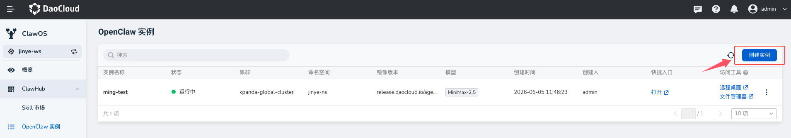
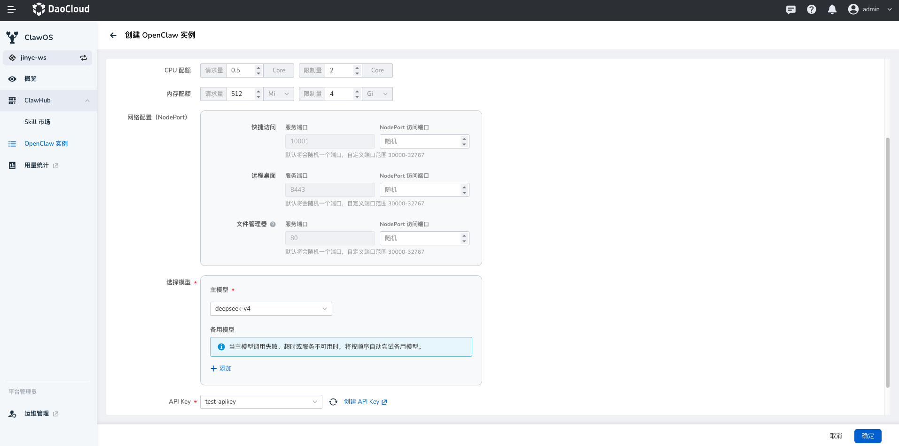

# OpenClaw 实例

OpenClaw 实例是 ClawOS 当前主要管理的 Agent 类型。每个实例可以理解为一个独立运行的 AI Agent，能够调用模型、使用工具、接入消息渠道，并在企业环境中完成任务。

ClawOS 通过 **OpenClaw 实例** 模块，帮助用户创建、访问、配置和运维这些 Agent。当前主要支持 OpenClaw 实例，后续可扩展支持更多类型的企业 Agent。

## 创建实例

在实例列表页右上角点击 **创建实例**，进入创建 OpenClaw 实例页面。

### 网络配置

网络配置用于生成实例的访问入口，包括快捷访问、远程桌面和文件管理器。

如果不确定端口如何配置，可以使用默认端口和随机 NodePort，平台会自动分配可用访问端口。

### 模型配置

选择实例使用的主模型。主模型是 OpenClaw 执行任务时默认调用的模型。模型可以是平台统一提供的公共模型，也可以是工作空间（租户）接入的私有模型。

如果配置了备用模型，当主模型调用失败、超时或不可用时，系统会按顺序自动尝试备用模型。备用模型主要用于提高实例稳定性，适合生产任务或对可用性要求较高的场景。

### API Key

选择实例调用模型时使用的 API Key。如果没有可用 API Key，可以点击 **创建 API Key** 跳转创建。

!!! note

    API Key 配置错误或失效时，实例可能无法正常调用模型。

### 配置消息渠道

OpenClaw 实例可以接入企业消息工具，让用户在飞书或 Microsoft Teams 中直接与 Agent 对话。在创建实例时，可以启用消息渠道，并选择对应渠道类型。

**飞书**

- 支持扫码完成快捷配置
- 也支持手动创建企业自建应用，详见 [飞书集成](./feishu.md)

**Microsoft Teams**

选择 Microsoft Teams 后，需要填写：

- Client ID
- Client Secret
- Tenant ID

实例创建完成后，系统会在实例详情页生成 **Messaging endpoint**。请将该地址复制到 Microsoft Azure Bot 的 **Configuration > Messaging endpoint** 中。配置完成后，Teams 中的消息即可发送到对应 OpenClaw 实例，由 Agent 进行处理和回复。

## 实例详情

点击实例名称可进入实例详情页，查看单个 OpenClaw 实例的运行情况，包括 **概览** 和 **调用记录**。

### 概览

概览主要包含：

- **基础信息**：实例名称、实例 ID、状态、模型、创建时间
- **消息渠道**：当前是否启用飞书或 Teams，以及对应的 Messaging endpoint
- **Token 消耗**：今日、本月和累计 Token 使用情况
- **使用表现**：调用次数、成功率、平均响应时间
- **行为分析**：Skill 调用分布、模型使用情况等

通过概览可判断实例是否正常运行、消息渠道是否配置成功，以及该实例的使用量和稳定性是否正常。

### 调用记录

调用记录用于了解实例在什么时间被调用、用户输入了什么内容、消耗了多少 Token、耗时多久，以及调用是否成功。

调用记录详情会展示一次对话或任务的完整执行链路，包括对话、响应、工具调用、模型输出等信息。右侧会展示对应节点的元数据，例如 conversation ID、span ID、开始时间、结束时间、Token 使用量等。

该页面主要用于排查以下问题：

- 用户说了什么
- Agent 如何理解和响应
- 是否调用了工具
- 哪个环节耗时较长
- 本次调用消耗了多少 Token
- 失败发生在哪一步

调用记录适合用于运维排查、成本分析和审计追踪。对于生产环境中的 OpenClaw 实例，建议在出现异常、响应变慢、Token 消耗升高或用户反馈结果不符合预期时，优先查看调用记录。

## 常用操作

在实例列表页，可对 OpenClaw 实例执行以下操作：

| 操作 | 说明 |
| --- | --- |
| **打开** | 进入 OpenClaw 实例的使用入口 |
| **远程桌面** | 进入实例桌面环境，适合排查运行环境或执行需要桌面的操作 |
| **文件管理器** | 查看和管理实例中的文件，例如上传资料、下载结果、检查任务产物 |
| **编辑** | 修改实例配置，例如模型、备用模型、API Key、消息渠道或资源规格。部分配置修改后可能会触发实例重启，重启期间实例会短暂不可用 |
| **重启** | 当实例异常、配置未生效或需要重新加载环境时使用 |
| **关机** | 关机后实例停止运行，无法继续访问，也不会继续占用运行资源 |
| **删除** | 移除对应的运行资源。删除前请确认实例中没有需要保留的文件、配置或任务结果 |
