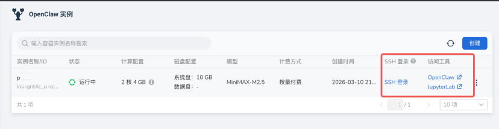

# 快速入门

本指南将帮助您快速创建和使用 OpenClaw 实例。

## 前提条件

- 拥有 DCE 平台账号
- 完成实名认证
- 账户有足够余额或代金券

## 创建 OpenClaw 实例

1. 选择 **ClawOS** 模块，点击右侧的 **创建** 按钮。
1. 为 OpenClaw 实例设置一个英文 **名称** ，点击右下角 **确定** 。
1. （可选）DCE OpenClaw 已无缝对接飞书。创建实例时，开启 **集成飞书** 开关并填入飞书配置信息。

    > 有关如何获取飞书配置信息以及对接飞书的详细步骤，请参考[飞书集成](./feishu.md)文档。

    

1. 耐心等待实例创建完成。

    

## 访问 OpenClaw

当实例状态显示为 **运行中** 后：

1. 点击右侧的 **访问工具** -> **OpenClaw**
2. 打开 OpenClaw 管理页面


!!! note

    由于网络原因，可能需要等待 1-2 分钟才能访问。

## 开始使用 OpenClaw

点击 **继续访问网站** ，在聊天窗口中开始对话。


## 后台调试 OpenClaw

DCE 提供了多种后台操作途径，您可以通过 SSH 登录或网页上的 JupyterLab 进行操作。



=== "方式一：SSH 登录"

    通过 SSH 直接进入 OpenClaw 的安全沙盒。

    

=== "方式二：网页访问"

    通过网页方式访问后台。

    

### 命令行操作

操作 OpenClaw CLI 前，请先切换到 node 用户：

```bash
su node  # 切换到 node 用户
```

查看安装的 skills：

```bash
openclaw skills list
```


## OpenClaw 常见问题

参阅[常见问题](./faq.md)文档。
