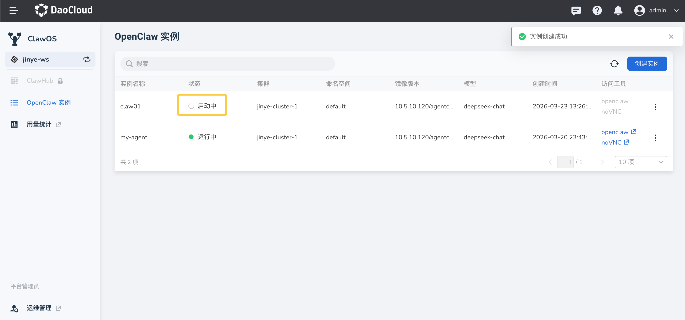
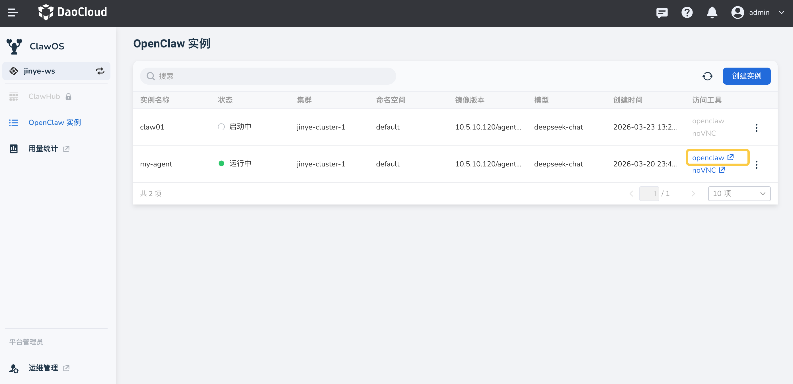
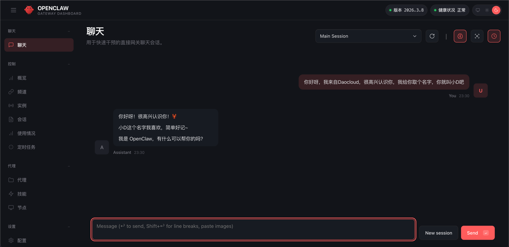
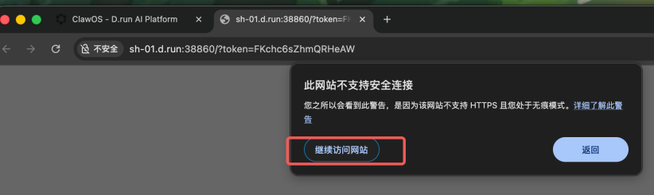
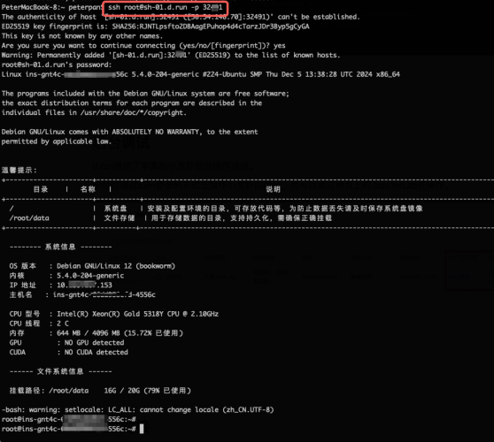
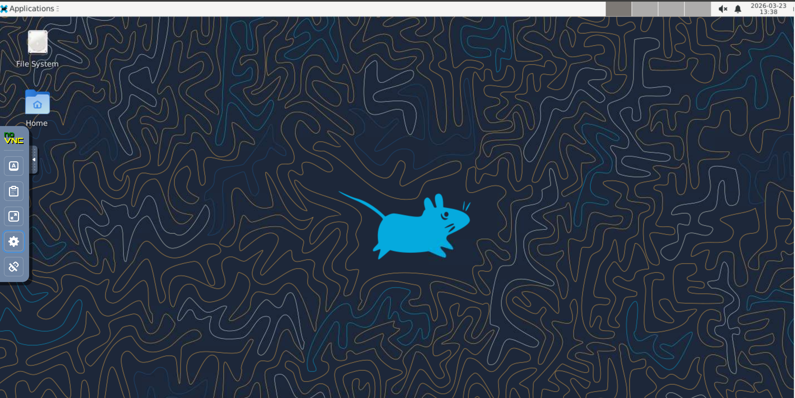
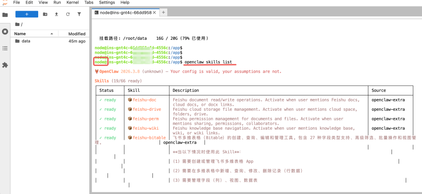

# 快速入门

本指南将帮助您快速创建和使用 OpenClaw 实例。

## 前提条件

- 拥有 DCE 平台账号
- 完成实名认证
- 账户有足够余额或代金券

## 创建 OpenClaw 实例

1. 从左侧导航栏，选择 **ClawOS** ，点击右侧的 **创建实例** 按钮
1. 配置 OpenClaw 实例

    - 设置一个英文名称，选择对应的集群、命名空间、镜像版本，配置 CPU/内存资源、网络、模型和 API Key
    - （可选）启用 **集成飞书** 并填入飞书的 App ID 和 App Secret

    点击右下角 **确定**

    

    > 有关如何获取飞书配置信息以及对接飞书的详细步骤，请参考[飞书集成](./feishu.md)文档。

1. 耐心等待实例创建完成。

    

## 访问 OpenClaw

某个实例的状态显示为 **运行中** 后：

1. 点击右侧的 **访问工具** -> **openclaw**

    

2. 打开 OpenClaw 管理页面

    

!!! note

    - 某些情况下，由于网络波动，在创建实例后，可能需要等待 1-2 分钟才能访问。
    - 如果出现以下提示，可以点击 **继续访问网站** ，就能在聊天窗口中使用小龙虾智能体。

    

## 后台调试 OpenClaw

DCE 提供了多种后台操作途径，您可以通过 SSH 登录或网页上的 noVNC 进行操作。

=== "方式一：SSH 登录"

    通过 SSH 直接进入 OpenClaw 的安全沙盒。

    

=== "方式二：Web VNC 客户端"

    通过网页方式访问后台。

    

### 命令行操作

操作 OpenClaw CLI 前，请先切换到 node 用户：

```bash
su node  # 切换到 node 用户
```

查看安装的 skills：

```bash
openclaw skills list
```



## OpenClaw 常见问题

参阅[常见问题](./faq.md)文档。
