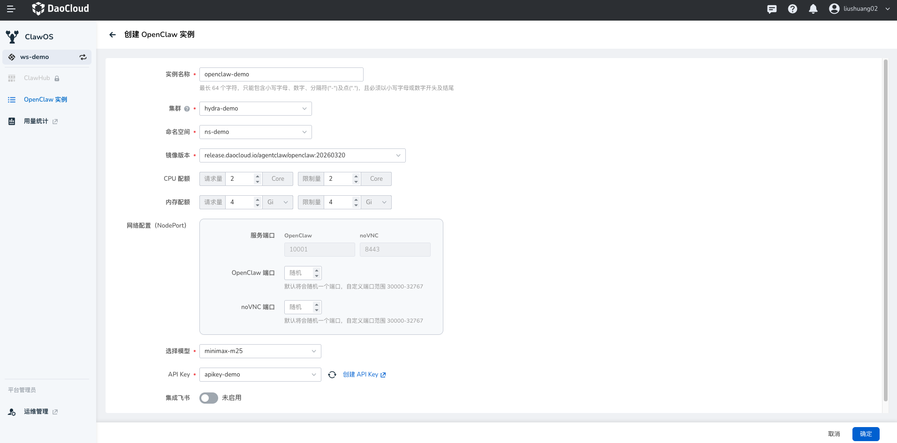
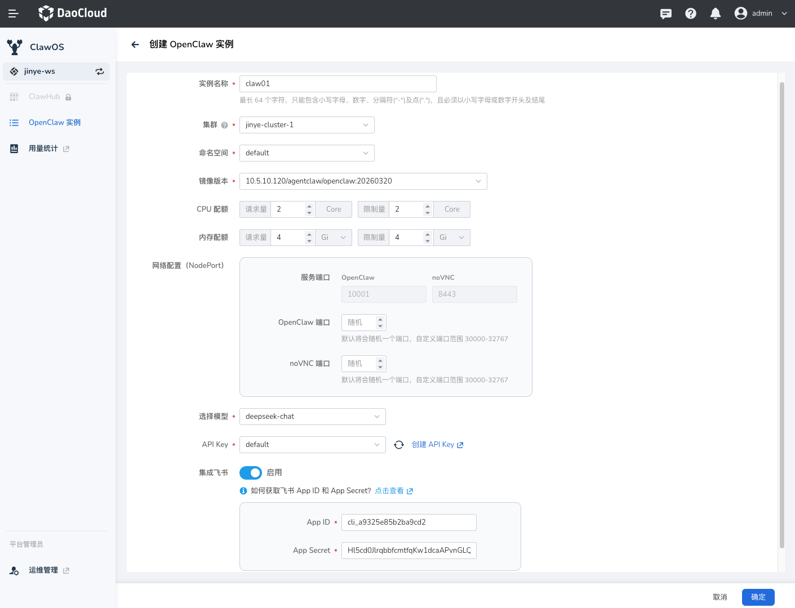
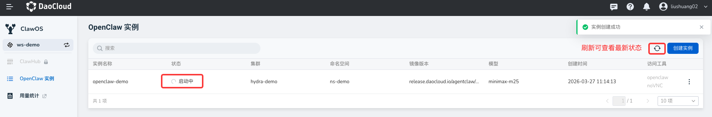
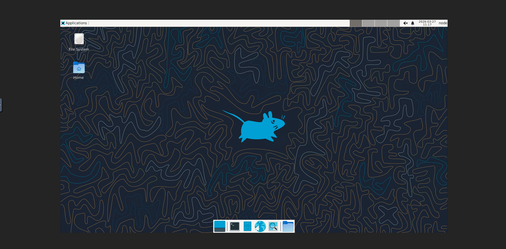

# 快速入门

本指南将帮助您在 DCE 上快速创建和使用 OpenClaw 实例。

## 前提条件

- 拥有 WS Editor、WS Admin 或 Admin 权限
- WS 的资源组中已经绑定 NS
- 已在大模型服务平台的同一个 WS 中创建了 API Key

## 创建 OpenClaw 实例

1. 从左侧导航栏，选择 **ClawOS** ，点击右侧的 **创建实例** 按钮
1. 配置 OpenClaw 实例

    - 设置实例名称，选择对应的集群、命名空间、镜像版本，配置 CPU/内存资源、网络、模型（推荐使用 minimax 模型）和 API Key。
    - （可选）启用 **集成飞书** 并填入飞书的 App ID 和 App Secret。

    点击右下角 **确定**
    
    
     

    

    > 有关如何获取飞书配置信息以及对接飞书的详细步骤，请参考[飞书集成](./feishu.md)文档。

1. 耐心等待实例创建完成。

    

## 访问 OpenClaw

某个实例的状态显示为 **运行中** 后：

1. 点击右侧的 **访问工具** -> **openclaw** 或 **noVNC**（浏览器里的远程桌面）

    

2. 打开 OpenClaw 管理页面

    

3. 打开 noVNC 管理页面

    

!!! note

    - 某些情况下，由于网络波动，在创建实例后，可能需要等待 1-2 分钟才能访问。
    - 如果出现以下提示，可以点击 **继续访问网站** ，就能在聊天窗口中使用小龙虾智能体。

    

## 后台调试 OpenClaw

您可以通过实例列表中 noVNC 进行快捷操作。

    

### 命令行操作

查看磁盘空间：

```bash
df -h  # 查看磁盘空间
```

查看内存详细情况：

```bash
free -h
```

## OpenClaw 常见问题

参阅[常见问题](./faq.md)文档。
