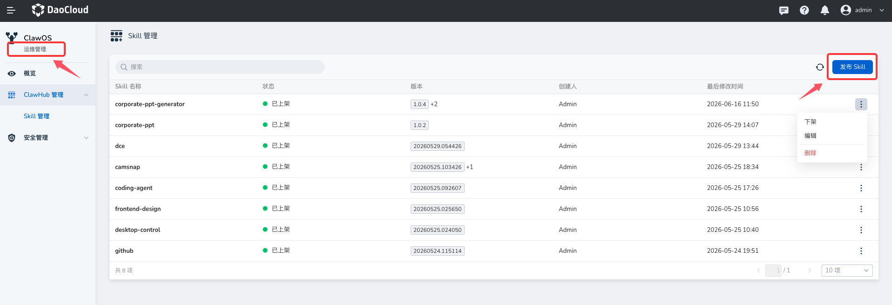
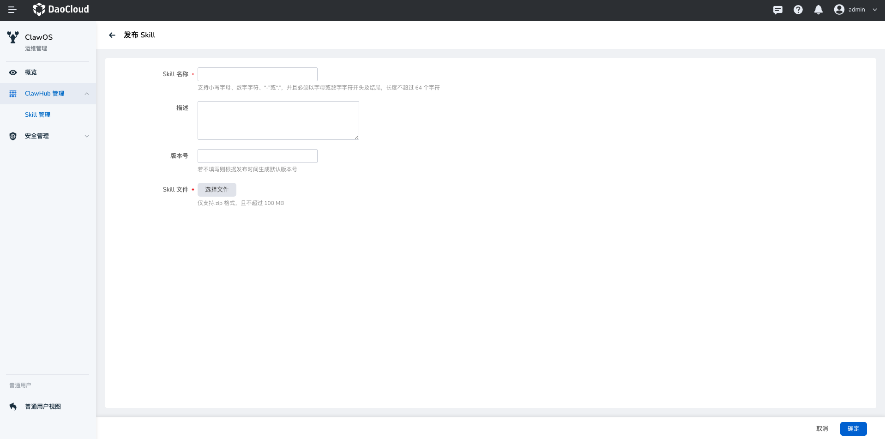

# Skill 管理（管理员视角）

平台管理员视角下的 Skill 管理是 ClawHub 的平台级供给与治理后台，用于发布、审核、上架、下架和维护**公开 Skill**。

平台管理员不消费 Skill，也不需要进入 Skill 市场安装 Skill。因此管理员后台不提供 Skill 市场入口，只提供 Skill 管理能力。由平台管理员发布并上架的 Skill，会进入所有工作空间 ClawHub **Skill 市场** 的 **公开 Skill** 列表，所有工作空间成员都可以在各自工作空间中安装并使用。

!!! note

    工作空间管理员发布私有 Skill 的操作，请参见工作空间视角下的 Skill 管理文档。

## 角色与边界

### 平台管理员

平台管理员负责维护平台公共 Skill 供给，包括：

- 发布新的 Skill
- 上传 Skill 文件包
- 查看平台已发布 Skill 列表
- 编辑 Skill 基本信息和版本
- 发起或处理 Skill 审核
- 查看自动安全扫描结果
- 将 Skill 上架到公开市场
- 将 Skill 从公开市场下架
- 删除未上架或不再需要的 Skill

### 工作空间成员

工作空间成员不在管理员后台出现。成员只能在工作空间视角的 ClawHub **Skill 市场** 中发现公开 Skill，并在工作空间中安装和使用。

### 工作空间管理员

工作空间管理员可以在工作空间内安装、启用、停用、配置或卸载 Skill，但不能发布平台级公开 Skill，也不能绕过平台审核流程。

## 发布 Skill

1. 平台管理员点击 **发布 Skill**，进入发布页面。

    

2. 填写 Skill 信息并上传 Skill 文件包，提交发布。

    

提交发布后，系统创建一条 Skill 记录，并进入审核流程。Skill **不会立即**出现在工作空间 Skill 市场中。

### 发布后状态流转

1. 平台管理员填写信息并上传 Skill 文件
2. 系统创建 Skill 草稿
3. 系统自动发起安全扫描
4. 安全扫描完成后进入待审核状态
5. 平台管理员或审核员执行审核
6. 审核通过后，Skill 进入未上架状态
7. 平台管理员执行上架
8. Skill 出现在所有工作空间的 ClawHub Skill 市场 **公开 Skill** 中

## 上架与下架

### 上架

平台管理员可以将审核通过的 Skill 上架。上架后：

- Skill 状态变为 **已上架**
- Skill 进入所有工作空间的 ClawHub Skill 市场
- Skill 在市场中归类为 **公开 Skill**
- 所有工作空间成员都可以查看、安装并使用该 Skill
- 已安装该 Skill 的工作空间可以继续在工作空间内管理启用、停用和配置

### 下架

平台管理员可以将已上架 Skill 下架。下架后：

- Skill 从所有工作空间的 ClawHub Skill 市场 **公开 Skill** 列表中移除
- 新的工作空间不能再安装该 Skill
- 已安装该 Skill 的工作空间是否继续可用，由平台策略决定
- 下架不会立即卸载已安装 Skill；已安装工作空间可以继续使用当前版本
- 工作空间不可再安装新实例，也不可升级到下架版本
