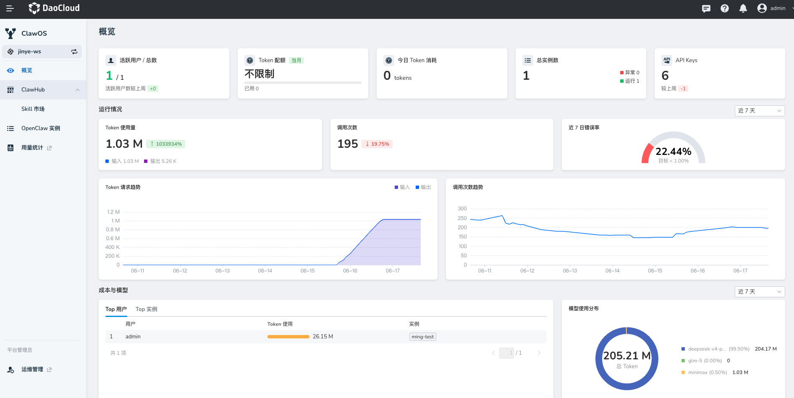

# 概览

工作空间视角下的「概览」页面面向工作空间管理员（租户管理员），提供当前工作空间内 OpenClaw 实例的整体运行、用量、成本、模型和风险情况。

通过该页面，您可以快速了解：

- 当前有多少 Agent 在运行
- Token 消耗是否异常
- 调用是否稳定
- 哪些用户或实例使用最多
- 主要使用了哪些模型

## 模块作用

「概览」用于帮助工作空间管理员从整体层面掌握本工作空间内 Agent 的使用与运行情况。它不是单个实例的配置页，而是一个运营看板。

主要用于：

- 查看工作空间内 OpenClaw 实例总体规模
- 查看活跃用户、实例数量、API Key 数量
- 查看 Token 配额、Token 消耗和调用趋势
- 查看错误率、调用次数等稳定性指标
- 查看 Top 用户或 Top 实例的资源消耗
- 查看不同模型的使用占比
- 辅助判断成本、风险和使用价值

## 名词解释

### 活跃用户/总数

表示当前工作空间中，在统计周期内实际使用过 ClawOS/OpenClaw 能力的用户数量，以及该工作空间内可使用平台的用户总数。

页面中的「较上周期 +1」表示与上一统计周期相比，活跃用户数量增加了 1 人。

### Token 配额

表示当前工作空间在本统计周期内可使用的 Token 总额度。例如 `10,000,000` 表示该工作空间当月可使用 1000 万 Token。

下方进度条展示当前已使用比例。例如 `已用 3,215,678 (32%)` 表示已消耗 3,215,678 Token，占总配额的 32%。Token 配额用于帮助管理员控制模型调用成本，避免单个工作空间或团队无限制消耗模型资源。

!!! note

    当前原型中标注为「当月」，表示该指标按自然月或平台配置的月度周期统计。

### 总实例数

表示当前工作空间下已创建的 OpenClaw 实例总数。

- **运行中**：实例处于正常运行状态，可接收请求并执行任务
- **异常**：实例存在启动失败、运行错误、配置异常或健康检查失败等问题

该指标用于帮助管理员快速判断工作空间内 Agent 的整体部署规模和健康状态。

### API Keys

表示当前工作空间内已配置或正在使用的 API Key 数量。API Key 通常用于 OpenClaw 调用大模型服务、平台网关或其他外部能力。

该指标可帮助管理员了解凭证配置规模，并辅助排查调用失败、模型不可用或成本异常问题。

### 今日 Token 消耗

表示当前工作空间内所有 OpenClaw 实例在当天累计消耗的 Token 数。该指标适合用于快速判断当天是否存在异常高消耗。

### Token 使用量

表示统计周期内的 Token 总使用量，并区分输入 Token 和输出 Token：

- **输入**：用户消息、上下文、工具返回内容、知识库检索内容等发送给模型的 Token
- **输出**：模型生成回复、计划、代码、总结等内容消耗的 Token

**Token 使用量** = 输入 Token + 输出 Token。

### 调用次数

表示统计周期内 OpenClaw 实例或模型服务被调用的次数。调用次数可用于观察平台使用频率。

- 如果 Token 使用量增长但调用次数下降，可能说明单次任务变复杂
- 如果调用次数增长但 Token 没有明显增长，可能说明更多用户在进行轻量使用

### 近 7 日错误率

表示最近 7 天内调用失败次数占总调用次数的比例。错误率可反映平台运行稳定性。

常见错误来源包括：

- 模型调用失败
- API Key 失效
- 网络访问失败
- Skill 执行异常
- 工具调用超时
- 实例状态异常

## 趋势图说明

### Token 请求趋势

展示统计周期内 Token 使用量的变化趋势。管理员可以通过该趋势判断是否存在突增、突降或周期性高峰。

### 调用次数趋势

展示统计周期内调用次数的变化情况，用于观察 Agent 使用活跃度。

- 如果调用次数持续上升，说明工作空间内 Agent 使用频率增加
- 如果调用次数突然下降，可能需要检查实例状态、消息渠道配置、API Key 或用户访问权限

## 成本与模型

### Top 用户/实例

该区域用于查看 Token 消耗最高的用户或实例。

- **用户维度**：展示不同用户的 Token 使用情况，帮助管理员了解哪些用户使用最活跃、哪些用户可能产生较高成本
- **实例维度**：展示不同 OpenClaw 实例的 Token 使用情况，帮助管理员识别高消耗实例，并进一步排查该实例是否承担了关键业务任务，或是否存在异常调用

### 模型使用分布

展示当前统计周期内不同模型的 Token 使用占比。该指标可帮助管理员了解模型使用结构，并辅助成本治理。

例如，高成本模型占比过高时，可以考虑配置模型路由、预算限制，或推荐部分场景使用更低成本模型。

### 时间范围

页面中部分卡片支持按时间范围筛选，例如近 7 天、近 30 天或当月。切换时间范围后，相关指标和趋势图会同步更新。
