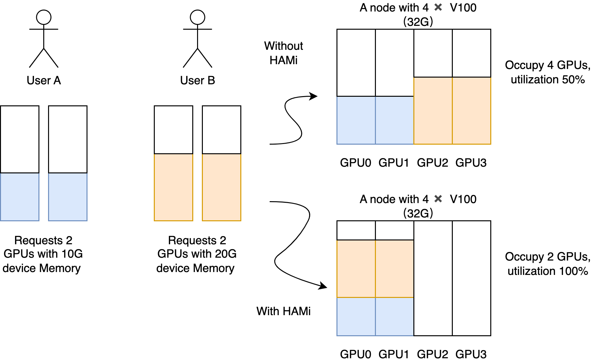
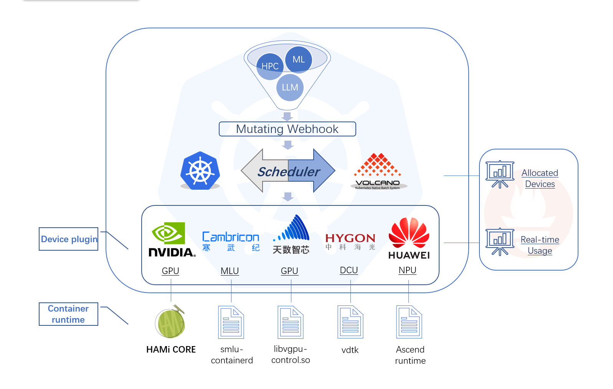

# HAMi - 异构算力虚拟化中间件

**HAMi 已经是一个 [CNCF 云原生计算基金会](https://cncf.io/)全景图中的项目。
HAMi 在申请加入 Sandbox，目前[已通过投票阶段](https://github.com/cncf/sandbox/issues/97)，
超过了 66% 的合格分数线，参阅[相关推文](https://mp.weixin.qq.com/s/6Ze2i3-CQSFANhn8b7oNjA)。**

支持的设备：
[](https://github.com/Project-HAMi/HAMi#preparing-your-gpu-nodes)
[](https://github.com/Project-HAMi/HAMi/blob/master/docs/cambricon-mlu-support_cn.md)
[](https://github.com/Project-HAMi/HAMi/blob/master/docs/hygon-dcu-support.md)
[](https://github.com/Project-HAMi/HAMi/blob/master/docs/iluvatar-gpu-support_cn.md)



异构算力虚拟化中间件 HAMi 满足了所有你对于管理异构算力集群所需要的能力，包括：

- **设备复用**：每个任务可以只占用一部分显卡，多个任务可以共享一张显卡
- **可限制分配的显存大小**：你现在可以用显存值（例如 3000M）或者显存比例（例如 50%）来分配 GPU，vGPU 调度器会确保任务使用的显存不会超过分配数值
- **指定设备型号**：当前任务可以通过设置 `annotation` 的方式，来选择使用或者不使用某些具体型号的设备
- **设备指定 UUID**：当前任务可以通过设置 `annotation` 的方式，来选择使用或者不使用指定的设备，比如："nvidia.com/use-gpuuuid" or "nvidia.com/nouse-gpuuuid"
- **无侵入**：vGPU 调度器兼容 nvidia 官方插件的显卡分配方式，所以安装完毕后，你不需要修改原有的任务文件就可以使用 vGPU 的功能。当然，你也可以自定义的资源名称
- **调度策略**：vGPU 调度器支持多种调度策略，包括节点、GPU 卡纬度的调度策略，可以通过调度器的参数来进行默认设置，同时也可以根据应用场景，通过设置 Pod 的 `annotation` 来选择，
  比如 "hami.io/node-scheduler-policy" 或 "hami.io/gpu-scheduler-policy"，两个纬度都支持 `binpack` 和 `spread` 两种策略。

## 使用场景

- 云原生场景下需要复用算力设备的场合
- 需要定制异构算力申请的场合，如申请特定显存大小的虚拟 GPU，每个虚拟 GPU 使用特定比例的算力。
- 在多个异构算力节点组成的集群中，任务需要根据自身的显卡需求分配到合适的节点执行。
- 显存、计算单元利用率低的情况，如在一张 GPU 卡上运行 10 个 tf-serving。
- 需要大量小显卡的情况，如教学场景把一张 GPU 提供给多个学生使用、云平台提供小 GPU 实例。

## 产品设计



HAMi 包含以下几个组件，一个统一的 mutatingwebhook，一个统一的调度器，以及针对各种不同的异构算力设备对应的设备插件和容器内的控制组件，整体的架构特性如上图所示。

## 产品特性

HAMi 可以实现显存资源的硬隔离。

一个硬隔离的简单展示：
提交使用以下方式定义的任务后

```yaml
resources:
  limits:
    nvidia.com/gpu: 1 # requesting 1 vGPU
    nvidia.com/gpumem: 3000 # Each vGPU contains 3000m device memory
```

会只有 3G 可见显存：


- 允许通过指定显存来申请算力设备
- 算力资源的硬隔离
- 允许通过指定算力使用比例来申请算力设备
- 对已有程序零改动

## 安装要求

- NVIDIA drivers >= 440
- nvidia-docker version > 2.0
- docker/containerd/cri-o 已配置 nvidia 作为默认 runtime
- Kubernetes version >= 1.16
- glibc >= 2.17 & glibc < 2.3.0
- kernel version >= 3.10
- helm > 3.0

## 快速入门

### 选择你的集群调度器

[](https://github.com/Project-HAMi/HAMi#quick-start)
[](https://github.com/Project-HAMi/HAMi/blob/master/docs/how-to-use-volcano-vgpu.md)

### GPU 节点准备

以下步骤要在所有 GPU 节点执行，这份 README 文档假定 GPU 节点已经安装 NVIDIA 驱动。
它还假设您已经安装 docker 或 containerd 并且需要将 nvidia-container-runtime 配置为要使用的默认低级运行时。

#### 安装步骤举例

```bash
# 加入套件仓库
distribution=$(. /etc/os-release;echo $ID$VERSION_ID)
curl -s -L https://nvidia.github.io/libnvidia-container/gpgkey | sudo apt-key add -
curl -s -L https://nvidia.github.io/libnvidia-container/$distribution/libnvidia-container.list | sudo tee /etc/apt/sources.list.d/libnvidia-container.list

sudo apt-get update && sudo apt-get install -y nvidia-container-toolkit
```

##### 配置 Docker

你需要在节点上将 nvidia runtime 做为你的 docker runtime 预设值。我们将编辑 docker daemon 的配置文件，此文件通常在 `/etc/docker/daemon.json` 路径：

```json
{
  "default-runtime": "nvidia",
  "runtimes": {
    "nvidia": {
      "path": "/usr/bin/nvidia-container-runtime",
      "runtimeArgs": []
    }
  }
}
```

```bash
systemctl daemon-reload && systemctl restart docker
```

##### 配置 containerd

你需要在节点上将 nvidia runtime 做为你的 containerd runtime 预设值。我们将编辑 containerd daemon 的配置文件，此文件通常在 `/etc/containerd/config.toml` 路径：

```toml
version = 2
[plugins]
  [plugins."io.containerd.grpc.v1.cri"]
    [plugins."io.containerd.grpc.v1.cri".containerd]
      default_runtime_name = "nvidia"

      [plugins."io.containerd.grpc.v1.cri".containerd.runtimes]
        [plugins."io.containerd.grpc.v1.cri".containerd.runtimes.nvidia]
          privileged_without_host_devices = false
          runtime_engine = ""
          runtime_root = ""
          runtime_type = "io.containerd.runc.v2"
          [plugins."io.containerd.grpc.v1.cri".containerd.runtimes.nvidia.options]
            BinaryName = "/usr/bin/nvidia-container-runtime"
```

```bash
systemctl daemon-reload && systemctl restart containerd
```

最后，你需要将所有要使用到的 GPU 节点打上 gpu=on 标签，否则该节点不会被调度到：

```bash
kubectl label nodes {nodeid} gpu=on
```

### 安装、更新与卸载

首先使用 helm 添加 HAMi repo：

```bash
helm repo add hami-charts https://project-hami.github.io/HAMi/
```

随后，使用下列指令获取集群服务端版本：

```bash
kubectl version
```

在安装过程中须根据集群服务端版本（上一条指令的结果）指定调度器镜像版本，例如集群服务端版本为 1.16.8，则可以使用如下指令进行安装：

```bash
helm install hami hami-charts/hami --set scheduler.kubeScheduler.imageTag=v1.16.8 -n kube-system
```

你可以修改这里的[配置](https://github.com/Project-HAMi/HAMi/blob/master/docs/config_cn.md)来定制安装。

通过 `kubectl get pods` 指令看到 `vgpu-device-plugin` 与 `vgpu-scheduler` 两个 pod 状态为*Running* 即为安装成功

```bash
kubectl get pods -n kube-system
```

**更新**

只需要更新 helm repo，并重新启动整个 Chart 即可自动完成更新，最新的镜像会被自动下载：

```bash
helm uninstall hami -n kube-system
helm repo update
helm install hami hami-charts/hami -n kube-system
```

> **注意:** 如果你没有清理完任务就进行热更新的话，正在运行的任务可能会出现段错误等报错。

**卸载**

```bash
helm uninstall hami -n kube-system
```

> **注意:** 卸载组件并不会使正在运行的任务失败.

### 提交任务

NVIDIA vGPUs 现在能透过资源类型 `nvidia.com/gpu` 被容器请求：

```yaml
apiVersion: v1
kind: Pod
metadata:
  name: gpu-pod
spec:
  containers:
    - name: ubuntu-container
      image: ubuntu:18.04
      command: ["bash", "-c", "sleep 86400"]
      resources:
        limits:
          nvidia.com/gpu: 2 # 请求 2 个 vGPUs
          nvidia.com/gpumem: 3000 # 每个 vGPU 申请 3000m 显存 （可选，整数类型）
          nvidia.com/gpucores: 30 # 每个 vGPU 的算力为 30% 实际显卡的算力 （可选，整数类型）
```

如果你的任务无法运行在任何一个节点上（例如任务的 `nvidia.com/gpu` 大于集群中任意一个 GPU 节点的实际 GPU 数量），那么任务会卡在 `pending` 状态

现在你可以在容器执行 `nvidia-smi` 命令，然后比较 vGPU 和实际 GPU 显存大小的不同。

> **注意:**
>
> 1. 如果你使用 privileged 字段的话，本任务将不会被调度，因为它可见所有的 GPU，会对其它任务造成影响.
>
> 2. 不要设置 nodeName 字段，类似需求请使用 nodeSelector.

#### 更多范例

查看[更多范例](https://github.com/Project-HAMi/HAMi/tree/master/examples/nvidia)。

### 监控

调度器部署成功后，监控默认自动开启，你可以通过：

```http
http://{nodeip}:{monitorPort}/metrics
```

来获取监控数据，其中 monitorPort 可以在 Values 中进行配置，默认为 31992

参见 grafana dashboard [示例](https://github.com/Project-HAMi/HAMi/blob/master/docs/dashboard_cn.md)。

> **注意** 节点上的 vGPU 状态只有在其使用 vGPU 后才会被统计

参阅完整的[性能测试文档](https://github.com/Project-HAMi/HAMi/blob/master/docs/benchmark_cn.md)。

## 已知问题

- 目前仅支持计算任务，不支持视频编解码处理。
- 暂时仅支持 MIG 的 "none" 和 "mixed" 模式，暂时不支持 single 模式
- 当任务有字段 “nodeName“ 时会出现无法调度的情况，有类似需求的请使用 "nodeSelector" 代替
- 我们修改了 `device-plugin` 组件的环境变量，从 `NodeName` 改为 `NODE_NAME`，如果使用的是镜像版本是 `v2.3.9`，则可能会出现 `device-plugin` 无法启动的情况，目前有两种修复建议：
    - 手动执行`kubectl edit daemonset` 修改 `device-plugin` 的环境变量从`NodeName` 改为 `NODE_NAME`。
    - 使用 helm 升级到最新版本，最新版`device-plugin`的镜像版本是`v2.3.10`，执行 `helm upgrade hami hami/hami -n kube-system`，会自动修复。

## 开发计划

目前支持的异构算力设备及其对应的复用特性如下表所示：

| 产品   | 制造商   | 显存隔离 | 算力隔离 | 多卡支持 |
| ------ | -------- | -------- | -------- | -------- |
| GPU    | NVIDIA   | ✅       | ✅       | ✅       |
| MLU    | 寒武纪   | ✅       | ❌       | ❌       |
| DCU    | 海光     | ✅       | ✅       | ❌       |
| Ascend | 华为     | 开发中   | 开发中   | ❌       |
| GPU    | 天数智芯 | 开发中   | 开发中   | ❌       |
| DPU    | 太初     | 开发中   | 开发中   | ❌       |

- [ ] 支持视频编解码处理
- [ ] 支持 Multi-Instance GPUs (MIG)
- [ ] 支持更加灵活的调度策略
    - [ ] binpack
    - [ ] spread
    - [ ] numa affinity
- [ ] 与 nvidia gpu-operator 集成
- [ ] 更丰富的可观测性能力支持
- [ ] 支持 DRA
- [ ] 支持 Intel GPU device
- [ ] 支持 AMD GPU device

## 参与贡献

如果你想成为 HAMi 的贡献者，请参考[贡献者指南](https://github.com/Project-HAMi/HAMi/blob/master/CONTRIBUTING.md)。

- [HAMi 官网](http://project-hami.io/)
- [HAMi 仓库](https://github.com/Project-HAMi/HAMi)
