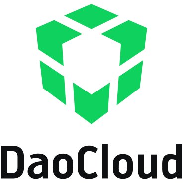

# DaoCloud 开源图标库

本页列出 DaoCloud 自主开源项目的图标以及友商公开的图标，方便大家查阅取用。

!!! tip

    有些图标为白色背景，正常不可见，可以点击本页顶部的 ⚙️ 图标切换为 Dark 模式。

## 云厂商和社区项目图标

<table>
  <tr>
    <th>名称</th>
    <th style="text-align: center; vertical-align: middle;">图标</th>
    <th>名称</th>
    <th style="text-align: center; vertical-align: middle;">图标</th>
    <th>名称</th>
    <th style="text-align: center; vertical-align: middle;">图标</th>
    <th>名称</th>
    <th style="text-align: center; vertical-align: middle;">图标</th>
  </tr>
  <tr>
    <td style="vertical-align: middle;">Android</td>
    <td></td>
    <td style="vertical-align: middle;">Argo</td>
    <td></td>
    <td style="vertical-align: middle;">ARM</td>
    <td></td>
    <td style="vertical-align: middle;">AWS</td>
    <td></td>
  </tr>
  <tr>
    <td style="vertical-align: middle;">Azure</td>
    <td></td>
    <td style="vertical-align: middle;">CentOS</td>
    <td></td>
    <td style="vertical-align: middle;">Cilium</td>
    <td></td>
    <td style="vertical-align: middle;">Consul</td>
    <td></td>
  </tr>
  <tr>
    <td style="vertical-align: middle;">containerd</td>
    <td></td>
    <td style="vertical-align: middle;">Contour</td>
    <td></td>
    <td style="vertical-align: middle;">DaoCloud</td>
    <td></td>
    <td style="vertical-align: middle;">DCE</td>
    <td></td>
  </tr>
  <tr>
    <td style="vertical-align: middle;">Debian</td>
    <td></td>
    <td style="vertical-align: middle;">Docker</td>
    <td></td>
    <td style="vertical-align: middle;">Dubbo</td>
    <td></td>
    <td style="vertical-align: middle;">Envoy</td>
    <td></td>
  </tr>
  <tr>
    <td style="vertical-align: middle;">Eureka</td>
    <td></td>
    <td style="vertical-align: middle;">FluentBit</td>
    <td></td>
    <td style="vertical-align: middle;">GCP</td>
    <td></td>
    <td style="vertical-align: middle;">Git</td>
    <td></td>
  </tr>
  <tr>
    <td style="vertical-align: middle;">GitLab</td>
    <td></td>
    <td style="vertical-align: middle;">Grafana</td>
    <td></td>
    <td style="vertical-align: middle;">Harbor</td>
    <td></td>
    <td style="vertical-align: middle;">Helm</td>
    <td></td>
  </tr>
  <tr>
    <td style="vertical-align: middle;">华为</td>
    <td></td>
    <td style="vertical-align: middle;">Insight-agent</td>
    <td></td>
    <td style="vertical-align: middle;">Istio</td>
    <td></td>
    <td style="vertical-align: middle;">Jaeger</td>
    <td></td>
  </tr>
  <tr>
    <td style="vertical-align: middle;">Jenkins</td>
    <td></td>
    <td style="vertical-align: middle;">Jfrog</td>
    <td></td>
    <td style="vertical-align: middle;">Jira</td>
    <td></td>
    <td style="vertical-align: middle;">Kubernetes</td>
    <td></td>
  </tr>
  <tr>
    <td style="vertical-align: middle;">KubeSphere</td>
    <td></td>
    <td style="vertical-align: middle;">Karmada</td>
    <td></td>
    <td style="vertical-align: middle;">Kdoctor</td>
    <td></td>
    <td style="vertical-align: middle;">Kiali</td>
    <td></td>
  </tr>
  <tr>
    <td style="vertical-align: middle;">KLTS</td>
    <td></td>
    <td style="vertical-align: middle;">KubeEdge</td>
    <td></td>
    <td style="vertical-align: middle;">Kubevela</td>
    <td></td>
    <td style="vertical-align: middle;">Kubespray</td>
    <td></td>
  </tr>
  <tr>
    <td style="vertical-align: middle;">Kylin</td>
    <td></td>
    <td style="vertical-align: middle;">Kylin mini</td>
    <td></td>
    <td style="vertical-align: middle;">灵雀</td>
    <td></td>
    <td style="vertical-align: middle;">MetalLB</td>
    <td></td>
  </tr>
</table>

## DaoCloud 开源项目图标

<table>
  <tr>
    <th>名称</th>
    <th>彩色白底</th>
    <th>彩色黑底</th>
    <th>黑白白底</th>
    <th>黑白黑底</th>
  </tr>
  <tr>
    <td style="vertical-align: middle;">CloudTTY</td>
    <td></td>
    <td></td>
    <td></td>
    <td></td>
  </tr>
  <tr>
    <td style="vertical-align: middle;">Clusterpedia</td>
    <td></td>
    <td></td>
    <td></td>
    <td></td>
  </tr>
  <tr>
    <td style="vertical-align: middle;">HwameiStor</td>
    <td></td>
    <td></td>
    <td></td>
    <td></td>
  </tr>
  <tr>
    <td style="vertical-align: middle;">KLTS</td>
    <td></td>
    <td></td>
    <td></td>
    <td></td>
  </tr>
  <tr>
    <td style="vertical-align: middle;">Merbridge</td>
    <td></td>
    <td></td>
    <td></td>
    <td></td>
  </tr>
  <tr>
    <td style="vertical-align: middle;">Spidernet</td>
    <td></td>
    <td></td>
    <td></td>
    <td></td>
  </tr>
</table>

## DaoCloud 中间件图标

<table>
  <tr>
    <th>名称</th>
    <th style="text-align: center; vertical-align: middle;">图标</th>
    <th>名称</th>
    <th style="text-align: center; vertical-align: middle;">图标</th>
    <th>名称</th>
    <th style="text-align: center; vertical-align: middle;">图标</th>
  </tr>
  <tr>
    <td style="vertical-align: middle;">Elasticsearch</td>
    <td></td>
    <td style="vertical-align: middle;">Kafka</td>
    <td></td>
    <td style="vertical-align: middle;">MinIO</td>
    <td></td>
  </tr>
  <tr>
    <td style="vertical-align: middle;">MongoDB</td>
    <td></td>
    <td style="vertical-align: middle;">MySQL</td>
    <td></td>
    <td style="vertical-align: middle;">PostgreSQL</td>
    <td></td>
  </tr>
  <tr>
    <td style="vertical-align: middle;">RabbitMQ</td>
    <td></td>
    <td style="vertical-align: middle;">Redis</td>
    <td></td>
    <td style="vertical-align: middle;">RocketMQ</td>
    <td></td>
  </tr>
</table>

## DaoCloud Logo

<table>
  <tr>
    <th>类型</th>
    <th style="text-align: center; vertical-align: middle;">图标</th>
    <th style="text-align: center; vertical-align: middle;">图标</th>
    <th style="text-align: center; vertical-align: middle;">图标</th>
    <th style="text-align: center; vertical-align: middle;">图标</th>
  </tr>
  <tr>
    <td style="vertical-align: middle;">横向</td>
    <td></a></td>
    <td></a></td>
    <td></a></td>
    <td></a></td>
  </tr>
  <tr>
    <td style="vertical-align: middle;">纵向</td>
    <td></a></td>
    <td></a></td>
    <td></a></td>
    <td></a></td>
  </tr>
  <tr>
    <td style="vertical-align: middle;">不带字</td>
    <td></a></td>
    <td></a></td>
    <td></a></td>
    <td></td>
  </tr>
</table>
