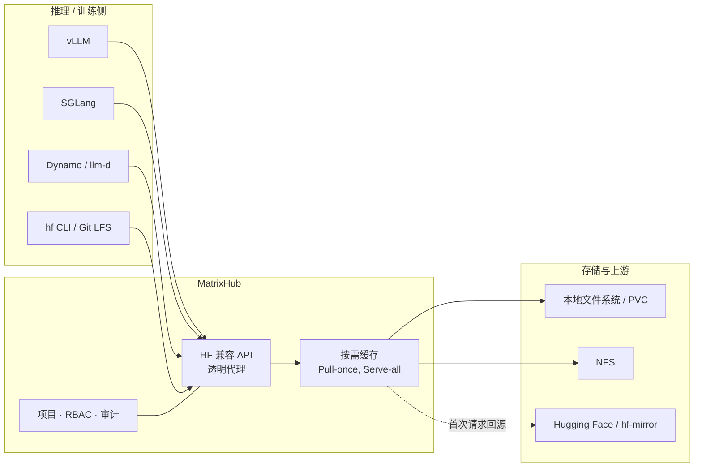

# MatrixHub

MatrixHub 是由「DaoCloud 道客」开源并持续孵化的**自托管 AI 模型仓库**（Model Registry），面向企业级大规模推理场景设计。
它提供与 Hugging Face 兼容的 API，可作为 Hugging Face 的私有化平替，并为 vLLM、SGLang 等主流推理引擎加速模型加载。

> **MatrixHub 之于 Hugging Face，正如 Harbor 之于 Docker Hub。**
>
> 让关键业务不再依赖公网：掌控模型资产，加速分发管线。

MatrixHub 使用 Go 语言编写，采用 [Apache License 2.0](https://github.com/matrixhub-ai/matrixhub/blob/main/LICENSE) 协议开源，
并已取得 [OpenSSF Best Practices](https://www.bestpractices.dev/projects/13641) **Passing** 级认证。

[了解 MatrixHub GitHub 社区](https://github.com/matrixhub-ai/matrixhub){ .md-button }
[查阅 MatrixHub 官网](https://matrixhub.ai/){ .md-button }

## 为什么需要 MatrixHub

当大模型从实验走向规模化生产，模型权重本身就成了需要被治理的核心资产。但传统的做法往往依赖公网直连 Hugging Face，
在 GPU 集群扩容、离线环境交付、版本追溯等环节暴露出明显短板：

| 典型挑战 | MatrixHub 的应对方式 |
| --- | --- |
| GPU 集群每次扩容都要从公网重复拉取数十 GB 权重，带宽成为瓶颈 | 透明代理 + 按需缓存，一次拉取、全集群复用（Pull-once, Serve-all） |
| 生产环境不允许直连公网，需要把模型安全地送进隔离网络 | 离线（Air-Gapped）交付，在隔离网络中保留原生 `HF_ENDPOINT` 体验 |
| 微调权重散落在各个节点，版本与发布过程不可追溯 | 集中式私有仓库，支持 Tag 锁定、提升流程与 CI/CD 集成 |
| 多数据中心各自重复下载，跨地域访问延迟高 | 策略驱动的异步复制，支持分块传输与断点续传 |
| 缺少权限隔离、审计记录与合规手段 | 项目级隔离、RBAC、全量审计日志、完整性校验与恶意内容扫描 |

## 核心能力

### 高性能分发

- **透明 HF 代理**：把客户端或推理引擎的 `HF_ENDPOINT` 指向 MatrixHub 即可切换到私有托管，**无需修改任何业务代码**。
- **按需缓存**：首次请求时自动从上游拉取并本地化公共模型，后续请求直接命中缓存，大幅削减重复出口流量。
- **推理原生加速**：原生支持 **P2P 分发**、OCI 制品，以及 **NetLoader** 直通 GPU 的权重流式加载，减少模型加载等待时间。

### 企业级治理与安全

- **RBAC 与多租户**：基于项目的隔离机制与细粒度权限控制，可对接 LDAP / SSO。
- **审计与合规**：对每一次上传、下载和配置变更保留完整日志，实现全链路可追溯。
- **完整性保护**：内置恶意内容扫描与内容签名，确保模型在流转过程中不被篡改。

### 可扩展的基础设施

- **灵活存储**：当前支持挂载在 PVC 上的本地文件系统与 NFS，S3 兼容对象存储已在规划中。
- **可靠复制**：策略驱动的分块传输，即使在不稳定的跨地域网络上也能保证数据一致性。
- **云原生设计**：面向 Kubernetes 优化，提供官方 **Helm Chart**，支持水平扩展。

## 工作原理

MatrixHub 位于推理侧与模型存储之间，对上层屏蔽上游模型来源，对下层统一管理存储与复制。



一次典型的模型分发流程如下：

1. 在 MatrixHub 中创建一个**代理项目**，并配置指向 Hugging Face（或 hf-mirror 等镜像站）的**目标仓库（Registry）**。
2. 推理节点通过 `HF_ENDPOINT` 访问 MatrixHub 请求模型；若缓存未命中，MatrixHub 会回源上游下载并落盘缓存，该过程对客户端完全透明。
3. 后续在同一集群内请求同一模型的节点直接命中缓存，天然形成“一次回源、全集群复用”的分发效果。
4. 缓存完成后，可配合复制策略将模型异步同步到其他数据中心或离线环境，全程保留审计记录。

## 典型使用场景

- **零等待分发**：以 “一次拉取、全量供应” 的缓存机制消除带宽瓶颈，可支撑 100+ GPU 节点同时以 10 Gbps 以上的速度拉取模型。
- **气隙交付**：在具备完整性保护、恶意扫描与审计留痕的前提下，把模型安全地送入隔离网络。
- **私有模型仓库**：集中管理微调权重，通过 Tag 锁定与 CI/CD 集成，保证从开发到生产的版本一致性。
- **跨地域多活同步**：在多个数据中心之间自动执行异步、可断点续传的复制，实现就近访问与高可用。

## 与推理生态集成

MatrixHub 已与主流推理引擎和调度框架完成对接，核心方式均是把 `HF_ENDPOINT` 指向 MatrixHub 地址：

```bash
# 将模型下载入口指向自建的 MatrixHub
export HF_ENDPOINT=https://hub.matrix.internal

# vLLM / SGLang 等引擎无需其他改造，模型将直接从 MatrixHub 缓存加载
vllm serve "deepseek-ai/deepseek-coder-33b"
```

- **vLLM**：在运行环境中设置 `HF_ENDPOINT`，即可通过 MatrixHub 加载模型。
- **SGLang**：同样通过 `HF_ENDPOINT` 从 MatrixHub 缓存中加载模型，加速集群启动。
- **llm-d**：向 llm-d 的模型服务注入 `HF_ENDPOINT`，在集群内统一分发模型。
- **Dynamo**：在 Dynamo 部署中设置 `HF_ENDPOINT`，由 MatrixHub 作为模型来源。
- **ModelExpress**：以 MatrixHub 作为模型源，由 ModelExpress 在 Dynamo Worker 之间复用已缓存/已加载的权重（支持 NIXL、UCX、RDMA 等 P2P 传输）。

除推理引擎外，MatrixHub 还支持通过 **Git、Git LFS 和 HTTP** 访问模型仓库，并提供 SSH 密钥与访问令牌管理。
详细的集成步骤请查阅[官方集成文档](https://matrixhub.ai/docs/integrations/)。

## 快速开始

MatrixHub 提供两种官方安装方式：**Docker Compose**（适用于单机）与 **Helm Chart**（适用于 Kubernetes 集群）。

### Docker Compose 部署

```bash
export MATRIXHUB_VERSION=v0.1.1

mkdir -p matrixhub && cd matrixhub

curl -fL \
  "https://raw.githubusercontent.com/matrixhub-ai/matrixhub/$MATRIXHUB_VERSION/deploy/docker-compose.yml" \
  -o docker-compose.yml
curl -fL \
  "https://raw.githubusercontent.com/matrixhub-ai/matrixhub/$MATRIXHUB_VERSION/deploy/config.yaml" \
  -o config.yaml

MATRIXHUB_IMAGE_TAG="$MATRIXHUB_VERSION" docker compose up -d
```

执行完成后访问 `http://127.0.0.1:3001` 即可打开 Web 控制台。默认账号为 `admin`，密码为 `changeme`，
**请在对外暴露实例前修改默认密码**。

### Helm 部署

确保集群已具备默认 StorageClass：

```bash
export CHART_VERSION=0.1.1
export NAMESPACE=matrixhub

helm install matrixhub oci://ghcr.io/matrixhub-ai/matrixhub \
  --version "$CHART_VERSION" \
  --namespace "$NAMESPACE" --create-namespace \
  --set apiserver.service.type=NodePort
```

默认安装下，MatrixHub 数据 PVC 为 `50Gi`、内置 MySQL PVC 为 `8Gi`，可通过
`--set apiserver.storage.pvc.size=100Gi`、`--set mysql.persistence.size=20Gi` 调整。
安装完成后通过 `http://<node-ip>:30001` 访问控制台。

更多参数与存储配置，请参阅[官方安装文档](https://matrixhub.ai/docs/installation/)。

## 在线体验

无需任何部署即可体验：[demo.matrixhub.ai](https://demo.matrixhub.ai/)

| 用户名 | 密码 |
| --- | --- |
| `admin` | `changeme` |

!!! note

    该演示环境仅供评估使用，每 6 小时自动重置，维护期间也可能被重置。

## 版本与路线图

当前最新版本为 [v0.1.1](https://github.com/matrixhub-ai/matrixhub/releases)，对应 Helm Chart 版本 `0.1.1`，
支持 Kubernetes 1.23 - 1.32。「DaoCloud Enterprise 5.0」已将 MatrixHub 作为**模型加速器**组件集成。

项目按三个阶段推进，完整规划请参阅 [ROADMAP.md](https://github.com/matrixhub-ai/matrixhub/blob/main/ROADMAP.md)：

- **第一阶段**：打通关键工作流与企业特性基线，包括 HF 兼容 API、代理缓存、项目与模型仓库、用户/角色/访问密钥、
  推送与拉取复制、Git 访问、多后端大文件存储，以及 Docker Compose / Helm / Kubernetes 部署方式。
- **第二阶段**：推理原生加速与生态集成，包括 S3 兼容后端、XET 大文件下载、基于 Dragonfly 的 P2P 预热、
  与 vLLM、SGLang、llm-d、Dynamo、ModelExpress 的深度集成，以及 Run:ai Model Streamer 支持。
- **第三阶段**：企业特性扩展与生产级治理，包括数据集支持、审计日志、更细粒度 RBAC、LDAP / OIDC / SSO、
  存储配额、清理策略、访问统计、安全扫描、模型签名与制品提升流程。

## 社区与支持

MatrixHub 是一个开放的开源项目，欢迎通过 Issue、PR 与讨论参与共建。

- [GitHub 仓库](https://github.com/matrixhub-ai/matrixhub)
- [文档站点](https://matrixhub.ai/docs/overview/)
- [GitHub Discussions](https://github.com/matrixhub-ai/matrixhub/discussions)
- [CNCF Slack `#matrixhub`](https://cloud-native.slack.com/archives/C0A8UKWR8HG)
- [DeepWiki 代码解读](https://deepwiki.com/matrixhub-ai/matrixhub)
- [版本发布记录](https://github.com/matrixhub-ai/matrixhub/releases)

[了解 MatrixHub GitHub 社区](https://github.com/matrixhub-ai/matrixhub){ .md-button }
[查阅 MatrixHub 官网](https://matrixhub.ai/){ .md-button }
