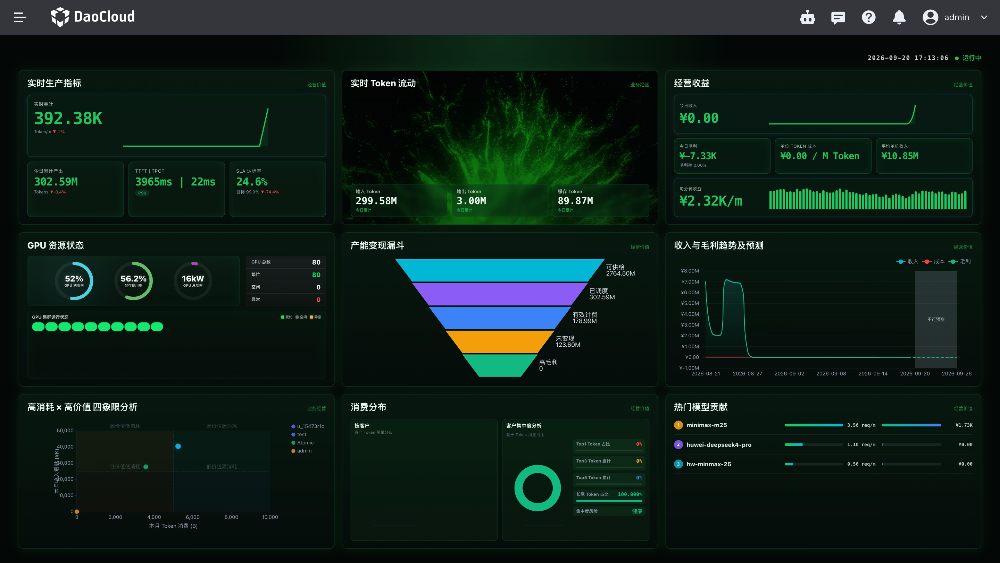

---
hide:
  - toc
---

# 什么是驾驶舱

驾驶舱是 Token 工厂控制台中的运营可视化入口，把算力产能、Token 产出、收入成本与生产健康汇聚到一屏，帮助你掌握平台经营与运行状态。

进入驾驶舱后，默认打开 [经营概览面板](../user-guide/singlepage.md)。

## 如何进入

1. 登录 Token 工厂控制台。
2. 在产品导航中打开 **驾驶舱**。
3. 默认进入 **经营概览**；也可从产品子菜单切换其他已启用的页面。

## 能做什么

- **经营复盘（运营模式）**：查看收入、成本、毛利、产能变现与客户消费结构。
- **组织治理（企业模式）**：查看部门配额消耗、组织使用分布与用量趋势。

## 运营模式与企业模式的差异

根据部署模式，经营概览面板上的指标会有所不同：

| 模式 | 适用场景 | 页面上你会看到 |
| --- | --- | --- |
| **运营模式** | 对外 MaaS 运营 | 经营收益、产能变现漏斗、客户消费分布、SLA 等 |
| **企业模式** | 企业内部 AI 运营 | 本期经营概览、部门配额、组织使用分布等 |

## 相关文档

- [经营概览面板](../user-guide/singlepage.md)
- [驾驶舱 Release Notes](./release-notes.md)
- [费用中心](../../leopard/index.md)：账单、充值与计费相关操作请前往费用中心
