# 常见问题

本页汇总 DaoCloud 各产品模块的常见问题与故障排查方案，点击问题条目即可展开查看详细处理步骤。

## 安装

更多问题请参阅 [安装排障](../install/faq.md)。

### UI 访问问题

??? "安装结束后打不开 DCE 界面，可执行 diag.sh 脚本快速排障"

    安装器自 [v0.12.0 版本](../install/release-notes.md#v0120)之后新增了 diag.sh 脚本，方便用户在 UI 界面打不开时快速排障。

    执行命令：

    ```bash
    ./offline/diag.sh
    ```

    执行结果示例：

    

??? "安装使用 Metallb 时因 VIP 访问不通导致 DCE 登录界面无法打开"

    1. 排查 VIP 的地址是否和主机在同一个网段，Metallb L2 模式下需要确保在同一个网段
    2. 如果是在全局服务集群中的控制节点新增了网卡导致访问不通，需要手动配置 L2Advertisement。

        请参考 [Metallb 这个问题的文档](https://metallb.universe.tf/configuration/_advanced_l2_configuration/#specify-network-interfaces-that-lb-ip-can-be-announced-from)。

### 火种节点问题

??? "火种节点关机重启后，kind 集群无法正常重启"

    火种节点关机重启后，由于部署时在 openEuler 22.03 LTS SP2 操作系统上未设置 kind 集群开机自启动，会导致 kind 集群无法正常开启。

    需要执行如下命令开启：

    ```bash
    podman restart $(podman ps | grep installer-control-plane | awk '{print $1}')
    ```

    !!! note

        如果其他环境中发生了上述场景，也可以执行该命令进行重启。

??? "Ubuntu 20.04 作为火种机器部署时缺失 ip6tables"

    Ubuntu 20.04 作为火种机器部署，由于缺失 ip6tables 会导致部署过程中报错。

    请参阅 [Podman 已知问题](https://github.com/containers/podman/issues/3655)。

    临时解决方案：手动安装 iptables，参考
    [Install and Use iptables on Ubuntu 22.04](https://orcacore.com/install-use-iptables-ubuntu-22-04/)。

??? "安装时禁用 IPv6 后，火种节点 Podman 无法创建容器"

    报错信息如下：

    ```text
    ERROR: failed to create cluster: command "podman run --name kind-control-plane...
    ```

    解决方案：重新启用 IPv6 或者更新火种节点底座为 Docker。

    参阅 Podman 相关 Issue：
    [podman 4.0 hangs indefinitely if ipv6 is disabled on system](https://github.com/containers/podman/issues/13388)

??? "火种节点 kind 容器重启后，kubelet 服务无法启动"

    kind 容器重启后，kubelet 服务无法启动，并报以下错误：

    ```text
    failed to initialize top level QOS containers: root container [kubelet kubepods] doesn't exist
    ```

    解决方案：

    - 方案 1：重启，执行命令 `podman restart [kind] --time 120`，执行过程中不能通过 Ctrl+C 中断该任务

    - 方案 2：运行 `podman exec` 进入 kind 容器，执行以下命令：

        ```bash
        for i in $(systemctl list-unit-files --no-legend --no-pager -l | grep --color=never -o .*.slice | grep kubepod);
        do systemctl stop $i;
        done
        ```

??? "如何卸载火种节点的数据"

    商业版部署后，如果进行卸载，除了本身的集群节点外，还需要对火种节点进行重置，重置步骤如下：

    需要使用 `sudo rm -rf` 命令删除这三个目录：

    - /tmp
    - /var/lib/dce5/
    - /home/kind/etcd

### 证书问题

??? "全局服务集群的 kubeconfig 在火种的副本需要更新"

    v0.20.0 之前的版本中，火种机上存储的全局服务集群的 kubeconfig 不会自动更新，v0.20.0 版本支持了自动更新，每个月执行一次。

    之前的版本需要将 dce5-installer 更新到 v0.20.0 然后执行：

    ```bash
    dce5-installer cluster-create -c clusterconfig.yaml -m mainfest.yaml --update-global-kubeconf
    ```

??? "火种节点的 kind 集群本身的证书更新以及 kubeconfig"

    v0.20.0 之前的版本中，火种机上存储的 kind 集群的 kubeconfig 不会自动更新，v0.20.0 版本支持了自动更新，每个月执行一次。

    之前的版本需要将 dce5-installer 更新到 v0.20.0 然后执行：

    ```bash
    dce5-installer cluster-create -c clusterconfig.yaml -m mainfest.yaml --update-kind-certs
    ```

??? "Contour 安装后，证书默认有效期仅一年，且不会自动 renew，过期后导致 contour-envoy 组件不断重启"

    v0.21.0 之前的版本，支持启用安装 Contour 组件，后续版本将不再支持，对于之前版本并且安装了 Contour 的客户，需要执行 helm upgrade 命令来更新证书有效期：

    ```bash
    helm upgrade  -n contour-system contour --reuse-values --set contour.contour.certgen.certificateLifetime=36500
    ```

### 操作系统相关问题

??? "在 CentOS 7.6 安装时报错"

    

    在安装全局服务集群的每个节点上执行 `modprobe br_netfilter`，将 `br_netfilter` 加载之后就好了。

??? "CentOS 环境准备问题"

    运行 `yum install docker` 时报错：

    ```text
    Failed to set locale, defaulting to C.UTF-8
    CentOS Linux 8 - AppStream                                                                    93  B/s |  38  B     00:00
    Error: Failed to download metadata for repo 'appstream': Cannot prepare internal mirrorlist: No URLs in mirrorlist
    ```

    可以尝试下述方法来解决：

    - 安装 `glibc-langpack-en`

        ```bash
        sudo yum install -y glibc-langpack-en
        ```

    - 如果问题依然存在，尝试：

        ```bash
        sed -i 's/mirrorlist/#mirrorlist/g' /etc/yum.repos.d/CentOS-*
        sed -i 's|#baseurl=http://mirror.centos.org|baseurl=http://vault.centos.org|g' /etc/yum.repos.d/CentOS-*
        sudo yum update -y
        ```

??? "osRepos 的 external 模式 externalRepoURLs 检查失败"

    clusterConfig.yaml 如下：

    ```yaml title="clusterConfig.yaml"
      osRepos:
        type: external
        externalRepoType: rocky
        externalRepoURLs:
          - http://10.5.14.100:8081/rocky/\$releasever/os/\$basearch
          - http://10.5.14.100:8081/rocky-iso/\$releasever/os/\$basearch/AppStream
          - http://10.5.14.100:8081/rocky-iso/\$releasever/os/\$basearch/BaseOS
    ```

    报错如下：

    ```text
    [root@localhost dce5]# ./dist/dce5-installer cluster-create -c ./sample/clusterConfig.yaml -m ./sample/manifest.yaml --max-tasks 2
    [Error]:[Error] invalid ClusterConfig: maybe the binaries.externalRepoURLs http://10.5.14.100:8081/rocky/$releasever/os/$basearch cannot be connected, return code: 404
    ```

    配置实际上是正确的，externalRepoURLs 可以正常使用，但是由于检测时，没有解析变量，导致 404

    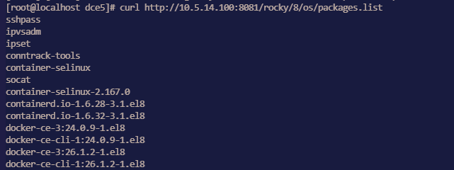

    **影响：**
    导致 osRepos 使用 external 模式的集群无法被正常创建。

    **绕过方法：**
    使用新的二进制文件重试。

??? "Manifest 开启 MySQL MGR 模式无效"

    **问题：**

    dce5-installer 自 v0.30 无法通过 Manifest 开启 MGR mysql。
    其他参数如 pvcSize 等也不生效，只有 enable 参数才能生效。

    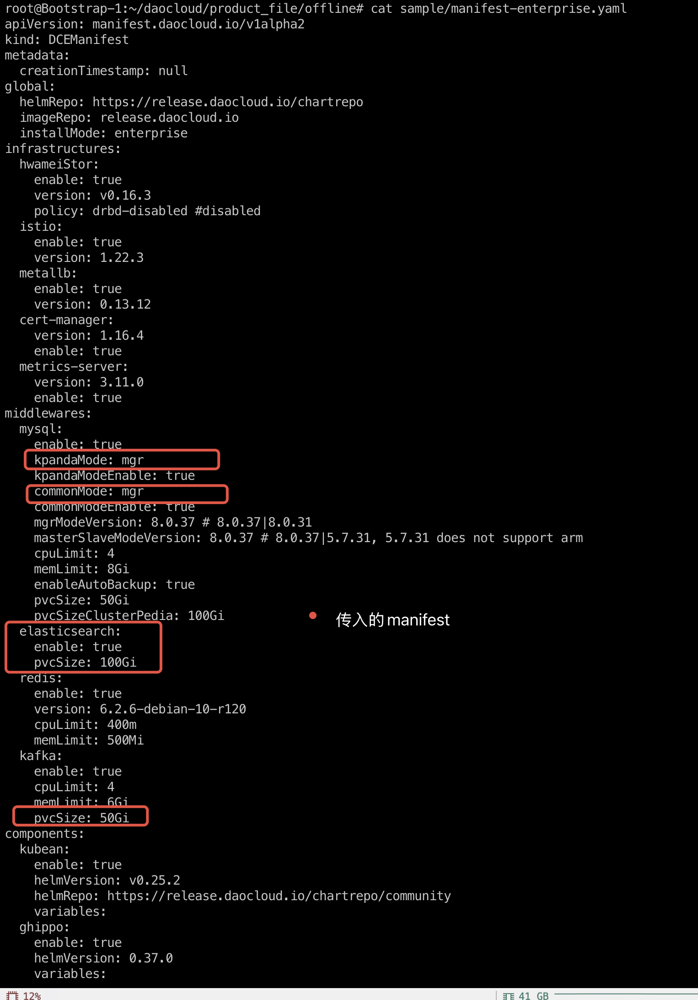

    **解决办法：**

    1. 执行安装器命令 `--dry-run` 参数输出执行脚本到 installer.sh

        ```shell
        ./dce5-installer cluster-create -c clusterConfig.yml -m manifest-enterprise.yaml -z --dry-run > installer.sh
        ```

    1. 在 installer.sh 脚本文件开头加一行：

        ```shell title="installer.sh"
        ManifestFile=/root/data/manifest-enterprise.yaml
        ```

    1. 增加 -s 参数，重新执行 installer.sh

        ```shell
        ./dce5-installer cluster-create -c clusterConfig.yml -m manifest-enterprise.yaml -z -s installer.sh
        ```

??? "MGR 模式 MySQL Common 实例初始化失败导致 DCE 安装失败"

    在安装过程中，`mcamel-common` 实例的 MySQL 初始化阶段失败。
    通过观察发现，`mysqlrouter` 用户在 MySQL 中丢失，导致 `router` 的 Deployment
    副本数 (`replica`) 一直为 `0`，从而导致整个安装过程无法继续。

    ```text
    mcamel-common 实例未能成功重建 mysqlrouter 用户
    → router deployment replica = 0
    → 安装卡住/失败
    ```

    - **影响模块：** 安装器的 MySQL 初始化流程
    - **影响范围：** 所有使用 MGR 模式的 `common` MySQL 实例
    - **影响版本：** v0.27.0、v0.28.0、v0.29.0 等
    - **现象总结：**

        - router 无法连接 MGR 集群
        - `mysqlrouter` 用户缺失
        - router deployment 无法启动（replica = 0）

    **故障原因分析**

    在一次异常操作（如断电重启或 PVC 清理）后，运维人员手动恢复了 MGR 集群，但
    Operator 未能感知集群状态的改变，因此未触发对应的调谐逻辑。

    由于 PVC 被清空，原有的 `mysqlrouter` 用户信息在 MySQL 数据库中丢失，导致
    router 无法认证连接到集群，进而安装不断 Crash。

    **数据验证**

    通过 MySQL 查询用户表，发现找不到 `mysqlrouter` 用户：

    ```mysql
    mysql> select user,host from mysql.user;
    +---------------------------+-----------+
    | user                      | host      |
    +---------------------------+-----------+
    | kpanda                    | %         |
    | mysql_innodb_cluster_1000 | %         |
    | mysql_innodb_cluster_1001 | %         |
    | mysql_innodb_cluster_1002 | %         |
    | mysqladmin                | %         |
    | root                      | %         |
    | localroot                 | localhost |
    | mysql.infoschema          | localhost |
    | mysql.session             | localhost |
    | mysql.sys                 | localhost |
    | mysqlhealthchecker        | localhost |
    | mysqlmetrics              | localhost |
    +---------------------------+-----------+
    12 rows in set (0.00 sec)
    ```

    **解决方案**

    1. 获取 `mysqlrouter` 的 Secret

        从 Kubernetes 集群中获取 Router 的用户名与密码：

        ```shell
        kubectl get secret mcamel-common-kpanda-mgr-router -n mcamel-system -oyaml
        ```

        示例输出：

        ```yaml
        apiVersion: v1
        data:
          routerPassword: aVVOZHEtWm9tb0gtamJYTGstS3E9VEotNnlqc1M=
          routerUsername: bXlzcWxyb3V0ZXI=
        kind: Secret
        metadata:
          name: mcamel-common-kpanda-mgr-router
          namespace: mcamel-system
        ```

        解码得到用户名和密码：

        ```console
        ➜ b64-d bXlzcWxyb3V0ZXI=
        mysqlrouter

        ➜ b64-d aVVOZHEtWm9tb0gtamJYTGstS3E9VEotNnlqc1M=
        iUNdq-ZomoH-jbXLk-Kq=TJ-6yjsS
        ```

    2. 手动在 MGR 集群中创建 `mysqlrouter` 用户

        登录已恢复正常的 MGR 集群，调用 `setupRouterAccount()` 函数重新创建 `mysqlrouter` 用户：

        ```mysql
        MySQL  localhost:33060+ ssl  JS > cluster.setupRouterAccount('mysqlrouter', {password: "iUNdq-ZomoH-jbXLk-Kq=TJ-6yjsS"})
        ```

        输出结果：

        ```text
        Creating user mysqlrouter@%.
        Account mysqlrouter@% was successfully created.
        ```

        验证 `mysqlrouter` 用户是否创建成功：

        ```mysql hl_lines="10"
        MySQL  localhost:33060+ ssl  SQL > select user,host from mysql.user;
        +---------------------------+-----------+
        | user                      | host      |
        +---------------------------+-----------+
        | kpanda                    | %         |
        | mysql_innodb_cluster_1000 | %         |
        | mysql_innodb_cluster_1001 | %         |
        | mysql_innodb_cluster_1002 | %         |
        | mysqladmin                | %         |
        | mysqlrouter               | %         |
        | root                      | %         |
        | localroot                 | localhost |
        | mysql.infoschema          | localhost |
        | mysql.session             | localhost |
        | mysql.sys                 | localhost |
        | mysqlhealthchecker        | localhost |
        | mysqlmetrics              | localhost |
        +---------------------------+-----------+
        13 rows in set (0.00 sec)
        ```

    3. 重新启动 `router` 的 deployment：

        ```shell
        kubectl scale deploy mcamel-common-kpanda-mgr-router --replicas=0 -n mcamel-system
        kubectl scale deploy mcamel-common-kpanda-mgr-router --replicas=2 -n mcamel-system
        ```

        验证恢复情况：

        ```shell
        kubectl get deploy | grep router

        mcamel-common-kpanda-mgr-router             2/2     2            2           2d2h
        mcamel-common-mgr-cluster-router            2/2     2            2           2d2h
        ```

        此时 `router` 正常运行，安装流程恢复正常。

### 社区版安装问题

??? "kind 集群重装 DCE 时 Redis 卡住"

    问题：Redis Pod 出现了 0/4 running 很久的情况，提示：`primary ClusterIP can not unset`

    1. 在 `mcamel-system` 命名空间下删除 rfs-mcamel-common-redis

        ```shell
        kubectl delete svc rfs-mcamel-common-redis -n mcamel-system
        ```

    1. 然后重新执行安装命令

??? "社区版安装 fluent-bit 失败"

    报错：

    ```text
    DaemonSet is not ready: insight-system/insight-agent-fluent-bit. 0 out of 2 expected pods are ready
    ```

    排查 Pod 日志是否出现下述关键信息：

    ```text
    [warn] [net] getaddrinfo(host='mcamel-common-es-cluster-masters-es-http.mcamel-system.svc.cluster.local',errt11):Could not contact DNS servers
    ```

    出现上述问题是一个 fluent-bit 的 bug，可以参考 aws/aws-for-fluent-bit 的一个 Issue：
    [Seeing `Timeout while contacting DNS servers` with latest v2.19.1](https://github.com/aws/aws-for-fluent-bit/issues/233)

## 应用工作台

更多问题请参阅 [应用工作台](../amamba/intro/index.md)。

### 流水线相关问题

??? "执行流水线时报错"

    当 Jenkins 所在集群与应用部署集群跨数据中心时，网络通信延迟会变高，可能遇到如下的报错信息：

    ```console
    E0113 01:47:27.690555 50 request.go:1058] Unexpected error when reading response body: net/http: request canceled (Client.Timeout or context cancellation while reading body)
    error: unexpected error when reading response body. Please retry. Original error: net/http: request canceled (Client.Timeout or context cancellation while reading body)
    ```

    __解决方案__ ：

    在该流水线的 Jenkinsfile 中将部署命令由 `kubectl apply -f` 修改为 `kubectl apply -f . --request-timeout=30m`。

??? "如何更新内置 Label 的 podTemplate 镜像？"

    应用工作台通过 podTemplate 能力声明了 7 个 label： __base__ 、 __maven__ 、 __mavenjdk11__ 、 __go__ 、 __go16__ 、 __node.js__ 和 __python__ 。
    您可以指定具体的 Agent 标签来使用对应的 podTemplate。

    如果内置 podTemplate 中的镜像不满足您的需求，可以通过以下方式替换容器镜像或者添加容器镜像。

    1. 点击左上角的 **≡** 打开导航栏，前往容器管理模块，找到 Jenkins 组件所在的集群，点击集群名称。

        

    2. 在左侧导航栏依次点击 __配置与密钥__ -> __配置项__ 。

    3. 命名空间选择 __amamba-system__ ，通过名称 __global-jenkins-casc-config__ 进行搜索，在操作列点击 __编辑 YAML__ 。

        

    4. 在 __data__ -> __jenkins.yaml__ -> __jenkins.clouds.kubernetes.templates__ 字段下选择需要更改的 podTemplate 的镜像。

        

    5. 更新完成后，前往 __工作负载__ 重启 Jenkins。

??? "流水线构建环境为 maven 时，如何在 settings.xml 中修改依赖包来源？"

    当流水线构建环境为 maven 时，大多数客户需要修改 __settings.xml__ 以更换依赖源。可参考以下步骤：

    1. 点击左上角的 **≡** 打开导航栏，前往容器管理模块，在 __集群列表__ 界面选择 Jenkins 组件所在的集群，点击集群名称。

        

    2. 在左侧导航栏依次点击 __配置与密钥__ -> __配置项__ 。

    3. 搜索 __amamba-devops-agent__ ，在操作列点击 __编辑 YAML__ 。

        

    4. 在 __data__ 模块 下的 __MavenSetting__ 按需修改。

        

    5. 更新完成后，需要前往 __工作负载__ 重启 Jenkins。

??? "通过 Jenkins 构建镜像时，容器无法访问私有镜像仓库"

    **集群运行时为 Podman**

    1. 点击左上角的 **≡** 打开导航栏，前往容器管理模块，在 __集群列表__ 界面找到 Jenkins 组件所在的集群，点击集群名称。

    2. 在左侧导航栏依次点击 __配置与密钥__ -> __配置项__ 。

    3. 搜索 __insecure-registries__ ，在操作列点击 __编辑 YAML__ 。

    4. 在 __data__ 模块下的 __registries.conf__ 下配置。

        修改时注意格式缩进，并且每个 registry 需要一个单独的 __[[registry]]__ 部分，如下图所示：

        

        !!! note

            __registries__ 关键字的值应该是完整的镜像仓库域名或 IP 地址，无需增加 __http__ 或 __https__ 前缀。
            如果镜像仓库使用非标准端口号，可以在地址后面加上冒号 __:__ 和端口号。

            ```config
            [[registry]]
            location = "registry.example.com:5000"
            insecure = true

            [[registry]]
            location = "192.168.1.100:8080"
            insecure = true
            ```

        另请参考 [Podman 官网指导文档](https://podman-desktop.io/docs/containers/registries/insecure-registry)。

    **集群运行时为 Docker**

    1. 打开 Docker 的配置文件。在大多数 Linux 发行版上，配置文件位于 __/etc/docker/daemon.json__ ，如果不存在，请创建此配置文件。

    2. 在 __insecure-registries__ 的字段将仓库地址添加进去。

        ```json
        {
          "insecure-registries": ["10.16.10.120:4443"]
        }
        ```

    3. 保存后重启 Docker，执行如下命令：

        ```bash
        sudo systemctl daemon-reload
        sudo systemctl restart docker
        ```

    !!! note

        参考 [Docker 官方指导文档](https://docs.docker.com/engine/reference/commandline/dockerd/#configuration-reload-behavior)。

??? "如何修改 Jenkins 流水线并发执行数量"

    目前产品部署出来后 Jenkins 流水线并发执行数量为 2，下述将描述如何更改并发执行数量：

    1. 点击左上角的 **≡** 打开导航栏，前往容器管理模块，找到 Jenkins 组件所在的集群，点击集群名称。

    2. 在左侧导航栏依次点击 __配置与密钥__ -> __配置项__ 。

    3. 命名空间选择 __amamba-system__ ，通过名称 __global-jenkins-casc-config__ 进行搜索，在操作列点击 __编辑 YAML__ 。

    4. 在 __data__ -> __jenkins.yaml__ -> __jenkins.clouds.kubernetes.containerCapStr__ 字段下修改数值。

        

    5. 更新完成后，前往 __工作负载__ 重启 Jenkins。

??? "流水线运行状态更新不及时怎么办？"

    在 Jenkins 的 Pod 中，会存在一个名为 `event-proxy` 的 Sidecar 容器，通过此容器将 Jenkins 的事件发送到工作台中。
    目前通过 dce5-installer 安装的 Jenkins 会默认开启此容器。当然，
    你也可以选择在容器管理的 Addon 模块中自己创建 Jenkins（这通常用于 Jenkins 部署在工作集群），在创建时也可以选择是否开启此容器。

    下面基于此容器是否开启，请分别检查不同的配置项是否正确：

    **开启了 event-proxy 容器**

    1. 点击左上角的 **≡** 打开导航栏，前往容器管理模块，找到 Jenkins 组件所在的集群，点击集群名称。

    2. 在左侧导航栏依次点击 __配置与密钥__ -> __配置项__ 。

    3. 搜索 __jenkins-casc-config__ ，在操作列点击 __编辑 YAML__ 。

    4. 在 __data__ -> __jenkins.yaml__ -> 搜索 `eventDispatcher.receiver`，它的值应该为 `http://localhost:9090/event`

        如果 Jenkins 是部署在工作集群（需要穿透 DCE 的网关），则还需要检查以下几个配置项。

    5. 再次查询名为 __event-proxy-config__ 的配置项，查看 YAML，配置项说明：

        ```yaml
        eventProxy:
          host: amamba-devops-server.amamba-system:80   # (1)!
          proto: http                                   # (2)!
        ```

        1. 此处为 DCE 的网关地址，如果为 dce5-installer 安装的 Jenkins，此处不需要修改
        2. 此处为 DCE 的网关协议（http 或者 https）

    6. 在 Jenkins 所在集群， __配置与密钥__ -> __配置项__ 中搜索密钥 __amamba-jenkins__ 。

    7. 检查密钥中的 __event-proxy-token__ 是否正确。此 Token 用于 DCE 的网关认证。
       如果不正确，Jenkins 将无法发送事件到工作台。有关如何生成此 Token，
       可以查看[访问密钥](../ghippo/user-guide/personal-center/accesstoken.md)。

    如果以上配置项都正确，但是 Jenkins 的流水线状态还是无法更新，请先查看 Jenkins 的 `event-proxy` 的容器日志。

    **未开启 event-proxy 容器**

    1. 点击左上角的 **≡** 打开导航栏，前往容器管理模块，找到 Jenkins 组件所在的集群，点击集群名称。

    2. 在左侧导航栏依次点击 __配置与密钥__ -> __配置项__ 。

    3. 命名空间选择 __amamba-system__ ，通过名称 __global-jenkins-casc-config__ 进行搜索，在操作列点击 __编辑 YAML__ 。

    4. 在 __data__ -> __jenkins.yaml__ -> 搜索 `eventDispatcher.receiver`，它的值应该为
       `http://amamba-devops-server.amamba-system:80/apis/internel.amamba.io/devops/pipeline/v1alpha1/webhooks/jenkins`。
       其中 `amamba-system` 为工作台所部署的命名空间。

### GitOps 相关问题

??? "在 GitOps 模块下添加 GitHub 仓库时报错"

    由于 GitHub 移除了对 username/password 的支持，所以通过 HTTP 方式导入 __GitHub__ 仓库时会导入失败，可能出现如下报错信息：

    ```console
    remote: Support for password authentication was removed on August 13, 2021.
    remote: Please see https://docs.github.com/en/get-started/getting-started-with-git/about-remote-repositories#cloning-with-https-urls for information on currently recommended modes of authentication.
    fatal: Authentication failed for 'https://github.com/DaoCloud/dce-installer.git/'
    ```

    __解决方案__ ：

    使用 SSH 方式导入 __GitHub__ 仓库。

??? "在某个工作空间下在 GitOps 模块中添加仓库时提示仓库已经存在"

    目前一个仓库绑定只能到一个工作空间，不能绑定到不同工作空间。如果一个仓库已经绑定到了 A 工作空间，此时尝试在 B 工作空间下将其添加到 GitOps 中就会提示仓库已经存在。

    __解决方案__ ：

    先将该仓库与其当前绑定的工作空间解绑，然后再重新将其添加到目标的工作空间。

### 工具链相关问题

??? "当流水线运行代理为 Maven 且使用集成的 SonarQube Java 代码语言扫描时报错"

    大部分情况下报错是由于流水线提供的 Java 环境为 Java 11，与 SonarQube 依赖的
    Java 版本不匹配造成的，建议使用 Helm 模板中提供的 SonarQube 部署。

??? "部署 GitLab 时有哪些注意事项"

    在 Helm 模板中支持了 GitLab 的部署，部署过程中需要关注以下注意事项：

    - 目前仅支持 POC 使用，不具备生产运维条件
    - 集群需要预留 80G 存储 空间
    - 在线部署由于走加速站，短时间内存在不稳定性

## 容器管理

更多问题请参阅 [容器管理常见问题](../kpanda/intro/faq.md)。

??? "容器管理和全局管理模块的权限问题"

    - 容器管理模块的权限分为集群权限、命名空间权限。如果绑定了用户，那该用户就可以查看到相对应的集群及资源。具体权限说明，可以参考[集群权限说明](../kpanda/user-guide/permissions/permission-brief.md)。

        

    - 全局管理模块中用户的授权：使用 admin 账号，进入 __全局管理__ -> __用户与访问控制__ -> __用户__ 菜单，找到对应用户。在 __授权所属用户组__ 标签页，如果有类似 Admin、Kpanda Owner 等拥有容器管理权限的角色，那即使在容器管理没有绑定集群权限或命名空间权限，也可以看到全部的集群，可以参考[用户授权文档说明](../ghippo/user-guide/access-control/user.md)

        

    - 全局管理模块中工作空间的绑定：使用账号进入 __全局管理__ -> __工作空间与层级__ ，可以看到自己的被授权的工作空间，点击工作空间名称

        1. 如果该工作空间单独授权给自己，就可以在授权标签页内看到自己的账号，然后查看资源组或共享资源标签页，如果资源组绑定了命名空间或共享资源绑定了集群，那该账号就可以看到对应的集群

        1. 如果是被授予了全局管理相关角色，那就无法授权标签页内看到自己的账号，也无法在容器管理模块中看到工作空间所绑定的集群资源

        

### Helm 安装

??? "Helm 应用安装失败，提示 “OOMKilled”"

    

    如图所示，容器管理会自动创建启动一个 Job 负责具体应用的安装工作，在 v0.6.0 版本中由于 job resources 设置不合理，导致 OOM，
    影响应用安装。该 bug 在 0.6.1 版本中已经被修复。如果是升级到 v0.6.1的环境，仅仅会在新创建、接入的集群中生效，
    已经存在的集群需要进行手动调整，方能生效。

    ??? note "点击查看如何调整脚本"

        - 以下脚本均在全局服务集群中执行
        - 找到对应集群，本文以 skoala-dev 为例,获取对应的 skoala-dev-setting configmap
        - 更新 configmap 之后即可生效

            ```shell
            kubectl get cm -n kpanda-system skoala-dev-setting -o yaml
            apiVersion: v1
            data:
            clusterSetting: '{"plugins":[{"name":1,"intelligent_detection":true},{"name":2,"enabled":true,"intelligent_detection":true},{"name":3},{"name":6,"intelligent_detection":true},{"name":7,"intelligent_detection":true},{"name":8,"intelligent_detection":true},{"name":9,"intelligent_detection":true}],"network":[{"name":4,"enabled":true,"intelligent_detection":true},{"name":5,"intelligent_detection":true},{"name":10},{"name":11}],"addon_setting":{"helm_operation_history_limit":100,"helm_repo_refresh_interval":600,"helm_operation_base_image":"release-ci.daocloud.io/kpanda/kpanda-shell:v0.0.6","helm_operation_job_template_resources":{"limits":{"cpu":"50m","memory":"120Mi"},"requests":{"cpu":"50m","memory":"120Mi"}}},"clusterlcm_setting":{"enable_deletion_protection":true},"etcd_backup_restore_setting":{"base_image":"release.daocloud.io/kpanda/etcdbrctl:v0.22.0"}}'
            kind: ConfigMap
                metadata:
                labels:
                    kpanda.io/cluster-plugins: ""
                name: skoala-dev-setting
                namespace: kpanda-system
                ownerReferences:
                - apiVersion: cluster.kpanda.io/v1alpha1
                    blockOwnerDeletion: true
                    controller: true
                    kind: Cluster
                    name: skoala-dev
                    uid: f916e461-8b6d-47e4-906e-5e807bfe63d4
                uid: 8a25dfa9-ef32-46b4-bc36-b37b775a9632
            ```

            修改 clusterSetting -> helm_operation_job_template_resources 到合适的值即可，
            v0.6.1 版本对应的值为 cpu: 100m,memory: 400Mi

??? "Helm 安装应用时，无法拉取 kpanda-shell 镜像"

    使用离线安装后，接入的集群安装helm应用经常会遇到拉取 kpanda-shell 镜像失败，如图：

    

    此时，只需要去集群运维-集群设置页面，高级配置标签页，修改 Helm 操作基础镜像为一个可以被该集群正常拉取到的 kpanda-shell 的镜像即可。

    

??? "Helm Chart 界面未显示最新上传到 Helm Repo 的 Chart"

    

    此时，只需要去 Helm 仓库刷新对应的 Helm 仓库即可。

    

??? "Helm 安装应用失败时卡在安装中无法删除应用重新安装"

    

    此时，只需要去自定义资源页面，找到 helmreleases.helm.kpanda.io CRD，然后找到对应的 helmreleases CR 删除即可。

    

    

??? "工作负载 -> 删除节点亲和性等调度策略后，调度异常"

    在通过 **工作负载** ，删除节点亲和性等调度策略后，调度异常

    

    此时，可能是因为策略没有删除干净，点击编辑，删除所有策略。

    

    

    

### 应用备份

??? "Kcoral 应用备份检测工作集群 Velero 状态的逻辑是什么"

    

    - 工作集群在velero命名空间下安装了标准的velero组件
    - velero 控制面 velero deployment 处于运行状态，并达到期望的副本数
    - velero 数据面 node agent 处于运行状态，并达到期望副本数
    - velero 成功连接到目标 MinIO（BSL 状态为 Available）

??? "在跨集群备份还原时，Kcoral 如何获取可用集群"

    在通过 Kcoral 跨集群备份还原应用的时候，在恢复页面中，Kcoral 会帮助用户筛选可以执行跨集群还原的集群列表，逻辑如下：

    

    - 过滤未安装 Velero 的集群列表
    - 过滤 Velero 状态异常的集群列表
    - 获取与目标集群对接了相同 MinIO 和 Bucket 的集群列表并返回

    所以只要对接了相同的 MinIO 和 Bucket，Velero 处于运行状态，就可以跨集群备份（需要有写入权限）和还原。

??? "Kcoral 备份了相同标签的 Pod 和 Deployment，但还原备份后出现 2 个 Pod"

    出现这种现象的原因是：还原时，由于修改了 Pod 标签，导致其标签与其备份时的父资源 ReplicaSet / Deployment 标签不匹配，故还原时出现2倍数量 Pod。

    为了避免出现以上这种情况，尽量避免修改关联资源中的某一资源的标签。

??? "卸载 VPA、HPA、CronHPA 之后，为什么对应弹性伸缩记录依然存在"

    虽然通过 Helm Addon 市场中把对应组件卸载，但是应用弹性伸缩界面相关记依然在，如下图所示:

    

    这是 helm uninstall 的一个问题，它并不会卸载对应的 CRD，因此导致数据残留，此时我们需要手动卸载对应的 CRD , 完成最终清理工作。

??? "为什么低版本集群的控制台打开异常"

    在 kubernetes 低版本（v1.18以下）的集群中，打开控制台出现 CSR 资源请求失败。打开控制台的时候，
    会根据当前登录用户在目标集群中通过 CSR 资源申请证书，如果集群版本太低或者没有开启此功能 Controller，
    会导致证书申请失败，从而无法连接到目标集群。

    申请证书流程请参考 [Kubernetes 官网文档](https://kubernetes.io/docs/reference/access-authn-authz/certificate-signing-requests/)。

    **解决办法：**

    - 如果集群版本大于 v1.18，请检查 kube-controller-manager 是否开启 csr 功能，确保以下的 controller 是否正常开启

        ```shell
        ttl-after-finished,bootstrapsigner,csrapproving,csrcleaner,csrsigning
        ```

    - 低版本集群目前解决方案只有升级版本

### 创建和接入集群

??? "如何重置创建的集群"

    创建的集群分为两种情况：

    - 创建失败的集群：在创建集群的过程中，因为参数设置错误导致集群创建失败，这种情况可以在安装失败的集群选择重试，然后重新设置参数重新创建。
    - 已经成功创建的集群：这种集群可以先卸载集群，然后重新创建集群。卸载集群需要关闭集群保护的功能才能卸载集群。

    

    

??? "接入集群安装插件失败"

    离线环境接入的集群，在安装插件之前，需要先配置 CRI 代理仓库，以忽略 TLS 验证（所有节点都需要执行）。

    === "Docker"

        1. 修改文件 `/etc/docker/daemon.json`

        2. 加入 "insecure-registries": ["172.30.120.243","temp-registry.daocloud.io"],

            修改之后内容如下：

            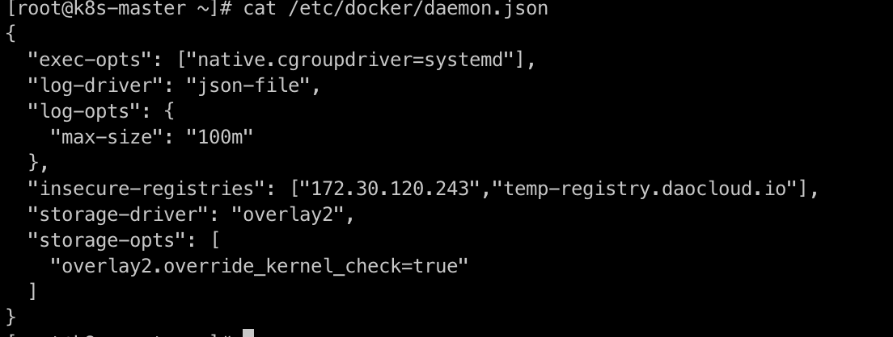

        3. 重启 docker

            ```shell
            systemctl restart docker
            systemctl daemon-reload
            ```

    === "containerd"

        1. 修改 `/etc/containerd/config.toml`

        2. 修改之后内容如下：

            ```shell
            [plugins."io.containerd.grpc.v1.cri".registry.mirrors."docker.io"]
            endpoint = ["https://registry-1.docker.io"]
            [plugins."io.containerd.grpc.v1.cri".registry.mirrors."temp-registry.daocloud.io"]
            endpoint = ["http://temp-registry.daocloud.io"]
            [plugins."io.containerd.grpc.v1.cri".registry.configs."http://temp-registry.daocloud.io".tls]
            insecure_skip_verify = true
            ```

            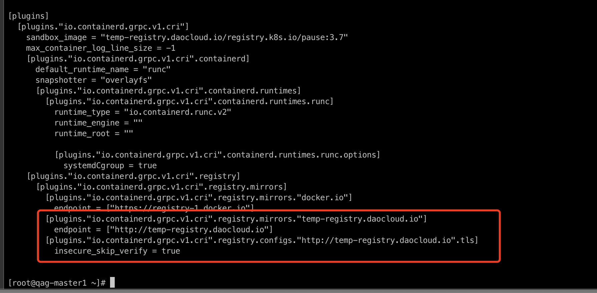

        3. 注意空格和换行符，确保配置正确，修改完成之后执行

            ```shell
            systemctl restart containerd
            ```

??? "创建集群时在高级设置中启用 **为新建集群内核调优** ，集群创建为什么会失败"

    1. 检查内核模块 conntrack 是否加载，执行如下命令：

        ```shell
        lsmod |grep conntrack
        ```

    2. 如果返回为空，表示没有加载。重新加载，执行如下命令：

        ```shell
        modprobe ip_conntrack
        ```

    !!! note

        如果内核模块进行了升级操作，也会导致集群创建失败。

??? "集群解除接入后，`kpanda-system` 命名空间一直处于 Terminating 状态"

    请检查 APIServices 服务状态是否正常，查看命令如下。如果当前状态为 false，请尝试修复 APIServices 或删除该服务。

    ```shell
    kubectl get apiservices
    ```

## 多云编排

更多问题请参阅 [常见问题](../kairship/intro/faq.md)。

??? "多云编排的内核是 Karmada，目前支持的 Karmada 版本是多少？能否指定版本？是否可以升级？"

    当前默认版本 v1.9.6，支持用户自主升级。

??? "多云编排时单集群应用如何无缝迁移到多云编排？"

    可以使用我们的新功能[一键升级为多云工作负载](../kairship/workload/promote.md)。

??? "多云编排是否支持跨集群的应用日志收集？"

    暂不支持，之后会增加该功能。

??? "多云编排分发到多个集群的工作负载，是否可以在一个视图呈现监控信息？"

    支持在统一的 UI 上增删改查[多云工作负载](../kairship/workload/deployment.md)，了解这些负载被部署到了什么集群，对应的 Service、部署策略等等。

??? "多云编排工作负载是否可以跨集群通信？"

    支持，参阅[多云网络互联](../mspider/user-guide/multicluster/cluster-interconnect.md)。

??? "多云编排 Service 能否实现跨集群服务发现？"

    支持，参阅[多云网络互联](../mspider/user-guide/multicluster/cluster-interconnect.md)。

??? "多云编排是否有生产级别支持？"

    目前还处于 TP (技术预览) 阶段，尚未达到生产级别的稳定性，很多内部组件高可用有待解决 (多云编排依赖的 etcd 等等)。

??? "多云编排如何做到故障转移？"

    多云编排原生支持故障转移的功能，在成员集群出现故障的时候，多云编排会进行智能的重调度，完成故障转移。
    可参阅[故障转移介绍](../kairship/failover/failover.md)。

??? "多集群的权限问题"

    紧密的结合 5.0 现有的[权限体系](../ghippo/user-guide/access-control/role.md)，与 workspace 打通，完成多云编排实例与 workspaces 的绑定，解决权限问题。

??? "多云编排如何查询多集群的事件？"

    多云编排完成了产品级别的整合，会展示所有多云编排实例级别的事件。

??? "通过多云编排创建一个多云应用之后，通过容器管理怎么能获取的相关资源信息？"

    多云编排 control-plane 本质是一个完整 kubernetes 控制面，只是没有任何承载 workload 的节点。
    因此多云编排在创建多云编排实例的时候，采用了一个取巧的动作，会把实例本身作为一个隐藏的 cluster 加入到容器管理中（不在容器管理中显示）。
    这样就可以完全借助容器管理的能力（搜集加速检索各个 K8s 集群的资源、CRD 等），当在界面中查询某个多云编排实例的资源
    （Deployment、PropagationPolicy、OverridePolicy 等）就可以直接通过容器管理进行检索，做到读写分离，加快响应时间。

??? "多云编排如何自定义 Karmada 镜像来源仓库地址？"

    多云编排采用开源的 __karmada-operator__ 进行多实例 LCM 管理；
    Operator 提供了丰富的自定义能力。支持在启动参数中自定义 Karmada 资源镜像的仓库地址。

    可以在容器启动命令中增加 __--chat-repo-url__ 参数进行指定

    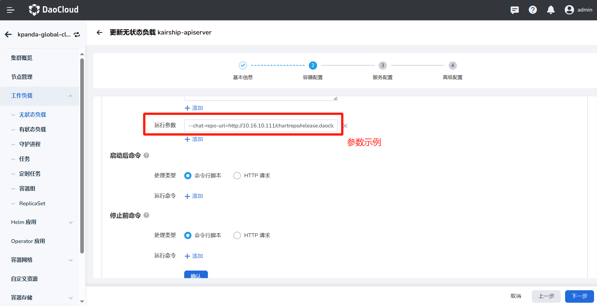

??? "如何连接多云集群？"

    可以在实例列表页面，点击右侧的 **...** ，在弹出菜单中选择 __控制台__ ，通过命令行连接多云控制平面。

??? "是否可以仅删除多云实例，但是不删除多云编排的组件？"

    可以，创建多云实例时，可以选择选择是否勾选实例释放功能。若勾选将同步删除对应的多云实例；
    如果不删除，则可以继续通过终端使用，但无法在多云编排内管理该多云实例，建议同步删除。

??? "多云实例内多个工作集群如何实现网络互通？"

    需要在 __服务网格__ 创建网格实例，并且纳管每个工作集群，
    具体操作可参考[多云网络互联](../mspider/user-guide/multicluster/cluster-interconnect.md)。

## 云原生网络

更多问题请参阅 [网络组件已知问题与内核兼容性](../network/intro/issues.md)。

### kube-proxy 问题

??? "IPVS 模式"

    访问服务有 1s 延迟或者请求失败问题

    - 现象：

        1. 通过 Service 访问服务有 1s 延迟
        2. 滚动更新业务，有部分请求失败

    - 影响：

        | k8s 版本 | kube-proxy 行为 | 现象 |
        | ------ | -------------- | -------- |
        | <=1.17 | net.ipv4.vs.conn_reuse_mode=0 | RealServer 无法被移除，当滚动更新业务，有部分请求失败。|
        | >=1.19 | net.ipv4.vs.conn_reuse_mode=0 (kernel > 4.1)<br />net.ipv4.vs.conn_reuse_mode=1 (kernel < 4.1) | CentOS 7.6-7.9，默认内核版本低于 4.1，存在通过 Service 访问服务有 1s 延迟问题。<br />CentOS 8 默认内核 4.16 高于 4.1，存在 RealServer 无法被移除，当滚动更新业务，有部分请求失败。|
        | >=1.22 | 不修改 net.ipv4.vs.conn_reuse_mode 值（kernel > 5.6）<br />net.ipv4.vs.conn_reuse_mode=0 (kernel > 4.1)<br />net.ipv4.vs.conn_reuse_mode=1 (kernel < 4.1)<br /> | CentOS 7.6-7.9，默认内核版本低于 4.1，存在通过 Service 访问服务有 1s 延迟问题。<br />CentOS 8 默认内核 4.16 高于 4.1，存在 RealServer 无法被移除，当滚动更新业务，有部分请求失败。 <br />Ubuntu 22.04 默认内核版本 5.15，高于 5.9 内核，不存在该问题。|

    - 建议：对于低于 5.9 内核的系统，不推荐使用 IPVS 模式。

    - 参考：[Kubernetes Issue #93297](https://github.com/kubernetes/kubernetes/issues/93297)

??? "iptables 模式"

    - 现象：源端口 nat 以后不够随机，导致 1s 延时

    - 影响：

        | 内核 | iptables 版本 | 现象 |
        | ------ | ------------- | ----- |
        | < 3.13 | 1.6.2 | 源端口 nat 以后不够随机，导致 1s 延时。|

    - 建议：参考系统发行版本，升级内核。

??? "externalIPs 在 `externalTrafficPolicy: Local` 下不工作"

    - 影响：1.26.0 <= 受影响版本 < 1.30.0

    - 建议：升级到 1.30.0

    - 参考：[Kubernetes PR #121919](https://github.com/kubernetes/kubernetes/pull/121919)

??? "Service 的 endpoint 更新时新 endpoint 的规则等到很久以后才生效"

    - 影响：1.27.0 <= 受影响版本 < 1.30.0

    - 建议：升级到 1.30.0

    - 参考：[Kubernetes PR #122204](https://github.com/kubernetes/kubernetes/pull/122204)

??? "nftables 模式下 LoadBalancerSourceRanges 无法正常工作"

    - 建议：升级到 1.30.0

    - 参考：[Kubernetes PR #122614](https://github.com/kubernetes/kubernetes/pull/122614)

??? "iptables nft 和 legacy 模式选择问题"

    - 影响：

        | 版本    | 行为 | 影响 |
        | ------- | --- | --- |
        | <v1.18  | 使用 iptables-legacy | kube-proxy 可能不会工作 |
        | >=v1.18 | 自动计算，更优先选择 nft | |

    - 参考：[kubernetes-sigs/iptables-wrappers](https://github.com/kubernetes-sigs/iptables-wrappers/tree/master)

### Calico 问题

??? "offload VXLAN 导致访问延迟"

    - 影响：

    | Calico 版本 | 行为 | 影响 |
    | ---------- | ---- | --- |
    | <v3.20 | 不处理 | 内核 < 5.7，Pod 与 Service 之间延迟 63s。|
    | >=v3.20 | 可以通过 FelixConfiguration 配置，默认自动关闭 VXLAN offload。| 导致网卡性能低，只能跑到 1-2 Gbps/s。|
    | >= 3.28 | 在 5.7 内核自动打开 VXLAN offload， 解决之前的 ClusterIP 访问丢包问题，提高性能。| 内核 < 5.7，导致网卡性能低，只能跑到 1-2 Gbps/s。|

    - 建议：低版本 Calico 存在访问延迟问题时，可以通过 `ethtool --offload vxlan.calico rx off tx off` 规避。
      高版本 Calico 默认自动关闭 VXLAN offload，对于网络性能有要求的客户可以升级内核到 5.7 解决。

    - 参考：

    - [Calico Issue #3145](https://github.com/projectcalico/calico/issues/3145)
    - [Felix Pull Request #2811](https://github.com/projectcalico/felix/pull/2811)

??? "VXLAN 父设备改了但路由没更新"

    - 影响：

    | Calico 版本 | 行为 | 影响 |
    | ---------- | ---- | --- |
    | <v3.28.0    | 不处理 | 路由表未更新为使用新的父网卡，即使重新启动 felix 后，也无法清理旧的路由。 |
    | >=v3.28.0   | 当父设备发生更改时，VXLAN 管理器会重新创建路由表。 | 无 |

    - 建议：更新到 v3.28。

    - 参考：[Calico PR #8279](https://github.com/projectcalico/calico/pull/8279)

??? "集群 calico-kube-controllers 的缓存不同步，导致内存泄漏"

    - 建议：更新到 v3.26.0。

??? "IPIP 模式下 Pod 跨节点网络不通"

    - 影响：

    | Calico 版本 | 行为 | 影响 |
    | ----------- | --- | --- |
    | <v3.28.0    | 不处理 | 由于 `iptables --random-fully` 和 checksum 校验和计算不兼容，在内核 < 5.7，Pod 跨节点网络可能不通。 |
    | >=v3.28.0   | 默认禁用 checksum 计算 | 无 |

    - 建议：更新到 v3.28.0+，较低版本可以使用 `ethtool -K tunl0 tx off` 命令手动关闭。

    - 参考：[Calico PR #8031](https://github.com/projectcalico/calico/pull/8031)

??? "iptables nft 和 legacy 模式选择问题"

    - 影响：

        | Calico 版本 | 行为 | 影响 |
        | ----------- | --- | --- |
        | <v3.26.0    | 仅支持需要手动指定，自动计算存在一定逻辑问题。 | 由于 iptables 模式选择错误，可能会导致 Service 网络异常。 |
        | >=v3.26.0   | 自动计算。 | 无 |

    - 建议：更新到 v3.26.0+，较低版本需要手动指定 `FELIX_IPTABLESBACKEND` 变量，可选值 NFT 或者 LEGACY。

    - 参考：[Calico PR #7111](https://github.com/projectcalico/calico/pull/7111)

### Spiderpool v0.9 已知问题

??? "SpiderCoordinator 同步 status 时出错，但状态仍为 running"

    - 分析：如果获取集群的 CIDR 信息失败，我们应该将其状态更新为 NotReady，这会阻止 Pod 的正常创建。否则，Pod 将使用不正确的 CIDR 运行，将造成网络连通问题。

    - 参考： [Spiderpool PR #2929](https://github.com/spidernet-io/spiderpool/pull/2929)

??? "`Values.multus.multusCNI.uninstall` 设置后不生效，导致 multus 资源没有正确删除"

    - 分析：Values.multus.multusCNI.uninstall 设置为 true 后，卸载 Spiderpool 后，发现仍存在 multus 相关资源，它们并没有如预期的一样被删除。

    - 参考： [Spiderpool PR #2974](https://github.com/spidernet-io/spiderpool/pull/2974)

??? "缺失 kubeadm-config 时无法从 kubeControllerManager Pod 获取 serviceCIDR"

    - 分析：有些场景没有使用 kubeadm 创建集群，可能没有 kubeadm-config configMap，将会尝试从 kubeControllerManager 中获取，
      由于 bug 却无法从 kubeControllerManager Pod 获取 serviceCIDR，导致 SpiderCoordinator 的 status 更新失败。

    - 参考： [Spiderpool PR #3020](https://github.com/spidernet-io/spiderpool/pull/3020)

??? "从 v0.7.0 升级到 v0.9.0 时 SpiderCoordinator CRD 新增的 TxQueueLen 属性会导致 panic"

    - 分析：Spiderpool v0.9.0 为 SpiderCoordinator CRD 添加一个新属性 `TxQueueLen`，但在升级操作。没有默认值，将导致 panic。需使用它并将其视为默认值 0。

    - 参考：[Spiderpool PR #3118](https://github.com/spidernet-io/spiderpool/pull/3118)

??? "由于集群部署方式不同，导致 SpiderCoordinator 返回空的 serviceCIDR，从而无法创建 Pod"

    - 分析：由于集群部署方式的不同，集群 kube-controller-manager Pod 中记录 CIDR 的有两种类型：

        - `Spec.Containers[0].Command`
        - `Spec.Containers[0].Args`

        比如 RKE2 集群是 `Spec.Containers[0].Args` 而不是 `Spec.Containers[0].Command`，
        而在原本逻辑中 hardcode `Spec.Containers[0].Command`，导致判断异常，返回空 serviceCIDR，而无法创建 Pod。

    - 参考：[Spiderpool PR #3211](https://github.com/spidernet-io/spiderpool/pull/3211)

### Spiderpool v0.8 已知问题

??? "ifacer 无法使用 vlan 0 创建 bond"

    - 分析：使用 vlan 0 时，通过 ifacer 创建 bond 将失败。

    - 参考：[Spiderpool PR #2639](https://github.com/spidernet-io/spiderpool/pull/2639)

??? "禁用 multus 功能，仍创建了 multus CR 资源"

    - 现象：当安装时，禁用了 multus 功能，仍创建了 multus CR 资源，不符合预期。

    - 参考：[Spiderpool PR #2756](https://github.com/spidernet-io/spiderpool/pull/2756)

??? "SpiderCoordinator 无法检测 Pod 的 netns 中的网关连接"

    - 分析：当前 SpiderCoordinator 使用插件使用 errgroup 来并发检查网关可达性和 IP 冲突，提高检测速度。
      由于每个操作系统线程可以有不同的网络命名空间，并且 Go 的线程调度是高度可变的，因此调用者不能保证设置任何特定的命名空间，
      但是在 netns.Do 中启动 goroutine 时，Go 运行时无法保证代码一定会在指定的网络命名空间中执行，
      因此需要修改了 Go 的 errgroup 方法：在启动 goroutine 时手动切换到目标网络命名空间，执行完毕后返回原网络命名空间，从而保证能够检查网关可达性和 IP 冲突。

    - 参考：[Spiderpool PR #2738](https://github.com/spidernet-io/spiderpool/pull/2738)

??? "当 kubevirt 固定 IP 功能关闭时 spiderpool-agent Pod crash"

    - 分析：当将 kubevirt 固定 IP 功能关闭时，spiderpool-agent Pod 将 crash，无法运行，影响整体 IPAM 功能。

    - 参考：[Spiderpool PR #2971](https://github.com/spidernet-io/spiderpool/pull/2971)

??? "SpiderIPPool 资源未继承 SpiderSubnet 的 gateway 和 route 属性"

    - 分析：如果先创建 SpiderSubnet 资源，然后再创建对应子网的 SpiderIPPool 资源，则 SpiderIPPool 会继承 SpiderSubnet 的 gateway、routes。
      但是，如果您首先创建一个孤立的 SpiderIPPool，再创建对应的 SpiderSubnet 资源；那么 SpiderIPPool 资源将不会继承 SpiderSubnet 属性。

    - 参考：[Spiderpool PR #3011](https://github.com/spidernet-io/spiderpool/pull/3011)

### Spiderpool v0.7 已知问题

??? "StatefulSet 类型的 Pod 重启后获取 IP 分配时，提示 IP 冲突"

    - 分析：由于 StatefulSet Pod 重新启动，此时 GC scanAll 会释放之前的 IP 地址，因为系统认为 Pod UID 与 IPPool 记录的 IP 地址不同，从而提示冲突。

    - 参考：[Spiderpool PR #2538](https://github.com/spidernet-io/spiderpool/pull/2538)

??? "Spiderpool 无法识别某些第三方控制器，导致 StatefulSet 的 Pod 无法使用固定 IP"

    - 现象：Spiderpool 无法识别如 RedisCluster 等第三方控制器，被它们控制的 StatefulSet 的 Pod 无法使用固定 IP。

    - 分析：对于第三方控制器：RedisCluster -> StatefulSet -> Pod，如果 Spiderpool 为其设置 SpiderSubnet 自动池注释，Pod 将无法成功启动。

    - 参考：[Spiderpool PR #2370](https://github.com/spidernet-io/spiderpool/pull/2370)

??? "空的 `spidermultusconfig.spec`, 将导致 spiderpool-controller Pod crash"

    - 现象：使用空的 `spidermultusconfig.spec` 创建 CR，webhook 校验成功，但没有相关的
      network-attachment-definitions 生成，并且查看到 spiderpool-controller 出现了 panic。

    - 参考：[Spiderpool PR #2444](https://github.com/spidernet-io/spiderpool/pull/2444)

??? "Cilium 模式获取到错误的 overlayPodCIDR"

    - 现象：SpiderCoordinator auto 模式获取 `podCIDRType` 类型错误，更新 SpiderCoordinator status 状态不符合预期；创建 Pod 可能导致出现网络问题。

    - 参考：[Spiderpool PR #2434](https://github.com/spidernet-io/spiderpool/pull/2434)

??? "Pod 与 IP 数 1:1 的场景，出现 IPAM 分配阻塞，导致一些 Pod 无法运行，对分配 IP 性能产生影响"

    - 分析：IPPool 具有 1000 个 IP 地址，并创建具有 1000 个副本的 Deployment，在分配到一定数量的 IP 地址后，
      观察到分配性能下降明显，甚至无法继续分配 IP 地址，而一个 Pod 在没有 IP 地址的情况下无法正常启动。
      实际 IPPool 资源中已经记录了 Pod 并分配了其 IP，但 SpiderEndpoint 对应的 Pod 却不存在。

    - 参考：[Spiderpool PR #2518](https://github.com/spidernet-io/spiderpool/pull/2518)

??? "禁用 IP GC 功能，spiderpool-controller 组件将由于 readiness 健康检查失败而无法正确启动"

    - 参考：[Spiderpool PR #2532](https://github.com/spidernet-io/spiderpool/pull/2532)

??? "`IPPool.Spec.MultusName` 指定 namespace/multusName 时 namespace 解析错误导致找不到关联的 multusName"

    - 现象：`IPPool.Spec.MultusName` 指定了 namespace/multusName，但由于解析 namespace 错误，导致无法找到关联的 multusName，亲和失败。

    - 分析：指定了 Pod Annotation `v1.multus-cni.io/default-network: kube-system/ipvlan-eth0`，
      由于 Spiderpool 对 namespace 的错误解析，导致查询 network-attachment-definitions 时使用了错误的 namespace，
      导致找不到对应的 network-attachment-definitions，从而无法成功创建 Pod。

    - 参考：[Spiderpool PR #2514](https://github.com/spidernet-io/spiderpool/pull/2514)

## 云原生存储

更多问题请参阅 [HwameiStor 常见问题](../storage/hwameistor/faqs.md)。

??? "HwameiStor 调度器在 Kubernetes 平台中是如何工作的？"

    HwameiStor 的调度器是以 Pod 的形式部署在 HwameiStor 的命名空间。

    

    当应用（Deployment 或 StatefulSet ）被创建后，应用的 Pod 会被自动部署到已配置好具备 HwameiStor 本地存储能力的 Worker 节点上。

??? "HwameiStor 如何应对应用多副本工作负载的调度？与传统通用型共享存储有什么不同？"

    HwameiStor 建议使用有状态的 StatefulSet 用于多副本的工作负载。

    有状态应用 StatefulSet 会将复制的副本部署到同一 Worker 节点，但会为每一个 Pod 副本创建一个对应的 PV 数据卷。
    如果需要部署到不同节点分散工作负载，需要通过 `podAffinity` 手动配置。

    

    由于无状态应用 Deployment 不能共享 Block 数据卷，所以建议使用单副本。

    对于传统通用型共享存储：

    有状态应用 StatefulSet 会将复制的副本优先部署到其他节点以分散工作负载，但会为每一个 Pod 副本创建一个对应的 PV 数据卷。
    只有当副本数超过 Worker 节点数的时候会出现多个副本在同一个节点。

    无状态应用 Deployment 会将复制的副本优先部署到其他节点以分散工作负载，并且所有的 Pod 共享一个 PV 数据卷（目前仅支持 NFS）。
    只有当副本数超过 Worker 节点数的时候会出现多个副本在同一个节点。对于 block 存储，由于数据卷不能共享，所以建议使用单副本。

??? "如何运维一个 Kubernetes 节点上的数据卷?"

    HwameiStor 提供了数据卷驱逐和迁移功能。在移除或者重启一个 Kubernetes 节点的时候，
    可以将该节点上的 Pod 和数据卷自动迁移到其他可用节点上，并确保 Pod 持续运行并提供服务。

    **移除节点**

    为了确保 Pod 的持续运行，以及保证 HwameiStor 本地数据持续可用，在移除 Kubernetes 节点之前，
    需要将该节点上的 Pod 和本地数据卷迁移至其他可用节点。可以通过下列步骤进行操作：

    1. 排空节点

        ```bash
        kubectl drain NODE --ignore-daemonsets=true. --ignore-daemonsets=true
        ```

        该命令可以将节点上的 Pod 驱逐，并重新调度。同时，也会自动触发 HwameiStor 的数据卷驱逐行为。
        HwameiStor 会自动将该节点上的所有数据卷副本迁移到其他节点，并确保数据仍然可用。

    2. 检查迁移进度。

        ```bash
        kubectl get localstoragenode NODE -o yaml
        ```

        ```yaml
        apiVersion: hwameistor.io/v1alpha1
        kind: LocalStorageNode
        metadata:
          name: NODE
        spec:
          hostname: NODE
          storageIP: 10.6.113.22
          topogoly:
            region: default
            zone: default
        status:
          ...
          pools:
            LocalStorage_PoolHDD:
              class: HDD
              disks:
              - capacityBytes: 17175674880
                devPath: /dev/sdb
                state: InUse
                type: HDD
              freeCapacityBytes: 16101933056
              freeVolumeCount: 999
              name: LocalStorage_PoolHDD
              totalCapacityBytes: 17175674880
              totalVolumeCount: 1000
              type: REGULAR
              usedCapacityBytes: 1073741824
              usedVolumeCount: 1
              volumeCapacityBytesLimit: 17175674880
             volumes:  # (1)!
          state: Ready
        ```

        1. 确保 volumes 字段为空

        同时，HwameiStor 会自动重新调度被驱逐的 Pod，将它们调度到有效数据卷所在的节点上，并确保 Pod 正常运行。

    3. 从集群中移除节点

        ```bash
        kubectl delete nodes NODE
        ```

    **重启节点**

    重启节点通常需要很长的时间才能将节点恢复正常。在这期间，该节点上的所有 Pod 和本地数据都无法正常运行。
    这种情况对于一些应用（例如，数据库）来说，会产生巨大的代价，甚至不可接受。

    HwameiStor 可以立即将 Pod 调度到其他数据卷所在的可用节点，并持续运行。
    对于使用 HwameiStor 多副本数据卷的 Pod，这一过程会非常迅速，大概需要 10 秒
    （受 Kubernetes 的原生调度机制影响）；对于使用单副本数据卷的 Pod，
    这个过程所需时间依赖于数据卷迁移所需时间，受用户数据量大小影响。

    如果用户希望将数据卷保留在该节点上，在节点重启后仍然可以访问，可以在节点上添加下列标签，
    阻止系统迁移该节点上的数据卷。系统仍然会立即将 Pod 调度到其他有数据卷副本的节点上。

    1. 添加一个标签（可选）。

        如果在节点重新启动期间不需要迁移数据卷，你可以在排空（drain）节点之前将以下标签添加到该节点。

        ```bash
        kubectl label node NODE hwameistor.io/eviction=disable
        ```

    2. 排空节点。

        ```bash
        kubectl drain NODE --ignore-daemonsets=true. --ignore-daemonsets=true
        ```

        - 如果执行了第 1 步，待第 2 步成功后，用户即可重启节点。
        - 如果没有执行第 1 步，待第 2 步成功后，用户察看数据迁移是否完成（方法如同[移除节点](../storage/hwameistor/faqs.md#_1)的第 2 步）。
          待数据迁移完成后，即可重启节点。

        在前两步成功之后，用户可以重启节点，并等待节点系统恢复正常。

    3. 节点恢复至 Kubernetes 的正常状态。

        ```bash
        kubectl uncordon NODE
        ```

    **对于传统通用型共享存储**

    有状态应用 StatefulSet 会将复制的副本优先部署到其他节点以分散工作负载，但会为每一个 Pod 副本创建一个对应的 PV 数据卷。
    只有当副本数超过 Worker 节点数的时候会出现多个副本在同一个节点。

    无状态应用 Deployment 会将复制的副本优先部署到其他节点以分散工作负载，并且所有的 Pod 共享一个 PV 数据卷
    （目前仅支持 NFS）。只有当副本数超过 Worker 节点数的时候会出现多个副本在同一个节点。对于 block 存储，
    由于数据卷不能共享，所以建议使用单副本。

??? "LocalStorageNode 查看出现报错如何处理？"

    当查看 `LocalStorageNode` 出现如下报错：

    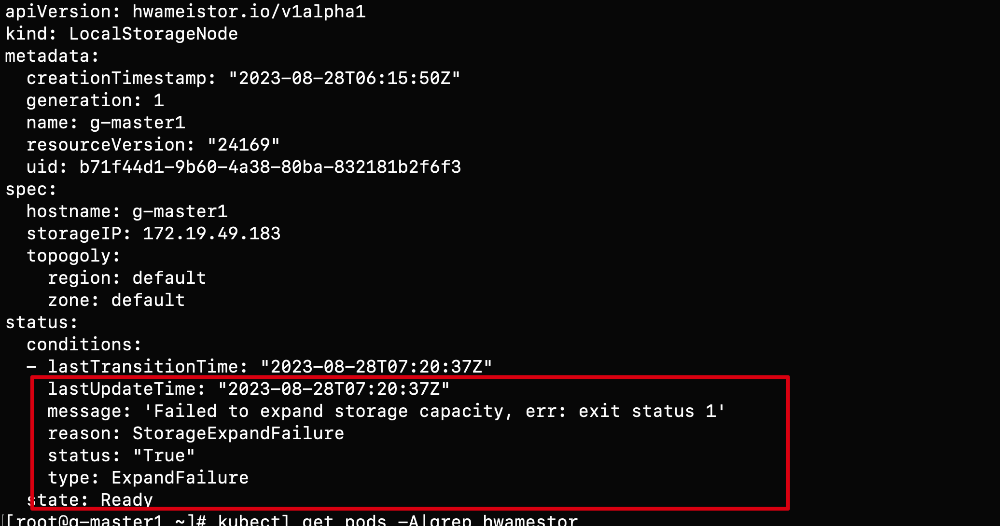

    可能的错误原因：

    1. 节点没有安装 LVM2，可通过如下命令进行安装：

        ```bash
        rpm -qa | grep lvm2  # (1)!
        yum install lvm2 # (2)!
        ```

        1. 确认 LVM2 是否安装
        2. 在每个节点上确认 LVM 已安装

    2. 确认节点上对应磁盘的 GPT 分区：

        ```bash
        blkid /dev/sd*  # (1)!
        wipefs -a /dev/sd* # (2)!
        ```

        1. 确认磁盘分区是否干净
        2. 磁盘清理

??? "使用 hwameistor-operator 安装后为什么没有自动创建 StorageClass"

    可能的原因：

    1. 节点没有可自动纳管的剩余裸盘，可通过如下命令进行检查：

        ```bash
        kubectl get ld # (1)!
        kubectl get lsn <node-name> -o yaml # (2)!
        ```

        1. 检查磁盘
        2. 检查磁盘是否被正常纳管

    2. HwameiStor 相关组件（不包含 drbd-adapter）没有正常工作，可通过如下命令进行检查：

        ```bash
        kubectl get pod -n hwameistor  # (1)!
        kubectl get hmcluster -o yaml  # (2)!
        ```

        1. 确认 Pod 是否运行正常
        2. 查看 health 字段

        !!! note

            drbd-adapter 组件只有在启用高可用时才生效，如果没有启用，可以忽略相关错误。

## 虚拟机

更多问题请参阅 [虚拟机常见问题](../virtnest/faq/index.md)。

??? "虚拟机页面 API 报错"

    虚拟机（virtnest）包含 apiserver 和 agent 两个部分，遇到问题时应从这两部分进行排查。

    **页面 API 报错**

    若页面请求 API 报错 500 或 cluster 资源不存在，
    首先应检查[全局服务集群](../kpanda/user-guide/clusters/cluster-role.md#_2)中虚拟机相关服务的日志，
    寻找是否 kpanda 的关键词。若存在，需确认 kpanda 相关服务是否运行正常。

??? "虚拟机创建成功但无法使用"

    若创建的 VM 无法正常使用，原因多样。以下是排查方向：

    **VM 创建失败**

    VM 创建失败时，应在目标集群中查看 VM 的详细信息：

    ```shell
    kubectl -n your-namespace describe vm your-vm
    ```

    如果详细信息涉及存储，如 PVC、PV、SC 等，请检查 SC 状态。
    问题未解决时，应[咨询开发人员](../install/index.md#_4)。

    如果详细信息涉及设备，如 KVM、GPU 等，请核实目标集群节点是否完成了[依赖条件](../virtnest/install/install-dependency.md)检查。
    若所有依赖已安装，应[咨询开发人员](../install/index.md#_4)。

    **案例 1**

    - 现象：在资源充足的情况下还是报错：

        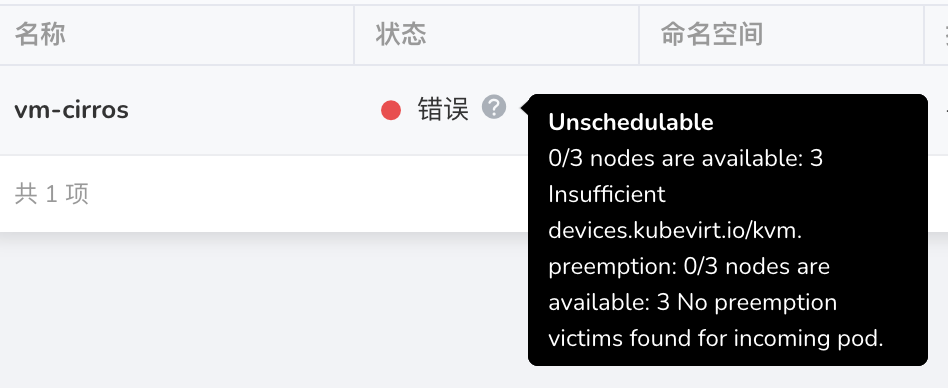

    - 解决办法：[给节点启用硬件虚拟化](../virtnest/install/install-dependency.md#_3)

    **案例 2**

    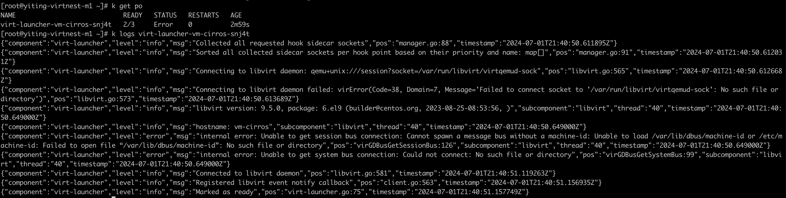

    解决办法：[升级节点操作系统内核](../virtnest/install/install-dependency.md)

    **案例 3**
    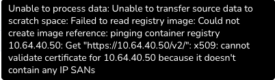

    解决办法：
    在 worker 集群中执行以下命令：

    ```bash
    kubectl patch cdi cdi \
      --type merge \
      --patch '{"spec":{"config":{"insecureRegistries":["your registry ip"]}}}'

    ```

    **VM 创建成功但无法使用**

    若 VM 创建成功但无法使用，应在 DCE 页面检查 VM 的 VNC 页面是否正常。
    若显示但仅限启动信息，请检查[依赖条件](../virtnest/install/install-dependency.md)。
    若依赖条件齐全，应[咨询开发人员](../install/index.md#_4)。

    若 VNC 页面显示异常，应使用以下命令查看 VM 详细信息：

    ```shell
    kubectl -n your-namespace describe vm your-vm
    ```

    当详细信息涉及存储信息，如 PVC、PV、SC 等，应检查 SC 状态。
    问题未解决时，应[咨询开发人员](../install/index.md#_4)。

    **VNC 可以启动但网络无法访问**

    按照下面流程进行排查，将相关信息记录下来，反馈给[开发人员](../install/index.md#_4)。
    在 VM 所在集群中执行以下操作：

    1. 获取 VM 的 Pod IP

        ```bash
        kubectl -n your-namespace get vmi your-vm -o wide
        ```

    2. 在节点上执行 ssh 登录你的 VM

        ```bash
        ssh your-vm-username@xx.xx.xx.xx
        ```

        如果无法访问，请[咨询开发人员](../install/index.md#_4)。

    3. 检查 VM 使用的网络模式

        如果是默认网络模式（masquerade），[咨询开发人员](../install/index.md#_4)。

        如果是 bridge + ovs，需要确认以下信息。

        - 检查 Spiderpool 是否安装成功，并且确保安装在 `kube-system` 命名空间下。
        - ovs 安装成功，并且 ovs bridge 配置成功。

        若以上信息确认无误，请[咨询开发人员](../install/index.md#_4)。

??? "Windows 虚拟机无法识别新增磁盘"

    通过 KubeVirt 在新安装的 Windows Server 上添加新磁盘时识别不到，需要按照如下步骤安装 virtio 驱动：

    1. 下载 stable virtio-win iso

        下载地址为：
        https://github.com/virtio-win/virtio-win-pkg-scripts/blob/master/README.md

        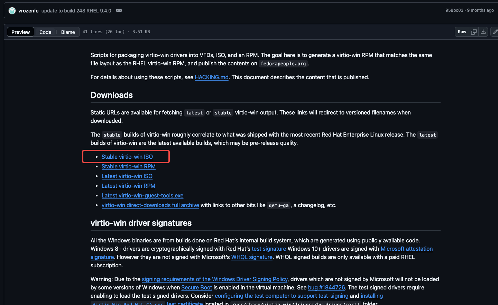

    1. 安装 virtio-win iso

        挂载iso镜像后, 点击virtio-win-gt-x64 进行安装, 安装完成后, 即可看到添加的磁盘

        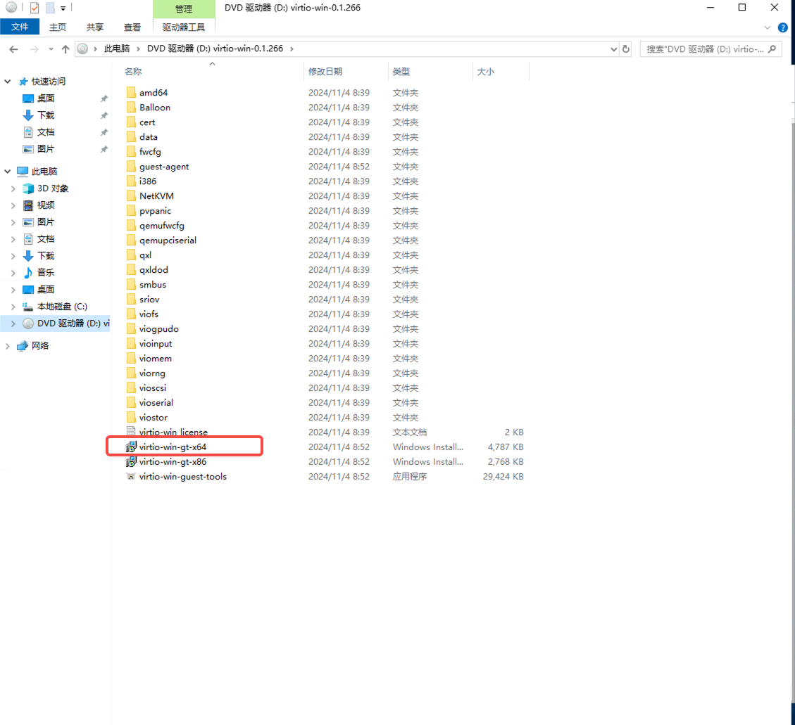

    1. 添加磁盘后的效果

        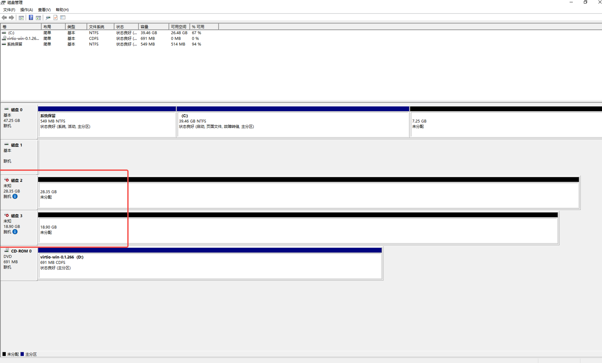

## 可观测性

更多问题请参阅 [可观测性](../insight/intro/index.md)。

??? "链路数据中的时钟偏移"

    在一个分布式系统中，由于 [Clock Skew（时钟偏斜调整）](https://zh.wikipedia.org/wiki/%E6%97%B6%E9%92%9F%E5%81%8F%E7%A7%BB)影响，
    不同主机间存在时间漂移现象。通俗来说，不同主机在同一时刻的系统时间是有微小的偏差的。

    链路追踪系统是一个典型的分布式系统，它在涉及时间数据采集上也受这种现象影响，比如在一条链路中服务端 span 的开始时间早于客户端 span，
    这种现象逻辑上是不存在的，但是由于时钟偏移影响，链路数据在各个服务中被采集到的那一刻主机间的系统时存在偏差，最终造成如下图所示的现象：

    

    上图中出现的现象理论上无法消除。但该现象较少，即使出现也不会影响服务间的调用关系。

    目前 Insight 使用 Jaeger UI 来展示链路数据，UI 在遇到这种链路时会提醒：

    

    目前 Jaeger 的社区正在[尝试通过 UI 层面来优化这个问题](https://github.com/jaegertracing/jaeger-ui/issues/197)。

    更多的相关资料，请参考：

    - [Clock Skew Adjuster considered harmful](https://github.com/jaegertracing/jaeger/issues/1459#issuecomment-582519000)
    - [Add ability to display unadjusted trace in the UI](https://github.com/jaegertracing/jaeger-ui/issues/197)
    - [Clock Skew Adjustment](https://www.jaegertracing.io/docs/1.40/deployment/#clock-skew-adjustment)

??? "日志采集排障指南"

    在集群中[安装 insight-agent](../insight/quickstart/install/install-agent.md) 后， __insight-agent__ 中的 __Fluent Bit__ 会默认采集集群中的日志，包括 Kubernetes 事件日志、节点日志、容器日志等。
     __Fluent Bit__ 已配置好各种日志采集插件、相关的过滤器插件及日志输出插件。
    这些插件的工作状态决定了日志采集是否正常。
    下面是一个针对 __Fluent Bit__ 的仪表盘，它用来监控各个集群中 __Fluent Bit__ 的工作情况和插件的采集、处理、导出日志的情况。

    1. 使用 DCE 平台，进入 __可观测性__ ，选择左侧导航栏的 __仪表盘__ 。

        

    2. 点击仪表盘标题 __概览__ 。

        

    3. 切换到 __insight-system__ -> __Fluent Bit__ 仪表盘。

        

    4. __Fluent Bit__ 仪表盘上方有几个选项框，可以选择日志采集插件、日志过滤插件、日志输出插件及所在集群名。

        

    **插件说明**

    此处说明 __Fluent Bit__ 的几个插件。

    **日志采集插件**

    | input plugin           | 插件介绍               | 采集目录                                                                |
    | ---------------------- | ------------------ | ------------------------------------------------------------------- |
    | tail.kube              | 采集容器日志             | /var/log/containers/*.log                                          |
    | tail.kubeevent         | 采集 Kubernetes 事件日志   | /var/log/containers/*-kubernetes-event-exporter*.log              |
    | tail.syslog.dmesg      | 采集主机 dmesg 日志     | /var/log/dmesg                                                      |
    | tail.syslog.messages   | 采集主机常用日志           | /var/log/secure, /var/log/messages, /var/log/syslog,/var/log/auth.log |
    | syslog.syslog.RSyslog  | 采集 RSyslog 日志      |                                                                     |
    | systemd.syslog.systemd | 采集 Journald daemon 日志   |                                                                     |
    | tail.audit_log.k8s    | 采集 Kubernetes 审计日志   | /var/log/*/audit/*.log                                            |
    | tail.audit_log.ghippo | 采集全局管理审计日志 | /var/log/containers/*_ghippo-system_audit-log*.log              |
    | tail.skoala-gw         | 采集微服务网关日志     | /var/log/containers/*_skoala-gw*.log                             |

    **日志过滤插件**

    | filter plugin      | 插件介绍 |
    | ------------------------ | ---------------------------------- |
    | Lua.audit_log.k8s | 使用 lua 过滤符合条件的 Kubernetes 审计日志 |

    !!! note

        过滤器插件不止 Lua.audit_log.k8s，这里只介绍会丢弃日志的过滤器。

    **日志输出插件**

    | output plugin            | 插件介绍                               |
    | ------------------------ | ---------------------------------- |
    | es.kube.kubeevent.syslog | 把 Kubernetes 审计日志、事件日志，syslog 日志写入 [ElasticSearch 集群](../middleware/elasticsearch/intro/index.md) |
    | forward.audit_log | 把 Kubernetes 审计日志和[全局管理的审计日志](../ghippo/user-guide/audit/audit-log.md)发送到 __全局管理__   |
    | es.skoala | 把微服务网关的[请求日志](../skoala/gateway/logs/reqlog.md)和[实例日志](../skoala/gateway/logs/inslog.md)写入到 ElasticSearch 集群            |

??? "链路采集排障指南"

    在尝试排查链路数据采集的问题前，需先理解链路数据的传输路径，下面是链路数据传输示意图：

    ```mermaid
    graph TB

    sdk[Language proble / SDK] --> workload[Workload cluster otel collector]
    --> otel[Global cluster otel collector]
    --> jaeger[Global cluster jaeger collector]
    --> es[Elasticsearch cluster]

    classDef plain fill:#ddd,stroke:#fff,stroke-width:1px,color:#000;
    classDef k8s fill:#326ce5,stroke:#fff,stroke-width:1px,color:#fff;
    classDef cluster fill:#fff,stroke:#bbb,stroke-width:1px,color:#326ce5;

    class sdk,workload,otel,jaeger,es cluster
    ```

    如上图所示，在任一步骤传输失败都会导致无法查询出链路数据。如果您在完成应用链路增强后发现没有链路数据，请执行以下步骤：

    1. 使用 DCE 平台，进入 __可观测性__ ，选择左侧导航栏的 __仪表盘__ 。

        

    2. 点击仪表盘标题 __概览__ 。

        

    3. 切换到 __insight-system__ -> __insight tracing debug__ 仪表盘。

        

    4. 可以看到该仪表盘由三个区块组成，分别负责监控不同集群、不同组件传输链路的数据情况。通过生成的时序图表，检查链路数据传输是否存在问题。

        - workload opentelemetry collector
        - global opentelemetry collector
        - global jaeger collector

        

    **区块介绍**

    1. **workload opentelemetry collector**

        展示不同工作集群的 __opentelemetry collector__ 在接受 language probe/SDK 链路数据，发送聚合链路数据情况。可以通过左上角的 __Cluster__ 选择框选择所在的集群。

        

        !!! note

            根据这四张时序图，可以判断出该集群的 __opentelemetry collector__ 是否正常运行。

    2. **global opentelemetry collector**

        展示 __全局服务集群__ 的 __opentelemetry collector__ 在接收 __工作集群__ 中 __otel collector__ 链路数据以及发送聚合链路数据的情况。

        

        !!! note

            __全局服务集群__ 的 __opentelemetry collector__ 还负责发送所有工作集群的[全局管理模块](../ghippo/intro/index.md)的[审计日志](../ghippo/user-guide/audit/audit-log.md)以及 Kubernetes 审计日志（默认不采集）到全局管理模块的 __audit server__ 组件。

    3. **global jaeger collector**

        展示 __全局服务集群__ 的 __jaeger collector__ 在接收 __全局服务集群__ 中 __otel collector__ 的数据，并发送链路数据到 [ElasticSearch 集群](../middleware/elasticsearch/intro/index.md)的情况。

        

??? "使用 Insight 定位应用异常"

    本文将以 DCE 中举例，讲解如何通过 Insight 发现 DCE 中异常的组件并分析出组件异常的根因。

    本文假设你已经了解 Insight 的产品功能或愿景。

    **拓扑图 — 从宏观察觉异常**

    随着企业对微服务架构的实践，企业中的服务数量可能会面临着数量多、调用复杂的情况，开发或运维人员很难理清服务之间的关系，
    因此，我们提供了拓扑图监控的功能，我们可以通过拓扑图对当前系统中运行的微服务状况进行初步诊断。

    如下图所示，我们通过拓扑图发现其中 __Insight-Server__ 这个节点的颜色为 __红色__ ，并将鼠标移到该节点上，
    发现该节点的错误率为 __2.11%__ 。因此，我们希望查看更多细节去找到造成该服务错误率不为 __0__ 的原因:

    

    当然，我们也可以点击最顶部的服务名，进入到该服务的总览界面：

    

    **服务总览 — 具体分析的开始**

    当你需要根据服务的入口和出口流量分别分析的时候，你可以在右上角进行筛选切换，筛选数据之后，我们发现该服务有很多 __操作__
    对应的错误率都不为 0. 此时，我们可以通过点击 __查看链路__ 对该 __操作__ 在这段时间产生的并记录下来的链路进行分析：

    

    

    **链路详情 — 找到错误根因，消灭它们**

    在链路列表中，我们可以通过界面直观地发现链路列表中存在着 __错误__ 的链路（上图中红框圈起来的），我们可以点击错误的链路查看链路详情，如下图所示：

    

    在链路图中我们也可以一眼就发现链路的最后一条数据是处于 __错误__ 状态，将其右边 __Logs__ 展开，我们定位到了造成这次请求错误的原因：

    

    根据上面的分析方法，我们也可以定位到其他 __操作__ 错误的链路：

    

    

    

    **接下来 — 你来分析！**

??? "ElasticSearch 数据塞满如何操作？"

    当 ElasticSearch 内存占满时，可以选择[扩容](../insight/faq/expand-once-es-full.md#_1)或者[删除数据](../insight/faq/expand-once-es-full.md#_2)来解决：

    你可以运行如下命令查看 ES 节点的资源占比。

    ```bash
    kubectl get pod -n mcamel-system | grep common-es-cluster-masters-es | awk '{print $1}' | xargs -I {} kubectl exec {} -n mcamel-system -c elasticsearch -- df -h | grep /usr/share/elasticsearch/data
    ```

    **扩容**

    在主机节点还有资源的情况下， **扩容** 是一种常见的方案，也就是提高 PVC 的容量。

    1. 先运行以下命令获取 es-data-0 节点的 PVC 配置，请以实际的环境的 PVC 为准。

        ```bash
        kubectl edit -n mcamel-system pvc elasticsearch-data-mcamel-common-es-cluster-masters-es-data-0
        ```

    2. 然后修改以下 `storage` 字段（需要使用的存储类 SC 可以扩容）

        ```yaml
        spec:
          accessModes:
            - ReadWriteOnce
          resources:
            requests:
              storage: 35Gi # (1)!
        ```

        1. 这个数值需调整

    **删除数据**

    当 ElasticSearch 内存占满时，你还可以删除 index 数据释放资源。

    你可以参考以下步骤进入 Kibana 页面，手动执行删除操作。

    1. 首先明确 Kibana Pod 是否存在并且正常运行：

        ```bash
        kubectl get po -n mcamel-system |grep mcamel-common-es-cluster-masters-kb
        ```

    2. 若不存在，则手动设置 replica 为 1，并且等待服务正常运行；若存在，则跳过该步骤

        ```bash
        kubectl scale -n mcamel-system deployment mcamel-common-es-cluster-masters-kb --replicas 1
        ```

    3. 修改 Kibana 的 Service 为 NodePort 暴露访问方式

        ```bash
        kubectl patch svc -n mcamel-system mcamel-common-es-cluster-masters-kb-http -p '{"spec":{"type":"NodePort"}}'

        # 修改完成后查看 NodePort。此例的端口为 30128，则访问方式为 https://{集群中的节点IP}:30128
        [root@insight-master1 ~]# kubectl get svc -n mcamel-system |grep mcamel-common-es-cluster-masters-kb-http
        mcamel-common-es-cluster-masters-kb-http   NodePort    10.233.51.174   <none>   5601:30128/TCP    108m
        ```

    4. 获取 ElasticSearch 的 Secret，用于登录 Kibana（用户名为 elastic）

        ```bash
        kubectl get secrets -n mcamel-system mcamel-common-es-cluster-masters-es-elastic-user -o jsonpath="{.data.elastic}" |base64 -d
        ```

    5. 进入 **Kibana** -> **Stack Management** -> **Index Management** ，打开 **Include hidden indices** 选项，即可见所有的 index。
       根据 index 的序号大小，保留序号大的 index，删除序号小的 index。

??? "如何配置容器日志黑名单"

    > 注意：目前仅支持 Deployment、 Statefulset、 Daemonset、 Pod 级别的黑名单，不支持 Namespace 级别。

    具体配置方式如下：

    1. 对于任意一个不需要采集容器日志的 Pod, 在 Pod 的 annotation 中添加 `insight.opentelemetry.io/log-ignore: "true"` 来指定不需要采集的容器日志.

    > ⚠️ 注意：从 Insight Agent v0.37.0 版本开始, `insight.opentelemetry.io/log-ignore: "true"` 注解将被废弃，请使用 `fluentbit.io/exclude: "true"` 代替。

    例如：

        ```yaml
        apiVersion: apps/v1
        kind: Deployment
        metadata:
          name: log-generator
        spec:
          selector:
            matchLabels:
              app.kubernetes.io/name: log-generator
          replicas: 1
          template:
            metadata:
              labels:
                app.kubernetes.io/name: log-generator
              annotations:
                #insight.opentelemetry.io/log-ignore: "true" # 👈 从 Insight Agent v0.37.0 版本开始被废弃
                fluentbit.io/exclude: "true"
            spec:
              containers:
                - name: nginx
                  image: banzaicloud/log-generator:0.3.2
        ```

    2. 重启 Pod，等待 Pod 恢复运行状态之后，Fluenbit 将不再采集这个 Pod 内的容器的日志。

## 微服务引擎

更多问题请参阅 [微服务引擎](../skoala/intro/index.md)。

??? "skoala-init 的 x-kubernets-validations 报错问题"

    将 skoala-init 从 v0.11.0 升级到 v0.12.0 时报错导致无法升级：

    ```console
    unknown field "x-kubernets-validations" in io.k8s.apiextensions-apiserver....
    ```

    

    **排查过程**

    1. Q: 操作步骤是否正确?

        A: 先 kubectl apply CRD(s)，再 helm upgrade，所以此操作步骤无误，排除操作问题.

    1. Q: 版本是 QA 测试通过版本，且内部测试时升级功能正常?

        A: 确认无误。

    1. Q: 确认使用版本与测试时使用的 k8s 集群版本?

        A: v1.21 (使用版本) ，v1.26 (测试版本)。

    1.  Q: 至此及根据相应的错误截图，初步推断是客户 k8s 集群版本与相应 CRD 不匹配，
        同时 skoala-init 为微服务相关的所有的服务提供初始条件配置，即其包含有多个 CRD，
        而根据 skoala-init v0.12.0 的 ChangeLog 可知，在此版本中 Gateway-API 的 CRD 有过升级，所以得出：

        A: 由 Gateway-API 相关升级引发。

    **参考文档**

    - [Rollout, Upgrade and Rollback Planning](https://github.com/kubernetes/enhancements/blob/master/keps/sig-api-machinery/2876-crd-validation-expression-language/README.md#rollout-upgrade-and-rollback-planning)

        

    - [KEP-2876：使用通用表达式语言（CEL）来验证 CRD](https://docs.daocloud.io/blogs/230412-k8s-1.27.html#kep-2876cel-crd)

        

    - [CRD validation error for x-kubernetes-preserve-unknown-fields: true #88252](https://github.com/kubernetes/kubernetes/issues/88252#issuecomment-587250746)

    **解决方案**

    根据实际情况，选择适合的解决方案。

    - 方案一：升级使用的 k8s 集群版本为至少 v1.25
    - 方案二：按 [CRD validation error for x-kubernetes-preserve-unknown-fields: true #88252
    ](https://github.com/kubernetes/kubernetes/issues/88252#issuecomment-587250746) 中所示，添加：

       ```shell
        –validate=false
       ```

??? "Nacos 版本降级问题"

    如果你使用的是高于 Nacos 2.1.x 的版本，想要将版本降级到低于 2.1.x，并且使用了外置数据库，
    可以参照以下步骤来降级版本：

    1. 找到需要降级的 Nacos CR 资源

        ```bash
        kubecl get nacos -A
        ```

    2. 修改 `image` 字段，替换成需要降级的版本

    3. 修改数据库

        ```sql
        alter table config_info drop column encrypted_data_key;
        alter table config_info_beta drop column encrypted_data_key;
        alter table his_config_info drop column encrypted_data_key;
        ```

    4. 重启此 Nacos 的 StatefulSet。

## 服务网格

更多问题请参阅 [常见问题](../mspider/intro/faq.md)。

??? "创建网格时找不到所属集群"

    **原因分析**

    主要原因在于所属集群的 __MeshCluster__ 状态不是 "CLUSTER_RUNNING"，可登录全局服务集群查看所属集群的 MeshCluster CRD 状态。

    ```bash
    kubectl get meshcluster -n mspider-system
    ```

    造成这种问题的情况有几种：

    **情况 1**

    如果先前未使用该所属集群创建过网格，执行上述命令未发现该所属集群的 meshcluster CRD，
    可能是因为 gsc-controller 从容器管理（kpanda）同步集群异常。

    **情况 2**

    针对已创建的网格移除集群，执行上述命令。发现该集群的 __meshcluster__ 状态可能处于如下状态之一：

    - MANAGED_RECONCILING
    - MANAGED_SUCCEED
    - MANAGED_EVICTING
    - MANAGED_FAILED

    原因可能是正在清理资源或者存在 meshconfig 未清理干净。

    **解决方案**

    1. 针对情况 1，只需要重启全局服务集群的 gsc-controller 即可。

        ```bash
        kubectl -n mspider-system delete pod $(kubectl -n mspider-system get pod -l app=mspider-gsc-controller -o 'jsonpath={.items.metadata.name}')
        ```

    2. 针对情况 2，由于环境可能未清理干净。请确保所属集群(控制面集群)控制面组件清理干净，否则影响下一次网格创建。

        1. 删除未清理干净导致装态异常的 meshconfig

            ```bash
            kubectl delete meshcluster -n mspider-system ${clustername}
            ```

        1. 重启 gsc-controller 重新同步集群

            ```bash
            kubectl delete po -n mspider-system ${gsc-coontroller-xxxxxxxxxx}
            ```

??? "创建网格时一直处于“创建中”，最终创建失败"

    **问题描述**

    mcpc-ckube-remote pod 一直 __ContainerCreating__ 。
    mcpc-remote-kube-api-server configmap 等待很长时间没有创建。

    

    **日志**

    1. 查看 Pod 日志

        ```bash
        kubectl describe pod mspider-mcpc-ckube-remote-5447c5bcfc-25t7t -n istio-system
        ```

        ```none
        Events:
        Type     Reason       Age                  From               Message
        ----     ------       ----                 ----               -------
        Normal   Scheduled    18m                  default-scheduler  Successfully assigned istio-system/mspider-mcpc-ckube-remote-5447c5bcfc-25t7t to yl-cluster1
        Warning  FailedMount  6m59s                kubelet            Unable to attach or mount volumes: unmounted volumes=[remote-kube-api-server], unattached volumes=[remote-kube-api-server kube-api-access-ljncs ckube-config]: timed out waiting for the condition
        Warning  FailedMount  2m23s (x5 over 16m)  kubelet            Unable to attach or mount volumes: unmounted volumes=[remote-kube-api-server], unattached volumes=[ckube-config remote-kube-api-server kube-api-access-ljncs]: timed out waiting for the condition
        Warning  FailedMount  105s (x16 over 18m)  kubelet            MountVolume.SetUp failed for volume "remote-kube-api-server" : configmap "mspider-mcpc-remote-kube-api-server" not found
        Warning  FailedMount  5s (x2 over 13m)     kubelet            Unable to attach or mount volumes: unmounted volumes=[remote-kube-api-server], unattached volumes=[kube-api-access-ljncs ckube-config remote-kube-api-server]: timed out waiting for the condition
        ```

    1. 查看 gsc controller 日志

        ??? note "点击查看详细日志"

            ```none
            time="2022-12-27T08:08:10Z" level=error msg="unable to get livez for cluster hosted-mesh-hosted: client rate limiter Wait returned an error: context deadline exceeded - error from a previous attempt: read tcp 192.188.110.245:51674->10.105.106.29:6443: read: connection reset by peer" func="mesh-cluster.(*Reconciler).checkAPIServerHealthy.func1()" file="mesh-cluster.go:191"
            time="2022-12-27T08:08:10Z" level=error msg="cluster hosted-mesh-hosted reconcile api-server-healthy error: client rate limiter Wait returned an error: context deadline exceeded - error from a previous attempt: read tcp 192.188.110.245:51674->10.105.106.29:6443: read: connection reset by peer" func="mesh-cluster.(*Reconciler).Reconcile()" file="mesh-cluster.go:1212"
            time="2022-12-27T08:08:13Z" level=error msg="unable to get livez for cluster hosted-mesh-hosted: client rate limiter Wait returned an error: context deadline exceeded - error from a previous attempt: read tcp 192.188.110.245:35842->10.105.106.29:6443: read: connection reset by peer" func="mesh-cluster.(*Reconciler).checkAPIServerHealthy.func1()" file="mesh-cluster.go:191"
            time="2022-12-27T08:08:13Z" level=error msg="cluster hosted-mesh-hosted reconcile api-server-healthy error: client rate limiter Wait returned an error: context deadline exceeded - error from a previous attempt: read tcp 192.188.110.245:35842->10.105.106.29:6443: read: connection reset by peer" func="mesh-cluster.(*Reconciler).Reconcile()" file="mesh-cluster.go:1212"
            time="2022-12-27T08:08:16Z" level=error msg="unable to get livez for cluster hosted-mesh-hosted: client rate limiter Wait returned an error: context deadline exceeded - error from a previous attempt: read tcp 192.188.110.245:35874->10.105.106.29:6443: read: connection reset by peer" func="mesh-cluster.(*Reconciler).checkAPIServerHealthy.func1()" file="mesh-cluster.go:191"
            time="2022-12-27T08:08:16Z" level=error msg="cluster hosted-mesh-hosted reconcile api-server-healthy error: client rate limiter Wait returned an error: context deadline exceeded - error from a previous attempt: read tcp 192.188.110.245:35874->10.105.106.29:6443: read: connection reset by peer" func="mesh-cluster.(*Reconciler).Reconcile()" file="mesh-cluster.go:1212"
            time="2022-12-27T08:08:19Z" level=error msg="unable to get livez for cluster hosted-mesh-hosted: client rate limiter Wait returned an error: context deadline exceeded - error from a previous attempt: read tcp 192.188.110.245:35902->10.105.106.29:6443: read: connection reset by peer" func="mesh-cluster.(*Reconciler).checkAPIServerHealthy.func1()" file="mesh-cluster.go:191"
            time="2022-12-27T08:08:19Z" level=error msg="cluster hosted-mesh-hosted reconcile api-server-healthy error: client rate limiter Wait returned an error: context deadline exceeded - error from a previous attempt: read tcp 192.188.110.245:35902->10.105.106.29:6443: read: connection reset by peer" func="mesh-cluster.(*Reconciler).Reconcile()" file="mesh-cluster.go:1212"
            time="2022-12-27T08:08:22Z" level=error msg="unable to get livez for cluster hosted-mesh-hosted: client rate limiter Wait returned an error: context deadline exceeded - error from a previous attempt: read tcp 192.188.110.245:35940->10.105.106.29:6443: read: connection reset by peer" func="mesh-cluster.(*Reconciler).checkAPIServerHealthy.func1()" file="mesh-cluster.go:191"
            time="2022-12-27T08:08:22Z" level=error msg="cluster hosted-mesh-hosted reconcile api-server-healthy error: client rate limiter Wait returned an error: context deadline exceeded - error from a previous attempt: read tcp 192.188.110.245:35940->10.105.106.29:6443: read: connection reset by peer" func="mesh-cluster.(*Reconciler).Reconcile()" file="mesh-cluster.go:1212"
            time="2022-12-27T08:08:23Z" level=error msg="cluster cluster1-141 reconcile component-status error: deployment: istio-system/mspider-mcpc-mcpc-controller, error: {type: Available, reason: Deployment does not have minimum availability.;type: Progressing, reason: ReplicaSet \"mspider-mcpc-mcpc-controller-d7b76b945\" has timed out progressing.};deployment: istio-system/mspider-mcpc-ckube-remote, error: {type: Available, reason: Deployment does not have minimum availability.;type: Progressing, reason: ReplicaSet \"mspider-mcpc-ckube-remote-5447c5bcfc\" has timed out progressing.}" func="mesh-cluster.(*Reconciler).Reconcile()" file="mesh-cluster.go:1212"
            time="2022-12-27T08:08:23Z" level=info msg="get mesh hosted-mesh's address: 0.0.0.0:30527" func="hosted-apiserver-proxy.(*proxyServer).GetMeshPort()" file="proxy.go:87"
            time="2022-12-27T08:08:23Z" level=error msg="cluster cluster1-141 reconcile component-status error: deployment: istio-system/mspider-mcpc-mcpc-controller, error: {type: Available, reason: Deployment does not have minimum availability.;type: Progressing, reason: ReplicaSet \"mspider-mcpc-mcpc-controller-d7b76b945\" has timed out progressing.};deployment: istio-system/mspider-mcpc-ckube-remote, error: {type: Available, reason: Deployment does not have minimum availability.;type: Progressing, reason: ReplicaSet \"mspider-mcpc-ckube-remote-5447c5bcfc\" has timed out progressing.}" func="mesh-cluster.(*Reconciler).Reconcile()" file="mesh-cluster.go:1212"
            time="2022-12-27T08:08:25Z" level=error msg="unable to get livez for cluster hosted-mesh-hosted: client rate limiter Wait returned an error: context deadline exceeded - error from a previous attempt: read tcp 192.188.110.245:52050->10.105.106.29:6443: read: connection reset by peer" func="mesh-cluster.(*Reconciler).checkAPIServerHealthy.func1()" file="mesh-cluster.go:191"
            time="2022-12-27T08:08:25Z" level=error msg="cluster hosted-mesh-hosted reconcile api-server-healthy error: client rate limiter Wait returned an error: context deadline exceeded - error from a previous attempt: read tcp 192.188.110.245:52050->10.105.106.29:6443: read: connection reset by peer" func="mesh-cluster.(*Reconciler).Reconcile()" file="mesh-cluster.go:1212"
            1.672128505418613e+09   ERROR   Reconciler error        {"controller": "meshcluster", "controllerGroup": "discovery.mspider.io", "controllerKind": "MeshCluster", "MeshCluster": {"name":"hosted-mesh-hosted","namespace":"mspider-system"}, "namespace": "mspider-system", "name": "hosted-mesh-hosted", "reconcileID": "e3583462-c271-4e58-ae00-18ba923362b8", "error": "Operation cannot be fulfilled on meshclusters.discovery.mspider.io \"hosted-mesh-hosted\": the object has been modified; please apply your changes to the latest version and try again"}
            sigs.k8s.io/controller-runtime/pkg/internal/controller.(*Controller).reconcileHandler
                    /go/pkg/mod/sigs.k8s.io/controller-runtime@v0.13.0/pkg/internal/controller/controller.go:326
            sigs.k8s.io/controller-runtime/pkg/internal/controller.(*Controller).processNextWorkItem
                    /go/pkg/mod/sigs.k8s.io/controller-runtime@v0.13.0/pkg/internal/controller/controller.go:273
            sigs.k8s.io/controller-runtime/pkg/internal/controller.(*Controller).Start.func2.2
                    /go/pkg/mod/sigs.k8s.io/controller-runtime@v0.13.0/pkg/internal/controller/controller.go:234
            time="2022-12-27T08:08:25Z" level=error msg="update cluster status error: Operation cannot be fulfilled on meshclusters.discovery.mspider.io \"hosted-mesh-hosted\": the object has been modified; please apply your changes to the latest version and try again" func="mesh-cluster.(*Reconciler).Reconcile()" file="mesh-cluster.go:1241"
            time="2022-12-27T08:08:28Z" level=error msg="unable to get livez for cluster hosted-mesh-hosted: client rate limiter Wait returned an error: context deadline exceeded - error from a previous attempt: EOF" func="mesh-cluster.(*Reconciler).checkAPIServerHealthy.func1()" file="mesh-cluster.go:191"
            time="2022-12-27T08:08:28Z" level=error msg="cluster hosted-mesh-hosted reconcile api-server-healthy error: client rate limiter Wait returned an error: context deadline exceeded - error from a previous attempt: EOF" func="mesh-cluster.(*Reconciler).Reconcile()" file="mesh-cluster.go:1212"
            time="2022-12-27T08:08:31Z" level=error msg="unable to get livez for cluster hosted-mesh-hosted: client rate limiter Wait returned an error: context deadline exceeded - error from a previous attempt: read tcp 192.188.110.245:52104->10.105.106.29:6443: read: connection reset by peer" func="mesh-cluster.(*Reconciler).checkAPIServerHealthy.func1()" file="mesh-cluster.go:191"
            time="2022-12-27T08:08:31Z" level=error msg="cluster hosted-mesh-hosted reconcile api-server-healthy error: client rate limiter Wait returned an error: context deadline exceeded - error from a previous attempt: read tcp 192.188.110.245:52104->10.105.106.29:6443: read: connection reset by peer" func="mesh-cluster.(*Reconciler).Reconcile()" file="mesh-cluster.go:1212"
            1.6721285114885132e+09  ERROR   Reconciler error        {"controller": "meshcluster", "controllerGroup": "discovery.mspider.io", "controllerKind": "MeshCluster", "MeshCluster": {"name":"hosted-mesh-hosted","namespace":"mspider-system"}, "namespace": "mspider-system", "name": "hosted-mesh-hosted", "reconcileID": "b3abe28d-8ec4-4a69-8ecb-1e69e2f8c12d", "error": "Operation cannot be fulfilled on meshclusters.discovery.mspider.io \"hosted-mesh-hosted\": the object has been modified; please apply your changes to the latest version and try again"}
            sigs.k8s.io/controller-runtime/pkg/internal/controller.(*Controller).reconcileHandler
                    /go/pkg/mod/sigs.k8s.io/controller-runtime@v0.13.0/pkg/internal/controller/controller.go:326
            sigs.k8s.io/controller-runtime/pkg/internal/controller.(*Controller).processNextWorkItem
                    /go/pkg/mod/sigs.k8s.io/controller-runtime@v0.13.0/pkg/internal/controller/controller.go:273
            sigs.k8s.io/controller-runtime/pkg/internal/controller.(*Controller).Start.func2.2
            time="2022-12-27T08:08:31Z" level=error msg="update cluster status error: Operation cannot be fulfilled on meshclusters.discovery.mspider.io \"hosted-mesh-hosted\": the object has been modified; please apply your changes to the latest version and try again" func="mesh-cluster.(*Reconciler).Reconcile()" file="mesh-cluster.go:1241"
                    /go/pkg/mod/sigs.k8s.io/controller-runtime@v0.13.0/pkg/internal/controller/controller.go:234
            time="2022-12-27T08:08:34Z" level=error msg="unable to get livez for cluster hosted-mesh-hosted: client rate limiter Wait returned an error: context deadline exceeded - error from a previous attempt: read tcp 192.188.110.245:49646->10.105.106.29:6443: read: connection reset by peer" func="mesh-cluster.(*Reconciler).checkAPIServerHealthy.func1()" file="mesh-cluster.go:191"
            time="2022-12-27T08:08:34Z" level=error msg="cluster hosted-mesh-hosted reconcile api-server-healthy error: client rate limiter Wait returned an error: context deadline exceeded - error from a previous attempt: read tcp 192.188.110.245:49646->10.105.106.29:6443: read: connection reset by peer" func="mesh-cluster.(*Reconciler).Reconcile()" file="mesh-cluster.go:1212"
            time="2022-12-27T08:08:37Z" level=error msg="unable to get livez for cluster hosted-mesh-hosted: client rate limiter Wait returned an error: context deadline exceeded - error from a previous attempt: read tcp 192.188.110.245:49656->10.105.106.29:6443: read: connection reset by peer" func="mesh-cluster.(*Reconciler).checkAPIServerHealthy.func1()" file="mesh-cluster.go:191"
            time="2022-12-27T08:08:37Z" level=error msg="cluster hosted-mesh-hosted reconcile api-server-healthy error: client rate limiter Wait returned an error: context deadline exceeded - error from a previous attempt: read tcp 192.188.110.245:49656->10.105.106.29:6443: read: connection reset by peer" func="mesh-cluster.(*Reconciler).Reconcile()" file="mesh-cluster.go:1212"
            time="2022-12-27T08:08:37Z" level=error msg="update cluster status error: Operation cannot be fulfilled on meshclusters.discovery.mspider.io \"hosted-mesh-hosted\": the object has been modified; please apply your changes to the latest version and try again" func="mesh-cluster.(*Reconciler).Reconcile()" file="mesh-cluster.go:1241"
            1.6721285175748258e+09  ERROR   Reconciler error        {"controller": "meshcluster", "controllerGroup": "discovery.mspider.io", "controllerKind": "MeshCluster", "MeshCluster": {"name":"hosted-mesh-hosted","namespace":"mspider-system"}, "namespace": "mspider-system", "name": "hosted-mesh-hosted", "reconcileID": "4cc3c5be-dbe1-4bdc-a606-70ff2b7bc3f2", "error": "Operation cannot be fulfilled on meshclusters.discovery.mspider.io \"hosted-mesh-hosted\": the object has been modified; please apply your changes to the latest version and try again"}
            sigs.k8s.io/controller-runtime/pkg/internal/controller.(*Controller).reconcileHandler
                    /go/pkg/mod/sigs.k8s.io/controller-runtime@v0.13.0/pkg/internal/controller/controller.go:326
            sigs.k8s.io/controller-runtime/pkg/internal/controller.(*Controller).processNextWorkItem
                    /go/pkg/mod/sigs.k8s.io/controller-runtime@v0.13.0/pkg/internal/controller/controller.go:273
            sigs.k8s.io/controller-runtime/pkg/internal/controller.(*Controller).Start.func2.2
                    /go/pkg/mod/sigs.k8s.io/controller-runtime@v0.13.0/pkg/internal/controller/controller.go:234
            time="2022-12-27T08:08:39Z" level=error msg="mesh hosted-mesh reconcile remote-config error: create mesh hosted-mesh hosted ns error: an error on the server (\"unknown\") has prevented the request from succeeding (post namespaces)" func="global-mesh.(*Reconciler).Reconcile()" file="global-mesh.go:1198"
            time="2022-12-27T08:08:40Z" level=error msg="unable to get livez for cluster hosted-mesh-hosted: client rate limiter Wait returned an error: context deadline exceeded - error from a previous attempt: read tcp 192.188.110.245:49676->10.105.106.29:6443: read: connection reset by peer" func="mesh-cluster.(*Reconciler).checkAPIServerHealthy.func1()" file="mesh-cluster.go:191"
            time="2022-12-27T08:08:40Z" level=error msg="cluster hosted-mesh-hosted reconcile api-server-healthy error: client rate limiter Wait returned an error: context deadline exceeded - error from a previous attempt: read tcp 192.188.110.245:49676->10.105.106.29:6443: read: connection reset by peer" func="mesh-cluster.(*Reconciler).Reconcile()" file="mesh-cluster.go:1212"
            time="2022-12-27T08:08:40Z" level=error msg="update cluster status error: Operation cannot be fulfilled on meshclusters.discovery.mspider.io \"hosted-mesh-hosted\": the object has been modified; please apply your changes to the latest version and try again" func="mesh-cluster.(*Reconciler).Reconcile()" file="mesh-cluster.go:1241"
            1.6721285206091342e+09  ERROR   Reconciler error        {"controller": "meshcluster", "controllerGroup": "discovery.mspider.io", "controllerKind": "MeshCluster", "MeshCluster": {"name":"hosted-mesh-hosted","namespace":"mspider-system"}, "namespace": "mspider-system", "name": "hosted-mesh-hosted", "reconcileID": "31adec56-ca5b-4636-a74e-3ce4ae8b07af", "error": "Operation cannot be fulfilled on meshclusters.discovery.mspider.io \"hosted-mesh-hosted\": the object has been modified; please apply your changes to the latest version and try again"}
            sigs.k8s.io/controller-runtime/pkg/internal/controller.(*Controller).reconcileHandler
                    /go/pkg/mod/sigs.k8s.io/controller-runtime@v0.13.0/pkg/internal/controller/controller.go:326
            sigs.k8s.io/controller-runtime/pkg/internal/controller.(*Controller).processNextWorkItem
                    /go/pkg/mod/sigs.k8s.io/controller-runtime@v0.13.0/pkg/internal/controller/controller.go:273
            sigs.k8s.io/controller-runtime/pkg/internal/controller.(*Controller).Start.func2.2
                    /go/pkg/mod/sigs.k8s.io/controller-runtime@v0.13.0/pkg/internal/controller/controller.go:234
            time="2022-12-27T08:08:43Z" level=error msg="unable to get livez for cluster hosted-mesh-hosted: client rate limiter Wait returned an error: context deadline exceeded - error from a previous attempt: read tcp 192.188.110.245:47316->10.105.106.29:6443: read: connection reset by peer" func="mesh-cluster.(*Reconciler).checkAPIServerHealthy.func1()" file="mesh-cluster.go:191"
            time="2022-12-27T08:08:43Z" level=error msg="cluster hosted-mesh-hosted reconcile api-server-healthy error: client rate limiter Wait returned an error: context deadline exceeded - error from a previous attempt: read tcp 192.188.110.245:47316->10.105.106.29:6443: read: connection reset by peer" func="mesh-cluster.(*Reconciler).Reconcile()" file="mesh-cluster.go:1212"
            time="2022-12-27T08:08:43Z" level=error msg="update cluster status error: Operation cannot be fulfilled on meshclusters.discovery.mspider.io \"hosted-mesh-hosted\": the object has been modified; please apply your changes to the latest version and try again" func="mesh-cluster.(*Reconciler).Reconcile()" file="mesh-cluster.go:1241"
            1.6721285236628819e+09  ERROR   Reconciler error        {"controller": "meshcluster", "controllerGroup": "discovery.mspider.io", "controllerKind": "MeshCluster", "MeshCluster": {"name":"hosted-mesh-hosted","namespace":"mspider-system"}, "namespace": "mspider-system", "name": "hosted-mesh-hosted", "reconcileID": "908883a2-78a3-48f0-8a91-4f963903ae19", "error": "Operation cannot be fulfilled on meshclusters.discovery.mspider.io \"hosted-mesh-hosted\": the object has been modified; please apply your changes to the latest version and try again"}
            sigs.k8s.io/controller-runtime/pkg/internal/controller.(*Controller).reconcileHandler
                    /go/pkg/mod/sigs.k8s.io/controller-runtime@v0.13.0/pkg/internal/controller/controller.go:326
            sigs.k8s.io/controller-runtime/pkg/internal/controller.(*Controller).processNextWorkItem
                    /go/pkg/mod/sigs.k8s.io/controller-runtime@v0.13.0/pkg/internal/controller/controller.go:273
            sigs.k8s.io/controller-runtime/pkg/internal/controller.(*Controller).Start.func2.2
                    /go/pkg/mod/sigs.k8s.io/controller-runtime@v0.13.0/pkg/internal/controller/controller.go:234
            ```

    **原因分析**

    1. 情况 1：托管网格由于控制面集群没有提前部署 __StorageClass__ 导致无法创建高可用 ETCD。

        xxxxx-etcd-0 一直 pending，etcd pvc 无法绑定 sc 导致 pvc pending，
        进而导致 etcd pod 无法绑定 pvc。可以尝试以下步骤解决问题：

        1. 部署 hwameistor 或者 localPath
        2. 删除 istio-system 命名空间下 pending 的 pvc
        3. 重启一下 xxx-etcd-0 pod，等待即可

        !!! note

            使用 hwameistor 完成部署后，每个节点必须存在一个空盘。您需要创建 LDC，然后检查 LSN LocalStorage_PoolHDD。

    2. 情况 2：托管网格 istiod-xxxx-hosted-xxxx 组件异常

    3. 情况 3：mspider-mcpc-ckube-remote-xxxx 组件异常，describe 出现如下报错：

        ```none
         Normal   Scheduled    18m                  default-scheduler  Successfully assigned istio-system/mspider-mcpc-ckube-remote-5447c5bcfc-25t7t to yl-cluster20
         Warning  FailedMount  6m59s                kubelet            Unable to attach or mount volumes: unmounted volumes=[remote-kube-api-server], unattached volumes=[remote-kube-api-server kube-api-access-ljncs ckube-config]: timed out waiting for the condition
         Warning  FailedMount  2m23s (x5 over 16m)  kubelet            Unable to attach or mount volumes: unmounted volumes=[remote-kube-api-server], unattached volumes=[ckube-config remote-kube-api-server kube-api-access-ljncs]: timed out waiting for the condition
         Warning  FailedMount  105s (x16 over 18m)  kubelet            MountVolume.SetUp failed for volume "remote-kube-api-server" : configmap "mspider-mcpc-remote-kube-api-server" not found
         Warning  FailedMount  5s (x2 over 13m)     kubelet            Unable to attach or mount volumes: unmounted volumes=[remote-kube-api-server], unattached volumes=[kube-api-access-ljncs ckube-config remote-kube-api-server]: timed out waiting for the condition
        ```

    4. 情况 4：inotify watcher limit problems, remote-ckube 组件日志

        ```none
        panic: too many open files
        ```

    **解决方案**

    1. 情况 1：控制面集群提前部署 sc。

    2. 情况 2：该组件异常可能控制面集群未部署 metalLB 导致网络不通，
       istiod-xxxx-hosed-lb 无法分配 endpoint。可在 addon 中为该集群部署 metalLB。

    3. 情况 3：在移除原有托管网格后的环境中，再次创建托管网格的情况下，容易出现控制面还没有及时下发导致
       "mspider-mcpc-remote-kube-api-server" ConfigMap 未及时创建。可以重启一下全局服务集群 gsc controller：

        ```bash
        kubectl -n mspider-system delete pod $(kubectl -n mspider-system get pod -l app=mspider-gsc-controller -o 'jsonpath={.items.metadata.name}')
        ```

    4. 情况 4：修改 fs.inotify.max_user_instances = 65535

??? "创建的网格异常，但无法删除网格"

    **原因分析**

    网格处于失败状态，无法点击网格实例。
    由于该网格中纳管了集群、创建了网格网关实例、或启用了边车注入，导致移除网格时检测总是失败，所以无法被正常删除。

    **解决方案**

    建议排查具体网格失败的原因并解决，如果想要强制删除，请执行以下操作：

    1. 禁用纳管集群的边车注入

        1. 禁用命名空间边车自动注入。

            在 __容器管理__ 中，选择该集群 –> __命名空间__ –> 修改标签 —> 移除 `istio-injection: enabled` 标签，重启该命名空间下的所有 Pod。

            

        1. 禁用工作负载边车注入：

            在 __容器管理__ 中，选择该集群 –> __工作负载__ —> __无状态负载__ —> __标签与注解__ —> 移除 `sidecar.istio.io/inject: true` 标签。

            

    1. 删除创建的网格网关实例。

    1. 移除集群。

        在 __容器管理__ 中，选择全局服务集群，自定义资源搜索 `globalmeshes.discovery.mspider.io` 。
        在 mspider-system 命名空间下选择要移除集群的网格，编辑 YAML：

        

    1. 返回服务网格，删除该网格实例。

??? "托管网格纳管集群失败"

    **问题**

    - 托管网格接入新集群时 istio-ingressgateway 无法正常工作。

        ??? note "点击查看完整的错误日志"

             ```none
             [root@dce88 metallb]# kubectl describe pod istio-ingressgateway-b8b597c59-7gnwr -n istio-system
             Name:         istio-ingressgateway-b8b597c59-7gnwr
             Namespace:    istio-system
             Priority:     0
             Node:         dce88/10.6.113.100
             Start Time:   Fri, 24 Feb 2023 10:51:22 +0800
             Labels:       app=istio-ingressgateway
                         chart=gateways
                         heritage=Tiller
                         install.operator.istio.io/owning-resource=unknown
                         istio=ingressgateway
                         istio.io/rev=default
                         operator.istio.io/component=IngressGateways
                         pod-template-hash=b8b597c59
                         release=istio
                         service.istio.io/canonical-name=istio-ingressgateway
                         service.istio.io/canonical-revision=latest
                         sidecar.istio.io/inject=false
             Annotations:  prometheus.io/path: /stats/prometheus
                         prometheus.io/port: 15020
                         prometheus.io/scrape: true
                         sidecar.istio.io/inject: false
             Status:       Running
             IP:           10.244.0.17
             IPs:
             IP:           10.244.0.17
             Controlled By:  ReplicaSet/istio-ingressgateway-b8b597c59
             Containers:
             istio-proxy:
                Container ID:  docker://40ef710d84433b108b58e8d286b46d6fde3f5ac2f6b7e80765d61aafb2d269da
                Image:         10.16.10.120/release.daocloud.io/mspider/proxyv2:1.16.1-mspider
                Image ID:      docker-pullable://10.16.10.120/release.daocloud.io/mspider/proxyv2@sha256:4ac80ff62af5ebe7ebb5cb75d1b1f6791b55b56e1b45a0547197b26d9674fd22
                Ports:         15021/TCP, 8080/TCP, 8443/TCP, 15090/TCP
                Host Ports:    0/TCP, 0/TCP, 0/TCP, 0/TCP
                Args:
                   proxy
                   router
                   --domain
                   $(POD_NAMESPACE).svc.cluster.local
                   --proxyLogLevel=warning
                   --proxyComponentLogLevel=misc:error
                   --log_output_level=default:info
                State:          Running
                   Started:      Fri, 24 Feb 2023 10:51:25 +0800
                Ready:          False
                Restart Count:  0
                Limits:
                   cpu:     2
                   memory:  1Gi
                Requests:
                   cpu:      100m
                   memory:   128Mi
                Readiness:  http-get http://:15021/healthz/ready delay=1s timeout=1s period=2s #success=1 #failure=30
                Environment:
                   JWT_POLICY:                    third-party-jwt
                   PILOT_CERT_PROVIDER:           istiod
                   CA_ADDR:                       istiod.istio-system.svc:15012
                   NODE_NAME:                      (v1:spec.nodeName)
                   POD_NAME:                      istio-ingressgateway-b8b597c59-7gnwr (v1:metadata.name)
                   POD_NAMESPACE:                 istio-system (v1:metadata.namespace)
                   INSTANCE_IP:                    (v1:status.podIP)
                   HOST_IP:                        (v1:status.hostIP)
                   SERVICE_ACCOUNT:                (v1:spec.serviceAccountName)
                   ISTIO_META_WORKLOAD_NAME:      istio-ingressgateway
                   ISTIO_META_OWNER:              kubernetes://apis/apps/v1/namespaces/istio-system/deployments/istio-ingressgateway
                   ISTIO_META_MESH_ID:            fupan-mesh
                   TRUST_DOMAIN:                  cluster.local
                   ISTIO_META_UNPRIVILEGED_POD:   true
                   ISTIO_META_DNS_AUTO_ALLOCATE:  true
                   ISTIO_META_DNS_CAPTURE:        true
                   ISTIO_META_CLUSTER_ID:         futest-2
                Mounts:
                   /etc/istio/config from config-volume (rw)
                   /etc/istio/ingressgateway-ca-certs from ingressgateway-ca-certs (ro)
                   /etc/istio/ingressgateway-certs from ingressgateway-certs (ro)
                   /etc/istio/pod from podinfo (rw)
                   /etc/istio/proxy from istio-envoy (rw)
                   /var/lib/istio/data from istio-data (rw)
                   /var/run/secrets/credential-uds from credential-socket (rw)
                   /var/run/secrets/istio from istiod-ca-cert (rw)
                   /var/run/secrets/kubernetes.io/serviceaccount from kube-api-access-hpgkx (ro)
                   /var/run/secrets/tokens from istio-token (ro)
                   /var/run/secrets/workload-spiffe-credentials from workload-certs (rw)
                   /var/run/secrets/workload-spiffe-uds from workload-socket (rw)
             Conditions:
             Type              Status
             Initialized       True
             Ready             False
             ContainersReady   False
             PodScheduled      True
             Volumes:
             workload-socket:
                Type:       EmptyDir (a temporary directory that shares a pod's lifetime)
                Medium:
                SizeLimit:  <unset>
             credential-socket:
                Type:       EmptyDir (a temporary directory that shares a pod's lifetime)
                Medium:
                SizeLimit:  <unset>
             workload-certs:
                Type:       EmptyDir (a temporary directory that shares a pod's lifetime)
                Medium:
                SizeLimit:  <unset>
             istiod-ca-cert:
                Type:      ConfigMap (a volume populated by a ConfigMap)
                Name:      istio-ca-root-cert
                Optional:  false
             podinfo:
                Type:  DownwardAPI (a volume populated by information about the pod)
                Items:
                   metadata.labels -> labels
                   metadata.annotations -> annotations
             istio-envoy:
                Type:       EmptyDir (a temporary directory that shares a pod's lifetime)
                Medium:
                SizeLimit:  <unset>
             istio-data:
                Type:       EmptyDir (a temporary directory that shares a pod's lifetime)
                Medium:
                SizeLimit:  <unset>
             istio-token:
                Type:                    Projected (a volume that contains injected data from multiple sources)
                TokenExpirationSeconds:  43200
             config-volume:
                Type:      ConfigMap (a volume populated by a ConfigMap)
                Name:      istio
                Optional:  true
             ingressgateway-certs:
                Type:        Secret (a volume populated by a Secret)
                SecretName:  istio-ingressgateway-certs
                Optional:    true
             ingressgateway-ca-certs:
                Type:        Secret (a volume populated by a Secret)
                SecretName:  istio-ingressgateway-ca-certs
                Optional:    true
             kube-api-access-hpgkx:
                Type:                    Projected (a volume that contains injected data from multiple sources)
                TokenExpirationSeconds:  3607
                ConfigMapName:           kube-root-ca.crt
                ConfigMapOptional:       <nil>
                DownwardAPI:             true
             QoS Class:                   Burstable
             Node-Selectors:              <none>
             Tolerations:                 node.kubernetes.io/not-ready:NoExecute op=Exists for 300s
                                        node.kubernetes.io/unreachable:NoExecute op=Exists for 300s
             Events:
             Type     Reason     Age                 From               Message
             ----     ------     ----                ----               -------
             Normal   Scheduled  63s                 default-scheduler  Successfully assigned istio-system/istio-ingressgateway-b8b597c59-7gnwr to dce88
             Normal   Pulled     62s                 kubelet            Container image "10.16.10.120/release.daocloud.io/mspider/proxyv2:1.16.1-mspider" already present on machine
             Normal   Created    60s                 kubelet            Created container istio-proxy
             Normal   Started    60s                 kubelet            Started container istio-proxy
             Warning  Unhealthy  19s (x22 over 59s)  kubelet            Readiness probe failed: Get "http://10.244.0.17:15021/healthz/ready": dial tcp 10.244.0.17:15021: connect: connection refused
             ```

    - 托管网格的控制面和数据面一起部署的情况下，istiod-remote ep ip 分配错误。

        托管集群当作工作负载集群接入托管网格时，istiod-remote ep ip 分配为 metalLB IP，应该为 PodIP（mspider-mcpc-ckube-remote-xxx）

        

    **原因分析**

    1. 情况一：被纳管集群没有安装 metalLB 导致集群网络不通，ingressgateway 无法正常分配 endpoint 一直 CrashLoopBackoff

    2. 情况二：istio-remote 组件 endpoint 分配错误，执行 `kubectl get ep -n istio-system` 查看详情

    **解决方案**

    1. 情况一：addon 部署 metalLB
    2. 情况二：检查

        1. 控制面集群 `istio-remote ep: istio-${meshID}-hosted ${podIP}:15012/15017`
        2. 工作负载集群 `istio-remote ep: istiod-hosted-mesh-hosted-lb 的 ${loadBalancerIP}:15012/15017`

??? "托管网格纳管集群时 istio-ingressgateway 异常"

    **情况分析**

    当托管网格纳管工作负载集群时，常常会出现 __istio-ingressgateway__ 组件不健康。

    如下图：

    

    首先查看 istio-ingressgateway 日志报错信息：

    ```bash
    2023-04-25T12:18:04.657568Z     info    JWT policy is third-party-jwt
    2023-04-25T12:18:04.657573Z     info    using credential fetcher of JWT type in cluster.local trust domain
    2023-04-25T12:18:06.658680Z     info    Workload SDS socket not found. Starting Istio SDS Server
    2023-04-25T12:18:06.658716Z     info    CA Endpoint istiod.istio-system.svc:15012, provider Citadel
    2023-04-25T12:18:06.658747Z     info    Using CA istiod.istio-system.svc:15012 cert with certs: var/run/secrets/istio/root-cert.pem
    2023-04-25T12:18:06.667981Z     info    Opening status port 15020
    2023-04-25T12:18:06.694111Z     info    ads     All caches have been synced up in 2.053719558s, marking server ready
    2023-04-25T12:18:06.694864Z     info    xdsproxy        Initializing with upstream address "istiod-remote.istio-system.svc:15012" and cluster "yw55"
    2023-04-25T12:18:06.696385Z     info    sds     Starting SDS grpc server
    2023-04-25T12:18:06.696568Z     info    starting Http service at 127.0.0.1:15004
    2023-04-25T12:18:06.698950Z     info    Pilot SAN: [istiod-remote.istio-system.svc]
    2023-04-25T12:18:06.705118Z     info    Starting proxy agent
    2023-04-25T12:18:06.705177Z     info    starting
    2023-04-25T12:18:06.705214Z     info    Envoy command: [-c etc/istio/proxy/envoy-rev.json --restart-epoch 0 --drain-time-s 45 --parent-shutdown-time-s 60 --local-address-ip-version v4 --file-flush-interval-msec 1000 --log-format %Y-%m-%dT%T.%fZ      %l      envoy %n        %v -l warning --component-log-level misc:error]
    2023-04-25T12:18:07.696708Z     info    cache   generated new workload certificate      latency=1.001557215s ttl=23h59m59.303308657s
    2023-04-25T12:18:07.696756Z     info    cache   Root cert has changed, start rotating root cert
    2023-04-25T12:18:07.696785Z     info    ads     XDS: Incremental Pushing:0 ConnectedEndpoints:0 Version:
    2023-04-25T12:18:07.696896Z     info    cache   returned workload trust anchor from cache       ttl=23h59m59.303107754s
    2023-04-25T12:19:07.664759Z     warning envoy config    StreamAggregatedResources gRPC config stream to xds-grpc closed since 40s ago: 14, connection error: desc = "transport: Error while dialing dial tcp 10.233.48.75:15012: i/o timeout"
    2023-04-25T12:19:29.530922Z     warning envoy config    StreamAggregatedResources gRPC config stream to xds-grpc closed since 62s ago: 14, connection error: desc = "transport: Error while dialing dial tcp 10.233.48.75:15012: i/o timeout"
    2023-04-25T12:19:51.228936Z     warning envoy config    StreamAggregatedResources gRPC config stream to xds-grpc closed since 84s ago: 14, connection error: desc = "transport: Error while dialing dial tcp 10.233.48.75:15012: i/o timeout"
    2023-04-25T12:20:11.732449Z     warning envoy config    StreamAggregatedResources gRPC config stream to xds-grpc closed since 104s ago: 14, connection error: desc = "transport: Error while dialing dial tcp 10.233.48.75:15012: i/o timeout"
    2023-04-25T12:20:41.426914Z     warning envoy config    StreamAggregatedResources gRPC config stream to xds-grpc closed since 134s ago: 14, connection error: desc = "transport: Error while dialing dial tcp 10.233.48.75:15012: i/o timeout"
    2023-04-25T12:21:15.199447Z     warning envoy config    StreamAggregatedResources gRPC config stream to xds-grpc closed since 168s ago: 14, connection error: desc = "transport: Error while dialing dial tcp 10.233.48.75:15012: i/o timeout"
    ```

    上面报错信息显示连接 `10.233.48.75:15012` 即 __istiod-remote__ 的 service ip:15012 timeout !!!。

    此时我们查看 __istio-system__ 命名空间下 __istiod-remote__ 的 __endpoint__ 。

    ```bash
    kubectl get ep -n istio-system
    ```
    ```none
    NAME                    ENDPOINTS                                                                 AGE
    istio-eastwestgateway                                                                             36s
    istio-ingressgateway                                                                              10m
    istiod                  10.233.97.220:15012,10.233.97.220:15010,10.233.97.220:15017 + 1 more...   10m
    istiod-remote           10.233.95.141:15012,10.233.95.141:15017                                   10m
    ```

    这里可以看出 __istio-remote__ 分配的 __endpoint__ 地址是 `istiod-remote 10.233.95.141:15012,10.233.95.141:15017` 。如下图：

    

    !!! note

        工作负载集群接入托管网格时，istiod-remote 的 endpoint 地址分配的应该是
        istiod-xxxx-hosted-lb service 的 loadBalancer IP:15012，
        而这里却分配成控制面集群的 istiod-xxxx-hosted-xxxx Pod IP。

    **解决方案**

    更新网格 __基本信息__ 配置中的控制面地址：

    1. 登录控制面集群执行以下命令获取这个地址：

        ```bash
        kubectl get svc -n istio-system istiod-ywistio-hosted-lb -o "jsonpath={.status.loadBalancer.ingress[0].ip}"
        ```

        

    1. 点击右侧菜单，选择 __编辑基本信息__ 。

        

    1. 填写控制面地址。

        

    1. 再次查看工作负载集群的 __istio-ingressgateway__ ，发现此时已经正常。

        

    1. 查看 __istiod-remote endpoint__ 信息也正常。

        

??? "网格空间无法正常解绑"

    **问题描述**

    - 网格类型：托管网格
    - Istio 版本：0.16.1-mspider

    [全局管理](../ghippo/intro/index.md)的工作空间改变名称后，网格空间无法正常解绑；
    同样在全局管理中解除空间绑定后，服务网格依然显示绑定而且无法解绑，网格空间中被全局管理删除的空间无法解除绑定。

    

    **分析**

    服务网格对工作空间做了缓存，需要清除缓存中的脏数据。

    **解决办法**

    1. 如果是托管集群，进入对应网格实例所部署的 $ClusterName，找到 mesh-hosted-apiserver

        ```text
        /kpanda/clusters/$ClusterName/namespaces/istio-system/pods/mesh-hosted-apiserver-0/containers
        ```

        如果是专有网格模式，直接在相应集群中操作。

    1. 使用以下命令移除对应 namespace 上的 annotation：

        ```shell
        kubectl annotate ns $namespace controller.mspider.io/workspace-id- controller.mspider.io/workspace-name-
        ```

??? "DCE 4.0 接入问题追踪"

    本页列出一些服务网格接入 DCE 4.0 时常见的问题。

    **LimitRange 问题**

    **问题描述**

    1. 接入 DCE 4.0 时报错。

        ```console
        message: 'unable to retrieve Pods: Unauthorized'
        ```

    1. 控制面集群。

        提示以下报错：

        ```console
        mspider-mcpc-mcpc-controller-5bd6d54c4-df6kg  CrashLoopBackOff
        ```

        查看控制面的日志：

        ```shell
        kubectl logs -n istio-system mspider-mcpc-mcpc-controller-5bd6d54c4-df6kg
        ```

        ```console
        time="2022-10-19T06:35:49Z" level=error msg="Unable to get kube configs of multi clusters: Get \"http://mspider-mcpc-ckube-remote/api/v1/namespaces/istio-system/configmaps/mspider-mcpc-remote-kube-api-server?resourceVersion=dsm-cluster-dce4-mspider\": dial tcp: lookup mspider-mcpc-ckube-remote: i/o timeout" func="cmholder.NewConfigHolder()" file="holder.go:52"
        panic: unable to get kube configs of multi clusters: Get "http://mspider-mcpc-ckube-remote/api/v1/namespaces/istio-system/configmaps/mspider-mcpc-remote-kube-api-server?resourceVersion=dsm-cluster-dce4-mspider": dial tcp: lookup mspider-mcpc-ckube-remote: i/o timeout

        goroutine 1 [running]:
        main.main()
            /app/cmd/control-plane/mcpc/main.go:62 +0x694
        ```

    1. rs: istio-operator-*** 报错：

        ```console
        message: 'pods "istio-operator-5fbbf5bbd-hf2q2" is forbidden: memory max limit
            to request ratio per Container is 1, but provided ratio is 2.000000'
        ```

    **解决办法**

    需要手动在 istio-operator 和 isito-system 中设置 limit range，将超配比例设置成 0。

    执行以下命令查看 istio-operator 命令空间的 limit range：

    ```shell
    kubectl describe limits -n istio-operator dce-default-limit-range
    ```

    执行以下命令查看 istio-system 命令空间的 limit range：

    ```shell
    kubectl describe limits -n istio-system dce-default-limit-range
    ```

    **istiod 和 ingressgateway 一直处于 ContainerRuning 状态**

    原因分析：DCE 4.0 所使用的 Kubernetes 版本为 1.18，相对新版服务网格，其版本太低了。

    表现形式 01： __istio-managed-istio-hosted__ 一直无法启动，提示 __istio-token__ 的 Configmap 不存在。

    需要手动为网格实例的 CR 中 __GlobalMesh__ 添加对应的参数： `istio.custom_params.values.global.jwtPolicy: first-party-jwt` 。

    

    !!! tip

        1. DCE 4.0 在接入新版服务网格之前，需提前部署 coreDNS。

        2. __GlobalMesh__ 配置是在 DCE5 的全局服务集群，而不是在接入集群。

??? "命名空间边车配置与工作负载边车冲突"

    **现象描述**

    修改命名空间边车策略后，马上进行边车注入， __Pod__ 不会重启生效。

    **原因分析**

    __Namespace__ 的配置是，当前命名空间内 Sidecar 的 默认边车注入策略； __Pod__ 启用时会根据当前命名空间策略，自动进行边车注入。
    注入行为发生在启动节点；当 __Pod__ 在运行中时修改命名空间边车策略。

    为保证生产环境的稳定性，Istio 不会自动重启 __Pod__ ，需要用户手动重启 __Pod__ 。

    **解决方案**

    - 需要手工重启 __Pod__ ，请根据实际业务情况谨慎操作，建议提前做好规划。
    - 通过 __kubectl rollout restart deployment <deployment-name> -n <namespace>__ 命令重启 __Pod__ 。

??? "托管网格多云互联异常"

    本页说明服务网格中跨集群互联相关的问题及其解决办法。

    **跨集群服务存在访问卡顿 10s 的现象**

    故障案例：托管网格有 2 个集群，集群均存在相同测试服务，通过入口网关访问测试服务，但会出现时不时卡顿 10s。

    **原因分析**

    1. 集群已纳管，服务已被发现，但是因为未开启多云互联，网络未打通，请求访问失败后继续访问本集群的测试服务，所以会出现一段时间卡顿
    2. 集群已开启互联，互联集群创建在同一网络分组，但互联集群 Pod 间的通讯网络未打通
    3. 东西网关状态异常
    4. 部分集群宕机。多云互联实现了工作集群之间的网络打通，但是多云互联不会解决单个服务异常的策略，所以需要配置离群实例摘除策略。

    **解决方案**

    1. 开启多云互联
    2. 创建多个网络分组，将集群放在不同分组，重启所有 Pod
    3. 确定东西网关异常的原因，修复
    4. 在目标规则中，启用离群检测策略：

        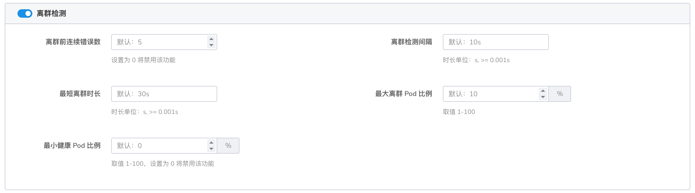

        配置成功后，当出现集群宕机时，会自动摘除宕机集群的实例，不会出现卡顿现象。

    **网格的流量只打到部分集群上的测试服务**

    故障案例：托管网格有 2 个集群，已开启多云互联，成功配置后；
    通过入口网关持续访问测试服务，流量只打到一部分集群的测试服务。

    **原因分析**

    1. 部分测试服务状态异常，检查服务状态
    2. 部分测试服务未注入边车，检查服务边车注入状态
    3. 部分测试服务的配置不正确，检查服务配置，如 svc 的端口、端口名称等
    4. 测试服务创建后才开启的多云互联

    **解决方案**

    1. 检查服务异常原因，让服务状态恢复正常
    2. 注入边车
    3. 所有测试服务的 svc 配置一致，可通过 __服务管理__ -> __服务列表__ 的诊断功能协助观察

        

    4. 重启所有网关，包括自建以及数据面集群的南北以及东西网关

        

??? "边车占用大量内存"

    造成这种问题的情况有几种：

    **情况 1**

    未开启边车发现范围的命名空间隔离功能。边车缓存了网格所有服务的信息，当网格集群规模较大，服务发现规则较多，就会占用大量内存。
    建议开启，在创建网格时或 __网格概览__ -> __编辑边车__ 信息里面选择。针对跨命名空间访问的情况，在 __边车管理__ -> __命名空间__ ，对单个命名空间进行配置。

    

    

    **情况 2**

    经过边车的流量规模较大，请求延迟高，响应体文本大，都会占用更多的内存，可以通过监控拓扑查看确认情况。

    

    **情况 3**

    边车内存泄漏。通过监控组件查看，比如 DCE 组件 Insight 等。
    若集群规模流量未变化，边车内存占用不断上升，则可能是内存泄漏，联系我们以定位问题。

    

??? "创建网格时，集群列表存在未知集群"

    造成这种问题的原因有几种：

    - **原因** ：未知集群卸载不久，集群信息同步任务还未触发。

        **分析** ：可能是未知集群的网格实例还处于卸载中的状态，等待网格实例卸载完成。

        **解决办法** ：此时只需自动触发集群信息同步即可。

    - **原因** ：集群卸载有残留。

        **解决办法** ：确定未知集群已不存在，手动删除残留集群信息，登录全局服务集群 `kpanda-global-cluster`，执行以下命令：

        ```bash
        kubectl -n mspider-system get mc
        kubectl -n mspider-system delete mc jy-test
        ```

        

??? "托管网格 APIServer 证书过期处理办法"

    **问题现象**

    为了安全起见，托管网格的证书的有效期仅为一年，我们需要定期重新生成证书以确保集群服务正常。

    如果在界面发现网格状态异常，且查看控制面集群的 hosted-apiserver 日志，发现类似以下的信息：

    ```info
    x509：certificate has expired or is not yet valid
    MspiderHostedKubeAPICertExpiration
    ```

    则表示证书已过期或即将过期，需要更换。

    **影响范围**

    证书过期不会影响业务正常运行，但是会影响策略下发、应用新建或重启等操作，需要及时更换。

    **修复方案**

    对于已经安装的网格，我们需要手动处理证书更新的过程。

    首先，根据下面的 yaml，替换其中所有的 `MESH_ID` 为网格 ID（界面上的名字，如 hosted-demo）。

    ```yaml
    apiVersion: batch/v1
    kind: Job
    metadata:
      name: MESH_ID-hosted-apiserver-certs-renew
      namespace: istio-system
    spec:
      parallelism: 1
      completions: 1
      template:
        spec:
          serviceAccountName: mspider-mcpc
          restartPolicy: Never
          volumes:
            - name: etcd-certs
              secret:
                secretName: MESH_ID-etcd-certs
            - name: kube-certs
              secret:
                secretName: MESH_ID-kube-certs
          containers:
            - name: init-certs
              image: release.daocloud.io/mspider/self-hosted-apiserver:0.0.13
              imagePullPolicy: IfNotPresent
              env:
                - name: MESH_ID
                  value: MESH_ID
                - name: KUBE_CERT_SECRET
                  value: MESH_ID-kube-certs
                - name: ETCD_CERT_SECRET
                  value: MESH_ID-etcd-certs
                - name: KUBECONFIG_SECRET
                  value: MESH_ID-apiserver-admin-kubeconfig
                - name: EXT_SANS
                  value: MESH_ID-hosted-apiserver,MESH_ID-hosted-apiserver.istio-system,MESH_ID-hosted-apiserver.istio-system.svc,MESH_ID-hosted-apiserver.istio-system.svc.cluster.local
              command:
              - bash
              - -c
              volumeMounts:
                - name: etcd-certs
                  mountPath: /etc/kubernetes/pki/etcd
                - name: kube-certs
                  mountPath: /etc/kubernetes/pki
              args:
              - |-
                set -ex
                cd /etc/kubernetes/pki
                if [ ! -f ca.crt ]; then
                  echo "ca.crt not found"
                  exit 1
                fi
                d=$(mktemp -d)
                cp -Lrf /etc/kubernetes/pki/* ${d}
                cd ${d}
                # renew certs
                kubeadm  certs renew all --cert-dir ${d}
                files=$(for a in $(find . -maxdepth 1 -type f); do echo -n " --from-file $a "; done)
                cat > /tmp/secret-patch.json <<EOF
                {"data": $(kubectl create secret generic ${KUBE_CERT_SECRET} ${files} --dry-run -o jsonpath='{.data}')}
                EOF
                kubectl patch secrets ${KUBE_CERT_SECRET} --type merge --patch-file /tmp/secret-patch.json

                files=$(for a in $(find etcd -maxdepth 1 -type f); do echo -n " --from-file $a "; done)
                cat > /tmp/secret-patch.json <<EOF
                {"data": $(kubectl create secret generic ${ETCD_CERT_SECRET} ${files} --dry-run -o jsonpath='{.data}')}
                EOF
                kubectl patch secrets ${ETCD_CERT_SECRET} --type merge --patch-file /tmp/secret-patch.json

                kubeadm init phase kubeconfig admin --cert-dir ${d} --kubeconfig-dir ${d}
                cp admin.conf config
                sed -i 's#server: .*#server: https://MESH_ID-hosted-apiserver:6443#g' config
                cat > /tmp/secret-patch.json <<EOF
                {"data": $(kubectl create secret generic ${KUBECONFIG_SECRET} --from-file config --dry-run -o jsonpath='{.data}')}
                EOF
                kubectl patch secrets ${KUBECONFIG_SECRET} --type merge --patch-file /tmp/secret-patch.json
    ```

    其次，在托管网格控制面集群（可在网格列表中查看）中，创建这个 Job，等待执行成功。
    成功后需要重启 istio-system 命名空间下的 istiod、hosted-apiserver、etcd、ckube-remote 组件。

    **重启这些组件不会影响业务正常服务。**

    **验证**

    - 界面网格状态
    - 删除创建网格相关资源能够正常工作

??? "服务网格中常见的 503 报错"

    **偶发 503**

    **使用自定义监控指标，每当配置变更时，日志监控发现少量请求出现 503**

    **问题原因**

    自定义指标功能的逻辑是通过生成一个对应的 EnvoyFiter 来进行 `istio.stats` 的配置更新。
    该配置在 Envoy Listener 级别生效，即通过 LDS 同步生效。Envoy 在应用 Listener 级别的配置时，
    需要断开已有连接。对应的在途请求因为连接被 Reset 或 Close 导致出现 503。

    **解决办法**

    上游 Server 主动 Close 连接时，您看到的 503 并非上游 Server 发送，而是客户端边车因为上游连接主动断开，由本地返回的响应。

    Istio 默认的重试配置中未包含“上游 Server 主动 Close 连接”的情况。EnvoyProxy 的重试条件中，
    Reset 符合这种情况对应的触发条件。因此，您需要为对应服务的路由配置 retry Policy。
    在 VirtualService 下的 retry Policy 配置包含 Reset 的触发条件。

    配置示例如下。该配置仅针对 Ratings 服务生效。

    ```yaml
    apiVersion: networking.istio.io/v1beta1
    kind: VirtualService
    metadata:
      name: ratings-route
    spec:
      hosts:
        - ratings.prod.svc.cluster.local
      http:
        - route:
            - destination:
                host: ratings.prod.svc.cluster.local
                subset: v1
          retries:
            attempts: 2
            retryOn: connect-failure,refused-stream,unavailable,cancelled,retriable-status-codes,reset,503
    ```

    **相关 FAQ**

    **为什么 Istio 默认的重试机制未生效？**

    Istio 默认重试发生的条件如下。默认会重试 2 次。该场景未在重试条件内，因此未生效。

    ```yaml
    "retry_policy":
      {
        "retry_on": "connect-failure,refused-stream,unavailable,cancelled,retriable-status-codes",
        "num_retries": 2,
        "retry_host_predicate":
          [{ "name": "envoy.retry_host_predicates.previous_hosts" }],
        "host_selection_retry_max_attempts": "5",
        "retriable_status_codes": [503],
      }
    ```

    - **connect-failure**：连接失败。
    - **refused-stream**：当 HTTP2 Stream 流返回 `REFUSED_STREAM` 错误码。
    - **unavailable**：当 gRPC 请求返回 `unavailable` 错误码。
    - **cancelled**：当 gRPC 请求返回 `cancelled` 错误码。
    - **retriable-status-codes**：当请求返回的 `status_code` 和 `retriable_status_codes` 配置下定义的错误码匹配。

    关于最新版本的 EnvoyProxy 完整的重试条件，请参见以下文档。

    - HTTP 已有的重试条件配置（包含 HTTP2 和 HTTP3）：
      [Router](https://www.envoyproxy.io/docs/envoy/latest/configuration/http/http_filters/router_filter#x-envoy-retry-on)
    - gRPC 独有的重试条件配置：
      [x-envoy-retry-grpc-on](https://www.envoyproxy.io/docs/envoy/latest/configuration/http/http_filters/router_filter#config-http-filters-router-x-envoy-retry-grpc-on)

    **偶发 503，没有规律，在此过程中并未发生配置变更**

    503 偶尔出现，但是在流量密集时，会持续出现。通常出现在边车的 Inbound 侧。

    **问题原因**

    Envoy 的空闲连接保持时间和应用不匹配。Envoy 空闲连接时间默认为 1 小时。

    - Envoy 空闲连接时间过长，应用相对较短：

        应用已经结束空闲连接，但是 Envoy 认为没有结束。此时如果有新的连接，就会报 503UC。

    - Envoy 空闲连接时间过短，应用相对较长：

        这种情况不会导致 503。Envoy 认为之前的连接已经被关闭，因此会直接新建一个连接。

    **解决办法**

    **方案一：在 DestinationRule 中配置 idleTimeout**

    造成该问题的原因就是 idleTimeout 不匹配，因此在 DestinationRule 中配置 idleTimeout 属于比较根本的解决办法。

    如果配置了 idelTimeout，在 Outbound 和 Inbound 两侧都会生效，即 Outbound 和 Inbound 的 Sidecar
    都会存在 idleTimeout 的配置。如果客户端没有 Sidecar，idleTimeout 也会生效，并能够有效减少 503。

    配置建议：此配置与业务相关，太短会导致连接数过高。建议您配置为略短于业务应用真正的 idleTimeout 时间。

    **方案二：在 VirtualService 中配置重试**

    重试会重建连接，可以解决此问题。具体操作，请参见[场景一](../mspider/troubleshoot/503-issue.md#503_2)的解决办法。

    !!! important

        该操作为非幂等的请求，重试存在较大的风险，请谨慎操作。

    **边车生命周期相关**

    **问题原因**

    边车和业务容器生命周期导致，常发生于 Pod 重启。

    **解决办法**

    具体操作，请参见[边车生命周期](../mspider/troubleshoot/sidecar-lifecycle.md)。

    **必定 503**

    **应用监听 localhost**

    **问题原因**

    当集群中的应用监听 localhost 网络地址时，如果 localhost 是本地地址，会导致集群中的其他 Pod 无法对其进行正常访问。

    **解决办法**

    您可以通过对外暴露应用服务解决此问题。具体操作，请参见[如何使集群中监听 localhost 的应用被其他 Pod 访问](../mspider/troubleshoot/localhost-by-pod.md)。

    **启用边车后，健康检查总是失败，报错 503**

    **问题原因**

    在服务网格开启 mTLS 后，kubelet 向 Pod 发送的健康检查请求被边车拦截，而 kubelet 没有对应的 TLS 证书，导致健康检查失败。

    **解决办法**

    您可以通过配置端口健康检查流量免于经过边车代理解决此问题。

??? "如何使集群中监听 localhost 的应用被其它 Pod 访问"

    本文介绍如何在应用监听 localhost 的情况下，通过配置边车资源，使监听 localhost 的应用可以被集群中其它 Pod 通过 Service 访问。

    **问题现象**

    当部署在集群中的应用监听 localhost 时，即使通过 Service 暴露应用的服务端口，该服务也无法被集群中的其他 Pod 访问。

    不同语言的应用监听 localhost 示例如下：

    - Golang：net.Listen("tcp", "localhost:8080")
    - Node.js：http.createServer().listen(8080, "localhost")
    - Python：socket.socket().bind(("localhost", 8083))

    **问题原因**

    当集群中应用监听 localhost 网络地址时，由于 localhost 是本地地址，集群中的其它 Pod 对其访问不通是正常现象。

    **解决办法**

    您可以任选以下方式，对外暴露应用服务。

    - 方式一：修改应用监听的网络地址

        如果您希望应用提供的服务对外暴露，建议修改应用代码，将应用监听的网络地址从 localhost 改为 0.0.0.0。

    - 方式二：使用服务网格暴露监听 localhost 的服务

        如果您不希望修改应用代码，同时需要将监听 localhost 的应用暴露给集群中的其它 Pod，可以在创建边车时进行配置。

        请您按照实际情况对以下字段进行替换。

         | **字段**           | **说明**                              |
         | ------------------ | ------------------------------------- |
         | `{namespace}`      | 替换为应用部署所在的命名空间。        |
         | `{container_port}` | 替换为应用监听 localhost 的容器端口。 |
         | `{port}`           | 替换为应用的 Service 端口。           |
         | `{key} : {value}`  | 替换为选中应用 Pod 的标签。           |

         ```yaml
         apiVersion: networking.istio.io/v1beta1
         kind: Sidecar
         metadata:
           name: localhost-access
           namespace: { namespace }
         spec:
           ingress:
             - defaultEndpoint: "127.0.0.1:{container_port}"
               port:
                 name: tcp
                 number: { port }
                 protocol: TCP
           workloadSelector:
             labels:
               { key }: { value }
         ```

## 中间件

更多问题请参阅 [中间件](../middleware/index.md)。

### MySQL 排障

??? "MySQL 健康检查"

    > 如果您发现遇到的问题，未包含在 __故障排查__ 内，可以快速跳转到页面底部，提交您的问题。

    常规的 MySQL 健康状态检查，可以通过一句命令快速查看 MySQL 实例的整体状态:

    ```none
    kubectl get pod -n mcamel-system -Lhealthy,role | grep mysql
    ```

    输出类似于：

    ```
    mcamel-common-mysql-cluster-auto-2023-03-28t00-00-00-backujgg9m   0/1     Completed          0               27h
    mcamel-common-mysql-cluster-auto-2023-03-29t00-00-00-backusgf59   0/1     Completed          0               3h43m
    mcamel-common-mysql-cluster-mysql-0                               4/4     Running            6 (11h ago)     25h     yes       master
    mcamel-common-mysql-cluster-mysql-1                               4/4     Running            690 (11h ago)   4d20h   yes       replica
    mcamel-mysql-apiserver-9797c7f76-bvf5n                            2/2     Running            0               22h
    mcamel-mysql-ui-7ffd9dd8db-d5jfm                                  2/2     Running            0               25m
    mysql-operator-0                                                  2/2     Running            109 (47m ago)   2d21h
    ```

    如上所示，如果主备节点（ __master__ 和 __replica__ ）的状态均为 __yes__ ，说明 MySQL 为正常状态。

??? "MySQL Pod 问题"

    可以通过以下命令快速的查看当前集群上所有 __MySQL__ 实例的健康状态：

    ```bash
    kubectl get mysql -A
    ```

    输出类似于：

    ```bash
    NAMESPACE       NAME                          READY   REPLICAS   AGE
    ghippo-system   test                          True    1          3d
    mcamel-system   mcamel-common-mysql-cluster   False   2          62d
    ```
    针对不同的副本状态，排障方案如下文所述。

    **Pod running = 0/4，状态为 __Init:Error__**

    遇到此类问题时，首先应该查看 __master__ 节点的（sidecar）日志信息。

    ```bash
    kubectl get pod -n mcamel-system -Lhealthy,role | grep cluster-mysql | grep master | awk '{print $1}' | xargs -I {} kubectl logs -f {} -n mcamel-system -c sidecar
    ```

    ??? note "输出内容示例"

        ```none
        2023-02-09T05:38:56.208445-00:00 0 [Note] [MY-011825] [Xtrabackup] perl binary not found. Skipping the version check
        2023-02-09T05:38:56.208521-00:00 0 [Note] [MY-011825] [Xtrabackup] Connecting to MySQL server host: 127.0.0.1, user: sys_replication, password: set, port: not set, socket: not set
        2023-02-09T05:38:56.212595-00:00 0 [Note] [MY-011825] [Xtrabackup] Using server version 8.0.29
        2023-02-09T05:38:56.217325-00:00 0 [Note] [MY-011825] [Xtrabackup] Executing LOCK INSTANCE FOR BACKUP ...
        2023-02-09T05:38:56.219880-00:00 0 [ERROR] [MY-011825] [Xtrabackup] Found tables with row versions due to INSTANT ADD/DROP columns
        2023-02-09T05:38:56.219931-00:00 0 [ERROR] [MY-011825] [Xtrabackup] This feature is not stable and will cause backup corruption.
        2023-02-09T05:38:56.219940-00:00 0 [ERROR] [MY-011825] [Xtrabackup] Please check https://docs.percona.com/percona-xtrabackup/8.0/em/instant.html for more details.
        2023-02-09T05:38:56.219945-00:00 0 [ERROR] [MY-011825] [Xtrabackup] Tables found:
        2023-02-09T05:38:56.219951-00:00 0 [ERROR] [MY-011825] [Xtrabackup] keycloak/USER_SESSION
        2023-02-09T05:38:56.219956-00:00 0 [ERROR] [MY-011825] [Xtrabackup] keycloak/AUTHENTICATION_EXECUTION
        2023-02-09T05:38:56.219960-00:00 0 [ERROR] [MY-011825] [Xtrabackup] keycloak/AUTHENTICATION_FLOW
        2023-02-09T05:38:56.219968-00:00 0 [ERROR] [MY-011825] [Xtrabackup] keycloak/AUTHENTICATOR_CONFIG
        2023-02-09T05:38:56.219984-00:00 0 [ERROR] [MY-011825] [Xtrabackup] keycloak/CLIENT_SESSION
        2023-02-09T05:38:56.219991-00:00 0 [ERROR] [MY-011825] [Xtrabackup] keycloak/IDENTITY_PROVIDER
        2023-02-09T05:38:56.219998-00:00 0 [ERROR] [MY-011825] [Xtrabackup] keycloak/PROTOCOL_MAPPER
        2023-02-09T05:38:56.220005-00:00 0 [ERROR] [MY-011825] [Xtrabackup] keycloak/RESOURCE_SERVER_SCOPE
        2023-02-09T05:38:56.220012-00:00 0 [ERROR] [MY-011825] [Xtrabackup] keycloak/REQUIRED_ACTION_PROVIDER
        2023-02-09T05:38:56.220018-00:00 0 [ERROR] [MY-011825] [Xtrabackup] keycloak/COMPONENT
        2023-02-09T05:38:56.220027-00:00 0 [ERROR] [MY-011825] [Xtrabackup] keycloak/RESOURCE_SERVER
        2023-02-09T05:38:56.220036-00:00 0 [ERROR] [MY-011825] [Xtrabackup] keycloak/CREDENTIAL
        2023-02-09T05:38:56.220043-00:00 0 [ERROR] [MY-011825] [Xtrabackup] keycloak/FED_USER_CREDENTIAL
        2023-02-09T05:38:56.220049-00:00 0 [ERROR] [MY-011825] [Xtrabackup] keycloak/MIGRATION_MODEL
        2023-02-09T05:38:56.220054-00:00 0 [ERROR] [MY-011825] [Xtrabackup] keycloak/REALM
        2023-02-09T05:38:56.220062-00:00 0 [ERROR] [MY-011825] [Xtrabackup] keycloak/CLIENT
        2023-02-09T05:38:56.220069-00:00 0 [ERROR] [MY-011825] [Xtrabackup] keycloak/REALM_ATTRIBUTE
        2023-02-09T05:38:56.220075-00:00 0 [ERROR] [MY-011825] [Xtrabackup] keycloak/OFFLINE_USER_SESSION
        2023-02-09T05:38:56.220084-00:00 0 [ERROR] [MY-011825] [Xtrabackup] Please run OPTIMIZE TABLE or ALTER TABLE ALGORITHM=COPY on all listed tables to fix this issue.
        E0209 05:38:56.223635       1 deleg.go:144] sidecar "msg"="failed waiting for xtrabackup to finish" "error"="exit status 1"
        ```

    登录 __master__ 节点的 __MySQL__ ，执行 __alter__ 表结构：

    ```bash
    [root@master-01 ~]$ kubectl get pod -n mcamel-system -Lhealthy,role | grep cluster-mysql | grep master
    mcamel-common-mysql-cluster-mysql-0

    #获取密码
    [root@master-01 ~]$ kubectl get secret -n mcamel-system mcamel-common-mysql-cluster-secret -o=jsonpath='{.data.ROOT_PASSWORD}' | base64 -d

    [root@master-01 ~]$ kubectl exec -it mcamel-common-mysql-cluster-mysql-0 -n mcamel-system -c mysql -- /bin/bash

    # 注意：修改表结构需要root权限登录
    ~bash:mysql -uroot -p
    ```

    ??? note "SQL 语句如下"

        ```sql
        use keycloak;
        ALTER TABLE USER_SESSION ALGORITHM=COPY;
        ALTER TABLE AUTHENTICATION_EXECUTION ALGORITHM=COPY;
        ALTER TABLE AUTHENTICATION_FLOW ALGORITHM=COPY;
        ALTER TABLE AUTHENTICATOR_CONFIG ALGORITHM=COPY;
        ALTER TABLE CLIENT_SESSION ALGORITHM=COPY;
        ALTER TABLE IDENTITY_PROVIDER ALGORITHM=COPY;
        ALTER TABLE PROTOCOL_MAPPER ALGORITHM=COPY;
        ALTER TABLE RESOURCE_SERVER_SCOPE ALGORITHM=COPY;
        ALTER TABLE REQUIRED_ACTION_PROVIDER ALGORITHM=COPY;
        ALTER TABLE COMPONENT ALGORITHM=COPY;
        ALTER TABLE RESOURCE_SERVER ALGORITHM=COPY;
        ALTER TABLE CREDENTIAL ALGORITHM=COPY;
        ALTER TABLE FED_USER_CREDENTIAL ALGORITHM=COPY;
        ALTER TABLE MIGRATION_MODEL ALGORITHM=COPY;
        ALTER TABLE REALM ALGORITHM=COPY;
        ALTER TABLE CLIENT ALGORITHM=COPY;
        ALTER TABLE REALM_ATTRIBUTE ALGORITHM=COPY;
        ALTER TABLE OFFLINE_USER_SESSION ALGORITHM=COPY
        ```

    **Pod running = 2/4**

    此类问题很可能是因为 MySQL 实例使用的磁盘用量达到了 100%，可以在 __master__ 节点上运行以下命令检测磁盘用量。

    ```bash
    kubectl get pod -n mcamel-system | grep cluster-mysql | awk '{print $1}' | xargs -I {} kubectl exec {} -n mcamel-system -c sidecar -- df -h | grep /var/lib/mysql
    ```

    输出类似于：

    ```console
    /dev/drbd43001            50G   30G   21G  60% /var/lib/mysql
    /dev/drbd43005            80G   29G   52G  36% /var/lib/mysql
    ```

    如果发现某个  PVC 满了，则需要为 PVC 扩容。

    ```bash
    kubectl edit pvc data-mcamel-common-mysql-cluster-mysql-0 -n mcamel-system # 修改request大小即可
    ```

    **Pod running = 3/4**

    

    使用 __kubectl describe__ 上图中框起来的 Pod，发现异常提示： __Warning Unhealthy 4m50s (x7194 over 3h58m) kubelet Readiness probe failed: __

    此时需要手工进行修复，这是目前开源 __mysql-operator__ 版本的 [Bug](https://github.com/bitpoke/mysql-operator/pull/857)

    修复方式有两种：

    - 重启 __mysql-operator__ ，或者
    - 手工更新 __sys_operator__ 的配置状态

    ```bash
    kubectl exec mcamel-common-mysql-cluster-mysql-1 -n mcamel-system -c mysql -- mysql --defaults-file=/etc/mysql/client.conf -NB -e 'update sys_operator.status set value="1"  WHERE name="configured"'
    ```

??? "MySQL Operator 问题"

    **未指定 __storageClass__**

    由于没有指定 __storageClass__ ，导致 __mysql-operator__ 无法获取 PVC 而处于 __pending__ 状态。

    如果采用 Helm 启动，可以做如下设置：

    1. 关闭 PVC 的申请

        ```console
        orchestrator.persistence.enabled=false
        ```

    2. 指定 storageClass 去获取 PVC

        ```console
        orchestrator.persistence.storageClass={storageClassName}
        ```

    如果使用其他工具，可以修改 __value.yaml__ 内对应字段，即可达到和 Helm 启动一样的效果。

??? "MySQL 主备关系问题"

    MySQL 的主备关系故障相对比较复杂，基于不同现象，会有不同的解决方案。

    1. 执行以下命令确认 MySQL 状态:

        ```bash
        kubectl get mysql -A
        ```

        输出类似于：

        ```
        NAMESPACE       NAME                          READY   REPLICAS   AGE
        ghippo-system   test                          True    1          3d
        mcamel-system   mcamel-common-mysql-cluster   False   2          62d
        ```

    2. 关注 __Ready__ 字段值为 __False__ 的库 (这里为 __True__ 的判断是延迟小于 30s 同步)，查看 MySQL 从库的日志

        ```bash
        kubectl get pod -n mcamel-system -Lhealthy,role | grep cluster-mysql | grep replica | awk '{print $1}' | xargs -I {} kubectl logs {} -n mcamel-system -c mysql | grep ERROR
        ```

    当实例状态为 __False__ 时，可能存在以下几类故障，可以结合库日志信息排查修复。

    **实例状态为 __false__ 但日志无报错信息**

    如果从库的日志中没有任何错误 __ERROR__ 信息，说明 __False__ 只是因为主从同步的延迟过大，可对从库执行以下命令进一步排查：

    1. 寻找到从节点的 Pod

        ```bash
        kubectl get pod -n mcamel-system -Lhealthy,role | grep cluster-mysql | grep replica | awk '{print $1}'
        ```

        输出类似于：

        ```
        mcamel-common-mysql-cluster-mysql-1
        ```

    1. 设置 __binlog__ 参数

        ```bash
        kubectl exec mcamel-common-mysql-cluster-mysql-1 -n mcamel-system -c mysql -- mysql --defaults-file=/etc/mysql/client.conf -NB -e 'set global sync_binlog=10086;'
        ```

    1. 进入 MySQL 的容器

        ```bash
        kubectl exec -it mcamel-common-mysql-cluster-mysql-1 -n mcamel-system -c mysql -- mysql --defaults-file=/etc/mysql/client.conf
        ```

    1. 在 MySQL 容器中执行查看命令，获取从库状态。

        `Seconds_Behind_Master` 字段为主从延迟，如果取值在 0~30，可以认为没有延迟；表示主从可以保持同步。

        ```sql
        mysql> show slave status\G;
        *************************** 1. row ***************************
                       Slave_IO_State: Waiting for source to send event
                          Master_Host: mcamel-common-mysql-cluster-mysql-0.mysql.mcamel-system
                          Master_User: sys_replication
                          Master_Port: 3306
                        Connect_Retry: 1
                      Master_Log_File: mysql-bin.000304
                  Read_Master_Log_Pos: 83592007
                       Relay_Log_File: mcamel-common-mysql-cluster-mysql-1-relay-bin.000002
                        Relay_Log_Pos: 83564355
                Relay_Master_Log_File: mysql-bin.000304
                     Slave_IO_Running: Yes
                    Slave_SQL_Running: Yes
                      Replicate_Do_DB:
                  Replicate_Ignore_DB:
                   Replicate_Do_Table:
               Replicate_Ignore_Table:
              Replicate_Wild_Do_Table:
          Replicate_Wild_Ignore_Table:
                           Last_Errno: 0
                           Last_Error:
                         Skip_Counter: 0
                  Exec_Master_Log_Pos: 83564299
                      Relay_Log_Space: 83592303
                      Until_Condition: None
                       Until_Log_File:
                        Until_Log_Pos: 0
                   Master_SSL_Allowed: No
                   Master_SSL_CA_File:
                   Master_SSL_CA_Path:
                      Master_SSL_Cert:
                    Master_SSL_Cipher:
                       Master_SSL_Key:
                Seconds_Behind_Master: 0
        Master_SSL_Verify_Server_Cert: No
                        Last_IO_Errno: 0
                        Last_IO_Error:
                       Last_SQL_Errno: 0
                       Last_SQL_Error:
          Replicate_Ignore_Server_Ids:
                     Master_Server_Id: 100
                          Master_UUID: e17dae09-8da0-11ed-9104-c2f9484728fd
                     Master_Info_File: mysql.slave_master_info
                            SQL_Delay: 0
                  SQL_Remaining_Delay: NULL
              Slave_SQL_Running_State: Replica has read all relay log; waiting for more updates
                   Master_Retry_Count: 86400
                          Master_Bind:
              Last_IO_Error_Timestamp:
             Last_SQL_Error_Timestamp:
                       Master_SSL_Crl:
                   Master_SSL_Crlpath:
                   Retrieved_Gtid_Set: e17dae09-8da0-11ed-9104-c2f9484728fd:21614244-21621569
                    Executed_Gtid_Set: 4bc2107c-819a-11ed-bf23-22be07e4eaff:1-342297,
        7cc717ea-7c1b-11ed-b59d-c2ba3f807d12:1-619197,
        a5ab763a-7c1b-11ed-b5ca-522707642ace:1-178069,
        a6045297-8743-11ed-8712-8e52c3ace534:1-4073131,
        a95cf9df-84d7-11ed-8362-5e8a1c335253:1-493942,
        b5175b1b-a2ac-11ed-b0c6-d6fbe05d7579:1-3754703,
        c4dc2b14-9ed9-11ed-ac61-36da81109699:1-945884,
        e17dae09-8da0-11ed-9104-c2f9484728fd:1-21621569
                       Auto_Position: 1
                Replicate_Rewrite_DB:
                        Channel_Name:
                  Master_TLS_Version:
              Master_public_key_path:
               Get_master_public_key: 0
                   Network_Namespace:
        1 row in set, 1 warning (0.00 sec)
        ```

    1. 主从同步后 __Seconds_Behind_Master__ 小于 30s，设置 __sync_binlog=1__

        ```bash
        kubectl exec mcamel-common-mysql-cluster-mysql-1 -n mcamel-system -c mysql -- mysql --defaults-file=/etc/mysql/client.conf -NB -e 'set global sync_binlog=1';
        ```

    1. 如果此时依然不见缓解，可以查看从库的宿主机负载或者 IO 是否太高，执行以下命令：

        ```bash
        [root@master-01 ~]$ uptime
        11:18  up 1 day, 17:49, 2 users, load averages: 9.33 7.08 6.28
        ```

        __load averages__ 在正常情况下 3 个数值都不应长期超过 10；如果超过 30 以上，请合理调配下该节点的 Pod 和磁盘。

    **从库日志出现 __复制错误__**

    如果从库 Pod 日志中出现从库复制错误，可能由多种原因引起，下文将针对不同情况介绍判断及修复方法。

    **purged binlog 错误**

    注意以下示例，如果出现关键字 __purged binlog__ ，通常需要对从库执行重建处理。

    ```bash
    [root@demo-alpha-master-01 /]$ kubectl get pod -n mcamel-system -Lhealthy,role | grep cluster-mysql | grep replica | awk '{print $1}' | xargs -I {} kubectl logs {} -n mcamel-system -c mysql | grep ERROR
    2023-02-08T18:43:21.991730Z 116 [ERROR] [MY-010557] [Repl] Error reading packet from server for channel '': Cannot replicate because the master purged required binary logs. Replicate the missing transactions from elsewhere, or provision a new slave from backup. Consider increasing the master's binary log expiration period. The GTID sets and the missing purged transactions are too long to print in this message. For more information, please see the master's error log or the manual for GTID_SUBTRACT (server_errno=1236)
    2023-02-08T18:43:21.991777Z 116 [ERROR] [MY-013114] [Repl] Slave I/O for channel '': Got fatal error 1236 from master when reading data from binary log: 'Cannot replicate because the master purged required binary logs. Replicate the missing transactions from elsewhere, or provision a new slave from backup. Consider increasing the master's binary log expiration period. The GTID sets and the missing purged transactions are too long to print in this message. For more information, please see the master's error log or the manual for GTID_SUBTRACT', Error_code: MY-013114
    ```

    重建操作如下：

    1. 寻找从节点的 Pod

        ```bash
        [root@master-01 ~]$ kubectl get pod -n mcamel-system -Lhealthy,role | grep cluster-mysql | grep replica | awk '{print $1}'
        mcamel-common-mysql-cluster-mysql-1
        ```

    2. 寻找从节点的  PVC

        ```bash
        [root@master-01 /]$ kubectl get pvc -n mcamel-system | grep mcamel-common-mysql-cluster-mysql-1
        data-mcamel-common-mysql-cluster-mysql-1                                        Bound    pvc-5840569e-834f-4236-a5c6-878e41c55c85   50Gi       RWO            local-path                   33d
        ```

    3. 删除从节点的 PVC

        ```bash
        [root@master-01 /]$ kubectl delete pvc data-mcamel-common-mysql-cluster-mysql-1 -n mcamel-system
        persistentvolumeclaim "data-mcamel-common-mysql-cluster-mysql-1" deleted
        ```

    4. 删除从库的 Pod

        ```bash
        [root@master-01 /]$ kubectl delete pod mcamel-common-mysql-cluster-mysql-1 -n mcamel-system
        pod "mcamel-common-mysql-cluster-mysql-1" deleted
        ```

    **主键冲突错误**

    运行命令时出现以下错误提示：

    ```bash
    [root@demo-alpha-master-01 /]$ kubectl get pod -n mcamel-system -Lhealthy,role | grep cluster-mysql | grep replica | awk '{print $1}' | xargs -I {} kubectl logs {} -n mcamel-system -c mysql | grep ERROR
    2023-02-08T18:43:21.991730Z 116 [ERROR] [MY-010557] [Repl] Could notexecute Write_rows event on table dr_brower_db.dr_user_info; Duplicate entry '24' for key 'PRIMARY', Error_code:1062; handler error HA_ERR_FOUND_DUPP_KEY; the event's master logmysql-bin.000010, end_log_pos 5295916
    ```

    在错误日志中看到 `Duplicate entry '24' for key 'PRIMARY', Error_code:1062; handler error HA_ERR_FOUND_DUPP_KEY;`

    这说明出现了主键冲突，或者主键不存在的错误。此时，可以以幂等模式恢复或插入空事务的形式跳过错误：

    **方法1**：幂等模式恢复

    1. 寻找到从节点的 Pod

        ```bash
        [root@master-01 ~]$ kubectl get pod -n mcamel-system -Lhealthy,role | grep cluster-mysql | grep replica | awk '{print $1}'
        mcamel-common-mysql-cluster-mysql-1
        ```

    2. 设置 mysql 幂等模式

        ```bash
        [root@master-01 ~]$ kubectl exec mcamel-common-mysql-cluster-mysql-1 -n mcamel-system -c mysql -- mysql --defaults-file=/etc/mysql/client.conf -NB -e 'stop slave;set global slave_exec_mode="IDEMPOTENT";set global sync_binlog=10086;start slave;'
        ```

    **方法 2** ：插入空事务跳过错误

    ```sql
    mysql> stop slave;
    mysql> SET @@SESSION.GTID_NEXT= 'xxxxx:105220'; /* 具体数值，在日志里面提到 */
    mysql> BEGIN;
    mysql> COMMIT;
    mysql> SET SESSION GTID_NEXT = AUTOMATIC;
    mysql> START SLAVE;
    ```

    执行完成以上操作后，观察从库重建的进度：

    ```bash
    # 进入 mysql 的容器
    [root@master-01 ~]$ kubectl exec -it mcamel-common-mysql-cluster-mysql-1 -n mcamel-system -c mysql -- mysql --defaults-file=/etc/mysql/client.conf
    ```

    执行以下命令，查看从库的主从延迟状态字段 __Seconds_Behind_Master__ ，如果取值在 0~30，表示已没有主从延迟，主库和从库基本保持同步。

    ```sql
    mysql> show slave status\G;
    ```

    确认主从同步后 (Seconds_Behind_Master 小于 30s)，执行以下命令，设定 MySQL 严格模式：

    ```bash
    [root@master-01 ~]$ kubectl exec mcamel-common-mysql-cluster-mysql-1 -n mcamel-system -c mysql -- mysql --defaults-file=/etc/mysql/client.conf -NB -e 'stop slave;set global slave_exec_mode="STRICT";set global sync_binlog=10086;start slave;
    ```

    **主从库复制错误**

    当从库出现类似 `[Note] Slave: MTS group recovery relay log info based on Worker-Id 0, group_r` 的错误信息，可以执行如下操作：

    1. 寻找到从节点的 Pod

        ```shell
        [root@master-01 ~]# kubectl get pod -n mcamel-system -Lhealthy,role | grep cluster-mysql | grep replica | awk '{print $1}'
        mcamel-common-mysql-cluster-mysql-1
        ```

    2. 设置让从库跳过这个日志继续复制

        ```shell
        [root@master-01 ~]# kubectl exec mcamel-common-mysql-cluster-mysql-1 -n mcamel-system -c mysql -- mysql --defaults-file=/etc/mysql/client.conf -NB -e 'stop slave;reset slave;change master to MASTER_AUTO_POSITION = 1;start slave;';
        ```

    !!! tip

        1. 这种情况可以以幂等模式执行
        2. 此种类型错误也可以重做从库

    **主备 Pod 均为 __replica__**

    1. 通过以下命令，发现两个 MySQL 的 Pod均为 __replica__ 角色，需修正其中一个为 __master__ 。

        ```bash
        [root@aster-01 ~]$ kubectl get pod -n mcamel-system -Lhealthy,role|grep mysql
        mcamel-common-mysql-cluster-mysql-0                          4/4     Running   5 (16h ago)   16h   no       replica
        mcamel-common-mysql-cluster-mysql-1                          4/4     Running   6 (16h ago)   16h   no       replica
        mysql-operator-0                                             2/2     Running   1 (16h ago)   16h
        ```

    1. 进入 MySQL 查看：

        ```bash
        kubectl exec -it mcamel-common-mysql-cluster-mysql-0 -n mcamel-system -c mysql -- mysql --defaults-file=/etc/mysql/client.conf
        ```

    1. 查看 __slave__ 的状态信息，查询结果为空的就是原来的 __master__ ，如下方示例中 __mysql-0__ 对应的内容:

        ```sql
        -- mysql-0
        mysql> show slave status\G;
        empty set, 1 warning (0.00 sec)

        -- mysql-1
        mysql> show slave status\G;
        *************************** 1. row ***************************
                       Slave_IO_State: Waiting for source to send event
                          Master_Host: mcamel-common-mysql-cluster-mysql-0.mysql.mcamel-system
                          Master_User: sys_replication
                          Master_Port: 3306
                        Connect_Retry: 1
                      Master_Log_File: mysql-bin.000004
                  Read_Master_Log_Pos: 38164242
                       Relay_Log_File: mcamel-common-mysql-cluster-mysql-1-relay-bin.000002
                        Relay_Log_Pos: 38164418
                Relay_Master_Log_File: mysql-bin.000004
                     Slave_IO_Running: Yes
                    Slave_SQL_Running: Yes
                      Replicate_Do_DB:
                  Replicate_Ignore_DB:
                   Replicate_Do_Table:
               Replicate_Ignore_Table:
              Replicate_Wild_Do_Table:
          Replicate_Wild_Ignore_Table:
                           Last_Errno: 0
                           Last_Error:
                         Skip_Counter: 0
                  Exec_Master_Log_Pos: 38164242
                      Relay_Log_Space: 38164658
                      Until_Condition: None
                       Until_Log_File:
                        Until_Log_Pos: 0
                   Master_SSL_Allowed: No
                   Master_SSL_CA_File:
                   Master_SSL_CA_Path:
                      Master_SSL_Cert:
                    Master_SSL_Cipher:
                       Master_SSL_Key:
                Seconds_Behind_Master: 0
        Master_SSL_Verify_Server_Cert: No
                        Last_IO_Errno: 0
                        Last_IO_Error:
                       Last_SQL_Errno: 0
                       Last_SQL_Error:
          Replicate_Ignore_Server_Ids:
                     Master_Server_Id: 100
                          Master_UUID: c16da70b-ad12-11ed-8084-0a580a810256
                     Master_Info_File: mysql.slave_master_info
                            SQL_Delay: 0
                  SQL_Remaining_Delay: NULL
              Slave_SQL_Running_State: Replica has read all relay log; waiting for more updates
                   Master_Retry_Count: 86400
                          Master_Bind:
              Last_IO_Error_Timestamp:
             Last_SQL_Error_Timestamp:
                       Master_SSL_Crl:
                   Master_SSL_Crlpath:
                   Retrieved_Gtid_Set: c16da70b-ad12-11ed-8084-0a580a810256:537-59096
                    Executed_Gtid_Set: c16da70b-ad12-11ed-8084-0a580a810256:1-59096
                        Auto_Position: 1
                 Replicate_Rewrite_DB:
                         Channel_Name:
                   Master_TLS_Version:
               Master_public_key_path:
                Get_master_public_key: 0
                    Network_Namespace:
        1 row in set, 1 warning (0.01 sec)
        ```

    1. 针对 master 的 mysql shell 执行重置操作：

        ```sql
        mysql > stop slave;reset slave;
        ```

    1. 此时再手动编辑 master 的 Pod： __role replica => master ,healthy no => yes__ 。

    1. 针对 slave 的 mysql shell 执行：

        ```sql
        mysql > start slave;
        ```

    1. 如果主从没有建立联系，在 slave 的 mysql shell 执行：

        ```sql
        -- 注意替换下 {master-host-pod-index}
        mysql > change master to master_host='mcamel-common-mysql-cluster-mysql-{master-host-pod-index}.mysql.mcamel-system',master_port=3306,master_user='root',master_password='{password}',master_auto_position=1,MASTER_HEARTBEAT_PERIOD=2,MASTER_CONNECT_RETRY=1, MASTER_RETRY_COUNT=86400;
        ```

    **主备数据不一致**

    当主从实例数据不一致时，可以执行以下命令完成主从一致性同步：

    ```sql
    pt-table-sync --execute --charset=utf8 --ignore-databases=mysql,sys,percona --databases=amamba,audit,ghippo,insight,ipavo,keycloak,kpanda,skoala dsn=u=root,p=xxx,h=mcamel-common-kpanda-mysql-cluster-mysql-0.mysql.mcamel-system,P=3306 dsn=u=root,p=xxx,h=mcamel-common-kpanda-mysql-cluster-mysql.mysql.mcamel-system,P=3306  --print

    pt-table-sync --execute --charset=utf8 --ignore-databases=mysql,sys,percona --databases=kpanda dsn=u=root,p=xxx,h=mcamel-common-kpanda-mysql-cluster-mysql-0.mysql.mcamel-system,P=3306 dsn=u=root,p=xxx,h=mcamel-common-kpanda-mysql-cluster-mysql-1.mysql.mcamel-system,P=3306  --print
    ```

    使用 pt-table-sync 即可完成数据补充，示例中是 __mysql-0=> mysql-1__ 补充数据。

    这种场景往往适用于主从切换，发现新从库有多余的已执行的 gtid 在重做之前补充数据。

    这种补充数据只能保证数据不丢失，如果新主库已经删除的数据会被重新补充回去，是一个潜在的风险，如果是新主库有数据，会被替换成老数据，也是一个风险。

??? "MySQL MGR 参数配置问题"

    在配置 MySQL Group Replication（MGR）时，为了增加配置的灵活性和向后兼容性，部分参数需要使用 `loose_` 前缀。MySQL 中有些参数可能是实验性的或仅用于特定场景。在这些情况下，使用 loose_ 前缀可以确保这些参数在不支持的环境下被忽略。

    **具体示例**

    以下是一个使用 loose_ 前缀配置 MySQL Group Replication 的示例：

    ```ini
    [mysqld]
    # Enable Group Replication
    loose_group_replication_start_on_boot=off
    loose_group_replication_bootstrap_group=off
    loose_group_replication_group_name="aaaaaaaa-bbbb-cccc-dddd-eeeeeeeeeeee"
    loose_group_replication_local_address="192.168.0.1:33061"
    loose_group_replication_group_seeds="192.168.0.1:33061,192.168.0.2:33061,192.168.0.3:33061"
    loose_group_replication_single_primary_mode=on
    loose_group_replication_enforce_update_everywhere_checks=off

    # Group Replication SSL settings (optional)
    loose_group_replication_ssl_mode=REQUIRED
    loose_group_replication_ssl_ca=ca.pem
    loose_group_replication_ssl_cert=server-cert.pem
    loose_group_replication_ssl_key=server-key.pem

    # Other necessary settings
    binlog_checksum=NONE
    binlog_format=ROW
    log_slave_updates=ON
    gtid_mode=ON
    enforce_gtid_consistency=ON
    master_info_repository=TABLE
    relay_log_info_repository=TABLE
    transaction_write_set_extraction=XXHASH64
    ```

    !!! Info

        使用 `loose_`前缀是配置 MGR 参数时的一种安全做法，尤其是在不同版本或插件状态下运行时。它可以确保配置文件的兼容性和灵活性，避免不必要的启动错误。

??? "MySQL MGR 排障手册"

    **常用命令**

    **获取 root 密码**

    在 MySQL MGR 集群的命名空间下，查找以 `-mgr-secret` 结尾的 Secret 资源，这里以获取 `kpanda-mgr` 这个集群的 Secret 为例：

    ```shell
    kubectl get secrets/kpanda-mgr-mgr-secret -n mcamel-system --template={{.data.rootPassword}} | base64 -d
    root123!
    ```

    **查看集群状态**

    通过 MySQL 命令行查看：

    ```sql
    mysqlsh -uroot -pPassword -- cluster status
    ```

    ```json
    {
        "clusterName": "kpanda_mgr",
        "defaultReplicaSet": {
            "name": "default",
            "primary": "kpanda-mgr-2.kpanda-mgr-instances.mcamel-system.svc.cluster.local:3306",
            "ssl": "REQUIRED",
            "status": "OK",
            "statusText": "Cluster is ONLINE and can tolerate up to ONE failure.",
            "topology": {
                "kpanda-mgr-0.kpanda-mgr-instances.mcamel-system.svc.cluster.local:3306": {
                    "address": "kpanda-mgr-0.kpanda-mgr-instances.mcamel-system.svc.cluster.local:3306",
                    "memberRole": "SECONDARY",
                    "mode": "R/O",
                    "readReplicas": {},
                    "replicationLag": "applier_queue_applied",
                    "role": "HA",
                    "status": "ONLINE",
                    "version": "8.0.31"
                },
                "kpanda-mgr-1.kpanda-mgr-instances.mcamel-system.svc.cluster.local:3306": {
                    "address": "kpanda-mgr-1.kpanda-mgr-instances.mcamel-system.svc.cluster.local:3306",
                    "memberRole": "SECONDARY",
                    "mode": "R/O",
                    "readReplicas": {},
                    "replicationLag": "applier_queue_applied",
                    "role": "HA",
                    "status": "ONLINE",
                    "version": "8.0.31"
                },
                "kpanda-mgr-2.kpanda-mgr-instances.mcamel-system.svc.cluster.local:3306": {
                    "address": "kpanda-mgr-2.kpanda-mgr-instances.mcamel-system.svc.cluster.local:3306",
                    "memberRole": "PRIMARY",
                    "mode": "R/W",
                    "readReplicas": {},
                    "replicationLag": "applier_queue_applied",
                    "role": "HA",
                    "status": "ONLINE",
                    "version": "8.0.31"
                }
            },
            "topologyMode": "Single-Primary"
        },
        "groupInformationSourceMember": "kpanda-mgr-2.kpanda-mgr-instances.mcamel-system.svc.cluster.local:3306"
    }
    ```

    !!! note

        集群在正常情况下：

        - 所有的节点的status都为ONLINE状态。
        - 有一个节点的memberRole为PRIMARY，其他节点都为SECONDARY。

    用 SQL 语句查看：`SELECT * FROM performance_schema.replication_group_members\G`

    ```sql
    mysql> SELECT * FROM performance_schema.replication_group_members\G
    *************************** 1. row ***************************
                  CHANNEL_NAME: group_replication_applier
                     MEMBER_ID: 6f464f4e-ba96-11ee-a028-a225dc125542
                   MEMBER_HOST: kpanda-mgr-2.kpanda-mgr-instances.mcamel-system.svc.cluster.local
                   MEMBER_PORT: 3306
                  MEMBER_STATE: ONLINE
                   MEMBER_ROLE: PRIMARY
                MEMBER_VERSION: 8.0.31
    MEMBER_COMMUNICATION_STACK: MySQL
    *************************** 2. row ***************************
                  CHANNEL_NAME: group_replication_applier
                     MEMBER_ID: b3a53102-bfec-11ee-a821-0a8fb9f7d1ce
                   MEMBER_HOST: kpanda-mgr-0.kpanda-mgr-instances.mcamel-system.svc.cluster.local
                   MEMBER_PORT: 3306
                  MEMBER_STATE: ONLINE
                   MEMBER_ROLE: SECONDARY
                MEMBER_VERSION: 8.0.31
    MEMBER_COMMUNICATION_STACK: MySQL
    *************************** 3. row ***************************
                  CHANNEL_NAME: group_replication_applier
                     MEMBER_ID: bdddd16f-bfec-11ee-a7a4-324c8edaca40
                   MEMBER_HOST: kpanda-mgr-1.kpanda-mgr-instances.mcamel-system.svc.cluster.local
                   MEMBER_PORT: 3306
                  MEMBER_STATE: ONLINE
                   MEMBER_ROLE: SECONDARY
                MEMBER_VERSION: 8.0.31
    MEMBER_COMMUNICATION_STACK: MySQL
    3 rows in set (0.00 sec)
    ```

    **查看成员状态**

    查看成员状态：`SELECT * FROM performance_schema.replication_group_member_stats\G`

    ```sql
    mysql> SELECT * FROM performance_schema.replication_group_member_stats\G
    *************************** 1. row ***************************
                                  CHANNEL_NAME: group_replication_applier
                                       VIEW_ID: 17066729271025607:9
                                     MEMBER_ID: 6f464f4e-ba96-11ee-a028-a225dc125542
                   COUNT_TRANSACTIONS_IN_QUEUE: 0
                    COUNT_TRANSACTIONS_CHECKED: 4748638
                      COUNT_CONFLICTS_DETECTED: 0
            COUNT_TRANSACTIONS_ROWS_VALIDATING: 1109
            TRANSACTIONS_COMMITTED_ALL_MEMBERS: 6f464f4e-ba96-11ee-a028-a225dc125542:1-10,
    95201c7d-ba96-11ee-a018-bed74fb0bf8d:1-8,
    b438e224-ba96-11ee-bc57-bed74fb0bf8d:1-12516339,
    b439a7d3-ba96-11ee-bc57-bed74fb0bf8d:1-18
                LAST_CONFLICT_FREE_TRANSACTION: b438e224-ba96-11ee-bc57-bed74fb0bf8d:12519298
    COUNT_TRANSACTIONS_REMOTE_IN_APPLIER_QUEUE: 0
             COUNT_TRANSACTIONS_REMOTE_APPLIED: 6
             COUNT_TRANSACTIONS_LOCAL_PROPOSED: 4748638
             COUNT_TRANSACTIONS_LOCAL_ROLLBACK: 0
    *************************** 2. row ***************************
                                  CHANNEL_NAME: group_replication_applier
                                       VIEW_ID: 17066729271025607:9
                                     MEMBER_ID: b3a53102-bfec-11ee-a821-0a8fb9f7d1ce
                   COUNT_TRANSACTIONS_IN_QUEUE: 0
                    COUNT_TRANSACTIONS_CHECKED: 4514132
                      COUNT_CONFLICTS_DETECTED: 0
            COUNT_TRANSACTIONS_ROWS_VALIDATING: 1110
            TRANSACTIONS_COMMITTED_ALL_MEMBERS: 6f464f4e-ba96-11ee-a028-a225dc125542:1-10,
    95201c7d-ba96-11ee-a018-bed74fb0bf8d:1-8,
    b438e224-ba96-11ee-bc57-bed74fb0bf8d:1-12519027,
    b439a7d3-ba96-11ee-bc57-bed74fb0bf8d:1-18
                LAST_CONFLICT_FREE_TRANSACTION: b438e224-ba96-11ee-bc57-bed74fb0bf8d:12520590
    COUNT_TRANSACTIONS_REMOTE_IN_APPLIER_QUEUE: 0
             COUNT_TRANSACTIONS_REMOTE_APPLIED: 4514129
             COUNT_TRANSACTIONS_LOCAL_PROPOSED: 0
             COUNT_TRANSACTIONS_LOCAL_ROLLBACK: 0
    *************************** 3. row ***************************
                                  CHANNEL_NAME: group_replication_applier
                                       VIEW_ID: 17066729271025607:9
                                     MEMBER_ID: bdddd16f-bfec-11ee-a7a4-324c8edaca40
                   COUNT_TRANSACTIONS_IN_QUEUE: 0
                    COUNT_TRANSACTIONS_CHECKED: 4658713
                      COUNT_CONFLICTS_DETECTED: 0
            COUNT_TRANSACTIONS_ROWS_VALIDATING: 1093
            TRANSACTIONS_COMMITTED_ALL_MEMBERS: 6f464f4e-ba96-11ee-a028-a225dc125542:1-10,
    95201c7d-ba96-11ee-a018-bed74fb0bf8d:1-8,
    b438e224-ba96-11ee-bc57-bed74fb0bf8d:1-12519027,
    b439a7d3-ba96-11ee-bc57-bed74fb0bf8d:1-18
                LAST_CONFLICT_FREE_TRANSACTION: b438e224-ba96-11ee-bc57-bed74fb0bf8d:12520335
    COUNT_TRANSACTIONS_REMOTE_IN_APPLIER_QUEUE: 0
             COUNT_TRANSACTIONS_REMOTE_APPLIED: 4658715
             COUNT_TRANSACTIONS_LOCAL_PROPOSED: 0
             COUNT_TRANSACTIONS_LOCAL_ROLLBACK: 0
    3 rows in set (0.00 sec)
    ```

    **指定成员角色**

    1. 将某个节点指定为 PRIMARY。

        ```shell
        select group_replication_set_as_primary('4697c302-3e52-11ed-8e61-0050568a658a');
        ```

    2. `mysqlsh` 语法

        ```shell
        JS > var c=dba.getCluster()
        JS > c.status()
        JS > c.setPrimaryInstance('172.30.71.128:3306')
        ```

    **常见故障**

    **某个 SECONDARY 节点为非 ONLINE 状态**

    ```json
    {
        "clusterName": "mgr0117",
        "defaultReplicaSet": {
            "name": "default",
            "primary": "mgr0117-2.mgr0117-instances.m0103.svc.cluster.local:3306",
            "ssl": "REQUIRED",
            "status": "OK_NO_TOLERANCE_PARTIAL",
            "statusText": "Cluster is NOT tolerant to any failures. 1 member is not active.",
            "topology": {
                "mgr0117-0.mgr0117-instances.m0103.svc.cluster.local:3306": {
                    "address": "mgr0117-0.mgr0117-instances.m0103.svc.cluster.local:3306",
                    "instanceErrors": [
                        "NOTE: group_replication is stopped."
                    ],
                    "memberRole": "SECONDARY",
                    "memberState": "OFFLINE",
                    "mode": "R/O",
                    "readReplicas": {},
                    "role": "HA",
                    "status": "(MISSING)",
                    "version": "8.0.31"
                },
                "mgr0117-1.mgr0117-instances.m0103.svc.cluster.local:3306": {
                    "address": "mgr0117-1.mgr0117-instances.m0103.svc.cluster.local:3306",
                    "memberRole": "SECONDARY",
                    "mode": "R/O",
                    "readReplicas": {},
                    "replicationLag": "applier_queue_applied",
                    "role": "HA",
                    "status": "ONLINE",
                    "version": "8.0.31"
                },
                "mgr0117-2.mgr0117-instances.m0103.svc.cluster.local:3306": {
                    "address": "mgr0117-2.mgr0117-instances.m0103.svc.cluster.local:3306",
                    "memberRole": "PRIMARY",
                    "mode": "R/W",
                    "readReplicas": {},
                    "replicationLag": "applier_queue_applied",
                    "role": "HA",
                    "status": "ONLINE",
                    "version": "8.0.31"
                }
            },
            "topologyMode": "Single-Primary"
        },
        "groupInformationSourceMember": "mgr0117-2.mgr0117-instances.m0103.svc.cluster.local:3306"
    }
    ```

    这里看到对应的 address 字段是 mgr0117-0.mgr0117-instances.m0103.svc.cluster.local:3306，进入 mgr0117-0 这个 pod，执行

    ```sql
    mysql> start group_replication;
    Query OK, 0 rows affected (5.82 sec)
    ```

    这里如果数据量比较大，该节点会处于比较长时间的 RECOVERING 状态。

    **没有 PRIMARY 节点，各个节点都显示 OFFLINE**

    ```mysql
    mysql> SELECT * FROM performance_schema.replication_group_members;
    +---------------------------+-----------+-------------+-------------+--------------+-------------+----------------+----------------------------+
    | CHANNEL_NAME              | MEMBER_ID | MEMBER_HOST | MEMBER_PORT | MEMBER_STATE | MEMBER_ROLE | MEMBER_VERSION | MEMBER_COMMUNICATION_STACK |
    +---------------------------+-----------+-------------+-------------+--------------+-------------+----------------+----------------------------+
    | group_replication_applier |           |             |        NULL | OFFLINE      |             |                |                            |
    +---------------------------+-----------+-------------+-------------+--------------+-------------+----------------+----------------------------+
    1 row in set (0.00 sec)
    ```

    此时可尝试从 mysql shell 重启集群：

    ```shell
    dba.rebootClusterFromCompleteOutage().
    ```

    若依然不能解决，则使用 cmd 方式登录之前的 PRIMARY 的节点，然后启动该节点的 group replication：

    ```shell
    set global group_replication_bootstrap_group=on;
    start group_replication;
    set global group_replication_bootstrap_group=off;
    ```

    !!! warning

        对于其他节点，依次执行上面的命令。

    **MGR 的 Pod 一直处于 terminating 状态**

    需要检查：

    1. Kubernetes 集群的各个组件可能不正常，检查相关组件状态，尤其是 etcd
    2. MGR 的 Operator 状态是否正常，检查 Operator Pod 的日志

    如果处于测试环境，需要快速删除 Pod，可以删除相关 pod 的 finalizers：

    ```bash
    kubectl edit pod <your-pod-name>
    ```

    在 Pod 的 YAML 中删除以下几行：

    ```yaml
    finalizers:
    - mysql.oracle.com/membership
    - kopf.zalando.org/KopfFinalizerMarker
    ```

??? "MySQL 主从模式应对网络闪断"

    MySQL 主从模式的高可用保障是独立于集群的，这就可能存在误判，例如下面的集群：

    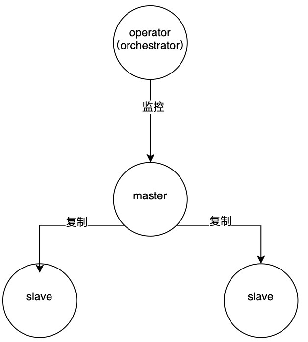

    假设 master 的网络发生短暂闪断（时间大于 `orch` 切换的容忍时间），`orch` 会做 failover，
    将其中一个 slave 提升为 master。然而 master 的网络有可能在切换后不久就恢复了，这时这个切换操作就是多余的。

    为了应对这种场景，我们可以停止 `orch` 对该 MySQL 集群的自动切换能力。

    !!! note

        适用于集群网络状态不可控的情况。原理是在 orch 监控到 master 网络不可达后，将其忽略。

    **操作步骤**

    1. 以 common-mysql 数据库，使用 helm 更新 operator：

        ```shell
        helm -n mcamel-system get values mysql-operator > values.yaml
        ```

    2. 获取之前安装版本设置的 value，再升级 mysql-operator。

        ```shell
        helm upgrade \
          --install mysql-operator \
          --create-namespace \
          -n mcamel-system \
          --cleanup-on-fail mcamel-release/mysql-operator \
          --version 0.14.0-rc2 \
          -f values.yaml
          --set "orchestrator.config.RecoveryIgnoreHostnameFilters[0]=^mcamel-common"  # (1)!
        ```

        1. 这里是一个正则，则最终会和 mysql pod 名字做匹配

    !!! note

        确保执行完成后，operator 发生了重启；
        确保执行完成后，operator 的配置文件，名为 mysql-operator-orc 的 configmap 中有 --set 的内容。

    **验证方案**

    1. 建立一个 3 节点主从集群（-0 是 master），名字匹配上面设置的正则：

        

    2. 停止 master 的网络；

        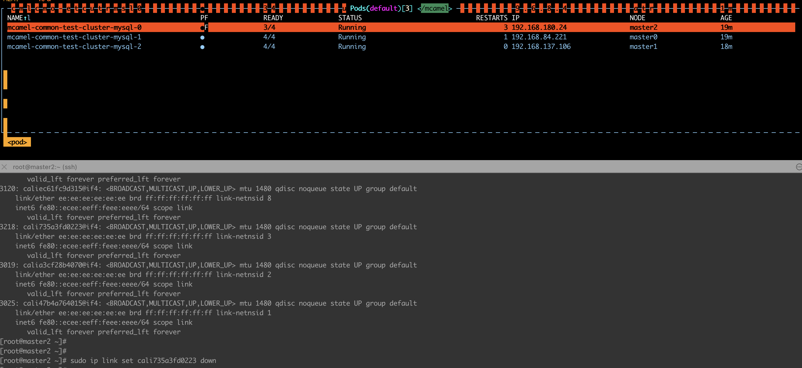

    3. 可以看到 master 没有发生切换；

        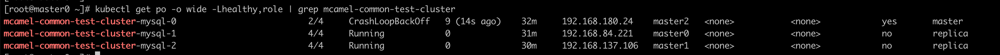

    4. 可以看到集群已经恢复正常，master 仍然是 -0。

        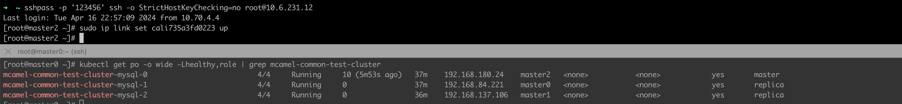

    !!! note

        另外再验证，名字不匹配上面正则的集群，同样的步骤，可以正常切换。

??? "CR 创建数据库失败报错"

    数据库运行正常，使用 CR 创建数据库出现了报错，此类问题的原因有： __mysql root__ 密码有特殊字符

    

    1. 获取查看原密码：

        ```bash
        [root@master-01 ~]$ kubectl get secret -n mcamel-system mcamel-common-mysql-cluster-secret -o=jsonpath='{.data.ROOT_PASSWORD}' | base64 -d
        ```

    2. 如果密码含有特殊字符 __-__ ，进入 MySQL 的 Shell 输入原密码出现以下错误

        ```console
        bash-4.4# mysql -uroot -p
        Enter password:
        ERROR 1045 (28000): Access denied for user 'root'@'localhost' (using password: YES)
        ```

    3. 清理重建：

        - 方法一：清理数据目录，删除 Pod 等待 sidecar running 以后，再删除一次数据目录，再删除 Pod 即可恢复：

            ```bash
            [root@master-01 ~]# kubectl exec -it mcamel-common-mysql-cluster-mysql-1 -n mcamel-system -c sidecar -- /bin/sh
            sh-4.4# cd /var/lib/mysql
            sh-4.4# ls | xargs rm -rf
            ```

        - 方法二：先删除 PVC，再删除 Pod，即可恢复：

            ```bash
            kubectl delete pvc data-mcamel-common-mysql-cluster-mysql-1 -n mcamel-system
            ```

            ```bash
            kubectl delete pod mcamel-common-mysql-cluster-mysql-1 -n mcamel-system
            ```

    !!! note

        使用以上方法清理重建将导致数据库被重置，数据丢失。

??? "出现提示 `The MySQL server is running with the read-only option so it cannot execute this statement`"

    当在管理平台的操作中产生如下提示，说明 MySQL 节点主从关系发生变化，但平台其他模块没有及时转换连接对象，在只读从节点执行了写操作。

    ```prompt
    The MySQL server is running with the read-only option so it cannot execute this statement
    ```

    

    解决方法：前往 __容器管理__ 平台重启所有相关 __replica__ 。

??? "Operator 或者相关 MySQL 资源中出现错误码 1045"

    **原因：磁盘性能太差，导致 MySQL 初始化被中断**

    当出现这个错误后，登录 MySQL，执行：

    ```shell
    mysql -uroot
    ```

    如果可以直接登录，很大概率是因为磁盘性能太差，导致 MySQL 初始化被中断。

    **临时解决方案**

    1. 将 mysql-operator 这个 StatefulSet 缩容为 0
    1. 删除 MySQL 对应的 StatefulSet 里 MySQL 容器的 probe 探针
    1. 删除 MySQL 的 PVC
    1. 删除 MySQL 的 Pod，并等待 MySQL 重新初始化
    1. （待 MySQL 启动成功后），使用 `mysql -uroot` 登录 MySQL，查看是否可以登录。
       如果无法登录，则说明 MySQL 初始化成功。
    1. 将 mysql-operator 这个 StatefulSet 扩容为原来的值

### Elasticsearch 排障

??? "Elasticsearch PVC 磁盘容量满"

    > 存储依赖 hwameistor

    **报错信息**

    ```info
    {"type": "server", "timestamp": "2022-12-18T10:47:08,573Z", "level": "ERROR", "component": "o.e.m.f.FsHealthService", "cluster.name": "mcamel-common-es-cluster-masters", "node.name": "mcamel-common-es-cluster-masters-es-masters-0", "message": "health check of [/usr/share/elasticsearch/data/nodes/0] failed", "cluster.uuid": "afIglgTVTXmYO2qPFNvsuA", "node.id": "nZRiBCUZQymQVV1son34pA" ,
    "stacktrace": ["java.io.IOException: No space left on device",
    "at sun.nio.ch.FileDispatcherImpl.write0(Native Method) ~[?:?]",
    "at sun.nio.ch.FileDispatcherImpl.write(FileDispatcherImpl.java:62) ~[?:?]",
    "at sun.nio.ch.IOUtil.writeFromNativeBuffer(IOUtil.java:132) ~[?:?]",
    "at sun.nio.ch.IOUtil.write(IOUtil.java:97) ~[?:?]",
    "at sun.nio.ch.IOUtil.write(IOUtil.java:67) ~[?:?]",
    "at sun.nio.ch.FileChannelImpl.write(FileChannelImpl.java:285) ~[?:?]",
    "at java.nio.channels.Channels.writeFullyImpl(Channels.java:74) ~[?:?]",
    "at java.nio.channels.Channels.writeFully(Channels.java:96) ~[?:?]",
    "at java.nio.channels.Channels$1.write(Channels.java:171) ~[?:?]",
    "at java.io.OutputStream.write(OutputStream.java:127) ~[?:?]",
    "at org.elasticsearch.monitor.fs.FsHealthService$FsHealthMonitor.monitorFSHealth(FsHealthService.java:170) [elasticsearch-7.16.3.jar:7.16.3]",
    "at org.elasticsearch.monitor.fs.FsHealthService$FsHealthMonitor.run(FsHealthService.java:144) [elasticsearch-7.16.3.jar:7.16.3]",
    "at org.elasticsearch.threadpool.Scheduler$ReschedulingRunnable.doRun(Scheduler.java:214) [elasticsearch-7.16.3.jar:7.16.3]",
    "at org.elasticsearch.common.util.concurrent.ThreadContext$ContextPreservingAbstractRunnable.doRun(ThreadContext.java:777) [elasticsearch-7.16.3.jar:7.16.3]",
    "at org.elasticsearch.common.util.concurrent.AbstractRunnable.run(AbstractRunnable.java:26) [elasticsearch-7.16.3.jar:7.16.3]",
    "at java.util.concurrent.ThreadPoolExecutor.runWorker(ThreadPoolExecutor.java:1136) [?:?]",
    "at java.util.concurrent.ThreadPoolExecutor$Worker.run(ThreadPoolExecutor.java:635) [?:?]",
    "at java.lang.Thread.run(Thread.java:833) [?:?]"] }
    ```

    **解决方式**

    1. 扩容 PVC（从 1Gi 修改为 10Gi）

        ```shell
        kubectl edit pvc elasticsearch-data-mcamel-common-es-cluster-masters-es-masters-0 -n mcamel-system
        ```
        ```yaml
        spec:
          accessModes:
          - ReadWriteOnce
          resources:
            requests:
              storage: 10Gi
        ```

    2. PVC 扩容日志

        查看 elasticsearch-data-mcamel-common-es-cluster-masters-es-masters-0 扩容日志信息。

        ```shell
        kubectl describe  pvc elasticsearch-data-mcamel-common-es-cluster-masters-es-masters-0 -n mcamel-system
        ```
        ```none
        Name:          elasticsearch-data-mcamel-common-es-cluster-masters-es-masters-0
        Namespace:     mcamel-system
        StorageClass:  hwameistor-storage-lvm-hdd
        Status:        Bound
        Volume:        pvc-42309e19-b74f-45b4-9284-9c68b7dd93b3
        Labels:        common.k8s.elastic.co/type=elasticsearch
                       elasticsearch.k8s.elastic.co/cluster-name=mcamel-common-es-cluster-masters
                       elasticsearch.k8s.elastic.co/statefulset-name=mcamel-common-es-cluster-masters-es-masters
        Annotations:   pv.kubernetes.io/bind-completed: yes
                       pv.kubernetes.io/bound-by-controller: yes
                       volume.beta.kubernetes.io/storage-provisioner: lvm.hwameistor.io
                       volume.kubernetes.io/selected-node: xulongju-worker03
        Finalizers:    [kubernetes.io/pvc-protection]
        Capacity:      10Gi
        Access Modes:  RWO
        VolumeMode:    Filesystem
        Used By:       mcamel-common-es-cluster-masters-es-masters-0
        Events:
          Type     Reason                      Age                    From                                                                                                                 Message
          ----     ------                      ----                   ----                                                                                                                 -------
          Normal   WaitForPodScheduled         51m (x18 over 55m)     persistentvolume-controller                                                                                      waiting for pod mcamel-common-es-cluster-masters-es-masters-0 to be scheduled
          Normal   WaitForFirstConsumer        50m (x7 over 56m)      persistentvolume-controller                                                                                      waiting for first consumer to be created before binding
          Normal   ExternalProvisioning        50m                    persistentvolume-controller                                                                                      waiting for a volume to be created, either by external provisioner "lvm.hwameistor.io" or manually created by system    administrator
          Normal   Provisioning                50m                    lvm.hwameistor.io_hwameistor-local-storage-csi-controller-68c9df8db8-kzdgn_680380b5-fc4d-4b82-ba80-5681e99a8711  External provisioner is provisioning volume for claim "mcamel-system/elasticsearch-data-mcamel-common-es-cluster-masters-es-masters-0"
          Normal   ProvisioningSucceeded       50m                    lvm.hwameistor.io_hwameistor-local-storage-csi-controller-68c9df8db8-kzdgn_680380b5-fc4d-4b82-ba80-5681e99a8711  Successfully provisioned volume pvc-42309e19-b74f-45b4-9284-9c68b7dd93b3
          Warning  ExternalExpanding           3m39s                  volume_expand                                                                                                    Ignoring the PVC: didn't find a plugin capable of expanding the volume; waiting for an external controller to process this PVC.
          Warning  VolumeResizeFailed          3m39s                  external-resizer lvm.hwameistor.io                                                                               resize volume "pvc-42309e19-b74f-45b4-9284-9c68b7dd93b3" by resizer "lvm.hwameistor.io" failed: rpc error: code = Unknown desc = volume expansion not completed yet
          Warning  VolumeResizeFailed          3m39s                  external-resizer lvm.hwameistor.io                                                                               resize volume "pvc-42309e19-b74f-45b4-9284-9c68b7dd93b3" by resizer "lvm.hwameistor.io" failed: rpc error: code = Unknown desc = volume expansion in progress
          Normal   Resizing                    3m38s (x3 over 3m39s)  external-resizer lvm.hwameistor.io                                                                               External resizer is resizing volume pvc-42309e19-b74f-45b4-9284-9c68b7dd93b3
          Normal   FileSystemResizeRequired    3m38s                  external-resizer lvm.hwameistor.io                                                                               Require file system resize of volume on node
          Normal   FileSystemResizeSuccessful  2m42s                  kubelet
        ```

??? "Elasticsearch 业务索引别名被占用"

    > 现象：索引别名被占用

    

    此图中 __*-write__ 为别名，例如 __jaeger-span-write__ ，需要对此别名进行处理

    查看业务索引模板中使用的别名 __rollover_alias 对应值__

    

    临时处理方式：进入 es pod 容器内执行以下脚本：

    1. 修改 TEMPLATE_NAME 对应值

    2. 修改 INDEX_ALIAS 对应值

    3. 需要进入 elasticsearch pod 中执行该脚本

    4. 修改里面 elastic 用户的密码值 (ES_PASSWORD=xxxx)

    ```shell
    #!/bin/bash
    # Add a template/policy/index
    TEMPLATE_NAME=insight-es-k8s-logs
    INDEX_ALIAS="${TEMPLATE_NAME}-alias"
    ES_PASSWORD="DaoCloud"
    ES_URL=https://localhost:9200
    while [[ "$(curl -s -o /dev/null -w '%{http_code}\n' -u elastic:${ES_PASSWORD} $ES_URL -k)" != "200" ]]; do sleep 1; done
    curl -XDELETE -u elastic:${ES_PASSWORD} -k "$ES_URL/${INDEX_ALIAS}"
    curl -XPUT -u elastic:${ES_PASSWORD} -k "$ES_URL/${TEMPLATE_NAME}-000001" -H 'Content-Type: application/json' -d'{"aliases": {'\""${INDEX_ALIAS}"\"':{"is_write_index": true }}}'
    ```

    > 注意：此脚本存在一定失败几率，取决于数据写入速度，作为临时解决方式。

    真实情况需要停止数据源的写入情况，再执行上述方法。

??? "报错 Error setting GoMAXPROCS for operator"

    **报错信息**

    

    环境信息：

    ```info
    kind版本：0.17.0
    containerd:1.5.2
    k8s:1.21.1
    ```
    **解决方式**

    升级版本：

    ```info
    kind：1.23.6
    runc version 1.1.0
    ```

??? "报错 Terminating due to java.lang.OutOfMemoryError: Java heap space"

    **完整的报错信息如下：**

    ```info
    {"type": "server", "timestamp": "2023-01-04T14:44:05,920Z", "level": "WARN", "component": "o.e.d.PeerFinder", "cluster.name": "gsc-cluster-1-master-es", "node.name": "gsc-cluster-1-master-es-es-data-0", "message": "address [127.0.0.1:9305], node [null], requesting [false] connection failed: [][127.0.0.1:9305] connect_exception: Connection refused: /127.0.0.1:9305: Connection refused", "cluster.uuid": "JOa0U_Q6T7WT60SPYiR1Ig", "node.id": "_zlorWVeRbyrUMYf9wJgfQ"  }
    {"type": "server", "timestamp": "2023-01-04T14:44:06,379Z", "level": "WARN", "component": "o.e.m.j.JvmGcMonitorService", "cluster.name": "gsc-cluster-1-master-es", "node.name": "gsc-cluster-1-master-es-es-data-0", "message": "[gc][15375] overhead, spent [1.3s] collecting in the last [1.3s]", "cluster.uuid": "JOa0U_Q6T7WT60SPYiR1Ig", "node.id": "_zlorWVeRbyrUMYf9wJgfQ"  }
    {"timestamp": "2023-01-04T14:44:06+00:00", "message": "readiness probe failed", "curl_rc": "28"}
    java.lang.OutOfMemoryError: Java heap space
    Dumping heap to data/java_pid7.hprof ...
    {"timestamp": "2023-01-04T14:44:11+00:00", "message": "readiness probe failed", "curl_rc": "28"}
    {"timestamp": "2023-01-04T14:44:14+00:00", "message": "readiness probe failed", "curl_rc": "28"}
    {"timestamp": "2023-01-04T14:44:17+00:00", "message": "readiness probe failed", "curl_rc": "28"}
    {"timestamp": "2023-01-04T14:44:21+00:00", "message": "readiness probe failed", "curl_rc": "28"}
    {"timestamp": "2023-01-04T14:44:26+00:00", "message": "readiness probe failed", "curl_rc": "28"}
    {"timestamp": "2023-01-04T14:44:31+00:00", "message": "readiness probe failed", "curl_rc": "28"}
    Heap dump file created [737115702 bytes in 25.240 secs]
    Terminating due to java.lang.OutOfMemoryError: Java heap space
    ```

    **解决方式**

    如果在条件允许的情况下，可以进行资源及容量规划。

    ```shell
    kubectl edit elasticsearch mcamel-common-es-cluster-masters -n mcamel-system
    ```

    

??? "OCP 环境安装 Elasticsearch 时报错 Operation not permitted"

    **报错信息**

    

    **解决方式**

    

??? "某个节点磁盘读吞吐异常、CPU workload 很高"

    **异常信息**

    

    

    **解决方式**

    如果 es 在此节点，可以将ES进程杀掉恢复。

??? "数据写入 Elasticsearch 时报错 status:429"

    **完整的报错信息如下：**

    ```info
    [2023/03/23 09:47:16] [error] [output:es:es.kube.kubeevent.syslog] error: Output
    {"took":0,"errors":true,"items":[{"create":{"_index":"insight-es-k8s-logs-000067","_type":"_doc","_id":"MhomDIcBLVS7yRloG6PF","status":429,"error":{"type":"es_rejected_execution_exception","reason":"rejected execution of org.elasticsearch.action.support.replication.TransportWriteAction$1/WrappedActionListener{org.elasticsearch.action.support.replication.ReplicationOperation$$Lambda$7002/0x0000000801b2b3d0@16e9faf7}{org.elasticsearch.action.support.replication.ReplicationOperation$$Lambda$7003/0x0000000801b2b5f8@46bcb787} on EsThreadPoolExecutor[name = mcamel-common-es-cluster-masters-es-data-0/write, queue capacity = 10000, org.elasticsearch.common.util.concurrent.EsThreadPoolExecutor@499b0f50[Running, pool size = 2, active threads = 2, queued tasks = 10000, completed tasks = 11472149]]"}}},{"create":{"_index":"insight-es-k8s-logs-000067","_type":"_doc","_id":"MxomDIcBLVS7yRloG6PF","status":429,"error":{"type":"es_rejected_execution_exception","reason":"rejected execution of org.elasticsearch.action.support.replication.TransportWriteAction$1/WrappedActionListener{org.elasticsearch.action.support.replication.ReplicationOperation$$Lambda$7002/0x0000000801b2b3d0@16e9faf7}{org.elasticsearch.action.support.replication.ReplicationOperation$$Lambda$7003/0x0000000801b2b5f8@46bcb787} on EsThreadPoolExecutor[name = mcamel-common-es-cluster-masters-es-data-0/write, queue capacity = 10000, org.elasticsearch.common.util.concurrent.EsThreadPoolExecutor@499b0f50[Running, pool size = 2, active threads = 2, queued tasks = 10000, completed tasks = 11472149]]"}}},{"create":{"_index":"insight-es-k8s-logs-000067","_type":"_doc","_id":"NBomDIcBLVS7yRloG6PF","status":429,"error":{"type":"es_rejected_execution_exception","reason":"rejected execution of org.elasticsearch.action.support.replication.TransportWriteAction$1/WrappedActionListener{org.elasticsearch.action.support.replication.ReplicationOperation$$Lambda$7002/0x0000000801b2b3d0@16e9faf7}{org.elasticsearch.action.support.replication.ReplicationOperation$$Lambda$7003/0x0000000801b2b5f8@46bcb787} on EsThreadPoolExecutor[name = mcamel-common-es-cluster-masters-es-data-0/write, queue capacity = 10000, org.elasticsearch.common.util.concurrent.EsThreadPoolExecutor@499b0f50[Running, pool size = 2, active threads = 2, queued tasks = 10000, completed tasks = 11472149]]"}}}]}
    ```

    **解决方式**

    - 方式 1：产生 429 错误的原因是 __Elasticsearch__ 写入并发过大， __Elasticsearch__ 来不及处理导致，可以适当降低写入并发并控制写入量。

    - 方式 2：在资源允许的情况下，可以适当调大队列大小

        ```shell
        nodeSets:
          - config:
              node.store.allow_mmap: false
              thread_pool.write.queue_size: 1000 #增加/调大此参数的值
        ```

    方式 1 和方式 2 可以配合使用。

## AI Lab

更多问题请参阅 [故障排查](../baize/troubleshoot/index.md)。

??? "AI Lab 集群下拉列表中找不到集群"

    **问题现象**

    在 AI Lab 开发控制台、运维控制台，功能模块的集群搜索条件的下拉列表找不到想要的集群。

    **问题分析**

    在 AI Lab 中，集群下拉列表如果缺少了想要的集群，可能是由于以下原因导致的：

    - `baize-agent` 未安装或安装不成功，导致 AI Lab 无法获取集群信息
    - 安装 `baize-agent` 未配置集群名称，导致 AI Lab 无法获取集群信息
    - 工作集群内可观测组件异常，导致无法采集集群内的指标信息

    **解决办法**

    **`baize-agent` 未安装或安装不成功**

    AI Lab 有一些基础组件需要在每个工作集群内进行安装，如果工作集群内未安装 `baize-agent` 时，可以在界面上选择安装，可能会导致一些非预期的报错等问题。

    所以，为了保障使用体验，可选择的集群范围仅包含了已经成功安装了 `baize-agent` 的集群。

    如果是因为 `baize-agent` 未安装或安装失败，则使用
    **容器管理** -> **集群管理** -> **Helm 应用** -> **Helm 模板** ，找到 `baize-agent` 并安装。

    !!! note

        此地址快速跳转 `https://<dce_host>/kpanda/clusters/<cluster_name>/helm/charts/addon/baize-agent`。
        注意将 `<dce_host>` 替换为实际的 DCE 控制台地址，`<cluster_name>` 替换为实际的集群名称。

    **安装 `baize-agent` 时未配置集群名称**

    在安装 `baize-agent` 时，需要注意配置集群的名称，这个名称会用于可观测指标采集， **默认为空，需手工配置** 。

    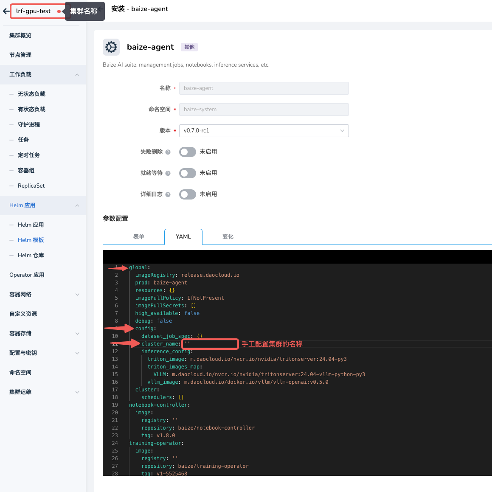

    **工作集群内可观测组件异常**

    如果集群内可观测组件异常，可能会导致 AI Lab 无法获取集群信息，请检查平台的可观测服务是否正常运行及配置。

    - 检查[全局服务集群](../kpanda/user-guide/clusters/cluster-role.md#_2)内 insight-server 组件是否正常运行
    - 检查[工作集群](../kpanda/user-guide/clusters/cluster-role.md#_4)内 insight-agent 组件是否正常运行

??? "AI Lab Notebook 不受队列配额控制"

    在 AI Lab 中，用户在创建 Notebook 时，发现选择的队列即使资源不足，Notebook 依然可以创建成功。

    **问题 01: Kubernetes 版本不支持**

    - 分析：

        AI Lab 中的队列管理能力由 [Kueue](https://kueue.sigs.k8s.io/) 提供，
        Notebook 服务是通过 [JupyterHub](https://jupyter.org/hub) 提供的。
        JupyterHub 对 Kubernetes 的版本要求较高，对于低于 v1.27 的版本，即使在 DCE 中设置了队列配额，
        用户在创建 Notebook 时也选择了配额，但 Notebook 实际也不会受到队列配额的限制。

        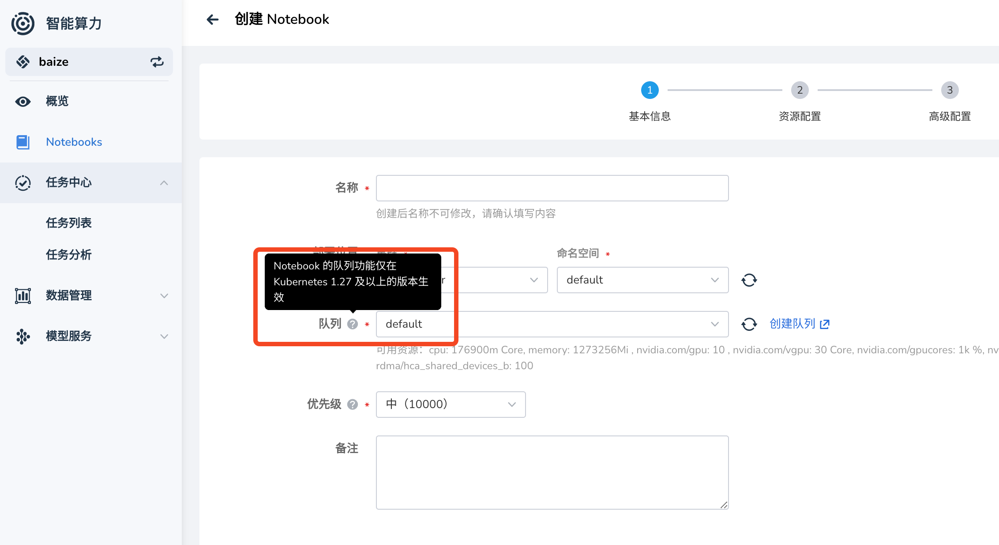

    - 解决办法：提前规划，生产环境中建议使用 Kubernetes 版本 `v1.27` 以上。

    - 参考资料：[Jupyter Notebook Documentation](https://jupyter-notebook.readthedocs.io/en/latest/)

    **问题 02: 配置未启用**

    - 分析：

        当 Kubernetes 集群版本 大于 v1.27 时，Notebook 仍无法受到队列配额的限制。

        这是因为，Kueue 需要启用对 `enablePlainPod` 支持，才会对 Notebook 服务生效。

        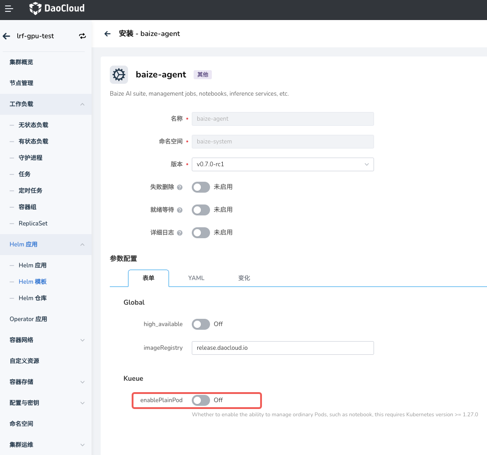

    - 解决办法：在工作集群中部署 `baize-agent` 时，启用 Kueue 对 `enablePlainPod` 的支持。

    - 参考资料：[Run Plain Pods as a Kueue-Managed Job](https://kueue.sigs.k8s.io/docs/tasks/run/plain_pods/)

??? "AI Lab 队列初始化失败"

    **问题现象**

    在创建 Notebook、训练任务或者推理服务时，当队列是首次在该命名空间使用时，会提示需要一键初始化队列，但是初始化失败。

    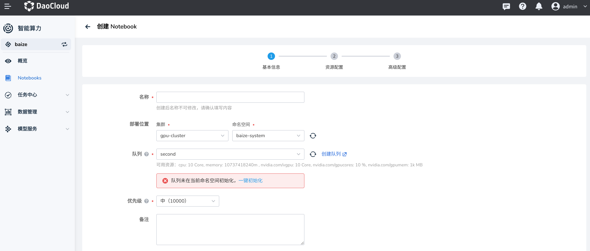

    **问题分析**

    在 AI Lab 中，队列管理能力由 [Kueue](https://kueue.sigs.k8s.io/) 提供，
    而 Kueue 提供了 两种队列管理资源：

    - ClusterQueue 是集群级别的队列，主要用于管理队列中的资源配额，包含了 CPU、内存、GPU 等资源
    - LocalQueue 是命名空间级别的队列，需要指向到一个 ClusterQueue，用于使用队列中的资源分配

    在 AI Lab 中，如果创建服务时，发现指定的命名空间不存在 `LocalQueue`，则会提示需要初始化队列。

    在极少数情况下，可能由于特殊原因会导致 `LocalQueue` 初始化失败。

    **解决办法**

    检查 Kueue 是否正常运行，如果 `kueue-controller-manager` 未运行，可以通过以下命令查看。

    ```bash
    kubectl get deploy kueue-controller-manager -n baize-sysatem
    ```

    如果 `kueue-controller-manager` 未正常运行，请先修复 Kueue。

    **参考资料**

    - [ClusterQueue](https://kueue.sigs.k8s.io/docs/concepts/cluster_queue/)
    - [LocalQueue](https://kueue.sigs.k8s.io/docs/concepts/local_queue/)

## 全局管理

更多问题请参阅 [全局管理 FAQ](../ghippo/intro/faq.md)。

??? "重启集群（虚拟机）istio-ingressgateway 无法启动？"

    报错提示如下图：

    

    可能原因：RequestAuthentication CR 的 jwtsUri 地址无法访问，
    导致 istiod 无法下发配置给 istio-ingressgateway（Istio 1.15 可以规避这个 bug：
    [https://github.com/istio/istio/pull/39341/](https://github.com/istio/istio/pull/39341/files)）

    解决方法：

    1. 备份 RequestAuthentication ghippo CR。

        ```shell
        kubectl get RequestAuthentication ghippo -n istio-system -o yaml > ghippo-ra.yaml
        ```

    2. 删除 RequestAuthentication ghippo CR。

        ```shell
        kubectl delete RequestAuthentication ghippo -n istio-system
        ```

    3. 重启 Istio。

        ```shell
        kubectl rollout restart deploy/istiod -n istio-system
        kubectl rollout restart deploy/istio-ingressgateway -n istio-system
        ```

    4. 重新 apply RequestAuthentication ghippo CR。

        ```sh
        kubectl apply -f ghippo-ra.yaml
        ```

        !!! note

            apply RequestAuthentication ghippo CR 之前，请确保 ghippo-apiserver 和 ghippo-keycloak 已经正常启动。

??? "登录无限循环，报错 401 或 403"

    出现这个问题原因为：ghippo-keycloak 连接的 Mysql 数据库出现故障, 导致 __OIDC Public keys__ 被重置

    在全局管理 0.11.1 及以上版本，您可以参照以下步骤，使用 __helm__ 更新全局管理配置文件即可恢复正常。

    ```shell
    # 更新 helm 仓库
    helm repo update ghippo

    # 备份 ghippo 参数
    helm get values ghippo -n ghippo-system -o yaml > ghippo-values-bak.yaml

    # 获取当前部署的 ghippo 版本号
    version=$(helm get notes ghippo -n ghippo-system | grep "Chart Version" | awk -F ': ' '{ print $2 }')

    # 执行更新操作, 使配置文件生效
    helm upgrade ghippo ghippo/ghippo \
    -n ghippo-system \
    -f ./ghippo-values-bak.yaml \
    --version ${version}
    ```

??? "Keycloak 无法启动"

    *[Ghippo]: DCE 全局管理的开发代号

    **常见故障**

    **故障表现**

    MySQL 已就绪，无报错。在安装全局管理后 keycloak 无法启动（> 10 次）。

    

    **检查项**

    - 如果数据库是 MySQL，检查 keycloak database 编码是否是 UTF8。
    - 检查从 keycloak 到数据库的网络，检查数据库资源是否充足，包括但不限于资源限制、存储空间、物理机资源。

    **解决步骤**

    

    1. 检查 MySQL 资源占用是否到达 limit 限制
    1. 检查 MySQL 中 database keycloak table 的数量是不是 95
       （Keycloak 不同版本数据库数量可能会不一样，可以与同版本的开发或测试环境的 Keycloak 数据库数量进行比较），
       如数量少了，则说明数据库表初始化有问题（查询表数量命令提示为：show tables;）
    1. 删除 keycloak database 并创建，提示 **CREATE DATABASE IF NOT EXISTS keycloak CHARACTER SET utf8**
    1. 重启 Keycloak Pod 解决问题

    **CPU does not support ×86-64-v2**

    **故障表现**

    keycloak 无法正常启动，keycloak pod 运行状态为 `CrashLoopBackOff` 并且 keycloak 的 log 出现如下图所示的信息

    

    **检查项**
    运行下面的检查脚本，查询当前节点 cpu 的 x86-64架构的特征级别
    ```bash
    cat <<"EOF" > detect-cpu.sh
    #!/bin/sh -eu

    flags=$(cat /proc/cpuinfo | grep flags | head -n 1 | cut -d: -f2)

    supports_v2='awk "/cx16/&&/lahf/&&/popcnt/&&/sse4_1/&&/sse4_2/&&/ssse3/ {found=1} END {exit !found}"'
    supports_v3='awk "/avx/&&/avx2/&&/bmi1/&&/bmi2/&&/f16c/&&/fma/&&/abm/&&/movbe/&&/xsave/ {found=1} END {exit !found}"'
    supports_v4='awk "/avx512f/&&/avx512bw/&&/avx512cd/&&/avx512dq/&&/avx512vl/ {found=1} END {exit !found}"'

    echo "$flags" | eval $supports_v2 || exit 2 && echo "CPU supports x86-64-v2"
    echo "$flags" | eval $supports_v3 || exit 3 && echo "CPU supports x86-64-v3"
    echo "$flags" | eval $supports_v4 || exit 4 && echo "CPU supports x86-64-v4"
    EOF

    chmod +x detect-cpu.sh
    sh detect-cpu.sh
    ```

    执行下面命令查看当前 cpu 的特性，如果输出中包含 sse4_2，则表示你的处理器支持SSE 4.2。
    ```bash
    lscpu | grep sse4_2
    ```

    **解决方法**
    需要升级你的虚拟机或物理机 CPU 以支持 x86-64-v2 及以上，确保x86 CPU 指令集支持 sse4.2，如何升级需要你咨询虚拟机平台提供商或着物理机提供商。

    详见：https://github.com/keycloak/keycloak/issues/17290

??? "单独升级全局管理时升级失败"

    **CRD 未更新错误**

    若升级失败时包含如下信息，可以参考[离线升级](../ghippo/install/offline-install.md#__tabbed_3_2)中的更新
    ghippo crd 步骤完成 crd 安装。

    ```console
    ensure CRDs are installed first
    ```

    **数据库迁移报错**

    **错误现象**

    Pod 启动失败，log 中出现如下信息：

    ```console
    init database failed    {"error": "migrate failed: Dirty database version 0. Fix and force version."}
    ```

    **错误原因**

    因为环境或数据库状态异常或 SQL 语句错误等问题导致 SQL 迁移执行出错，但是仅当 Pod 第一次报错的时候输出真正的数据库错误信息，后续 Pod 重启后会出现上述错误。

    **解决方案**

    1. 进入 MySQL，选择启动失败的服务对应的数据库（可能出问题的数据库有 audit、ghippo）

    2. 修改 schema_migrations 表的 dirty 字段

        ```console
        update schema_migrations set dirty=0;
        ```

    3. 重启失败的服务

    4. 如重启后 SQL 迁移还是报错，可能是 SQL 语句本身的问题，需要报 Bug 并联系开发同学来解决

## 权限问题

更多问题请参阅 [各模块权限说明](../ghippo/permissions/kpanda.md)。

??? "容器管理权限说明"

    [容器管理模块](../kpanda/intro/index.md)使用以下角色：

    - Admin / Kpanda Owner
    - [Cluster Admin](../kpanda/user-guide/permissions/permission-brief.md#cluster-admin)
    - [NS Admin](../kpanda/user-guide/permissions/permission-brief.md#ns-admin)
    - [NS Editor](../kpanda/user-guide/permissions/permission-brief.md#ns-editor)
    - [NS Viewer](../kpanda/user-guide/permissions/permission-brief.md#ns-viewer)

    !!! note

        - 有关权限的更多信息，请参阅[容器管理权限体系说明](../kpanda/user-guide/permissions/permission-brief.md)。
        - 有关角色的创建、管理和删除，请参阅[角色和权限管理](../ghippo/user-guide/access-control/role.md)。
        - __Cluster Admin__ , __NS Admin__ , __NS Editor__ , __NS Viewer__ 的权限仅在当前的集群或命名空间内生效。

    各角色所具备的权限如下：

    <!--
    有权限使用 `&check;`，无权限使用 `&cross;`
    -->

    | 一级功能 | 二级功能 | 权限点 | Cluster Admin | Ns Admin | Ns Editor | NS Viewer |
    | ------- | ------- | ---- | ------------- | -------- | ---------- | -------- |
    | 集群 | 集群列表 | 查看集群列表 | &check; | &check; | &check; | &check; |
    | | | 接入集群 | &cross; | &cross; | &cross; | &cross; |
    | | | 创建集群 | &cross; | &cross; | &cross; | &cross; |
    | | 集群操作 | 进入控制台 | &check; | &check;（仅列表内可以进入） | &check; | &cross; |
    | | | 查看监控 | &check; | &cross; | &cross; | &cross; |
    | | | 编辑基础配置 | &check; | &cross; | &cross; | &cross; |
    | | | 下载 kubeconfig | &check; | &check;（下载ns权限的kubeconfig） | &check;（下载 ns 权限的 kubeconfig） | &check;（下载 ns 权限的 kubeconfig） |
    | | | 绑定工作空间 | &check;（需同时设置为workspace admin或包含resource bind权限点的自定义角色） | &cross; | &cross; | &cross; |
    | | | 解绑工作空间 | &check;（需同时设置为workspace admin或包含resource bind权限点的自定义角色） | &cross; | &cross; | &cross; |
    | | | 解除接入 | &cross; | &cross; | &cross; | &cross; |
    | | | 查看日志 | &check; | &cross; | &cross; | &cross; |
    | | | 重试 | &cross; | &cross; | &cross; | &cross; |
    | | | 卸载集群 | &cross; | &cross; | &cross; | &cross; |
    | | 集群概览 | 查看集群概览 | &check; | &cross; | &cross; | &cross; |
    | | 节点管理 | 接入节点 | &cross; | &cross; | &cross; | &cross; |
    | | | 查看节点列表 | &check; | &cross; | &cross; | &cross; |
    | | | 查看节点详情 | &check; | &cross; | &cross; | &cross; |
    | | | 查看 YAML | &check; | &cross; | &cross; | &cross; |
    | | | 暂停调度 | &check; | &cross; | &cross; | &cross; |
    | | | 修改标签 | &check; | &cross; | &cross; | &cross; |
    | | | 修改注解 | &check; | &cross; | &cross; | &cross; |
    | | | 修改污点 | &check; | &cross; | &cross; | &cross; |
    | | | 移除节点 | &cross; | &cross; | &cross; | &cross; |
    | | 无状态负载 | 查看列表 | &check; | &check; | &check; | &check; |
    | | | 查看/管理详情 | &check; | &check; | &check; | &check;（仅查看） |
    | | | 批量停止 | &check; | &check; | &check; | &cross; |
    | | | 批量删除 | &check; | &check; | &check; | &cross; |
    | | | YAML 创建 | &check; | &check; | &check; | &cross; |
    | | | 镜像创建 | &check; | &check; | &check; | &cross; |
    | | 选择 ns 绑定的 ws 内的实例 | 选择镜像 | &check; | &check; | &check; | &cross; |
    | | | IP 池查看 | &check; | &check; | &check; | &cross; |
    | | | 网卡编辑 | &check; | &check; | &check; | &cross; |
    | | | 进入控制台 | &check; | &check; | &check; | &cross; |
    | | | 查看监控 | &check; | &check; | &check; | &check; |
    | | | 查看日志 | &check; | &check; | &check; | &check; |
    | | | 负载伸缩 | &check; | &check; | &check; | &cross; |
    | | | 编辑 YAML | &check; | &check; | &check; | &cross; |
    | | | 更新 | &check; | &check; | &check; | &cross; |
    | | | 状态 - 暂停升级 | &check; | &check; | &check; | &cross; |
    | | | 状态 - 停止 | &check; | &check; | &check; | &cross; |
    | | | 状态 - 重启 | &check; | &check; | &check; | &cross; |
    | | | 删除 | &check; | &check; | &check; | &cross; |
    | | 有状态负载 | 查看列表 | &check; | &check; | &check; | &check; |
    | | | 查看/管理详情 | &check; | &check; | &check; | &check;（仅查看） |
    | | | YAML 创建 | &check; | &check; | &check; | &cross; |
    | | | 镜像创建 | &check; | &check; | &check; | &cross; |
    | | 选择ns绑定的ws内的实例 | 选择镜像 | &check; | &check; | &check; | &cross; |
    | | | 进入控制台 | &check; | &check; | &check; | &cross; |
    | | | 查看监控 | &check; | &check; | &check; | &check; |
    | | | 查看日志 | &check; | &check; | &check; | &check; |
    | | | 负载伸缩 | &check; | &check; | &check; | &cross; |
    | | | 编辑 YAML | &check; | &check; | &check; | &cross; |
    | | | 更新 | &check; | &check; | &check; | &cross; |
    | | | 状态-停止 | &check; | &check; | &check; | &cross; |
    | | | 状态-重启 | &check; | &check; | &check; | &cross; |
    | | | 删除 | &check; | &check; | &check; | &cross; |
    | | 守护进程 | 查看列表 | &check; | &check; | &check; | &check; |
    | | | 查看/管理详情 | &check; | &check; | &check; | &check;（仅查看） |
    | | | YAML 创建 | &check; | &check; | &check; | &cross; |
    | | | 镜像创建 | &check; | &check; | &check; | &cross; |
    | | 选择ns绑定的ws内的实例 | 选择镜像 | &check; | &check; | &check; | &cross; |
    | | | 进入控制台 | &check; | &check; | &check; | &cross; |
    | | | 查看监控 | &check; | &check; | &check; | &check; |
    | | | 查看日志 | &check; | &check; | &check; | &check; |
    | | | 编辑 YAML | &check; | &check; | &check; | &cross; |
    | | | 更新 | &check; | &check; | &check; | &cross; |
    | | | 状态-重启 | &check; | &check; | &check; | &cross; |
    | | | 删除 | &check; | &check; | &check; | &cross; |
    | | 任务 | 查看列表 | &check; | &check; | &check; | &check; |
    | | | 查看/管理详情 | &check; | &check; | &check; | &check;（仅查看） |
    | | | YAML 创建 | &check; | &check; | &check; | &cross; |
    | | | 镜像创建 | &check; | &check; | &check; | &cross; |
    | | | 实例列表 | &check; | &check; | &check; | &check; |
    | | 选择ns绑定的ws内的实例 | 选择镜像 | &check; | &check; | &check; | &cross; |
    | | | 进入控制台 | &check; | &check; | &check; | &cross; |
    | | | 查看日志 | &check; | &check; | &check; | &check; |
    | | | 查看 YAML | &check; | &check; | &check; | &check; |
    | | | 重启 | &check; | &check; | &check; | &cross; |
    | | | 查看事件 | &check; | &check; | &check; | &check; |
    | | | 删除 | &check; | &check; | &check; | &cross; |
    | | 定时任务 | 查看列表 | &check; | &check; | &check; | &check; |
    | | | 查看/管理详情 | &check; | &check; | &check; | &check;（仅查看） |
    | | | YAML 创建 | &check; | &check; | &check; | &cross; |
    | | | 镜像创建 | &check; | &check; | &check; | &cross; |
    | | 选择ns绑定的ws内的实例 | 选择镜像 | &check; | &check; | &check; | &cross; |
    | | | 编辑 YAML | &check; | &check; | &check; | &cross; |
    | | | 停止 | &check; | &check; | &check; | &cross; |
    | | | 查看任务列表 | &check; | &check; | &check; | &check; |
    | | | 查看事件 | &check; | &check; | &check; | &check; |
    | | | 删除 | &check; | &check; | &check; | &cross; |
    | | 容器组 | 查看列表 | &check; | &check; | &check; | &check; |
    | | | 查看/管理详情 | &check; | &check; | &check; | &check;（仅查看） |
    | | | 进入控制台 | &check; | &check; | &check; | &cross; |
    | | | 查看监控 | &check; | &check; | &check; | &check; |
    | | | 查看日志 | &check; | &check; | &check; | &check; |
    | | | 查看 YAML | &check; | &check; | &check; | &check; |
    | | | 上传文件 | &check; | &check; | &check; | &cross; |
    | | | 下载文件 | &check; | &check; | &check; | &cross; |
    | | | 查看容器列表 | &check; | &check; | &check; | &check; |
    | | | 查看事件 | &check; | &check; | &check; | &check; |
    | | | 删除 | &check; | &check; | &check; | &cross; |
    | | ReplicaSet | 查看列表 | &check; | &check; | &check; | &check; |
    | | | 查看/管理详情 | &check; | &check; | &check; | &check;（仅查看） |
    | | | 进入控制台 | &check; | &check; | &check; | &cross; |
    | | | 查看监控 | &check; | &check; | &check; | &check; |
    | | | 查看日志 | &check; | &check; | &check; | &check; |
    | | | 查看 YAML | &check; | &check; | &check; | &check; |
    | | | 删除 | &check; | &check; | &check; | &cross; |
    | | Helm 应用 | 查看列表 | &check; | &check; | &check; | &check; |
    | | | 查看/管理详情 | &check; | &check; | &check; | &check;（仅查看） |
    | | | 更新 | &check; | &check; | &check; | &cross; |
    | | | 查看 YAML | &check; | &check; | &check; | &check; |
    | | | 删除 | &check; | &check; | &check; | &cross; |
    | | Helm 模板 | 查看列表 | &check; | &check; | &check; | &check; |
    | | | 查看详情 | &check; | &check; | &check; | &check; |
    | | | 安装模板 | &check; | &check;（ns级别的可以） | &cross; | &cross; |
    | | | 下载模板 | &check; | &check; | &check;（和查看接口一致） | &check; |
    | | Helm 仓库 | 查看列表 | &check; | &check; | &check; | &check; |
    | | | 创建仓库 | &check; | &cross; | &cross; | &cross; |
    | | | 更新仓库 | &check; | &cross; | &cross; | &cross; |
    | | | 克隆仓库 | &check; | &cross; | &cross; | &cross; |
    | | | 刷新仓库 | &check; | &cross; | &cross; | &cross; |
    | | | 修改标签 | &check; | &cross; | &cross; | &cross; |
    | | | 修改注解 | &check; | &cross; | &cross; | &cross; |
    | | | 删除 | &check; | &cross; | &cross; | &cross; |
    | | Operators Hub | 安装 Operator | &check; | &cross; | &cross; | &cross; |
    | | 安装的 Operators | 查看列表 | &check; | &check; | &check; | &check; |
    | | | 编辑订阅 | &check; | &cross; | &cross; | &cross; |
    | | | 审批 | &check; | &cross; | &cross; | &cross; |
    | | | 卸载 | &check; | &cross; | &cross; | &cross; |
    | | 服务 | 查看列表 | &check; | &check; | &check; | &check; |
    | | | 查看/管理详情 | &check; | &check; | &check; | &check;（仅查看） |
    | | | YAML 创建 | &check; | &check; | &check; | &cross; |
    | | | 创建 | &check; | &check; | &check; | &cross; |
    | | | 更新 | &check; | &check; | &check; | &cross; |
    | | | 查看事件 | &check; | &check; | &check; | &check; |
    | | | 编辑 YAML | &check; | &check; | &check; | &cross; |
    | | | 删除 | &check; | &check; | &check; | &cross; |
    | | 路由 | 查看列表 | &check; | &check; | &check; | &check; |
    | | | 查看/管理详情 | &check; | &check; | &check; | &check;（仅查看） |
    | | | YAML 创建 | &check; | &check; | &check; | &cross; |
    | | | 创建 | &check; | &check; | &check; | &cross; |
    | | | 更新 | &check; | &check; | &check; | &cross; |
    | | | 查看事件 | &check; | &check; | &check; | &check; |
    | | | 编辑 YAML | &check; | &check; | &check; | &cross; |
    | | | 删除 | &check; | &check; | &check; | &cross; |
    | | 网络策略 | 查看列表 | &check; | &check; | &check; | &check; |
    | | | 查看/管理详情 | &check; | &check; | &check; | &cross; |
    | | | YAML 创建 | &check; | &check; | &check; | &cross; |
    | | | 创建 | &check; | &check; | &check; | &cross; |
    | | | 删除 | &check; | &check; | &check; | &cross; |
    | | 网络配置 | 配置网络 | &check; | &check; | &check; | &cross; |
    | | 自定义资源 | 查看列表 | &check; | &cross; | &cross; | &cross; |
    | | | 查看/管理详情 | &check; | &cross; | &cross; | &cross; |
    | | | YAML 创建 | &check; | &cross; | &cross; | &cross; |
    | | | 编辑 YAML | &check; | &cross; | &cross; | &cross; |
    | | | 删除 | &check; | &cross; | &cross; | &cross; |
    | | PVC | 查看列表 | &check; | &check; | &check; | &check; |
    | | | 查看/管理详情 | &check; | &check; | &check; | &check;（仅查看） |
    | | | 创建 | &check; | &check; | &check; | &cross; |
    | | | 选择sc | &check; | &check; | &check; | &cross; |
    | | | YAML 创建 | &check; | &check; | &check; | &cross; |
    | | | 编辑 YAML | &check; | &check; | &check; | &cross; |
    | | | 克隆 | &check; | &check; | &check; | &cross; |
    | | | 删除 | &check; | &check; | &check; | &cross; |
    | | PV | 查看列表 | &check; | &cross; | &cross; | &cross; |
    | | | 查看/管理详情 | &check; | &cross; | &cross; | &cross; |
    | | | YAML 创建 | &check; | &cross; | &cross; | &cross; |
    | | | 创建 | &check; | &cross; | &cross; | &cross; |
    | | | 编辑 YAML | &check; | &cross; | &cross; | &cross; |
    | | | 更新 | &check; | &cross; | &cross; | &cross; |
    | | | 克隆 | &check; | &cross; | &cross; | &cross; |
    | | | 修改标签 | &check; | &cross; | &cross; | &cross; |
    | | | 修改注解 | &check; | &cross; | &cross; | &cross; |
    | | | 删除 | &check; | &cross; | &cross; | &cross; |
    | | SC | 查看列表 | &check; | &cross; | &cross; | &cross; |
    | | | YAML 创建 | &check; | &cross; | &cross; | &cross; |
    | | | 创建 | &check; | &cross; | &cross; | &cross; |
    | | | 查看 YAML | &check; | &cross; | &cross; | &cross; |
    | | | 更新 | &check; | &cross; | &cross; | &cross; |
    | | | 授权命名空间 | &check; | &cross; | &cross; | &cross; |
    | | | 解除授权 | &check; | &cross; | &cross; | &cross; |
    | | | 删除 | &check; | &cross; | &cross; | &cross; |
    | | 配置项 | 查看列表 | &check; | &check; | &check; | &check; |
    | | | 查看/管理详情 | &check; | &check; | &check; | &check;（仅查看） |
    | | | YAML 创建 | &check; | &check; | &check; | &cross; |
    | | | 创建 | &check; | &check; | &check; | &cross; |
    | | | 编辑 YAML | &check; | &check; | &check; | &cross; |
    | | | 更新 | &check; | &check; | &check; | &cross; |
    | | | 导出配置项 | &check; | &check; | &check; | &cross; |
    | | | 删除 | &check; | &check; | &check; | &cross; |
    | | 密钥 | 查看列表 | &check; | &check; | &check; | &cross; |
    | | | 查看/管理详情 | &check; | &check; | &check; | &cross; |
    | | | YAML 创建 | &check; | &check; | &check; | &cross; |
    | | | 创建 | &check; | &check; | &check; | &cross; |
    | | | 编辑 YAML | &check; | &check; | &check; | &cross; |
    | | | 更新 | &check; | &check; | &check; | &cross; |
    | | | 导出密钥 | &check; | &check; | &check; | &cross; |
    | | | 删除 | &check; | &check; | &check; | &cross; |
    | | 命名空间 | 查看列表 | &check; | &check; | &check; | &check; |
    | | | 查看/管理详情 | &check; | &check; | &check; | &check;（仅查看） |
    | | | YAML 创建 | &check; | &cross; | &cross; | &cross; |
    | | | 创建 | &check; | &cross; | &cross; | &cross; |
    | | | 查看 YAML | &check; | &check; | &check; | &cross; |
    | | | 修改标签 | &check; | &check; | &cross; | &cross; |
    | | | 绑定工作空间 | &cross; | &cross; | &cross; | &cross; |
    | | | 解绑工作空间 | &cross; | &cross; | &cross; | &cross; |
    | | | 配额管理 | &check; | &cross; | &cross; | &cross; |
    | | | 删除 | &check; | &cross; | &cross; | &cross; |
    | | 集群操作 | 查看列表 | &check; | &cross; | &cross; | &cross; |
    | | | 查看 YAML | &check; | &cross; | &cross; | &cross; |
    | | | 查看日志 | &check; | &cross; | &cross; | &cross; |
    | | | 删除 | &check; | &cross; | &cross; | &cross; |
    | | helm 操作 | 设置保留条数 | &check; | &cross; | &cross; | &cross; |
    | | | 查看 YAML | &check; | &check; | &cross; | &cross; |
    | | | 查看日志 | &check; | &check; | &cross; | &cross; |
    | | | 删除 | &check; | &check; | &cross; | &cross; |
    | | 集群升级 | 查看详情 | &check; | &cross; | &cross; | &cross; |
    | | | 升级 | &cross; | &cross; | &cross; | &cross; |
    | | 集群设置 | addon 插件配置 | &check; | &cross; | &cross; | &cross; |
    | | | 高级配置 | &check; | &cross; | &cross; | &cross; |
    | 命名空间 | | 查看列表 | &check; | &check; | &check; | &check; |
    | | | 创建 | &check; | &cross; | &cross; | &cross; |
    | | | 查看/管理详情 | &check; | &check; | &check; | &check; |
    | | | 查看 YAML | &check; | &check; | &check; | &cross; |
    | | | 修改标签 | &check; | &check; | &cross; | &cross; |
    | | | 绑定工作空间 | &cross; | &cross; | &cross; | &cross; |
    | | | 解绑工作空间 | &cross; | &cross; | &cross; | &cross; |
    | | | 配额管理 | &check; | &check;（仅查看） | &check;（仅查看）| &check;（仅查看）|
    | | | 删除 | &check; | &cross; | &cross; | &cross; |
    | 工作负载 | 无状态负载 | 查看列表 | &check; | &check; | &check; | &check; |
    | | | 查看/管理详情 | &check; | &check; | &check; | &check;（仅查看） |
    | | | 进入控制台 | &check; | &check; | &check; | &cross; |
    | | | 查看监控 | &check; | &check; | &check; | &check; |
    | | | 查看日志 | &check; | &check; | &check; | &check; |
    | | | 负载伸缩 | &check; | &check; | &check; | &cross; |
    | | | 编辑 YAML | &check; | &check; | &check; | &cross; |
    | | | 更新 | &check; | &check; | &check; | &cross; |
    | | | 状态-暂停升级 | &check; | &check; | &check; | &cross; |
    | | | 状态-停止 | &check; | &check; | &check; | &cross; |
    | | | 状态-重启 | &check; | &check; | &check; | &cross; |
    | | | 回退 | &check; | &check; | &check; | &cross; |
    | | | 修改标签注解 | &check; | &check; | &check; | &cross; |
    | | | 删除 | &check; | &check; | &check; | &cross; |
    | | 有状态负载 | 查看列表 | &check; | &check; | &check; | &check; |
    | | | 查看/管理详情 | &check; | &check; | &check; | &check;（仅查看） |
    | | | 进入控制台 | &check; | &check; | &check; | &cross; |
    | | | 查看监控 | &check; | &check; | &check; | &check; |
    | | | 查看日志 | &check; | &check; | &check; | &check; |
    | | | 负载伸缩 | &check; | &check; | &check; | &cross; |
    | | | 编辑 YAML | &check; | &check; | &check; | &cross; |
    | | | 更新 | &check; | &check; | &check; | &cross; |
    | | | 状态-停止 | &check; | &check; | &check; | &cross; |
    | | | 状态-重启 | &check; | &check; | &check; | &cross; |
    | | | 删除 | &check; | &check; | &check; | &cross; |
    | | 守护进程 | 查看列表 | &check; | &check; | &check; | &check; |
    | | | 查看/管理详情 | &check; | &check; | &check; | &check;（仅查看） |
    | | | 进入控制台 | &check; | &check; | &check; | &cross; |
    | | | 查看监控 | &check; | &check; | &check; | &check; |
    | | | 查看日志 | &check; | &check; | &check; | &check; |
    | | | 编辑 YAML | &check; | &check; | &check; | &cross; |
    | | | 更新 | &check; | &check; | &check; | &cross; |
    | | | 状态-重启 | &check; | &check; | &check; | &cross; |
    | | | 删除 | &check; | &check; | &check; | &cross; |
    | | 任务 | 查看列表 | &check; | &check; | &check; | &check; |
    | | | 查看/管理详情 | &check; | &check; | &check; | &check;（仅查看） |
    | | | 进入控制台 | &check; | &check; | &check; | &cross; |
    | | | 查看日志 | &check; | &check; | &check; | &check; |
    | | | 查看 YAML | &check; | &check; | &check; | &cross; |
    | | | 重启 | &check; | &check; | &check; | &cross; |
    | | | 查看事件 | &check; | &check; | &check; | &check; |
    | | | 删除 | &check; | &check; | &check; | &cross; |
    | | 定时任务 | 查看列表 | &check; | &check; | &check; | &check; |
    | | | 查看/管理详情 | &check; | &check; | &check; | &check;（仅查看） |
    | | | 查看事件 | &check; | &check; | &check; | &check; |
    | | | 删除 | &check; | &check; | &check; | &cross; |
    | | 容器组 | 查看列表 | &check; | &check; | &check; | &check; |
    | | | 查看/管理详情 | &check; | &check; | &check; | &check;（仅查看） |
    | | | 进入控制台 | &check; | &check; | &check; | &cross; |
    | | | 查看监控 | &check; | &check; | &check; | &check; |
    | | | 查看日志 | &check; | &check; | &check; | &check; |
    | | | 查看 YAML | &check; | &check; | &check; | &check; |
    | | | 上传文件 | &check; | &check; | &check; | &cross; |
    | | | 下载文件 | &check; | &check; | &check; | &cross; |
    | | | 查看容器列表 | &check; | &check; | &check; | &check; |
    | | | 查看事件 | &check; | &check; | &check; | &check; |
    | | | 删除 | &check; | &check; | &check; | &cross; |
    | 备份恢复 | 应用备份 | 查看列表 | &check; | &cross; | &cross; | &cross; |
    | | | 查看/管理详情 | &check; | &cross; | &cross; | &cross; |
    | | | 创建备份计划 | &check; | &cross; | &cross; | &cross; |
    | | | 查看 YAML | &check; | &cross; | &cross; | &cross; |
    | | | 更新计划 | &check; | &cross; | &cross; | &cross; |
    | | | 暂停 | &check; | &cross; | &cross; | &cross; |
    | | | 立即执行 | &check; | &cross; | &cross; | &cross; |
    | | | 删除 | &check; | &cross; | &cross; | &cross; |
    | | 恢复备份 | 查看列表 | &check; | &cross; | &cross; | &cross; |
    | | | 查看/管理详情 | &check; | &cross; | &cross; | &cross; |
    | | | 恢复备份 | &check; | &cross; | &cross; | &cross; |
    | | | 删除 | &check; | &cross; | &cross; | &cross; |
    | | 备份点 | 查看列表 | &check; | &cross; | &cross; | &cross; |
    | | | 删除 | &check; | &cross; | &cross; | &cross; |
    | | 对象存储 | 查看列表 | &check; | &cross; | &cross; | &cross; |
    | | ETCD备份 | 查看备份策略列表 | &check; | &cross; | &cross; | &cross; |
    | | | 创建备份策略 | &check; | &cross; | &cross; | &cross; |
    | | | 查看日志 | &check; | &cross; | &cross; | &cross; |
    | | | 查看 YAML | &check; | &cross; | &cross; | &cross; |
    | | | 更新备份策略 | &check; | &cross; | &cross; | &cross; |
    | | | 停止/启动 | &check; | &cross; | &cross; | &cross; |
    | | | 立即执行 | &check; | &cross; | &cross; | &cross; |
    | | | 查看/管理详情 | &check; | &cross; | &cross; | &cross; |
    | | | 删除备份记录 | &check; | &cross; | &cross; | &cross; |
    | | | 查看备份点列表 | &check; | &cross; | &cross; | &cross; |
    | 集群巡检 | 集群巡检 | 查看列表 | &check; | &cross; | &cross; | &cross; |
    | | | 查看/管理详情 | &check; | &cross; | &cross; | &cross; |
    | | | 集群巡检 | &check; | &cross; | &cross; | &cross; |
    | | | 设置 | &check; | &cross; | &cross; | &cross; |
    | 权限管理 | 集群权限 | 查看列表 | &check; | &cross; | &cross; | &cross; |
    | | | 授权用户为 cluster admin | &check; | &cross; | &cross; | &cross; |
    | | | 删除 | &check; | &cross; | &cross; | &cross; |
    | | 命名空间权限 | 查看列表 | &check; | &check; | &cross; | &cross; |
    | | | 授权用户为 ns admin | &check; | &check; | &cross; | &cross; |
    | | | 授权用户为 ns editor | &check; | &check; | &cross; | &cross; |
    | | | 授权用户为 ns viewer | &check; | &check; | &cross; | &cross; |
    | | | 编辑权限 | &check; | &check; | &cross; | &cross; |
    | | | 删除 | &check; | &check; | &cross; | &cross; |
    | 安全管理 | 合规性扫描 | 查看扫描报告列表 | &check; | &cross; | &cross; | &cross; |
    | | | 查看扫描报告详情 | &check; | &cross; | &cross; | &cross; |
    | | | 下载扫描报告 | &check; | &cross; | &cross; | &cross; |
    | | | 删除扫描报告 | &check; | &cross; | &cross; | &cross; |
    | | | 查看扫描策略列表 | &check; | &cross; | &cross; | &cross; |
    | | | 创建扫描策略 | &check; | &cross; | &cross; | &cross; |
    | | | 删除扫描策略 | &check; | &cross; | &cross; | &cross; |
    | | | 查看扫描配置列表 | &check; | &cross; | &cross; | &cross; |
    | | | 查看扫描配置详情 | &check; | &cross; | &cross; | &cross; |
    | | | 删除扫描配置 | &check; | &cross; | &cross; | &cross; |
    | | 权限扫描 | 查看扫描报告列表 | &check; | &cross; | &cross; | &cross; |
    | | | 查看扫描报告详情 | &check; | &cross; | &cross; | &cross; |
    | | | 删除扫描报告 | &check; | &cross; | &cross; | &cross; |
    | | | 查看扫描策略列表 | &check; | &cross; | &cross; | &cross; |
    | | | 创建扫描策略 | &check; | &cross; | &cross; | &cross; |
    | | | 删除扫描策略 | &check; | &cross; | &cross; | &cross; |
    | | 漏洞扫描 | 查看扫描报告列表 | &check; | &cross; | &cross; | &cross; |
    | | | 查看扫描报告详情 | &check; | &cross; | &cross; | &cross; |
    | | | 删除扫描报告 | &check; | &cross; | &cross; | &cross; |
    | | | 查看扫描策略列表 | &check; | &cross; | &cross; | &cross; |
    | | | 创建扫描策略 | &check; | &cross; | &cross; | &cross; |
    | | | 删除扫描策略 | &check; | &cross; | &cross; | &cross; |

??? "微服务引擎权限说明"

    [微服务引擎](../skoala/intro/index.md)包括微服务治理中心和微服务网关两部分。微服务引擎支持三种用户角色：

    - Workspace Admin
    - Workspace Editor
    - Workspace Viewer

    每种角色具有不同的权限，具体说明如下。

    <!--
    有权限使用 `&check;`，无权限使用 `&cross;`
    -->

    **微服务治理中心权限说明**

    | 菜单对象 | 操作 | Workspace Admin | Workspace Editor | Workspace Viewer |
    | ------- | --- | --------------- | ---------------- | ---------------- |
    | 托管注册中心列表 | 查看列表 | &check; | &check; | &check; |
    | 托管注册中心 | 查看基础信息 | &check; | &check; | &check; |
    | | 创建 | &check; | &check; | &cross; |
    | | 重启 | &check; | &check; | &cross; |
    | | 编辑 | &check; | &check; | &cross; |
    | | 删除 | &check; | &cross; | &cross; |
    | | 上/下线 | &check; | &check; | &cross; |
    | 微服务命名空间 | 查看 | &check; | &check; | &check; |
    | | 创建 | &check; | &check; | &cross; |
    | | 编辑 | &check; | &check; | &cross; |
    | | 删除 | &check; | &check; | &cross; |
    | 微服务列表 | 查看 | &check; | &check; | &check; |
    | | 筛选命名空间 | &check; | &check; | &check; |
    | | 创建 | &check; | &check; | &cross; |
    | | 治理 | &check; | &check; | &cross; |
    | | 删除 | &check; | &check; | &cross; |
    | 服务治理规则-Sentinel | 查看 | &check; | &check; | &check; |
    | | 创建 | &check; | &check; | &cross; |
    | | 编辑 | &check; | &check; | &cross; |
    | | 删除 | &check; | &check; | &cross; |
    | 服务治理规则-Mesh | 治理 | &check; | &check; | &cross; |
    | 实例列表 | 查看 | &check; | &check; | &check; |
    | | 上/下线 | &check; | &check; | &cross; |
    | | 编辑 | &check; | &check; | &cross; |
    | 服务治理策略-Sentinel | 查看 | &check; | &check; | &check; |
    | | 创建 | &check; | &check; | &cross; |
    | | 编辑 | &check; | &check; | &cross; |
    | | 删除 | &check; | &check; | &cross; |
    | 服务治理策略-Mesh | 查看 | &check; | &check; | &check; |
    | | 创建 | &check; | &check; | &cross; |
    | | YAML 创建 | &check; | &check; | &cross; |
    | | 编辑 | &check; | &check; | &cross; |
    | | YAML 编辑 | &check; | &check; | &cross; |
    | | 删除 | &check; | &check; | &cross; |
    | 微服务配置列表 | 查看 | &check; | &check; | &check; |
    | | 筛选命名空间 | &check; | &check; | &check; |
    | | 批量删除 | &check; | &check; | &cross; |
    | | 导出/导入 | &check; | &check; | &cross; |
    | | 创建 | &check; | &check; | &cross; |
    | | 克隆 | &check; | &check; | &cross; |
    | | 编辑 | &check; | &check; | &cross; |
    | | 历史查询 | &check; | &check; | &check; |
    | | 回滚 | &check; | &check; | &cross; |
    | | 监听查询 | &check; | &check; | &check; |
    | 业务监控 | 查看 | &check; | &check; | &check; |
    | 资源监控 | 查看 | &check; | &check; | &check; |
    | 请求日志 | 查看 | &check; | &check; | &check; |
    | 实例日志 | 查看 | &check; | &check; | &check; |
    | 插件中心 | 查看 | &check; | &check; | &check; |
    | | 开启 | &check; | &check; | &cross; |
    | | 关闭 | &check; | &check; | &cross; |
    | | 编辑 | &check; | &check; | &cross; |
    | | 查看详情 | &check; | &check; | &check; |
    | 接入注册中心列表 | 查看 | &check; | &check; | &check; |
    | | 接入 | &check; | &check; | &cross; |
    | | 编辑 | &check; | &check; | &cross; |
    | | 移除 | &check; | &cross; | &cross; |
    | 微服务 | 查看列表 | &check; | &check; | &check; |
    | | 查看详情 | &check; | &check; | &check; |
    | | 治理 | &check; | &check; | &cross; |
    | 服务治理策略-Mesh | 查看 | &check; | &check; | &check; |
    | | 创建 | &check; | &check; | &cross; |
    | | YAML 创建 | &check; | &check; | &cross; |
    | | 编辑 | &check; | &check; | &cross; |
    | | YAML 编辑 | &check; | &check; | &cross; |
    | | 删除 | &check; | &check; | &cross; |

    **微服务网关权限说明**

    | 对象 | 操作 | Workspace Admin | Workspace Editor | Workspace Viewer |
    | --- | ---- | --------------- | ---------------- | ---------------- |
    | 网关列表 | 查看 | &check; | &check; | &check; |
    | 网关实例 | 查看 | &check; | &check; | &check; |
    | | 创建 | &check; | &check; | &cross; |
    | | 编辑 | &check; | &check; | &cross; |
    | | 删除 | &check; | &cross; | &cross; |
    | 诊断模式 | 查看 | &check; | &check; | &check; |
    | | 调试 | &check; | &check; | &cross; |
    | 服务列表 | 查看 | &check; | &check; | &check; |
    | | 添加 | &check; | &check; | &cross; |
    | | 编辑 | &check; | &check; | &cross; |
    | | 删除 | &check; | &check; | &cross; |
    | 服务详情 | 查看 | &check; | &check; | &check; |
    | 服务来源管理 | 查看 | &check; | &check; | &check; |
    | | 添加 | &check; | &check; | &cross; |
    | | 编辑 | &check; | &check; | &cross; |
    | | 删除 | &check; | &check; | &cross; |
    | API 列表 | 查看 | &check; | &check; | &check; |
    | | 创建 | &check; | &check; | &cross; |
    | | 编辑 | &check; | &check; | &cross; |
    | | 删除 | &check; | &check; | &cross; |
    | 请求日志 | 查看 | &check; | &check; | &check; |
    | 实例日志 | 查看 | &check; | &check; | &check; |
    | 插件中心 | 查看 | &check; | &check; | &check; |
    | | 启用 | &check; | &check; | &cross; |
    | | 禁用 | &check; | &check; | &cross; |
    | 插件配置 | 查看 | &check; | &check; | &check; |
    | | 启用 | &check; | &check; | &cross; |
    | 域名列表 | 查看 | &check; | &check; | &check; |
    | | 添加 | &check; | &check; | &cross; |
    | | 编辑 | &check; | &check; | &cross; |
    | | 删除 | &check; | &check; | &check; |
    | 监控告警 | 查看 | &check; | &check; | &check; |

    !!! note

        有关角色和权限管理的完整介绍，请参考[角色和权限管理](../ghippo/user-guide/access-control/role.md)。

??? "应用工作台权限说明"

    [应用工作台](../amamba/intro/index.md)支持三种用户角色：

    - Workspace Admin
    - Workspace Editor
    - Workspace Viewer

    每种角色具有不同的权限，具体说明如下。

    <!--
    有权限使用 `&check;`，无权限使用 `&cross;`
    -->

    | 菜单对象 | 操作 | Workspace Admin | Workspace Editor | Workspace Viewer |
    | ------- | --- | --------------- | ---------------- | ---------------- |
    | 应用 | 查看应用列表 | &check; | &check; | &check; |
    | | 查看详情（跳转到容器管理） | &check; | &check; | &check; |
    | | 查看应用日志（跳转到可观测） | &check; | &check; | &check; |
    | | 查看应用监控（跳转到可观测） | &check; | &check; | &check; |
    | | 查看 RabbitMQ 详情 - 基本信息 | &check; | &check; | &check; |
    | | 查看服务网格（跳转到服务网格） | &check; | &check; | &check; |
    | | 查看微服务引擎（跳转到微服务引擎） | &check; | &check; | &check; |
    | | 创建应用 | &check; | &check; | &cross; |
    | | 编辑 YAML | &check; | &check; | &cross; |
    | | 更新副本数量 | &check; | &check; | &cross; |
    | | 更新容器镜像 | &check; | &check; | &cross; |
    | | 编辑流水线 | &check; | &check; | &cross; |
    | | 应用分组 | &check; | &check; | &cross; |
    | | 删除 | &check; | &check; | &cross; |
    | 命名空间 | 查看 | &check; | &check; | &check; |
    | | 创建 | &check; | &cross; | &cross; |
    | | 编辑标签 | &check; | &cross; | &cross; |
    | | 编辑资源配额 | &check; | &cross; | &cross; |
    | | 删除 | &check; | &cross; | &cross; |
    | 流水线 | 查看流水线 | &check; | &check; | &check; |
    | | 查看运行记录 | &check; | &check; | &check; |
    | | 创建 | &check; | &check; | &cross; |
    | | 运行 | &check; | &check; | &cross; |
    | | 删除 | &check; | &check; | &cross; |
    | | 复制 | &check; | &check; | &cross; |
    | | 编辑 | &check; | &check; | &cross; |
    | | 取消运行 | &check; | &check; | &cross; |
    | 凭证 | 查看 | &check; | &check; | &check; |
    | | 创建 | &check; | &check; | &cross; |
    | | 编辑 | &check; | &check; | &cross; |
    | | 删除 | &check; | &check; | &cross; |
    | 持续部署 | 查看 | &check; | &check; | &check; |
    | | 创建 | &check; | &check; | &cross; |
    | | 同步 | &check; | &check; | &cross; |
    | | 编辑 | &check; | &check; | &cross; |
    | | 删除 | &check; | &check; | &check; |
    | 代码仓库 | 查看 | &check; | &check; | &cross; |
    | | 导入 | &check; | &check; | &cross; |
    | | 删除 | &check; | &check; | &cross; |
    | 灰度发布 | 查看 | &check; | &check; | &check; |
    | | 创建 | &check; | &check; | &cross; |
    | | 发布 | &check; | &check; | &cross; |
    | | 继续发布 | &check; | &check; | &cross; |
    | | 终止发布 | &check; | &check; | &cross; |
    | | 更新 | &check; | &check; | &cross; |
    | | 回滚 | &check; | &check; | &cross; |
    | | 删除 | &check; | &check; | &cross; |

    !!! note

        有关角色和权限管理的完整介绍，请参考[角色和权限管理](../ghippo/user-guide/access-control/role.md)。

??? "服务网格权限说明"

    [服务网格](../mspider/intro/index.md)支持以下几种用户角色：

    - Admin
    - Workspace Admin
    - Workspace Editor
    - Workspace Viewer

    !!! info

        自 DCE 的 [v0.6.0](../download/index.md) 起，全局管理模块支持为服务网格配置自定义角色，
        即除了使用系统默认角色外，还可以在服务网格中自定义角色并授予不同权限。

    <!--
    有权限使用 `&check;`，无权限使用 `&cross;`
    -->

    这些角色的具体权限如下表所示。

    | 菜单对象 | 操作 | Admin | Workspace Admin | Workspace Editor | Workspace Viewer |
    | ------- | --- | ----- | --------------- | ---------------- | ---------------- |
    | 服务网格列表 | [创建网格](../mspider/user-guide/service-mesh/index.md) | &check; | &cross; | &cross; | &cross; |
    | | 更新网格 | &check; | &check; | &cross; | &cross; |
    | | [删除网格](../mspider/user-guide/service-mesh/delete.md) | &check; | &cross; | &cross; | &cross; |
    | | [查看网格列表](../mspider/user-guide/service-mesh/index.md) | &check; | &check; | &check; | &check; |
    | 网格概览 | 查看 | &check; | &check; | &check; | &check; |
    | 服务列表 | 查看 | &check; | &check; | &check; | &check; |
    | 服务列表 | 创建 VM 服务 | &check; | &check; | &check; | &cross; |
    | 服务列表 | 删除 VM 服务 | &check; | &check; | &check; | &cross; |
    | 服务条目 | 创建 | &check; | &check; | &check; | &cross; |
    | | 编辑 | &check; | &check; | &check; | &cross; |
    | | 删除 | &check; | &check; | &check; | &cross; |
    | | 查看 | &check; | &check; | &check; | &check; |
    | 虚拟服务 | 创建 | &check; | &check; | &check; | &cross; |
    | | 编辑 | &check; | &check; | &check; | &cross; |
    | | 删除 | &check; | &check; | &check; | &cross; |
    | | 查看 | &check; | &check; | &check; | &check; |
    | 目标规则 | 创建 | &check; | &check; | &check; | &cross; |
    | | 编辑 | &check; | &check; | &check; | &cross; |
    | | 删除 | &check; | &check; | &check; | &cross; |
    | | 查看 | &check; | &check; | &check; | &check; |
    | 网关规则 | 创建 | &check; | &check; | &check; | &cross; |
    | | 编辑 | &check; | &check; | &check; | &cross; |
    | | 删除 | &check; | &check; | &check; | &cross; |
    | | 查看 | &check; | &check; | &check; | &check; |
    | 对等身份认证 | 创建 | &check; | &check; | &check; | &cross; |
    | | 编辑 | &check; | &check; | &check; | &cross; |
    | | 删除 | &check; | &check; | &check; | &cross; |
    | | 查看 | &check; | &check; | &check; | &check; |
    | 请求身份认证 | 创建 | &check; | &check; | &check; | &cross; |
    | | 编辑 | &check; | &check; | &check; | &cross; |
    | | 删除 | &check; | &check; | &check; | &cross; |
    | | 查看 | &check; | &check; | &check; | &check; |
    | 授权策略 | 创建 | &check; | &check; | &check; | &cross; |
    | | 编辑 | &check; | &check; | &check; | &cross; |
    | | 删除 | &check; | &check; | &check; | &cross; |
    | | 查看 | &check; | &check; | &check; | &check; |
    | 命名空间边车管理 | 启用注入 | &check; | &check; | &check; | &cross; |
    | | 禁用注入 | &check; | &check; | &check; | &cross; |
    | | 查看 | &check; | &check; | &check; | &check; |
    | | 边车服务发现范围 | &check; | &check; | &check; | &cross; |
    | 工作负载边车管理 | 启用注入 | &check; | &check; | &check; | &cross; |
    | | 禁用注入 | &check; | &check; | &check; | &cross; |
    | | 边车资源设置 | &check; | &check; | &check; | &cross; |
    | | 查看 | &check; | &check; | &check; | &check; |
    | 全局边车注入 | 启用注入 | &check; | &check; | &cross; | &cross; |
    | | 禁用注入 | &check; | &check; | &cross; | &cross; |
    | | 边车资源设置 | &check; | &check; | &cross; | &cross; |
    | | 查看 | &check; | &check; | &check; | &check; |
    | 集群纳管 (仅托管网格) | 集群接入 | &check; | &check; | &cross; | &cross; |
    | | 集群移除 | &check; | &check; | &cross; | &cross; |
    | | 查看 | &check; | &check; | &check; | &check; |
    | 网格网关 | 创建 | &check; | &check; | &cross; | &cross; |
    | | 编辑 | &check; | &check; | &check; | &cross; |
    | | 删除 | &check; | &check; | &cross; | &cross; |
    | | 查看 | &check; | &check; | &check; | &check; |
    | Istio 资源管理 | 创建 | &check; | &check; | &cross; | &cross; |
    | | 编辑 | &check; | &check; | &check; | &cross; |
    | | 删除 | &check; | &check; | &cross; | &cross; |
    | | 查看 | &check; | &check; | &check; | &check; |
    | TLS 证书管理 | 创建 | &check; | &check; | &check; | &cross; |
    | | 编辑 | &check; | &check; | &check; | &cross; |
    | | 删除 | &check; | &check; | &check; | &cross; |
    | | 查看 | &check; | &check; | &check; | &check; |
    | 多云网络互联 (托管、专用网格) | 启用 | &check; | &check; | &cross; | &cross; |
    | | 查看 | &check; | &check; | &cross; | &cross; |
    | | 编辑 | &check; | &check; | &cross; | &cross; |
    | | 删除 | &check; | &check; | &cross; | &cross; |
    | | 关闭 | &check; | &check; | &cross; | &cross; |
    | 系统升级 | Istio 升级 | &check; | &check; | &cross; | &cross; |
    | | 边车升级 | &check; | &check; | &cross; | &cross; |
    | | 查看 | &check; | &check; | &check; | &check; |
    | 工作空间管理 | 绑定 | &check; | &cross; | &cross; | &cross; |
    | | 解绑 | &check; | &cross; | &cross; | &cross; |
    | | 查看 | &check; | &cross; | &cross; | &cross; |

??? "中间件权限说明"

    [中间件数据服务](../middleware/index.md)包括了许多精选的中间件：MySQL、Redis、MongoDB、PostgreSQL、Elasticsearch、Kafka、RabbitMQ、RocketMQ、MinIO。
    中间件数据服务支持三种用户角色：

    - Workspace Admin
    - Workspace Editor
    - Workspace Viewer

    每种角色具有不同的权限，具体说明如下。

    <!--
    有权限使用 `&check;`，无权限使用 `&cross;`
    -->

    **中间件数据服务权限说明**

    | 中间件模块 | 菜单对象 | 操作 | Workspace Admin | Workspace Editor | Workspace Viewer |
    | -------- | ------- | --- | --------------- | ---------------- | ---------------- |
    | MySQL | MySQL 实例列表 | 查看列表 | &check; | &check; | &check; |
    | | | 实例名称搜索 | &check; | &check; | &check; |
    | | | 创建实例 | &check; | &check; | &cross; |
    | | | 更新实例配置 | &check; | &check; | &cross; |
    | | | 删除实例 | &check; | &cross; | &cross; |
    | | MySQL 实例详情 | 实例概览 | &check; | &check; | &check; |
    | | | 实例监控 | &check; | &check; | &check; |
    | | | 查看实例配置参数 | &check; | &check; | &check; |
    | | | 修改实例配置参数 | &check; | &check; | &cross; |
    | | | 查看实例访问密码 | &check; | &check; | &cross; |
    | | | 查看实例备份列表 | &check; | &check; | &check; |
    | | | 实例创建备份 | &check; | &check; | &cross; |
    | | | 实例修改自动备份任务 | &check; | &check; | &cross; |
    | | | 使用备份创建新实例 | &check; | &check; | &cross; |
    | | 备份配置管理 | 备份配置列表 | &check; | &cross; | &cross; |
    | | | 创建备份配置 | &check; | &cross; | &cross; |
    | | | 修改备份配置 | &check; | &cross; | &cross; |
    | | | 删除备份配置 | &check; | &cross; | &cross; |
    | RabbitMQ | RabbitMQ 实例列表 | 查看列表 | &check; | &check; | &check; |
    | | | 实例名称搜索 | &check; | &check; | &check; |
    | | | 创建实例 | &check; | &check; | &cross; |
    | | | 更新实例配置 | &check; | &check; | &cross; |
    | | | 删除实例 | &check; | &cross; | &cross; |
    | | RabbitMQ 实例详情 | 实例概览 | &check; | &check; | &check; |
    | | | 实例监控 | &check; | &check; | &check; |
    | | | 查看实例配置参数 | &check; | &check; | &check; |
    | | | 修改实例配置参数 | &check; | &check; | &cross; |
    | | | 查看实例访问密码 | &check; | &check; | &cross; |
    | Elasticsearch | Elasticsearch 实例列表 | 查看列表 | &check; | &check; | &check; |
    | | | 实例名称搜索 | &check; | &check; | &check; |
    | | | 创建实例 | &check; | &check; | &cross; |
    | | | 更新实例配置 | &check; | &check; | &cross; |
    | | | 删除实例 | &check; | &cross; | &cross; |
    | | Elasticsearch 实例详情 | 实例概览 | &check; | &check; | &check; |
    | | | 实例监控 | &check; | &check; | &check; |
    | | | 查看实例配置参数 | &check; | &check; | &check; |
    | | | 修改实例配置参数 | &check; | &check; | &cross; |
    | | | 查看实例访问密码 | &check; | &check; | &cross; |
    | Redis | Redis 实例列表 | 查看列表 | &check; | &check; | &check; |
    | | | 实例名称搜索 | &check; | &check; | &check; |
    | | | 创建实例 | &check; | &check; | &cross; |
    | | | 更新实例配置 | &check; | &check; | &cross; |
    | | | 删除实例 | &check; | &cross; | &cross; |
    | | Redis 实例详情 | 实例概览 | &check; | &check; | &check; |
    | | | 实例监控 | &check; | &check; | &check; |
    | | | 查看实例配置参数 | &check; | &check; | &check; |
    | | | 修改实例配置参数 | &check; | &check; | &cross; |
    | | | 查看实例访问密码 | &check; | &check; | &cross; |
    | Kafka | Kafka 实例列表 | 查看列表 | &check; | &check; | &check; |
    | | | 实例名称搜索 | &check; | &check; | &check; |
    | | | 创建实例 | &check; | &check; | &cross; |
    | | | 更新实例配置 | &check; | &check; | &cross; |
    | | | 删除实例 | &check; | &cross; | &cross; |
    | | Kafka 实例详情 | 实例概览 | &check; | &check; | &check; |
    | | | 实例监控 | &check; | &check; | &check; |
    | | | 查看实例配置参数 | &check; | &check; | &check; |
    | | | 修改实例配置参数 | &check; | &check; | &cross; |
    | | | 查看实例访问密码 | &check; | &check; | &cross; |
    | MinIO | MinIO 实例列表 | 查看列表 | &check; | &check; | &check; |
    | | | 实例名称搜索 | &check; | &check; | &check; |
    | | | 创建实例 | &check; | &check; | &cross; |
    | | | 更新实例配置 | &check; | &check; | &cross; |
    | | | 删除实例 | &check; | &cross; | &cross; |
    | | MinIO 实例详情 | 实例概览 | &check; | &check; | &check; |
    | | | 实例监控 | &check; | &check; | &check; |
    | | | 查看实例配置参数 | &check; | &check; | &check; |
    | | | 修改实例配置参数 | &check; | &check; | &cross; |
    | | | 查看实例访问密码 | &check; | &check; | &cross; |

??? "AI Lab 权限说明"

    [AI Lab](../baize/intro/index.md)支持四种用户角色：

    - Admin / Baize Owner：拥有 `开发控制台` 和 `运维管理` 全部功能的增删改查的权限。
    - Workspace Admin：拥有授权工作空间的 `开发控制台` 全部功能的增删改查的权限。
    - Workspace Editor：拥有授权工作空间的 `开发控制台` 全部功能的更新、查询的权限。
    - Workspace Viewer：拥有授权工作空间的 `开发控制台` 全部功能的查询的权限。

    每种角色具有不同的权限，具体说明如下。

    <!--
    有权限使用 `&check;`，无权限使用 `&cross;`
    -->

    | 菜单对象 |操作 |Admin / Baize Owner |Workspace Admin |Workspace Editor |Workspace Viewer |
    |-----------|-----------|---------------|---------|-----|----|
    | **开发控制台** | | | | | |
    | 概览 | 查看概览 | &check; | &check; | &check; | &check; |
    | Notebooks | 查看 Notebooks 列表 | &check; | &check; | &check; | &check; |
    | | 查看 Notebooks 详情 | &check; | &check; | &check; | &cross; |
    | | 创建 Notebooks | &check; | &check; | &cross; | &cross; |
    | | 更新 Notebooks | &check; | &check; | &check; | &cross; |
    | | 克隆 Notebooks | &check; | &check; | &cross; | &cross; |
    | | 停止 Notebooks | &check; | &check; | &check; | &cross; |
    | | 启动 Notebooks | &check; | &check; | &check; | &cross; |
    | | 删除 Notebooks | &check; | &check; |  &cross; | &cross; |
    | 任务列表 | 查看任务列表 | &check; | &check; | &check; | &check; |
    | | 查看任务详情 | &check; | &check; | &check; | &check; |
    | | 创建任务 | &check; | &check; | &cross; | &cross; |
    | | 克隆任务 | &check; | &check; | &cross; | &cross; |
    | | 查看任务负载详情 | &check; | &check; | &check; | &cross; |
    | | 删除任务 | &check; | &check; | &cross; | &cross; |
    | 任务分析 | 查看任务分析 | &check; | &check; | &check; | &check; |
    | | 查看任务分析详情 | &check; | &check; | &check; | &check; |
    | | 删除任务分析 | &check; | &check; | &cross; | &cross; |
    | 数据集列表 | 查看数据集列表 | &check; | &check; | &check; | &cross; |
    | | 创建数据集 | &check; | &check; | &cross; | &cross; |
    | | 重新同步数据集 | &check; | &check; | &check; | &cross; |
    | | 更新凭证 | &check; | &check; | &check; | &cross; |
    | | 删除数据集 | &check; | &check; | &cross; | &cross; |
    | 环境管理 | 查看环境管理列表 | &check; | &check; | &check; | &check; |
    | | 创建环境 | &check; | &check; | &cross; | &cross; |
    | | 更新环境 | &check; | &check; | &check; | &cross; |
    | | 删除环境 | &check; | &check; | &cross; | &cross; |
    | 推理服务 | 查看推理服务列表 | &check; | &check; | &check; | &check; |
    | | 查看推理服务详情 | &check; | &check; | &check; | &check; |
    | | 创建推理服务 | &check; | &check; | &cross; | &cross; |
    | | 更新推理服务 | &check; | &check; | &check; | &cross; |
    | | 停止推理服务 | &check; | &check; | &check; | &cross; |
    | | 启动推理服务 | &check; | &check; | &check; | &cross; |
    | | 删除推理服务 | &check; | &check; | &cross; | &cross; |
    | **运维管理** | | | | | |
    | 概览 | 查看概览 | &check; | &cross; | &cross; | &cross; |
    | GPU 管理 | 查看 GPU 管理列表 | &check; | &cross; | &cross; | &cross; |
    | 队列管理 | 查看队列管理列表 | &check; | &cross; | &cross; | &cross; |
    | | 查看队列详情 | &check; | &cross; | &cross; | &cross; |
    | | 创建队列 | &check; | &cross; | &cross; | &cross; |
    | | 更新队列 | &check; | &cross; | &cross; | &cross; |
    | | 删除队列 | &check; | &cross; | &cross; | &cross; |

