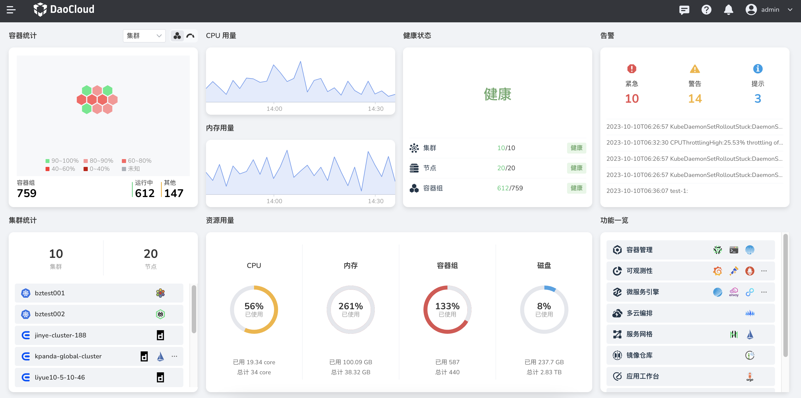

---
hide:
  - toc
---

# DaoCloud Enterprise 5.0

DaoCloud Enterprise 5.0 (DCE 5.0) 是一款高性能、可扩展的云原生操作系统。
它能够在任何基础设施和任意环境中提供一致、稳定的体验，支持异构云、边缘云和多云编排。
DCE 5.0 集成了服务网格和微服务技术，结合最新的 AI 引擎，能够跟踪每一个流量的生发始终，
帮助您洞察集群、节点、应用和服务的详细指标，并通过动态仪表盘和拓扑大图可视化掌握应用健康状态。

DCE 5.0 原生支持 DevOps 开发运维模式，可以实现应用交付的全流程标准化和自动化，并集成各类精选数据库和中间件，使运维治理更加高效。
各个产品模块独立解耦，支持灵活升级，对业务没有影响，并且能够与众多云原生生态产品对接，提供完整的解决方案体系。
它经过了近千家行业客户的生产场景检验，构建了坚实、可靠的数字底座，帮助企业定义数字边界，释放云原生生产力。

*[DCE]: DaoCloud Enterprise 云原生操作系统的简称

- :fontawesome-solid-jet-fighter-up: **安装** [详尽的安装教程](../install/index.md)
- :material-microsoft-azure-devops: **应用工作台** [CI/CD 流水线](../amamba/intro/index.md)
- :octicons-container-16: **容器管理** [集群/节点/负载等基础设施](../kpanda/intro/index.md)
- :material-cloud-check: **多云编排** [多云实例/负载/策略](../kairship/intro/index.md)
- :material-warehouse: **镜像仓库** [镜像集成和托管服务](../kangaroo/intro/index.md)
- :material-dot-net: **云原生网络** [多 CNI 融合方案](../network/intro/index.md)
- :floppy_disk: **云原生存储** [容器化存储综合方案](../storage/index.md)
- :material-train-car-container: **虚拟机容器** [容器化的虚拟机](../virtnest/intro/index.md)
- :material-monitor-dashboard: **可观测性** [一站式图形化仪表盘](../insight/intro/index.md)
- :material-engine: **微服务引擎** [微服务治理中心和网关](../skoala/intro/index.md)
- :material-table-refresh: **服务网格** [非侵入式服务治理](../mspider/intro/index.md)
- :material-middleware: **中间件** [ES, Kafka, MinIO, MySQL 等](../middleware/index.md)
- :fontawesome-brands-edge: **云边协同** [容器能力扩展至边缘](../kant/intro/index.md)
- :fontawesome-solid-user-group: **全局管理** [设置登录/访问权限/外观](../ghippo/intro/index.md)

DCE 5.0 云原生操作系统提供了 9 大能力，自由搭配各种模块，可以应对海量应用场景。

这些模块就像乐高搭积木一样，糅合社区最优秀的几十种开源技术，经过众多辩证选型、攻坚克难、编码调试、海量测试，“十年磨一剑，一朝试锋芒”，全新搭建的新一代容器化平台能够满足企业上云的各类场景需求。

=== "多云编排"

    支持多云和混合云的统一集中管理，提供跨云资源检索及跨云的应用部署、发布和运维能力，实现多云应用高效管控，提供基于集群资源的应用弹性扩缩，实现全局负载均衡，具备故障恢复能力，有效解决多云应用灾备问题，助力企业构建多云、混合云的数字基础设施。

    **涉及的模块**：[全局管理](../ghippo/intro/index.md)、[容器管理](../kpanda/intro/index.md)、[多云编排](../kairship/intro/index.md)、
    [云原生网络](../network/intro/index.md)、[云原生存储](../storage/index.md)、信创异构

    多云应用的跨区域/集群分发机制如下：

    

=== "数据中间件服务"

    专为有状态应用设计的云原生本地存储能力，满足中间件高 I/O 的存储需求，提升运维管理效率。精选各类数据库、分布式消息和日志检索等中间件，
    提供多租户、部署、观测、备份、运维操作等全生命周期的中间件管理能力，实现数据服务的自助化申请、弹性扩展、高并发处理和稳定高可用。

    **涉及的模块**：[全局管理](../ghippo/intro/index.md)、[容器管理](../kpanda/intro/index.md)、[云原生网络](../network/intro/index.md)、
    [云原生存储](../storage/index.md)、[精选中间件](../middleware/index.md)

    

=== "微服务治理"

    提供非侵入式流量治理功能，支持无感接入传统微服务、云原生微服务和开源微服务框架，实现企业现有微服务体系及新旧微服务体系的融合治理，
    支持微服务从开发、部署、接入、观测、运维的全生命周期管理，提供高性能云原生微服务网关，保证微服务应用的连续可用性；引入自主开源的 eBPF 网格加速技术，全面提高流量转发效率。

    **涉及的模块**：[全局管理](../ghippo/intro/index.md)、[容器管理](../kpanda/intro/index.md)、[微服务引擎](../skoala/intro/index.md)、
    [服务网格](../mspider/intro/index.md)、[可观测性](../insight/intro/index.md)、[应用工作台](../amamba/intro/index.md)、
    [云原生网络](../network/intro/index.md)、[云原生存储](../storage/index.md)

    

=== "可观测性"

    基于日志、链路、指标、eBPF 等技术手段，全面采集服务数据，深入获取请求链路信息，动态观测、多维度掌控集群、节点、应用和服务的实时变化，
    通过统一控制面实现所有集群及负载观测数据的查询，引入拓扑分析技术可视化掌握应用健康状态，实现秒级故障定位。

    *[eBPF]: Extended Berkeley Packet Filter，这是 Linux 内核自带的组件，可以在内核中运行沙盒程序

    **涉及的模块**：[全局管理](../ghippo/intro/index.md)、[容器管理](../kpanda/intro/index.md)、[可观测性](../insight/intro/index.md)、
    [云原生网络](../network/intro/index.md)、[云原生存储](../storage/index.md)

    

=== "应用商店"

    收录来自大数据、AI、中间件等十大领域生态伙伴的软件产品，实现生态技术、产品、运营服务等能力的整合，提供开箱即用的生态应用软件，面向企业实际业务需求，打造完整的解决方案体系。

    **涉及的模块**：[全局管理](../ghippo/intro/index.md)、[容器管理](../kpanda/intro/index.md)、[云原生网络](../network/intro/index.md)、
    [云原生存储](../storage/index.md)、应用商店、产品生态

=== "应用交付"

    通过一致性可推广的应用交付流程实现自助式上云，支持柔性租户体系，动态适配用户组织架构规划和实时资源分配，基于云原生化的 CI/CD 流水线，
    集成丰富的工具链并支持流水线高效并发执行流转，自动化完成应用的构建、部署，创新性引入 Gitops、渐进式交付能力体系，实现应用更精细的管理运维。

    **涉及的模块**：[全局管理](../ghippo/intro/index.md)、[容器管理](../kpanda/intro/index.md)、[应用工作台](../amamba/intro/index.md)、
    [镜像仓库](../kangaroo/intro/index.md)、[云原生网络](../network/intro/index.md)、[云原生存储](../storage/index.md)

    

=== "信创异构"

    采用信创云原生技术架构，兼容国产芯片及服务器，支持信创操作系统及信创应用生态体系，屏蔽底层异构基础设施的复杂性，把传统操作系统从需要长期积累的软件生态兼容适配中解放出来，
    实现混合异构集群的灵活调度，保证信创应用运行环境的稳定高可靠，助力信创进程进一步提速。

    **涉及的模块**：[全局管理](../ghippo/intro/index.md)、[容器管理](../kpanda/intro/index.md)、[集群生命周期管理](../community/kubean.md)、
    [信创中间件](../middleware/index.md)、[云原生网络](../network/intro/index.md)、[云原生存储](../storage/index.md)

    

=== "云边协同"

    将云原生能力延伸至边缘，采用边缘集群、边缘节点模式，将数据中心算力下移，端设备算力上移，统一管控和调度离散、异构的计算资源，解决在海量边、
    端设备上统一完成大规模应用交付、运维、管控的诉求，实现云边的真正一体化。

    **涉及的模块**：[云边协同](../kant/intro/index.md)、[全局管理](../ghippo/intro/index.md)、[容器管理](../kpanda/intro/index.md)、
    [集群生命周期管理](../community/kubean.md)、[云原生网络](../network/intro/index.md)、[云原生存储](../storage/index.md)、弱网集群

    

=== "云原生底座"

    提供云原生计算、[网络](../network/intro/index.md)、存储等能力，兼容各种集群接入，支持集群从部署、版本升级、证书变更、配置变更、回收等全生命周期管理，突破
    K8s API 性能瓶颈，实现企业超大规模用户并发使用多集群。针对企业环境，提供场景化的网络方案，实现当前企业网络基础设施复用的最大化，降低企业使用云原生应用门槛。

    - **云原生计算内核**：抽象底层基础设施，为上次应用及其它模块提供计算、存储等强大内核能力。
    - **云原生网络内核**：适配 overlay、underlay 等网络环境，支持 Spiderpool、Cillium、Macvlan、Multus 等多种网络模式
    - **云原生安全内核**：融合 RBAC 权限认证体系，为运维安全保驾护航

    **涉及的模块**：[全局管理](../ghippo/intro/index.md)、[容器管理](../kpanda/intro/index.md)、[集群生命周期管理](../community/kubean.md)、
    [云原生网络](../network/intro/index.md)、[云原生存储](../storage/index.md)

    

在成功获取[许可证授权](./license0.md)后，首次登录 DCE 5.0 将会呈现一个仪表盘。
该仪表盘以直观的方式展示了各种信息，包括正在运行的容器和 Pod、CPU 和内存使用情况、集群/节点/Pod 的健康状态、告警信息、资源利用情况以及功能一览等内容。

[下载 DCE 5.0](../download/index.md){ .md-button .md-button--primary }
[安装 DCE 5.0](../install/index.md){ .md-button .md-button--primary }
[申请社区免费体验](./license0.md){ .md-button .md-button--primary }
