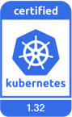

---
hide:
  - toc
---

# Kubernetes 认证服务商

CNCF 社区为各国的 Kubernetes 平台服务商提供了合规认证服务，以此证明这些服务商的资质和能力。

DaoCloud 是[经 CNCF 官方认证的 Kubernetes 提供商](https://landscape.cncf.io/?group=certified-partners-and-providers&item=platform--certified-kubernetes-distribution--daocloud-enterprise)，
即 Kubernetes Certified Service Provider (KCSP)，早在 2017 年就顺利通过了 Kubernetes 的官方认证，是国内最早涉足并得到 CNCF 官方认可的提供商。
我们常年积极参与 CNCF 相关社区贡献，引领社区技术潮流。每次 Kubernetes 新版本发布，都会率先适配增强新特性，并将其推向实际生产环境。

## Kubernetes AI Conformance

随着 AI/ML 工作负载对计算资源和硬件加速的需求爆发式增长，CNCF 推出 [Kubernetes AI Conformance](https://github.com/cncf/ai-conformance) 认证标准，在基础 [Kubernetes Conformance](https://github.com/cncf/k8s-conformance) 认证之上，定义了 AI 场景专属的功能、API 和配置要求，为 AI 工作负载的跨环境移植、高效运行提供统一基准。

通过认证的平台可获得 CNCF 官方授权使用 AI Conformance 标识，成为行业认可的 AI 友好型 Kubernetes 发行版。

<figure markdown="span">
  { width="200" }
</figure>

作为国内开源事业的领军企业，DaoCloud 紧跟云原生 AI 发展潮流。在社区推出 Kubernetes AI Conformance 合规标准后，率先针对目前广泛使用的 Kubernetes v1.33 启动 [DCE 5.0](https://docs.daocloud.io/) 平台的 AI Conformance 测试，并于 2025 年 10 月[成功通过认证](https://github.com/cncf/ai-conformance/pull/13)， 成为国内首个在该版本获得认证的企业级 AI/ML 平台。

## Kubernetes Conformance

作为一家经过官方严格审核的 Kubernetes 服务提供商，DaoCloud 在帮助企业采用 Kubernetes 成功部署大规模集群方面有深厚的经验。

DaoCloud 作为一家经验丰富的 KCSP 意味着：

- DaoCloud 是 [Kubernetes 官方推荐的资深合作伙伴](https://kubernetes.io/partners/)
- DaoCloud 是经 CNCF 社区公认、有专家资质、能充分胜任 Kubernetes 集群部署专业工作的优良企业
- 最终用户选用 Kubernetes 部署集群时，DaoCloud 是 CNCF 云原生社区公认并推荐的品牌供应商
- 常年位列 KCSP 的 DaoCloud 掌握云原生领域领先技术，时刻引领云原生社区发展方向

目前 DaoCloud 经授权合规的 Kubernetes 版本包括但不限于：

K8s 官方维护的当前 4 个版本：

K8s 官方不再维护（但 DaoCloud [KLTS](https://klts.io/) 会持续维护）的历史版本：

<!--
Source: https://github.com/cncf/artwork/tree/master/projects/kubernetes/certified-kubernetes
-->

有关 DaoCloud 开源贡献的更多信息，请参阅博客 [DaoCloud 是 K8s 资深认证服务商](../blogs/2022/221116-kcsp.md)。

[下载 DCE 5.0](../download/index.md){ .md-button .md-button--primary }
[安装 DCE 5.0](../install/index.md){ .md-button .md-button--primary }
[申请社区免费体验](license0.md){ .md-button .md-button--primary }
