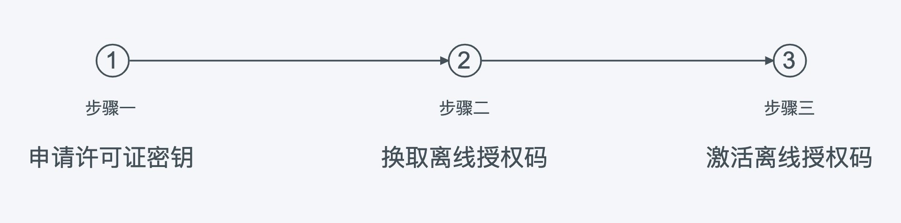
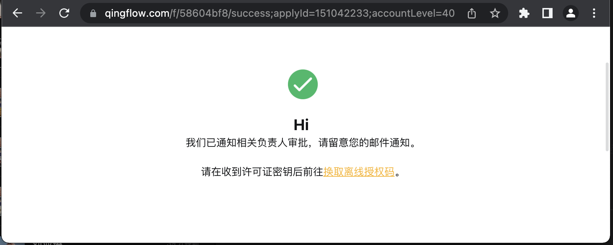
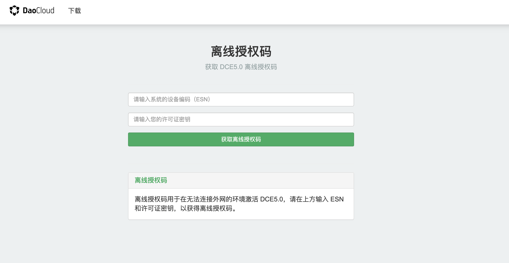
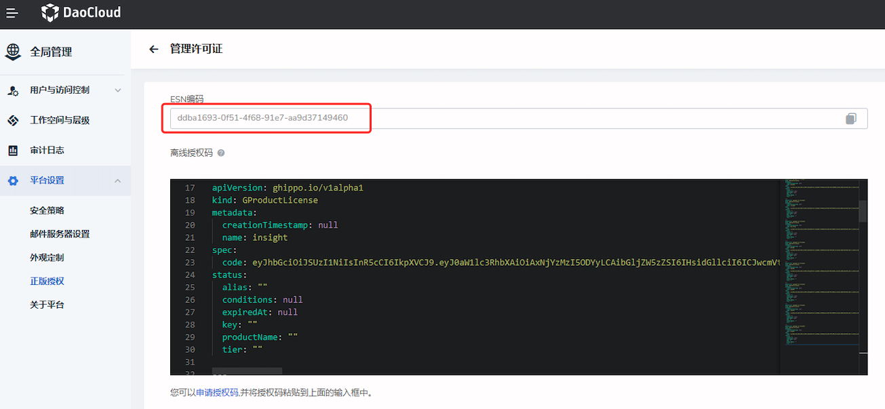

---
hide:
  - toc
---

# 免费申请「DCE 5.0 社区版」

DCE 5.0 社区版包含的模块为[全局管理](../ghippo/intro/what.md)、[容器管理](../kpanda/intro/what.md)、[可观测性](../insight/intro/what.md)等模块。
建议[下载](../download/dce5.md)并[安装 DCE 5.0](../install/community/k8s/online.md) 之后，参照以下步骤进行激活。

具体操作步骤为：

1. 点击 [申请许可证密钥](https://qingflow.com/f/58604bf8){ .md-button } ，填写表单后点击`提交`。

    

2. 按屏幕提示，打开邮箱查看包含许可证密钥的邮件，然后点击 [换取离线授权码](https://license.daocloud.io/dce5-license){ .md-button } 。

    

3. 输入上一步的许可证密钥，输入设备独有的 ESN 后，点击`获取离线授权码`。

    

    其中 ESN 是集群系统独有的设备编码。
    具体获取方式为：打开 DCE，点击左侧导航栏`全局管理` -> `平台设置` -> `正版授权`，点击`管理许可证`按钮，打开`管理许可证`页面，复制 ESN 编码。

    

4. 复制并粘贴上一步换取的离线授权码，点击`立即激活`。恭喜您！现在可以探索全新的 DCE 5.0 啦！

!!! info "📢 温馨提示"

    离线授权码与设备 ESN 绑定，请妥善保存好许可证密钥邮件。
    您可以随时联系 DaoCloud 交付团队重新申请，我们已为您保存好所有许可密钥。

    上述激活过程中常用到的几个页面汇总如下：

    [申请许可证密钥](https://qingflow.com/f/58604bf8){ .md-button .md-button--primary }
    [查看许可证密钥](https://license.daocloud.io/dce5-licenses){ .md-button .md-button--primary }
    [换取离线授权码](https://license.daocloud.io/dce5-license){ .md-button .md-button--primary }
    [安装 DCE 5.0](../install/intro.md){ .md-button .md-button--primary }
