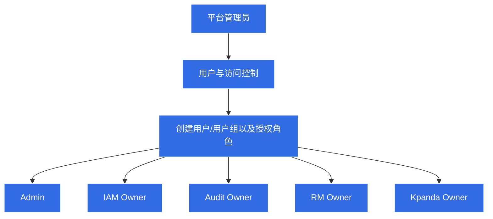

# 全局管理模式

## 适用场景

如果您需要为子模块设置管理员，通过管理员进一步管理用户/用户组权限，那么可以通过用户与访问控制中的角色实现。拥有该角色表示拥有该子模块的最高管理权限。

!!! note

    权限管理有三种模式，当前为全局管理模式。用户与访问控制中的角色代表各个子模块的最高权限。具体查看[权限管理](role.md)。

一个角色对应一组权限。权限决定了可以对资源执行的操作。向用户授予某角色，即授予该角色所包含的所有权限。

## 用户与访问控制角色

在用户与访问控制中预定义了 4 个角色，分别是：Admin、IAM Owner、Audit Owner 和 Kpanda Owner。这 4 个角色由系统创建，用户只能使用不能修改。角色对应的权限如下：

| 角色名称     | 角色类型 | 所属模块       | 角色权限                                                     |
| ------------ | -------- | -------------- | ------------------------------------------------------------ |
| Admin        | 系统角色 | 全部           | 平台管理员，管理所有平台资源，代表平台的最高权限             |
| IAM Owner    | 系统角色 | 用户与访问控制 | 用户与访问控制的管理员，拥有该服务下的所有权限，如管理用户/用户组及授权 |
| Audit Owner  | 系统角色 | 审计日志       | 审计日志的管理员，拥有该服务下的所有权限，如设置审计日志策略，导出审计日志 |
| Kpanda Owner | 系统角色 | 容器管理       | 容器管理的管理员，拥有该服务下的所有权限，如创建/接入集群，部署应用，给用户/用户组授予集群/命名空间相关的权限 |
