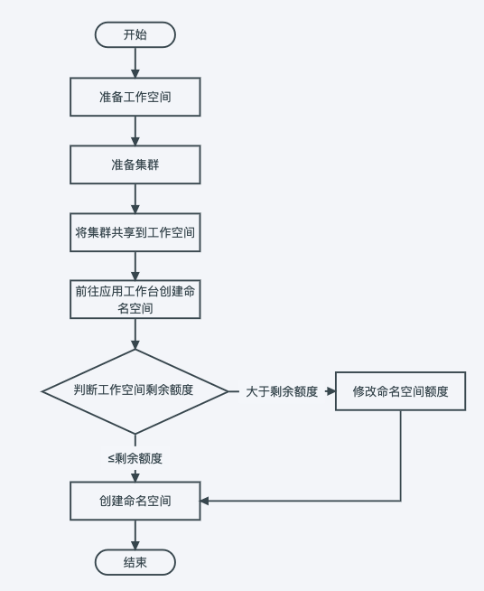
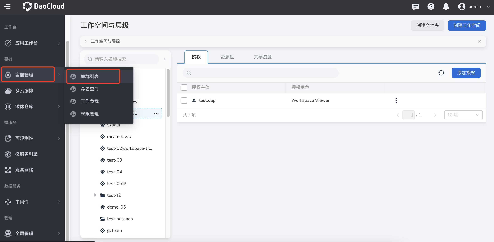
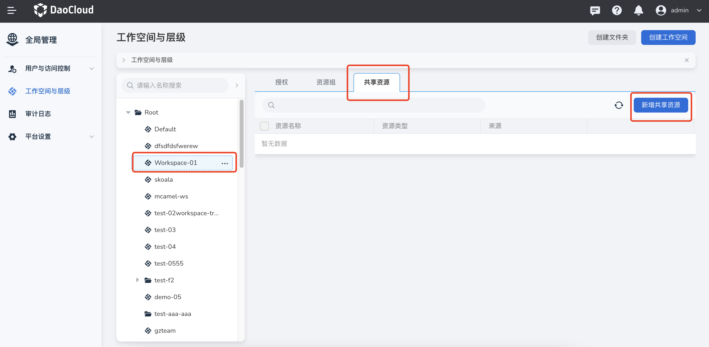
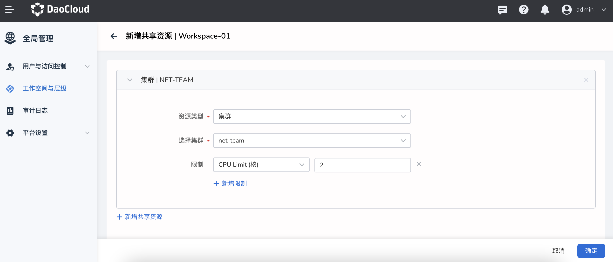

# 将一个集群分配给多个工作空间（租户）

集群资源往往掌握在运维人员手中，若要进行资源分配，常常需要运维人员创建好各个资源隔离单元 Kubernetes 命名空间，并对命名空间进行资源配额才能够实现。
对于业务量巨大的企业来说，一方面资源分配给运维人员带来了巨大工作量，另一方面对于想要灵活调配命名空间资源额度的项目来说也带来了难度。
工作空间通过共享资源功能可以提供更高维度的资源限额能力，实现工作空间（租户）在资源限额下自助式创建 Kubernetes 命名空间功能。

举例：运维人员手中有两个集群，分别是普通集群 cluster 01 和高可用集群 cluster 02，需要分别分配给部门 A 和部门 B 使用。
其中分配给部门 A 普通集群 50 quota，高可用集群 10 quota，部门 B 普通集群 100 quota，高可用集群 20 quota。
通过工作空间-共享资源功能，运维人员无需创建 KubeSphere 命名空间，只需要将集群分别共享到两个部门，并限制每个部门能够使用的资源额度。
共享后部门 A 能够前往应用工作台自助式在普通集群 cluster 01 创建一个或多个 Kubernetes 命名空间，但命名空间额度总和不超过 50 quota；
在高可用集群 cluster 02 创建一个或多个 Kubernetes 命名空间，但命名空间额度总和不超过 10 quota；部门 B 同理。

## 实现方案

将一个集群分享给多个工作空间（租户）的使用流程如下图：

## 准备一个工作空间

工作空间是为了满足多租户的使用场景，基于集群、集群命名空间、网格、网格命名空间、多云、多云命名空间等多种资源形成相互隔离的资源环境，工作空间可以映射为项目、租户、企业、供应商等多种概念。

1. 使用 admin/folder admin 角色的用户登录 Web 控制台，点击左侧导航栏底部的`全局管理`。

    

1. 点击左侧导航栏的`工作空间与层级`，点击右上角的`创建工作空间`按钮。

    

1. 填写工作空间名称、所属文件夹等信息后，点击`确定`，完成创建工作空间。

    

## 准备一个集群

工作空间是为了满足多租户的使用场景，基于集群、集群命名空间、网格、网格命名空间、多云、多云命名空间等多种资源形成相互隔离的资源环境，工作空间可以映射为项目、租户、企业、供应商等多种概念。
参照以下步骤准备一个集群。

1. 点击左侧导航栏底部的`容器管理`，选择`集群列表`。

    

1. 点击`创建集群`[创建一个集群](../../../kpanda/07UserGuide/Clusters/CreateCluster.md)，或点击`接入集群`[接入一个集群](../../../kpanda/07UserGuide/Clusters/JoinACluster.md)。

## 在工作空间添加集群

返回`全局管理`，为工作空间添加集群。

1. 依次点击`全局管理` -> `工作空间与层级` -> `共享资源`，点击某个工作空间名称后，点击`新增共享资源`按钮。

    

1. 选择集群，填写资源限额后，点击`确定`。

    

下一步：将一个集群资源分配给多个工作空间后，用户可以前往`应用工作台`在这些工作空间下[创建命名空间并部署应用](../../../amamba/03UserGuide/Namespace/namespace.md)。
