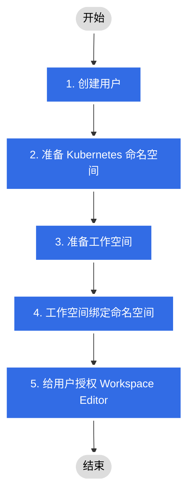

# 普通用户授权规划

普通用户是指能够使用 DCE 大部分产品模块及功能（管理功能除外），对权限范围内的资源有一定的操作权限，能够独立使用资源部署应用。

对这类用户的授权及资源规划流程如下图所示。

授权后普通用户在各模块的权限为：

- [应用工作台](../../permissions/amamba.md)
- [微服务引擎](../../permissions/skoala.md)
- [服务网格](../../permissions/mspider.md)（需要重复 2 - 4 准备网格/网格命名空间并绑定到工作空间）
- [可观测性](../../../insight/06UserGuide/permission.md)
