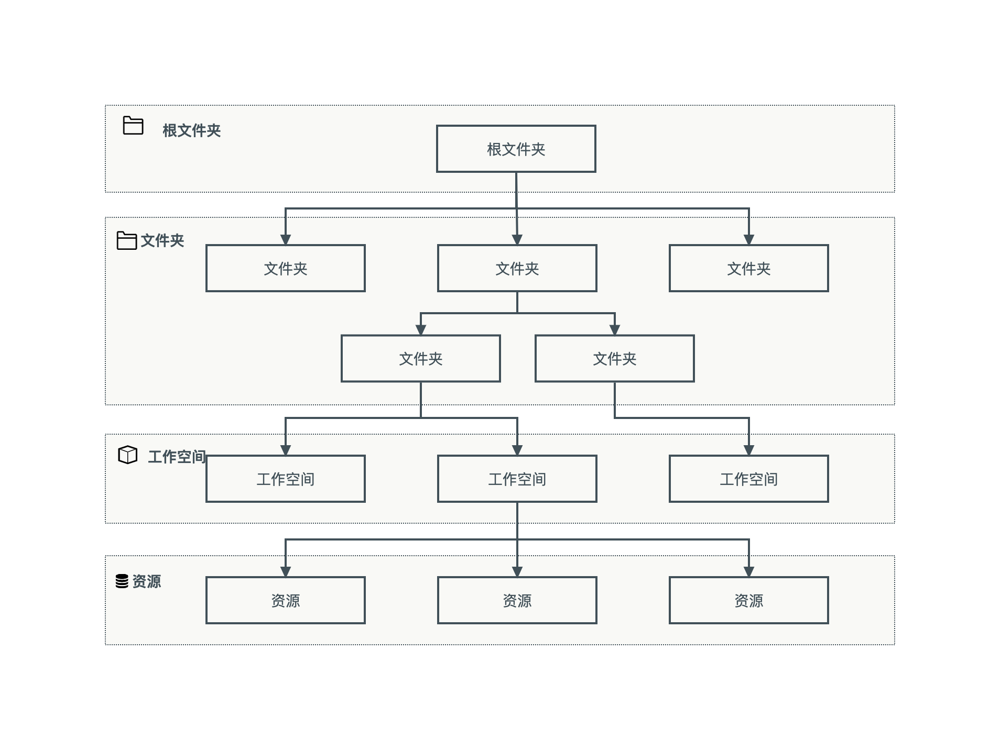

---
hide:
  - toc
---

# 工作空间与层级

工作空间与层级模块是一个具有层级的资源隔离和资源分组模块，主要解决资源统一授权、资源分组以及资源限额问题。
工作空间与层级模块有两个概念：文件夹和工作空间。
在工作空间与层级模块中您可以通过文件夹构建企业业务层级关系，通过工作空间中的资源组和共享资源管理资源，使资源管理模块的用户（用户组）之间能够共享工作空间中的资源。

资源处于资源管理模块层级结构的最低层级，资源包括 Cluster、Namespace、Pipeline、网关等。
所有这些较低层级的资源的父级只能是工作空间，而工作空间作为资源容器是一种资源分组单位。
工作空间通常代指一个项目或环境，每个工作空间的资源相对于其他工作空间中的资源时逻辑隔离的。
您可以通过工作空间中的授权，授予用户（用户组）同一组资源的不同访问权限。

从层次结构的底层算起，工作空间位于第一层，且包含资源。
除共享资源外，所有资源有且仅有一个父项。所有工作空间也有且仅有一个父级文件夹。

文件夹是在工作空间基础之上的进一步分组机制，具有层级结构。
一个文件夹可以包含工作空间、其他文件夹或两者的组合，能够形成树状的组织关系。
借助文件夹您可以映射企业业务层级关系，按照部门对工作空间进行分组。
文件夹不直接与资源挂钩，而是通过工作空间间接实现资源分组。
文件夹有且仅有一个父级文件夹，根文件夹是层次结构的最高层级，因此没有父级，文件夹和工作空间均挂靠到根文件夹下。

同时，用户（用户组）在文件夹中能够通过层级结构继承来自于父项的权限。
用户在层次结构中每个节点权限来自于直接在该节点获取的权限和继承其父项权限的组合结果，权限之间是加合关系不存在互斥。

资源通过工作空间进行分组，而工作空间中存在两种分组模式，分别是资源组和共享资源。

一个资源只能加入一个资源组，资源组与工作空间一一对应，资源被加入到资源组后，工作空间的所有者将获得资源的管理权限，相当于该资源的所有者。

而对于共享资源来说，多个工作空间可以共享同一个或者多个资源。
资源的所有者，可以选择将自己拥有的资源共享给工作空间使用，一般共享时资源所有者会限制被共享工作空间能够使用的资源额度。
资源被共享后，工作空间的所有者仅具有资源限额下的资源使用权限，无法管理资源或者调整工作空间能够使用的资源量。
同时共享资源对于资源本身也具有一定的要求，只有集群资源（cluster）可以被共享。
Cluster 资源所有者能够将 Cluster 资源分享给不同的工作空间使用，并且限制工作空间在此 Cluster 上的使用额度，工作空间所有者在资源限额内能够创建多个 Namespace，但是 Namespace 的资源额度总和不能超过 Cluster 在该工作空间的资源限额。
对于 Kubernetes 资源，当前能够分享的资源类型仅有 Cluster。
