# 工作空间（租户）绑定跨集群的命名空间

工作空间（租户）下绑定来自不同集群的命名空间，能够使工作空间（租户）灵活纳管平台上任意集群下的 Kubernetes Namespace。
同时平台提供了权限映射能力，能够将用户在工作空间的权限映射到绑定的命名空间身上。

当工作空间（租户）下绑定一个或多个跨集群的命名空间时，管理员无需再次给工作空间中的成员授权，
成员们在工作空间上的角色将根据以下映射关系自动映射完成授权，避免了多次授权的重复性操作：

- Workspace Admin 对应 Namespace Admin
- Workspace Editor 对应 Namespace Editor
- Workspace Viewer 对应 Namespace Viewer

比如用户 A 是工作空间 Workspace01 的管理员拥有 Workspace Admin 角色，
将命名空间 Namespace 01 和 命名空间 Namespace 02 绑定到 Workspace01 后，
用户 A 将自动拥有 Namespace 01 和 命名空间 Namespace 02 的管理权限，
成为 Namespace 01 和 命名空间 Namespace 02 的 Namespace Admin 角色。

## 实现方案

将来自不同集群的不同命名空间绑定到同一工作空间（租户），给工作空间（租户）下的成员使用流程如图。

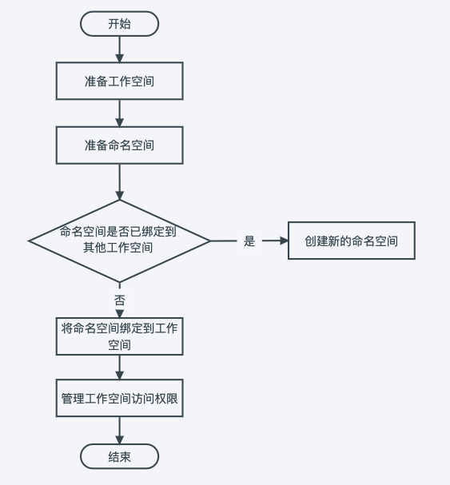

提示：一个命名空间只能被一个工作空间绑定。

## 准备工作空间

工作空间是为了满足多租户的使用场景，基于集群、集群命名空间、网格、网格命名空间、多云、多云命名空间等多种资源形成相互隔离的资源环境，工作空间可以映射为项目、租户、企业、供应商等多种概念。

1. 使用 admin/folder admin 角色的用户登录 Web 控制台，点击左侧导航栏底部的`全局管理`。

    

1. 点击左侧导航栏的`工作空间与层级`，点击右上角的`创建工作空间`按钮。

    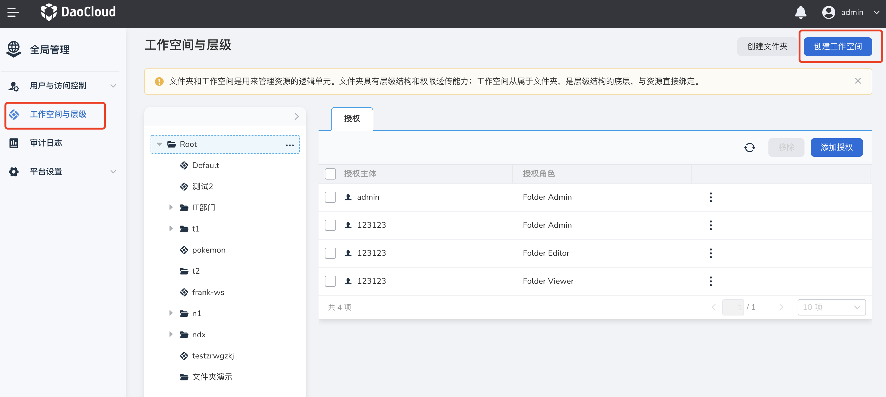

1. 填写工作空间名称、所属文件夹等信息后，点击`确定`，完成创建工作空间。

    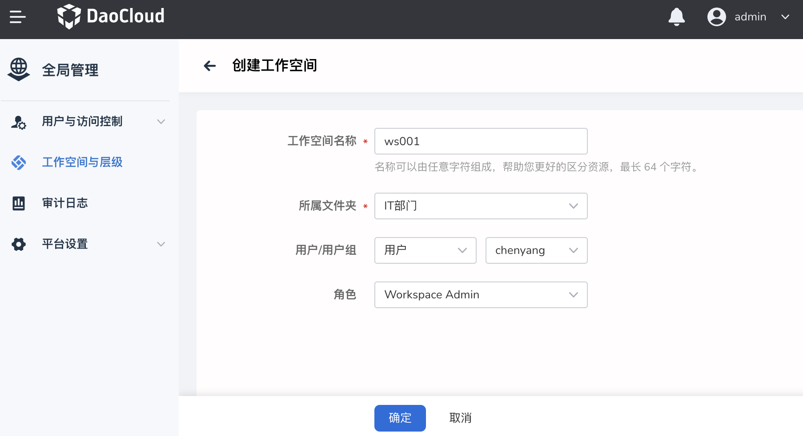

提示：若平台中已存在创建好的命名空间，点击某个工作空间，在`资源组`页签下，点击`绑定资源`，可以直接绑定命名空间。

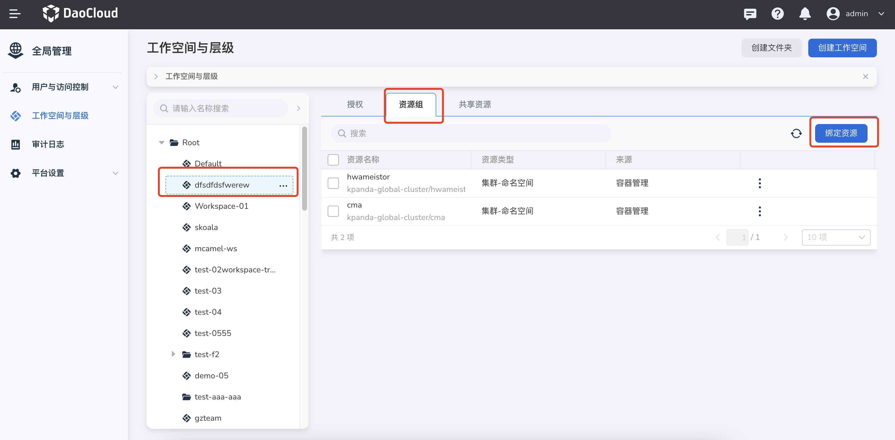

## 准备一个命名空间

集群命名空间是更小的资源隔离单元，将其绑定到工作空间后，工作空间的成员就可以进行管理和使用。
参照以下步骤准备一个还未绑定到任何工作空间的命名空间。

1. 点击左侧导航栏底部的`容器管理`。

    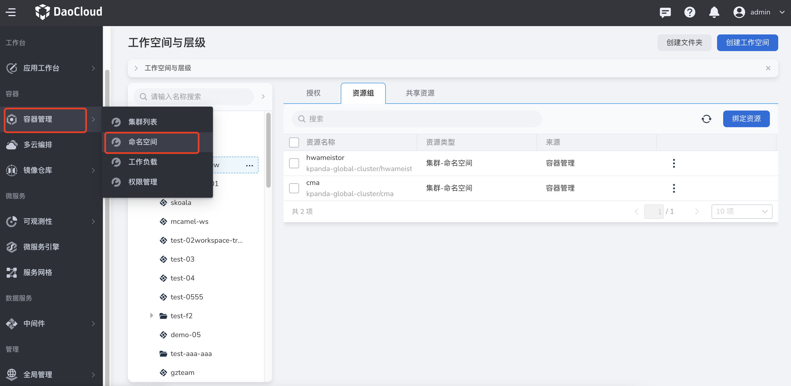

1. 点击目标集群的名称，进入`集群详情`。

    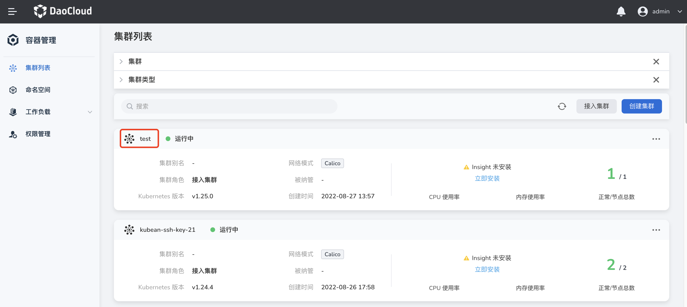

1. 在左侧导航栏点击`命名空间`，进入命名空间管理页面，点击页面右侧的`创建`按钮。

    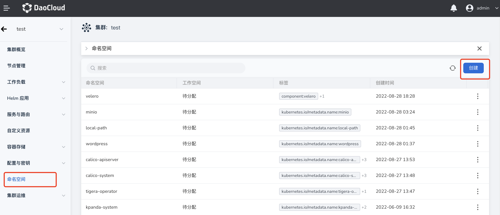

1. 填写命名空间的名称，配置工作空间和标签（可选设置），然后点击`确定`。

    !!! info

        工作空间主要用于划分资源组并为用户（用户组）授予对该资源的不同访问权限。有关工作空间的详细说明，可参考[工作空间与层级](../../../ghippo/04UserGuide/02Workspace/Workspaces.md)。

    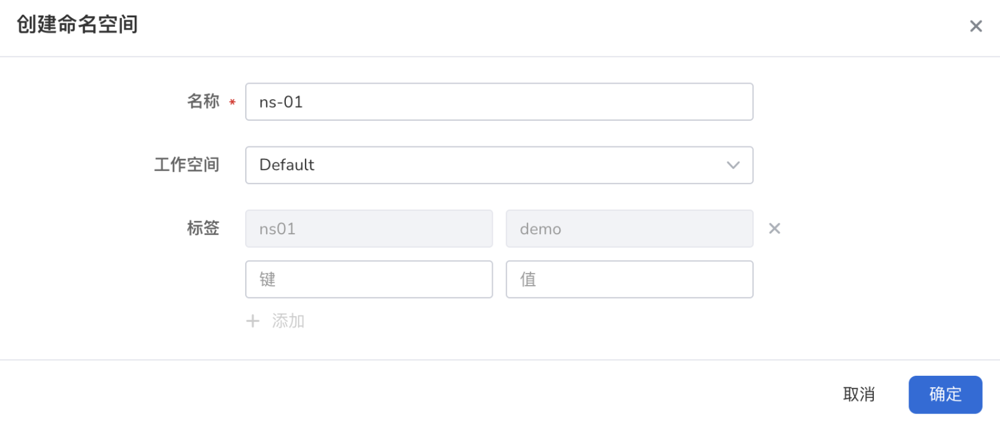

1. 点击`确定`，完成命名空间的创建。在命名空间列表右侧，点击 `⋮`，可以从弹出菜单中选择`绑定工作空间`。

    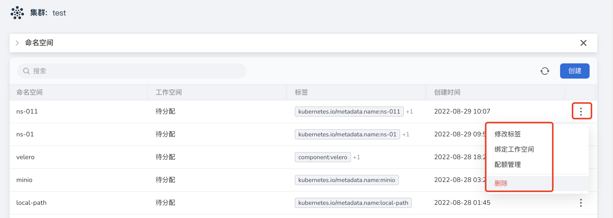

## 将命名空间绑定到工作空间

除了在命名空间列表中绑定外，也可以返回`全局管理`，按照以下步骤绑定工作空间。

1. 依次点击`全局管理` -> `工作空间与层级` -> `资源组`，点击某个工作空间名称后，点击`绑定资源`按钮。

    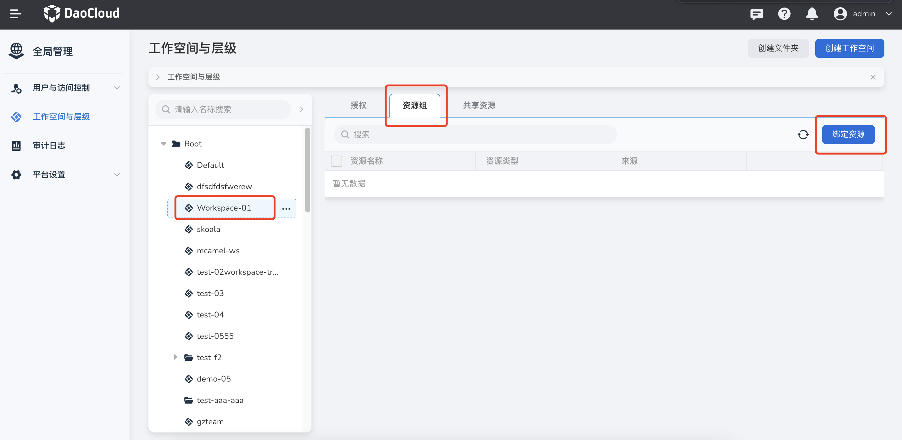

1. 选中要绑定的工作空间（可多选），点击`确定`完成绑定。

    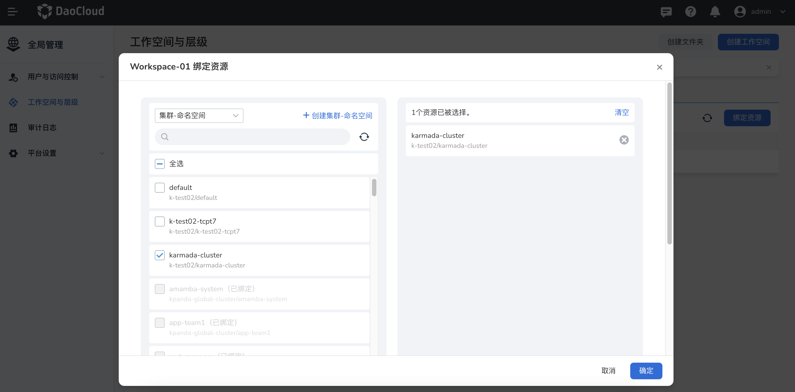

## 为工作空间添加成员并授权

1. 在 `工作空间与层级` -> `授权`中，点击某个工作空间名称后，点击`添加授权`按钮。

    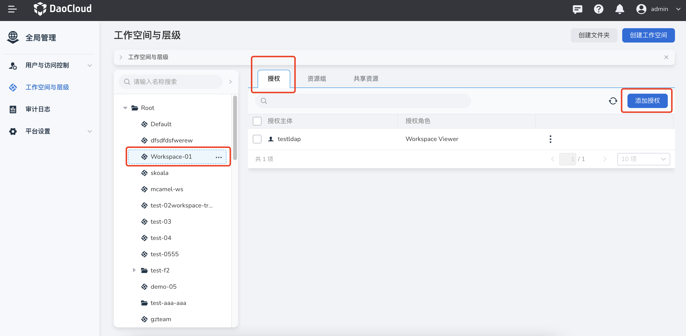

1. 选择要授权的`用户/用户组`、`角色`后，点击`确定`完成授权。

    
