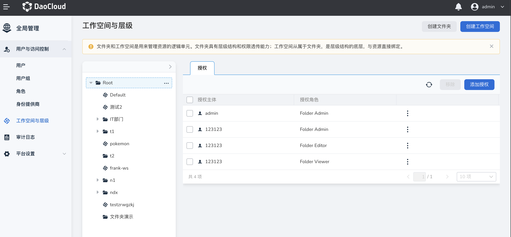

# 工作空间最佳实践

工作空间是平台中的资源分组单元，平台上大多数的资源都可以通过自动或者手动的方式绑定到某一个工作空间中，而工作空间通过授权和资源绑定，能够实现人与角色的绑定关系一次性应用到工作空间的所有资源身上。
因此通过工作空间管理团队与资源，解决跨模块的、跨集群的资源授权问题是平台推荐的最佳实践。

## 工作空间本身的作用

工作空间包含三个功能模块，分别是：授权、资源组和共享资源。主要解决资源统一授权、资源分组及资源配额问题。

1. 授权：为用户/用户组授予该工作空间的不同角色，并将角色应用到工作空间的资源身上。

    最佳实践：普通用户想要使用应用工作台、微服务引擎、服务网格、中间件模块功能，或者需要拥有容器管理、服务网格中部分资源的使用权限时，需要管理员授予该工作空间的使用权限（Workspace Admin、Workspace Edit、Workspace View）。
    这里的管理员可以是 Admin 角色、该工作空间的 Workspace Admin 角色或者该工作空间上层的 Folder Admin 角色的用户。
    查看 [Folder 与 Workspace 的关系](ws-folder.md)。

2. 资源组：资源组和共享资源是工作空间的两种资源管理模式。

    资源组支持 cluster、Cluster-Namespace (跨集群)、Mesh、Mesh-Namespace 四种资源类型。
    一个资源只能绑定一个资源组，资源被绑定到资源组后，工作空间的所有者将拥有该资源的所有管理权限，相当于该资源的所有者，因此不受资源配额的限制。

    最佳实践：运维部门手中有大量的 cluster、Cluster-Namespace (跨集群)、Mesh、Mesh-Namespace 资源需要分配给不同的部门使用，比如将 Cluster-Namespace 01 分配给部门 A（工作空间 A）使用，Cluster-Namespace 02 分配给部门 B（工作空间 B）使用。
    而部门中存在大量成员，不同成员需要对资源拥有不同的操作权限，比如部门管理员能够管理资源，核心成员能够使用资源等。
    常用的做法是运维部门给不同的用户/用户组授予不同的操作权限，然而随着部门人数和资源数量的增加，资源分配工作繁琐且工作量巨大。
    而工作空间可以有效解决这类问题，通过“授权”功能可以给部门成员授予不同角色权限，而工作空间能够把人与角色的授权关系一次性应用到工作空间的所有资源身上，因此运维人员只需要将资源绑定到资源组，部门中的管理员（Workspace Admin）就自动拥有了该资源的管理权限，部门中的核心成员（Workspace Edit）就自动拥有了资源的使用权限，部门中的其他成员（Workspace View）就自动拥有了资源的只读权限，极大的减少了运维部门的工作量，提高了资源分配效率。

3. 共享资源：共享资源功能主要针对集群资源。

    一个集群可以共享给多个工作空间使用（指工作空间中的共享资源模块）；一个工作空间也可以同时使用多个集群的资源。
    但是资源共享不意味着被共享者（工作空间）可以无限的使用被共享的资源（集群），因此通常会限制被共享者（工作空间）能够使用的资源限额。
    同时，与资源组不同，工作空间成员只是共享资源的使用者，能够在资源限额下使用集群中的资源比如前往应用工作台创建命名空间、部署应用等，而不具有集群的管理权限，限制后在该工作空间下创建/绑定的命名空间的资源配额总和不能超过集群在该工作空间设置的资源使用上限。

    最佳实践：运维部门手中有一个高可用集群 01，想要分配给部门 A（工作空间 A）和部门 B（工作空间 B）使用，其中部门 A 分配 CPU 50 核，部门 B 分配 CPU 100 核。
    那么可以借用共享资源的概念，将集群 01 分别共享给部门 A 和部门 B，并限制部门 A 的 CPU 使用额度为 50，部门 B 的 CPU 使用额度为 100。
    那么部门 A 的管理员（工作空间 A Admin）能够在应用工作台创建并使用命名空间，其中命名空间额度总和不能超过 50 核，部门 B 的管理员（工作空间 B Admin）能够在应用工作台创建并使用命名空间，其中命名空间额度总和不能超过 100 核。
    部门 A 的管理员和部门 B 管理员创建的命名空间会被自动绑定在该部门，部门中的其他成员将对应的拥有命名空间的 Namesapce Admin、Namesapce Edit、Namesapce View 角色（这里部门指的是工作空间，工作空间还可以映射为组织、供应商等其他概念）。

## 工作空间对其他模块的作用

1. 模块名称：应用工作台、微服务引擎、服务网格、中间件模块

    作用：进入上述模块的前提是拥有某个工作空间的权限，因此在使用模块功能前您必须是 Admin 角色或者拥有某个工作空间的一定角色权限。
    同时，您在工作空间的角色也会自动的应用到工作空间的资源身上。比如当您拥有工作空间 A 的 Workspace Admin 角色，那么对于工作空间中的所有资源您都是 Admin(管理员)角色；
    如果您是 Workspace Edit，那么对于工作空间中的所有资源您都是 Edit (使用者)角色；如果您是 Workspace View，那么对于工作空间中的所有资源您都是 View (只读)角色。
    另外，您在这些模块创建的资源也将自动被绑定到对应的工作空间中，而不需要其他额外的操作。

2. 模块名称：容器管理、服务网格

    作用：由于功能模块的特殊性，在容器管理模块创建的资源不会自动被绑定到某个工作空间。
    如果您需要通过工作空间对人和资源进行统一授权管理，您可以手动将需要的资源绑定到某个工作空间中，从而将用户在工作空间的角色应用到资源身上（这里的资源是可以跨集群的）。
    另外，在资源的绑定入口上容器管理与服务网格稍有差异，工作空间提供了容器管理中的 Cluster 和 Cluster-Namesapce 资源的绑定入口，但尚未开放对服务网格的 Mesh 和 Mesh-Namespace 资源的绑定，因此 Mesh 和 Mesh-Namespace 资源的资源您可以在服务网格的资源列表进行手动绑定。

## 工作空间的使用场景

- 映射为不同的部门、项目、组织等概念，同时可以将工作空间中 Workspace Admin、Workspace Edit 和 Workspace View 角色对应到部门、项目、组织中的不同角色
- 将不同用途的资源加入不同的工作空间中分开管理和使用
- 为不同工作空间设置完全独立的管理员，实现工作空间范围内的用户与权限管理
- 将资源共享给不同的工作空间使用，并限制工作空间能够使用的资源额度上限。
