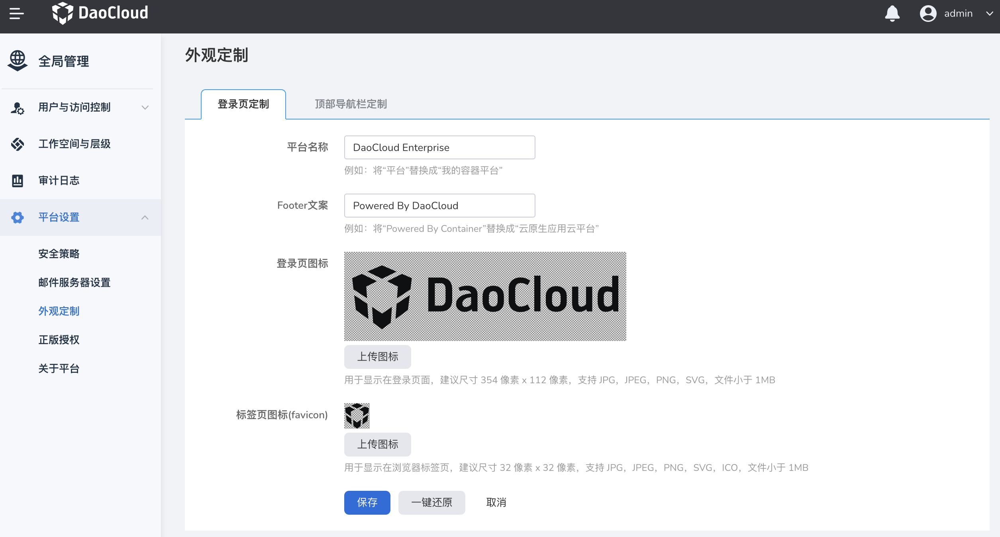
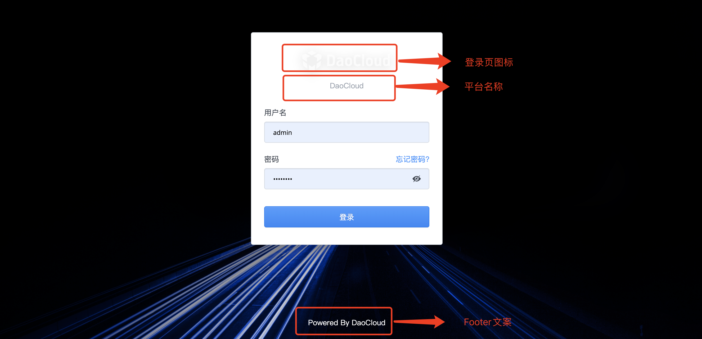
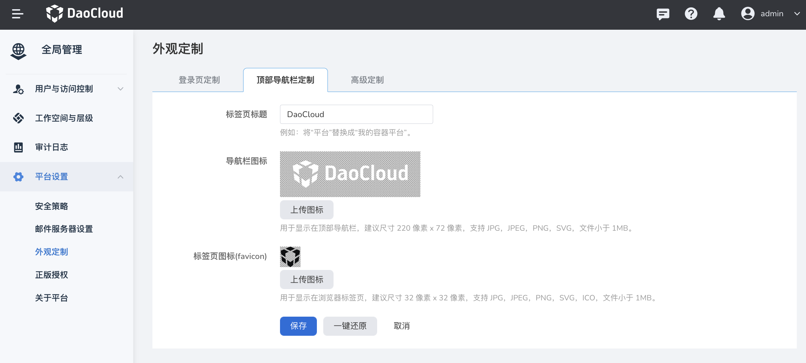

---
hide:
  - toc
---

# 外观定制

在 DCE 5.0 中，可通过`外观定制`更换登录界面及顶部导航栏的 logo，帮助用户更好地辨识产品。

操作步骤如下。

1. 使用具有 `admin` 角色的用户登录 Web 控制台。点击左侧导航栏底部的`全局管理`。

    

2. 点击`平台设置`，选择`外观定制`。

    

3. 在`登录页定制`页签中，修改登录页的图标和文字后，点击`保存`。

    

4. 点击`顶部导航栏定制`页签，修改导航栏的图标和文字后，点击`保存`。

    

!!! note

    如果想要恢复默认设置，可以点击`一键还原`。请注意，一键还原后将丢弃所有自定义设置。
