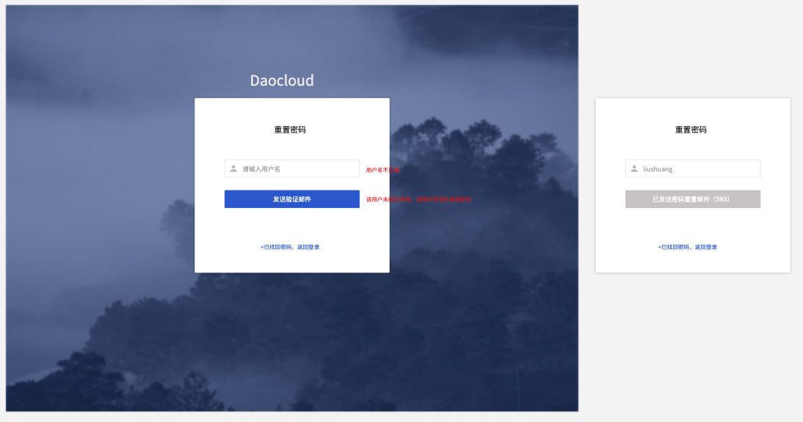
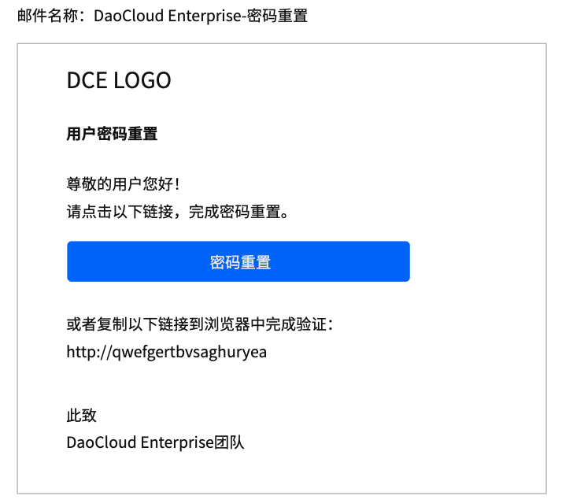
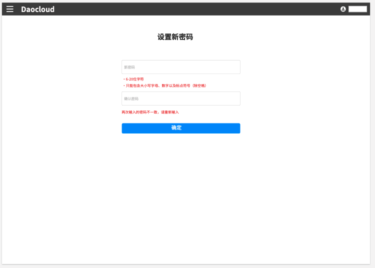
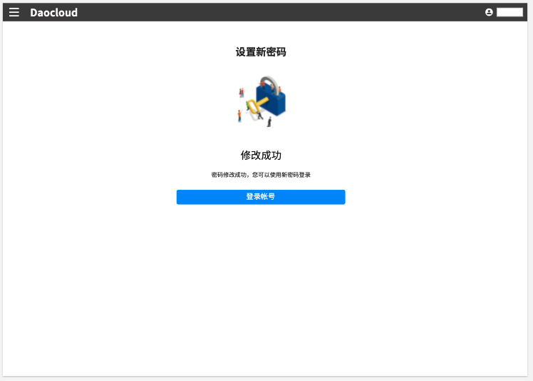
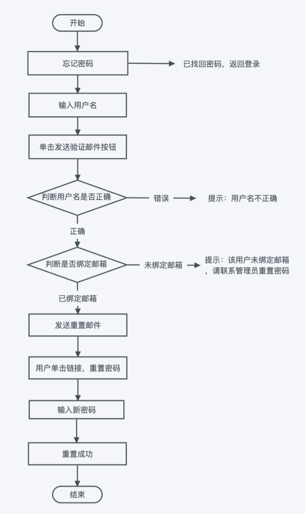

# 密码重置

如果您忘记密码，可以按本页面说明重置密码。

## 重置密码步骤

管理员最初创建一个用户时，会为其设置用户名和密码。
该用户登录后，在`个人中心`填写邮箱并修改密码。
若该用户未设置邮箱，则只能联系管理员进行密码重置。

1. 如果用户忘记了密码，可以在登录界面点击`忘记密码`。

    

2. 输入用户名，点击`提交`。

   为防止滥发邮件，点击`提交`后，该按钮将变灰并显示一个为期 1 分钟的倒计时。
   如果 1 分钟后还未收到邮件，请再次点击此按钮。

    

3. 在邮箱中找到密码重置邮件，点击`密码重置`按钮。

    

4. 按照屏幕提示，设置新密码，点击`确定`。设置新密码的要求与创建用户时的密码规则一致。

    

5. 屏幕提示密码修改成功。

    

## 重置密码流程

整个密码重置的流程示意图如下。

