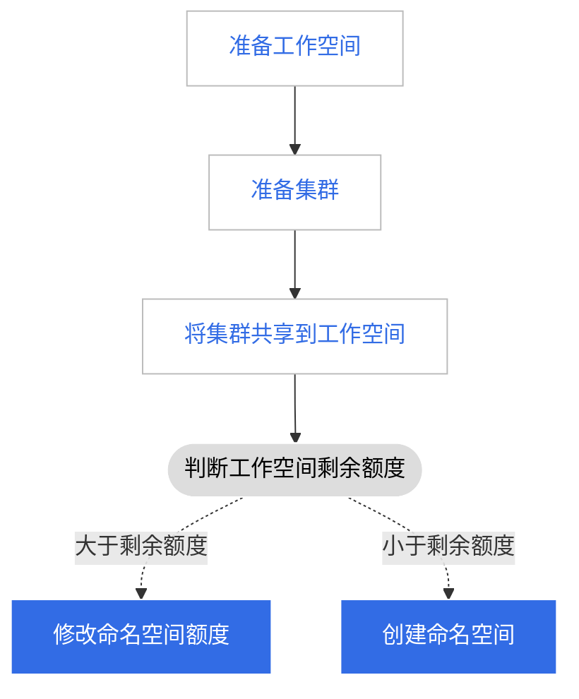

# 将集群分配给多个工作空间（租户）

集群资源通常由运维人员进行管理。在分配资源分配时，他们需要创建命名空间来隔离资源，并设置资源配额。
这种方式有个弊端，如果企业的业务量很大，手动分配资源需要较大的工作量，而想要灵活调配资源额度也有不小难度。

DCE 为此引入了工作空间的概念。工作空间通过共享资源可以提供更高维度的资源限额能力，实现工作空间（租户）在资源限额下自助式创建 Kubernetes 命名空间的能力。

举例而言，如果想要让几个部门共享不同的集群。

|                   | Cluster01（普通） | Cluster02（高可用） |
| ----------------- | ----------------- | ------------------- |
| 部门（工作空间）A | 50 quota          | 10 quota            |
| 部门（工作空间）B | 100 quota         | 20 quota            |

可以参照以下流程将集群分享给多个部门/工作空间/租户：

## 准备一个工作空间

工作空间是为了满足多租户的使用场景，基于集群、集群命名空间、网格、网格命名空间、多云、多云命名空间等多种资源形成相互隔离的资源环境，
工作空间可以映射为项目、租户、企业、供应商等多种概念。

1. 使用 admin/folder admin 角色的用户登录 DCE 5.0，点击左侧导航栏底部的`全局管理`。

    

2. 点击左侧导航栏的`工作空间与层级`，点击右上角的`创建工作空间`按钮。

    

3. 填写工作空间名称、所属文件夹等信息后，点击`确定`，完成创建工作空间。

    

## 准备一个集群

工作空间是为了满足多租户的使用场景，基于集群、集群命名空间、网格、网格命名空间、多云、多云命名空间等多种资源形成相互隔离的资源环境，工作空间可以映射为项目、租户、企业、供应商等多种概念。

参照以下步骤准备一个集群。

1. 点击左侧导航栏底部的`容器管理`，选择`集群列表`。

    

1. 点击`创建集群`[创建一个集群](../../kpanda/user-guide/clusters/create-cluster.md)，或点击`接入集群`[接入一个集群](../../kpanda/user-guide/clusters/integrate-cluster.md)。

## 在工作空间添加集群

返回`全局管理`，为工作空间添加集群。

1. 依次点击`全局管理` -> `工作空间与层级` -> `共享资源`，点击某个工作空间名称后，点击`新增共享资源`按钮。

    

1. 选择集群，填写资源限额后，点击`确定`。

    

下一步：将集群资源分配给多个工作空间后，用户可以前往`应用工作台`在这些工作空间下[创建命名空间并部署应用](../../amamba/user-guide/namespace/namespace.md)。
